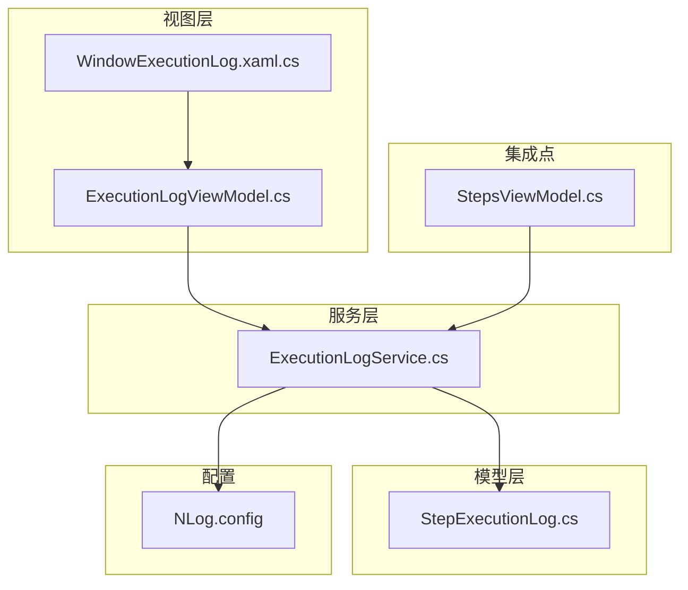
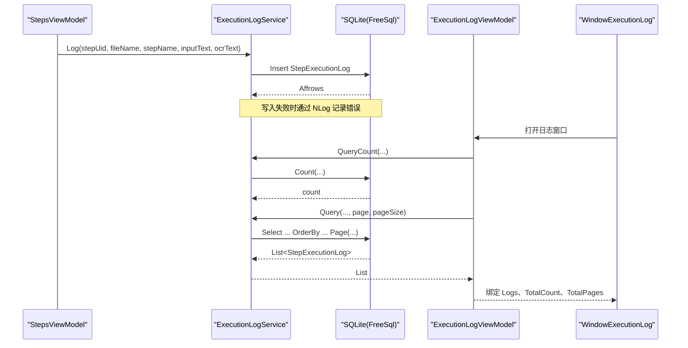
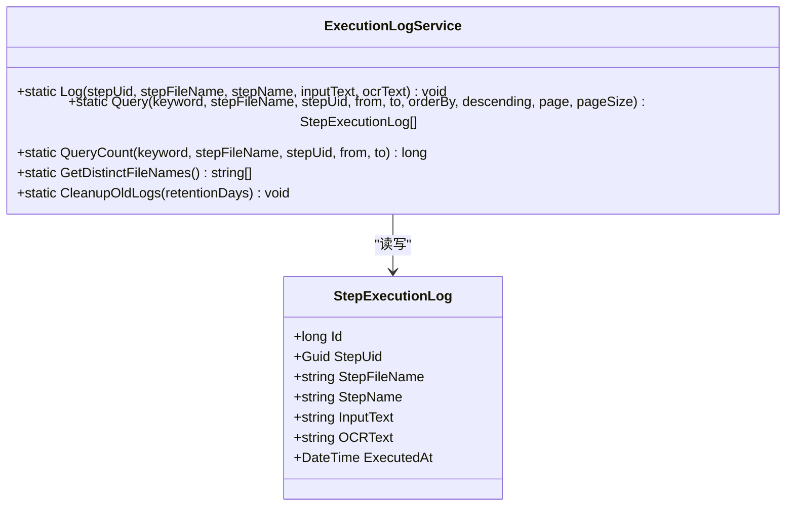
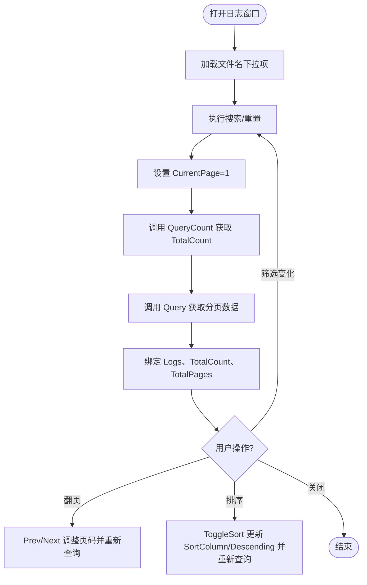
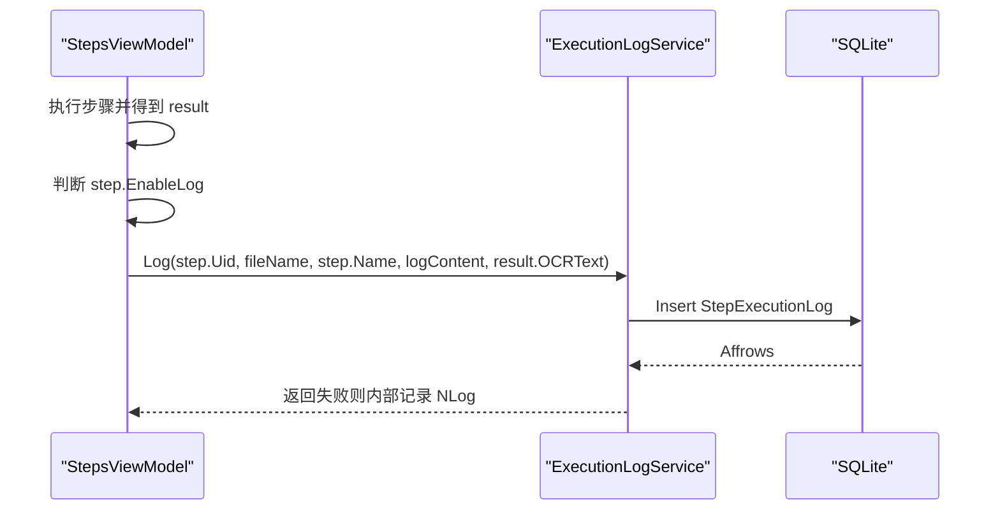
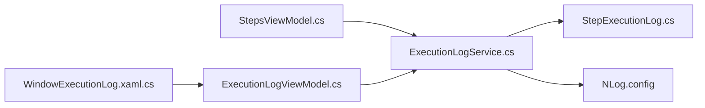

# 执行日志服务 (ExecutionLogService)

<cite>
**本文引用的文件**   
- [ExecutionLogService.cs](file://ShaoLu/Services/ExecutionLogService.cs)
- [StepExecutionLog.cs](file://ShaoLu/Models/StepExecutionLog.cs)
- [ExecutionLogViewModel.cs](file://ShaoLu/Viewmodels/ExecutionLogViewModel.cs)
- [WindowExecutionLog.xaml.cs](file://ShaoLu/Views/WindowExecutionLog.xaml.cs)
- [StepsViewModel.cs](file://ShaoLu/Viewmodels/StepsViewModel.cs)
- [NLog.config](file://ShaoLu/NLog.config)
</cite>

## 目录
1. [简介](#简介)
2. [项目结构](#项目结构)
3. [核心组件](#核心组件)
4. [架构总览](#架构总览)
5. [详细组件分析](#详细组件分析)
6. [依赖关系分析](#依赖关系分析)
7. [性能与异步写入](#性能与异步写入)
8. [查询、过滤与导出](#查询过滤与导出)
9. [问题诊断与性能分析](#问题诊断与性能分析)
10. [日志轮转、存储管理与清理策略](#日志轮转存储管理与清理策略)
11. [集成示例（步骤中启用日志）](#集成示例步骤中启用日志)
12. [故障排查指南](#故障排查指南)
13. [结论](#结论)

## 简介
本文件为 ShaoLu 应用的“执行日志服务”提供系统化文档。重点说明 ExecutionLogService 的设计目标与核心能力：在自动化步骤执行过程中，持久化记录每次执行的输入、OCR 结果、时间戳等关键信息；并提供分页查询、关键字搜索、按文件/UID/时间范围筛选、排序与统计等功能。同时解释 StepExecutionLog 模型字段含义、数据库存储机制、以及通过 NLog 实现的异步日志输出。最后给出如何集成到自动化步骤中的实践建议与排障要点。

## 项目结构
执行日志相关代码分布在 Services、Models、Viewmodels、Views 四个层次：
- Services：ExecutionLogService（数据访问与业务方法）
- Models：StepExecutionLog（持久化实体）
- Viewmodels：ExecutionLogViewModel（UI 层的数据绑定、分页、排序、筛选）
- Views：WindowExecutionLog（界面交互与事件处理）
- 集成点：StepsViewModel（在执行流程中调用日志服务）
- 配置：NLog.config（应用级日志的异步输出）

**图表来源** 
- [WindowExecutionLog.xaml.cs:1-47](file://ShaoLu/Views/WindowExecutionLog.xaml.cs#L1-L47)
- [ExecutionLogViewModel.cs:1-230](file://ShaoLu/Viewmodels/ExecutionLogViewModel.cs#L1-L230)
- [ExecutionLogService.cs:1-179](file://ShaoLu/Services/ExecutionLogService.cs#L1-L179)
- [StepExecutionLog.cs:1-47](file://ShaoLu/Models/StepExecutionLog.cs#L1-L47)
- [StepsViewModel.cs:580-600](file://ShaoLu/Viewmodels/StepsViewModel.cs#L580-L600)
- [NLog.config:1-20](file://ShaoLu/NLog.config#L1-L20)

**章节来源**
- [ExecutionLogService.cs:1-179](file://ShaoLu/Services/ExecutionLogService.cs#L1-L179)
- [StepExecutionLog.cs:1-47](file://ShaoLu/Models/StepExecutionLog.cs#L1-L47)
- [ExecutionLogViewModel.cs:1-230](file://ShaoLu/Viewmodels/ExecutionLogViewModel.cs#L1-L230)
- [WindowExecutionLog.xaml.cs:1-47](file://ShaoLu/Views/WindowExecutionLog.xaml.cs#L1-L47)
- [StepsViewModel.cs:580-600](file://ShaoLu/Viewmodels/StepsViewModel.cs#L580-L600)
- [NLog.config:1-20](file://ShaoLu/NLog.config#L1-L20)

## 核心组件
- ExecutionLogService：封装 FreeSql + SQLite 的增查能力，提供统一入口用于记录执行日志、分页查询、计数、获取去重文件名列表、清理过期日志。
- StepExecutionLog：映射 step_execution_log 表，包含步骤标识、名称、输入文本、OCR 文本、执行时间等字段。
- ExecutionLogViewModel：负责 UI 的筛选、排序、分页、加载数据，并驱动 ExecutionLogService 进行服务端查询。
- WindowExecutionLog：承载 DataGrid 展示与交互，支持列头点击触发服务端排序、长文本预览。
- StepsViewModel：在自动化步骤执行成功后，根据 EnableLog 开关决定是否记录日志。

**章节来源**
- [ExecutionLogService.cs:1-179](file://ShaoLu/Services/ExecutionLogService.cs#L1-L179)
- [StepExecutionLog.cs:1-47](file://ShaoLu/Models/StepExecutionLog.cs#L1-L47)
- [ExecutionLogViewModel.cs:1-230](file://ShaoLu/Viewmodels/ExecutionLogViewModel.cs#L1-L230)
- [WindowExecutionLog.xaml.cs:1-47](file://ShaoLu/Views/WindowExecutionLog.xaml.cs#L1-L47)
- [StepsViewModel.cs:580-600](file://ShaoLu/Viewmodels/StepsViewModel.cs#L580-L600)

## 架构总览
下图展示了从步骤执行到日志落库、再到 UI 展示的完整链路。

**图表来源** 
- [StepsViewModel.cs:580-600](file://ShaoLu/Viewmodels/StepsViewModel.cs#L580-L600)
- [ExecutionLogService.cs:36-107](file://ShaoLu/Services/ExecutionLogService.cs#L36-L107)
- [ExecutionLogViewModel.cs:188-225](file://ShaoLu/Viewmodels/ExecutionLogViewModel.cs#L188-L225)
- [WindowExecutionLog.xaml.cs:23-32](file://ShaoLu/Views/WindowExecutionLog.xaml.cs#L23-L32)

## 详细组件分析

### ExecutionLogService 设计与实现
- 职责
  - 初始化 FreeSql 单例连接（懒加载），自动创建数据库目录与表结构。
  - 记录执行日志（Insert）。
  - 分页查询（Select + Where + OrderBy + Page）。
  - 统计总数（Count）。
  - 获取不重复的文件名集合（Distinct）。
  - 清理过期日志（Delete by ExecutedAt）。
- 关键点
  - 数据库路径位于用户 ApplicationData 下的 AutoShaoLu 目录，确保跨用户隔离。
  - 所有写操作均包裹 try/catch，异常通过 NLog 记录，避免影响主流程。
  - 查询方法支持 keyword、stepFileName、stepUid、from/to 多条件组合，且可指定 orderBy 与 descending。
  - CleanupOldLogs 支持按保留天数删除旧记录，便于存储空间管理。

**图表来源** 
- [ExecutionLogService.cs:12-177](file://ShaoLu/Services/ExecutionLogService.cs#L12-L177)
- [StepExecutionLog.cs:6-45](file://ShaoLu/Models/StepExecutionLog.cs#L6-L45)

**章节来源**
- [ExecutionLogService.cs:14-31](file://ShaoLu/Services/ExecutionLogService.cs#L14-L31)
- [ExecutionLogService.cs:36-55](file://ShaoLu/Services/ExecutionLogService.cs#L36-L55)
- [ExecutionLogService.cs:60-107](file://ShaoLu/Services/ExecutionLogService.cs#L60-L107)
- [ExecutionLogService.cs:112-143](file://ShaoLu/Services/ExecutionLogService.cs#L112-L143)
- [ExecutionLogService.cs:148-156](file://ShaoLu/Services/ExecutionLogService.cs#L148-L156)
- [ExecutionLogService.cs:161-176](file://ShaoLu/Services/ExecutionLogService.cs#L161-L176)

### StepExecutionLog 模型设计
- 字段说明
  - Id：自增主键，唯一标识每条日志。
  - StepUid：步骤唯一标识，便于关联步骤定义与执行历史。
  - StepFileName：步骤文件名（无扩展名），用于区分不同步骤文件。
  - StepName：步骤名称，便于查看。
  - InputText：本次执行的输入内容（如类型文本、识别结果等）。
  - OCRText：OCR 识别结果（若有）。
  - ExecutedAt：执行时间，用于时间范围筛选与排序。
- 复杂度
  - 插入 O(1)，查询复杂度取决于过滤条件与索引情况（SQLite 默认对字符串 Contains 不支持索引，大数据量下注意分页与合理筛选）。

**章节来源**
- [StepExecutionLog.cs:6-45](file://ShaoLu/Models/StepExecutionLog.cs#L6-L45)

### ExecutionLogViewModel 与 UI 交互
- 功能
  - 维护筛选条件（关键字、文件名、起止时间）、排序列与方向、当前页码与每页大小。
  - 调用 ExecutionLogService.QueryCount 与 Query 完成服务端分页与排序。
  - 暴露命令 SearchCommand、ResetCommand、PrevPageCommand、NextPageCommand。
  - 支持列头点击切换排序（ToggleSort），并刷新数据。
- 交互
  - WindowExecutionLog 拦截 DataGrid 排序事件，交由 ViewModel 处理，避免本地排序导致分页失效。
  - 支持点击截断文本预览完整内容。

**图表来源** 
- [ExecutionLogViewModel.cs:120-225](file://ShaoLu/Viewmodels/ExecutionLogViewModel.cs#L120-L225)
- [WindowExecutionLog.xaml.cs:23-32](file://ShaoLu/Views/WindowExecutionLog.xaml.cs#L23-L32)

**章节来源**
- [ExecutionLogViewModel.cs:24-36](file://ShaoLu/Viewmodels/ExecutionLogViewModel.cs#L24-L36)
- [ExecutionLogViewModel.cs:188-225](file://ShaoLu/Viewmodels/ExecutionLogViewModel.cs#L188-L225)
- [WindowExecutionLog.xaml.cs:23-32](file://ShaoLu/Views/WindowExecutionLog.xaml.cs#L23-L32)

### 集成点：在自动化步骤中记录日志
- 集成位置：StepsViewModel 在执行每个步骤后，若该步骤启用了日志（EnableLog），则构造日志内容并调用 ExecutionLogService.Log。
- 日志内容：包含执行结果、耗时、相似度（如有）、OCR 文本等。
- 容错：即使日志写入失败，也不会中断主流程。

**图表来源** 
- [StepsViewModel.cs:580-600](file://ShaoLu/Viewmodels/StepsViewModel.cs#L580-L600)
- [ExecutionLogService.cs:36-55](file://ShaoLu/Services/ExecutionLogService.cs#L36-L55)

**章节来源**
- [StepsViewModel.cs:580-600](file://ShaoLu/Viewmodels/StepsViewModel.cs#L580-L600)
- [ExecutionLogService.cs:36-55](file://ShaoLu/Services/ExecutionLogService.cs#L36-L55)

## 依赖关系分析
- ExecutionLogService 依赖 FreeSql + SQLite，使用懒加载单例保证连接复用。
- ExecutionLogViewModel 依赖 ExecutionLogService 进行数据访问。
- WindowExecutionLog 依赖 ExecutionLogViewModel 作为 DataContext。
- StepsViewModel 在运行时调用 ExecutionLogService 写入日志。
- NLog.config 配置了异步文件与控制台输出，用于记录服务层异常。

**图表来源** 
- [StepsViewModel.cs:580-600](file://ShaoLu/Viewmodels/StepsViewModel.cs#L580-L600)
- [ExecutionLogService.cs:14-31](file://ShaoLu/Services/ExecutionLogService.cs#L14-L31)
- [ExecutionLogViewModel.cs:188-225](file://ShaoLu/Viewmodels/ExecutionLogViewModel.cs#L188-L225)
- [WindowExecutionLog.xaml.cs:1-47](file://ShaoLu/Views/WindowExecutionLog.xaml.cs#L1-L47)
- [NLog.config:1-20](file://ShaoLu/NLog.config#L1-L20)

**章节来源**
- [ExecutionLogService.cs:14-31](file://ShaoLu/Services/ExecutionLogService.cs#L14-L31)
- [ExecutionLogViewModel.cs:188-225](file://ShaoLu/Viewmodels/ExecutionLogViewModel.cs#L188-L225)
- [StepsViewModel.cs:580-600](file://ShaoLu/Viewmodels/StepsViewModel.cs#L580-L600)
- [NLog.config:1-20](file://ShaoLu/NLog.config#L1-L20)

## 性能与异步写入
- 数据库写入
  - 每次调用 Log 直接执行 Insert，未使用队列或后台线程缓冲。由于单次写入开销较小，通常不会成为瓶颈。
  - 异常被捕获并通过 NLog 记录，避免阻塞主流程。
- 应用日志（NLog）
  - NLog.config 中 targets 设置了 async="true"，所有应用日志（包括 ExecutionLogService 的错误日志）将异步写入文件与控制台，不影响主线程性能。
- 查询性能
  - 查询采用服务端分页与排序，避免一次性拉取大量数据。
  - 关键字搜索使用 Contains，大数据量下建议结合时间范围与文件名筛选以减少扫描范围。

**章节来源**
- [ExecutionLogService.cs:36-55](file://ShaoLu/Services/ExecutionLogService.cs#L36-L55)
- [ExecutionLogService.cs:60-107](file://ShaoLu/Services/ExecutionLogService.cs#L60-L107)
- [NLog.config:7-14](file://ShaoLu/NLog.config#L7-L14)

## 查询、过滤与导出
- 查询接口
  - Query：支持 keyword（匹配 InputText 或 StepName）、stepFileName、stepUid、from/to、orderBy、descending、page、pageSize。
  - QueryCount：同条件统计总数，用于分页显示。
  - GetDistinctFileNames：获取去重文件名列表，供筛选下拉框使用。
- 过滤与排序
  - 关键字搜索：对 InputText 与 StepName 进行模糊匹配。
  - 文件名筛选：精确匹配 StepFileName。
  - UID 筛选：精确匹配 StepUid。
  - 时间范围：ExecutedAt >= from 且 <= to。
  - 排序：支持任意列升/降序（由 UI 传入 orderBy 与 descending）。
- 导出建议
  - 当前未内置导出功能。可在 UI 层基于 Query 的结果进行 CSV/Excel 导出（例如遍历 Logs 集合生成文件）。
  - 大数据量导出建议分批查询（增大 pageSize 或循环分页），避免内存压力。

**章节来源**
- [ExecutionLogService.cs:60-107](file://ShaoLu/Services/ExecutionLogService.cs#L60-L107)
- [ExecutionLogService.cs:112-143](file://ShaoLu/Services/ExecutionLogService.cs#L112-L143)
- [ExecutionLogService.cs:148-156](file://ShaoLu/Services/ExecutionLogService.cs#L148-L156)
- [ExecutionLogViewModel.cs:188-225](file://ShaoLu/Viewmodels/ExecutionLogViewModel.cs#L188-L225)

## 问题诊断与性能分析
- 问题定位
  - 通过关键字搜索快速定位某次执行的具体输入与 OCR 结果。
  - 按文件名/UID 筛选缩小范围，结合时间范围精确定位。
  - 查看 ExecutedAt 与执行耗时（在 StepsViewModel 生成的日志内容中包含耗时与相似度），辅助判断慢步骤。
- 性能分析
  - 关注大数据量下的查询响应时间，必要时增加时间范围限制。
  - 若频繁出现 IO 延迟，检查磁盘空间与 SQLite 文件所在盘符性能。
  - 通过 NLog 的应用日志观察是否有写入失败或异常堆栈。

**章节来源**
- [ExecutionLogService.cs:60-107](file://ShaoLu/Services/ExecutionLogService.cs#L60-L107)
- [StepsViewModel.cs:580-600](file://ShaoLu/Viewmodels/StepsViewModel.cs#L580-L600)
- [NLog.config:17-19](file://ShaoLu/NLog.config#L17-L19)

## 日志轮转、存储管理与清理策略
- 应用日志轮转
  - NLog.config 按日期命名日志文件（${shortdate}.log），天然实现按日轮转。
- 执行日志存储
  - 执行日志存储在 SQLite 文件 execution_log.db，位于用户 ApplicationData/AutoShaoLu 目录。
- 清理策略
  - 提供 CleanupOldLogs(retentionDays) 方法，删除 ExecutedAt 早于 cutoff 的记录。
  - 当 retentionDays <= 0 时跳过清理，便于按需控制。
- 建议
  - 定期调用 CleanupOldLogs，例如在应用启动或定时任务中执行。
  - 监控磁盘空间，必要时缩短保留天数或归档历史数据。

**章节来源**
- [NLog.config:9-11](file://ShaoLu/NLog.config#L9-L11)
- [ExecutionLogService.cs:161-176](file://ShaoLu/Services/ExecutionLogService.cs#L161-L176)

## 集成示例（步骤中启用日志）
- 在步骤执行完成后，若步骤启用了日志（EnableLog），则构造日志内容并调用 ExecutionLogService.Log。
- 日志内容包含执行结果、耗时、相似度（如有）、OCR 文本等。
- 即使日志写入失败，也不会中断主流程。

参考路径：
- [StepsViewModel.cs:580-600](file://ShaoLu/Viewmodels/StepsViewModel.cs#L580-L600)
- [ExecutionLogService.cs:36-55](file://ShaoLu/Services/ExecutionLogService.cs#L36-L55)

**章节来源**
- [StepsViewModel.cs:580-600](file://ShaoLu/Viewmodels/StepsViewModel.cs#L580-L600)
- [ExecutionLogService.cs:36-55](file://ShaoLu/Services/ExecutionLogService.cs#L36-L55)

## 故障排查指南
- 常见问题
  - 日志未写入：检查步骤是否启用 EnableLog；确认数据库目录存在且可写；查看 NLog 错误日志。
  - 查询为空：确认筛选条件是否正确；尝试放宽时间范围或移除关键字。
  - 性能缓慢：减少关键字搜索范围，优先使用时间范围与文件名筛选；适当增大 pageSize。
- 定位手段
  - 使用关键字搜索定位具体输入与 OCR 结果。
  - 通过 NLog 查看异常堆栈，定位写入失败原因。
  - 检查 SQLite 文件大小与磁盘空间。

**章节来源**
- [ExecutionLogService.cs:51-55](file://ShaoLu/Services/ExecutionLogService.cs#L51-L55)
- [ExecutionLogService.cs:161-176](file://ShaoLu/Services/ExecutionLogService.cs#L161-L176)
- [NLog.config:17-19](file://ShaoLu/NLog.config#L17-L19)

## 结论
ExecutionLogService 以简洁清晰的 API 提供了自动化步骤执行日志的持久化与查询能力，配合 ExecutionLogViewModel 实现了高效的分页、筛选与排序体验。通过 NLog 的异步输出保障应用稳定性，CleanupOldLogs 提供灵活的存储管理策略。建议在大规模执行场景中合理使用筛选条件与分页，并结合 NLog 与应用日志进行问题定位与性能优化。