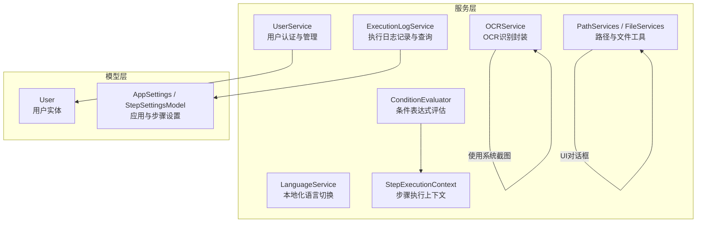
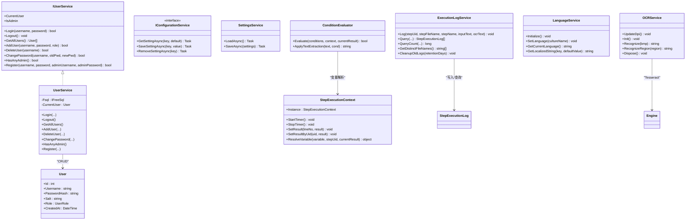
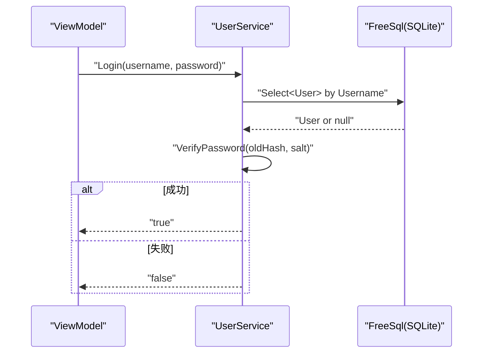
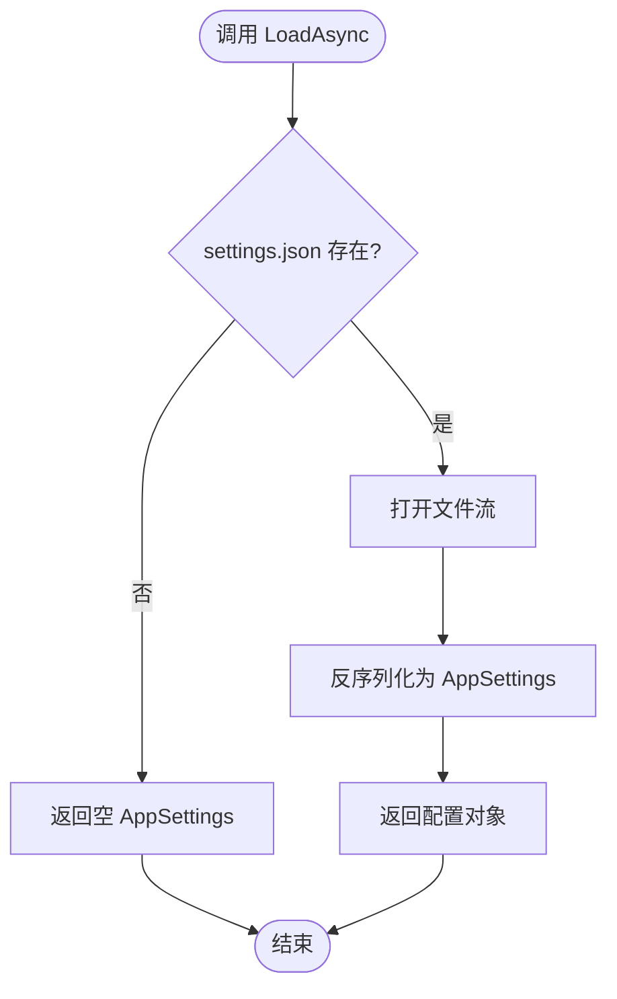
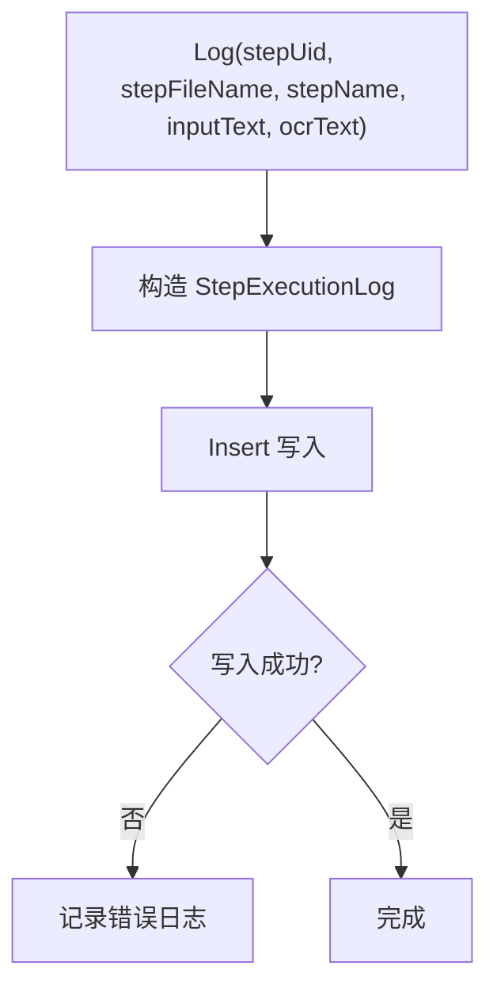
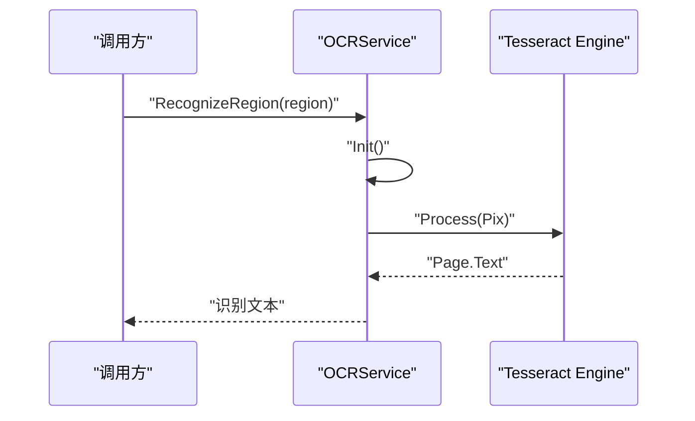
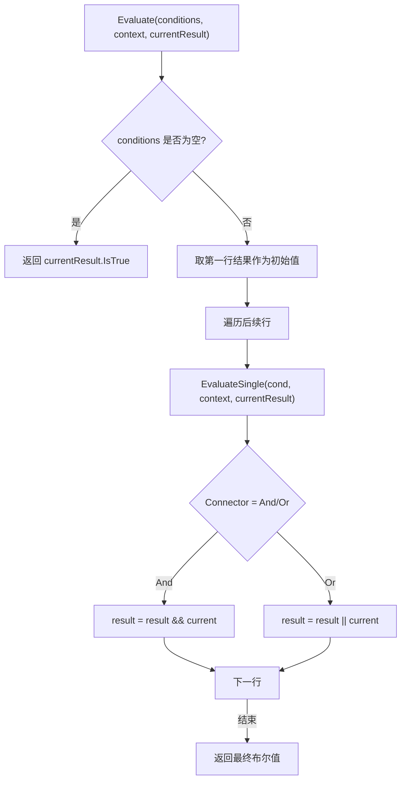
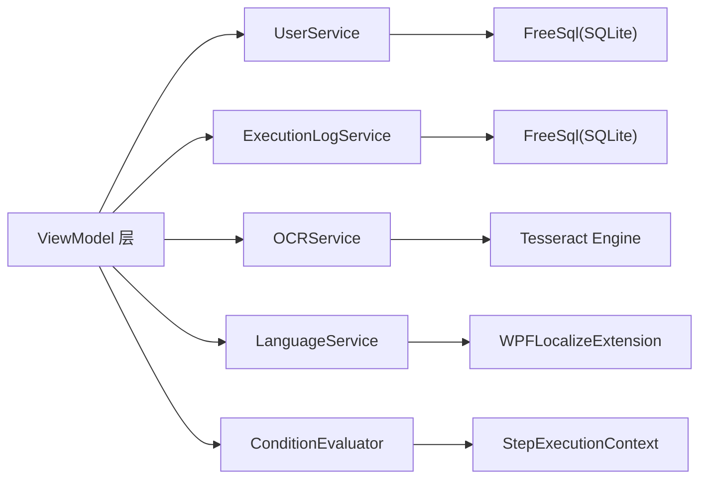

# 服务层设计

<cite>
**本文引用的文件**   
- [IUserService.cs](file://ShaoLu/Services/IUserService.cs)
- [UserService.cs](file://ShaoLu/Services/UserService.cs)
- [User.cs](file://ShaoLu/Models/User.cs)
- [IConfigurationService.cs](file://ShaoLu/Services/IConfigurationService.cs)
- [SettingsService.cs](file://ShaoLu/Services/SettingsService.cs)
- [Settings.cs](file://ShaoLu/Models/Settings.cs)
- [LanguageService.cs](file://ShaoLu/Services/LanguageService.cs)
- [OCRService.cs](file://ShaoLu/Services/OCRService.cs)
- [ExecutionLogService.cs](file://ShaoLu/Services/ExecutionLogService.cs)
- [ConditionEvaluator.cs](file://ShaoLu/Services/ConditionEvaluator.cs)
- [StepExecutionContext.cs](file://ShaoLu/Services/StepExecutionContext.cs)
- [Services.cs](file://ShaoLu/Services/Services.cs)
</cite>

## 目录
1. [简介](#简介)
2. [项目结构](#项目结构)
3. [核心组件](#核心组件)
4. [架构总览](#架构总览)
5. [详细组件分析](#详细组件分析)
6. [依赖关系分析](#依赖关系分析)
7. [性能考量](#性能考量)
8. [故障排查指南](#故障排查指南)
9. [结论](#结论)
10. [附录：接口规范与最佳实践](#附录接口规范与最佳实践)

## 简介
本文件面向 ShaoLu 应用的服务层设计与实现，聚焦以下目标：
- 明确服务层的职责边界与设计原则（单一职责、可测试性、可维护性）。
- 梳理关键服务接口与实现，包括 IUserService、IConfigurationService 等。
- 说明各服务的功能职责、方法设计、参数校验与错误处理机制。
- 解释服务间依赖关系、事务管理策略、异步操作处理方式。
- 给出服务接口的定义规范、实现最佳实践及单元测试建议。
- 阐述服务层如何与 ViewModel 层交互，提供统一的数据访问与业务逻辑封装。

## 项目结构
服务层位于 ShaoLu/Services，按能力划分多个独立服务：用户服务、配置服务、语言服务、OCR 服务、执行日志服务、条件评估器与执行上下文等。模型位于 ShaoLu/Models，承载数据实体与设置项。

图表来源
- [UserService.cs:10-37](file://ShaoLu/Services/UserService.cs#L10-L37)
- [ExecutionLogService.cs:12-32](file://ShaoLu/Services/ExecutionLogService.cs#L12-L32)
- [OCRService.cs:12-48](file://ShaoLu/Services/OCRService.cs#L12-L48)
- [LanguageService.cs:7-22](file://ShaoLu/Services/LanguageService.cs#L7-L22)
- [ConditionEvaluator.cs:11-23](file://ShaoLu/Services/ConditionEvaluator.cs#L11-L23)
- [StepExecutionContext.cs:11-29](file://ShaoLu/Services/StepExecutionContext.cs#L11-L29)
- [Services.cs:11-81](file://ShaoLu/Services/Services.cs#L11-L81)
- [User.cs:12-31](file://ShaoLu/Models/User.cs#L12-L31)
- [Settings.cs:7-32](file://ShaoLu/Models/Settings.cs#L7-L32)

章节来源
- [UserService.cs:10-37](file://ShaoLu/Services/UserService.cs#L10-L37)
- [ExecutionLogService.cs:12-32](file://ShaoLu/Services/ExecutionLogService.cs#L12-L32)
- [OCRService.cs:12-48](file://ShaoLu/Services/OCRService.cs#L12-L48)
- [LanguageService.cs:7-22](file://ShaoLu/Services/LanguageService.cs#L7-L22)
- [ConditionEvaluator.cs:11-23](file://ShaoLu/Services/ConditionEvaluator.cs#L11-L23)
- [StepExecutionContext.cs:11-29](file://ShaoLu/Services/StepExecutionContext.cs#L11-L29)
- [Services.cs:11-81](file://ShaoLu/Services/Services.cs#L11-L81)
- [User.cs:12-31](file://ShaoLu/Models/User.cs#L12-L31)
- [Settings.cs:7-32](file://ShaoLu/Models/Settings.cs#L7-L32)

## 核心组件
- IUserService 与 UserService：负责用户登录、注销、注册、密码修改、管理员权限判断、用户增删查等；基于 FreeSql + SQLite 持久化，采用 PBKDF2+Salt 安全存储密码。
- IConfigurationService 与 SettingsService：提供键值型配置的异步读写；当前 SettingsService 以静态方式直接读写 settings.json，尚未实现 IConfigurationService 接口。
- ExecutionLogService：基于 FreeSql + SQLite 记录并分页查询步骤执行日志，支持关键字搜索、时间范围过滤与清理过期日志。
- OCRService：封装 Tesseract OCR 引擎，支持 Bitmap 识别与屏幕区域识别，包含 DPI 缓存与线程安全的懒加载初始化。
- LanguageService：管理应用语言切换与本地化字符串获取，持久化当前语言到文本文件。
- ConditionEvaluator：解析并评估多行条件规则，支持常量、布尔、数字、字符串、正则匹配以及文本提取模式。
- StepExecutionContext：单例执行上下文，保存步骤执行结果、统计信息，并提供变量解析能力供条件评估使用。
- PathServices/FileServices：文件对话框、相对路径计算、待删除文件标记与提交、智能文本编码读取等工具。

章节来源
- [IUserService.cs:6-18](file://ShaoLu/Services/IUserService.cs#L6-L18)
- [UserService.cs:10-37](file://ShaoLu/Services/UserService.cs#L10-L37)
- [IConfigurationService.cs:5-10](file://ShaoLu/Services/IConfigurationService.cs#L5-L10)
- [SettingsService.cs:7-37](file://ShaoLu/Services/SettingsService.cs#L7-L37)
- [ExecutionLogService.cs:12-32](file://ShaoLu/Services/ExecutionLogService.cs#L12-L32)
- [OCRService.cs:12-48](file://ShaoLu/Services/OCRService.cs#L12-L48)
- [LanguageService.cs:7-22](file://ShaoLu/Services/LanguageService.cs#L7-L22)
- [ConditionEvaluator.cs:11-23](file://ShaoLu/Services/ConditionEvaluator.cs#L11-L23)
- [StepExecutionContext.cs:11-29](file://ShaoLu/Services/StepExecutionContext.cs#L11-L29)
- [Services.cs:11-81](file://ShaoLu/Services/Services.cs#L11-L81)

## 架构总览
服务层通过清晰的接口与实现分离，为上层 ViewModel 提供稳定的业务能力。数据库访问由 FreeSql 抽象，OCR 由 Tesseract 封装，本地化由 WPFLocalizeExtension 驱动，日志由 NLog 记录。

图表来源
- [IUserService.cs:6-18](file://ShaoLu/Services/IUserService.cs#L6-L18)
- [UserService.cs:10-37](file://ShaoLu/Services/UserService.cs#L10-L37)
- [User.cs:12-31](file://ShaoLu/Models/User.cs#L12-L31)
- [IConfigurationService.cs:5-10](file://ShaoLu/Services/IConfigurationService.cs#L5-L10)
- [SettingsService.cs:7-37](file://ShaoLu/Services/SettingsService.cs#L7-L37)
- [ExecutionLogService.cs:12-32](file://ShaoLu/Services/ExecutionLogService.cs#L12-L32)
- [OCRService.cs:12-48](file://ShaoLu/Services/OCRService.cs#L12-L48)
- [LanguageService.cs:7-22](file://ShaoLu/Services/LanguageService.cs#L7-L22)
- [ConditionEvaluator.cs:11-23](file://ShaoLu/Services/ConditionEvaluator.cs#L11-L23)
- [StepExecutionContext.cs:11-29](file://ShaoLu/Services/StepExecutionContext.cs#L11-L29)

## 详细组件分析

### 用户服务（IUserService 与 UserService）
- 职责：用户认证、会话状态、用户生命周期管理、管理员权限控制。
- 数据持久化：FreeSql + SQLite，自动同步表结构。
- 安全策略：PBKDF2 派生密钥 + Salt，恒定时间比较防止时序攻击。
- 方法设计要点：
  - Login/Logout：校验输入、验证密码、更新 CurrentUser。
  - AddUser/DeleteUser：用户名唯一性检查、管理员保护（至少保留一个管理员）、删除后清理当前用户。
  - ChangePassword：旧密码校验、重新生成 Salt 与哈希。
  - Register：根据是否已有管理员决定是否需管理员审批。
- 错误处理：参数为空返回失败；DB 异常未显式捕获时向上抛出（调用方应处理）。

图表来源
- [UserService.cs:76-93](file://ShaoLu/Services/UserService.cs#L76-L93)
- [UserService.cs:59-74](file://ShaoLu/Services/UserService.cs#L59-L74)

章节来源
- [IUserService.cs:6-18](file://ShaoLu/Services/IUserService.cs#L6-L18)
- [UserService.cs:76-93](file://ShaoLu/Services/UserService.cs#L76-L93)
- [UserService.cs:107-129](file://ShaoLu/Services/UserService.cs#L107-L129)
- [UserService.cs:131-159](file://ShaoLu/Services/UserService.cs#L131-L159)
- [UserService.cs:161-185](file://ShaoLu/Services/UserService.cs#L161-L185)
- [UserService.cs:194-236](file://ShaoLu/Services/UserService.cs#L194-L236)
- [User.cs:12-31](file://ShaoLu/Models/User.cs#L12-L31)

### 配置服务（IConfigurationService 与 SettingsService）
- 接口定义：统一的异步配置存取 API（Get/Set/Remove）。
- 当前实现：SettingsService 提供 LoadAsync/SaveAsync，直接读写 settings.json，未实现 IConfigurationService。
- 建议改进：
  - 让 SettingsService 实现 IConfigurationService，将 AppSettings 作为默认配置对象，或扩展为通用键值存储。
  - 增加配置版本迁移与校验。
  - 引入 DI 容器注入，便于替换为其他后端（如注册表、云端配置）。

图表来源
- [SettingsService.cs:20-28](file://ShaoLu/Services/SettingsService.cs#L20-L28)

章节来源
- [IConfigurationService.cs:5-10](file://ShaoLu/Services/IConfigurationService.cs#L5-L10)
- [SettingsService.cs:7-37](file://ShaoLu/Services/SettingsService.cs#L7-L37)
- [Settings.cs:7-32](file://ShaoLu/Models/Settings.cs#L7-L32)

### 执行日志服务（ExecutionLogService）
- 职责：记录步骤执行历史、分页查询、清理过期日志。
- 特性：支持关键字搜索、文件名筛选、UID 筛选、时间范围、排序与分页。
- 错误处理：写入失败记录日志但不中断主流程。

图表来源
- [ExecutionLogService.cs:36-55](file://ShaoLu/Services/ExecutionLogService.cs#L36-L55)

章节来源
- [ExecutionLogService.cs:36-55](file://ShaoLu/Services/ExecutionLogService.cs#L36-L55)
- [ExecutionLogService.cs:60-107](file://ShaoLu/Services/ExecutionLogService.cs#L60-L107)
- [ExecutionLogService.cs:161-176](file://ShaoLu/Services/ExecutionLogService.cs#L161-L176)

### OCR 服务（OCRService）
- 职责：封装 Tesseract OCR 引擎，提供图像与屏幕区域识别。
- 线程安全：懒加载初始化加锁，避免重复创建引擎。
- DPI 处理：在 UI 线程更新 DPI 缓存，后台线程仅读取，避免跨线程访问 WPF 对象。
- 错误处理：识别失败返回空字符串并记录日志。

图表来源
- [OCRService.cs:53-75](file://ShaoLu/Services/OCRService.cs#L53-L75)
- [OCRService.cs:114-144](file://ShaoLu/Services/OCRService.cs#L114-L144)

章节来源
- [OCRService.cs:12-48](file://ShaoLu/Services/OCRService.cs#L12-L48)
- [OCRService.cs:82-107](file://ShaoLu/Services/OCRService.cs#L82-L107)
- [OCRService.cs:114-144](file://ShaoLu/Services/OCRService.cs#L114-L144)

### 语言服务（LanguageService）
- 职责：初始化与应用内语言切换，持久化当前语言，提供本地化字符串获取。
- 错误处理：无效文化名称记录错误日志。

章节来源
- [LanguageService.cs:15-40](file://ShaoLu/Services/LanguageService.cs#L15-L40)
- [LanguageService.cs:45-64](file://ShaoLu/Services/LanguageService.cs#L45-L64)

### 条件评估器（ConditionEvaluator）
- 职责：评估多行条件规则，支持 AND/OR 组合、多种数据类型比较、正则匹配、文本提取模式。
- 健壮性：对异常进行捕获并返回保守结果（通常为 false），记录警告日志。

图表来源
- [ConditionEvaluator.cs:23-51](file://ShaoLu/Services/ConditionEvaluator.cs#L23-L51)
- [ConditionEvaluator.cs:56-83](file://ShaoLu/Services/ConditionEvaluator.cs#L56-L83)

章节来源
- [ConditionEvaluator.cs:23-51](file://ShaoLu/Services/ConditionEvaluator.cs#L23-L51)
- [ConditionEvaluator.cs:88-164](file://ShaoLu/Services/ConditionEvaluator.cs#L88-L164)
- [ConditionEvaluator.cs:177-207](file://ShaoLu/Services/ConditionEvaluator.cs#L177-L207)

### 执行上下文（StepExecutionContext）
- 职责：维护步骤执行结果、统计信息、计时器，提供变量解析能力。
- 设计要点：单例模式，字典缓存结果，支持按行号与 UID 查找，提供 Clear 重置。

章节来源
- [StepExecutionContext.cs:11-82](file://ShaoLu/Services/StepExecutionContext.cs#L11-L82)
- [StepExecutionContext.cs:112-160](file://ShaoLu/Services/StepExecutionContext.cs#L112-L160)

### 路径与文件工具（PathServices / FileServices）
- 职责：文件对话框、相对路径计算、待删除文件标记与提交、智能文本编码读取。
- 特点：使用 NLog 记录操作日志，支持撤销标记删除。

章节来源
- [Services.cs:11-81](file://ShaoLu/Services/Services.cs#L11-L81)
- [Services.cs:83-177](file://ShaoLu/Services/Services.cs#L83-L177)

## 依赖关系分析
- 用户服务依赖 FreeSql 与 SQLite，不直接依赖 UI 框架。
- 执行日志服务同样依赖 FreeSql + SQLite。
- OCR 服务依赖 Tesseract 引擎与系统截图能力。
- 语言服务依赖 WPFLocalizeExtension 与文件系统。
- 条件评估器依赖 StepExecutionContext 与模型类型。
- 配置服务当前为静态 JSON 读写，未来可实现 IConfigurationService 以便解耦。

图表来源
- [UserService.cs:12-26](file://ShaoLu/Services/UserService.cs#L12-L26)
- [ExecutionLogService.cs:14-25](file://ShaoLu/Services/ExecutionLogService.cs#L14-L25)
- [OCRService.cs:53-75](file://ShaoLu/Services/OCRService.cs#L53-L75)
- [LanguageService.cs:15-22](file://ShaoLu/Services/LanguageService.cs#L15-L22)
- [ConditionEvaluator.cs:23-51](file://ShaoLu/Services/ConditionEvaluator.cs#L23-L51)
- [StepExecutionContext.cs:11-29](file://ShaoLu/Services/StepExecutionContext.cs#L11-L29)

章节来源
- [UserService.cs:12-26](file://ShaoLu/Services/UserService.cs#L12-L26)
- [ExecutionLogService.cs:14-25](file://ShaoLu/Services/ExecutionLogService.cs#L14-L25)
- [OCRService.cs:53-75](file://ShaoLu/Services/OCRService.cs#L53-L75)
- [LanguageService.cs:15-22](file://ShaoLu/Services/LanguageService.cs#L15-L22)
- [ConditionEvaluator.cs:23-51](file://ShaoLu/Services/ConditionEvaluator.cs#L23-L51)
- [StepExecutionContext.cs:11-29](file://ShaoLu/Services/StepExecutionContext.cs#L11-L29)

## 性能考量
- 数据库连接：FreeSql 使用 Lazy 初始化，避免重复构建；SQLite 适合单机小数据量场景。
- OCR 引擎：懒加载与锁保护，避免频繁初始化；DPI 缓存减少 UI 线程访问开销。
- 日志写入：异步 IO 与异常吞没，确保不影响主流程。
- 内存占用：StepExecutionContext 单例缓存结果，注意定期 Clear 释放。
- 文件读写：JSON 序列化选项已启用缩进，生产环境可考虑压缩或分片。

[本节为通用指导，不直接分析具体文件]

## 故障排查指南
- 用户登录失败：检查用户名是否存在、密码哈希与盐是否正确、VerifyPassword 比较是否通过。
- 注册失败：确认用户名唯一性、管理员审批逻辑是否符合预期。
- OCR 识别为空：检查 tessdata 路径、DPI 缓存是否更新、截图区域是否有效。
- 日志写入失败：查看 NLog 输出，确认磁盘权限与路径有效性。
- 语言切换无效：确认文化名称合法、配置文件可写。

章节来源
- [UserService.cs:76-93](file://ShaoLu/Services/UserService.cs#L76-L93)
- [UserService.cs:194-236](file://ShaoLu/Services/UserService.cs#L194-L236)
- [OCRService.cs:82-107](file://ShaoLu/Services/OCRService.cs#L82-L107)
- [ExecutionLogService.cs:36-55](file://ShaoLu/Services/ExecutionLogService.cs#L36-L55)
- [LanguageService.cs:27-40](file://ShaoLu/Services/LanguageService.cs#L27-L40)

## 结论
ShaoLu 服务层通过清晰的分层与职责划分，提供了稳健的用户管理、配置存取、OCR 识别、执行日志与条件评估能力。建议在后续迭代中完善 IConfigurationService 的实现，引入 DI 容器与更完善的异常与事务管理，以提升可测试性与可维护性。

[本节为总结性内容，不直接分析具体文件]

## 附录：接口规范与最佳实践
- 接口设计规范：
  - 命名：以 I 开头，动词短语描述行为（如 GetUserAsync）。
  - 参数：最小化参数集合，复杂参数使用 DTO 或模型。
  - 返回值：优先返回 Task<T> 的异步方法，失败通过异常或 Result 包装。
- 实现最佳实践：
  - 单一职责：每个服务只负责一个领域能力。
  - 依赖注入：通过构造函数注入依赖，便于替换与测试。
  - 异常处理：区分可恢复与不可恢复异常，记录必要上下文。
  - 事务管理：涉及多步写操作时使用事务包裹，保证一致性。
  - 异步与并发：避免阻塞 UI 线程，合理使用锁与线程池。
- 单元测试建议：
  - 使用 Mock 替代外部依赖（如 FreeSql、文件系统、OCR 引擎）。
  - 覆盖正常路径与边界条件（空输入、非法参数、异常分支）。
  - 断言副作用（如数据库写入、文件变更、日志记录）。
- 与 ViewModel 交互：
  - ViewModel 仅持有服务引用，不包含业务逻辑。
  - 通过命令绑定触发服务方法，展示进度与错误提示。
  - 使用响应式更新（如 INotifyPropertyChanged）刷新 UI。

[本节为通用指导，不直接分析具体文件]