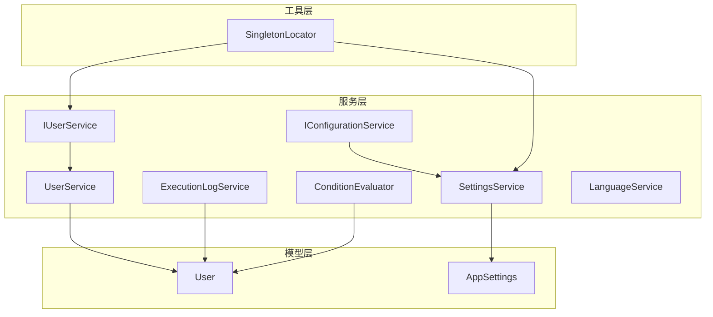
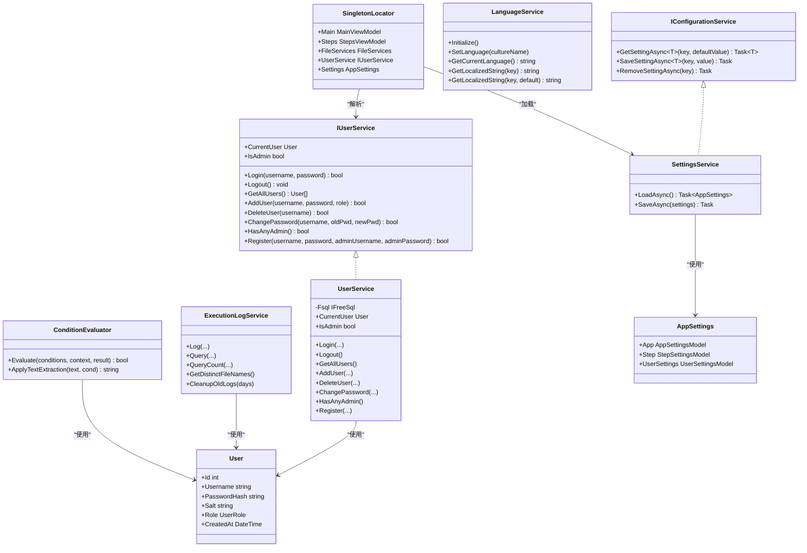
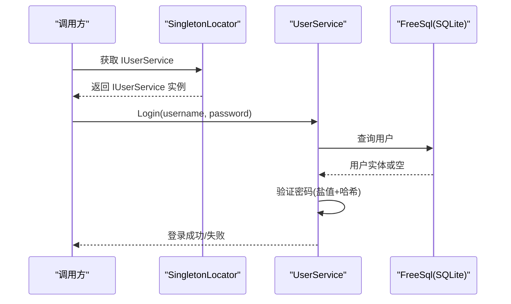
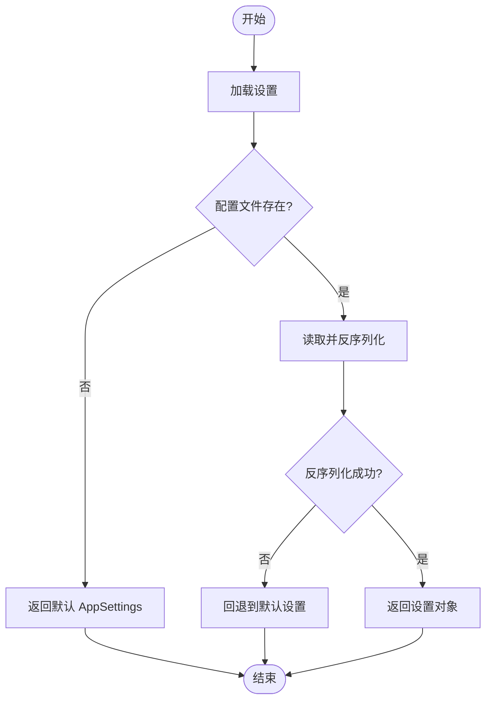
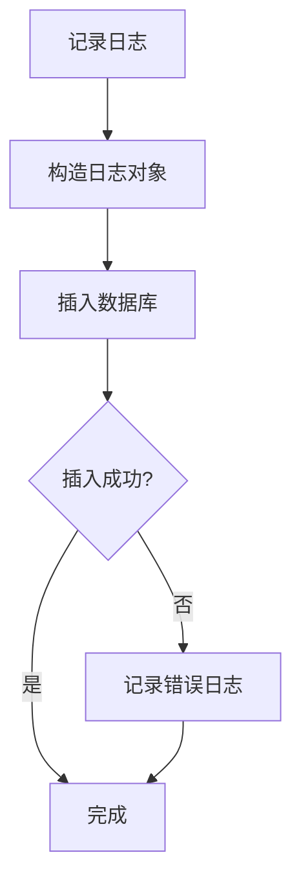
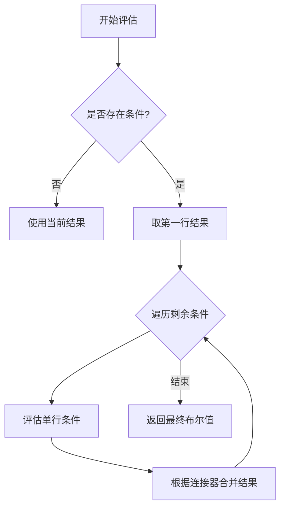
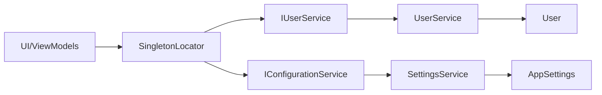

# 服务接口设计

<cite>
**本文引用的文件**   
- [IConfigurationService.cs](file://ShaoLu/Services/IConfigurationService.cs)
- [IUserService.cs](file://ShaoLu/Services/IUserService.cs)
- [UserService.cs](file://ShaoLu/Services/UserService.cs)
- [SettingsService.cs](file://ShaoLu/Services/SettingsService.cs)
- [ExecutionLogService.cs](file://ShaoLu/Services/ExecutionLogService.cs)
- [ConditionEvaluator.cs](file://ShaoLu/Services/ConditionEvaluator.cs)
- [LanguageService.cs](file://ShaoLu/Services/LanguageService.cs)
- [User.cs](file://ShaoLu/Models/User.cs)
- [Settings.cs](file://ShaoLu/Models/Settings.cs)
- [SingletonLocator.cs](file://ShaoLu/Utils/SingletonLocator.cs)
- [ModelTests.cs](file://NUnitTest/ModelTests.cs)
- [StepsFileTests.cs](file://NUnitTest/StepsFileTests.cs)
</cite>

## 目录
1. [简介](#简介)
2. [项目结构](#项目结构)
3. [核心组件](#核心组件)
4. [架构总览](#架构总览)
5. [详细组件分析](#详细组件分析)
6. [依赖关系分析](#依赖关系分析)
7. [性能考虑](#性能考虑)
8. [故障排查指南](#故障排查指南)
9. [结论](#结论)
10. [附录](#附录)

## 简介
本文件面向 ShaoLu 应用的服务层，系统化阐述服务接口的定义规范、设计原则与最佳实践。重点覆盖：
- 接口命名约定与方法签名设计
- 参数验证规则与错误处理策略
- 依赖注入模式在服务层的解耦设计
- 版本兼容性与向后兼容策略
- 单元测试与模拟对象的使用方式
- 扩展现有接口以支持新功能的指导

目标是帮助开发者在保持高内聚、低耦合的前提下，构建稳定、可测试、可扩展的服务接口体系。

## 项目结构
ShaoLu 的服务层位于 Services 目录，包含用户管理、配置、执行日志、条件评估、语言本地化等能力；模型位于 Models 目录；依赖注入通过工具类集中访问。

图表来源
- [IConfigurationService.cs:1-12](file://ShaoLu/Services/IConfigurationService.cs#L1-L12)
- [IUserService.cs:1-20](file://ShaoLu/Services/IUserService.cs#L1-L20)
- [UserService.cs:1-239](file://ShaoLu/Services/UserService.cs#L1-L239)
- [SettingsService.cs:1-38](file://ShaoLu/Services/SettingsService.cs#L1-L38)
- [ExecutionLogService.cs:1-179](file://ShaoLu/Services/ExecutionLogService.cs#L1-L179)
- [ConditionEvaluator.cs:1-294](file://ShaoLu/Services/ConditionEvaluator.cs#L1-L294)
- [LanguageService.cs:1-67](file://ShaoLu/Services/LanguageService.cs#L1-L67)
- [User.cs:1-33](file://ShaoLu/Models/User.cs#L1-L33)
- [Settings.cs:1-117](file://ShaoLu/Models/Settings.cs#L1-L117)
- [SingletonLocator.cs:1-19](file://ShaoLu/Utils/SingletonLocator.cs#L1-L19)

章节来源
- [IConfigurationService.cs:1-12](file://ShaoLu/Services/IConfigurationService.cs#L1-L12)
- [IUserService.cs:1-20](file://ShaoLu/Services/IUserService.cs#L1-L20)
- [SettingsService.cs:1-38](file://ShaoLu/Services/SettingsService.cs#L1-L38)
- [ExecutionLogService.cs:1-179](file://ShaoLu/Services/ExecutionLogService.cs#L1-L179)
- [ConditionEvaluator.cs:1-294](file://ShaoLu/Services/ConditionEvaluator.cs#L1-L294)
- [LanguageService.cs:1-67](file://ShaoLu/Services/LanguageService.cs#L1-L67)
- [User.cs:1-33](file://ShaoLu/Models/User.cs#L1-L33)
- [Settings.cs:1-117](file://ShaoLu/Models/Settings.cs#L1-L117)
- [SingletonLocator.cs:1-19](file://ShaoLu/Utils/SingletonLocator.cs#L1-L19)

## 核心组件
- 配置服务接口 IConfigurationService：提供异步获取、保存、移除设置的通用能力，泛型约束为引用类型，便于扩展不同配置载体。
- 用户服务接口 IUserService：封装用户生命周期、权限判断、注册登录、密码管理等核心业务。
- 用户服务实现 UserService：基于 FreeSql + SQLite 持久化用户数据，采用盐值+PBKDF2 安全存储密码，提供管理员保护逻辑。
- 设置服务 SettingsService：负责 AppSettings 的 JSON 序列化/反序列化与持久化。
- 执行日志服务 ExecutionLogService：记录步骤执行历史，支持分页查询、筛选、清理旧日志。
- 条件评估器 ConditionEvaluator：对多行条件进行 AND/OR 组合评估，支持文本提取、正则匹配、数值/布尔比较。
- 语言服务 LanguageService：统一本地化初始化、切换与字符串获取。

章节来源
- [IConfigurationService.cs:1-12](file://ShaoLu/Services/IConfigurationService.cs#L1-L12)
- [IUserService.cs:1-20](file://ShaoLu/Services/IUserService.cs#L1-L20)
- [UserService.cs:1-239](file://ShaoLu/Services/UserService.cs#L1-L239)
- [SettingsService.cs:1-38](file://ShaoLu/Services/SettingsService.cs#L1-L38)
- [ExecutionLogService.cs:1-179](file://ShaoLu/Services/ExecutionLogService.cs#L1-L179)
- [ConditionEvaluator.cs:1-294](file://ShaoLu/Services/ConditionEvaluator.cs#L1-L294)
- [LanguageService.cs:1-67](file://ShaoLu/Services/LanguageService.cs#L1-L67)

## 架构总览
服务层围绕“接口抽象 + 具体实现”组织，配合 DI 容器（CommunityToolkit.Mvvm.DependencyInjection）进行实例解析。SingletonLocator 作为静态访问点，暴露常用服务与视图模型，降低调用方耦合。

图表来源
- [IConfigurationService.cs:1-12](file://ShaoLu/Services/IConfigurationService.cs#L1-L12)
- [IUserService.cs:1-20](file://ShaoLu/Services/IUserService.cs#L1-L20)
- [UserService.cs:1-239](file://ShaoLu/Services/UserService.cs#L1-L239)
- [SettingsService.cs:1-38](file://ShaoLu/Services/SettingsService.cs#L1-L38)
- [ExecutionLogService.cs:1-179](file://ShaoLu/Services/ExecutionLogService.cs#L1-L179)
- [ConditionEvaluator.cs:1-294](file://ShaoLu/Services/ConditionEvaluator.cs#L1-L294)
- [LanguageService.cs:1-67](file://ShaoLu/Services/LanguageService.cs#L1-L67)
- [User.cs:1-33](file://ShaoLu/Models/User.cs#L1-L33)
- [Settings.cs:1-117](file://ShaoLu/Models/Settings.cs#L1-L117)
- [SingletonLocator.cs:1-19](file://ShaoLu/Utils/SingletonLocator.cs#L1-L19)

## 详细组件分析

### 用户服务接口与实现（IUserService / UserService）
- 职责边界：用户认证、授权、用户生命周期管理、管理员保护策略。
- 方法签名设计：
  - 输入参数尽量简单明确，避免复杂对象入参；返回布尔或集合，失败时返回 false 或空集合。
  - 敏感操作（如删除管理员）需内置校验，确保系统可用性。
- 参数验证规则：
  - 用户名与密码非空校验；重复用户名检测；管理员数量限制。
- 错误处理：
  - 数据库异常不向上抛出，内部记录并返回失败结果。
- 依赖注入：
  - 通过 SingletonLocator 解析 IUserService，便于替换实现与单元测试。

图表来源
- [IUserService.cs:1-20](file://ShaoLu/Services/IUserService.cs#L1-L20)
- [UserService.cs:1-239](file://ShaoLu/Services/UserService.cs#L1-L239)
- [SingletonLocator.cs:1-19](file://ShaoLu/Utils/SingletonLocator.cs#L1-L19)

章节来源
- [IUserService.cs:1-20](file://ShaoLu/Services/IUserService.cs#L1-L20)
- [UserService.cs:1-239](file://ShaoLu/Services/UserService.cs#L1-L239)

### 配置服务接口与实现（IConfigurationService / SettingsService）
- 接口设计：
  - 使用泛型异步方法，支持任意引用类型的配置项存取。
  - 默认值参数简化常见场景调用。
- 实现说明：
  - SettingsService 提供 AppSettings 的 JSON 读写，保证可读性与兼容性。
- 版本兼容：
  - 新增字段应提供默认值，避免破坏旧配置。
  - 读取时忽略未知字段，写入时保留已知字段。

图表来源
- [IConfigurationService.cs:1-12](file://ShaoLu/Services/IConfigurationService.cs#L1-L12)
- [SettingsService.cs:1-38](file://ShaoLu/Services/SettingsService.cs#L1-L38)
- [Settings.cs:1-117](file://ShaoLu/Models/Settings.cs#L1-L117)

章节来源
- [IConfigurationService.cs:1-12](file://ShaoLu/Services/IConfigurationService.cs#L1-L12)
- [SettingsService.cs:1-38](file://ShaoLu/Services/SettingsService.cs#L1-L38)
- [Settings.cs:1-117](file://ShaoLu/Models/Settings.cs#L1-L117)

### 执行日志服务（ExecutionLogService）
- 功能要点：
  - 记录步骤执行信息，支持关键字搜索、时间范围、排序与分页。
  - 提供清理旧日志的能力，结合配置控制保留天数。
- 设计原则：
  - 单职责：仅关注日志写入与查询。
  - 幂等性：重复写入不会导致异常。
  - 容错性：写入失败不影响主流程。

图表来源
- [ExecutionLogService.cs:1-179](file://ShaoLu/Services/ExecutionLogService.cs#L1-L179)

章节来源
- [ExecutionLogService.cs:1-179](file://ShaoLu/Services/ExecutionLogService.cs#L1-L179)

### 条件评估器（ConditionEvaluator）
- 能力概述：
  - 支持多行条件按 AND/OR 组合。
  - 变量解析、文本提取（整行、子串、起止长度）、正则匹配、数值/布尔比较。
- 健壮性：
  - 对无效正则、空值、类型不匹配进行防御性处理，返回默认结果。
- 扩展点：
  - 新增比较运算符或变量类型时，仅需扩展对应分支。

图表来源
- [ConditionEvaluator.cs:1-294](file://ShaoLu/Services/ConditionEvaluator.cs#L1-L294)

章节来源
- [ConditionEvaluator.cs:1-294](file://ShaoLu/Services/ConditionEvaluator.cs#L1-L294)

### 语言服务（LanguageService）
- 职责：
  - 初始化语言环境，持久化用户选择，提供本地化字符串获取。
- 设计要点：
  - 对外暴露静态方法，简化调用。
  - 捕获无效文化名称异常，保证稳定性。

章节来源
- [LanguageService.cs:1-67](file://ShaoLu/Services/LanguageService.cs#L1-L67)

## 依赖关系分析
- 服务间依赖：
  - UserService 依赖 FreeSql 与 User 模型。
  - ExecutionLogService 依赖 FreeSql 与日志模型。
  - SettingsService 依赖 AppSettings 模型。
- 依赖注入：
  - 通过 CommunityToolkit.Mvvm.DependencyInjection 的 Ioc.Default 解析服务。
  - SingletonLocator 集中暴露常用服务，降低 UI 层耦合。

图表来源
- [SingletonLocator.cs:1-19](file://ShaoLu/Utils/SingletonLocator.cs#L1-L19)
- [IUserService.cs:1-20](file://ShaoLu/Services/IUserService.cs#L1-L20)
- [IConfigurationService.cs:1-12](file://ShaoLu/Services/IConfigurationService.cs#L1-L12)
- [UserService.cs:1-239](file://ShaoLu/Services/UserService.cs#L1-L239)
- [SettingsService.cs:1-38](file://ShaoLu/Services/SettingsService.cs#L1-L38)
- [User.cs:1-33](file://ShaoLu/Models/User.cs#L1-L33)
- [Settings.cs:1-117](file://ShaoLu/Models/Settings.cs#L1-L117)

章节来源
- [SingletonLocator.cs:1-19](file://ShaoLu/Utils/SingletonLocator.cs#L1-L19)

## 性能考虑
- 数据库连接：
  - 使用 Lazy 初始化 FreeSql，避免启动开销。
- 日志写入：
  - 写入失败不阻塞主流程，降级为记录错误日志。
- 条件评估：
  - 文本提取与正则匹配可能耗时，建议缓存热点结果。
- 设置读写：
  - JSON 序列化/反序列化在小文件下性能良好，注意大配置分块读取。

[本节为通用指导，无需特定文件来源]

## 故障排查指南
- 用户登录失败：
  - 检查用户名是否存在、密码是否正确、数据库是否可用。
- 设置加载异常：
  - 确认 settings.json 格式正确，缺失字段有默认值。
- 日志写入失败：
  - 查看 NLog 输出，确认磁盘空间与权限。
- 条件评估异常：
  - 检查正则表达式合法性、变量解析上下文。

章节来源
- [UserService.cs:1-239](file://ShaoLu/Services/UserService.cs#L1-L239)
- [SettingsService.cs:1-38](file://ShaoLu/Services/SettingsService.cs#L1-L38)
- [ExecutionLogService.cs:1-179](file://ShaoLu/Services/ExecutionLogService.cs#L1-L179)
- [ConditionEvaluator.cs:1-294](file://ShaoLu/Services/ConditionEvaluator.cs#L1-L294)

## 结论
ShaoLu 的服务层以清晰的接口抽象与稳健的实现为核心，结合依赖注入与单元测试，实现了高内聚、低耦合的设计目标。通过统一的命名约定、严格的参数验证、完善的错误处理与版本兼容策略，服务接口具备良好的可维护性与扩展性。建议在后续迭代中继续遵循单一职责与接口隔离原则，逐步完善异步化与缓存机制，提升整体性能与可靠性。

[本节为总结性内容，无需特定文件来源]

## 附录

### 接口命名与方法签名规范
- 接口命名：以 I 开头，动词名词组合表达职责，如 IUserService、IConfigurationService。
- 方法签名：
  - 输入参数简洁明确，避免复杂对象；必要时使用可选参数提供默认值。
  - 返回值优先使用布尔表示成功/失败，或使用强类型结果对象。
  - 异步方法统一使用 Task/Task<T> 命名后缀 Async。

章节来源
- [IUserService.cs:1-20](file://ShaoLu/Services/IUserService.cs#L1-L20)
- [IConfigurationService.cs:1-12](file://ShaoLu/Services/IConfigurationService.cs#L1-L12)

### 参数验证与错误处理策略
- 必填字段校验：用户名、密码等关键参数非空检查。
- 业务规则校验：重复用户名、管理员数量限制等。
- 异常处理：数据库与 IO 异常内部捕获并记录，不向调用方抛出。

章节来源
- [UserService.cs:1-239](file://ShaoLu/Services/UserService.cs#L1-L239)
- [ExecutionLogService.cs:1-179](file://ShaoLu/Services/ExecutionLogService.cs#L1-L179)

### 依赖注入与解耦设计
- 通过接口抽象服务，实现类可替换。
- 使用 DI 容器解析服务，避免硬编码依赖。
- SingletonLocator 提供静态访问点，简化调用。

章节来源
- [SingletonLocator.cs:1-19](file://ShaoLu/Utils/SingletonLocator.cs#L1-L19)

### 版本兼容与向后兼容策略
- 新增字段提供默认值，避免破坏旧配置。
- 读取时忽略未知字段，写入时保留已知字段。
- 接口扩展优先新增方法而非修改已有方法。

章节来源
- [SettingsService.cs:1-38](file://ShaoLu/Services/SettingsService.cs#L1-L38)
- [Settings.cs:1-117](file://ShaoLu/Models/Settings.cs#L1-L117)

### 单元测试与模拟对象使用
- 针对模型与服务的行为编写用例，验证默认值、克隆、属性变更通知等。
- 使用模拟对象替换外部依赖（如数据库、文件系统），确保测试隔离。
- 示例参考：
  - 模型默认值与克隆独立性
  - 设置对象默认值与热键配置
  - 步骤文件序列化往返一致性

章节来源
- [ModelTests.cs:1-300](file://NUnitTest/ModelTests.cs#L1-L300)
- [StepsFileTests.cs:1-312](file://NUnitTest/StepsFileTests.cs#L1-L312)

### 接口扩展最佳实践
- 新增功能优先扩展接口方法，保持原有方法不变。
- 使用可选参数或重载方法提供向后兼容。
- 在实现类中提供默认行为，避免破坏现有调用方。

[本节为通用指导，无需特定文件来源]