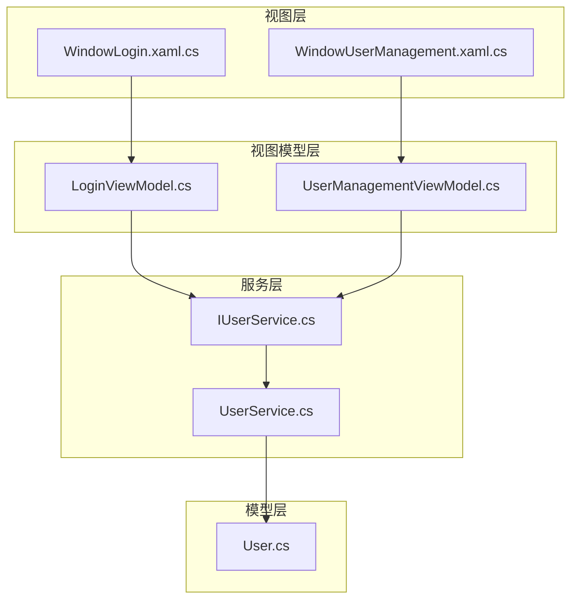
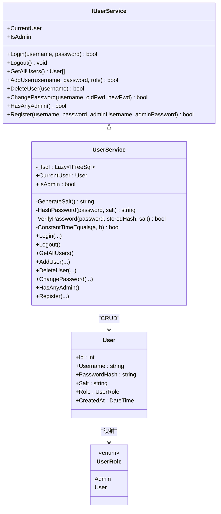
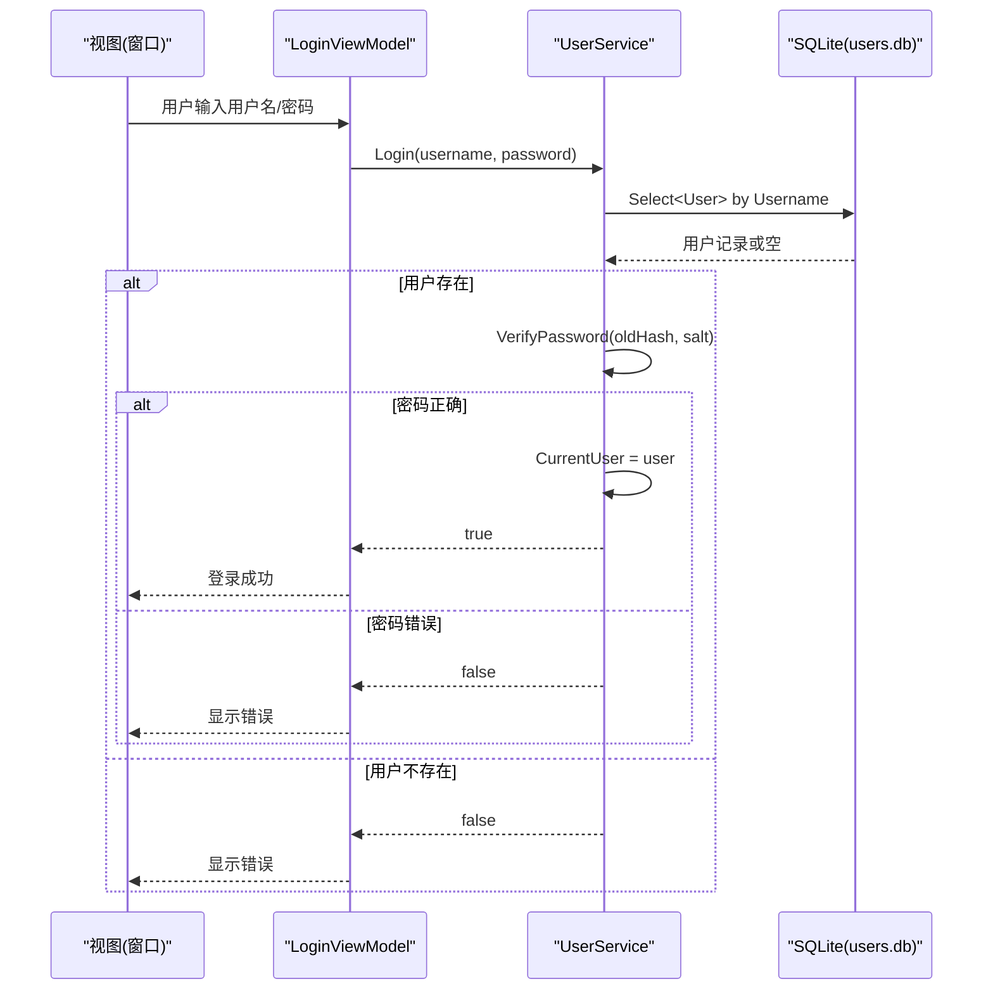
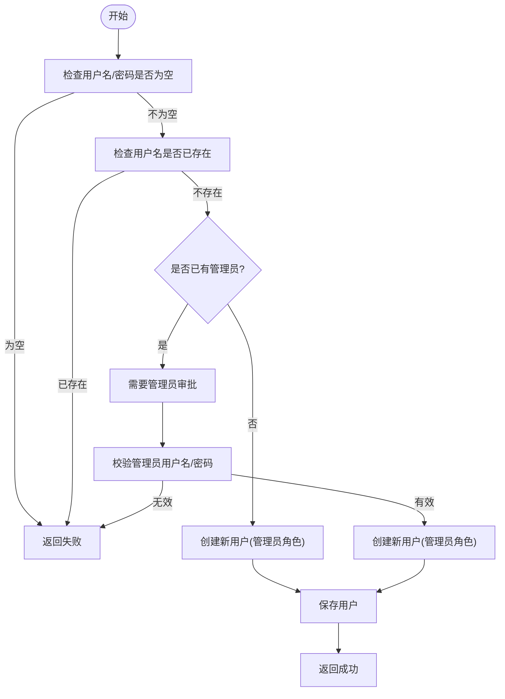
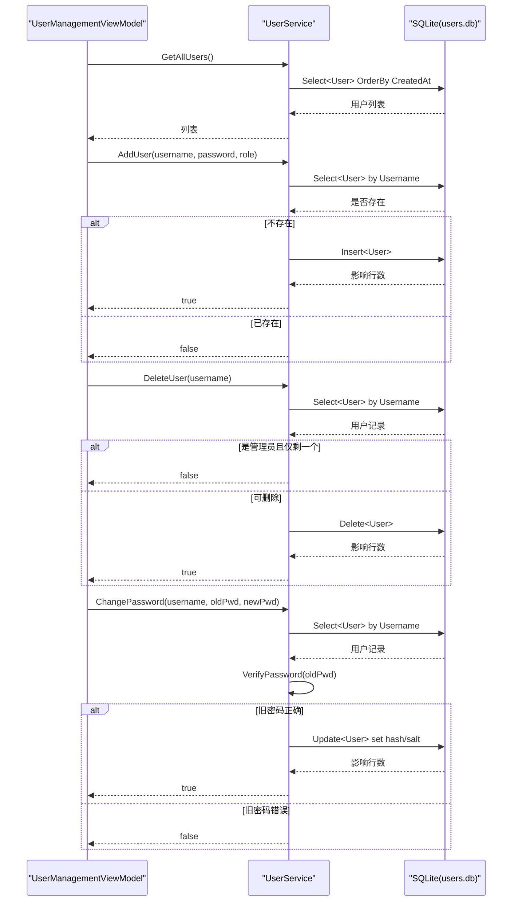
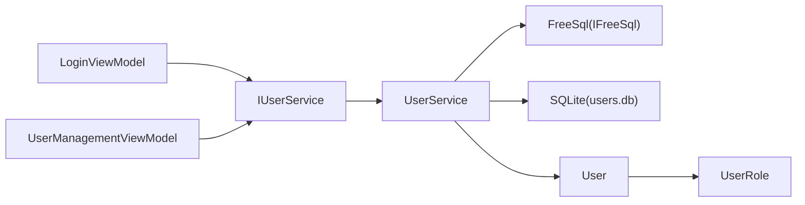

# 用户服务 (UserService)

<cite>
**本文引用的文件**   
- [ShaoLu\Services\UserService.cs](file://ShaoLu\Services\UserService.cs)
- [ShaoLu\Services\IUserService.cs](file://ShaoLu\Services\IUserService.cs)
- [ShaoLu\Models\User.cs](file://ShaoLu\Models\User.cs)
- [ShaoLu\Viewmodels\LoginViewModel.cs](file://ShaoLu\Viewmodels\LoginViewModel.cs)
- [ShaoLu\Viewmodels\UserManagementViewModel.cs](file://ShaoLu\Viewmodels\UserManagementViewModel.cs)
- [ShaoLu\Views\WindowLogin.xaml.cs](file://ShaoLu\Views\WindowLogin.xaml.cs)
- [ShaoLu\Views\WindowUserManagement.xaml.cs](file://ShaoLu\Views\WindowUserManagement.xaml.cs)
</cite>

## 目录
1. [简介](#简介)
2. [项目结构](#项目结构)
3. [核心组件](#核心组件)
4. [架构总览](#架构总览)
5. [详细组件分析](#详细组件分析)
6. [依赖关系分析](#依赖关系分析)
7. [性能与安全考量](#性能与安全考量)
8. [故障排查指南](#故障排查指南)
9. [结论](#结论)
10. [附录：接口使用示例](#附录接口使用示例)

## 简介
本文件为 ShaoLu 应用的用户服务（UserService）提供完整、深入的技术文档。内容涵盖：
- IUserService 接口与 UserService 实现类的职责边界
- 基于 FreeSql 的 SQLite 数据库操作（增删改查）
- 密码安全机制（盐值生成、PBKDF2 哈希、常量时间比较）
- 用户角色管理（UserRole）与权限控制（IsAdmin）
- 登录/登出流程、注册审批机制、密码修改等关键业务流程
- 视图层与 ViewModel 如何调用 IUserService 完成用户管理

该文档既适合开发者快速定位实现细节，也适合非技术读者理解系统行为。

## 项目结构
围绕用户服务的代码主要分布在 Services、Models、Viewmodels、Views 四个层次：
- Models：定义用户实体 User 及角色枚举 UserRole
- Services：定义 IUserService 接口与 UserService 实现，封装认证、授权、数据访问
- Viewmodels：LoginViewModel、UserManagementViewModel 负责 UI 交互逻辑，调用 IUserService
- Views：WindowLogin、WindowUserManagement 绑定 ViewModel，处理键盘事件与密码框同步

图表来源
- [ShaoLu\Views\WindowLogin.xaml.cs:1-87](file://ShaoLu\Views\WindowLogin.xaml.cs#L1-L87)
- [ShaoLu\Views\WindowUserManagement.xaml.cs:1-33](file://ShaoLu\Views\WindowUserManagement.xaml.cs#L1-L33)
- [ShaoLu\Viewmodels\LoginViewModel.cs:1-251](file://ShaoLu\Viewmodels\LoginViewModel.cs#L1-L251)
- [ShaoLu\Viewmodels\UserManagementViewModel.cs:1-194](file://ShaoLu\Viewmodels\UserManagementViewModel.cs#L1-L194)
- [ShaoLu\Services\IUserService.cs:1-20](file://ShaoLu\Services\IUserService.cs#L1-L20)
- [ShaoLu\Services\UserService.cs:1-239](file://ShaoLu\Services\UserService.cs#L1-L239)
- [ShaoLu\Models\User.cs:1-33](file://ShaoLu\Models\User.cs#L1-L33)

章节来源
- [ShaoLu\Services\UserService.cs:1-239](file://ShaoLu\Services\UserService.cs#L1-L239)
- [ShaoLu\Services\IUserService.cs:1-20](file://ShaoLu\Services\IUserService.cs#L1-L20)
- [ShaoLu\Models\User.cs:1-33](file://ShaoLu\Models\User.cs#L1-L33)
- [ShaoLu\Viewmodels\LoginViewModel.cs:1-251](file://ShaoLu\Viewmodels\LoginViewModel.cs#L1-L251)
- [ShaoLu\Viewmodels\UserManagementViewModel.cs:1-194](file://ShaoLu\Viewmodels\UserManagementViewModel.cs#L1-L194)
- [ShaoLu\Views\WindowLogin.xaml.cs:1-87](file://ShaoLu\Views\WindowLogin.xaml.cs#L1-L87)
- [ShaoLu\Views\WindowUserManagement.xaml.cs:1-33](file://ShaoLu\Views\WindowUserManagement.xaml.cs#L1-L33)

## 核心组件
- IUserService 接口：定义用户认证、会话状态、用户管理与注册能力
- UserService 实现：封装 FreeSql + SQLite 的数据访问、密码安全算法、权限判断
- User 模型：映射到 app_user 表，包含用户名、密码哈希、盐值、角色、创建时间
- LoginViewModel / UserManagementViewModel：UI 交互与业务编排，调用 IUserService
- WindowLogin / WindowUserManagement：绑定 ViewModel，处理输入与事件

章节来源
- [ShaoLu\Services\IUserService.cs:1-20](file://ShaoLu\Services\IUserService.cs#L1-L20)
- [ShaoLu\Services\UserService.cs:1-239](file://ShaoLu\Services\UserService.cs#L1-L239)
- [ShaoLu\Models\User.cs:1-33](file://ShaoLu\Models\User.cs#L1-L33)
- [ShaoLu\Viewmodels\LoginViewModel.cs:1-251](file://ShaoLu\Viewmodels\LoginViewModel.cs#L1-L251)
- [ShaoLu\Viewmodels\UserManagementViewModel.cs:1-194](file://ShaoLu\Viewmodels\UserManagementViewModel.cs#L1-L194)
- [ShaoLu\Views\WindowLogin.xaml.cs:1-87](file://ShaoLu\Views\WindowLogin.xaml.cs#L1-L87)
- [ShaoLu\Views\WindowUserManagement.xaml.cs:1-33](file://ShaoLu\Views\WindowUserManagement.xaml.cs#L1-L33)

## 架构总览
UserService 通过 FreeSql 连接 SQLite，持久化用户数据；同时维护当前登录用户与会话权限。ViewModel 层通过依赖注入获取 IUserService，驱动登录、注册、用户管理等界面逻辑。

图表来源
- [ShaoLu\Services\IUserService.cs:1-20](file://ShaoLu\Services\IUserService.cs#L1-L20)
- [ShaoLu\Services\UserService.cs:1-239](file://ShaoLu\Services\UserService.cs#L1-L239)
- [ShaoLu\Models\User.cs:1-33](file://ShaoLu\Models\User.cs#L1-L33)

章节来源
- [ShaoLu\Services\UserService.cs:1-239](file://ShaoLu\Services\UserService.cs#L1-L239)
- [ShaoLu\Models\User.cs:1-33](file://ShaoLu\Models\User.cs#L1-L33)

## 详细组件分析

### 数据模型与角色管理（User、UserRole）
- User 实体映射至 app_user 表，字段包括自增主键 Id、用户名 Username、密码哈希 PasswordHash、盐 Salt、角色 Role（Admin/User）、创建时间 CreatedAt
- UserRole 枚举用于区分管理员与普通用户，IsAdmin 属性基于 CurrentUser.Role 判断

章节来源
- [ShaoLu\Models\User.cs:1-33](file://ShaoLu\Models\User.cs#L1-L33)
- [ShaoLu\Services\UserService.cs:30-31](file://ShaoLu\Services\UserService.cs#L30-L31)

### 数据库访问与初始化（FreeSql + SQLite）
- 使用 FreeSql 构建器以 Data Source=users.db 连接 SQLite 文件，路径位于 ApplicationData/AutoShaoLu/users.db
- 启用自动建表（UseAutoSyncStructure），首次访问时触发懒加载初始化
- 所有 CRUD 操作均通过 Fsql.Select/Insert/Update/Delete 执行

章节来源
- [ShaoLu\Services\UserService.cs:12-28](file://ShaoLu\Services\UserService.cs#L12-L28)
- [ShaoLu\Services\UserService.cs:100-105](file://ShaoLu\Services\UserService.cs#L100-L105)
- [ShaoLu\Services\UserService.cs:127-128](file://ShaoLu\Services\UserService.cs#L127-L128)
- [ShaoLu\Services\UserService.cs:150-152](file://ShaoLu\Services\UserService.cs#L150-L152)
- [ShaoLu\Services\UserService.cs:180-182](file://ShaoLu\Services\UserService.cs#L180-L182)

### 密码安全机制（盐值、PBKDF2、常量时间比较）
- 盐值生成：使用 RNGCryptoServiceProvider 生成 16 字节随机盐，Base64 编码存储
- 哈希算法：Rfc2898DeriveBytes（PBKDF2）+ SHA256，迭代次数 10000，输出 32 字节哈希，Base64 编码
- 验证比较：将明文密码与存储的哈希和盐重新计算后，进行常量时间比较，避免时序攻击
- ChangePassword 会重新生成新盐与新哈希并更新记录

章节来源
- [ShaoLu\Services\UserService.cs:39-47](file://ShaoLu\Services\UserService.cs#L39-L47)
- [ShaoLu\Services\UserService.cs:49-57](file://ShaoLu\Services\UserService.cs#L49-L57)
- [ShaoLu\Services\UserService.cs:59-74](file://ShaoLu\Services\UserService.cs#L59-L74)
- [ShaoLu\Services\UserService.cs:176-182](file://ShaoLu\Services\UserService.cs#L176-L182)

### 登录/登出流程
- Login：校验参数非空 -> 按用户名查询用户 -> 验证密码（PBKDF2 + 常量时间比较）-> 设置 CurrentUser -> 返回成功
- Logout：清空 CurrentUser 会话
- IsAdmin：根据 CurrentUser.Role 判断是否为管理员

图表来源
- [ShaoLu\Viewmodels\LoginViewModel.cs:49-75](file://ShaoLu\Viewmodels\LoginViewModel.cs#L49-L75)
- [ShaoLu\Services\UserService.cs:76-93](file://ShaoLu\Services\UserService.cs#L76-L93)
- [ShaoLu\Services\UserService.cs:59-74](file://ShaoLu\Services\UserService.cs#L59-L74)

章节来源
- [ShaoLu\Services\UserService.cs:76-98](file://ShaoLu\Services\UserService.cs#L76-L98)
- [ShaoLu\Viewmodels\LoginViewModel.cs:49-75](file://ShaoLu\Viewmodels\LoginViewModel.cs#L49-L75)
- [ShaoLu\Views\WindowLogin.xaml.cs:18-37](file://ShaoLu\Views\WindowLogin.xaml.cs#L18-L37)

### 用户注册与审批机制
- Register：检查用户名唯一性 -> 若系统中已有管理员，则必须提供管理员凭据进行审批 -> 否则直接注册（默认管理员角色）
- HasAnyAdmin：判断是否存在至少一个管理员
- 注册成功后，ViewModel 会切换到登录模式并预填用户名

图表来源
- [ShaoLu\Services\UserService.cs:194-236](file://ShaoLu\Services\UserService.cs#L194-L236)
- [ShaoLu\Viewmodels\LoginViewModel.cs:175-248](file://ShaoLu\Viewmodels\LoginViewModel.cs#L175-L248)

章节来源
- [ShaoLu\Services\UserService.cs:187-236](file://ShaoLu\Services\UserService.cs#L187-L236)
- [ShaoLu\Viewmodels\LoginViewModel.cs:162-248](file://ShaoLu\Viewmodels\LoginViewModel.cs#L162-L248)

### 用户管理（增删改查与密码修改）
- GetAllUsers：按创建时间排序返回所有用户
- AddUser：校验参数与用户名唯一性，生成盐与哈希，插入用户
- DeleteUser：校验用户存在，禁止删除最后一个管理员，删除后若为当前用户则自动登出
- ChangePassword：校验旧密码，生成新盐与哈希并更新

图表来源
- [ShaoLu\Services\UserService.cs:100-185](file://ShaoLu\Services\UserService.cs#L100-L185)
- [ShaoLu\Viewmodels\UserManagementViewModel.cs:86-191](file://ShaoLu\Viewmodels\UserManagementViewModel.cs#L86-L191)

章节来源
- [ShaoLu\Services\UserService.cs:100-185](file://ShaoLu\Services\UserService.cs#L100-L185)
- [ShaoLu\Viewmodels\UserManagementViewModel.cs:86-191](file://ShaoLu\Viewmodels\UserManagementViewModel.cs#L86-L191)

### 权限控制（IsAdmin）
- IsAdmin 基于 CurrentUser.Role == UserRole.Admin 判定
- 在删除管理员账户时，确保至少保留一个管理员，防止系统无管理员可用

章节来源
- [ShaoLu\Services\UserService.cs:31-31](file://ShaoLu\Services\UserService.cs#L31-L31)
- [ShaoLu\Services\UserService.cs:140-148](file://ShaoLu\Services\UserService.cs#L140-L148)

## 依赖关系分析
- IUserService 被 LoginViewModel 与 UserManagementViewModel 依赖，解耦了 UI 与业务逻辑
- UserService 依赖 FreeSql 与 SQLite 进行数据持久化
- User 模型与 UserRole 枚举为 UserService 的核心数据结构

图表来源
- [ShaoLu\Viewmodels\LoginViewModel.cs:1-251](file://ShaoLu\Viewmodels\LoginViewModel.cs#L1-L251)
- [ShaoLu\Viewmodels\UserManagementViewModel.cs:1-194](file://ShaoLu\Viewmodels\UserManagementViewModel.cs#L1-L194)
- [ShaoLu\Services\IUserService.cs:1-20](file://ShaoLu\Services\IUserService.cs#L1-L20)
- [ShaoLu\Services\UserService.cs:1-239](file://ShaoLu\Services\UserService.cs#L1-L239)
- [ShaoLu\Models\User.cs:1-33](file://ShaoLu\Models\User.cs#L1-L33)

章节来源
- [ShaoLu\Services\UserService.cs:1-239](file://ShaoLu\Services\UserService.cs#L1-L239)
- [ShaoLu\Models\User.cs:1-33](file://ShaoLu\Models\User.cs#L1-L33)

## 性能与安全考量
- 性能
  - FreeSql 懒加载单例初始化，减少启动开销
  - 查询使用 Where + First/Any/Count，避免全表扫描
  - 排序按 CreatedAt，便于分页扩展
- 安全
  - PBKDF2(SHA256) 迭代 10000 次，提升暴力破解成本
  - 随机盐值 Base64 存储，防彩虹表
  - 常量时间比较避免侧信道攻击
  - 删除管理员前校验剩余管理员数量，保证系统可用性

[本节为通用指导，不直接分析具体文件]

## 故障排查指南
- 登录失败
  - 检查用户名是否存在、密码是否正确
  - 查看 VerifyPassword 分支与日志提示
- 注册失败
  - 用户名重复或管理员审批失败
  - 确认 HasAnyAdmin 结果与管理员凭据
- 删除失败
  - 尝试删除最后一个管理员会被阻止
  - 当前用户不能删除自己（由 ViewModel 前置校验）
- 密码修改失败
  - 旧密码不正确或用户不存在

章节来源
- [ShaoLu\Viewmodels\LoginViewModel.cs:49-75](file://ShaoLu\Viewmodels\LoginViewModel.cs#L49-L75)
- [ShaoLu\Viewmodels\UserManagementViewModel.cs:127-191](file://ShaoLu\Viewmodels\UserManagementViewModel.cs#L127-L191)
- [ShaoLu\Services\UserService.cs:131-159](file://ShaoLu\Services\UserService.cs#L131-L159)
- [ShaoLu\Services\UserService.cs:161-185](file://ShaoLu\Services\UserService.cs#L161-L185)

## 结论
UserService 提供了完整的用户认证、授权与生命周期管理能力，结合 FreeSql + SQLite 实现了轻量级本地持久化。其密码安全策略采用业界推荐的 PBKDF2 与常量时间比较，保障安全性。ViewModel 层清晰地将 UI 与业务分离，便于测试与维护。建议后续可扩展分页、审计日志与更细粒度权限控制。

[本节为总结，不直接分析具体文件]

## 附录：接口使用示例
以下示例展示如何使用 IUserService 进行常见用户管理操作（仅描述步骤，不粘贴代码）：
- 登录
  - 调用 Login(username, password)，成功则设置 CurrentUser，IsAdmin 可用于权限判断
- 登出
  - 调用 Logout 清空 CurrentUser
- 获取用户列表
  - 调用 GetAllUsers 获取按创建时间排序的用户集合
- 添加用户
  - 调用 AddUser(username, password, role)，内部会校验唯一性并生成盐与哈希
- 删除用户
  - 调用 DeleteUser(username)，若为管理员且仅剩一个将被拒绝
- 修改密码
  - 调用 ChangePassword(username, oldPassword, newPassword)，需验证旧密码
- 注册
  - 调用 Register(username, password, adminUsername?, adminPassword?)，当系统已有管理员时需要管理员审批

章节来源
- [ShaoLu\Services\IUserService.cs:1-20](file://ShaoLu\Services\IUserService.cs#L1-L20)
- [ShaoLu\Services\UserService.cs:76-236](file://ShaoLu\Services\UserService.cs#L76-L236)