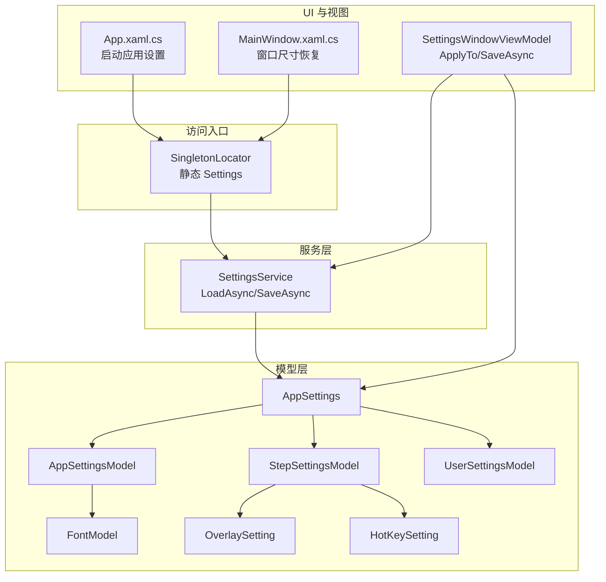
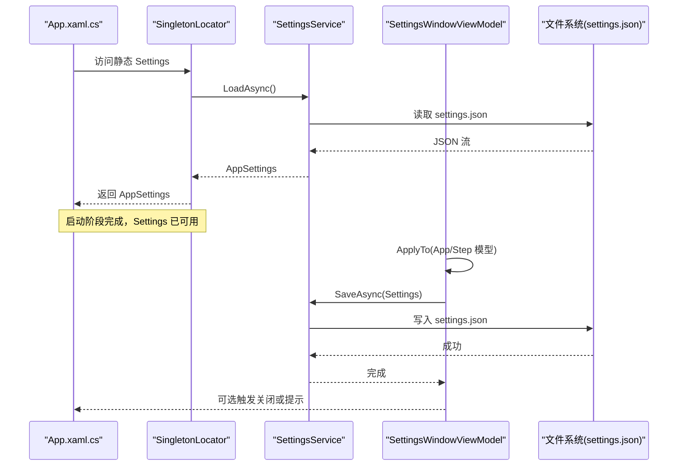
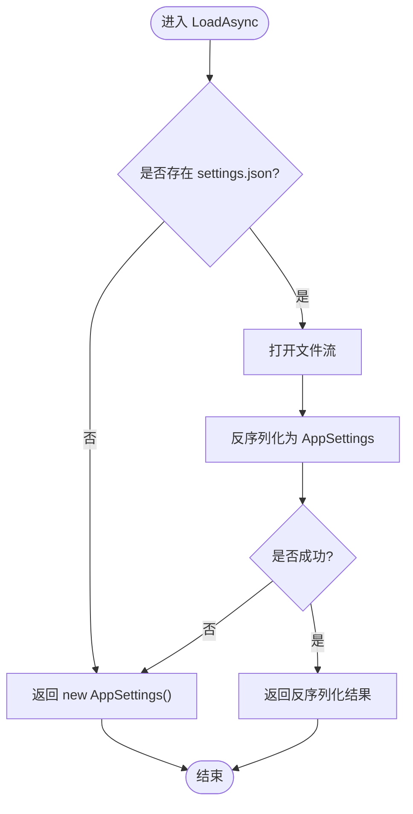
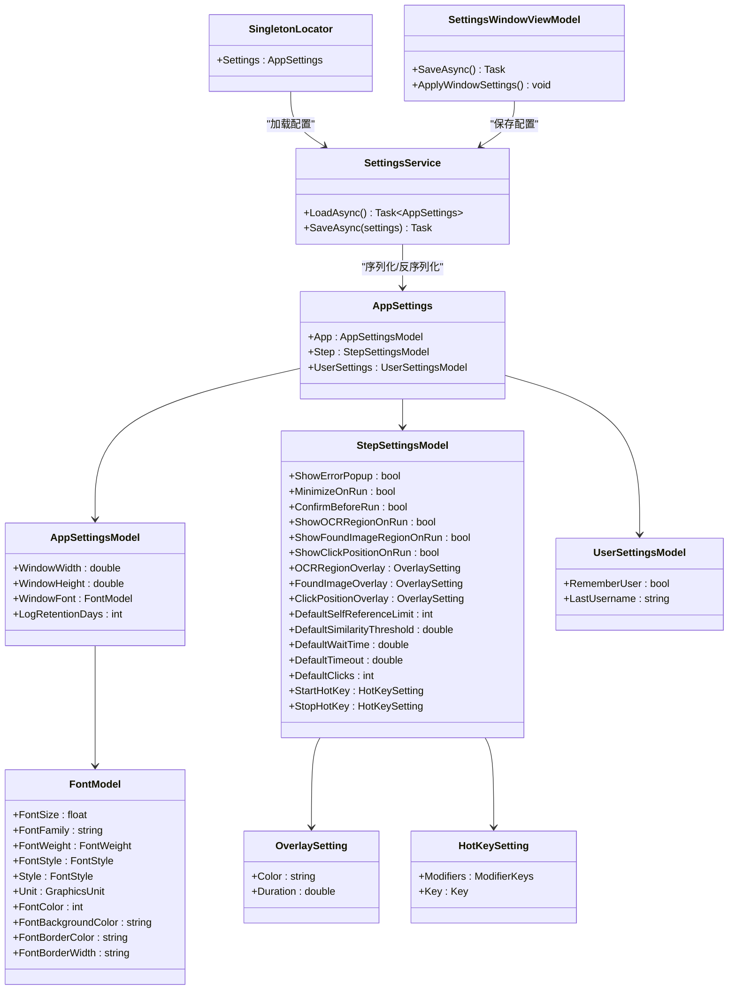

# 设置服务 (SettingsService)

<cite>
**本文引用的文件**   
- [SettingsService.cs](file://ShaoLu/Services/SettingsService.cs)
- [Settings.cs](file://ShaoLu/Models/Settings.cs)
- [FontModel.cs](file://ShaoLu/Models/FontModel.cs)
- [SingletonLocator.cs](file://ShaoLu/Utils/SingletonLocator.cs)
- [SettingsViewModel.cs](file://ShaoLu/Viewmodels/SettingsViewModel.cs)
- [App.xaml.cs](file://ShaoLu/App.xaml.cs)
- [MainWindow.xaml.cs](file://ShaoLu/MainWindow.xaml.cs)
- [IConfigurationService.cs](file://ShaoLu/Services/IConfigurationService.cs)
</cite>

## 目录
1. [简介](#简介)
2. [项目结构](#项目结构)
3. [核心组件](#核心组件)
4. [架构总览](#架构总览)
5. [详细组件分析](#详细组件分析)
6. [依赖关系分析](#依赖关系分析)
7. [性能考虑](#性能考虑)
8. [故障排查指南](#故障排查指南)
9. [结论](#结论)
10. [附录：扩展与迁移指南](#附录扩展与迁移指南)

## 简介
本文件为 ShaoLu 应用的“设置服务”提供系统化文档，重点围绕 SettingsService 的设计模式、实现原理以及配置数据的持久化机制。内容涵盖：
- 单例模式在应用中的使用方式（通过 SingletonLocator）
- 配置文件（settings.json）的加载、保存与更新流程
- 配置模型 AppSettings 的结构定义与默认值
- 配置变更的通知与应用（如全局字体刷新）
- 如何扩展新的配置项，包括数据迁移与版本兼容性处理
- 在应用程序中读取和修改设置的代码示例路径

## 项目结构
设置相关代码主要分布在以下位置：
- 服务层：SettingsService（JSON 序列化/反序列化的 I/O 封装）
- 模型层：Settings.cs（AppSettings、StepSettingsModel、AppSettingsModel、UserSettingsModel、OverlaySetting、HotKeySetting）、FontModel.cs（字体模型）
- 访问入口：SingletonLocator.cs（全局单例定位器，暴露 Settings 实例）
- UI 绑定与保存：SettingsViewModel.cs（设置窗口 ViewModel，负责将界面值回写到模型并调用 SaveAsync）
- 启动期应用：App.xaml.cs（应用启动时根据设置清理日志、应用全局字体等）
- 主窗口使用：MainWindow.xaml.cs（直接持有 AppSettings 引用以恢复窗口尺寸等）

图表来源
- [SettingsService.cs:1-38](file://ShaoLu/Services/SettingsService.cs#L1-L38)
- [Settings.cs:1-117](file://ShaoLu/Models/Settings.cs#L1-L117)
- [FontModel.cs:1-46](file://ShaoLu/Models/FontModel.cs#L1-L46)
- [SingletonLocator.cs:1-19](file://ShaoLu/Utils/SingletonLocator.cs#L1-L19)
- [SettingsViewModel.cs:1-260](file://ShaoLu/Viewmodels/SettingsViewModel.cs#L1-L260)
- [App.xaml.cs:1-112](file://ShaoLu/App.xaml.cs#L1-L112)
- [MainWindow.xaml.cs:1-200](file://ShaoLu/MainWindow.xaml.cs#L1-L200)

章节来源
- [SettingsService.cs:1-38](file://ShaoLu/Services/SettingsService.cs#L1-L38)
- [Settings.cs:1-117](file://ShaoLu/Models/Settings.cs#L1-L117)
- [FontModel.cs:1-46](file://ShaoLu/Models/FontModel.cs#L1-L46)
- [SingletonLocator.cs:1-19](file://ShaoLu/Utils/SingletonLocator.cs#L1-L19)
- [SettingsViewModel.cs:1-260](file://ShaoLu/Viewmodels/SettingsViewModel.cs#L1-L260)
- [App.xaml.cs:1-112](file://ShaoLu/App.xaml.cs#L1-L112)
- [MainWindow.xaml.cs:1-200](file://ShaoLu/MainWindow.xaml.cs#L1-L200)

## 核心组件
- SettingsService：提供异步加载与保存配置的静态方法，基于 System.Text.Json 对 settings.json 进行读写。
- AppSettings 及其子模型：集中管理应用级、步骤级、用户级配置，并提供合理的默认值。
- SingletonLocator：作为全局单例定位器，提供静态 Settings 属性，简化跨模块访问。
- SettingsWindowViewModel：负责将界面值同步到模型，并在保存时调用 SettingsService.SaveAsync，同时应用即时生效的设置（如全局字体）。
- App.xaml.cs：应用启动时读取设置并执行初始化逻辑（清理过期日志、应用全局字体等）。
- MainWindow.xaml.cs：直接使用 SingletonLocator.Settings 来恢复窗口尺寸等。

章节来源
- [SettingsService.cs:1-38](file://ShaoLu/Services/SettingsService.cs#L1-L38)
- [Settings.cs:1-117](file://ShaoLu/Models/Settings.cs#L1-L117)
- [SingletonLocator.cs:1-19](file://ShaoLu/Utils/SingletonLocator.cs#L1-L19)
- [SettingsViewModel.cs:1-260](file://ShaoLu/Viewmodels/SettingsViewModel.cs#L1-L260)
- [App.xaml.cs:1-112](file://ShaoLu/App.xaml.cs#L1-L112)
- [MainWindow.xaml.cs:1-200](file://ShaoLu/MainWindow.xaml.cs#L1-L200)

## 架构总览
设置服务的整体交互如下：
- 应用启动阶段：SingletonLocator 在静态字段中调用 SettingsService.LoadAsync() 获取 AppSettings；App.xaml.cs 使用 Settings.App.LogRetentionDays 清理日志，并使用 Settings.App.WindowFont 应用全局字体。
- 运行时读取：各业务模块通过 SingletonLocator.Settings.Step.* 或 .App.* 读取配置，无需额外参数传递。
- 设置编辑与保存：用户在设置窗口修改后，SettingsWindowViewModel.ApplyTo(...) 将 ViewModel 的值写回模型，然后调用 SettingsService.SaveAsync(Settings) 持久化到 settings.json。保存成功后可触发关闭提示或关闭窗口。

图表来源
- [App.xaml.cs:60-90](file://ShaoLu/App.xaml.cs#L60-L90)
- [SingletonLocator.cs:14-16](file://ShaoLu/Utils/SingletonLocator.cs#L14-L16)
- [SettingsService.cs:20-37](file://ShaoLu/Services/SettingsService.cs#L20-L37)
- [SettingsViewModel.cs:212-236](file://ShaoLu/Viewmodels/SettingsViewModel.cs#L212-L236)

## 详细组件分析

### SettingsService 设计与实现
- 设计要点
  - 静态类，提供 LoadAsync/SaveAsync 两个核心方法，避免实例化开销。
  - 使用 System.Text.Json 进行序列化/反序列化，WriteIndented=true 便于人工编辑。
  - 配置文件路径固定为应用根目录下的 settings.json。
- 加载流程
  - 若文件不存在则返回默认 AppSettings（所有子模型均有默认值）。
  - 存在文件则反序列化为 AppSettings，失败时回退到默认对象。
- 保存流程
  - 覆盖写入 settings.json，确保最新配置持久化。

图表来源
- [SettingsService.cs:20-28](file://ShaoLu/Services/SettingsService.cs#L20-L28)

章节来源
- [SettingsService.cs:1-38](file://ShaoLu/Services/SettingsService.cs#L1-L38)

### 配置模型结构与默认值
- AppSettings
  - App：应用级设置（窗口尺寸、字体、日志保留天数等）
  - Step：步骤运行与调试相关设置（弹窗、最小化、自引用限制、确认对话框、OCR/图像匹配/点击位置可视化、默认相似度阈值、等待/超时时间、点击次数、快捷键等）
  - UserSettings：用户级设置（记住用户名、上次用户名）
- AppSettingsModel
  - WindowWidth/Height：窗口初始大小
  - WindowFont：字体样式（由 FontModel 描述）
  - LogRetentionDays：日志保留天数（0=永不清理）
- StepSettingsModel
  - ShowErrorPopup：错误弹窗开关
  - MinimizeOnRun：运行前最小化
  - DefaultSelfReferenceLimit：自引用上限（-1 无限制，0 禁止，>0 限制次数）
  - ConfirmBeforeRun：运行前确认
  - ShowOCRRegionOnRun/ShowFoundImageRegionOnRun/ShowClickPositionOnRun：运行时区域可视化开关
  - OCRRegionOverlay/FoundImageOverlay/ClickPositionOverlay：覆盖层颜色与显示时长
  - DefaultSimilarityThreshold/DefaultWaitTime/DefaultTimeout/DefaultClicks：新建步骤默认参数
  - StartHotKey/StopHotKey：快捷键设置（修饰键+主键）
- OverlaySetting
  - Color：十六进制颜色字符串
  - Duration：显示时长（秒）
- HotKeySetting
  - Modifiers：修饰键组合
  - Key：主键
- FontModel
  - 包含字体族、大小、粗细、风格、单位、颜色、背景色、边框色与宽度等，并提供 Clone 方法与默认系统字体初始化

章节来源
- [Settings.cs:1-117](file://ShaoLu/Models/Settings.cs#L1-L117)
- [FontModel.cs:1-46](file://ShaoLu/Models/FontModel.cs#L1-L46)

### 配置加载、保存与更新机制
- 加载
  - 通过 SingletonLocator.Settings 静态属性获取，内部调用 SettingsService.LoadAsync() 完成。
  - 首次运行或文件缺失时，返回默认配置。
- 保存
  - 在设置窗口中，用户修改后调用 SettingsWindowViewModel.SaveAsync()，该方法先将 ViewModel 值 ApplyTo 到模型，再调用 SettingsService.SaveAsync(Settings)。
- 更新与通知
  - 保存成功后，SettingsWindowViewModel.ApplyWindowSettings() 会应用全局字体设置，遍历当前所有窗口并更新字体属性，实现即时生效。
  - App.xaml.cs 在启动时也会应用全局字体，保证程序启动即符合用户偏好。

```mermaid
sequenceDiagram
participant VM as "SettingsWindowViewModel"
participant SS as "SettingsService"
participant FS as "文件系统"
participant Win as "WPF 窗口集合"
VM->>VM : ApplyTo(App/Step 模型)
VM->>SS : SaveAsync(Settings)
SS->>FS : 写入 settings.json
FS-->>SS : 成功
SS-->>VM : 完成
VM->>Win : ApplyGlobalFont(应用新字体)
Win-->>VM : 所有窗口字体更新
```

图表来源
- [SettingsViewModel.cs:212-236](file://ShaoLu/Viewmodels/SettingsViewModel.cs#L212-L236)
- [SettingsViewModel.cs:238-258](file://ShaoLu/Viewmodels/SettingsViewModel.cs#L238-L258)
- [App.xaml.cs:72-81](file://ShaoLu/App.xaml.cs#L72-L81)

章节来源
- [SettingsViewModel.cs:176-236](file://ShaoLu/Viewmodels/SettingsViewModel.cs#L176-L236)
- [App.xaml.cs:72-81](file://ShaoLu/App.xaml.cs#L72-L81)

### 单例模式的使用
- 通过 SingletonLocator.Settings 暴露全局唯一的 AppSettings 实例，避免在各处重复构造或传递。
- 该静态字段在类加载时即调用 SettingsService.LoadAsync().GetAwaiter().GetResult() 完成初始化，确保后续访问可用。
- 注意：此处为同步阻塞式初始化，适用于应用启动早期且加载耗时较短的场景。

章节来源
- [SingletonLocator.cs:14-16](file://ShaoLu/Utils/SingletonLocator.cs#L14-L16)

### 配置变更的通知机制
- 当前实现未采用事件驱动的配置变更通知（如 INotifyPropertyChanged），而是通过“保存后即时应用”的方式实现部分变更的即时生效（例如字体）。
- 对于需要实时响应的场景，可在 AppSettings 或其子模型上引入事件或属性变更通知，并在监听者中执行相应动作（如重新初始化 OCR 区域、热键注册等）。

章节来源
- [SettingsViewModel.cs:238-258](file://ShaoLu/Viewmodels/SettingsViewModel.cs#L238-L258)

### 如何在应用中读取与修改设置（示例路径）
- 读取设置
  - 启动期：App.xaml.cs 中使用 SingletonLocator.Settings.App.LogRetentionDays 清理日志，使用 WindowFont 应用全局字体。
  - 主窗口：MainWindow.xaml.cs 中直接引用 SingletonLocator.Settings 以恢复窗口尺寸等。
  - 业务逻辑：如 GetInputStep.cs、ImageRecognition.cs、ImagesRecognition.cs 中读取 Step 相关设置控制行为。
- 修改设置
  - 通过设置窗口：SettingsWindowViewModel.SaveAsync() 将界面值回写到模型并持久化。
  - 代码内修改：可直接修改 SingletonLocator.Settings 对应属性，随后调用 SettingsService.SaveAsync(Settings) 持久化。

章节来源
- [App.xaml.cs:72-81](file://ShaoLu/App.xaml.cs#L72-L81)
- [MainWindow.xaml.cs:28-30](file://ShaoLu/MainWindow.xaml.cs#L28-L30)
- [SettingsViewModel.cs:212-236](file://ShaoLu/Viewmodels/SettingsViewModel.cs#L212-L236)

## 依赖关系分析
- SettingsService 依赖 System.Text.Json 进行序列化/反序列化，依赖文件系统读写 settings.json。
- SingletonLocator 依赖 SettingsService 完成配置加载，并为其他模块提供统一访问点。
- SettingsWindowViewModel 依赖 SettingsService 进行保存，并依赖 WPF 窗口集合进行字体应用。
- App.xaml.cs 依赖 SingletonLocator.Settings 获取配置，用于启动期初始化。
- MainWindow.xaml.cs 依赖 SingletonLocator.Settings 获取配置，用于窗口状态恢复。

图表来源
- [SettingsService.cs:1-38](file://ShaoLu/Services/SettingsService.cs#L1-L38)
- [Settings.cs:1-117](file://ShaoLu/Models/Settings.cs#L1-L117)
- [FontModel.cs:1-46](file://ShaoLu/Models/FontModel.cs#L1-L46)
- [SingletonLocator.cs:1-19](file://ShaoLu/Utils/SingletonLocator.cs#L1-L19)
- [SettingsViewModel.cs:1-260](file://ShaoLu/Viewmodels/SettingsViewModel.cs#L1-L260)

章节来源
- [SettingsService.cs:1-38](file://ShaoLu/Services/SettingsService.cs#L1-L38)
- [Settings.cs:1-117](file://ShaoLu/Models/Settings.cs#L1-L117)
- [FontModel.cs:1-46](file://ShaoLu/Models/FontModel.cs#L1-L46)
- [SingletonLocator.cs:1-19](file://ShaoLu/Utils/SingletonLocator.cs#L1-L19)
- [SettingsViewModel.cs:1-260](file://ShaoLu/Viewmodels/SettingsViewModel.cs#L1-L260)

## 性能考虑
- 序列化/反序列化：System.Text.Json 性能良好，WriteIndented=true 提升可读性但略增体积，适合桌面应用本地配置。
- 文件 I/O：每次保存都会覆盖写入，建议批量更新后再保存，避免频繁磁盘写入。
- 启动加载：SingletonLocator.Settings 在类加载时同步阻塞加载，若未来配置复杂或体积增大，建议改为延迟加载或缓存策略。
- 内存占用：AppSettings 全量加载，通常较小；如需按需加载，可拆分多个配置文件或使用懒加载。

[本节为通用指导，不直接分析具体文件]

## 故障排查指南
- settings.json 损坏或格式错误
  - 现象：LoadAsync 反序列化失败，回退到默认 AppSettings。
  - 处理：检查 JSON 语法，必要时删除损坏文件让应用重建默认配置。
- 保存失败（权限不足或路径不可写）
  - 现象：SaveAsync 抛出异常。
  - 处理：确保应用具有写入权限，或更改输出目录。
- 字体应用无效
  - 现象：保存后字体未生效。
  - 处理：确认 SettingsWindowViewModel.ApplyGlobalFont 被调用，检查 FontModel 字段是否正确填充。
- 启动期日志清理未按预期
  - 现象：日志未按保留天数清理。
  - 处理：检查 App.xaml.cs 中 LogRetentionDays 的值是否为 0（永不清理）或其他有效值。

章节来源
- [SettingsService.cs:20-28](file://ShaoLu/Services/SettingsService.cs#L20-L28)
- [SettingsViewModel.cs:238-258](file://ShaoLu/Viewmodels/SettingsViewModel.cs#L238-L258)
- [App.xaml.cs:72-81](file://ShaoLu/App.xaml.cs#L72-L81)

## 结论
SettingsService 提供了简洁可靠的配置持久化能力，配合 SingletonLocator 的全局访问与 SettingsWindowViewModel 的界面绑定，形成了完整的“读取—编辑—保存—应用”闭环。模型设计清晰、默认值完善，便于扩展与维护。建议在需要实时响应配置变更的场景引入事件或属性通知机制，并对启动加载进行优化以提升用户体验。

[本节为总结，不直接分析具体文件]

## 附录：扩展与迁移指南

### 新增配置项的步骤
- 在 Settings.cs 中添加新字段到合适的模型（如 AppSettingsModel 或 StepSettingsModel），并设置合理默认值。
- 在 SettingsWindowViewModel 中新增对应的 ViewModel 属性与 ApplyTo 映射，以便界面绑定与保存。
- 在需要的地方读取新配置（如 App.xaml.cs、业务模块），并根据需要添加应用逻辑（如重启 OCR、重新注册热键等）。
- 保存后确保即时生效（如有必要，增加通知机制或重新初始化相关服务）。

章节来源
- [Settings.cs:1-117](file://ShaoLu/Models/Settings.cs#L1-L117)
- [SettingsViewModel.cs:118-157](file://ShaoLu/Viewmodels/SettingsViewModel.cs#L118-L157)

### 数据迁移与版本兼容性
- 向后兼容：由于 LoadAsync 在反序列化失败时会返回默认 AppSettings，新增字段不会影响旧版配置文件。
- 向前兼容：若移除或重命名字段，建议在迁移逻辑中检测旧版本并转换为新版本结构（可在 LoadAsync 中增加版本判断与转换）。
- 建议：为 AppSettings 增加 Version 字段，并在加载时执行迁移脚本，确保平滑升级。

章节来源
- [SettingsService.cs:20-28](file://ShaoLu/Services/SettingsService.cs#L20-L28)

### 使用示例（路径参考）
- 启动期读取：App.xaml.cs 中读取 LogRetentionDays 与 WindowFont。
- 主窗口使用：MainWindow.xaml.cs 中读取 AppSettings 以恢复窗口尺寸。
- 设置窗口保存：SettingsWindowViewModel.SaveAsync 中将界面值回写并持久化。

章节来源
- [App.xaml.cs:72-81](file://ShaoLu/App.xaml.cs#L72-L81)
- [MainWindow.xaml.cs:28-30](file://ShaoLu/MainWindow.xaml.cs#L28-L30)
- [SettingsViewModel.cs:212-236](file://ShaoLu/Viewmodels/SettingsViewModel.cs#L212-L236)