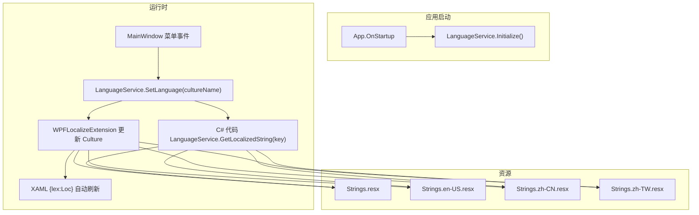
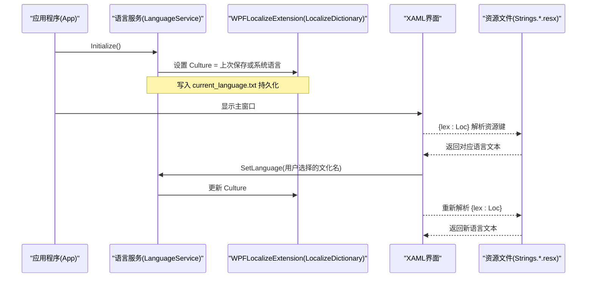
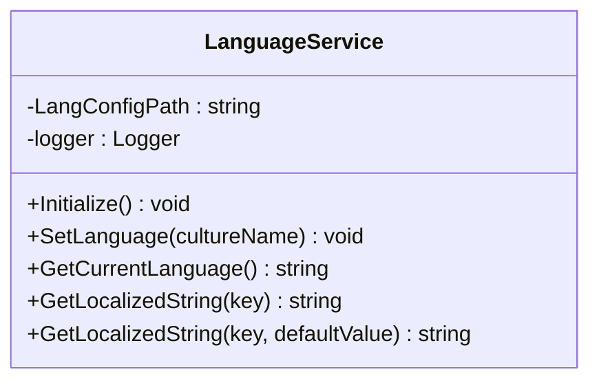
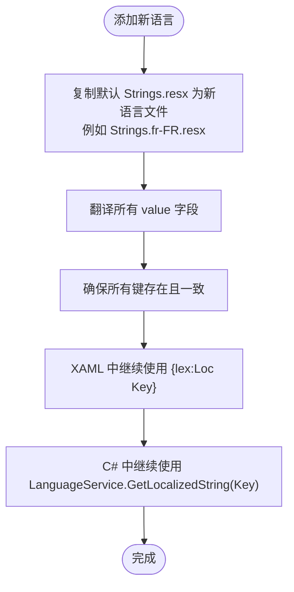
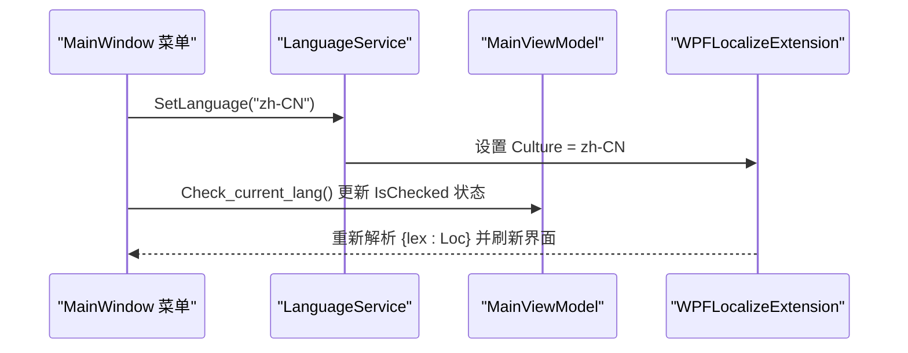
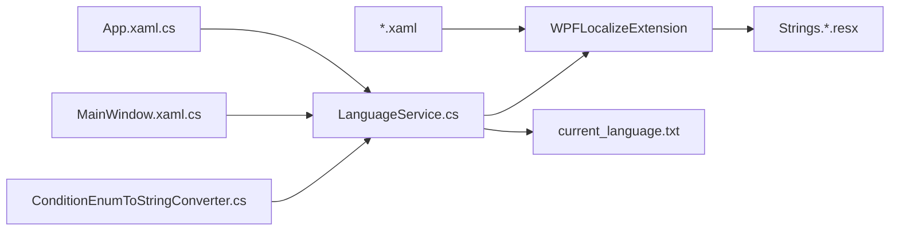

# 语言服务 (LanguageService)

<cite>
**本文引用的文件**   
- [LanguageService.cs](file://ShaoLu/Services/LanguageService.cs)
- [App.xaml.cs](file://ShaoLu/App.xaml.cs)
- [MainWindow.xaml](file://ShaoLu/MainWindow.xaml)
- [MainWindow.xaml.cs](file://ShaoLu/MainWindow.xaml.cs)
- [ConditionEnumToStringConverter.cs](file://ShaoLu/Converters/ConditionEnumToStringConverter.cs)
- [Strings.resx](file://ShaoLu/Resources/Strings.resx)
- [Strings.en-US.resx](file://ShaoLu/Resources/Strings.en-US.resx)
- [Strings.zh-CN.resx](file://ShaoLu/Resources/Strings.zh-CN.resx)
- [Strings.zh-TW.resx](file://ShaoLu/Resources/Strings.zh-TW.resx)
- [WindowSettings.xaml](file://ShaoLu/Views/WindowSettings.xaml)
- [SettingsTemplates.xaml](file://ShaoLu/Templates/SettingsTemplates.xaml)
</cite>

## 目录
1. [简介](#简介)
2. [项目结构](#项目结构)
3. [核心组件](#核心组件)
4. [架构总览](#架构总览)
5. [详细组件分析](#详细组件分析)
6. [依赖关系分析](#依赖关系分析)
7. [性能考虑](#性能考虑)
8. [故障排查指南](#故障排查指南)
9. [结论](#结论)
10. [附录](#附录)

## 简介
本文件为 ShaoLu 应用的语言服务提供完整、深入的技术文档。重点说明 LanguageService 类的设计目标与多语言支持机制，资源文件的组织结构（以 Strings.resx 系列为核心），运行时动态切换语言的实现原理与界面更新方式，新增语言支持的步骤，以及语言服务的缓存与性能优化策略。同时给出在 XAML 与 C# 中使用多语言资源的示例路径，帮助开发者快速扩展新的语言包。

## 项目结构
- 语言服务位于 Services 命名空间下，提供统一的初始化、设置、获取当前语言与本地化字符串解析能力。
- 资源文件集中于 Resources 目录，采用 Microsoft ResX 格式，按文化名区分不同语言版本。
- WPF 通过 WPFLocalizeExtension（lex:Loc）在 XAML 中直接绑定到 Strings 资源字典；C# 代码通过 LanguageService 访问同一套资源。
- 应用启动时由 App 调用 LanguageService.Initialize() 完成语言初始化；用户通过主窗口菜单触发 SetLanguage() 并刷新 UI 选中状态。

**图表来源** 
- [App.xaml.cs](file://ShaoLu/App.xaml.cs)
- [LanguageService.cs](file://ShaoLu/Services/LanguageService.cs)
- [MainWindow.xaml](file://ShaoLu/MainWindow.xaml)
- [Strings.resx](file://ShaoLu/Resources/Strings.resx)
- [Strings.en-US.resx](file://ShaoLu/Resources/Strings.en-US.resx)
- [Strings.zh-CN.resx](file://ShaoLu/Resources/Strings.zh-CN.resx)
- [Strings.zh-TW.resx](file://ShaoLu/Resources/Strings.zh-TW.resx)

**章节来源**
- [App.xaml.cs](file://ShaoLu/App.xaml.cs)
- [LanguageService.cs](file://ShaoLu/Services/LanguageService.cs)
- [MainWindow.xaml](file://ShaoLu/MainWindow.xaml)

## 核心组件
- LanguageService：静态服务类，负责：
  - Initialize：读取上次保存的语言或系统语言，设置全局 Culture。
  - SetLanguage：设置 Culture 并持久化到 current_language.txt。
  - GetCurrentLanguage：返回当前 Culture.Name。
  - GetLocalizedString：通过 LocalizeDictionary 获取本地化字符串，缺失时回退到 key 或默认值。
- 资源字典 Strings.*.resx：包含所有 UI 文案键值对，按文化名组织。
- XAML 绑定：使用 lex:ResxLocalizationProvider 指定默认程序集与字典名称，{lex:Loc} 标记扩展用于绑定资源键。
- C# 调用：在转换器、对话框提示等场景通过 LanguageService.GetLocalizedString 获取文案。

**章节来源**
- [LanguageService.cs](file://ShaoLu/Services/LanguageService.cs)
- [Strings.resx](file://ShaoLu/Resources/Strings.resx)
- [MainWindow.xaml](file://ShaoLu/MainWindow.xaml)
- [ConditionEnumToStringConverter.cs](file://ShaoLu/Converters/ConditionEnumToStringConverter.cs)

## 架构总览
下图展示从应用启动到语言切换的端到端流程，包括配置读取、Culture 设置、XAML 自动刷新与 C# 动态取值。

**图表来源** 
- [App.xaml.cs](file://ShaoLu/App.xaml.cs)
- [LanguageService.cs](file://ShaoLu/Services/LanguageService.cs)
- [MainWindow.xaml](file://ShaoLu/MainWindow.xaml)

## 详细组件分析

### LanguageService 设计与实现
- 设计目标
  - 统一入口：集中管理语言初始化、切换与取值。
  - 持久化：将用户选择的语言保存到文件，下次启动优先使用。
  - 容错：无效文化名记录错误日志，避免崩溃。
  - 兼容：为 C# 侧提供便捷 API，与 XAML 的 lex:Loc 保持一致的资源源。
- 关键方法
  - Initialize：读取 current_language.txt 或系统语言，调用 SetLanguage。
  - SetLanguage：设置 LocalizeDictionary.Instance.Culture，写入配置文件，记录日志。
  - GetCurrentLanguage：返回当前 Culture.Name。
  - GetLocalizedString：封装 LocalizeDictionary 的取值逻辑，提供默认回退。
- 异常处理
  - 捕获 CultureNotFoundException，记录错误日志，保证健壮性。

**图表来源** 
- [LanguageService.cs](file://ShaoLu/Services/LanguageService.cs)

**章节来源**
- [LanguageService.cs](file://ShaoLu/Services/LanguageService.cs)

### 资源文件组织结构（Strings.resx 系列）
- 文件命名规范
  - 默认资源：Strings.resx（作为回退资源）
  - 英文：Strings.en-US.resx
  - 简体中文：Strings.zh-CN.resx
  - 繁体中文：Strings.zh-TW.resx
- 内容组织
  - 每个 .resx 文件包含大量 <data name="..."> 条目，name 为键，value 为对应语言文本。
  - 键命名遵循语义化约定，如 AppTitle、Save、StepDetails、Menu_Login 等。
- 使用方式
  - XAML：通过 lex:ResxLocalizationProvider 指定 DefaultAssembly 与 DefaultDictionary，然后使用 {lex:Loc Key} 绑定。
  - C#：通过 LanguageService.GetLocalizedString("Key") 获取文本。

**图表来源** 
- [Strings.resx](file://ShaoLu/Resources/Strings.resx)
- [Strings.en-US.resx](file://ShaoLu/Resources/Strings.en-US.resx)
- [Strings.zh-CN.resx](file://ShaoLu/Resources/Strings.zh-CN.resx)
- [Strings.zh-TW.resx](file://ShaoLu/Resources/Strings.zh-TW.resx)

**章节来源**
- [Strings.resx](file://ShaoLu/Resources/Strings.resx)
- [Strings.en-US.resx](file://ShaoLu/Resources/Strings.en-US.resx)
- [Strings.zh-CN.resx](file://ShaoLu/Resources/Strings.zh-CN.resx)
- [Strings.zh-TW.resx](file://ShaoLu/Resources/Strings.zh-TW.resx)

### 运行时语言切换与界面更新机制
- 初始化阶段
  - App.OnStartup 调用 LanguageService.Initialize()，根据上次保存或系统语言设置 Culture。
- 用户切换语言
  - MainWindow 菜单项 Tag 携带文化名（如 en-US、zh-CN、zh-TW）。
  - 点击后调用 LanguageService.SetLanguage(item.Tag)，更新 Culture 并持久化。
  - 随后检查当前语言并更新 ViewModel 中的选中状态（English/Simplified/Tranditional）。
- 界面刷新
  - XAML 使用 {lex:Loc}，当 Culture 变化时，WPFLocalizeExtension 自动重新解析资源键，界面即时更新。
  - C# 侧通过 LanguageService.GetLocalizedString 动态获取文案，适用于对话框标题、提示信息等。

**图表来源** 
- [MainWindow.xaml](file://ShaoLu/MainWindow.xaml)
- [MainWindow.xaml.cs](file://ShaoLu/MainWindow.xaml.cs)
- [LanguageService.cs](file://ShaoLu/Services/LanguageService.cs)

**章节来源**
- [MainWindow.xaml](file://ShaoLu/MainWindow.xaml)
- [MainWindow.xaml.cs](file://ShaoLu/MainWindow.xaml.cs)
- [LanguageService.cs](file://ShaoLu/Services/LanguageService.cs)

### 在 XAML 与 C# 中使用多语言资源
- XAML 使用示例
  - 在 Window/UserControl 根元素声明 lex 命名空间与默认字典。
  - 使用 {lex:Loc Key} 绑定标题、按钮文本、菜单项等。
  - 参考路径：[MainWindow.xaml](file://ShaoLu/MainWindow.xaml)、[WindowSettings.xaml](file://ShaoLu/Views/WindowSettings.xaml)、[SettingsTemplates.xaml](file://ShaoLu/Templates/SettingsTemplates.xaml)。
- C# 使用示例
  - 在转换器中通过 LanguageService.GetLocalizedString 返回本地化枚举显示文本。
  - 在对话框提示、文件对话框标题等处使用 LanguageService.GetLocalizedString。
  - 参考路径：[ConditionEnumToStringConverter.cs](file://ShaoLu/Converters/ConditionEnumToStringConverter.cs)、[MainWindow.xaml.cs](file://ShaoLu/MainWindow.xaml.cs)。

**章节来源**
- [MainWindow.xaml](file://ShaoLu/MainWindow.xaml)
- [WindowSettings.xaml](file://ShaoLu/Views/WindowSettings.xaml)
- [SettingsTemplates.xaml](file://ShaoLu/Templates/SettingsTemplates.xaml)
- [ConditionEnumToStringConverter.cs](file://ShaoLu/Converters/ConditionEnumToStringConverter.cs)
- [MainWindow.xaml.cs](file://ShaoLu/MainWindow.xaml.cs)

### 如何扩展新的语言包
- 步骤
  - 复制默认 Strings.resx 为新语言文件（如 Strings.fr-FR.resx）。
  - 翻译所有 value 字段，保持 name 键一致。
  - 在 XAML 中无需额外配置，lex:Loc 会自动识别新文化名。
  - 如需在菜单中提供切换选项，可在 MainWindow 菜单中添加对应 MenuItem，Tag 设置为新文化名。
- 注意事项
  - 确保所有键在新语言文件中都存在，避免回退到默认键名。
  - 若需要特定字体或排版差异，可结合样式与模板进行适配。

**章节来源**
- [Strings.resx](file://ShaoLu/Resources/Strings.resx)
- [MainWindow.xaml](file://ShaoLu/MainWindow.xaml)

## 依赖关系分析
- 外部库
  - WPFLocalizeExtension：提供 LocalizeDictionary 与 {lex:Loc} 标记扩展，负责资源解析与 Culture 切换。
  - NLog：用于记录语言设置成功与失败日志。
- 内部依赖
  - App 启动时依赖 LanguageService.Initialize()。
  - MainWindow 菜单事件依赖 LanguageService.SetLanguage()。
  - 转换器与业务代码依赖 LanguageService.GetLocalizedString()。

**图表来源** 
- [App.xaml.cs](file://ShaoLu/App.xaml.cs)
- [MainWindow.xaml.cs](file://ShaoLu/MainWindow.xaml.cs)
- [ConditionEnumToStringConverter.cs](file://ShaoLu/Converters/ConditionEnumToStringConverter.cs)
- [LanguageService.cs](file://ShaoLu/Services/LanguageService.cs)

**章节来源**
- [App.xaml.cs](file://ShaoLu/App.xaml.cs)
- [MainWindow.xaml.cs](file://ShaoLu/MainWindow.xaml.cs)
- [ConditionEnumToStringConverter.cs](file://ShaoLu/Converters/ConditionEnumToStringConverter.cs)
- [LanguageService.cs](file://ShaoLu/Services/LanguageService.cs)

## 性能考虑
- 资源加载
  - WPFLocalizeExtension 会按需加载资源字典，首次解析可能略有开销，后续使用内存缓存。
- 切换成本
  - 切换语言仅更新 Culture，XAML 层自动刷新，无全量重建，性能影响较小。
- 建议
  - 避免频繁调用 GetLocalizedString，可在批量更新时缓存结果。
  - 大型资源文件可按模块拆分，减少初始加载体积。
  - 使用 NLog 记录切换日志，便于定位问题与监控使用情况。

## 故障排查指南
- 常见问题
  - 语言未生效：检查 current_language.txt 是否存在且内容为有效文化名。
  - 资源缺失：确认 Strings.*.resx 中包含所需键，否则回退到键名。
  - 切换后 UI 未刷新：确认 XAML 使用了 {lex:Loc}，且 Culture 已正确设置。
- 调试建议
  - 查看 NLog 日志，确认 SetLanguage 是否抛出 CultureNotFoundException。
  - 在 MainWindow 中打印 GetCurrentLanguage() 验证当前 Culture。
  - 在转换器中输出 GetLocalizedString 返回值，确认键映射正确。

**章节来源**
- [LanguageService.cs](file://ShaoLu/Services/LanguageService.cs)
- [MainWindow.xaml.cs](file://ShaoLu/MainWindow.xaml.cs)

## 结论
ShaoLu 的语言服务通过 LanguageService 与 WPFLocalizeExtension 实现了简洁、高效的多语言支持。资源文件以 Strings.resx 系列为中心，XAML 与 C# 均可无缝使用。运行时切换语言即时生效，持久化机制确保用户偏好跨会话保留。通过本文档，开发者可以快速理解架构、正确使用 API，并按需扩展新的语言包。

## 附录
- 常用键示例（来自资源文件）
  - AppTitle、Save、Open、Menu_Login、StepDetails、Warning、Success 等。
- 相关路径
  - 语言服务：[LanguageService.cs](file://ShaoLu/Services/LanguageService.cs)
  - 资源文件：[Strings.resx](file://ShaoLu/Resources/Strings.resx)、[Strings.en-US.resx](file://ShaoLu/Resources/Strings.en-US.resx)、[Strings.zh-CN.resx](file://ShaoLu/Resources/Strings.zh-CN.resx)、[Strings.zh-TW.resx](file://ShaoLu/Resources/Strings.zh-TW.resx)
  - XAML 使用：[MainWindow.xaml](file://ShaoLu/MainWindow.xaml)、[WindowSettings.xaml](file://ShaoLu/Views/WindowSettings.xaml)、[SettingsTemplates.xaml](file://ShaoLu/Templates/SettingsTemplates.xaml)
  - C# 使用：[ConditionEnumToStringConverter.cs](file://ShaoLu/Converters/ConditionEnumToStringConverter.cs)、[MainWindow.xaml.cs](file://ShaoLu/MainWindow.xaml.cs)