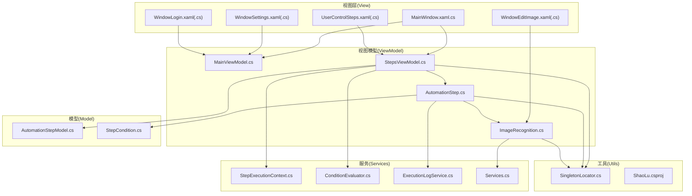
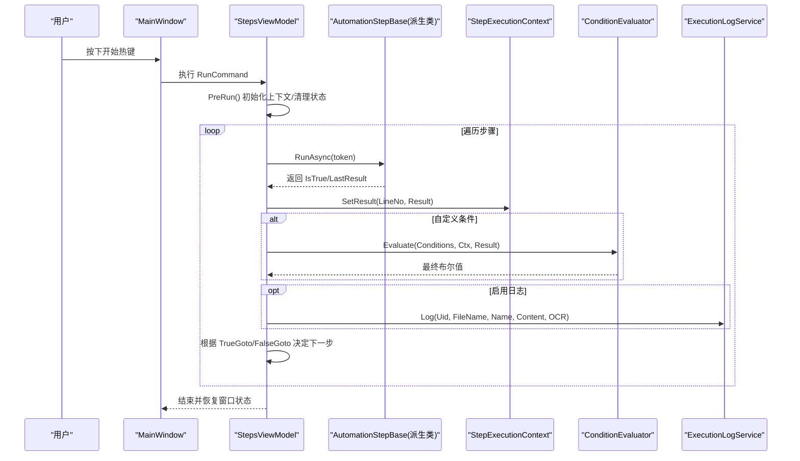
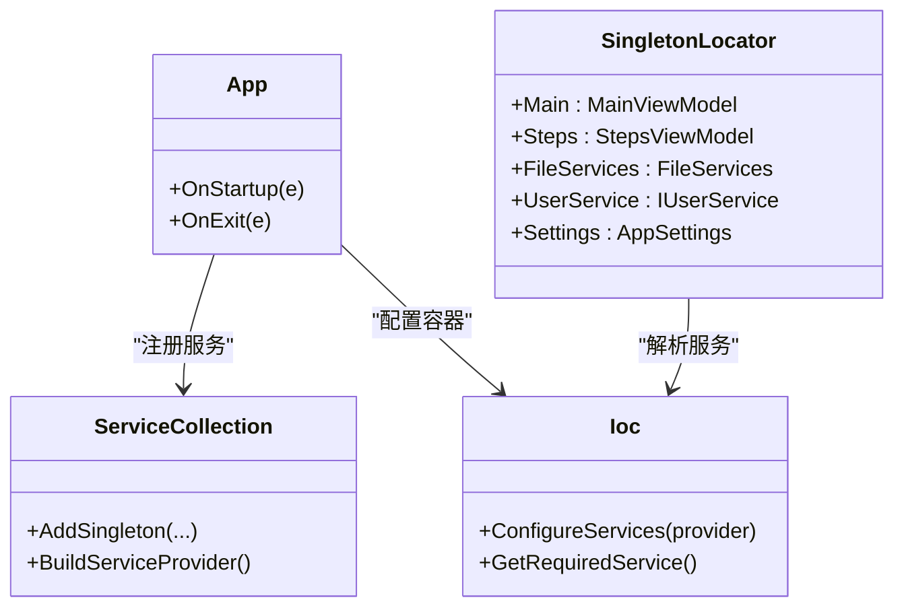
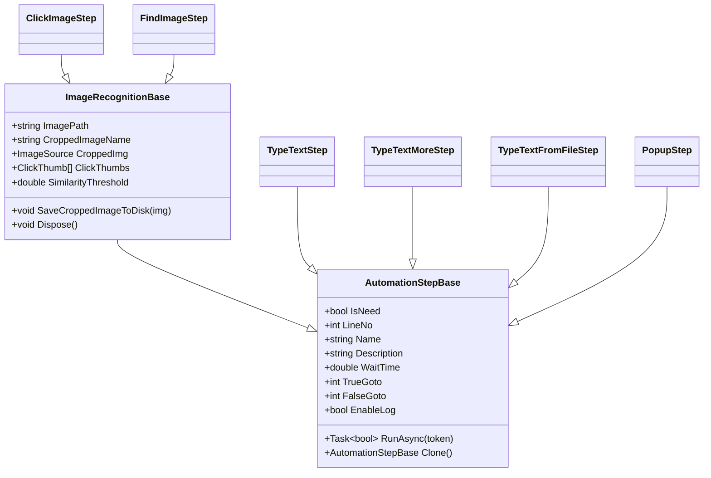
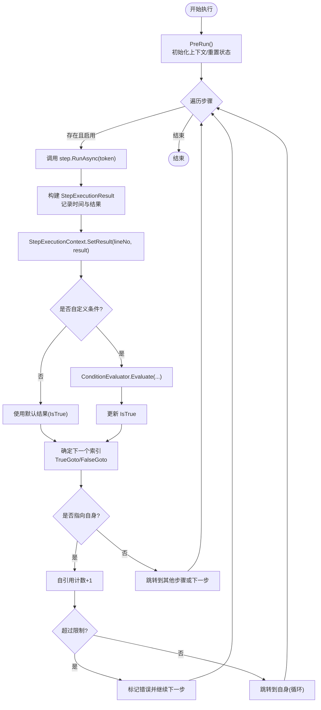
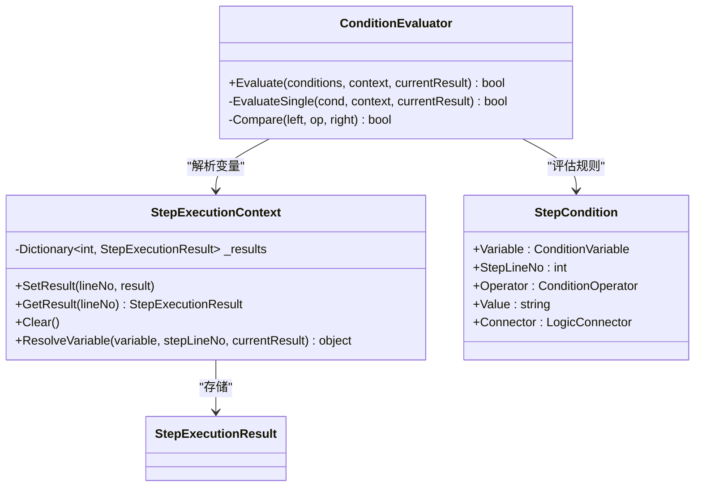
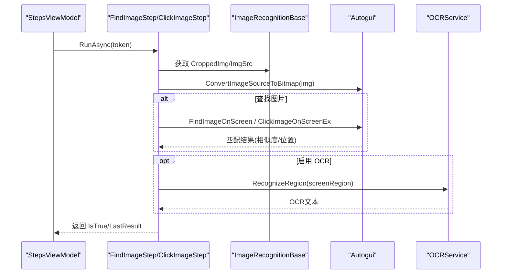
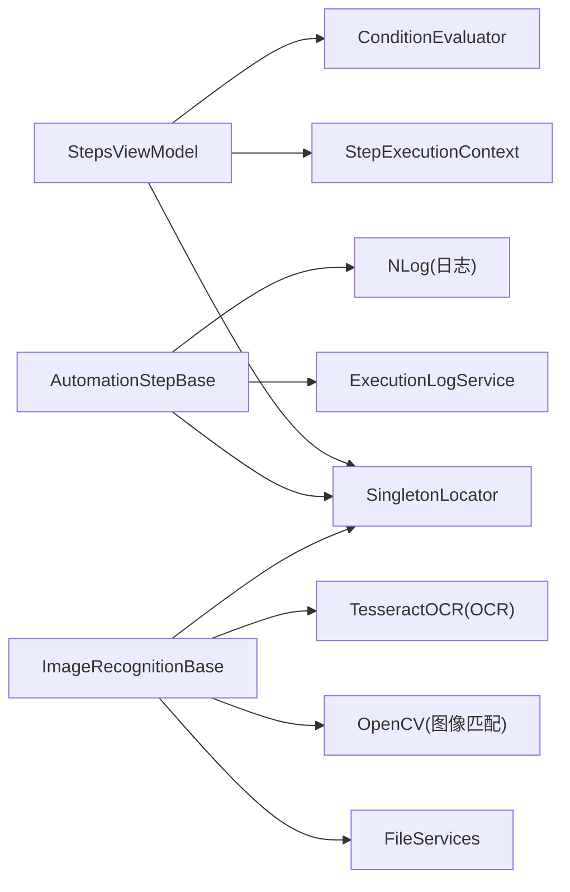

# 架构设计

<cite>
**本文引用的文件**   
- [App.xaml.cs](file://ShaoLu/App.xaml.cs)
- [MainWindow.xaml.cs](file://ShaoLu/MainWindow.xaml.cs)
- [MainViewModel.cs](file://ShaoLu/Viewmodels/MainViewModel.cs)
- [StepsViewModel.cs](file://ShaoLu/Viewmodels/StepsViewModel.cs)
- [AutomationStep.cs](file://ShaoLu/Viewmodels/AutomationStep.cs)
- [ImageRecognition.cs](file://ShaoLu/Viewmodels/ImageRecognition.cs)
- [SingletonLocator.cs](file://ShaoLu/Utils/SingletonLocator.cs)
- [Services.cs](file://ShaoLu/Services/Services.cs)
- [ConditionEvaluator.cs](file://ShaoLu/Services/ConditionEvaluator.cs)
- [StepExecutionContext.cs](file://ShaoLu/Services/StepExecutionContext.cs)
- [AutomationStepModel.cs](file://ShaoLu/Models/AutomationStepModel.cs)
- [StepCondition.cs](file://ShaoLu/Models/StepCondition.cs)
- [ExecutionLogService.cs](file://ShaoLu/Services/ExecutionLogService.cs)
- [ShaoLu.csproj](file://ShaoLu/ShaoLu.csproj)
</cite>

## 目录
1. [简介](#简介)
2. [项目结构](#项目结构)
3. [核心组件](#核心组件)
4. [架构总览](#架构总览)
5. [详细组件分析](#详细组件分析)
6. [依赖关系分析](#依赖关系分析)
7. [性能考量](#性能考量)
8. [故障排查指南](#故障排查指南)
9. [结论](#结论)
10. [附录](#附录)

## 简介
本文件为 ShaoLu（烧录）项目的架构设计文档，围绕 MVVM 架构模式、依赖注入与模块化设计、插件化扩展机制（基于 AutomationStepBase）、系统边界与数据流进行系统化说明。目标是帮助开发者快速理解整体设计思路、关键交互流程与可扩展性设计，并给出可操作的架构图表与排障建议。

## 项目结构
ShaoLu 采用 WPF + MVVM 的桌面应用结构，按职责分层组织：
- View：XAML 窗口与用户控件，负责 UI 展示与用户交互
- ViewModel：业务编排、命令绑定、状态管理，驱动 View
- Model：领域模型与枚举（步骤类型、错误类型、条件变量等）
- Services：横切服务（OCR、日志、语言、设置、执行上下文、条件评估等）
- Utils：工具类（单例定位器、原生方法封装、步骤文件读写等）
- Templates/Themes/Resources：UI 模板、主题与多语言资源

图表来源 
- [MainWindow.xaml.cs:1-120](file://ShaoLu/MainWindow.xaml.cs#L1-L120)
- [StepsViewModel.cs:1-120](file://ShaoLu/Viewmodels/StepsViewModel.cs#L1-L120)
- [AutomationStep.cs:1-200](file://ShaoLu/Viewmodels/AutomationStep.cs#L1-L200)
- [ImageRecognition.cs:1-120](file://ShaoLu/Viewmodels/ImageRecognition.cs#L1-L120)
- [AutomationStepModel.cs:1-47](file://ShaoLu/Models/AutomationStepModel.cs#L1-L47)
- [StepCondition.cs:1-122](file://ShaoLu/Models/StepCondition.cs#L1-L122)
- [StepExecutionContext.cs:1-88](file://ShaoLu/Services/StepExecutionContext.cs#L1-L88)
- [ConditionEvaluator.cs:1-187](file://ShaoLu/Services/ConditionEvaluator.cs#L1-L187)
- [ExecutionLogService.cs:1-179](file://ShaoLu/Services/ExecutionLogService.cs#L1-L179)
- [Services.cs:1-179](file://ShaoLu/Services/Services.cs#L1-L179)
- [SingletonLocator.cs:1-19](file://ShaoLu/Utils/SingletonLocator.cs#L1-L19)
- [ShaoLu.csproj:1-120](file://ShaoLu/ShaoLu.csproj#L1-L120)

章节来源
- [App.xaml.cs:1-86](file://ShaoLu/App.xaml.cs#L1-L86)
- [MainWindow.xaml.cs:1-120](file://ShaoLu/MainWindow.xaml.cs#L1-L120)
- [ShaoLu.csproj:1-120](file://ShaoLu/ShaoLu.csproj#L1-L120)

## 核心组件
- 启动与依赖注入容器初始化：在应用启动时注册 ViewModel 与服务，构建 Ioc 容器，提供全局解析入口
- 主窗口与热键：注册全局快捷键触发运行/停止，调用 StepsViewModel 的命令
- 步骤执行引擎：StepsViewModel 维护步骤集合与执行循环，支持跳转、自引用保护、取消与异常处理
- 步骤基类与具体步骤：AutomationStepBase 定义通用属性与 RunAsync；图像识别基类 ImageRecognitionBase 提供图片加载、裁剪保存与点击点管理；具体步骤实现各自 RunAsync
- 条件评估与执行上下文：StepExecutionContext 存储各步骤执行结果，ConditionEvaluator 根据规则行计算布尔结果
- 日志与持久化：ExecutionLogService 使用 SQLite 记录文字输入与 OCR 结果；FileServices 提供智能文本读取与延迟删除提交

章节来源
- [App.xaml.cs:1-86](file://ShaoLu/App.xaml.cs#L1-L86)
- [MainWindow.xaml.cs:1-120](file://ShaoLu/MainWindow.xaml.cs#L1-L120)
- [StepsViewModel.cs:1-200](file://ShaoLu/Viewmodels/StepsViewModel.cs#L1-L200)
- [AutomationStep.cs:1-200](file://ShaoLu/Viewmodels/AutomationStep.cs#L1-L200)
- [ImageRecognition.cs:1-200](file://ShaoLu/Viewmodels/ImageRecognition.cs#L1-L200)
- [StepExecutionContext.cs:1-88](file://ShaoLu/Services/StepExecutionContext.cs#L1-L88)
- [ConditionEvaluator.cs:1-187](file://ShaoLu/Services/ConditionEvaluator.cs#L1-L187)
- [ExecutionLogService.cs:1-179](file://ShaoLu/Services/ExecutionLogService.cs#L1-L179)
- [Services.cs:1-179](file://ShaoLu/Services/Services.cs#L1-L179)

## 架构总览
ShaoLu 遵循 MVVM 分层与“命令驱动”的交互方式：
- View 通过 DataContext 绑定 ViewModel，用户操作触发 RelayCommand
- ViewModel 编排业务流程，调用 Service 与底层能力（Autogui、OCR、文件系统）
- 步骤以插件式基类扩展，运行时由执行引擎统一调度
- 依赖注入贯穿生命周期，集中配置与解析

图表来源 
- [MainWindow.xaml.cs:1-120](file://ShaoLu/MainWindow.xaml.cs#L1-L120)
- [StepsViewModel.cs:1-200](file://ShaoLu/Viewmodels/StepsViewModel.cs#L1-L200)
- [AutomationStep.cs:1-200](file://ShaoLu/Viewmodels/AutomationStep.cs#L1-L200)
- [StepExecutionContext.cs:1-88](file://ShaoLu/Services/StepExecutionContext.cs#L1-L88)
- [ConditionEvaluator.cs:1-187](file://ShaoLu/Services/ConditionEvaluator.cs#L1-L187)
- [ExecutionLogService.cs:1-179](file://ShaoLu/Services/ExecutionLogService.cs#L1-L179)

## 详细组件分析

### MVVM 与依赖注入
- 启动阶段：App.OnStartup 中创建 ServiceCollection，注册 MainViewModel、StepsViewModel、FileServices、IUserService 等，并通过 CommunityToolkit.Mvvm.DependencyInjection 的 Ioc.Default.ConfigureServices 构建容器
- 全局访问：SingletonLocator 暴露静态属性，内部通过 Ioc.Default.GetRequiredService 解析单例服务，降低耦合
- View 绑定：MainWindow 将 DataContext 设置为 MainViewModel，并在 Loaded 中更新语言与字体等

图表来源 
- [App.xaml.cs:1-86](file://ShaoLu/App.xaml.cs#L1-L86)
- [SingletonLocator.cs:1-19](file://ShaoLu/Utils/SingletonLocator.cs#L1-L19)

章节来源
- [App.xaml.cs:1-86](file://ShaoLu/App.xaml.cs#L1-L86)
- [SingletonLocator.cs:1-19](file://ShaoLu/Utils/SingletonLocator.cs#L1-L19)

### 步骤系统与插件化扩展（AutomationStepBase）
- 基类职责：定义通用属性（名称、描述、等待时间、跳转、错误信息、日志开关、自引用限制等），抽象 RunAsync 与 Clone
- 图像识别基类：ImageRecognitionBase 继承 AutomationStepBase，提供图片加载、裁剪图保存、点击点管理与 IDisposable
- 具体步骤：ClickImageStep、FindImageStep、TypeTextStep、TypeTextMoreStep、TypeTextFromFileStep、PopupStep 等，各自实现 RunAsync 完成业务逻辑
- 扩展方式：新增步骤类型只需派生 AutomationStepBase（或 ImageRecognitionBase），并在 StepsViewModel.AddStep 中注册构造映射

图表来源 
- [AutomationStep.cs:1-200](file://ShaoLu/Viewmodels/AutomationStep.cs#L1-L200)
- [ImageRecognition.cs:1-200](file://ShaoLu/Viewmodels/ImageRecognition.cs#L1-L200)

章节来源
- [AutomationStep.cs:1-200](file://ShaoLu/Viewmodels/AutomationStep.cs#L1-L200)
- [ImageRecognition.cs:1-200](file://ShaoLu/Viewmodels/ImageRecognition.cs#L1-L200)

### 执行引擎与数据流（StepsViewModel）
- 执行循环：PreRun 初始化上下文、重置状态；Run 遍历步骤集合，调用 RunAsync，收集 LastResult 写入 StepExecutionContext
- 条件判断：当 ConditionMode 为 Custom 时，调用 ConditionEvaluator.Evaluate 结合上下文与当前结果计算最终布尔值
- 跳转控制：根据 IsTrue 选择 TrueGoto/FalseGoto，实现分支与循环；自引用计数防止死循环
- 取消与异常：支持 CancellationToken 取消；捕获异常后记录错误类型与消息，可选择弹出提示

图表来源 
- [StepsViewModel.cs:1-200](file://ShaoLu/Viewmodels/StepsViewModel.cs#L1-L200)
- [StepExecutionContext.cs:1-88](file://ShaoLu/Services/StepExecutionContext.cs#L1-L88)
- [ConditionEvaluator.cs:1-187](file://ShaoLu/Services/ConditionEvaluator.cs#L1-L187)

章节来源
- [StepsViewModel.cs:1-200](file://ShaoLu/Viewmodels/StepsViewModel.cs#L1-L200)

### 条件评估与执行上下文
- StepExecutionContext：维护 lineNo -> StepExecutionResult 的映射，提供 ResolveVariable 解析常量、当前步骤与其他步骤的变量
- ConditionEvaluator：对多行条件按 AND/OR 组合，支持数值、字符串、布尔比较与空值判断

图表来源 
- [StepExecutionContext.cs:1-88](file://ShaoLu/Services/StepExecutionContext.cs#L1-L88)
- [ConditionEvaluator.cs:1-187](file://ShaoLu/Services/ConditionEvaluator.cs#L1-L187)
- [StepCondition.cs:1-122](file://ShaoLu/Models/StepCondition.cs#L1-L122)

章节来源
- [StepExecutionContext.cs:1-88](file://ShaoLu/Services/StepExecutionContext.cs#L1-L88)
- [ConditionEvaluator.cs:1-187](file://ShaoLu/Services/ConditionEvaluator.cs#L1-L187)
- [StepCondition.cs:1-122](file://ShaoLu/Models/StepCondition.cs#L1-L122)

### 图像识别与 OCR
- ImageRecognitionBase：加载原图与裁剪图，保存裁剪结果为 images/{Uid}.png，管理点击点列表，支持 OCR 区域矩形
- FindImageStep：查找图片并可选对指定区域进行 OCR，结果包含相似度、中心点与 OCR 文本
- ClickImageStep：查找图片后按点击点列表依次点击，支持多次点击与间隔

图表来源 
- [ImageRecognition.cs:1-200](file://ShaoLu/Viewmodels/ImageRecognition.cs#L1-L200)
- [AutomationStep.cs:1-200](file://ShaoLu/Viewmodels/AutomationStep.cs#L1-L200)

章节来源
- [ImageRecognition.cs:1-200](file://ShaoLu/Viewmodels/ImageRecognition.cs#L1-L200)
- [AutomationStep.cs:1-200](file://ShaoLu/Viewmodels/AutomationStep.cs#L1-L200)

### 文件与日志
- FileServices：智能读取文本（BOM/UTF.Unknown），延迟删除文件并在退出时提交
- ExecutionLogService：FreeSql + SQLite 持久化执行日志，支持分页查询、关键字搜索、按文件/UID/时间范围筛选与旧日志清理

章节来源
- [Services.cs:1-179](file://ShaoLu/Services/Services.cs#L1-L179)
- [ExecutionLogService.cs:1-179](file://ShaoLu/Services/ExecutionLogService.cs#L1-L179)

## 依赖关系分析
- 低耦合：ViewModel 通过 SingletonLocator 获取服务，避免硬编码依赖
- 高内聚：每个步骤类型封装自身参数与执行逻辑，易于测试与维护
- 外部依赖：OpenCV（图像匹配）、TesseractOCR（OCR）、EPPlus（Excel）、NLog（日志）、CommunityToolkit.Mvvm（MVVM 与 DI）

图表来源 
- [SingletonLocator.cs:1-19](file://ShaoLu/Utils/SingletonLocator.cs#L1-L19)
- [StepsViewModel.cs:1-200](file://ShaoLu/Viewmodels/StepsViewModel.cs#L1-L200)
- [AutomationStep.cs:1-200](file://ShaoLu/Viewmodels/AutomationStep.cs#L1-L200)
- [ImageRecognition.cs:1-200](file://ShaoLu/Viewmodels/ImageRecognition.cs#L1-L200)
- [ExecutionLogService.cs:1-179](file://ShaoLu/Services/ExecutionLogService.cs#L1-L179)
- [Services.cs:1-179](file://ShaoLu/Services/Services.cs#L1-L179)
- [ShaoLu.csproj:1-120](file://ShaoLu/ShaoLu.csproj#L1-L120)

章节来源
- [ShaoLu.csproj:1-120](file://ShaoLu/ShaoLu.csproj#L1-L120)

## 性能考量
- 异步执行：所有耗时操作（图像匹配、OCR、文件 IO）均通过 Task.Run 与 CancellationToken 实现非阻塞与可取消
- 资源释放：ImageRecognitionBase 实现 IDisposable，在应用退出时释放图像资源
- 缓存与冻结：WPF BitmapSource 使用 OnLoad 与 Freeze 提升跨线程访问性能
- 日志与磁盘：延迟删除策略减少频繁 IO；SQLite 自动建库与按需清理旧日志

[本节为通用指导，不直接分析具体文件]

## 故障排查指南
- 步骤执行失败：检查 IsError、ErrorMessage、ErrorType；确认超时、文件路径、图片是否存在
- 自引用限制：若出现 SelfReferenceLimit，调整 SelfReferenceLimit 或修正跳转目标
- OCR 无结果：确认 OCRRect 有效且已启用 OCR；检查屏幕区域坐标转换是否正确
- 日志未写入：确认 ExecutionLogService 数据库路径与权限；查看 NLog 输出
- 热键无效：确认 MainWindow 已注册热键且未被系统占用；检查窗口句柄与 Hook

章节来源
- [StepsViewModel.cs:1-200](file://ShaoLu/Viewmodels/StepsViewModel.cs#L1-L200)
- [AutomationStep.cs:1-200](file://ShaoLu/Viewmodels/AutomationStep.cs#L1-L200)
- [ImageRecognition.cs:1-200](file://ShaoLu/Viewmodels/ImageRecognition.cs#L1-L200)
- [ExecutionLogService.cs:1-179](file://ShaoLu/Services/ExecutionLogService.cs#L1-L179)
- [MainWindow.xaml.cs:1-120](file://ShaoLu/MainWindow.xaml.cs#L1-L120)

## 结论
ShaoLu 通过清晰的 MVVM 分层、统一的依赖注入与插件化的步骤体系，实现了高度可扩展的 GUI 自动化平台。执行引擎具备完善的条件判断、跳转控制与异常处理；图像识别与 OCR 能力集成良好；日志与文件管理稳健。新增步骤类型仅需派生基类并注册构造映射，即可无缝融入执行流程，满足复杂自动化场景的可维护性与可扩展性需求。

[本节为总结，不直接分析具体文件]

## 附录
- 技术栈与包依赖参考：见项目文件中的 PackageReference 与 Reference
- 文件关联：.autostep 作为步骤包格式，支持打开/保存与兼容旧版 JSON

章节来源
- [ShaoLu.csproj:1-120](file://ShaoLu/ShaoLu.csproj#L1-L120)