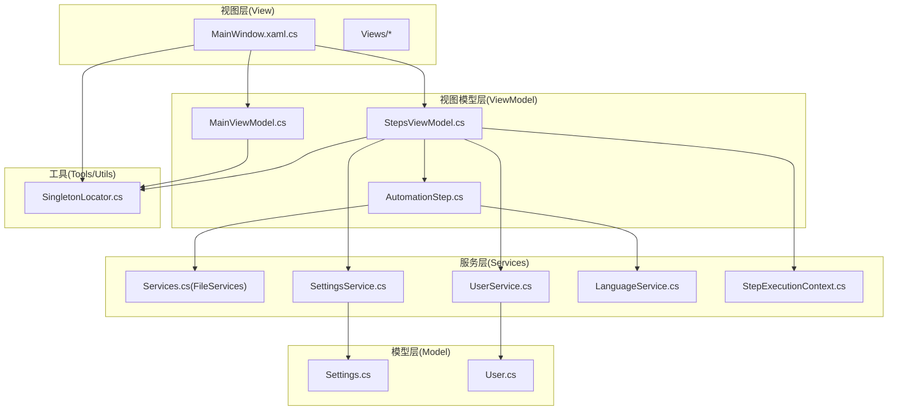
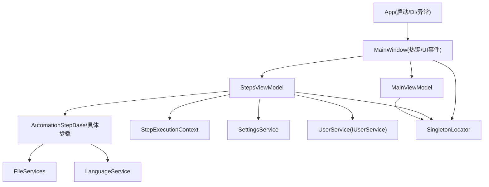
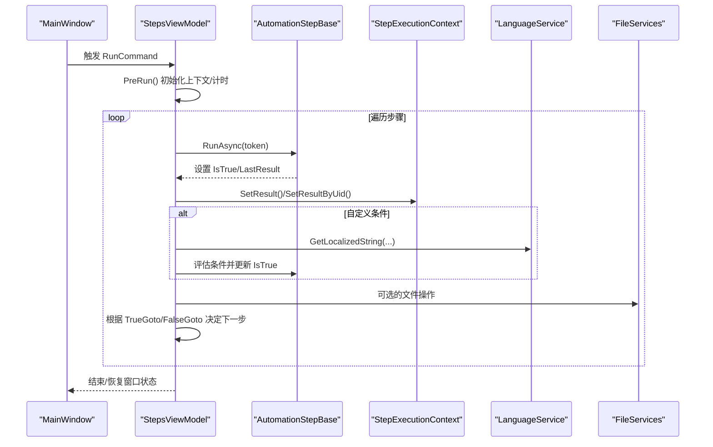
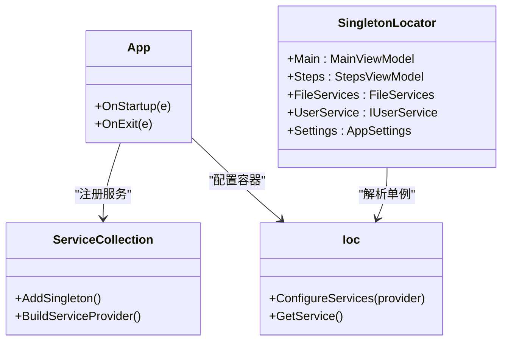
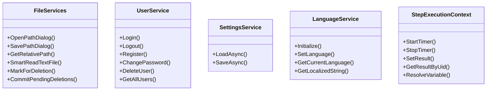
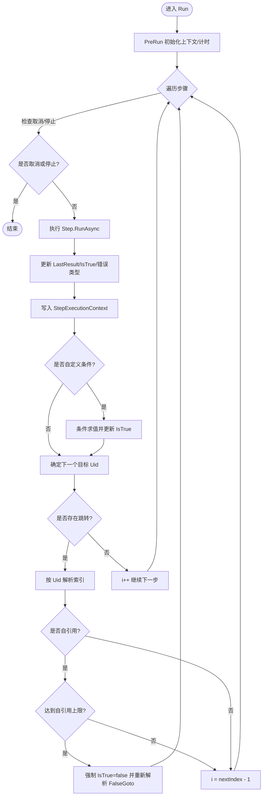
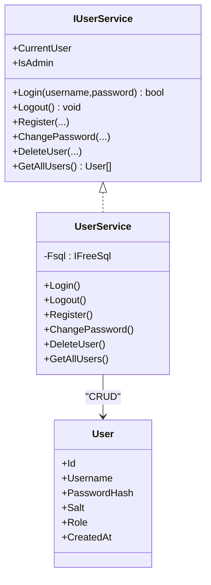
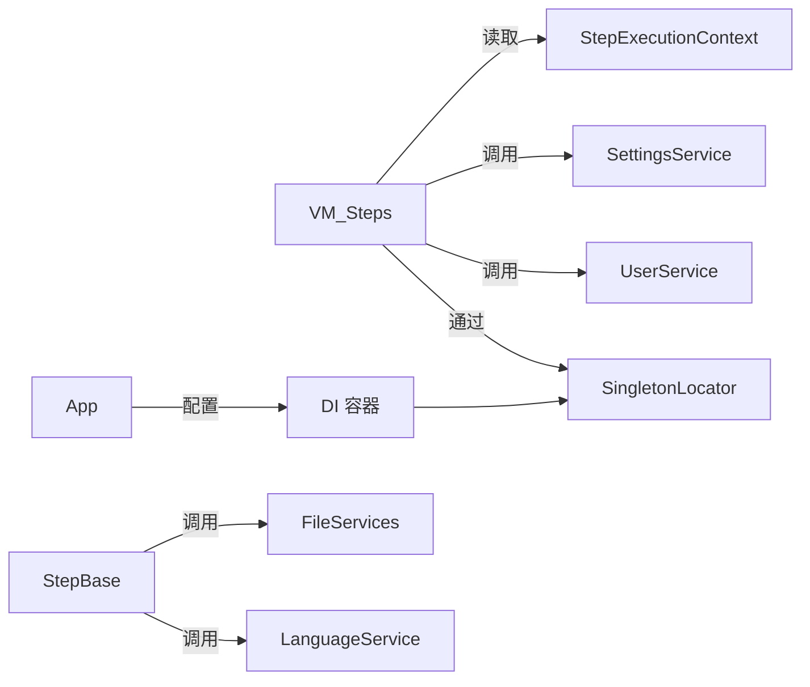

# 架构设计

<cite>
**本文引用的文件**   
- [App.xaml.cs](file://ShaoLu/App.xaml.cs)
- [MainWindow.xaml.cs](file://ShaoLu/MainWindow.xaml.cs)
- [MainViewModel.cs](file://ShaoLu/Viewmodels/MainViewModel.cs)
- [StepsViewModel.cs](file://ShaoLu/Viewmodels/StepsViewModel.cs)
- [AutomationStep.cs](file://ShaoLu/Viewmodels/AutomationStep.cs)
- [SingletonLocator.cs](file://ShaoLu/Utils/SingletonLocator.cs)
- [Services.cs](file://ShaoLu/Services/Services.cs)
- [UserService.cs](file://ShaoLu/Services/UserService.cs)
- [IUserService.cs](file://ShaoLu/Services/IUserService.cs)
- [SettingsService.cs](file://ShaoLu/Services/SettingsService.cs)
- [LanguageService.cs](file://ShaoLu/Services/LanguageService.cs)
- [StepExecutionContext.cs](file://ShaoLu/Services/StepExecutionContext.cs)
- [Settings.cs](file://ShaoLu/Models/Settings.cs)
- [User.cs](file://ShaoLu/Models/User.cs)
</cite>

## 目录
1. [简介](#简介)
2. [项目结构](#项目结构)
3. [核心组件](#核心组件)
4. [架构总览](#架构总览)
5. [详细组件分析](#详细组件分析)
6. [依赖关系分析](#依赖关系分析)
7. [性能考量](#性能考量)
8. [故障排查指南](#故障排查指南)
9. [结论](#结论)
10. [附录](#附录)

## 简介
本架构设计文档面向 ShaoLu 应用，围绕 MVVM 模式、依赖注入（DI）、单例管理、服务层职责划分与模块解耦展开。通过分层架构与清晰的职责边界，实现自动化步骤编排、执行控制、用户认证与设置持久化等核心能力。文档提供架构图表与数据流说明，帮助开发者快速理解整体设计与技术决策。

## 项目结构
ShaoLu 采用 WPF + MVVM 的典型桌面应用结构：
- View（视图）：XAML 窗口与控件，负责 UI 展示与交互事件转发
- ViewModel（视图模型）：封装 UI 状态与命令，驱动数据绑定与业务编排
- Model（模型）：领域实体与配置数据
- Services（服务）：横切能力（语言、设置、用户、文件、OCR、执行上下文等）
- Utils（工具）：通用工具与定位器（如 DI 访问入口）

图表来源
- [App.xaml.cs:1-112](file://ShaoLu/App.xaml.cs#L1-L112)
- [MainWindow.xaml.cs:1-376](file://ShaoLu/MainWindow.xaml.cs#L1-L376)
- [MainViewModel.cs:1-76](file://ShaoLu/Viewmodels/MainViewModel.cs#L1-L76)
- [StepsViewModel.cs:1-747](file://ShaoLu/Viewmodels/StepsViewModel.cs#L1-L747)
- [AutomationStep.cs:1-800](file://ShaoLu/Viewmodels/AutomationStep.cs#L1-L800)
- [SingletonLocator.cs:1-19](file://ShaoLu/Utils/SingletonLocator.cs#L1-L19)
- [Services.cs:1-179](file://ShaoLu/Services/Services.cs#L1-L179)
- [UserService.cs:1-239](file://ShaoLu/Services/UserService.cs#L1-L239)
- [SettingsService.cs:1-38](file://ShaoLu/Services/SettingsService.cs#L1-L38)
- [LanguageService.cs:1-67](file://ShaoLu/Services/LanguageService.cs#L1-L67)
- [StepExecutionContext.cs:1-163](file://ShaoLu/Services/StepExecutionContext.cs#L1-L163)
- [Settings.cs:1-117](file://ShaoLu/Models/Settings.cs#L1-L117)
- [User.cs:1-33](file://ShaoLu/Models/User.cs#L1-L33)

章节来源
- [App.xaml.cs:1-112](file://ShaoLu/App.xaml.cs#L1-L112)
- [MainWindow.xaml.cs:1-376](file://ShaoLu/MainWindow.xaml.cs#L1-L376)

## 核心组件
- 应用启动与生命周期：App 负责全局异常捕获、语言初始化、DI 容器构建、日志清理、主窗口显示与退出资源释放
- 主窗口与热键：MainWindow 注册系统热键，将“开始/停止”动作委派给 StepsViewModel 的命令
- 视图模型：
  - MainViewModel：维护登录态、当前语言、路径信息等界面状态
  - StepsViewModel：编排步骤集合、执行流程、暂停/停止、条件判断、统计更新、错误处理
  - AutomationStepBase 及具体步骤：定义步骤抽象与各类操作（文本输入、图像识别、弹窗等），统一 RunAsync 接口
- 服务层：
  - FileServices：文件对话框、相对路径计算、智能编码读取、延迟删除提交
  - UserService：基于 SQLite 的用户认证与权限管理
  - SettingsService：settings.json 的异步读写
  - LanguageService：多语言切换与本地化字符串获取
  - StepExecutionContext：步骤执行结果缓存、变量解析、计时与计数
- 工具与定位器：
  - SingletonLocator：以静态属性形式暴露 DI 容器中的单例服务，简化跨层访问

章节来源
- [App.xaml.cs:1-112](file://ShaoLu/App.xaml.cs#L1-L112)
- [MainWindow.xaml.cs:1-376](file://ShaoLu/MainWindow.xaml.cs#L1-L376)
- [MainViewModel.cs:1-76](file://ShaoLu/Viewmodels/MainViewModel.cs#L1-L76)
- [StepsViewModel.cs:1-747](file://ShaoLu/Viewmodels/StepsViewModel.cs#L1-L747)
- [AutomationStep.cs:1-800](file://ShaoLu/Viewmodels/AutomationStep.cs#L1-L800)
- [Services.cs:1-179](file://ShaoLu/Services/Services.cs#L1-L179)
- [UserService.cs:1-239](file://ShaoLu/Services/UserService.cs#L1-L239)
- [SettingsService.cs:1-38](file://ShaoLu/Services/SettingsService.cs#L1-L38)
- [LanguageService.cs:1-67](file://ShaoLu/Services/LanguageService.cs#L1-L67)
- [StepExecutionContext.cs:1-163](file://ShaoLu/Services/StepExecutionContext.cs#L1-L163)
- [SingletonLocator.cs:1-19](file://ShaoLu/Utils/SingletonLocator.cs#L1-L19)

## 架构总览
下图展示了 MVVM 分层与关键交互：视图通过 DataContext 绑定 ViewModel；ViewModel 通过 DI/定位器调用服务；服务之间保持低耦合，共享执行上下文与配置。

图表来源
- [App.xaml.cs:1-112](file://ShaoLu/App.xaml.cs#L1-L112)
- [MainWindow.xaml.cs:1-376](file://ShaoLu/MainWindow.xaml.cs#L1-L376)
- [MainViewModel.cs:1-76](file://ShaoLu/Viewmodels/MainViewModel.cs#L1-L76)
- [StepsViewModel.cs:1-747](file://ShaoLu/Viewmodels/StepsViewModel.cs#L1-L747)
- [AutomationStep.cs:1-800](file://ShaoLu/Viewmodels/AutomationStep.cs#L1-L800)
- [StepExecutionContext.cs:1-163](file://ShaoLu/Services/StepExecutionContext.cs#L1-L163)
- [SettingsService.cs:1-38](file://ShaoLu/Services/SettingsService.cs#L1-L38)
- [UserService.cs:1-239](file://ShaoLu/Services/UserService.cs#L1-L239)
- [Services.cs:1-179](file://ShaoLu/Services/Services.cs#L1-L179)
- [LanguageService.cs:1-67](file://ShaoLu/Services/LanguageService.cs#L1-L67)
- [SingletonLocator.cs:1-19](file://ShaoLu/Utils/SingletonLocator.cs#L1-L19)

## 详细组件分析

### MVVM 分层与数据流向
- 视图层：MainWindow 通过 DataContext 绑定 MainViewModel；热键消息经 WndProc 转发到 StepsViewModel 的命令
- 视图模型层：StepsViewModel 维护步骤集合与运行状态，Run() 驱动步骤序列执行；MainViewModel 暴露登录态与路径信息
- 模型层：Settings 与 User 作为配置与用户实体
- 服务层：FileServices、UserService、SettingsService、LanguageService、StepExecutionContext 提供横切能力

图表来源
- [MainWindow.xaml.cs:1-376](file://ShaoLu/MainWindow.xaml.cs#L1-L376)
- [StepsViewModel.cs:1-747](file://ShaoLu/Viewmodels/StepsViewModel.cs#L1-L747)
- [AutomationStep.cs:1-800](file://ShaoLu/Viewmodels/AutomationStep.cs#L1-L800)
- [StepExecutionContext.cs:1-163](file://ShaoLu/Services/StepExecutionContext.cs#L1-L163)
- [LanguageService.cs:1-67](file://ShaoLu/Services/LanguageService.cs#L1-L67)
- [Services.cs:1-179](file://ShaoLu/Services/Services.cs#L1-L179)

章节来源
- [MainWindow.xaml.cs:1-376](file://ShaoLu/MainWindow.xaml.cs#L1-L376)
- [StepsViewModel.cs:1-747](file://ShaoLu/Viewmodels/StepsViewModel.cs#L1-L747)
- [AutomationStep.cs:1-800](file://ShaoLu/Viewmodels/AutomationStep.cs#L1-L800)
- [StepExecutionContext.cs:1-163](file://ShaoLu/Services/StepExecutionContext.cs#L1-L163)
- [LanguageService.cs:1-67](file://ShaoLu/Services/LanguageService.cs#L1-L67)
- [Services.cs:1-179](file://ShaoLu/Services/Services.cs#L1-L179)

### 依赖注入与单例管理
- App 在 OnStartup 中构建 ServiceCollection，注册 MainViewModel、StepsViewModel、FileServices、IUserService 等，并通过 CommunityToolkit.Mvvm 的 Ioc.Default.ConfigureServices 完成容器配置
- SingletonLocator 提供静态属性访问 DI 容器中的单例，避免在各处重复构造或传递实例
- 视图与 ViewModel 通过 SingletonLocator 获取服务，降低耦合度

图表来源
- [App.xaml.cs:1-112](file://ShaoLu/App.xaml.cs#L1-L112)
- [SingletonLocator.cs:1-19](file://ShaoLu/Utils/SingletonLocator.cs#L1-L19)

章节来源
- [App.xaml.cs:1-112](file://ShaoLu/App.xaml.cs#L1-L112)
- [SingletonLocator.cs:1-19](file://ShaoLu/Utils/SingletonLocator.cs#L1-L19)

### 服务层职责划分
- FileServices：文件对话框、路径转换、智能编码读取、延迟删除队列与提交
- UserService：用户注册/登录/注销、密码哈希与盐值、角色权限、SQLite 持久化
- SettingsService：settings.json 的异步加载与保存
- LanguageService：语言初始化、切换与本地化字符串获取
- StepExecutionContext：步骤执行结果缓存、变量解析、计时与计数

图表来源
- [Services.cs:1-179](file://ShaoLu/Services/Services.cs#L1-L179)
- [UserService.cs:1-239](file://ShaoLu/Services/UserService.cs#L1-L239)
- [SettingsService.cs:1-38](file://ShaoLu/Services/SettingsService.cs#L1-L38)
- [LanguageService.cs:1-67](file://ShaoLu/Services/LanguageService.cs#L1-L67)
- [StepExecutionContext.cs:1-163](file://ShaoLu/Services/StepExecutionContext.cs#L1-L163)

章节来源
- [Services.cs:1-179](file://ShaoLu/Services/Services.cs#L1-L179)
- [UserService.cs:1-239](file://ShaoLu/Services/UserService.cs#L1-L239)
- [SettingsService.cs:1-38](file://ShaoLu/Services/SettingsService.cs#L1-L38)
- [LanguageService.cs:1-67](file://ShaoLu/Services/LanguageService.cs#L1-L67)
- [StepExecutionContext.cs:1-163](file://ShaoLu/Services/StepExecutionContext.cs#L1-L163)

### 步骤执行与控制流
StepsViewModel 的 Run() 是核心控制流，包含：
- 前置准备：重置上下文、计时、最小化窗口、初始化步骤状态
- 循环执行：支持暂停/停止、取消令牌、自引用限制、错误推断与提示
- 跳转逻辑：根据 IsTrue 选择 TrueGoto/FalseGoto，按 Uid 查找目标索引
- 统计与日志：记录执行时间、相似度、OCR 文本，更新统计步骤的条件计数

图表来源
- [StepsViewModel.cs:1-747](file://ShaoLu/Viewmodels/StepsViewModel.cs#L1-L747)
- [AutomationStep.cs:1-800](file://ShaoLu/Viewmodels/AutomationStep.cs#L1-L800)
- [StepExecutionContext.cs:1-163](file://ShaoLu/Services/StepExecutionContext.cs#L1-L163)

章节来源
- [StepsViewModel.cs:1-747](file://ShaoLu/Viewmodels/StepsViewModel.cs#L1-L747)
- [AutomationStep.cs:1-800](file://ShaoLu/Viewmodels/AutomationStep.cs#L1-L800)
- [StepExecutionContext.cs:1-163](file://ShaoLu/Services/StepExecutionContext.cs#L1-L163)

### 用户认证与权限
- IUserService 定义了登录、注销、注册、修改密码、删除用户等接口
- UserService 使用 FreeSql 连接 SQLite，自动建表，密码采用 PBKDF2+SHA256 加盐存储
- MainWindow 与 StepsViewModel 通过 SingletonLocator.UserService 进行登录态校验与操作保护

图表来源
- [IUserService.cs:1-20](file://ShaoLu/Services/IUserService.cs#L1-L20)
- [UserService.cs:1-239](file://ShaoLu/Services/UserService.cs#L1-L239)
- [User.cs:1-33](file://ShaoLu/Models/User.cs#L1-L33)

章节来源
- [IUserService.cs:1-20](file://ShaoLu/Services/IUserService.cs#L1-L20)
- [UserService.cs:1-239](file://ShaoLu/Services/UserService.cs#L1-L239)
- [User.cs:1-33](file://ShaoLu/Models/User.cs#L1-L33)

### 设置与语言
- SettingsService 异步读写 settings.json，默认路径为应用根目录
- LanguageService 初始化时优先读取上次语言，否则回退到系统语言；提供本地化字符串获取方法
- MainWindow 在 Loaded 事件中应用字体设置并刷新语言相关 UI

章节来源
- [SettingsService.cs:1-38](file://ShaoLu/Services/SettingsService.cs#L1-L38)
- [LanguageService.cs:1-67](file://ShaoLu/Services/LanguageService.cs#L1-L67)
- [MainWindow.xaml.cs:1-376](file://ShaoLu/MainWindow.xaml.cs#L1-L376)

## 依赖关系分析
- 视图对 ViewModel 的依赖通过 DataContext 建立，遵循单向数据流
- ViewModel 通过 SingletonLocator 间接依赖服务，避免直接耦合
- 服务之间尽量无环依赖，StepExecutionContext 作为共享状态被多处读取
- 外部库（CommunityToolkit.Mvvm、NLog、FreeSql、OfficeOpenXml、UtfUnknown）通过 DI 与静态类接入

图表来源
- [StepsViewModel.cs:1-747](file://ShaoLu/Viewmodels/StepsViewModel.cs#L1-L747)
- [AutomationStep.cs:1-800](file://ShaoLu/Viewmodels/AutomationStep.cs#L1-L800)
- [SingletonLocator.cs:1-19](file://ShaoLu/Utils/SingletonLocator.cs#L1-L19)
- [App.xaml.cs:1-112](file://ShaoLu/App.xaml.cs#L1-L112)

章节来源
- [StepsViewModel.cs:1-747](file://ShaoLu/Viewmodels/StepsViewModel.cs#L1-L747)
- [AutomationStep.cs:1-800](file://ShaoLu/Viewmodels/AutomationStep.cs#L1-L800)
- [SingletonLocator.cs:1-19](file://ShaoLu/Utils/SingletonLocator.cs#L1-L19)
- [App.xaml.cs:1-112](file://ShaoLu/App.xaml.cs#L1-L112)

## 性能考量
- 执行线程：StepsViewModel.Run() 使用 CancellationTokenSource 与 Task.Delay 实现非阻塞等待，避免 UI 卡顿
- 自引用限制：防止死循环，提升稳定性
- OCR/截图 DPI：App 启动时缓存 DPI，供后台线程使用，减少重复计算
- 文件延迟删除：FileServices 收集待删除文件并在退出时批量提交，降低频繁 IO
- 日志清理：App 启动时根据设置清理过期日志，控制磁盘占用

[本节为通用指导，不直接分析具体文件]

## 故障排查指南
- 未处理异常兜底：App 中订阅 DispatcherUnhandledException、AppDomain.UnhandledException、TaskScheduler.UnobservedTaskException，统一记录日志并提示
- 步骤执行错误：StepsViewModel 捕获异常并推断错误类型，可选择弹出提示；若未配置 FalseGoto，则终止执行
- 文件读取失败：FileServices.SmartReadTextFile 使用 BOM 检测与 UtfUnknown 启发式解码，失败时抛出异常由上层处理
- 用户认证失败：UserService.Login 返回 false，UI 应提示重试或注册

章节来源
- [App.xaml.cs:1-112](file://ShaoLu/App.xaml.cs#L1-L112)
- [StepsViewModel.cs:1-747](file://ShaoLu/Viewmodels/StepsViewModel.cs#L1-L747)
- [Services.cs:1-179](file://ShaoLu/Services/Services.cs#L1-L179)
- [UserService.cs:1-239](file://ShaoLu/Services/UserService.cs#L1-L239)

## 结论
ShaoLu 应用通过清晰的 MVVM 分层、统一的依赖注入与单例定位器、职责明确的服务层，实现了高内聚低耦合的自动化步骤编排与执行框架。StepsViewModel 作为控制中枢，结合 StepExecutionContext 与多种服务，提供了强大的条件判断、统计与日志能力。该设计便于扩展新步骤类型与服务模块，同时保证可测试性与可维护性。

[本节为总结性内容，不直接分析具体文件]

## 附录
- 扩展点建议：
  - 新增步骤类型：继承 AutomationStepBase，实现 Clone 与 RunAsync，并在 StepsViewModel.AddStep 中注册
  - 新增服务：实现接口并通过 App.OnStartup 注册到 DI 容器，再通过 SingletonLocator 暴露
  - 条件变量扩展：在 StepExecutionContext.ResolveVariable 中添加新的变量类型
- 最佳实践：
  - 所有耗时操作使用异步与取消令牌
  - 错误处理尽量细化，区分用户取消、超时、IO 失败等
  - 配置项集中管理，避免硬编码

[本节为概念性内容，不直接分析具体文件]