# Autogui 工具集

<cite>
**本文引用的文件**   
- [Autogui.cs](file://ShaoLu/Utils/Autogui.cs)
- [NativeMethods.cs](file://ShaoLu/Utils/NativeMethods.cs)
- [ScreenTextReader.cs](file://ShaoLu/Utils/ScreenTextReader.cs)
- [OCRService.cs](file://ShaoLu/Services/OCRService.cs)
- [AutoguiModel.cs](file://ShaoLu/Models/AutoguiModel.cs)
- [MouseActionItem.cs](file://ShaoLu/Models/MouseActionItem.cs)
- [AutomationStep.cs](file://ShaoLu/Viewmodels/AutomationStep.cs)
- [GetInputStep.cs](file://ShaoLu/Viewmodels/GetInputStep.cs)
- [ImageRecognition.cs](file://ShaoLu/Viewmodels/ImageRecognition.cs)
- [NativeMethods.User32.cs](file://ShaoLu/Tools/ImageEdit/Interop/NativeMethods.User32.cs)
- [NativeMethods.Gdi32.cs](file://ShaoLu/Tools/ImageEdit/Interop/NativeMethods.Gdi32.cs)
- [DllNames.cs](file://ShaoLu/Tools/ImageEdit/Interop/DllNames.cs)
- [ScreenshotHelper.cs](file://ShaoLu/Tools/ImageEdit/Helpers/ScreenshotHelper.cs)
- [MonitorHelper.cs](file://ShaoLu/Tools/ImageEdit/Helpers/MonitorHelper.cs)
</cite>

## 目录
1. [简介](#简介)
2. [项目结构](#项目结构)
3. [核心组件](#核心组件)
4. [架构总览](#架构总览)
5. [详细组件分析](#详细组件分析)
6. [依赖关系分析](#依赖关系分析)
7. [性能考虑](#性能考虑)
8. [故障排除指南](#故障排除指南)
9. [结论](#结论)
10. [附录](#附录)

## 简介
本文件为 ShaoLu 应用中的 Autogui 工具集提供系统化、可操作的技术文档。内容覆盖：
- 系统级操作封装：Windows API 调用、屏幕截图、图像匹配、输入模拟（鼠标/键盘）
- NativeMethods 的 Win32 封装：User32.dll、Gdi32.dll 函数与常量
- 屏幕文本读取：UI Automation 文本提取与 OCR 集成
- 输入模拟机制：坐标转换、DPI 缩放处理、线程安全策略
- 性能优化、错误处理与异常恢复
- 系统兼容性说明与排障建议

## 项目结构
Autogui 工具集位于 Utils 与 Services 层，配合 Models 的数据模型以及 Viewmodels 的执行步骤编排。关键路径如下：
- 自动化核心：ShaoLu/Utils/Autogui.cs
- 原生方法封装：ShaoLu/Utils/NativeMethods.cs；ImageEdit 子模块中 User32/Gdi32 扩展
- 文本读取：ShaoLu/Utils/ScreenTextReader.cs；OCR 服务：ShaoLu/Services/OCRService.cs
- 数据模型：ShaoLu/Models/AutoguiModel.cs、MouseActionItem.cs
- 执行编排：ShaoLu/Viewmodels/AutomationStep.cs、GetInputStep.cs、ImageRecognition.cs

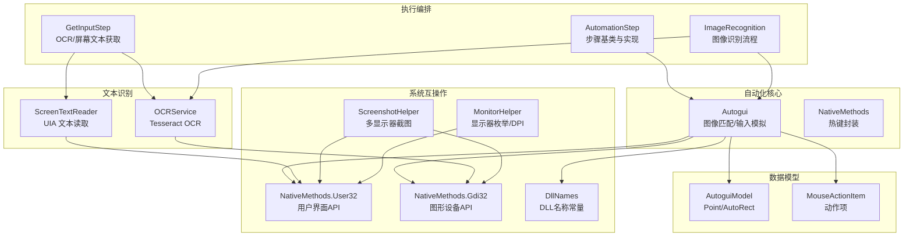

图表来源 
- [Autogui.cs:1-656](file://ShaoLu/Utils/Autogui.cs#L1-L656)
- [NativeMethods.cs:1-19](file://ShaoLu/Utils/NativeMethods.cs#L1-L19)
- [ScreenTextReader.cs:1-79](file://ShaoLu/Utils/ScreenTextReader.cs#L1-L79)
- [OCRService.cs:1-159](file://ShaoLu/Services/OCRService.cs#L1-L159)
- [AutoguiModel.cs:1-145](file://ShaoLu/Models/AutoguiModel.cs#L1-L145)
- [MouseActionItem.cs:1-57](file://ShaoLu/Models/MouseActionItem.cs#L1-L57)
- [AutomationStep.cs:1-800](file://ShaoLu/Viewmodels/AutomationStep.cs#L1-L800)
- [GetInputStep.cs:1-42](file://ShaoLu/Viewmodels/GetInputStep.cs#L1-L42)
- [ImageRecognition.cs:562-582](file://ShaoLu/Viewmodels/ImageRecognition.cs#L562-L582)
- [NativeMethods.User32.cs:1-190](file://ShaoLu/Tools/ImageEdit/Interop/NativeMethods.User32.cs#L1-L190)
- [NativeMethods.Gdi32.cs:1-231](file://ShaoLu/Tools/ImageEdit/Interop/NativeMethods.Gdi32.cs#L1-L231)
- [DllNames.cs:1-11](file://ShaoLu/Tools/ImageEdit/Interop/DllNames.cs#L1-L11)
- [ScreenshotHelper.cs:1-144](file://ShaoLu/Tools/ImageEdit/Helpers/ScreenshotHelper.cs#L1-L144)
- [MonitorHelper.cs:1-71](file://ShaoLu/Tools/ImageEdit/Helpers/MonitorHelper.cs#L1-L71)

章节来源
- [Autogui.cs:1-656](file://ShaoLu/Utils/Autogui.cs#L1-L656)
- [NativeMethods.cs:1-19](file://ShaoLu/Utils/NativeMethods.cs#L1-L19)
- [ScreenTextReader.cs:1-79](file://ShaoLu/Utils/ScreenTextReader.cs#L1-L79)
- [OCRService.cs:1-159](file://ShaoLu/Services/OCRService.cs#L1-L159)
- [AutoguiModel.cs:1-145](file://ShaoLu/Models/AutoguiModel.cs#L1-L145)
- [MouseActionItem.cs:1-57](file://ShaoLu/Models/MouseActionItem.cs#L1-L57)
- [AutomationStep.cs:1-800](file://ShaoLu/Viewmodels/AutomationStep.cs#L1-L800)
- [GetInputStep.cs:1-42](file://ShaoLu/Viewmodels/GetInputStep.cs#L1-L42)
- [ImageRecognition.cs:562-582](file://ShaoLu/Viewmodels/ImageRecognition.cs#L562-L582)
- [NativeMethods.User32.cs:1-190](file://ShaoLu/Tools/ImageEdit/Interop/NativeMethods.User32.cs#L1-L190)
- [NativeMethods.Gdi32.cs:1-231](file://ShaoLu/Tools/ImageEdit/Interop/NativeMethods.Gdi32.cs#L1-L231)
- [DllNames.cs:1-11](file://ShaoLu/Tools/ImageEdit/Interop/DllNames.cs#L1-L11)
- [ScreenshotHelper.cs:1-144](file://ShaoLu/Tools/ImageEdit/Helpers/ScreenshotHelper.cs#L1-L144)
- [MonitorHelper.cs:1-71](file://ShaoLu/Tools/ImageEdit/Helpers/MonitorHelper.cs#L1-L71)

## 核心组件
- Autogui：封装图像匹配（OpenCV）、屏幕截图、鼠标/键盘输入模拟、剪贴板粘贴、字符串递增等能力
- ScreenTextReader：通过 UI Automation 在指定物理坐标处读取控件文本
- OCRService：基于 Tesseract 的 OCR 引擎封装，支持区域截图识别与 DPI 缓存
- NativeMethods：热键注册/注销等轻量 Win32 封装
- ImageEdit 子模块的 NativeMethods.User32/Gdi32：更全面的 Win32 调用（显示器枚举、BitBlt、SetCursorPos 等）
- ScreenshotHelper/MonitorHelper：多显示器截图与 DPI 缩放计算
- 数据模型 Point/AutoRect/MouseActionItem：坐标、矩形、动作序列的结构化表示

章节来源
- [Autogui.cs:1-656](file://ShaoLu/Utils/Autogui.cs#L1-L656)
- [ScreenTextReader.cs:1-79](file://ShaoLu/Utils/ScreenTextReader.cs#L1-L79)
- [OCRService.cs:1-159](file://ShaoLu/Services/OCRService.cs#L1-L159)
- [NativeMethods.cs:1-19](file://ShaoLu/Utils/NativeMethods.cs#L1-L19)
- [NativeMethods.User32.cs:1-190](file://ShaoLu/Tools/ImageEdit/Interop/NativeMethods.User32.cs#L1-L190)
- [NativeMethods.Gdi32.cs:1-231](file://ShaoLu/Tools/ImageEdit/Interop/NativeMethods.Gdi32.cs#L1-L231)
- [ScreenshotHelper.cs:1-144](file://ShaoLu/Tools/ImageEdit/Helpers/ScreenshotHelper.cs#L1-L144)
- [MonitorHelper.cs:1-71](file://ShaoLu/Tools/ImageEdit/Helpers/MonitorHelper.cs#L1-L71)
- [AutoguiModel.cs:1-145](file://ShaoLu/Models/AutoguiModel.cs#L1-L145)
- [MouseActionItem.cs:1-57](file://ShaoLu/Models/MouseActionItem.cs#L1-L57)

## 架构总览
Autogui 工具集以“自动化步骤”为入口，驱动图像识别、文本读取与输入模拟三大子系统协同工作。整体调用链如下：

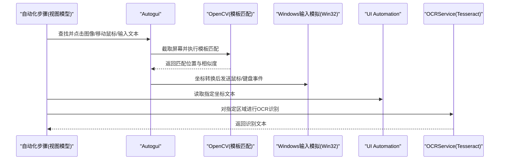

图表来源 
- [AutomationStep.cs:1-800](file://ShaoLu/Viewmodels/AutomationStep.cs#L1-L800)
- [Autogui.cs:1-656](file://ShaoLu/Utils/Autogui.cs#L1-L656)
- [ScreenTextReader.cs:1-79](file://ShaoLu/Utils/ScreenTextReader.cs#L1-L79)
- [OCRService.cs:1-159](file://ShaoLu/Services/OCRService.cs#L1-L159)

## 详细组件分析

### Autogui 类：系统级操作封装
- 图像匹配
  - 使用 OpenCvSharp 将 Bitmap 转为 Mat，灰度化后进行 CCoeffNormed 模板匹配
  - 支持超时与间隔重试，返回 AutoRect（中心点、左上角、相似度）
  - 批量匹配支持循环轮询与单目标模式
- 屏幕截图
  - 使用 GDI+ Graphics.CopyFromScreen 捕获主屏全屏
- 输入模拟
  - 鼠标移动：将逻辑像素坐标按虚拟桌面宽度映射到 0-65535 范围
  - 点击/滚动：通过 WindowsInput 库发送左/右键、双击、滚轮事件
  - 键盘输入：逐字符输入或剪贴板粘贴（Ctrl+V），保证 STA 线程安全
- 文本处理
  - 字符串递增算法：数字后缀保持位数，字母后缀固定位数回绕
- 错误处理
  - 未匹配时抛出本地化异常；剪贴板操作失败记录日志并恢复原内容

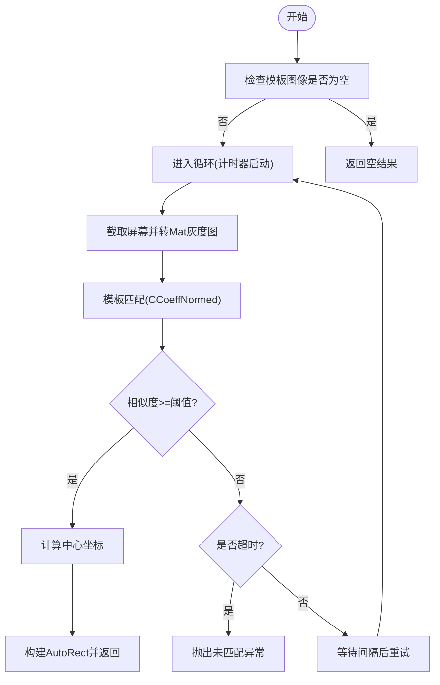

图表来源 
- [Autogui.cs:59-122](file://ShaoLu/Utils/Autogui.cs#L59-L122)

章节来源
- [Autogui.cs:1-656](file://ShaoLu/Utils/Autogui.cs#L1-L656)

### ScreenTextReader：屏幕文本读取（UI Automation）
- 从物理坐标定位 AutomationElement
- 优先尝试 TextPattern（富文本/文档），其次 ValuePattern（输入框/显示控件）
- 向上遍历父元素最多5层，取 Name 或 Value 作为备选
- 异常时返回空字符串，避免崩溃

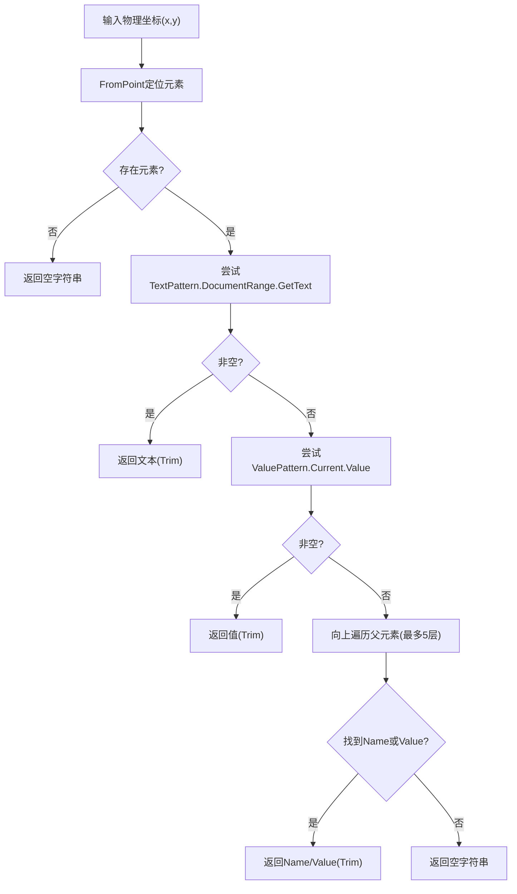

图表来源 
- [ScreenTextReader.cs:18-76](file://ShaoLu/Utils/ScreenTextReader.cs#L18-L76)

章节来源
- [ScreenTextReader.cs:1-79](file://ShaoLu/Utils/ScreenTextReader.cs#L1-L79)

### OCRService：OCR 集成与 DPI 处理
- 懒加载初始化 Tesseract 引擎，语言包路径 tessdata，默认 chi_sim+eng
- 缓存 DPI 缩放因子（X/Y），避免后台线程访问 WPF 对象
- RecognizeRegion：将 WPF 逻辑像素区域转换为物理像素，再 CopyFromScreen 并识别
- 异常捕获与日志记录，确保稳健性

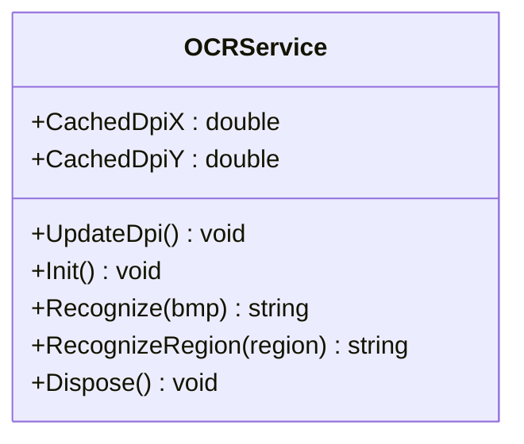

图表来源 
- [OCRService.cs:1-159](file://ShaoLu/Services/OCRService.cs#L1-L159)

章节来源
- [OCRService.cs:1-159](file://ShaoLu/Services/OCRService.cs#L1-L159)

### NativeMethods 与 Win32 封装
- 基础热键封装：RegisterHotKey/UnregisterHotKey、WM_HOTKEY、修饰键常量
- 扩展 User32：显示器枚举、窗口位置设置、光标位置、钩子相关
- 扩展 Gdi32：DC创建/释放、BitBlt、兼容位图、DeviceCaps 查询
- DllNames：统一 DLL 名称常量

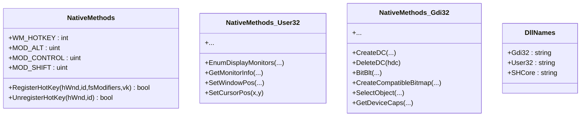

图表来源 
- [NativeMethods.cs:1-19](file://ShaoLu/Utils/NativeMethods.cs#L1-L19)
- [NativeMethods.User32.cs:1-190](file://ShaoLu/Tools/ImageEdit/Interop/NativeMethods.User32.cs#L1-L190)
- [NativeMethods.Gdi32.cs:1-231](file://ShaoLu/Tools/ImageEdit/Interop/NativeMethods.Gdi32.cs#L1-L231)
- [DllNames.cs:1-11](file://ShaoLu/Tools/ImageEdit/Interop/DllNames.cs#L1-L11)

章节来源
- [NativeMethods.cs:1-19](file://ShaoLu/Utils/NativeMethods.cs#L1-L19)
- [NativeMethods.User32.cs:1-190](file://ShaoLu/Tools/ImageEdit/Interop/NativeMethods.User32.cs#L1-L190)
- [NativeMethods.Gdi32.cs:1-231](file://ShaoLu/Tools/ImageEdit/Interop/NativeMethods.Gdi32.cs#L1-L231)
- [DllNames.cs:1-11](file://ShaoLu/Tools/ImageEdit/Interop/DllNames.cs#L1-L11)

### 截图与多显示器支持
- ScreenshotHelper：使用 BitBlt 从全显示器 DC 拷贝指定区域，转换为 WPF BitmapSource
- MonitorHelper：枚举显示器、获取工作区/物理区域、计算 DPI 缩放比例
- 适用于多显示器场景下的精确截图与坐标对齐

```mermaid
sequenceDiagram
participant SH as "ScreenshotHelper"
participant U32 as "User32"
participant G32 as "Gdi32"
participant MH as "MonitorHelper"
SH->>MH : 获取显示器信息(物理区域)
MH-->>SH : 返回显示器列表
SH->>U32 : CreateDC("DISPLAY")
U32-->>SH : HDC句柄
SH->>G32 : CreateCompatibleDC/Bitmap/SelectObject
G32-->>SH : 兼容DC/位图句柄
SH->>G32 : BitBlt(复制区域)
G32-->>SH : 完成
SH->>G32 : DeleteObject/DeleteDC
SH-->>SH : 返回BitmapSource
```

图表来源 
- [ScreenshotHelper.cs:93-144](file://ShaoLu/Tools/ImageEdit/Helpers/ScreenshotHelper.cs#L93-L144)
- [MonitorHelper.cs:16-71](file://ShaoLu/Tools/ImageEdit/Helpers/MonitorHelper.cs#L16-L71)
- [NativeMethods.User32.cs:1-190](file://ShaoLu/Tools/ImageEdit/Interop/NativeMethods.User32.cs#L1-L190)
- [NativeMethods.Gdi32.cs:1-231](file://ShaoLu/Tools/ImageEdit/Interop/NativeMethods.Gdi32.cs#L1-L231)

章节来源
- [ScreenshotHelper.cs:1-144](file://ShaoLu/Tools/ImageEdit/Helpers/ScreenshotHelper.cs#L1-L144)
- [MonitorHelper.cs:1-71](file://ShaoLu/Tools/ImageEdit/Helpers/MonitorHelper.cs#L1-L71)

### 输入模拟机制：坐标转换与 DPI 处理
- 鼠标移动：将逻辑像素坐标按比例映射到 0-65535 的虚拟桌面范围
- 点击/滚动：通过 WindowsInput 发送底层事件，支持多次点击与间隔控制
- 键盘输入：逐字符输入或剪贴板粘贴，强制在 STA 线程执行以避免跨线程问题
- 线程安全：Dispatcher.Invoke 确保剪贴板操作在主线程执行

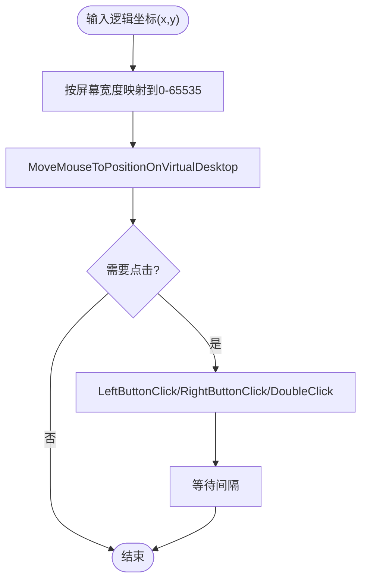

图表来源 
- [Autogui.cs:193-254](file://ShaoLu/Utils/Autogui.cs#L193-L254)
- [Autogui.cs:311-378](file://ShaoLu/Utils/Autogui.cs#L311-L378)
- [Autogui.cs:569-651](file://ShaoLu/Utils/Autogui.cs#L569-L651)

章节来源
- [Autogui.cs:1-656](file://ShaoLu/Utils/Autogui.cs#L1-L656)

### 数据模型：Point/AutoRect/MouseActionItem
- Point：支持多种构造方式（OpenCV/Drawing/WPF Point），运算符重载，空值标记
- AutoRect：中心点与左上角点，派生四角点，相似度属性，空值判断
- MouseActionItem：动作类型、次数、间隔，克隆方法

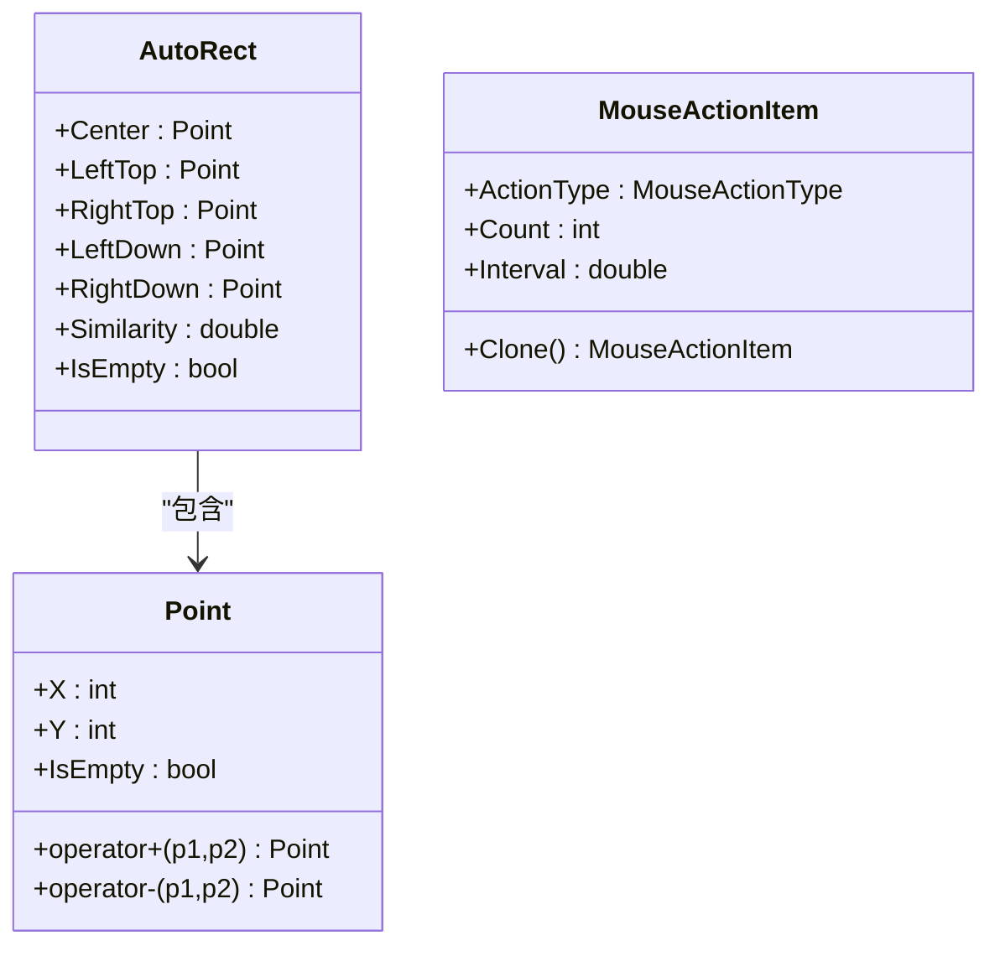

图表来源 
- [AutoguiModel.cs:3-145](file://ShaoLu/Models/AutoguiModel.cs#L3-L145)
- [MouseActionItem.cs:1-57](file://ShaoLu/Models/MouseActionItem.cs#L1-L57)

章节来源
- [AutoguiModel.cs:1-145](file://ShaoLu/Models/AutoguiModel.cs#L1-L145)
- [MouseActionItem.cs:1-57](file://ShaoLu/Models/MouseActionItem.cs#L1-L57)

### 执行编排：自动化步骤与 OCR/屏幕文本获取
- AutomationStepBase：步骤通用属性（名称、描述、条件、跳转、日志、执行结果）
- TypeTextStep/TypeTextMoreStep/TypeTextFromFileStep：文本输入步骤，调用 Autogui.TypeText/TypeTextSafe
- GetInputStep：支持 OCR 与 UIA 文本读取两种模式
- ImageRecognition：图像识别流程，结合 OCR 区域与 DPI 缩放，运行时可视化提示

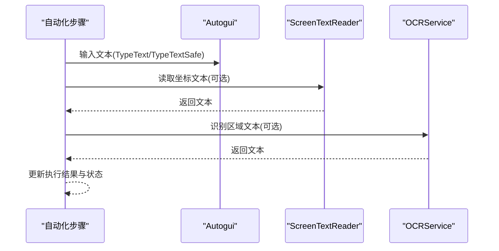

图表来源 
- [AutomationStep.cs:300-365](file://ShaoLu/Viewmodels/AutomationStep.cs#L300-L365)
- [GetInputStep.cs:1-42](file://ShaoLu/Viewmodels/GetInputStep.cs#L1-L42)
- [ImageRecognition.cs:562-582](file://ShaoLu/Viewmodels/ImageRecognition.cs#L562-L582)

章节来源
- [AutomationStep.cs:1-800](file://ShaoLu/Viewmodels/AutomationStep.cs#L1-L800)
- [GetInputStep.cs:1-42](file://ShaoLu/Viewmodels/GetInputStep.cs#L1-L42)
- [ImageRecognition.cs:562-582](file://ShaoLu/Viewmodels/ImageRecognition.cs#L562-L582)

## 依赖关系分析
- Autogui 依赖 OpenCvSharp（图像匹配）、WindowsInput（输入模拟）、System.Drawing（截图）、WPF Clipboard（剪贴板）
- OCRService 依赖 TesseractOCR 引擎与 System.Drawing
- ScreenTextReader 依赖 UI Automation（System.Windows.Automation）
- ImageEdit 子模块依赖 User32/Gdi32 进行底层截图与显示器管理

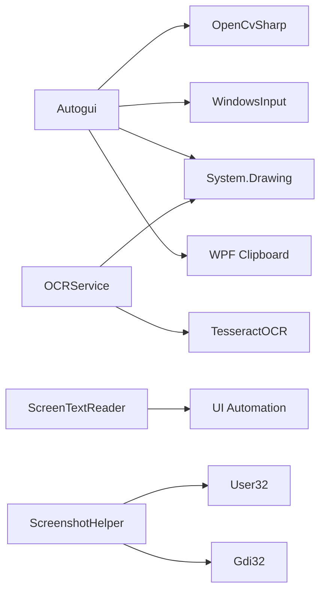

图表来源 
- [Autogui.cs:1-656](file://ShaoLu/Utils/Autogui.cs#L1-L656)
- [OCRService.cs:1-159](file://ShaoLu/Services/OCRService.cs#L1-L159)
- [ScreenTextReader.cs:1-79](file://ShaoLu/Utils/ScreenTextReader.cs#L1-L79)
- [ScreenshotHelper.cs:1-144](file://ShaoLu/Tools/ImageEdit/Helpers/ScreenshotHelper.cs#L1-L144)

章节来源
- [Autogui.cs:1-656](file://ShaoLu/Utils/Autogui.cs#L1-L656)
- [OCRService.cs:1-159](file://ShaoLu/Services/OCRService.cs#L1-L159)
- [ScreenTextReader.cs:1-79](file://ShaoLu/Utils/ScreenTextReader.cs#L1-L79)
- [ScreenshotHelper.cs:1-144](file://ShaoLu/Tools/ImageEdit/Helpers/ScreenshotHelper.cs#L1-L144)

## 性能考虑
- 模板匹配优化
  - 模板 Mat 仅转换一次，避免重复开销
  - 灰度化减少计算量，CCoeffNormed 提高匹配精度
- 截图与 OCR
  - 使用 GDI+ CopyFromScreen 快速抓取
  - OCR 区域裁剪与 DPI 缓存减少重复计算
- 输入模拟
  - 合理设置 clickgaptime/nextclicktime/waittime 降低 CPU 占用
  - 批量动作顺序执行，减少上下文切换
- 资源管理
  - 及时释放 Mat/Bitmap/DC 句柄，避免内存泄漏
  - OCR 引擎懒加载与 Dispose 释放

[本节为通用指导，不直接分析具体文件]

## 故障排除指南
- 未匹配图像
  - 现象：抛出“未匹配图像”异常
  - 排查：检查模板图像质量、阈值设置、超时时间
  - 参考：[Autogui.cs:116-122](file://ShaoLu/Utils/Autogui.cs#L116-L122)
- 剪贴板操作失败
  - 现象：TypeTextSafe 返回 false，记录错误日志
  - 排查：确认 STA 线程环境、剪贴板权限
  - 参考：[Autogui.cs:585-651](file://ShaoLu/Utils/Autogui.cs#L585-L651)
- OCR 初始化失败
  - 现象：Tesseract 引擎初始化异常
  - 排查：tessdata 路径是否正确、语言包是否齐全
  - 参考：[OCRService.cs:53-75](file://ShaoLu/Services/OCRService.cs#L53-L75)
- UI Automation 读取为空
  - 现象：ReadTextAtPoint 返回空字符串
  - 排查：坐标是否正确、控件是否支持 TextPattern/ValuePattern
  - 参考：[ScreenTextReader.cs:18-76](file://ShaoLu/Utils/ScreenTextReader.cs#L18-L76)
- 多显示器坐标错位
  - 现象：截图或点击位置偏移
  - 排查：确认 DPI 缩放因子、物理坐标与逻辑坐标转换
  - 参考：[MonitorHelper.cs:38-71](file://ShaoLu/Tools/ImageEdit/Helpers/MonitorHelper.cs#L38-L71)、[ImageRecognition.cs:562-582](file://ShaoLu/Viewmodels/ImageRecognition.cs#L562-L582)

章节来源
- [Autogui.cs:116-122](file://ShaoLu/Utils/Autogui.cs#L116-L122)
- [Autogui.cs:585-651](file://ShaoLu/Utils/Autogui.cs#L585-L651)
- [OCRService.cs:53-75](file://ShaoLu/Services/OCRService.cs#L53-L75)
- [ScreenTextReader.cs:18-76](file://ShaoLu/Utils/ScreenTextReader.cs#L18-L76)
- [MonitorHelper.cs:38-71](file://ShaoLu/Tools/ImageEdit/Helpers/MonitorHelper.cs#L38-L71)
- [ImageRecognition.cs:562-582](file://ShaoLu/Viewmodels/ImageRecognition.cs#L562-L582)

## 结论
Autogui 工具集在 ShaoLu 应用中提供了强大的系统级自动化能力，涵盖图像匹配、屏幕文本读取、OCR 识别与输入模拟。通过清晰的模块化设计与完善的错误处理机制，能够在多显示器、高 DPI 环境下稳定运行。建议在生产环境中合理配置阈值、超时与 DPI 缓存，以获得最佳性能与可靠性。

[本节为总结性内容，不直接分析具体文件]

## 附录
- 系统兼容性
  - 操作系统：Windows（需 .NET Framework 4.8）
  - 依赖库：OpenCvSharp4、TesseractOCR、WindowsInput、System.Drawing.Common
- 最佳实践
  - 模板图像尽量清晰、对比度高
  - 合理设置阈值与超时，避免误匹配或长时间等待
  - 使用 OCR 区域裁剪提升识别速度与准确率
  - 在 UI 线程执行剪贴板操作，确保线程安全

[本节为补充信息，不直接分析具体文件]