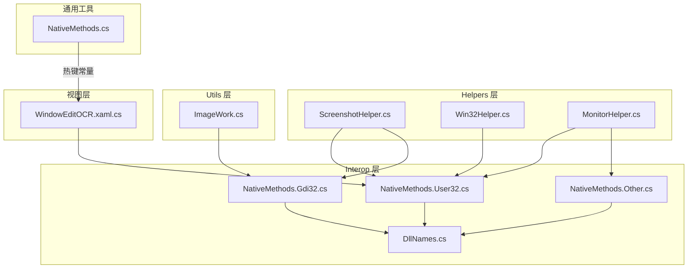
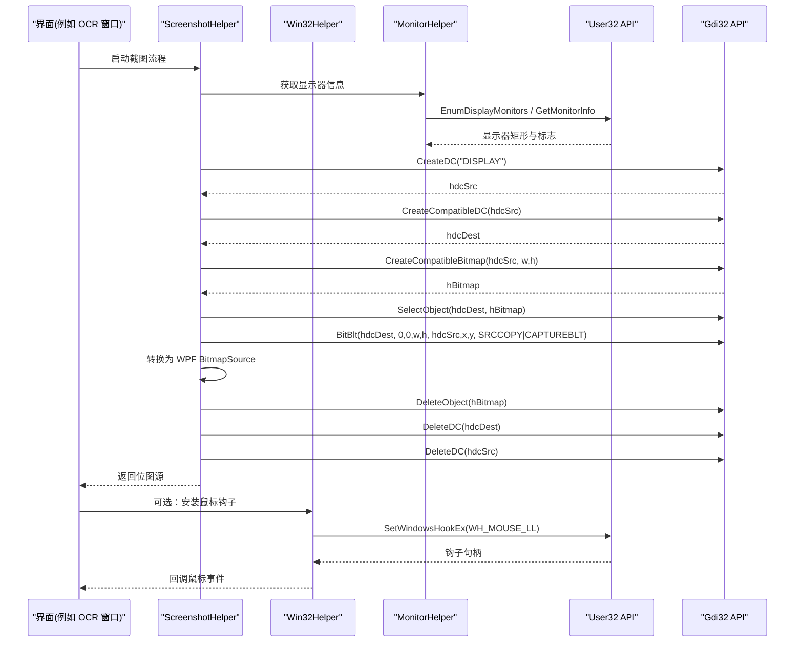
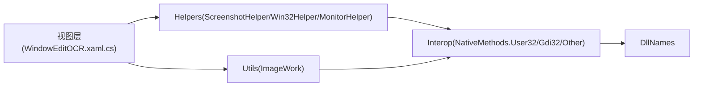

# 原生 API 封装

<cite>
**本文引用的文件**   
- [NativeMethods.cs](file://ShaoLu/Utils/NativeMethods.cs)
- [NativeMethods.User32.cs](file://ShaoLu/Tools/ImageEdit/Interop/NativeMethods.User32.cs)
- [NativeMethods.Gdi32.cs](file://ShaoLu/Tools/ImageEdit/Interop/NativeMethods.Gdi32.cs)
- [NativeMethods.Other.cs](file://ShaoLu/Tools/ImageEdit/Interop/NativeMethods.Other.cs)
- [DllNames.cs](file://ShaoLu/Tools/ImageEdit/Interop/DllNames.cs)
- [ScreenshotHelper.cs](file://ShaoLu/Tools/ImageEdit/Helpers/ScreenshotHelper.cs)
- [Win32Helper.cs](file://ShaoLu/Tools/ImageEdit/Helpers/Win32Helper.cs)
- [MonitorHelper.cs](file://ShaoLu/Tools/ImageEdit/Helpers/MonitorHelper.cs)
- [ImageWork.cs](file://ShaoLu/Tools/ImageEdit/Utils/ImageWork.cs)
- [WindowEditOCR.xaml.cs](file://ShaoLu/Views/WindowEditOCR.xaml.cs)
</cite>

## 目录
1. [简介](#简介)
2. [项目结构](#项目结构)
3. [核心组件](#核心组件)
4. [架构总览](#架构总览)
5. [详细组件分析](#详细组件分析)
6. [依赖关系分析](#依赖关系分析)
7. [性能考量](#性能考量)
8. [故障排查指南](#故障排查指南)
9. [结论](#结论)
10. [附录：API 调用示例与调试技巧](#附录api-调用示例与调试技巧)

## 简介
本文件为 ShaoLu 应用的原生 API 封装提供系统化文档，聚焦于 NativeMethods 类中的 Win32 API 声明与使用。内容涵盖 User32.dll 与 Gdi32.dll 的函数导入、DllImport 属性配置、P/Invoke 调用约定；窗口操作（如 SetForegroundWindow、SetWindowPos）与图形设备接口（BitBlt、CreateCompatibleDC、DeleteObject 等）的使用方式；内存管理与资源释放（Marshal 操作、GDI 对象清理、异常处理）；64 位兼容性、权限要求、错误代码处理；并提供 API 调用示例与调试技巧，帮助开发者安全高效地集成与扩展。

## 项目结构
本项目将 P/Invoke 相关声明按功能域拆分到多个 partial class 文件中，并通过统一的 DllNames 常量集中管理 DLL 名称，便于维护与跨平台一致性。截图与屏幕交互逻辑集中在 Helpers 层，工具方法在 Utils 层，UI 层中也有少量直接调用的 Win32 示例。

图表来源
- [NativeMethods.User32.cs:1-190](file://ShaoLu/Tools/ImageEdit/Interop/NativeMethods.User32.cs#L1-L190)
- [NativeMethods.Gdi32.cs:1-231](file://ShaoLu/Tools/ImageEdit/Interop/NativeMethods.Gdi32.cs#L1-L231)
- [NativeMethods.Other.cs:1-12](file://ShaoLu/Tools/ImageEdit/Interop/NativeMethods.Other.cs#L1-L12)
- [DllNames.cs:1-11](file://ShaoLu/Tools/ImageEdit/Interop/DllNames.cs#L1-L11)
- [ScreenshotHelper.cs:1-144](file://ShaoLu/Tools/ImageEdit/Helpers/ScreenshotHelper.cs#L1-L144)
- [Win32Helper.cs:1-52](file://ShaoLu/Tools/ImageEdit/Helpers/Win32Helper.cs#L1-L52)
- [MonitorHelper.cs:1-71](file://ShaoLu/Tools/ImageEdit/Helpers/MonitorHelper.cs#L1-L71)
- [ImageWork.cs:1-296](file://ShaoLu/Tools/ImageEdit/Utils/ImageWork.cs#L1-L296)
- [WindowEditOCR.xaml.cs:140-145](file://ShaoLu/Views/WindowEditOCR.xaml.cs#L140-L145)
- [NativeMethods.cs:1-19](file://ShaoLu/Utils/NativeMethods.cs#L1-L19)

章节来源
- [NativeMethods.User32.cs:1-190](file://ShaoLu/Tools/ImageEdit/Interop/NativeMethods.User32.cs#L1-L190)
- [NativeMethods.Gdi32.cs:1-231](file://ShaoLu/Tools/ImageEdit/Interop/NativeMethods.Gdi32.cs#L1-L231)
- [NativeMethods.Other.cs:1-12](file://ShaoLu/Tools/ImageEdit/Interop/NativeMethods.Other.cs#L1-L12)
- [DllNames.cs:1-11](file://ShaoLu/Tools/ImageEdit/Interop/DllNames.cs#L1-L11)
- [ScreenshotHelper.cs:1-144](file://ShaoLu/Tools/ImageEdit/Helpers/ScreenshotHelper.cs#L1-L144)
- [Win32Helper.cs:1-52](file://ShaoLu/Tools/ImageEdit/Helpers/Win32Helper.cs#L1-L52)
- [MonitorHelper.cs:1-71](file://ShaoLu/Tools/ImageEdit/Helpers/MonitorHelper.cs#L1-L71)
- [ImageWork.cs:1-296](file://ShaoLu/Tools/ImageEdit/Utils/ImageWork.cs#L1-L296)
- [WindowEditOCR.xaml.cs:140-145](file://ShaoLu/Views/WindowEditOCR.xaml.cs#L140-L145)
- [NativeMethods.cs:1-19](file://ShaoLu/Utils/NativeMethods.cs#L1-L19)

## 核心组件
- Interop 层（NativeMethods.*）
  - User32：窗口枚举、显示器信息、鼠标钩子、光标位置、窗口定位等。
  - Gdi32：设备上下文创建/删除、位图创建/选择/拷贝、设备能力查询等。
  - Other：SHCore DPI 获取（Windows 8+）。
  - DllNames：统一 DLL 名常量，避免硬编码字符串。
- Helpers 层（截图与系统交互）
  - ScreenshotHelper：多显示器截图、窗口置顶、位图转换与资源释放。
  - Win32Helper：低级别鼠标钩子订阅、物理坐标获取。
  - MonitorHelper：枚举显示器、计算 DPI 缩放比例。
- Utils 层（图像工具）
  - ImageWork：WPF/System.Drawing 互转、保存图像、裁剪与缩放辅助。
- 视图层（示例用法）
  - WindowEditOCR：演示通过 keybd_event + SetForegroundWindow 提升窗口前台。
- 通用工具
  - NativeMethods.cs：全局热键注册/注销与常量定义。

章节来源
- [NativeMethods.User32.cs:1-190](file://ShaoLu/Tools/ImageEdit/Interop/NativeMethods.User32.cs#L1-L190)
- [NativeMethods.Gdi32.cs:1-231](file://ShaoLu/Tools/ImageEdit/Interop/NativeMethods.Gdi32.cs#L1-L231)
- [NativeMethods.Other.cs:1-12](file://ShaoLu/Tools/ImageEdit/Interop/NativeMethods.Other.cs#L1-L12)
- [DllNames.cs:1-11](file://ShaoLu/Tools/ImageEdit/Interop/DllNames.cs#L1-L11)
- [ScreenshotHelper.cs:1-144](file://ShaoLu/Tools/ImageEdit/Helpers/ScreenshotHelper.cs#L1-L144)
- [Win32Helper.cs:1-52](file://ShaoLu/Tools/ImageEdit/Helpers/Win32Helper.cs#L1-L52)
- [MonitorHelper.cs:1-71](file://ShaoLu/Tools/ImageEdit/Helpers/MonitorHelper.cs#L1-L71)
- [ImageWork.cs:1-296](file://ShaoLu/Tools/ImageEdit/Utils/ImageWork.cs#L1-L296)
- [WindowEditOCR.xaml.cs:140-145](file://ShaoLu/Views/WindowEditOCR.xaml.cs#L140-L145)
- [NativeMethods.cs:1-19](file://ShaoLu/Utils/NativeMethods.cs#L1-L19)

## 架构总览
下图展示从 UI 触发到 Win32 调用、再到 GDI 资源释放的整体流程。

图表来源
- [ScreenshotHelper.cs:93-121](file://ShaoLu/Tools/ImageEdit/Helpers/ScreenshotHelper.cs#L93-L121)
- [MonitorHelper.cs:16-36](file://ShaoLu/Tools/ImageEdit/Helpers/MonitorHelper.cs#L16-L36)
- [Win32Helper.cs:12-42](file://ShaoLu/Tools/ImageEdit/Helpers/Win32Helper.cs#L12-L42)
- [NativeMethods.Gdi32.cs:14-38](file://ShaoLu/Tools/ImageEdit/Interop/NativeMethods.Gdi32.cs#L14-L38)
- [NativeMethods.User32.cs:43-85](file://ShaoLu/Tools/ImageEdit/Interop/NativeMethods.User32.cs#L43-L85)

## 详细组件分析

### Interop 层：NativeMethods 与 DllNames
- DllNames 集中管理 gdi32.dll、user32.dll、SHCORE 的名称，避免散落的字符串常量。
- NativeMethods.User32.cs
  - 包含窗口与显示器枚举、鼠标钩子、光标位置、窗口定位等关键函数。
  - 使用 CharSet.Auto/Unicode、CallingConvention.StdCall、SetLastError=true 等常见配置。
  - 定义了 RECT、POINT、MOUSEHOOKSTRUCT、MONITORINFOEX 等结构体以及 HookType、MonitorDpiType 等枚举。
- NativeMethods.Gdi32.cs
  - 包含 DC 生命周期管理（CreateDC/DeleteDC）、位图操作（CreateCompatibleBitmap/SelectObject/BitBlt）、设备能力查询（GetDeviceCaps）等。
  - 定义了 DeviceCap 枚举与 TernaryRasterOperations（SRCCOPY、CAPTUREBLT 等）。
- NativeMethods.Other.cs
  - 引入 SHCore.GetDpiForMonitor，用于 Windows 8+ 的高 DPI 支持。

章节来源
- [DllNames.cs:1-11](file://ShaoLu/Tools/ImageEdit/Interop/DllNames.cs#L1-L11)
- [NativeMethods.User32.cs:1-190](file://ShaoLu/Tools/ImageEdit/Interop/NativeMethods.User32.cs#L1-L190)
- [NativeMethods.Gdi33.cs:1-231](file://ShaoLu/Tools/ImageEdit/Interop/NativeMethods.Gdi32.cs#L1-L231)
- [NativeMethods.Other.cs:1-12](file://ShaoLu/Tools/ImageEdit/Interop/NativeMethods.Other.cs#L1-L12)

### Helpers 层：截图与系统交互
- ScreenshotHelper
  - CaptureScreen：基于 DISPLAY DC 创建兼容 DC/位图，使用 BitBlt 捕获指定区域，再转换为 WPF BitmapSource，并严格释放 GDI 对象。
  - SetWindowRect：通过 SetWindowPos 将窗口置顶并设置尺寸。
- Win32Helper
  - SubscribeMouseHook：安装 WH_MOUSE_LL 钩子，解析 MOUSEHOOKSTRUCT，回调用户委托，并在释放时正确卸载钩子与释放 GCHandle。
  - GetPhysicalMousePosition：通过 GetPhysicalCursorPos 获取物理坐标。
- MonitorHelper
  - GetMonitorInfos：枚举所有显示器，填充 MONITORINFOEX 并生成 MonitorInfo。
  - GetScaleFactorFromMonitor/FromWindow：优先使用 SHCore.GetDpiForMonitor，回退到 GetDeviceCaps 获取 DPI，并计算缩放因子。

章节来源
- [ScreenshotHelper.cs:1-144](file://ShaoLu/Tools/ImageEdit/Helpers/ScreenshotHelper.cs#L1-L144)
- [Win32Helper.cs:1-52](file://ShaoLu/Tools/ImageEdit/Helpers/Win32Helper.cs#L1-L52)
- [MonitorHelper.cs:1-71](file://ShaoLu/Tools/ImageEdit/Helpers/MonitorHelper.cs#L1-L71)

### Utils 层：图像工具
- ImageWork
  - 提供 WPF BitmapSource 与 System.Drawing.Bitmap/BitmapImage 之间的转换方法。
  - 保存图像到文件、裁剪与缩放辅助方法。
  - 内部对 GDI 对象（如 HBITMAP）进行释放，避免资源泄漏。

章节来源
- [ImageWork.cs:1-296](file://ShaoLu/Tools/ImageEdit/Utils/ImageWork.cs#L1-L296)

### 视图层：窗口前台提升示例
- WindowEditOCR
  - ForceForeground：通过 keybd_event 模拟 Alt 按键以绕过前台锁定，然后调用 SetForegroundWindow 提升窗口至前台，最后 Activate/Focus。

章节来源
- [WindowEditOCR.xaml.cs:129-145](file://ShaoLu/Views/WindowEditOCR.xaml.cs#L129-L145)

### 通用工具：全局热键
- NativeMethods.cs（ShaoLu.Utils）
  - 提供 RegisterHotKey/UnregisterHotKey 与 WM_HOTKEY、MOD_* 常量，用于全局热键注册与消息处理。

章节来源
- [NativeMethods.cs:1-19](file://ShaoLu/Utils/NativeMethods.cs#L1-L19)

## 依赖关系分析
- Interop 层是底层依赖，被 Helpers 与 Utils 层广泛引用。
- Helpers 层封装了具体的 Win32/GDI 调用细节，向上暴露更安全的 API。
- Utils 层专注于图像数据转换与持久化，不直接依赖 UI。
- 视图层仅做必要的最小化 P/Invoke 或调用 Helpers/Utils。

图表来源
- [WindowEditOCR.xaml.cs:140-145](file://ShaoLu/Views/WindowEditOCR.xaml.cs#L140-L145)
- [ScreenshotHelper.cs:1-144](file://ShaoLu/Tools/ImageEdit/Helpers/ScreenshotHelper.cs#L1-L144)
- [Win32Helper.cs:1-52](file://ShaoLu/Tools/ImageEdit/Helpers/Win32Helper.cs#L1-L52)
- [MonitorHelper.cs:1-71](file://ShaoLu/Tools/ImageEdit/Helpers/MonitorHelper.cs#L1-L71)
- [ImageWork.cs:1-296](file://ShaoLu/Tools/ImageEdit/Utils/ImageWork.cs#L1-L296)
- [NativeMethods.User32.cs:1-190](file://ShaoLu/Tools/ImageEdit/Interop/NativeMethods.User32.cs#L1-L190)
- [NativeMethods.Gdi32.cs:1-231](file://ShaoLu/Tools/ImageEdit/Interop/NativeMethods.Gdi32.cs#L1-L231)
- [NativeMethods.Other.cs:1-12](file://ShaoLu/Tools/ImageEdit/Interop/NativeMethods.Other.cs#L1-L12)
- [DllNames.cs:1-11](file://ShaoLu/Tools/ImageEdit/Interop/DllNames.cs#L1-L11)

## 性能考量
- 截图路径优化
  - 使用 DISPLAY DC 一次性捕获多显示器区域，减少多次 DC 切换开销。
  - BitBlt 使用 SRCCOPY | CAPTUREBLT 确保捕获包含阴影/透明效果。
  - 及时释放 GDI 对象（DeleteObject/DeleteDC），避免内存泄漏与句柄耗尽。
- DPI 与缩放
  - 优先使用 SHCore.GetDpiForMonitor（Windows 8+）获取精确 DPI，回退到 GetDeviceCaps。
  - 在 WPF 中使用 CompositionTarget.TransformToDevice 获取当前 DPI 缩放，保证 UI 渲染精度。
- 钩子与事件
  - 低级别鼠标钩子（WH_MOUSE_LL）应在不再需要时立即卸载，避免影响系统性能。
  - 使用 Rx 的 Publish/Connect 模式共享事件源，减少重复订阅与线程切换开销。

[本节为通用指导，无需特定文件引用]

## 故障排查指南
- 常见问题与定位
  - 截图结果为空或黑屏：检查 BitBlt 参数与 CAPTUREBLT 标志；确认 hdcSrc/hdcDest 有效；确保目标区域宽高非零。
  - 内存泄漏/句柄耗尽：确认 DeleteObject/DeleteDC 是否成对调用；避免在异常路径遗漏释放。
  - 钩子未生效：检查 SetWindowsHookEx 返回值与 Marshal.GetLastWin32Error；确保进程主模块 BaseAddress 正确传入。
  - DPI 不正确：区分逻辑像素与物理像素；优先使用 SHCore API；必要时结合 WPF 的 TransformToDevice。
- 错误处理建议
  - 对 SetLastError=true 的 API 调用后，使用 Marshal.GetLastWin32Error() 获取错误码并抛出 Win32Exception。
  - 对指针解引用（如 PtrToStructure）前校验 IntPtr 有效性，避免访问违规。
  - 对可能失败的释放操作（ReleaseDC/UnhookWindowsHookEx）记录日志但不阻断主流程。

章节来源
- [Win32Helper.cs:12-42](file://ShaoLu/Tools/ImageEdit/Helpers/Win32Helper.cs#L12-L42)
- [MonitorHelper.cs:38-68](file://ShaoLu/Tools/ImageEdit/Helpers/MonitorHelper.cs#L38-L68)
- [ScreenshotHelper.cs:93-121](file://ShaoLu/Tools/ImageEdit/Helpers/ScreenshotHelper.cs#L93-L121)

## 结论
本项目的 P/Invoke 封装遵循分层设计：InterOp 层负责最小化的 Win32/GDI 声明，Helpers 层封装具体调用与资源管理，Utils 层专注图像数据处理，视图层保持简洁。通过统一的 DllNames、严格的资源释放与完善的错误处理，既保证了性能与稳定性，也提升了可维护性。建议在新增 API 时沿用该模式，并确保异常路径下的资源清理与日志记录。

[本节为总结，无需特定文件引用]

## 附录：API 调用示例与调试技巧
- 窗口前台提升
  - 使用 keybd_event 模拟 Alt 按下，再调用 SetForegroundWindow，最后 Activate/Focus。
  - 参考：[WindowEditOCR.xaml.cs:129-145](file://ShaoLu/Views/WindowEditOCR.xaml.cs#L129-L145)
- 多显示器截图
  - 通过 EnumDisplayMonitors 获取显示器列表，CreateDC("DISPLAY") 作为源 DC，BitBlt 捕获目标区域，转换为 WPF BitmapSource 并释放 GDI 对象。
  - 参考：[ScreenshotHelper.cs:93-121](file://ShaoLu/Tools/ImageEdit/Helpers/ScreenshotHelper.cs#L93-L121)
- 低级别鼠标钩子
  - 安装 WH_MOUSE_LL 钩子，解析 MOUSEHOOKSTRUCT，回调用户委托；结束时卸载钩子并释放 GCHandle。
  - 参考：[Win32Helper.cs:12-42](file://ShaoLu/Tools/ImageEdit/Helpers/Win32Helper.cs#L12-L42)
- DPI 缩放
  - 优先使用 SHCore.GetDpiForMonitor，失败则回退到 GetDeviceCaps(Logpixelsx/y)。
  - 参考：[MonitorHelper.cs:38-68](file://ShaoLu/Tools/ImageEdit/Helpers/MonitorHelper.cs#L38-L68)
- 全局热键
  - 使用 RegisterHotKey/UnregisterHotKey 与 WM_HOTKEY 常量实现全局热键。
  - 参考：[NativeMethods.cs:1-19](file://ShaoLu/Utils/NativeMethods.cs#L1-L19)
- 调试技巧
  - 启用 Visual Studio 的“附加到进程”并查看 Win32 异常；在关键 P/Invoke 前后输出 LastWin32Error。
  - 使用 Process Explorer 监控 GDI 对象数量变化，定位泄漏点。
  - 对于高 DPI 场景，打印 DPI 值与 WPF 的 TransformToDevice 缩放比，验证坐标换算是否正确。

章节来源
- [WindowEditOCR.xaml.cs:129-145](file://ShaoLu/Views/WindowEditOCR.xaml.cs#L129-L145)
- [ScreenshotHelper.cs:93-121](file://ShaoLu/Tools/ImageEdit/Helpers/ScreenshotHelper.cs#L93-L121)
- [Win32Helper.cs:12-42](file://ShaoLu/Tools/ImageEdit/Helpers/Win32Helper.cs#L12-L42)
- [MonitorHelper.cs:38-68](file://ShaoLu/Tools/ImageEdit/Helpers/MonitorHelper.cs#L38-L68)
- [NativeMethods.cs:1-19](file://ShaoLu/Utils/NativeMethods.cs#L1-L19)