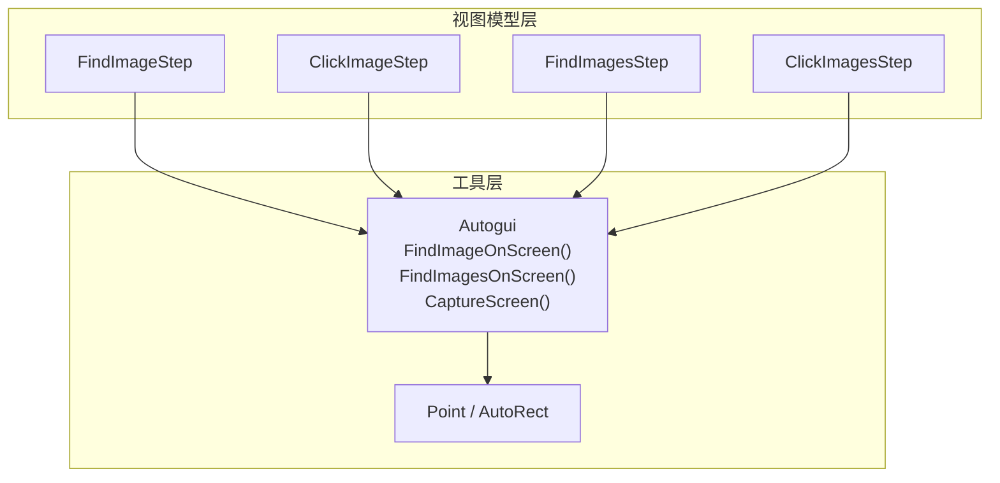
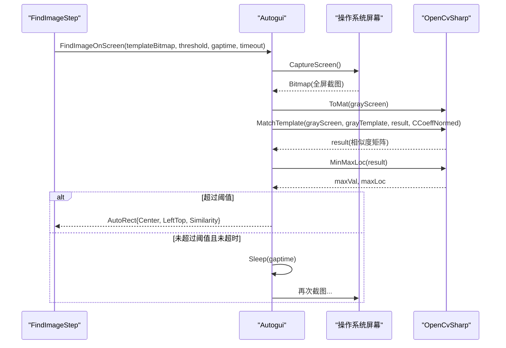
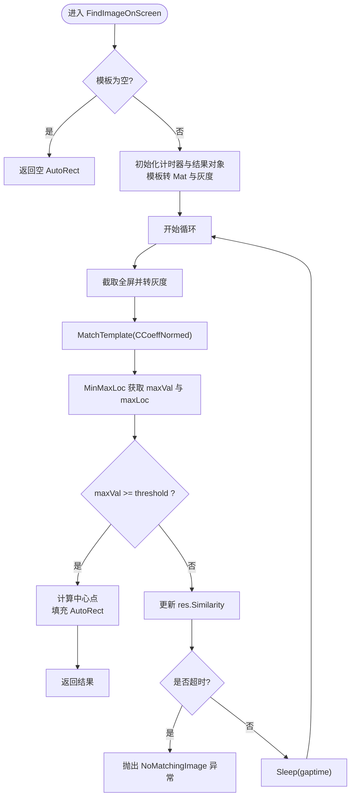
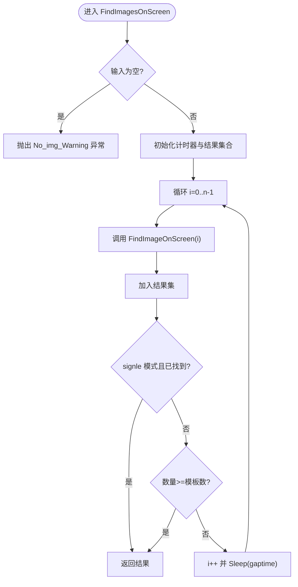
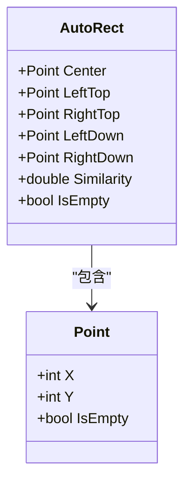
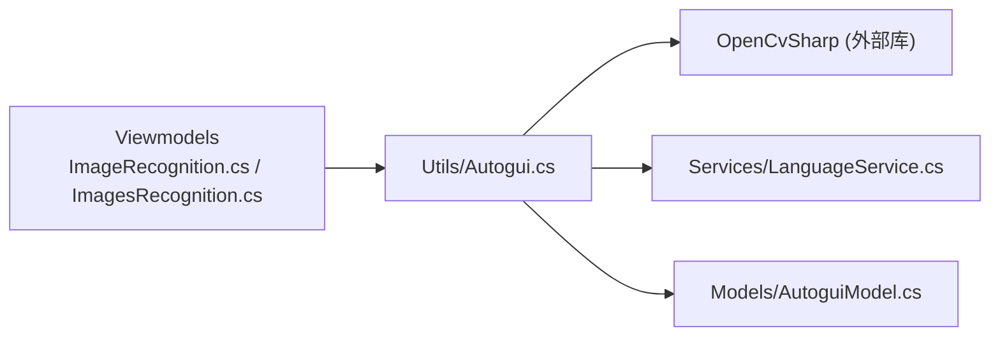

# 图像识别与匹配

<cite>
**本文引用的文件**   
- [Autogui.cs](file://ShaoLu/Utils/Autogui.cs)
- [AutoguiModel.cs](file://ShaoLu/Models/AutoguiModel.cs)
- [ImageRecognition.cs](file://ShaoLu/Viewmodels/ImageRecognition.cs)
- [ImagesRecognition.cs](file://ShaoLu/Viewmodels/ImagesRecognition.cs)
- [LanguageService.cs](file://ShaoLu/Services/LanguageService.cs)
- [Strings.en-US.resx](file://ShaoLu/Resources/Strings.en-US.resx)
</cite>

## 目录
1. [简介](#简介)
2. [项目结构](#项目结构)
3. [核心组件](#核心组件)
4. [架构总览](#架构总览)
5. [详细组件分析](#详细组件分析)
6. [依赖关系分析](#依赖关系分析)
7. [性能考虑](#性能考虑)
8. [故障排除指南](#故障排除指南)
9. [结论](#结论)
10. [附录：参数调优建议](#附录参数调优建议)

## 简介
本文件面向 ShaoLu 应用的“图像识别与匹配”能力，重点说明以下功能：
- FindImageOnScreen() 的模板匹配算法实现（OpenCV MatchTemplate、CCoeffNormed 相关系数模式、灰度转换优化）
- 相似度阈值判断、超时控制策略、循环查找逻辑
- FindImagesOnScreen() 的多图匹配实现（批量处理、单图模式、错误处理）
- AutoRect 结果对象的结构（中心点计算、左上角坐标、相似度值）
- 性能优化技巧、内存管理、线程安全考虑
- 参数调优指南与常见问题排查方法

## 项目结构
图像识别与匹配的核心代码分布在 Utils、Models、Viewmodels 三个层次：
- Utils/Autogui.cs：封装屏幕截图、模板匹配、鼠标操作等底层能力
- Models/AutoguiModel.cs：定义 Point、AutoRect 等数据结构
- Viewmodels/ImageRecognition.cs、ImagesRecognition.cs：将底层能力包装为可执行的自动化步骤（FindImageStep、ClickImageStep、FindImagesStep、ClickImagesStep）

图表来源
- [Autogui.cs:59-122](file://ShaoLu/Utils/Autogui.cs#L59-L122)
- [Autogui.cs:124-171](file://ShaoLu/Utils/Autogui.cs#L124-L171)
- [AutoguiModel.cs:89-144](file://ShaoLu/Models/AutoguiModel.cs#L89-L144)
- [ImageRecognition.cs:535-599](file://ShaoLu/Viewmodels/ImageRecognition.cs#L535-L599)
- [ImagesRecognition.cs:214-241](file://ShaoLu/Viewmodels/ImagesRecognition.cs#L214-L241)

章节来源
- [Autogui.cs:59-122](file://ShaoLu/Utils/Autogui.cs#L59-L122)
- [Autogui.cs:124-171](file://ShaoLu/Utils/Autogui.cs#L124-L171)
- [AutoguiModel.cs:89-144](file://ShaoLu/Models/AutoguiModel.cs#L89-L144)
- [ImageRecognition.cs:535-599](file://ShaoLu/Viewmodels/ImageRecognition.cs#L535-L599)
- [ImagesRecognition.cs:214-241](file://ShaoLu/Viewmodels/ImagesRecognition.cs#L214-L241)

## 核心组件
- Autogui.FindImageOnScreen(Bitmap, threshold, gaptime, timeout)
  - 使用 OpenCvSharp 的 MatchTemplate 进行模板匹配，采用 CCoeffNormed 相关系数模式
  - 每次循环截取全屏并转换为灰度图，减少计算量
  - 通过 MinMaxLoc 获取最大相似度及位置，超过阈值即返回结果
  - 支持超时控制与间隔重试
- Autogui.FindImagesOnScreen(List<AutoguiImage>, gaptime, timeout, signle)
  - 对多张模板依次或循环查找，支持单图模式（找到一个即返回）
  - 内部复用 FindImageOnScreen，统一异常与超时处理
- AutoRect
  - 包含 Center（中心点）、LeftTop（左上角）、RightTop/LeftDown/RightDown（由中心对称推导）、Similarity（相似度）
  - IsEmpty 用于快速判断是否有效

章节来源
- [Autogui.cs:59-122](file://ShaoLu/Utils/Autogui.cs#L59-L122)
- [Autogui.cs:124-171](file://ShaoLu/Utils/Autogui.cs#L124-L171)
- [AutoguiModel.cs:89-144](file://ShaoLu/Models/AutoguiModel.cs#L89-L144)

## 架构总览
下图展示了从 UI 步骤到模板匹配的调用链路与数据流。

图表来源
- [Autogui.cs:59-122](file://ShaoLu/Utils/Autogui.cs#L59-L122)
- [ImageRecognition.cs:535-599](file://ShaoLu/Viewmodels/ImageRecognition.cs#L535-L599)

## 详细组件分析

### FindImageOnScreen() 模板匹配算法
- 输入参数
  - templateImage：待匹配的模板位图
  - threshold：相似度阈值（默认 0.8）
  - gaptime：未找到时的重试间隔（秒）
  - timeout：总超时时间（秒）
- 关键流程
  - 将模板一次性转为 Mat 并转灰度，避免重复转换
  - 循环内：
    - 截取全屏并转灰度
    - 执行 MatchTemplate(CCoeffNormed)
    - MinMaxLoc 取最大相似度与位置
    - 若 maxVal >= threshold，计算中心点并返回 AutoRect
    - 否则更新 res.Similarity，检查是否超时；未超时则 Sleep(gaptime) 继续
  - 若最终相似度低于阈值，抛出本地化异常（NoMatchingImage）
- 复杂度与优化
  - 时间复杂度：O(WH) 每帧（W、H 为屏幕分辨率），灰度转换降低常数因子
  - 空间复杂度：O(WH) 存储结果矩阵
  - 优化点：模板仅转换一次、灰度图加速、Stopwatch 精确计时、合理 gaptime 避免频繁 CPU 占用

图表来源
- [Autogui.cs:59-122](file://ShaoLu/Utils/Autogui.cs#L59-L122)

章节来源
- [Autogui.cs:59-122](file://ShaoLu/Utils/Autogui.cs#L59-L122)

### FindImagesOnScreen() 多图匹配
- 输入参数
  - templateImage：AutoguiImage 列表，每个元素包含 Bitmap、Position、Threshold
  - gaptime：重试间隔（秒）
  - timeout：总超时（秒）
  - signle：单图模式（找到一个即返回）
- 处理逻辑
  - 校验输入非空
  - 循环遍历模板列表，逐个调用 FindImageOnScreen
  - 收集结果至 List<AutoRect>，达到数量或 signle 模式时返回
  - 捕获异常并在超时后向上抛出
- 适用场景
  - 需要按顺序或轮询匹配多个目标（如多按钮、多图标）

图表来源
- [Autogui.cs:124-171](file://ShaoLu/Utils/Autogui.cs#L124-L171)

章节来源
- [Autogui.cs:124-171](file://ShaoLu/Utils/Autogui.cs#L124-L171)

### AutoRect 结果对象
- 字段与属性
  - Center：匹配区域中心点（像素坐标）
  - LeftTop：匹配区域左上角（像素坐标）
  - RightTop/LeftDown/RightDown：基于 Center 与 LeftTop 的对称推导
  - Similarity：相似度得分（0~1）
  - IsEmpty：当 Center 或 LeftTop 无效时为真
- 用途
  - 作为 FindImageOnScreen/FindImagesOnScreen 的统一返回结构
  - 上层步骤根据 IsEmpty 判定成功与否，并根据 Center/LeftTop 执行后续动作（点击、OCR 区域定位等）

图表来源
- [AutoguiModel.cs:89-144](file://ShaoLu/Models/AutoguiModel.cs#L89-L144)

章节来源
- [AutoguiModel.cs:89-144](file://ShaoLu/Models/AutoguiModel.cs#L89-L144)

### 视图模型集成（FindImageStep、FindImagesStep）
- FindImageStep
  - 将 CroppedImg/ImgSrc 转换为 Bitmap，调用 Autogui.FindImageOnScreen
  - 支持等待时间、GapTime、Timeout
  - 可选 OCR 识别：在找到图像后，基于 OCRRect 计算屏幕区域并识别文本
  - 可选显示匹配区域叠加（调试）
- FindImagesStep
  - 将多个 ImageRecognition 转换为 AutoguiImage 列表
  - 调用 Autogui.FindImagesOnScreen，支持 GapTime、Timeout
  - 记录最后一次相似度与点击位置

章节来源
- [ImageRecognition.cs:535-599](file://ShaoLu/Viewmodels/ImageRecognition.cs#L535-L599)
- [ImagesRecognition.cs:214-241](file://ShaoLu/Viewmodels/ImagesRecognition.cs#L214-L241)

## 依赖关系分析
- Autogui 依赖 OpenCvSharp（MatchTemplate、ColorConversionCodes、BitmapConverter）
- 语言服务 LanguageService 提供本地化错误信息（NoMatchingImage、No_img_Warning）
- 视图模型层负责参数绑定、异步执行、UI 反馈（叠加显示、OCR 结果）

图表来源
- [Autogui.cs:1-15](file://ShaoLu/Utils/Autogui.cs#L1-L15)
- [LanguageService.cs:53-64](file://ShaoLu/Services/LanguageService.cs#L53-L64)
- [AutoguiModel.cs:89-144](file://ShaoLu/Models/AutoguiModel.cs#L89-L144)
- [ImageRecognition.cs:535-599](file://ShaoLu/Viewmodels/ImageRecognition.cs#L535-L599)
- [ImagesRecognition.cs:214-241](file://ShaoLu/Viewmodels/ImagesRecognition.cs#L214-L241)

章节来源
- [Autogui.cs:1-15](file://ShaoLu/Utils/Autogui.cs#L1-L15)
- [LanguageService.cs:53-64](file://ShaoLu/Services/LanguageService.cs#L53-L64)
- [AutoguiModel.cs:89-144](file://ShaoLu/Models/AutoguiModel.cs#L89-L144)
- [ImageRecognition.cs:535-599](file://ShaoLu/Viewmodels/ImageRecognition.cs#L535-L599)
- [ImagesRecognition.cs:214-241](file://ShaoLu/Viewmodels/ImagesRecognition.cs#L214-L241)

## 性能考虑
- 灰度转换优化
  - 模板与屏幕截图均转换为灰度图，显著降低 MatchTemplate 的计算量
- 模板转换缓存
  - 模板 Mat 与灰度模板仅在函数开始时转换一次，避免循环内重复转换
- 超时与间隔控制
  - 使用 Stopwatch 精确计时，配合 Thread.Sleep(gaptime) 平衡响应速度与 CPU 占用
- 内存管理
  - 使用 using 语句确保 Mat、Bitmap 等资源及时释放，避免内存泄漏
- 线程安全
  - 视图模型层通过 Task.Run 在后台线程执行匹配，避免阻塞 UI 线程
  - 剪贴板与 UI 交互通过 Dispatcher.Invoke/InvokeAsync 保证线程安全

[本节为通用指导，不直接分析具体文件]

## 故障排除指南
- 常见错误与原因
  - “未找到匹配图像”（NoMatchingImage）
    - 阈值过高导致无法匹配
    - 模板图像与实际屏幕内容差异较大（缩放、颜色变化、遮挡）
    - 屏幕分辨率/DPI 变化导致坐标偏移
  - “无图片警告”（No_img_Warning）
    - 传入模板列表为空或未正确加载图片
- 排查步骤
  - 降低 threshold（例如从 0.85 降至 0.75）
  - 增大 timeout，观察是否能稳定匹配
  - 调整 gaptime，避免过于频繁的截图造成卡顿
  - 检查模板是否为灰度或色彩一致，必要时预处理
  - 确认 DPI 设置与屏幕缩放比例，必要时进行坐标换算
- 日志与调试
  - 启用“显示匹配区域叠加”以直观验证匹配位置
  - 启用 OCR 区域叠加，辅助定位文字识别范围

章节来源
- [Autogui.cs:116-122](file://ShaoLu/Utils/Autogui.cs#L116-L122)
- [Autogui.cs:124-171](file://ShaoLu/Utils/Autogui.cs#L124-L171)
- [LanguageService.cs:53-64](file://ShaoLu/Services/LanguageService.cs#L53-L64)
- [Strings.en-US.resx:402-404](file://ShaoLu/Resources/Strings.en-US.resx#L402-L404)

## 结论
ShaoLu 的图像识别与匹配模块以 Autogui 为核心，结合 OpenCvSharp 的模板匹配能力，提供了稳定高效的 FindImageOnScreen 与 FindImagesOnScreen 接口。通过灰度转换、超时控制、间隔重试与资源管理，实现了良好的性能与可靠性。视图模型层将底层能力封装为可配置的自动化步骤，支持点击、OCR 与可视化调试，便于用户在不同场景下灵活应用。

[本节为总结性内容，不直接分析具体文件]

## 附录：参数调优建议
- threshold（相似度阈值）
  - 推荐起始值：0.8~0.85
  - 若误匹配较多，适当提高；若经常找不到，适当降低
- gaptime（重试间隔）
  - 推荐起始值：0.1~0.3 秒
  - 高刷新率屏幕可适当增大，避免频繁截图
- timeout（超时时间）
  - 推荐起始值：2~5 秒
  - 复杂界面或网络延迟场景可适当延长
- 多图匹配（FindImagesOnScreen）
  - 单图模式（signle=true）适用于“找到任意一个即停止”的场景
  - 批量模式需确保模板顺序与业务逻辑一致
- 内存与线程
  - 确保模板图像尺寸适中，过大将增加计算与内存压力
  - 后台线程执行匹配，UI 交互通过 Dispatcher 调度

[本节为通用指导，不直接分析具体文件]