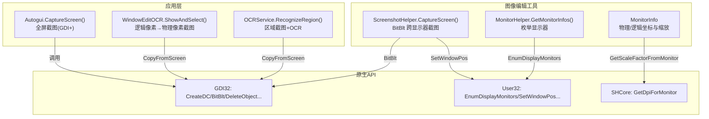
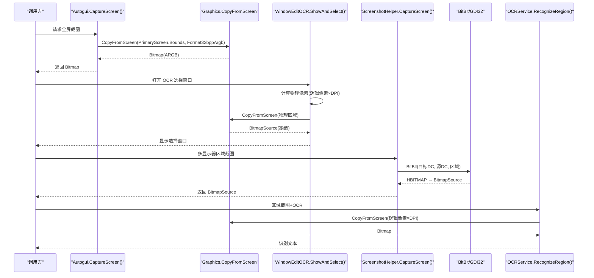
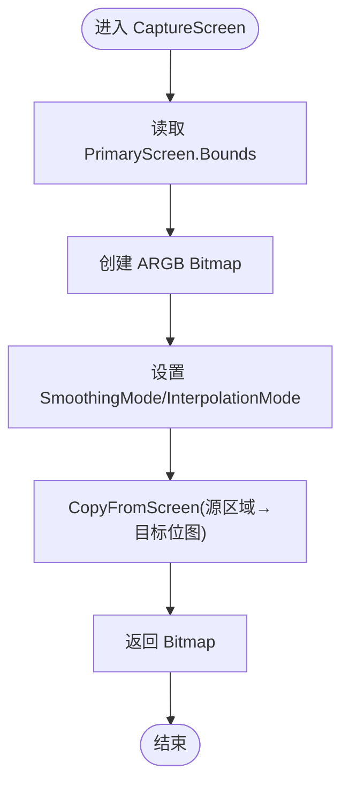
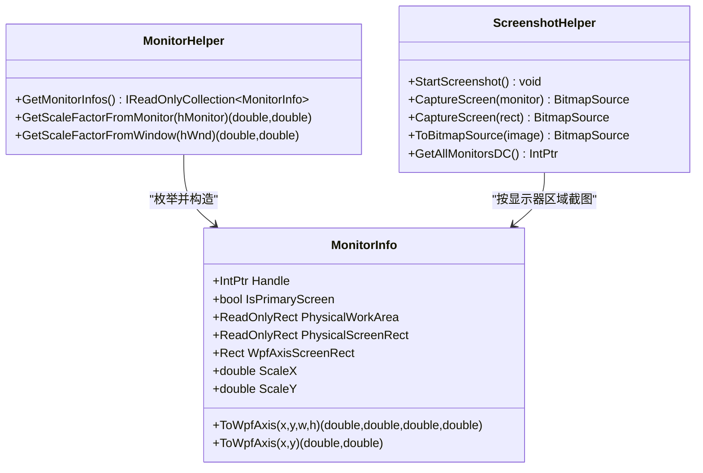
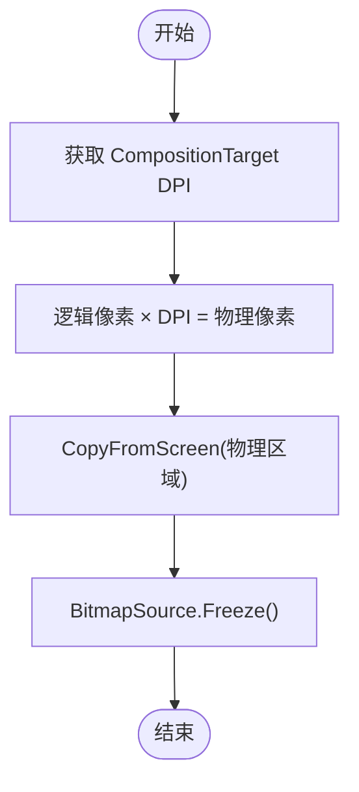
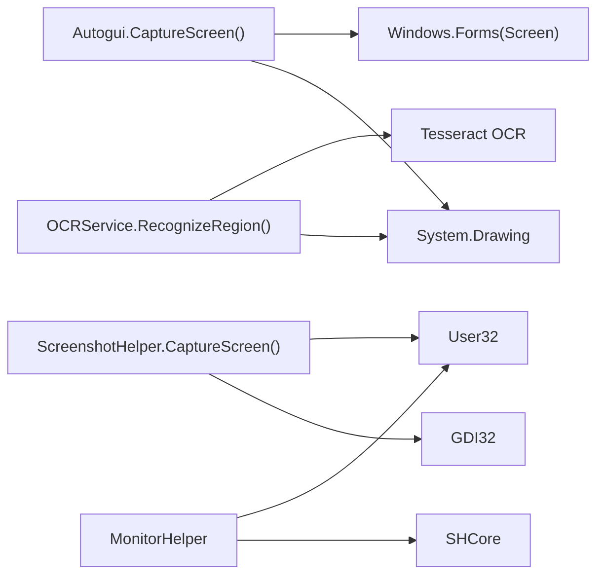

# 屏幕截图功能

<cite>
**本文引用的文件**   
- [Autogui.cs](file://ShaoLu/Utils/Autogui.cs)
- [WindowEditOCR.xaml.cs](file://ShaoLu/Views/WindowEditOCR.xaml.cs)
- [ScreenshotHelper.cs](file://ShaoLu/Tools/ImageEdit/Helpers/ScreenshotHelper.cs)
- [MonitorHelper.cs](file://ShaoLu/Tools/ImageEdit/Helpers/MonitorHelper.cs)
- [MonitorInfo.cs](file://ShaoLu/Tools/ImageEdit/Helpers/MonitorInfo.cs)
- [NativeMethods.Gdi32.cs](file://ShaoLu/Tools/ImageEdit/Interop/NativeMethods.Gdi32.cs)
- [NativeMethods.User32.cs](file://ShaoLu/Tools/ImageEdit/Interop/NativeMethods.User32.cs)
- [NativeMethods.Other.cs](file://ShaoLu/Tools/ImageEdit/Interop/NativeMethods.Other.cs)
- [ImageDecoder.cs](file://ShaoLu/Tools/ImageEdit/ImageDecoder.cs)
- [OCRService.cs](file://ShaoLu/Services/OCRService.cs)
</cite>

## 目录
1. [简介](#简介)
2. [项目结构](#项目结构)
3. [核心组件](#核心组件)
4. [架构总览](#架构总览)
5. [详细组件分析](#详细组件分析)
6. [依赖关系分析](#依赖关系分析)
7. [性能考虑](#性能考虑)
8. [故障排查指南](#故障排查指南)
9. [结论](#结论)
10. [附录：使用示例与最佳实践](#附录使用示例与最佳实践)

## 简介
本文件面向 ShaoLu 应用的“屏幕截图”能力，重点解析 CaptureScreen() 的实现原理、像素格式与图形质量设置、多显示器支持机制（含坐标系统与 DPI 缩放）、内存管理与对象生命周期控制、异常处理与错误恢复策略，并提供实际使用示例与最佳实践建议。文档同时覆盖两种截图路径：
- GDI+ 路径：基于 Graphics.CopyFromScreen 的全屏捕获（用于 OCR、图像识别等场景）
- Win32 BitBlt 路径：基于底层 GDI 的跨显示器区域捕获（用于多显示器编辑工具）

## 项目结构
与截图相关的代码分布在以下模块：
- Utils/Autogui.cs：提供 CaptureScreen() 全屏截图方法，供图像识别流程调用
- Views/WindowEditOCR.xaml.cs：在 OCR 选择窗口中按逻辑像素计算物理像素并执行截图
- Tools/ImageEdit/Helpers/ScreenshotHelper.cs：基于 Win32 BitBlt 的多显示器截图实现
- Tools/ImageEdit/Helpers/MonitorHelper.cs：枚举显示器、获取 DPI 缩放因子
- Tools/ImageEdit/Helpers/MonitorInfo.cs：封装显示器信息（物理矩形、WPF 轴转换、缩放因子）
- Tools/ImageEdit/Interop/*：GDI32/User32/SHCore 等原生 API 声明
- Tools/ImageEdit/ImageDecoder.cs：BitmapSource 与 Bitmap 互转的工具
- Services/OCRService.cs：区域截图 + OCR 识别，包含 DPI 缓存与异常处理

图表来源 
- [Autogui.cs:177-186](file://ShaoLu/Utils/Autogui.cs#L177-L186)
- [WindowEditOCR.xaml.cs:59-124](file://ShaoLu/Views/WindowEditOCR.xaml.cs#L59-L124)
- [ScreenshotHelper.cs:93-121](file://ShaoLu/Tools/ImageEdit/Helpers/ScreenshotHelper.cs#L93-L121)
- [MonitorHelper.cs:16-36](file://ShaoLu/Tools/ImageEdit/Helpers/MonitorHelper.cs#L16-L36)
- [MonitorInfo.cs:25-39](file://ShaoLu/Tools/ImageEdit/Helpers/MonitorInfo.cs#L25-L39)
- [NativeMethods.Gdi32.cs:14-36](file://ShaoLu/Tools/ImageEdit/Interop/NativeMethods.Gdi32.cs#L14-L36)
- [NativeMethods.User32.cs:101-129](file://ShaoLu/Tools/ImageEdit/Interop/NativeMethods.User32.cs#L101-L129)
- [NativeMethods.Other.cs:8-10](file://ShaoLu/Tools/ImageEdit/Interop/NativeMethods.Other.cs#L8-L10)

章节来源
- [Autogui.cs:177-186](file://ShaoLu/Utils/Autogui.cs#L177-L186)
- [WindowEditOCR.xaml.cs:59-124](file://ShaoLu/Views/WindowEditOCR.xaml.cs#L59-L124)
- [ScreenshotHelper.cs:93-121](file://ShaoLu/Tools/ImageEdit/Helpers/ScreenshotHelper.cs#L93-L121)
- [MonitorHelper.cs:16-36](file://ShaoLu/Tools/ImageEdit/Helpers/MonitorHelper.cs#L16-L36)
- [MonitorInfo.cs:25-39](file://ShaoLu/Tools/ImageEdit/Helpers/MonitorInfo.cs#L25-L39)
- [NativeMethods.Gdi32.cs:14-36](file://ShaoLu/Tools/ImageEdit/Interop/NativeMethods.Gdi32.cs#L14-L36)
- [NativeMethods.User32.cs:101-129](file://ShaoLu/Tools/ImageEdit/Interop/NativeMethods.User32.cs#L101-L129)
- [NativeMethods.Other.cs:8-10](file://ShaoLu/Tools/ImageEdit/Interop/NativeMethods.Other.cs#L8-L10)

## 核心组件
- Autogui.CaptureScreen()：使用 System.Drawing 进行全屏截图，指定 Format32bppArgb 像素格式，设置 SmoothingMode.AntiAlias 与 InterpolationMode.HighQualityBicubic，通过 CopyFromScreen 抓取 PrimaryScreen.Bounds。
- WindowEditOCR.ShowAndSelect()：根据 WPF 逻辑像素与 CompositionTarget 的 DPI 缩放因子，将逻辑像素转换为物理像素后调用 CopyFromScreen，生成 BitmapSource 并冻结以释放 GDI 句柄。
- ScreenshotHelper.CaptureScreen(ReadOnlyRect)：基于 Win32 BitBlt 对任意显示器区域进行截图，返回 BitmapSource；配合 MonitorHelper/MonitorInfo 完成多显示器与 DPI 缩放。
- MonitorHelper/MonitorInfo：枚举显示器、获取 DPI 缩放因子、提供物理坐标与 WPF 逻辑坐标之间的转换。
- ImageDecoder：提供 Bitmap 到 BitmapSource 的高效转换，确保 GDI 句柄释放。
- OCRService：区域截图 + OCR 识别，维护 DPI 缓存，统一异常处理与日志记录。

章节来源
- [Autogui.cs:177-186](file://ShaoLu/Utils/Autogui.cs#L177-L186)
- [WindowEditOCR.xaml.cs:59-124](file://ShaoLu/Views/WindowEditOCR.xaml.cs#L59-L124)
- [ScreenshotHelper.cs:93-121](file://ShaoLu/Tools/ImageEdit/Helpers/ScreenshotHelper.cs#L93-L121)
- [MonitorHelper.cs:16-36](file://ShaoLu/Tools/ImageEdit/Helpers/MonitorHelper.cs#L16-L36)
- [MonitorInfo.cs:25-39](file://ShaoLu/Tools/ImageEdit/Helpers/MonitorInfo.cs#L25-L39)
- [ImageDecoder.cs:19-44](file://ShaoLu/Tools/ImageEdit/ImageDecoder.cs#L19-L44)
- [OCRService.cs:114-144](file://ShaoLu/Services/OCRService.cs#L114-L144)

## 架构总览
下图展示截图相关的主要调用链与数据流：

图表来源 
- [Autogui.cs:177-186](file://ShaoLu/Utils/Autogui.cs#L177-L186)
- [WindowEditOCR.xaml.cs:59-124](file://ShaoLu/Views/WindowEditOCR.xaml.cs#L59-L124)
- [ScreenshotHelper.cs:93-121](file://ShaoLu/Tools/ImageEdit/Helpers/ScreenshotHelper.cs#L93-L121)
- [NativeMethods.Gdi32.cs:14-36](file://ShaoLu/Tools/ImageEdit/Interop/NativeMethods.Gdi32.cs#L14-L36)
- [OCRService.cs:114-144](file://ShaoLu/Services/OCRService.cs#L114-L144)

## 详细组件分析

### CaptureScreen() 实现原理（Autogui）
- 使用 Screen.PrimaryScreen.Bounds 获取主显示器边界，创建 Format32bppArgb 的 Bitmap。
- 设置 Graphics 的 SmoothingMode.AntiAlias 与 InterpolationMode.HighQualityBicubic，提升绘制质量。
- 调用 CopyFromScreen(bounds.X, bounds.Y, 0, 0, bounds.Size, SourceCopy) 直接拷贝屏幕像素。
- 返回 Bitmap，由调用方负责生命周期管理（例如在循环中使用 using 或显式 Dispose）。

图表来源 
- [Autogui.cs:177-186](file://ShaoLu/Utils/Autogui.cs#L177-L186)

章节来源
- [Autogui.cs:177-186](file://ShaoLu/Utils/Autogui.cs#L177-L186)

### 多显示器支持与坐标系统（ScreenshotHelper + MonitorHelper + MonitorInfo）
- MonitorHelper.GetMonitorInfos() 通过 EnumDisplayMonitors 枚举所有显示器，收集 MONITORINFOEX 中的 Monitor 与 WorkArea 矩形。
- MonitorInfo 封装每个显示器的 Handle、是否主屏、物理工作区与屏幕矩形、WPF 轴矩形以及 ScaleX/ScaleY 缩放因子。
- ScreenshotHelper.CaptureScreen(ReadOnlyRect) 使用 GetAllMonitorsDC() 获取全局 DC，CreateCompatibleDC/Bitmap 后调用 BitBlt 拷贝指定区域，再转为 BitmapSource。
- 窗口置顶与定位通过 SetWindowPos(HWND_TOPMOST) 实现，保证截图窗口始终在最前。

图表来源 
- [MonitorHelper.cs:16-36](file://ShaoLu/Tools/ImageEdit/Helpers/MonitorHelper.cs#L16-L36)
- [MonitorInfo.cs:25-39](file://ShaoLu/Tools/ImageEdit/Helpers/MonitorInfo.cs#L25-L39)
- [ScreenshotHelper.cs:93-121](file://ShaoLu/Tools/ImageEdit/Helpers/ScreenshotHelper.cs#L93-L121)

章节来源
- [MonitorHelper.cs:16-36](file://ShaoLu/Tools/ImageEdit/Helpers/MonitorHelper.cs#L16-L36)
- [MonitorInfo.cs:25-39](file://ShaoLu/Tools/ImageEdit/Helpers/MonitorInfo.cs#L25-L39)
- [ScreenshotHelper.cs:93-121](file://ShaoLu/Tools/ImageEdit/Helpers/ScreenshotHelper.cs#L93-L121)
- [NativeMethods.User32.cs:101-129](file://ShaoLu/Tools/ImageEdit/Interop/NativeMethods.User32.cs#L101-L129)

### DPI 缩放与高分辨率兼容性
- WindowEditOCR.ShowAndSelect() 从 PresentationSource.CompositionTarget.TransformToDevice 获取 DPI 缩放因子，将 WPF 逻辑像素乘以 dpiX/dpiY 得到物理像素，再调用 CopyFromScreen。
- OCRService.UpdateDpi() 缓存主窗口的 DPI 缩放因子，RecognizeRegion() 使用该缓存将逻辑像素区域转换为物理像素进行截图。
- MonitorHelper.GetScaleFactorFromMonitor() 通过 SHCore.GetDpiForMonitor 获取显示器 DPI，计算缩放因子。

图表来源 
- [WindowEditOCR.xaml.cs:74-106](file://ShaoLu/Views/WindowEditOCR.xaml.cs#L74-L106)
- [OCRService.cs:30-48](file://ShaoLu/Services/OCRService.cs#L30-L48)
- [OCRService.cs:114-144](file://ShaoLu/Services/OCRService.cs#L114-L144)
- [NativeMethods.Other.cs:8-10](file://ShaoLu/Tools/ImageEdit/Interop/NativeMethods.Other.cs#L8-L10)

章节来源
- [WindowEditOCR.xaml.cs:74-106](file://ShaoLu/Views/WindowEditOCR.xaml.cs#L74-L106)
- [OCRService.cs:30-48](file://ShaoLu/Services/OCRService.cs#L30-L48)
- [OCRService.cs:114-144](file://ShaoLu/Services/OCRService.cs#L114-L144)
- [NativeMethods.Other.cs:8-10](file://ShaoLu/Tools/ImageEdit/Interop/NativeMethods.Other.cs#L8-L10)

### 像素格式与图形质量
- 像素格式：Autogui.CaptureScreen() 使用 Format32bppArgb，确保 Alpha 通道与高质量颜色表示。
- 图形质量：设置 SmoothingMode.AntiAlias 与 InterpolationMode.HighQualityBicubic，提高后续图像处理质量。
- 在 ImageWork.ClipImage() 中也使用 HighQualityBicubic 插值模式，保证裁剪/缩放质量。

章节来源
- [Autogui.cs:177-186](file://ShaoLu/Utils/Autogui.cs#L177-L186)
- [ImageWork.cs:211-225](file://ShaoLu/Tools/ImageEdit/Utils/ImageWork.cs#L211-L225)

### 内存管理与对象生命周期
- Autogui.CaptureScreen() 返回的 Bitmap 应由调用方负责释放（推荐 using 或显式 Dispose），避免 GDI 资源泄漏。
- WindowEditOCR.ShowAndSelect() 将 BitmapSource 冻结（Freeze）并设置 CacheOption.OnLoad，使托管内存可回收且释放 GDI 句柄。
- ScreenshotHelper.ToBitmapSource() 通过 MemoryStream 保存为 PNG 后加载为 BitmapImage，避免长期持有 GDI 句柄。
- ImageDecoder.GetBitmapSource() 使用 Imaging.CreateBitmapSourceFromHBitmap 并调用 DeleteObject 释放 GDI 句柄。

章节来源
- [WindowEditOCR.xaml.cs:91-106](file://ShaoLu/Views/WindowEditOCR.xaml.cs#L91-L106)
- [ScreenshotHelper.cs:123-137](file://ShaoLu/Tools/ImageEdit/Helpers/ScreenshotHelper.cs#L123-L137)
- [ImageDecoder.cs:19-44](file://ShaoLu/Tools/ImageEdit/ImageDecoder.cs#L19-L44)

### 异常处理与错误恢复
- OCRService.UpdateDpi() 捕获异常并记录警告，回退默认 DPI。
- OCRService.RecognizeRegion() 捕获异常并记录错误，返回空字符串作为安全回退。
- Autogui.FindImageOnScreen() 在超时或匹配失败时抛出带本地化消息的异常，便于上层统一处理。

章节来源
- [OCRService.cs:30-48](file://ShaoLu/Services/OCRService.cs#L30-L48)
- [OCRService.cs:114-144](file://ShaoLu/Services/OCRService.cs#L114-L144)
- [Autogui.cs:59-122](file://ShaoLu/Utils/Autogui.cs#L59-L122)

## 依赖关系分析
- Autogui.CaptureScreen() 依赖 System.Drawing（Graphics、Bitmap、PixelFormat）与 Windows.Forms（Screen）。
- ScreenshotHelper 依赖 GDI32（CreateDC、BitBlt、DeleteObject）与 User32（EnumDisplayMonitors、SetWindowPos）。
- MonitorHelper 依赖 SHCore（GetDpiForMonitor）与 User32（MonitorFromWindow、GetDeviceCaps）。
- OCRService 依赖 OCR 引擎（Tesseract）与 System.Drawing 进行区域截图。

图表来源 
- [Autogui.cs:177-186](file://ShaoLu/Utils/Autogui.cs#L177-L186)
- [ScreenshotHelper.cs:93-121](file://ShaoLu/Tools/ImageEdit/Helpers/ScreenshotHelper.cs#L93-L121)
- [MonitorHelper.cs:38-68](file://ShaoLu/Tools/ImageEdit/Helpers/MonitorHelper.cs#L38-L68)
- [OCRService.cs:114-144](file://ShaoLu/Services/OCRService.cs#L114-L144)

章节来源
- [Autogui.cs:177-186](file://ShaoLu/Utils/Autogui.cs#L177-L186)
- [ScreenshotHelper.cs:93-121](file://ShaoLu/Tools/ImageEdit/Helpers/ScreenshotHelper.cs#L93-L121)
- [MonitorHelper.cs:38-68](file://ShaoLu/Tools/ImageEdit/Helpers/MonitorHelper.cs#L38-L68)
- [OCRService.cs:114-144](file://ShaoLu/Services/OCRService.cs#L114-L144)

## 性能考虑
- 优先使用 BitmapSource 冻结与 OnLoad 缓存，减少内存占用与 GDI 句柄持有时间。
- 在高频截图场景中，尽量复用 Graphics/Bitmap 对象，避免频繁分配与 GC 压力。
- 多显示器环境下，按需枚举显示器并仅截取所需区域，避免全量拷贝。
- 使用 BitBlt 路径（ScreenshotHelper）可获得更细粒度的区域控制与更好的跨显示器兼容性。
- 合理设置 CopyPixelOperation（如 SourceCopy）以减少不必要的颜色转换开销。

## 故障排查指南
- 若出现“找不到匹配的图像”，检查阈值与超时参数，确认模板图像清晰度与对比度。
- 若截图区域偏移或尺寸异常，核对逻辑像素与物理像素转换是否正确（DPI 缩放因子）。
- 若内存增长或句柄泄漏，检查 Bitmap/BitmapSource 的生命周期，确保及时释放与冻结。
- 若多显示器下窗口位置不正确，确认 SetWindowPos 与物理矩形坐标的使用。

章节来源
- [Autogui.cs:59-122](file://ShaoLu/Utils/Autogui.cs#L59-L122)
- [WindowEditOCR.xaml.cs:74-106](file://ShaoLu/Views/WindowEditOCR.xaml.cs#L74-L106)
- [ScreenshotHelper.cs:81-91](file://ShaoLu/Tools/ImageEdit/Helpers/ScreenshotHelper.cs#L81-L91)

## 结论
ShaoLu 的屏幕截图功能提供了两条互补的路径：GDI+ 的 CopyFromScreen 适合简单全屏捕获与 OCR/图像识别；Win32 BitBlt 路径适合多显示器与精细区域控制。通过合理的 DPI 缩放处理、像素格式与图形质量设置、严格的内存管理以及完善的异常处理，能够在高分辨率与多显示器环境下稳定高效地工作。

## 附录：使用示例与最佳实践
- 全屏截图（Autogui）
  - 调用 CaptureScreen() 获取 Bitmap，使用 using 包裹以确保释放。
  - 适用于图像识别、模板匹配等场景。
- 区域截图（OCRService）
  - 传入 WPF 逻辑像素区域，内部自动乘以 DPI 缩放进行物理像素截图。
  - 适用于 OCR 识别与局部内容提取。
- 多显示器截图（ScreenshotHelper）
  - 先通过 MonitorHelper 获取显示器列表，再按 PhysicalScreenRect 截取。
  - 适用于跨显示器编辑工具与多屏自动化。
- 最佳实践
  - 始终冻结 BitmapSource 并设置 OnLoad 缓存。
  - 在高频率调用中复用对象，减少分配与 GC 压力。
  - 正确处理异常与超时，提供用户友好的提示与回退。

章节来源
- [Autogui.cs:177-186](file://ShaoLu/Utils/Autogui.cs#L177-L186)
- [OCRService.cs:114-144](file://ShaoLu/Services/OCRService.cs#L114-L144)
- [ScreenshotHelper.cs:93-121](file://ShaoLu/Tools/ImageEdit/Helpers/ScreenshotHelper.cs#L93-L121)
- [WindowEditOCR.xaml.cs:74-106](file://ShaoLu/Views/WindowEditOCR.xaml.cs#L74-L106)