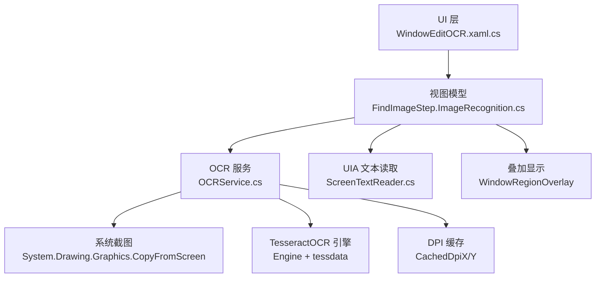
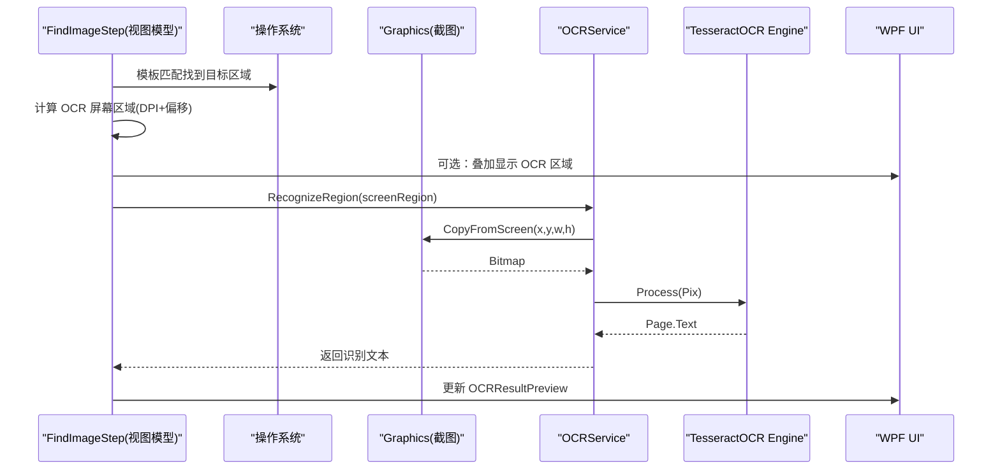
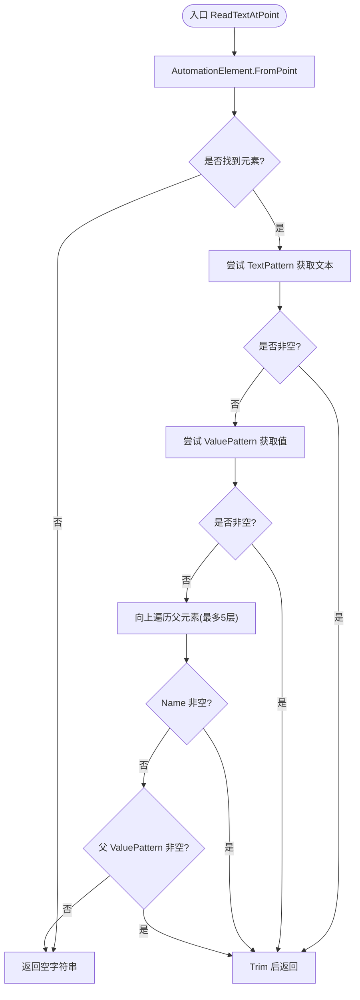
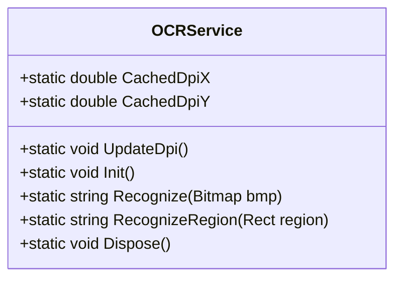
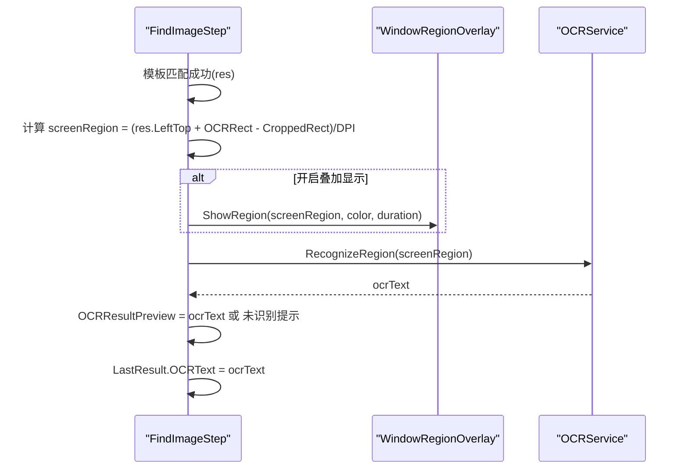
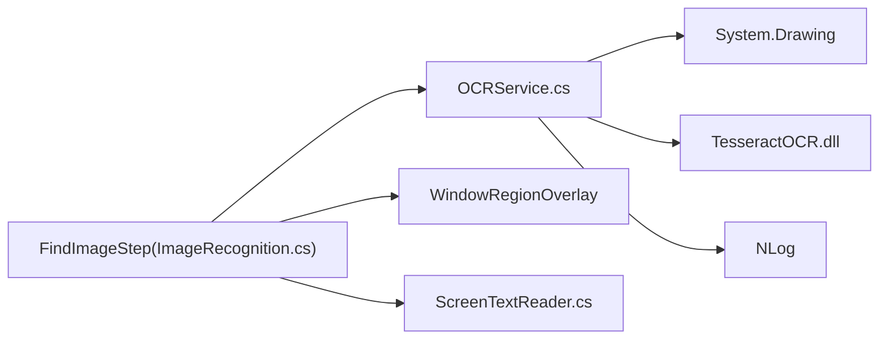

# 屏幕文本读取

<cite>
**本文引用的文件**   
- [ScreenTextReader.cs](file://ShaoLu/Utils/ScreenTextReader.cs)
- [OCRService.cs](file://ShaoLu/Services/OCRService.cs)
- [ImageRecognition.cs](file://ShaoLu/Viewmodels/ImageRecognition.cs)
- [ScreenshotHelper.cs](file://ShaoLu/Tools/ImageEdit/Helpers/ScreenshotHelper.cs)
- [ImageWork.cs](file://ShaoLu/Tools/ImageEdit/Utils/ImageWork.cs)
- [Autogui.cs](file://ShaoLu/Utils/Autogui.cs)
- [WindowEditOCR.xaml.cs](file://ShaoLu/Views/WindowEditOCR.xaml.cs)
- [Strings.zh-CN.resx](file://ShaoLu/Resources/Strings.zh-CN.resx)
- [SettingsTemplates.xaml](file://ShaoLu/Templates/SettingsTemplates.xaml)
- [ShaoLu.csproj](file://ShaoLu/ShaoLu.csproj)
</cite>

## 目录
1. [简介](#简介)
2. [项目结构](#项目结构)
3. [核心组件](#核心组件)
4. [架构总览](#架构总览)
5. [详细组件分析](#详细组件分析)
6. [依赖关系分析](#依赖关系分析)
7. [性能考量](#性能考量)
8. [故障排查指南](#故障排查指南)
9. [结论](#结论)
10. [附录](#附录)

## 简介
本文件面向 ShaoLu 应用的“屏幕文本读取”能力，聚焦以下目标：
- 说明 ScreenTextReader 的 UI Automation 文本读取实现（坐标定位、控件模式选择、父级回退策略）。
- 说明 OCRService 的 TesseractOCR 集成与初始化、语言包配置、识别参数。
- 解释屏幕区域截取与预处理流程（逻辑像素到物理像素转换、截图、内存流处理）。
- 梳理文本提取算法在工程中的落地方式（字符识别、行合并、布局输出由 OCR 引擎完成；应用层负责区域裁剪与结果展示）。
- 多语言支持现状（中英文混合识别、特殊字符与字体自适应的工程约束与建议）。
- 性能优化策略（DPI 缓存、懒加载、线程模型、资源释放）。
- 精度调优方法与常见问题解决方案。

## 项目结构
围绕屏幕文本读取，关键代码分布在 Utils、Services、Viewmodels、Tools 与 Views 等目录中：
- Utils：提供 UIA 文本读取与通用工具方法。
- Services：封装 OCR 服务（Tesseract 引擎、截图识别）。
- Viewmodels：将 OCR 能力集成到“查找图片后对指定区域进行文字识别”的流程中。
- Tools：提供截图、图像转换与缩放等基础能力。
- Views：提供 OCR 区域选择与预览界面。

图表来源
- [ImageRecognition.cs:535-599](file://ShaoLu/Viewmodels/ImageRecognition.cs#L535-L599)
- [OCRService.cs:53-107](file://ShaoLu/Services/OCRService.cs#L53-L107)
- [ScreenshotHelper.cs:93-121](file://ShaoLu/Tools/ImageEdit/Helpers/ScreenshotHelper.cs#L93-L121)
- [WindowEditOCR.xaml.cs:78-110](file://ShaoLu/Views/WindowEditOCR.xaml.cs#L78-L110)

章节来源
- [ImageRecognition.cs:535-599](file://ShaoLu/Viewmodels/ImageRecognition.cs#L535-L599)
- [OCRService.cs:53-107](file://ShaoLu/Services/OCRService.cs#L53-L107)
- [ScreenshotHelper.cs:93-121](file://ShaoLu/Tools/ImageEdit/Helpers/ScreenshotHelper.cs#L93-L121)
- [WindowEditOCR.xaml.cs:78-110](file://ShaoLu/Views/WindowEditOCR.xaml.cs#L78-L110)

## 核心组件
- ScreenTextReader：基于 UI Automation 从屏幕坐标处读取控件文本，依次尝试 TextPattern、ValuePattern，并向上遍历父元素获取 Name/Value。
- OCRService：封装 TesseractOCR 引擎，提供 DPI 缓存、懒加载初始化、区域截图与识别、资源释放。
- FindImageStep：在模板匹配成功后，计算 OCR 区域（考虑 DPI 与裁剪偏移），调用 OCRService 执行识别，并在 UI 上叠加显示区域与结果。
- ScreenshotHelper / ImageWork / Autogui：提供跨 WPF/Drawing 的图像转换、截图与保存能力。
- WindowEditOCR：用于在全屏或工作区范围内选择 OCR 区域并进行预览。

章节来源
- [ScreenTextReader.cs:1-79](file://ShaoLu/Utils/ScreenTextReader.cs#L1-L79)
- [OCRService.cs:1-159](file://ShaoLu/Services/OCRService.cs#L1-L159)
- [ImageRecognition.cs:439-602](file://ShaoLu/Viewmodels/ImageRecognition.cs#L439-L602)
- [ScreenshotHelper.cs:1-144](file://ShaoLu/Tools/ImageEdit/Helpers/ScreenshotHelper.cs#L1-L144)
- [ImageWork.cs:1-296](file://ShaoLu/Tools/ImageEdit/Utils/ImageWork.cs#L1-L296)
- [Autogui.cs:175-202](file://ShaoLu/Utils/Autogui.cs#L175-L202)
- [WindowEditOCR.xaml.cs:78-110](file://ShaoLu/Views/WindowEditOCR.xaml.cs#L78-L110)

## 架构总览
下图展示了“查找图片 → 计算 OCR 区域 → 截图 → OCR 识别 → 结果展示”的完整调用链。

图表来源
- [ImageRecognition.cs:535-599](file://ShaoLu/Viewmodels/ImageRecognition.cs#L535-L599)
- [OCRService.cs:114-144](file://ShaoLu/Services/OCRService.cs#L114-L144)

## 详细组件分析

### ScreenTextReader：UIA 文本读取
- 功能要点
  - 通过 FromPoint 定位坐标处的 AutomationElement。
  - 优先使用 TextPattern.DocumentRange.GetText 获取富文本内容。
  - 其次使用 ValuePattern.Current.Value 获取输入框值。
  - 最后向上遍历最多 5 层父元素，尝试 Name 或 ValuePattern。
  - 异常时返回空字符串，保证健壮性。
- 适用场景
  - 适用于可自动化暴露文本的控件（如 TextBox、文档、部分自定义控件）。
  - 对于纯位图或无 UIA 暴露的控件，应回退到 OCR 方案。

图表来源
- [ScreenTextReader.cs:18-76](file://ShaoLu/Utils/ScreenTextReader.cs#L18-L76)

章节来源
- [ScreenTextReader.cs:1-79](file://ShaoLu/Utils/ScreenTextReader.cs#L1-L79)

### OCRService：TesseractOCR 集成与区域识别
- 引擎初始化
  - 懒加载单例 Engine，首次调用时创建。
  - 语言包路径为程序目录下的 tessdata，默认启用 chi_sim+eng（简体中文+英文）混合识别。
  - 使用 NLog 记录初始化成功/失败日志。
- DPI 缓存
  - 在 UI 线程更新 CachedDpiX/Y，避免后台线程访问 WPF 对象。
  - 所有区域截图均按 DPI 缩放因子将逻辑像素转换为物理像素。
- 识别流程
  - Recognize(Bitmap)：将 Bitmap 转为 PNG 字节流，构造 Pix 并交由 Engine.Process 返回 Page.Text。
  - RecognizeRegion(Rect)：根据 region 计算物理像素坐标与尺寸，CopyFromScreen 截图，再调用 Recognize。
- 资源管理
  - Dispose() 释放 Engine 实例，避免内存泄漏。

图表来源
- [OCRService.cs:1-159](file://ShaoLu/Services/OCRService.cs#L1-L159)

章节来源
- [OCRService.cs:1-159](file://ShaoLu/Services/OCRService.cs#L1-L159)

### FindImageStep：OCR 区域计算与结果展示
- OCR 开关与区域
  - EnableOCR：是否启用 OCR。
  - OCRRect：相对于原图的像素矩形（在编辑窗口设置）。
  - CroppedRect：裁剪区域偏移，用于将 OCRRect 映射到裁剪图坐标系。
- 运行时流程
  - 模板匹配成功后，计算 OCR 屏幕区域：res.LeftTop（物理像素）+ OCRRect - CroppedRect，再除以 DPI 得到逻辑像素 Rect。
  - 可选：在屏幕上叠加显示 OCR 区域（颜色与时长由设置控制）。
  - 异步调用 OCRService.RecognizeRegion 执行识别，并将结果写入 OCRResultPreview。
- 结果填充
  - LastResult 包含 IsTrue、Similarity、ClickPosition、OCRText。

图表来源
- [ImageRecognition.cs:535-599](file://ShaoLu/Viewmodels/ImageRecognition.cs#L535-L599)

章节来源
- [ImageRecognition.cs:439-602](file://ShaoLu/Viewmodels/ImageRecognition.cs#L439-L602)

### 屏幕区域截取与预处理
- 截图来源
  - OCRService.RecognizeRegion：使用 System.Drawing.Graphics.CopyFromScreen 直接截取物理像素区域。
  - ScreenshotHelper.CaptureScreen：基于 GDI BitBlt 捕获指定监视器区域，并转换为 WPF BitmapSource。
  - Autogui.CaptureScreen：全屏截图，便于调试或批量处理。
- 图像转换
  - ImageWork.WpfBitmapSourceToBitmap / ImageSourceToBitmap：在 WPF 与 Drawing.Bitmap 之间互转。
  - WindowEditOCR.xaml.cs：演示了从 CompositionTarget 获取 DPI，按物理像素截图并冻结 BitmapImage 以提升性能。
- 预处理现状
  - 当前 OCR 流程未显式进行灰度转换与二值化，直接以原始截图送入 Tesseract。
  - 如需增强，可在 OCRService 内部增加 OpenCV 预处理管线（见“性能与优化建议”）。

章节来源
- [OCRService.cs:114-144](file://ShaoLu/Services/OCRService.cs#L114-L144)
- [ScreenshotHelper.cs:93-121](file://ShaoLu/Tools/ImageEdit/Helpers/ScreenshotHelper.cs#L93-L121)
- [Autogui.cs:175-202](file://ShaoLu/Utils/Autogui.cs#L175-L202)
- [ImageWork.cs:64-92](file://ShaoLu/Tools/ImageEdit/Utils/ImageWork.cs#L64-L92)
- [WindowEditOCR.xaml.cs:78-110](file://ShaoLu/Views/WindowEditOCR.xaml.cs#L78-L110)

### 文本提取算法（工程视角）
- 字符识别与行合并：由 TesseractOCR 引擎完成，返回 Page.Text 已包含行合并与基本布局信息。
- 单词分割：Tesseract 默认按空白分割，可通过配置调整，但当前工程未暴露相关参数。
- 布局分析：Page.Text 为纯文本；若需结构化布局（段落、表格），需在 OCRService 层扩展解析逻辑。
- 工程现状：应用层主要负责区域裁剪、DPI 换算与结果展示，不直接参与字符/词/行级别的算法处理。

章节来源
- [OCRService.cs:82-107](file://ShaoLu/Services/OCRService.cs#L82-L107)
- [ImageRecognition.cs:564-587](file://ShaoLu/Viewmodels/ImageRecognition.cs#L564-L587)

### 多语言支持与特殊字符
- 语言包配置
  - 默认启用 chi_sim+eng，支持简体中文与英文混合识别。
  - 项目打包了 eng.traineddata、chi_sim.traineddata、chi_tra.traineddata、equ.traineddata 等语言包。
- 特殊字符与字体自适应
  - 当前未针对特殊字符集或字体自适应做专门处理。
  - 建议：对复杂符号（数学公式、特殊标点）可引入 equ.traineddata；对低分辨率或小字号文本，建议在预处理阶段进行放大与锐化。

章节来源
- [OCRService.cs:63-65](file://ShaoLu/Services/OCRService.cs#L63-L65)
- [ShaoLu.csproj:465-482](file://ShaoLu/ShaoLu.csproj#L465-L482)

## 依赖关系分析
- 组件耦合
  - FindImageStep 依赖 OCRService 进行识别，依赖 WindowRegionOverlay 进行可视化。
  - OCRService 依赖 System.Drawing 与 TesseractOCR，依赖 NLog 记录日志。
  - ScreenshotHelper 依赖 GDI 与 WPF Imaging。
- 外部依赖
  - TesseractOCR 包版本 5.5.2。
  - tessdata 语言包随项目发布。
  - NLog 用于诊断与错误追踪。

图表来源
- [ImageRecognition.cs:535-599](file://ShaoLu/Viewmodels/ImageRecognition.cs#L535-L599)
- [OCRService.cs:1-159](file://ShaoLu/Services/OCRService.cs#L1-L159)
- [ScreenTextReader.cs:1-79](file://ShaoLu/Utils/ScreenTextReader.cs#L1-L79)

章节来源
- [ShaoLu.csproj:126-128](file://ShaoLu/ShaoLu.csproj#L126-L128)
- [ShaoLu.csproj:465-482](file://ShaoLu/ShaoLu.csproj#L465-L482)

## 性能考量
- 懒加载与单例
  - OCR 引擎采用懒加载与双重检查锁，避免重复初始化开销。
- DPI 缓存
  - 在 UI 线程一次性更新 CachedDpiX/Y，后续仅读，降低跨线程访问成本。
- 线程模型
  - 模板匹配与 OCR 识别均在 Task.Run 中执行，避免阻塞 UI。
- 内存管理
  - 使用 using 释放 MemoryStream、Pix、Page 等资源。
  - Dispose() 释放 Engine，防止长期运行内存增长。
- 图像格式
  - 使用 PNG 无损压缩，利于 OCR 质量；若追求速度可评估 JPEG 权衡。
- 叠加显示
  - 可选的 RegionOverlay 仅在需要时显示，减少 UI 负担。

[本节为通用指导，不直接分析具体文件]

## 故障排查指南
- 无法识别文本
  - 检查 tessdata 路径是否存在且包含对应语言包。
  - 确认 OCRRect 与 CroppedRect 设置正确，DPI 换算无误。
  - 查看 NLog 日志，定位 OCR 初始化或识别异常。
- 识别结果为空
  - 确认控件是否支持 UIA（优先使用 ScreenTextReader 读取）。
  - 若为位图或无 UIA 暴露，确保 OCR 区域足够大且对比度良好。
- 多显示器/DPI 问题
  - 确保在应用启动后调用 OCRService.UpdateDpi() 更新 DPI 缓存。
  - 检查 CopyFromScreen 的物理像素坐标是否正确。
- 性能瓶颈
  - 减少频繁截图与识别，必要时加入去抖与结果缓存。
  - 考虑对大图分块识别或降低分辨率预处理。

章节来源
- [OCRService.cs:53-75](file://ShaoLu/Services/OCRService.cs#L53-L75)
- [OCRService.cs:114-144](file://ShaoLu/Services/OCRService.cs#L114-L144)
- [ImageRecognition.cs:564-587](file://ShaoLu/Viewmodels/ImageRecognition.cs#L564-L587)

## 结论
ShaoLu 的屏幕文本读取能力由两部分组成：
- 对具备 UIA 能力的控件，优先使用 ScreenTextReader 快速、稳定地读取文本。
- 对位图或不可自动化控件，通过 OCRService 结合 TesseractOCR 进行区域截图与识别。
工程实现了 DPI 感知、懒加载、线程安全与资源释放，满足一般自动化场景需求。若需进一步提升精度与性能，可在 OCRService 内引入 OpenCV 预处理、并行识别与结果缓存等优化。

[本节为总结，不直接分析具体文件]

## 附录
- 相关设置项
  - ShowOCRRegionOnRun：运行时显示 OCR 区域叠加。
  - OCRRegionOverlay：叠加颜色与持续时间。
- 资源与本地化
  - Strings.zh-CN.resx 中包含 OCR 相关的中文文案（如“OCR 区域”“测试 OCR”“未识别到文本”等）。

章节来源
- [SettingsTemplates.xaml:149-160](file://ShaoLu/Templates/SettingsTemplates.xaml#L149-L160)
- [Strings.zh-CN.resx:744-761](file://ShaoLu/Resources/Strings.zh-CN.resx#L744-L761)