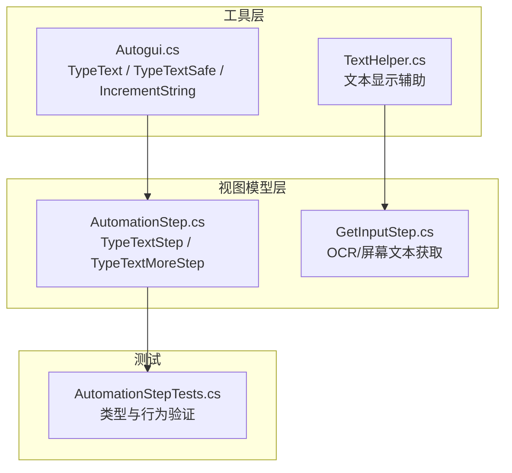
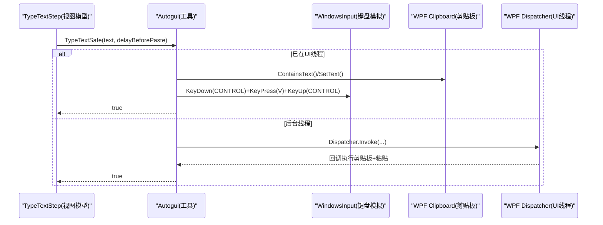
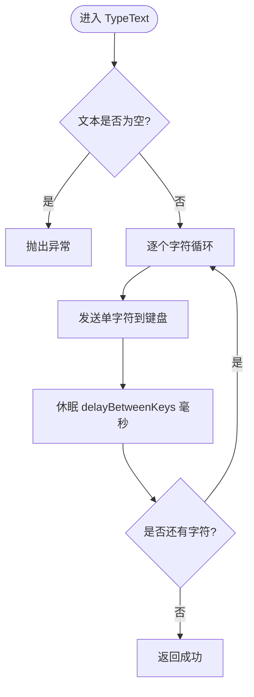
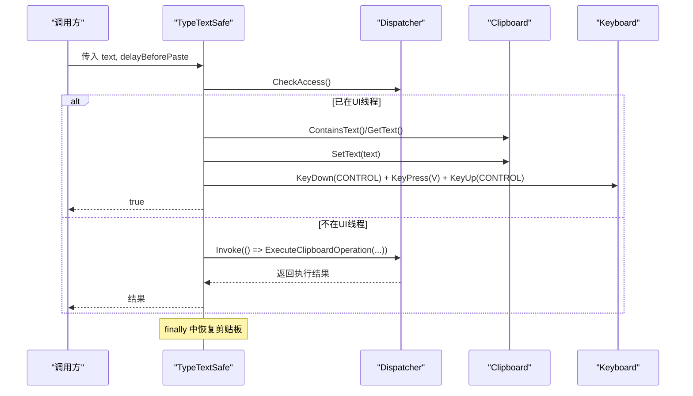
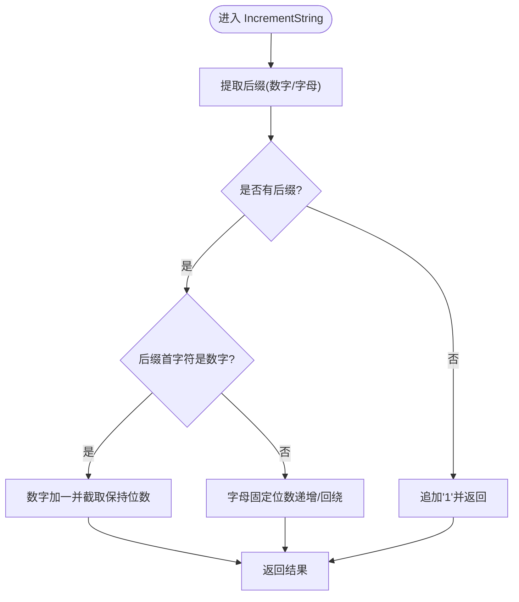
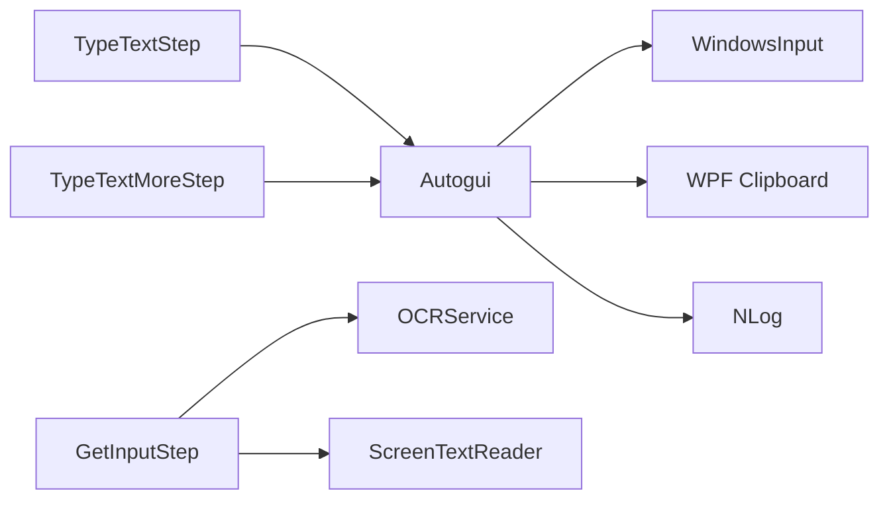

# 文本输入操作

<cite>
**本文引用的文件**   
- [Autogui.cs](file://ShaoLu/Utils/Autogui.cs)
- [TextHelper.cs](file://ShaoLu/Utils/TextHelper.cs)
- [AutomationStep.cs](file://ShaoLu/Viewmodels/AutomationStep.cs)
- [GetInputStep.cs](file://ShaoLu/Viewmodels/GetInputStep.cs)
- [AutomationStepTests.cs](file://NUnitTest/AutomationStepTests.cs)
</cite>

## 目录
1. [简介](#简介)
2. [项目结构](#项目结构)
3. [核心组件](#核心组件)
4. [架构总览](#架构总览)
5. [详细组件分析](#详细组件分析)
6. [依赖关系分析](#依赖关系分析)
7. [性能考虑](#性能考虑)
8. [故障排查指南](#故障排查指南)
9. [结论](#结论)
10. [附录：使用示例与最佳实践](#附录使用示例与最佳实践)

## 简介
本文件聚焦 ShaoLu 应用中的“文本输入”能力，围绕以下关键点展开：
- TypeText() 的字符级输入实现：逐字符模拟、延迟控制、特殊字符处理。
- TypeTextSafe() 的安全剪贴板操作：剪贴板备份恢复、STA 线程检查、Dispatcher.Invoke 调用。
- IncrementString() 的字符串递增算法：数字后缀处理、字母后缀循环、固定位数保持。
- 剪贴板操作的线程安全性：WPF Clipboard 使用、异常处理、资源清理。
- Unicode 支持、输入法兼容性与性能优化技巧。
- 不同场景下的使用示例与最佳实践。

## 项目结构
文本输入相关代码主要分布在 Utils 层（底层自动化）、Viewmodels 层（步骤模型与执行）以及单元测试中。下图概览了关键文件及其职责：

图表来源
- [Autogui.cs:425-655](file://ShaoLu/Utils/Autogui.cs#L425-L655)
- [TextHelper.cs:1-43](file://ShaoLu/Utils/TextHelper.cs#L1-L43)
- [AutomationStep.cs:296-461](file://ShaoLu/Viewmodels/AutomationStep.cs#L296-L461)
- [GetInputStep.cs:1-294](file://ShaoLu/Viewmodels/GetInputStep.cs#L1-L294)
- [AutomationStepTests.cs:14-194](file://NUnitTest/AutomationStepTests.cs#L14-L194)

章节来源
- [Autogui.cs:425-655](file://ShaoLu/Utils/Autogui.cs#L425-L655)
- [TextHelper.cs:1-43](file://ShaoLu/Utils/TextHelper.cs#L1-L43)
- [AutomationStep.cs:296-461](file://ShaoLu/Viewmodels/AutomationStep.cs#L296-L461)
- [GetInputStep.cs:1-294](file://ShaoLu/Viewmodels/GetInputStep.cs#L1-L294)
- [AutomationStepTests.cs:14-194](file://NUnitTest/AutomationStepTests.cs#L14-L194)

## 核心组件
- Autogui.TypeText：基于 WindowsInput 的字符级键盘输入，逐字符发送并支持按键间隔延迟。
- Autogui.TypeTextSafe：通过剪贴板+Ctrl+V 粘贴的方式安全输入，确保在 STA 线程执行，具备剪贴板备份/恢复与异常处理。
- Autogui.IncrementString：对字符串末尾的数字或字母后缀进行递增，支持固定位数保持与字母回绕。
- TextHelper：用于 UI 展示时的文本压缩与截断，便于表格预览。
- AutomationStep.TypeTextStep / TypeTextMoreStep：将输入动作封装为可配置的执行步骤，支持延迟、前缀/中间/后缀组合等。
- GetInputStep：提供 OCR 与屏幕文本读取两种输入源，作为“获取输入”的前置环节。

章节来源
- [Autogui.cs:425-655](file://ShaoLu/Utils/Autogui.cs#L425-L655)
- [TextHelper.cs:1-43](file://ShaoLu/Utils/TextHelper.cs#L1-L43)
- [AutomationStep.cs:296-461](file://ShaoLu/Viewmodels/AutomationStep.cs#L296-L461)
- [GetInputStep.cs:1-294](file://ShaoLu/Viewmodels/GetInputStep.cs#L1-L294)

## 架构总览
文本输入的整体流程分为“生成目标文本”和“执行输入”两个阶段：
- 生成目标文本：可由用户直接设置（TypeTextStep.TextToType），或由 TypeTextMoreStep 组合前缀/中间/后缀后生成；也可由 GetInputStep 从 OCR/屏幕文本读取结果。
- 执行输入：TypeTextStep 调用 Autogui.TypeText 或 Autogui.TypeTextSafe 完成实际输入。

图表来源
- [Autogui.cs:585-651](file://ShaoLu/Utils/Autogui.cs#L585-L651)
- [AutomationStep.cs:296-461](file://ShaoLu/Viewmodels/AutomationStep.cs#L296-L461)

## 详细组件分析

### Autogui.TypeText：字符级输入
- 逐字符模拟：遍历字符串每个字符，调用底层键盘模拟器发送单个字符。
- 延迟控制：每键入一个字符后休眠指定毫秒数，避免过快输入导致目标控件无法接收。
- 特殊字符处理：由于按字符发送，对于需要组合输入的字符（如带音标的字符、中文输入法下的多段输入）可能不友好，建议优先使用 TypeTextSafe。
- 错误处理：空串参数会抛出异常，调用方需做好校验。

图表来源
- [Autogui.cs:569-583](file://ShaoLu/Utils/Autogui.cs#L569-L583)

章节来源
- [Autogui.cs:569-583](file://ShaoLu/Utils/Autogui.cs#L569-L583)

### Autogui.TypeTextSafe：安全剪贴板输入
- 剪贴板备份恢复：先读取当前剪贴板文本（若存在）并保存，写入新文本后执行 Ctrl+V 粘贴，最后恢复原始内容。
- STA 线程检查：通过 App.Current.Dispatcher.CheckAccess() 判断是否在 UI 线程；否则使用 Dispatcher.Invoke 同步切换到 UI 线程执行。
- 异常处理：捕获异常并记录日志，返回失败状态，保证上层稳定。
- 资源清理：finally 块确保即使出错也能尝试恢复剪贴板。

图表来源
- [Autogui.cs:585-651](file://ShaoLu/Utils/Autogui.cs#L585-L651)

章节来源
- [Autogui.cs:585-651](file://ShaoLu/Utils/Autogui.cs#L585-L651)

### Autogui.IncrementString：字符串递增算法
- 提取后缀：从末尾向前扫描连续的数字或字母，确定前缀与后缀。
- 数字后缀：解析为整数加一，若长度超过原位数则截取末尾以保持位数不变。
- 字母后缀：区分大小写，逐位递增，Z→A/a→a 回绕；所有位都进位时，在不改变位数的情况下回绕（例如 ZZ→AA）。
- 无后缀：直接追加“1”。

图表来源
- [Autogui.cs:427-567](file://ShaoLu/Utils/Autogui.cs#L427-L567)

章节来源
- [Autogui.cs:427-567](file://ShaoLu/Utils/Autogui.cs#L427-L567)

### TextHelper：文本显示辅助
- CompressToSingleLine：将换行/制表符替换为空格并合并连续空格，使文本适合单行展示。
- Truncate：压缩后超过最大长度则截断并追加省略号。
- IsTruncated：判断是否需要截断或压缩，用于决定是否提供预览入口。

章节来源
- [TextHelper.cs:1-43](file://ShaoLu/Utils/TextHelper.cs#L1-L43)

### TypeTextStep / TypeTextMoreStep：输入步骤模型
- TypeTextStep：包含待输入文本与按键间隔，默认延迟 0.05 秒，支持克隆与属性复制。
- TypeTextMoreStep：支持前缀/中间/后缀组合生成最终文本，并提供 Reload 重置逻辑。
- 单元测试覆盖：构造器、默认属性、克隆独立性、UID 唯一性等。

章节来源
- [AutomationStep.cs:296-461](file://ShaoLu/Viewmodels/AutomationStep.cs#L296-L461)
- [AutomationStepTests.cs:14-194](file://NUnitTest/AutomationStepTests.cs#L14-L194)

### GetInputStep：获取输入（OCR/屏幕文本）
- 模式选择：OCR 区域识别或屏幕指定位置的可选择文本读取。
- 运行流程：等待 WaitTime，根据模式执行 OCR 或读取屏幕文本，存储结果并更新 LastResult。
- 可视化：可选在屏幕上标示 OCR 区域，便于调试。

章节来源
- [GetInputStep.cs:1-294](file://ShaoLu/Viewmodels/GetInputStep.cs#L1-L294)

## 依赖关系分析
- Autogui 依赖 WindowsInput 进行键盘模拟，依赖 WPF Clipboard 进行剪贴板操作，依赖 NLog 记录日志。
- TypeTextStep/TypeTextMoreStep 依赖 Autogui 提供的输入方法。
- GetInputStep 依赖 OCRService 与 ScreenTextReader 获取文本。

图表来源
- [Autogui.cs:1-15](file://ShaoLu/Utils/Autogui.cs#L1-L15)
- [AutomationStep.cs:296-461](file://ShaoLu/Viewmodels/AutomationStep.cs#L296-L461)
- [GetInputStep.cs:1-294](file://ShaoLu/Viewmodels/GetInputStep.cs#L1-L294)

章节来源
- [Autogui.cs:1-15](file://ShaoLu/Utils/Autogui.cs#L1-L15)
- [AutomationStep.cs:296-461](file://ShaoLu/Viewmodels/AutomationStep.cs#L296-L461)
- [GetInputStep.cs:1-294](file://ShaoLu/Viewmodels/GetInputStep.cs#L1-L294)

## 性能考虑
- TypeText 逐字符输入会产生大量系统调用，长文本输入建议使用 TypeTextSafe（一次剪贴板写入+一次粘贴），减少系统开销。
- 合理设置 delayBetweenKeys/delayBeforePaste：过短可能导致目标控件未就绪，过长会降低整体速度。经验值可从 0.05s 开始调优。
- 剪贴板操作在 STA 线程执行，避免跨线程访问导致的额外调度成本。
- 大文本输入时注意内存占用与剪贴板容量限制，必要时分批处理。

[本节为通用指导，不直接分析具体文件]

## 故障排查指南
- 空文本异常：TypeText/TypeTextSafe 对空串会抛出异常，调用前应校验非空。
- 剪贴板恢复失败：虽然 finally 块尝试恢复，但某些进程可能阻止修改剪贴板，建议在关键路径上增加重试或降级策略。
- 线程问题：在非 UI 线程调用剪贴板会导致异常，务必通过 Dispatcher.Invoke 切换至 UI 线程。
- 输入法兼容：TypeText 按字符发送，可能无法正确触发 IME 组合输入；遇到中文/带音标字符建议使用 TypeTextSafe。
- OCR/屏幕文本读取失败：检查 DPI 缩放与坐标换算，确认 OCR 区域有效且可读。

章节来源
- [Autogui.cs:569-651](file://ShaoLu/Utils/Autogui.cs#L569-L651)
- [GetInputStep.cs:166-222](file://ShaoLu/Viewmodels/GetInputStep.cs#L166-L222)

## 结论
ShaoLu 的文本输入体系以 Autogui 为核心，提供两种输入方式：字符级直接输入（TypeText）与安全剪贴板输入（TypeTextSafe）。前者适合简单、可控的字符序列输入；后者更适合复杂字符、Unicode 与输入法环境。IncrementString 提供了灵活的编号/标识生成能力，配合 TypeTextMoreStep 可实现动态文本组装。通过合理的延迟配置与线程管理，可在多种应用场景下稳定高效地完成文本输入任务。

[本节为总结性内容，不直接分析具体文件]

## 附录：使用示例与最佳实践
- 基本输入：使用 TypeTextStep 设置 TextToType 与 DelayBetweenKeys，并在执行时调用 Autogui.TypeTextSafe 以确保兼容性。
- 动态文本：使用 TypeTextMoreStep 组合 Prefix/Infix/Suffix，并通过 IncrementString 生成递增后缀（如 SN001END → SN002END）。
- 输入源集成：先用 GetInputStep 从 OCR 或屏幕文本获取结果，再交给 TypeTextStep 进行粘贴输入。
- 性能调优：长文本优先使用 TypeTextSafe；适当增大 delayBeforePaste 确保剪贴板更新完成；避免频繁切换线程。
- 健壮性保障：始终校验输入非空；捕获并记录剪贴板异常；必要时提供重试机制。

章节来源
- [AutomationStep.cs:296-461](file://ShaoLu/Viewmodels/AutomationStep.cs#L296-L461)
- [Autogui.cs:427-651](file://ShaoLu/Utils/Autogui.cs#L427-L651)
- [GetInputStep.cs:1-294](file://ShaoLu/Viewmodels/GetInputStep.cs#L1-L294)
- [AutomationStepTests.cs:14-194](file://NUnitTest/AutomationStepTests.cs#L14-L194)