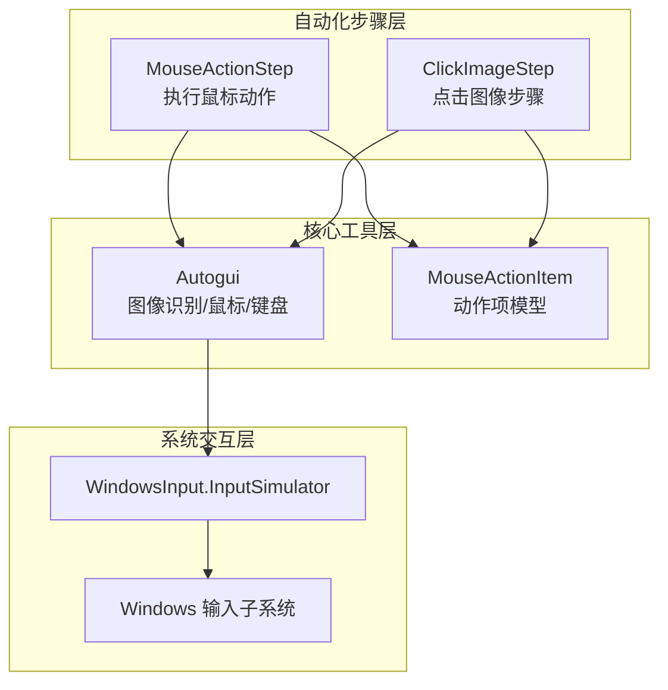
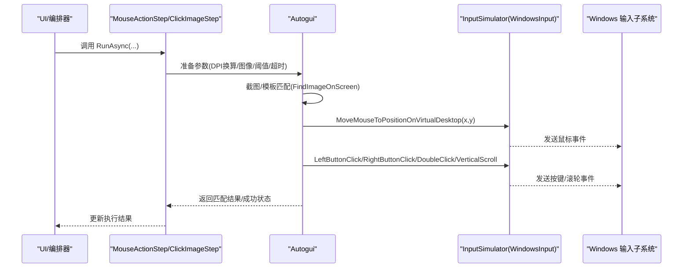
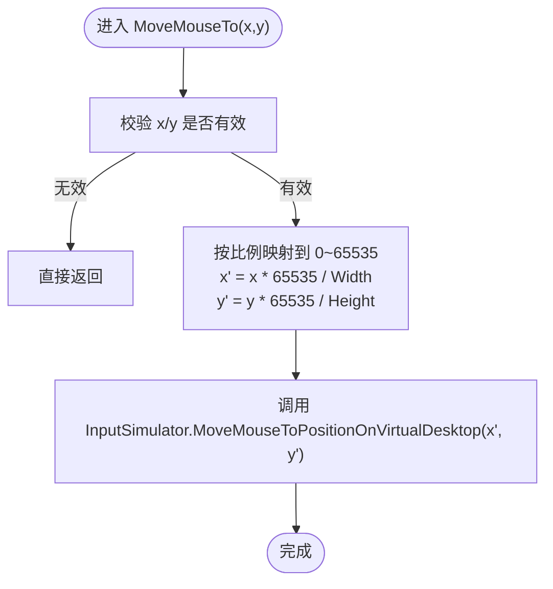
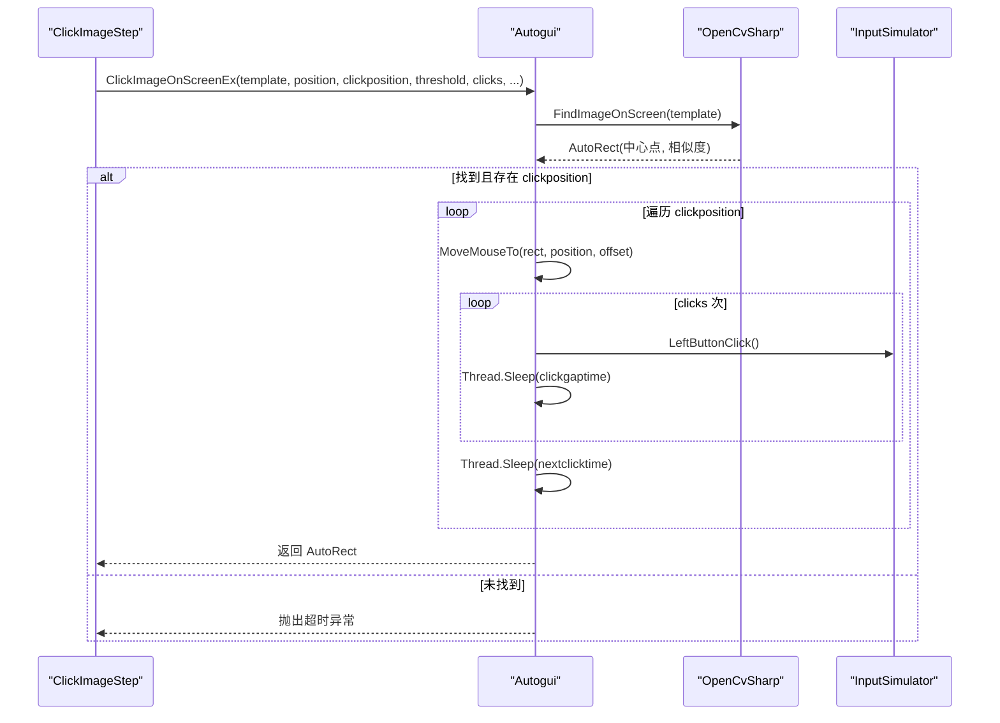
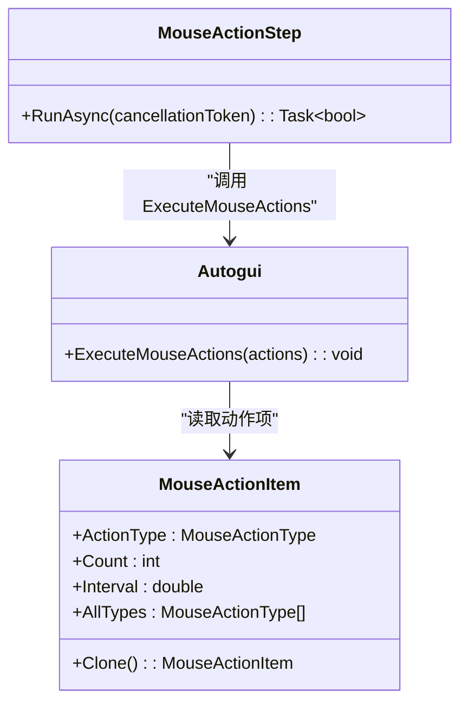
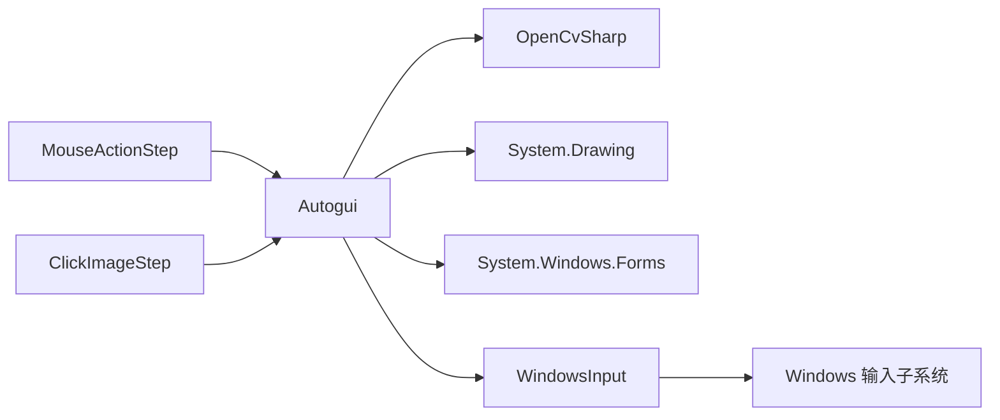

# 鼠标键盘模拟

<cite>
**本文引用的文件**   
- [Autogui.cs](file://ShaoLu/Utils/Autogui.cs)
- [MouseActionItem.cs](file://ShaoLu/Models/MouseActionItem.cs)
- [MouseActionStep.cs](file://ShaoLu/Viewmodels/MouseActionStep.cs)
- [ImageRecognition.cs](file://ShaoLu/Viewmodels/ImageRecognition.cs)
- [MonitorHelper.cs](file://ShaoLu/Tools/ImageEdit/Helpers/MonitorHelper.cs)
- [MonitorInfo.cs](file://ShaoLu/Tools/ImageEdit/Helpers/MonitorInfo.cs)
- [NativeMethods.Other.cs](file://ShaoLu/Tools/ImageEdit/Interop/NativeMethods.Other.cs)
- [WindowSelectPoint.xaml.cs](file://ShaoLu/Views/WindowSelectPoint.xaml.cs)
</cite>

## 目录
1. [简介](#简介)
2. [项目结构](#项目结构)
3. [核心组件](#核心组件)
4. [架构总览](#架构总览)
5. [详细组件分析](#详细组件分析)
6. [依赖关系分析](#依赖关系分析)
7. [性能考虑](#性能考虑)
8. [故障排查指南](#故障排查指南)
9. [结论](#结论)

## 简介
本文件面向 ShaoLu 应用中的“鼠标键盘模拟”能力，重点说明以下方面：
- MoveMouseTo() 的坐标转换机制：虚拟桌面坐标系、65535 精度映射、屏幕边界处理。
- ClickImageOnScreenEx() 的点击流程：图像定位、位置计算、多次点击支持、点击间隔控制。
- ExecuteMouseActions() 的动作序列执行：左键点击、右键点击、双击、滚轮操作。
- InputSimulator 库的使用：WindowsInput 命名空间、VirtualKeyCode 枚举、异步与线程同步处理。
- DPI 缩放处理、多显示器支持、线程同步机制。
- 性能优化建议与常见问题解决方案。

## 项目结构
与鼠标键盘模拟相关的代码主要分布在 Utils、Models、Viewmodels 以及 Tools/ImageEdit 辅助模块中：
- Utils/Autogui.cs：封装了图像识别、鼠标移动、点击、动作序列等核心能力。
- Models/MouseActionItem.cs：定义鼠标动作类型及参数（次数、间隔）。
- Viewmodels/MouseActionStep.cs：将用户配置转换为具体执行步骤，负责 DPI 换算与调用 Autogui。
- Viewmodels/ImageRecognition.cs：封装“点击图像”步骤的执行逻辑，包括超时、等待、多次点击等。
- Tools/ImageEdit/Helpers：提供 DPI 获取、显示器信息、截图等底层工具。

图表来源
- [Autogui.cs:180-378](file://ShaoLu/Utils/Autogui.cs#L180-L378)
- [MouseActionItem.cs:1-57](file://ShaoLu/Models/MouseActionItem.cs#L1-L57)
- [MouseActionStep.cs:112-144](file://ShaoLu/Viewmodels/MouseActionStep.cs#L112-L144)
- [ImageRecognition.cs:415-435](file://ShaoLu/Viewmodels/ImageRecognition.cs#L415-L435)

章节来源
- [Autogui.cs:180-378](file://ShaoLu/Utils/Autogui.cs#L180-L378)
- [MouseActionItem.cs:1-57](file://ShaoLu/Models/MouseActionItem.cs#L1-L57)
- [MouseActionStep.cs:112-144](file://ShaoLu/Viewmodels/MouseActionStep.cs#L112-L144)
- [ImageRecognition.cs:415-435](file://ShaoLu/Viewmodels/ImageRecognition.cs#L415-L435)

## 核心组件
- Autogui：集中实现屏幕截图、模板匹配、鼠标移动与点击、文本输入、剪贴板粘贴等。
- MouseActionItem：描述一次鼠标动作的类型、重复次数与间隔。
- MouseActionStep：将逻辑像素坐标按 DPI 换算为物理像素，并调用 Autogui 执行动作序列。
- ClickImageStep：封装“查找图像并点击”的完整流程，包含等待、超时、多次点击与动作序列。

章节来源
- [Autogui.cs:180-378](file://ShaoLu/Utils/Autogui.cs#L180-L378)
- [MouseActionItem.cs:1-57](file://ShaoLu/Models/MouseActionItem.cs#L1-L57)
- [MouseActionStep.cs:112-144](file://ShaoLu/Viewmodels/MouseActionStep.cs#L112-L144)
- [ImageRecognition.cs:415-435](file://ShaoLu/Viewmodels/ImageRecognition.cs#L415-L435)

## 架构总览
整体流程从 UI 或编排器触发“步骤”，步骤在后台线程执行，通过 Autogui 调用 WindowsInput 驱动系统输入设备。

图表来源
- [Autogui.cs:180-378](file://ShaoLu/Utils/Autogui.cs#L180-L378)
- [MouseActionStep.cs:112-144](file://ShaoLu/Viewmodels/MouseActionStep.cs#L112-L144)
- [ImageRecognition.cs:415-435](file://ShaoLu/Viewmodels/ImageRecognition.cs#L415-L435)

## 详细组件分析

### MoveMouseTo() 坐标转换机制
- 输入坐标：以“物理像素”为单位传入（x, y），该坐标基于虚拟桌面坐标系（跨多显示器统一坐标空间）。
- 精度映射：使用 65535 作为绝对坐标精度上限，将物理像素映射到 0~65535 范围，确保在不同分辨率下保持一致的相对位置。
- 屏幕边界处理：由于映射基于主屏尺寸，当目标位于非主屏或多显示器负坐标区域时，可能出现越界或不准确；建议在多显示器场景下结合 MonitorInfo 与 DPI 信息进行校正。
- 关键实现路径参考：
  - 坐标映射至 65535 精度：[Autogui.cs:193-196](file://ShaoLu/Utils/Autogui.cs#L193-L196)

图表来源
- [Autogui.cs:193-196](file://ShaoLu/Utils/Autogui.cs#L193-L196)

章节来源
- [Autogui.cs:193-196](file://ShaoLu/Utils/Autogui.cs#L193-L196)

### ClickImageOnScreenEx() 点击流程
- 图像定位：使用 OpenCvSharp 进行模板匹配，返回匹配区域的中心点与相似度。
- 位置计算：根据锚点（中心/左上/右上/左下/右下）与可选偏移量确定最终点击坐标。
- 多次点击支持：支持 clicks 参数控制重复点击次数，并在每次点击之间插入 clickgaptime 间隔。
- 点击间隔控制：nextclicktime 用于多次点击之间的等待时间；waittime 用于开始前的等待。
- 超时处理：timeout 控制最长等待时间，超时抛出异常。
- 关键实现路径参考：
  - 模板匹配与超时循环：[Autogui.cs:59-122](file://ShaoLu/Utils/Autogui.cs#L59-L122)
  - 点击流程与多次点击：[Autogui.cs:265-306](file://ShaoLu/Utils/Autogui.cs#L265-L306)
  - 步骤级调用与参数传递：[ImageRecognition.cs:415-435](file://ShaoLu/Viewmodels/ImageRecognition.cs#L415-L435)

图表来源
- [Autogui.cs:59-122](file://ShaoLu/Utils/Autogui.cs#L59-L122)
- [Autogui.cs:265-306](file://ShaoLu/Utils/Autogui.cs#L265-L306)
- [ImageRecognition.cs:415-435](file://ShaoLu/Viewmodels/ImageRecognition.cs#L415-L435)

章节来源
- [Autogui.cs:59-122](file://ShaoLu/Utils/Autogui.cs#L59-L122)
- [Autogui.cs:265-306](file://ShaoLu/Utils/Autogui.cs#L265-L306)
- [ImageRecognition.cs:415-435](file://ShaoLu/Viewmodels/ImageRecognition.cs#L415-L435)

### ExecuteMouseActions() 动作序列执行
- 支持的鼠标动作：
  - 左键点击：LeftClick
  - 右键点击：RightClick
  - 双击：DoubleClick
  - 滚轮上/下：ScrollUp/ScrollDown
- 执行策略：顺序执行每个动作项，每项可设置重复次数 Count 与间隔 Interval。
- 关键实现路径参考：
  - 动作枚举与参数：[MouseActionItem.cs:1-57](file://ShaoLu/Models/MouseActionItem.cs#L1-L57)
  - 动作执行与间隔控制：[Autogui.cs:311-339](file://ShaoLu/Utils/Autogui.cs#L311-L339)

图表来源
- [MouseActionItem.cs:1-57](file://ShaoLu/Models/MouseActionItem.cs#L1-L57)
- [Autogui.cs:311-339](file://ShaoLu/Utils/Autogui.cs#L311-L339)
- [MouseActionStep.cs:112-144](file://ShaoLu/Viewmodels/MouseActionStep.cs#L112-L144)

章节来源
- [MouseActionItem.cs:1-57](file://ShaoLu/Models/MouseActionItem.cs#L1-L57)
- [Autogui.cs:311-339](file://ShaoLu/Utils/Autogui.cs#L311-L339)
- [MouseActionStep.cs:112-144](file://ShaoLu/Viewmodels/MouseActionStep.cs#L112-L144)

### InputSimulator 库使用与 VirtualKeyCode
- 命名空间：WindowsInput（通过 using WindowsInput; 引入）。
- 鼠标操作：MoveMouseToPositionOnVirtualDesktop、LeftButtonClick、RightButtonClick、LeftButtonDoubleClick、VerticalScroll。
- 键盘操作：KeyDown、KeyPress、KeyUp，配合 VirtualKeyCode 枚举（如 CONTROL、VK_V）实现组合键。
- 线程与异步：
  - 剪贴板操作需在 UI 线程（STA）执行，使用 App.Current.Dispatcher.CheckAccess/Invoke 保证线程安全。
  - 耗时操作（图像识别、鼠标/键盘模拟）通常在 Task.Run 中执行，避免阻塞 UI。
- 关键实现路径参考：
  - 鼠标移动与点击：[Autogui.cs:193-196](file://ShaoLu/Utils/Autogui.cs#L193-L196)、[Autogui.cs:311-339](file://ShaoLu/Utils/Autogui.cs#L311-L339)
  - 键盘组合键（Ctrl+V）：[Autogui.cs:603-605](file://ShaoLu/Utils/Autogui.cs#L603-L605)
  - 线程切换与 Dispatcher：[Autogui.cs:633-644](file://ShaoLu/Utils/Autogui.cs#L633-L644)

章节来源
- [Autogui.cs:193-196](file://ShaoLu/Utils/Autogui.cs#L193-L196)
- [Autogui.cs:311-339](file://ShaoLu/Utils/Autogui.cs#L311-L339)
- [Autogui.cs:603-605](file://ShaoLu/Utils/Autogui.cs#L603-L605)
- [Autogui.cs:633-644](file://ShaoLu/Utils/Autogui.cs#L633-L644)

### DPI 缩放处理与多显示器支持
- DPI 获取：
  - 通过 GetDpiForMonitor 或 GetDeviceCaps 获取显示器 DPI，计算缩放因子（DefaultDpi / dpiX/Y）。
  - MonitorInfo.ToWpfAxis 将物理坐标转换为 WPF 逻辑坐标。
- 坐标换算：
  - MouseActionStep 在执行前将逻辑像素乘以 CachedDpiX/Y 得到物理像素，再调用 Autogui.MoveMouseTo。
- 多显示器：
  - 虚拟桌面坐标允许负值，但当前 MoveMouseTo 映射仅基于主屏宽度，跨屏场景需结合 MonitorInfo 修正。
- 关键实现路径参考：
  - DPI 获取与缩放因子：[MonitorHelper.cs:38-68](file://ShaoLu/Tools/ImageEdit/Helpers/MonitorHelper.cs#L38-L68)
  - 显示器信息与坐标转换：[MonitorInfo.cs:25-55](file://ShaoLu/Tools/ImageEdit/Helpers/MonitorInfo.cs#L25-L55)
  - 逻辑像素到物理像素换算：[MouseActionStep.cs:119-125](file://ShaoLu/Viewmodels/MouseActionStep.cs#L119-L125)
  - 窗口选择点时的 DPI 处理：[WindowSelectPoint.xaml.cs:50-53](file://ShaoLu/Views/WindowSelectPoint.xaml.cs#L50-L53)

章节来源
- [MonitorHelper.cs:38-68](file://ShaoLu/Tools/ImageEdit/Helpers/MonitorHelper.cs#L38-L68)
- [MonitorInfo.cs:25-55](file://ShaoLu/Tools/ImageEdit/Helpers/MonitorInfo.cs#L25-L55)
- [MouseActionStep.cs:119-125](file://ShaoLu/Viewmodels/MouseActionStep.cs#L119-L125)
- [WindowSelectPoint.xaml.cs:50-53](file://ShaoLu/Views/WindowSelectPoint.xaml.cs#L50-L53)

## 依赖关系分析
- Autogui 依赖：
  - OpenCvSharp：模板匹配与图像处理。
  - WindowsInput：模拟鼠标/键盘输入。
  - System.Drawing：截图与 Bitmap 处理。
  - System.Windows.Forms：Screen.PrimaryScreen.Bounds。
- 步骤层依赖：
  - MouseActionStep/ClickImageStep 依赖 Autogui 提供的核心能力。
- 系统层依赖：
  - Windows 输入子系统（通过 InputSimulator 间接调用）。

图表来源
- [Autogui.cs:1-15](file://ShaoLu/Utils/Autogui.cs#L1-L15)
- [MouseActionStep.cs:1-12](file://ShaoLu/Viewmodels/MouseActionStep.cs#L1-L12)
- [ImageRecognition.cs:329-345](file://ShaoLu/Viewmodels/ImageRecognition.cs#L329-L345)

章节来源
- [Autogui.cs:1-15](file://ShaoLu/Utils/Autogui.cs#L1-L15)
- [MouseActionStep.cs:1-12](file://ShaoLu/Viewmodels/MouseActionStep.cs#L1-L12)
- [ImageRecognition.cs:329-345](file://ShaoLu/Viewmodels/ImageRecognition.cs#L329-L345)

## 性能考虑
- 图像识别性能：
  - 模板匹配在每次循环中截取全屏并转换灰度图，开销较大。建议：
    - 合理设置 gaptime/timeout，避免频繁重试。
    - 缩小搜索区域（若已知目标大致位置）。
    - 降低图像分辨率或预处理（裁剪、二值化）。
- 鼠标/键盘模拟：
  - 减少不必要的移动与点击，合并连续动作。
  - 合理设置 clickgaptime/nextclicktime，避免过短导致系统丢事件。
- 线程与 UI：
  - 耗时操作放在后台线程，UI 更新通过 Dispatcher 调度，避免界面卡顿。
- DPI 与多显示器：
  - 缓存 DPI 值，避免重复查询。
  - 跨屏场景尽量使用 MonitorInfo 进行坐标校正。

[本节为通用指导，不直接分析具体文件]

## 故障排查指南
- 找不到图像：
  - 检查阈值 threshold 是否过低/过高。
  - 确认截图质量与光照条件。
  - 增加 timeout 与 gaptime。
  - 参考：[Autogui.cs:59-122](file://ShaoLu/Utils/Autogui.cs#L59-L122)
- 点击位置偏差：
  - 检查 DPI 换算是否正确（逻辑像素→物理像素）。
  - 多显示器环境下，确认虚拟桌面坐标与主屏映射。
  - 参考：[MouseActionStep.cs:119-125](file://ShaoLu/Viewmodels/MouseActionStep.cs#L119-L125)、[MonitorInfo.cs:25-55](file://ShaoLu/Tools/ImageEdit/Helpers/MonitorInfo.cs#L25-L55)
- 剪贴板操作失败：
  - 确保在 STA 线程执行 Clipboard 操作。
  - 参考：[Autogui.cs:633-644](file://ShaoLu/Utils/Autogui.cs#L633-L644)
- 动作序列未按预期执行：
  - 检查 MouseActionItem.Count 与 Interval 设置。
  - 确认动作类型与顺序。
  - 参考：[MouseActionItem.cs:1-57](file://ShaoLu/Models/MouseActionItem.cs#L1-L57)、[Autogui.cs:311-339](file://ShaoLu/Utils/Autogui.cs#L311-L339)

章节来源
- [Autogui.cs:59-122](file://ShaoLu/Utils/Autogui.cs#L59-L122)
- [MouseActionStep.cs:119-125](file://ShaoLu/Viewmodels/MouseActionStep.cs#L119-L125)
- [MonitorInfo.cs:25-55](file://ShaoLu/Tools/ImageEdit/Helpers/MonitorInfo.cs#L25-L55)
- [Autogui.cs:633-644](file://ShaoLu/Utils/Autogui.cs#L633-L644)
- [MouseActionItem.cs:1-57](file://ShaoLu/Models/MouseActionItem.cs#L1-L57)
- [Autogui.cs:311-339](file://ShaoLu/Utils/Autogui.cs#L311-L339)

## 结论
ShaoLu 的鼠标键盘模拟功能以 Autogui 为核心，结合 OpenCvSharp 进行图像识别，通过 WindowsInput 驱动系统输入设备。MoveMouseTo() 使用 65535 精度映射虚拟桌面坐标，ClickImageOnScreenEx() 提供完整的图像定位与点击流程，ExecuteMouseActions() 支持灵活的鼠标动作序列。在多显示器与 DPI 缩放场景下，需要结合 MonitorInfo 与 DPI 缓存进行坐标校正。通过合理的超时、间隔与线程管理，可在保证稳定性的同时提升性能。