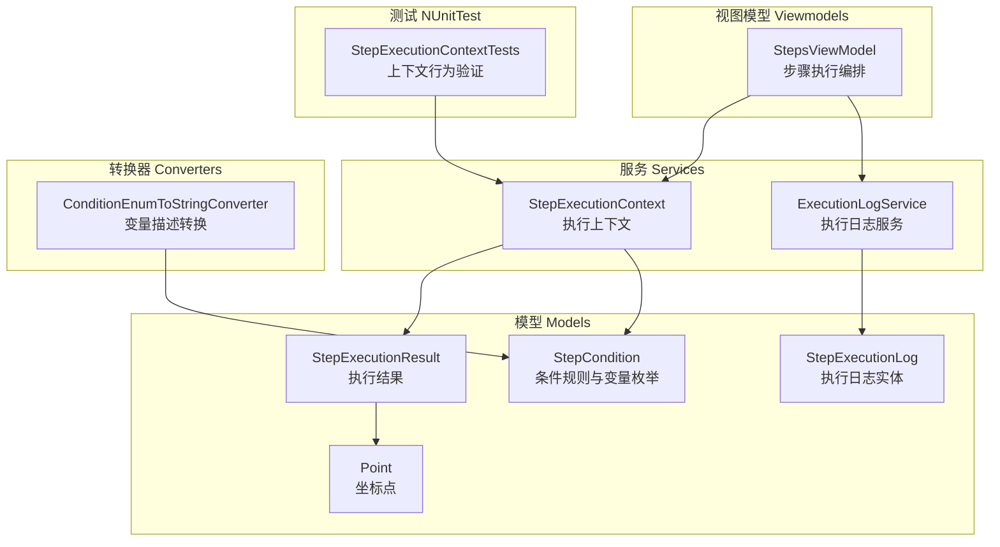
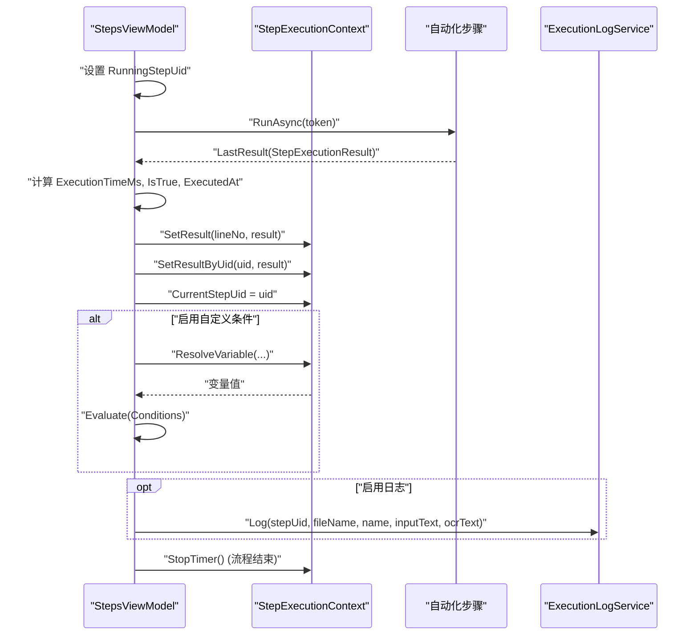
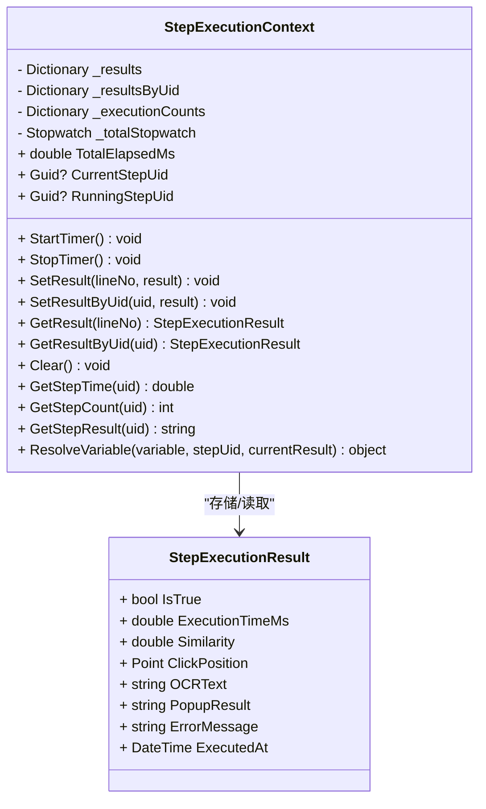
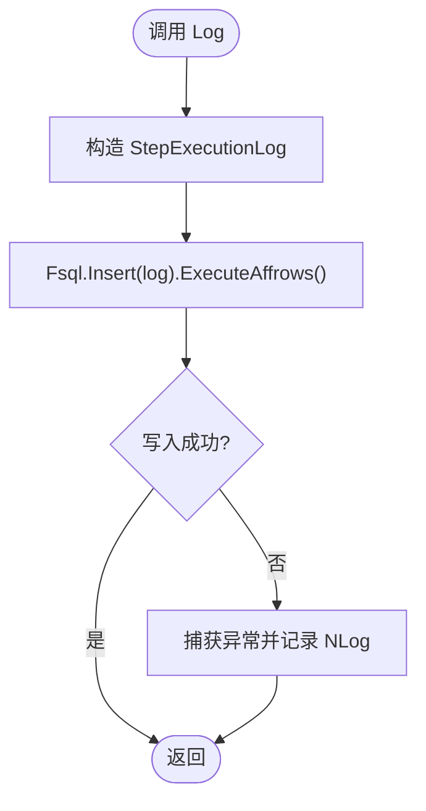
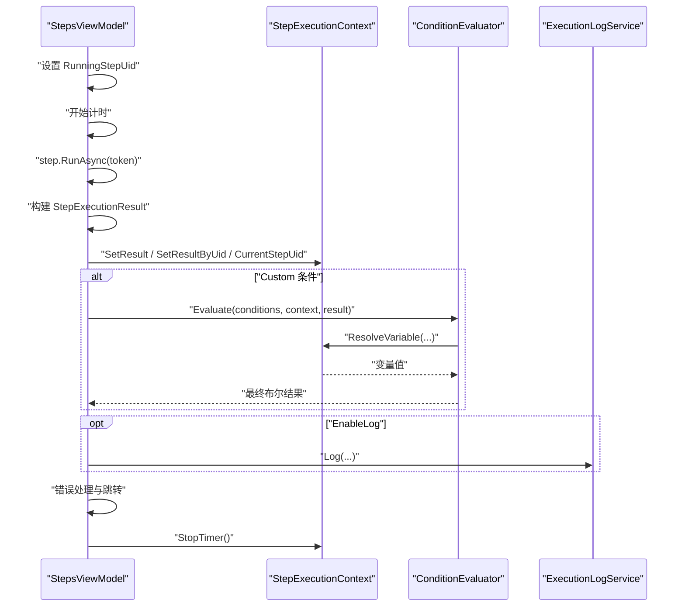
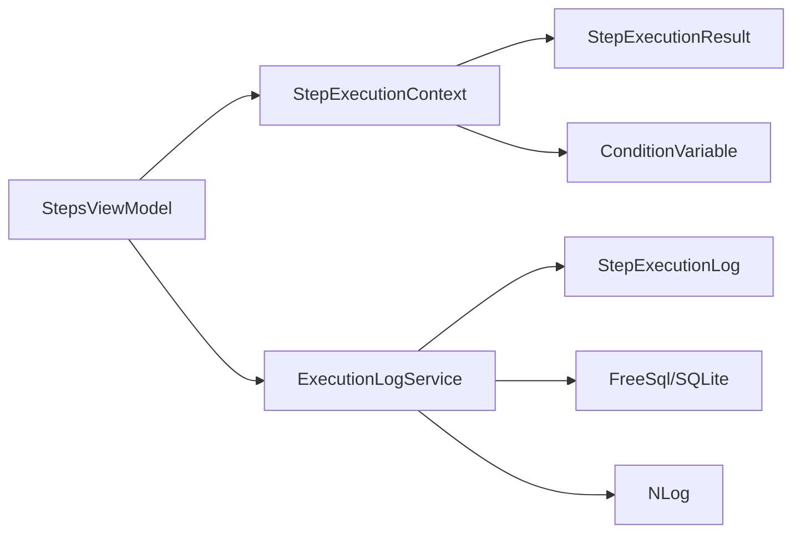

# 执行上下文管理

<cite>
**本文引用的文件**   
- [StepExecutionContext.cs](file://ShaoLu/Services/StepExecutionContext.cs)
- [StepExecutionResult.cs](file://ShaoLu/Models/StepExecutionResult.cs)
- [ExecutionLogService.cs](file://ShaoLu/Services/ExecutionLogService.cs)
- [StepExecutionLog.cs](file://ShaoLu/Models/StepExecutionLog.cs)
- [StepCondition.cs](file://ShaoLu/Models/StepCondition.cs)
- [StepsViewModel.cs](file://ShaoLu/Viewmodels/StepsViewModel.cs)
- [AutoguiModel.cs](file://ShaoLu/Models/AutoguiModel.cs)
- [ConditionEnumToStringConverter.cs](file://ShaoLu/Converters/ConditionEnumToStringConverter.cs)
- [StepExecutionContextTests.cs](file://NUnitTest/StepExecutionContextTests.cs)
</cite>

## 目录
1. [简介](#简介)
2. [项目结构](#项目结构)
3. [核心组件](#核心组件)
4. [架构总览](#架构总览)
5. [详细组件分析](#详细组件分析)
6. [依赖关系分析](#依赖关系分析)
7. [性能考虑](#性能考虑)
8. [故障排查指南](#故障排查指南)
9. [结论](#结论)
10. [附录](#附录)

## 简介
本文件面向 ShaoLu 应用的“执行上下文管理”主题，围绕 StepExecutionContext、StepExecutionResult、ExecutionLogService 等核心对象，系统阐述：
- 执行状态管理与变量作用域
- 数据传递机制（步骤间结果引用与条件解析）
- 执行日志服务（记录策略、持久化、查询与清理）
- 上下文生命周期（初始化、清理、资源释放）
- 并发安全与线程隔离（当前实现特性与建议）
- 扩展点与自定义状态管理指导

## 项目结构
与执行上下文相关的代码主要分布在 Services、Models、Viewmodels、Converters 以及单元测试中。下图给出与执行上下文相关的关键文件与职责概览。

图表来源
- [StepExecutionContext.cs:1-163](file://ShaoLu/Services/StepExecutionContext.cs#L1-L163)
- [StepExecutionResult.cs:1-51](file://ShaoLu/Models/StepExecutionResult.cs#L1-L51)
- [ExecutionLogService.cs:1-179](file://ShaoLu/Services/ExecutionLogService.cs#L1-L179)
- [StepExecutionLog.cs:1-47](file://ShaoLu/Models/StepExecutionLog.cs#L1-L47)
- [StepCondition.cs:1-200](file://ShaoLu/Models/StepCondition.cs#L1-L200)
- [StepsViewModel.cs:529-747](file://ShaoLu/Viewmodels/StepsViewModel.cs#L529-L747)
- [ConditionEnumToStringConverter.cs:150-169](file://ShaoLu/Converters/ConditionEnumToStringConverter.cs#L150-L169)
- [StepExecutionContextTests.cs:1-253](file://NUnitTest/StepExecutionContextTests.cs#L1-L253)

章节来源
- [StepExecutionContext.cs:1-163](file://ShaoLu/Services/StepExecutionContext.cs#L1-L163)
- [StepExecutionResult.cs:1-51](file://ShaoLu/Models/StepExecutionResult.cs#L1-L51)
- [ExecutionLogService.cs:1-179](file://ShaoLu/Services/ExecutionLogService.cs#L1-L179)
- [StepExecutionLog.cs:1-47](file://ShaoLu/Models/StepExecutionLog.cs#L1-L47)
- [StepCondition.cs:1-200](file://ShaoLu/Models/StepCondition.cs#L1-L200)
- [StepsViewModel.cs:529-747](file://ShaoLu/Viewmodels/StepsViewModel.cs#L529-L747)
- [ConditionEnumToStringConverter.cs:150-169](file://ShaoLu/Converters/ConditionEnumToStringConverter.cs#L150-L169)
- [StepExecutionContextTests.cs:1-253](file://NUnitTest/StepExecutionContextTests.cs#L1-L253)

## 核心组件
- StepExecutionContext：单例执行上下文，维护步骤执行结果、执行次数、最近执行步骤标识、总计时器，并提供变量解析能力。
- StepExecutionResult：单次步骤执行的结构化结果，包含成功标志、耗时、相似度、点击坐标、OCR文本、弹窗选择、错误信息、执行时间戳。
- ExecutionLogService：基于 FreeSql + SQLite 的执行日志服务，提供写入、分页查询、去重文件名列表、旧日志清理等能力。
- StepExecutionLog：日志持久化实体，映射到 step_execution_log 表。
- StepsViewModel：步骤执行编排器，负责设置 RunningStepUid、构建并保存结果到上下文、触发条件评估、调用日志服务。
- Point：坐标点模型，用于记录点击位置。
- ConditionVariable：条件变量枚举，定义 Self_* 与 Step_* 系列变量及常量。

章节来源
- [StepExecutionContext.cs:1-163](file://ShaoLu/Services/StepExecutionContext.cs#L1-L163)
- [StepExecutionResult.cs:1-51](file://ShaoLu/Models/StepExecutionResult.cs#L1-L51)
- [ExecutionLogService.cs:1-179](file://ShaoLu/Services/ExecutionLogService.cs#L1-L179)
- [StepExecutionLog.cs:1-47](file://ShaoLu/Models/StepExecutionLog.cs#L1-L47)
- [StepsViewModel.cs:529-747](file://ShaoLu/Viewmodels/StepsViewModel.cs#L529-L747)
- [AutoguiModel.cs:1-61](file://ShaoLu/Models/AutoguiModel.cs#L1-L61)
- [StepCondition.cs:1-200](file://ShaoLu/Models/StepCondition.cs#L1-L200)

## 架构总览
执行上下文贯穿“步骤执行—结果收集—条件判断—日志记录”的完整链路。StepsViewModel 驱动步骤运行，将结果写入 StepExecutionContext；条件评估通过 StepExecutionContext.ResolveVariable 解析变量值；日志由 ExecutionLogService 统一落库。

图表来源
- [StepsViewModel.cs:529-747](file://ShaoLu/Viewmodels/StepsViewModel.cs#L529-L747)
- [StepExecutionContext.cs:1-163](file://ShaoLu/Services/StepExecutionContext.cs#L1-L163)
- [ExecutionLogService.cs:1-179](file://ShaoLu/Services/ExecutionLogService.cs#L1-L179)

## 详细组件分析

### StepExecutionContext：执行上下文与变量解析
- 设计要点
  - 单例模式：Instance 属性提供全局访问。
  - 数据结构：按行号与 Uid 双索引存储 StepExecutionResult；同时维护每个 Uid 的执行次数。
  - 执行状态：TotalElapsedMs、CurrentStepUid、RunningStepUid 分别表示总耗时、刚刚完成的步骤、正在执行的步骤。
  - 生命周期：StartTimer/StopTimer/Clear 控制计时与重置。
  - 变量解析：ResolveVariable 支持常量、Self_*、Step_* 系列变量，以及 Step_Triggered 一次性触发语义。
- 复杂度与性能
  - SetResult/GetResult/SetResultByUid/GetResultByUid 为 O(1) 字典操作。
  - ResolveVariable 为常数时间分支判断。
  - Clear 为 O(n) 清空三个字典与重置计时器。
- 错误处理与边界
  - GetResult/GetResultByUid 对缺失键返回 null。
  - ResolveVariable 对空 currentResult 或不存在 stepUid 提供默认值（false/0/-1/空串）。
- 并发与线程隔离
  - 当前实现未加锁，适合单线程执行流；若未来引入多线程并行执行步骤，需增加同步保护（如 ConcurrentDictionary 或读写锁）。

图表来源
- [StepExecutionContext.cs:1-163](file://ShaoLu/Services/StepExecutionContext.cs#L1-L163)
- [StepExecutionResult.cs:1-51](file://ShaoLu/Models/StepExecutionResult.cs#L1-L51)

章节来源
- [StepExecutionContext.cs:1-163](file://ShaoLu/Services/StepExecutionContext.cs#L1-L163)
- [StepExecutionResult.cs:1-51](file://ShaoLu/Models/StepExecutionResult.cs#L1-L51)
- [StepExecutionContextTests.cs:1-253](file://NUnitTest/StepExecutionContextTests.cs#L1-L253)

### StepExecutionResult：执行结果模型
- 字段说明
  - IsTrue：是否成功
  - ExecutionTimeMs：毫秒级耗时
  - Similarity：图像识别相似度（-1 表示不适用）
  - ClickPosition：点击坐标（Point）
  - OCRText：OCR 识别文本
  - PopupResult：弹窗按钮选择结果
  - ErrorMessage：错误信息
  - ExecutedAt：执行时间戳
- 使用场景
  - 被 StepsViewModel 在每次步骤执行后填充并回写 LastResult。
  - 被 StepExecutionContext 以 lineNo 和 uid 两种方式索引保存，供后续条件解析与统计展示。

章节来源
- [StepExecutionResult.cs:1-51](file://ShaoLu/Models/StepExecutionResult.cs#L1-L51)
- [StepsViewModel.cs:529-747](file://ShaoLu/Viewmodels/StepsViewModel.cs#L529-L747)
- [AutoguiModel.cs:1-61](file://ShaoLu/Models/AutoguiModel.cs#L1-L61)

### ExecutionLogService：执行日志服务
- 设计与实现
  - 使用 FreeSql + SQLite 进行持久化，数据库路径位于用户 ApplicationData 下的 AutoShaoLu/execution_log.db。
  - Log：插入一条 StepExecutionLog 记录，异常时通过 NLog 记录错误。
  - Query/QueryCount：支持关键字搜索、文件名筛选、UID 筛选、时间范围、排序与分页。
  - GetDistinctFileNames：获取不重复的文件名列表，用于 UI 筛选。
  - CleanupOldLogs：按保留天数清理旧日志。
- 异步写入
  - 当前 Log 为同步写入；如需高吞吐可引入队列+后台写入线程，但需注意事务与一致性。
- 性能与可靠性
  - 使用 Lazy 初始化 IFreeSql，避免重复创建连接。
  - 自动同步结构 UseAutoSyncStructure(true)，便于迁移。
  - 异常捕获保证日志写入失败不影响主流程。

图表来源
- [ExecutionLogService.cs:1-179](file://ShaoLu/Services/ExecutionLogService.cs#L1-L179)
- [StepExecutionLog.cs:1-47](file://ShaoLu/Models/StepExecutionLog.cs#L1-L47)

章节来源
- [ExecutionLogService.cs:1-179](file://ShaoLu/Services/ExecutionLogService.cs#L1-L179)
- [StepExecutionLog.cs:1-47](file://ShaoLu/Models/StepExecutionLog.cs#L1-L47)

### StepsViewModel：执行编排与上下文交互
- 关键流程
  - 设置 RunningStepUid，启动计时，执行步骤 RunAsync。
  - 构建 StepExecutionResult（合并 LastResult），更新 IsTrue、ExecutionTimeMs、ExecutedAt。
  - 写入上下文：SetResult(lineNo)、SetResultByUid(uid)、设置 CurrentStepUid。
  - 条件评估：当启用 Custom 模式且存在条件时，调用 ConditionEvaluator.Evaluate，内部通过 StepExecutionContext.ResolveVariable 解析变量。
  - 日志记录：若 EnableLog，则调用 ExecutionLogService.Log。
  - 错误处理：捕获异常，推断 ErrorType，必要时弹出错误窗口，根据跳转配置决定继续或终止。
  - 流程结束：StopTimer，关闭统计窗口，恢复主窗口状态。

图表来源
- [StepsViewModel.cs:529-747](file://ShaoLu/Viewmodels/StepsViewModel.cs#L529-L747)
- [StepExecutionContext.cs:1-163](file://ShaoLu/Services/StepExecutionContext.cs#L1-L163)
- [ExecutionLogService.cs:1-179](file://ShaoLu/Services/ExecutionLogService.cs#L1-L179)

章节来源
- [StepsViewModel.cs:529-747](file://ShaoLu/Viewmodels/StepsViewModel.cs#L529-L747)

### 条件变量与作用域：ConditionVariable 与解析
- 变量分类
  - 常量：ConstantTrue、ConstantFalse
  - 当前步骤自身：Self_IsTrue、Self_Similarity、Self_ExecutionTimeMs、Self_ClickX/Y、Self_OCRText、Self_PopupResult
  - 引用其他步骤：Step_IsTrue、Step_Similarity、Step_ExecutionTimeMs、Step_ClickX/Y、Step_OCRText、Step_PopupResult、Step_Triggered
- 解析策略
  - Self_*：从传入的 currentResult 取值，空值提供默认。
  - Step_*：通过 stepUid 查找已保存的结果，不存在时提供默认。
  - Step_Triggered：仅当 stepUid 等于 CurrentStepUid 时为真（一次生效）。
- UI 展示
  - ConditionEnumToStringConverter 提供变量中文描述，便于界面提示。

章节来源
- [StepCondition.cs:1-200](file://ShaoLu/Models/StepCondition.cs#L1-L200)
- [StepExecutionContext.cs:105-160](file://ShaoLu/Services/StepExecutionContext.cs#L105-L160)
- [ConditionEnumToStringConverter.cs:150-169](file://ShaoLu/Converters/ConditionEnumToStringConverter.cs#L150-L169)

## 依赖关系分析
- 组件耦合
  - StepsViewModel 强依赖 StepExecutionContext 与 ExecutionLogService。
  - StepExecutionContext 依赖 StepExecutionResult 与 ConditionVariable。
  - ExecutionLogService 依赖 StepExecutionLog 与 FreeSql。
- 外部依赖
  - FreeSql + SQLite：日志持久化
  - NLog：错误日志记录
  - WPF 运行时：UI 交互（StepsViewModel 中涉及 UI 操作）

图表来源
- [StepsViewModel.cs:529-747](file://ShaoLu/Viewmodels/StepsViewModel.cs#L529-L747)
- [StepExecutionContext.cs:1-163](file://ShaoLu/Services/StepExecutionContext.cs#L1-L163)
- [ExecutionLogService.cs:1-179](file://ShaoLu/Services/ExecutionLogService.cs#L1-L179)

章节来源
- [StepsViewModel.cs:529-747](file://ShaoLu/Viewmodels/StepsViewModel.cs#L529-L747)
- [StepExecutionContext.cs:1-163](file://ShaoLu/Services/StepExecutionContext.cs#L1-L163)
- [ExecutionLogService.cs:1-179](file://ShaoLu/Services/ExecutionLogService.cs#L1-L179)

## 性能考虑
- 上下文存取
  - 使用字典 O(1) 存取，Clear 为 O(n)。建议批量写入时减少频繁 Clear。
- 计时
  - 使用 Stopwatch，注意 Start/Stop 成对调用，避免泄漏。
- 日志写入
  - 当前同步写入可能成为瓶颈，建议在高频场景下改为异步队列写入，并确保异常重试与幂等性。
- 内存占用
  - 长时间运行会累积大量 StepExecutionResult，可通过定期清理或限制最大条目数控制。

[本节为通用性能建议，不直接分析具体文件]

## 故障排查指南
- 常见问题
  - 变量解析结果为空：检查 currentResult 是否为空、stepUid 是否存在于上下文。
  - Step_Triggered 始终为假：确认 CurrentStepUid 是否正确设置，且仅在一步执行完成后有效。
  - 日志未写入：检查 ExecutionLogService 的数据库路径是否存在、权限是否足够；查看 NLog 的错误输出。
  - 执行中断：查看 StepsViewModel 中的异常捕获与错误类型推断，确认跳转目标是否存在。
- 调试建议
  - 使用 StepExecutionContextTests 覆盖用例验证变量解析逻辑。
  - 在 StepsViewModel 中打印 RunningStepUid、CurrentStepUid、ExecutionTimeMs 等关键指标。
  - 对 ExecutionLogService 的 Query/QueryCount 进行 SQL 层验证。

章节来源
- [StepExecutionContextTests.cs:1-253](file://NUnitTest/StepExecutionContextTests.cs#L1-L253)
- [StepsViewModel.cs:529-747](file://ShaoLu/Viewmodels/StepsViewModel.cs#L529-L747)
- [ExecutionLogService.cs:1-179](file://ShaoLu/Services/ExecutionLogService.cs#L1-L179)

## 结论
StepExecutionContext 提供了统一的执行状态与变量作用域管理能力，结合 StepExecutionResult 的结构化结果与 ExecutionLogService 的持久化能力，形成了完整的“执行—记录—查询—清理”闭环。当前实现适用于单线程执行流，具备清晰的扩展点（新增变量、自定义统计、日志策略），在并发与高吞吐场景下可按建议增强同步与异步写入能力。

[本节为总结性内容，不直接分析具体文件]

## 附录

### 上下文生命周期管理
- 初始化
  - Instance 首次访问时创建实例。
  - StartTimer 在流程开始时调用。
- 执行期
  - 每步执行后 SetResult/SetResultByUid，设置 CurrentStepUid。
  - 条件评估通过 ResolveVariable 解析变量。
- 清理与释放
  - Clear 清空所有结果、计数、计时器与状态。
  - StopTimer 停止计时。

章节来源
- [StepExecutionContext.cs:1-163](file://ShaoLu/Services/StepExecutionContext.cs#L1-L163)
- [StepsViewModel.cs:529-747](file://ShaoLu/Viewmodels/StepsViewModel.cs#L529-L747)

### 并发执行的安全机制与线程隔离
- 当前实现无锁，假设单线程顺序执行步骤。
- 若引入多线程并行执行，建议：
  - 使用线程安全的集合（ConcurrentDictionary）或读写锁保护共享状态。
  - 确保 CurrentStepUid 的原子更新与可见性。
  - 日志写入采用异步队列，避免阻塞主线程。

[本节为概念性建议，不直接分析具体文件]

### 扩展点与自定义状态管理
- 新增条件变量
  - 在 ConditionVariable 中添加新枚举项，并在 StepExecutionContext.ResolveVariable 中实现解析逻辑。
  - 在 UI 层（ConditionEnumToStringConverter）补充描述文本。
- 自定义统计
  - 在 StepsViewModel 中遍历 AutomationStepBases，对 StatisticsStep 调用 UpdateConditionCounts，可扩展更多统计维度。
- 日志策略
  - 在 ExecutionLogService 中扩展字段或表结构，保持向后兼容（UseAutoSyncStructure）。

章节来源
- [StepCondition.cs:1-200](file://ShaoLu/Models/StepCondition.cs#L1-L200)
- [StepExecutionContext.cs:105-160](file://ShaoLu/Services/StepExecutionContext.cs#L105-L160)
- [ConditionEnumToStringConverter.cs:150-169](file://ShaoLu/Converters/ConditionEnumToStringConverter.cs#L150-L169)
- [StepsViewModel.cs:529-747](file://ShaoLu/Viewmodels/StepsViewModel.cs#L529-L747)
- [ExecutionLogService.cs:1-179](file://ShaoLu/Services/ExecutionLogService.cs#L1-L179)