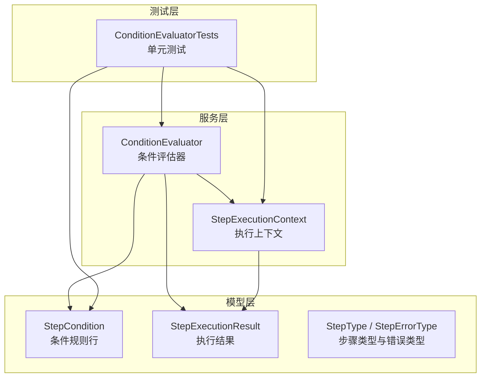
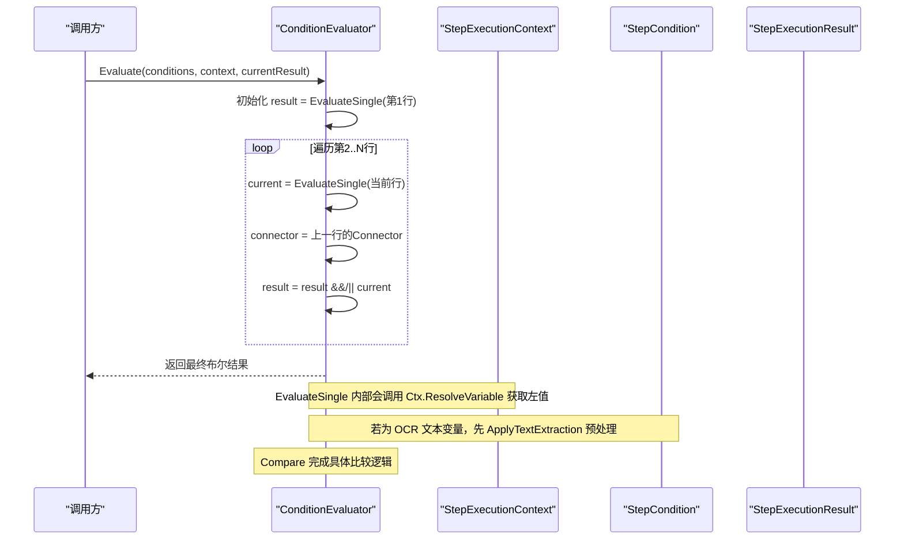
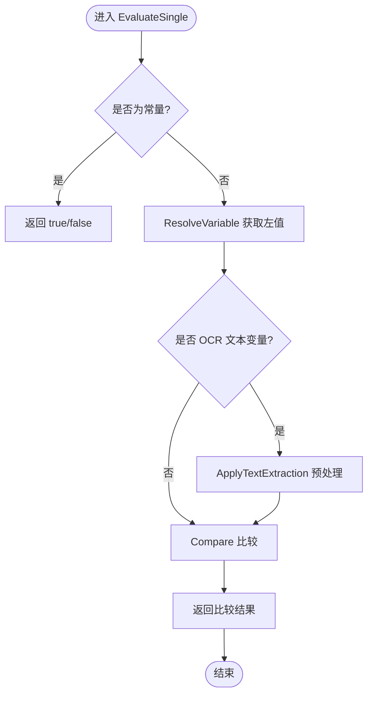
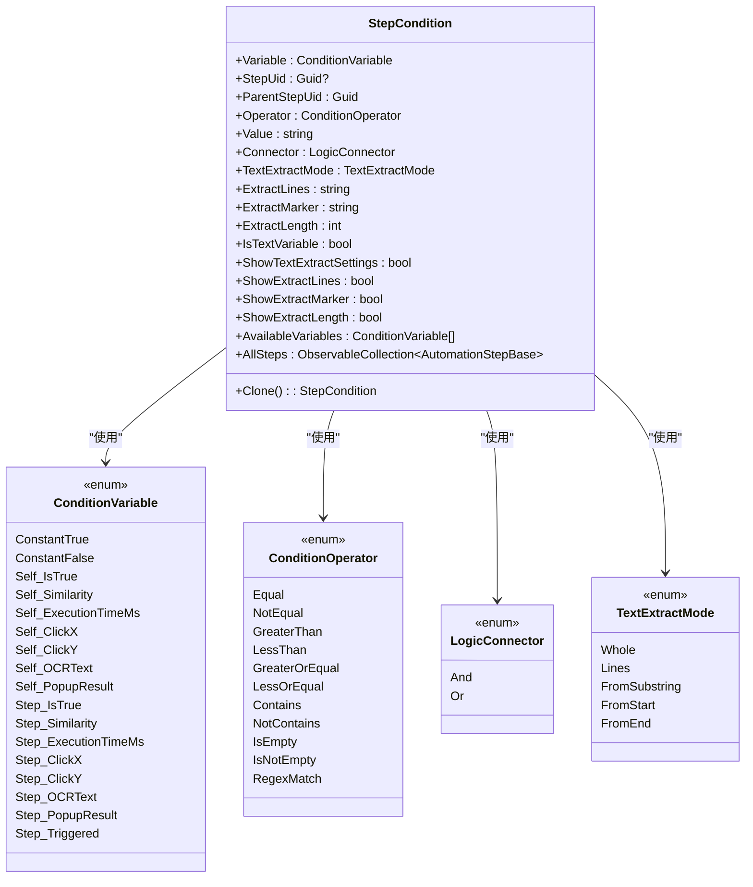
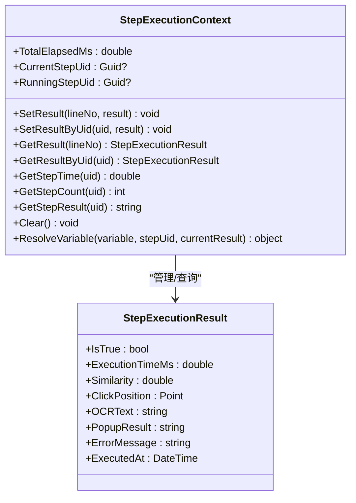
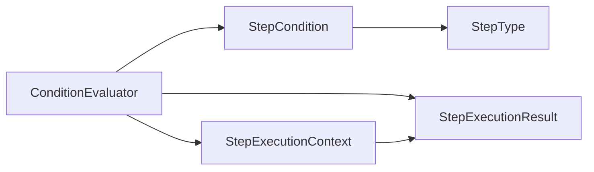

# 条件评估器

<cite>
**本文引用的文件**   
- [ConditionEvaluator.cs](file://ShaoLu/Services/ConditionEvaluator.cs)
- [StepCondition.cs](file://ShaoLu/Models/StepCondition.cs)
- [StepExecutionContext.cs](file://ShaoLu/Services/StepExecutionContext.cs)
- [StepExecutionResult.cs](file://ShaoLu/Models/StepExecutionResult.cs)
- [AutomationStepModel.cs](file://ShaoLu/Models/AutomationStepModel.cs)
- [ConditionEvaluatorTests.cs](file://NUnitTest/ConditionEvaluatorTests.cs)
</cite>

## 目录
1. [简介](#简介)
2. [项目结构](#项目结构)
3. [核心组件](#核心组件)
4. [架构总览](#架构总览)
5. [详细组件分析](#详细组件分析)
6. [依赖关系分析](#依赖关系分析)
7. [性能考量](#性能考量)
8. [故障排查指南](#故障排查指南)
9. [结论](#结论)
10. [附录](#附录)

## 简介
本文件为 ShaoLu 应用中的“条件评估器”提供系统化、可操作的技术文档。重点覆盖：
- ConditionEvaluator 服务的设计与实现，包括条件表达式解析机制、评估算法与性能优化策略
- StepCondition 模型的结构化说明，涵盖条件类型、操作符支持、值比较逻辑
- 条件模式（Default、Custom）及其组合方式（And、Or）的实现细节
- 条件与步骤的关联机制，包括优先级、短路求值、错误处理
- 自定义条件类型的扩展方法与表达式语言支持建议
- 条件调试与测试的工具与方法

## 项目结构
条件评估相关代码主要分布在 Services 与 Models 两个命名空间下，并通过单元测试进行验证：
- Services/ConditionEvaluator.cs：条件评估主逻辑
- Services/StepExecutionContext.cs：执行上下文与变量解析
- Models/StepCondition.cs：条件规则行模型
- Models/StepExecutionResult.cs：步骤执行结果数据载体
- Models/AutomationStepModel.cs：步骤类型等枚举定义
- NUnitTest/ConditionEvaluatorTests.cs：条件评估器的完整测试集

**图表来源** 
- [ConditionEvaluator.cs:1-294](file://ShaoLu/Services/ConditionEvaluator.cs#L1-L294)
- [StepExecutionContext.cs:1-163](file://ShaoLu/Services/StepExecutionContext.cs#L1-L163)
- [StepCondition.cs:1-405](file://ShaoLu/Models/StepCondition.cs#L1-L405)
- [StepExecutionResult.cs:1-51](file://ShaoLu/Models/StepExecutionResult.cs#L1-L51)
- [AutomationStepModel.cs:1-73](file://ShaoLu/Models/AutomationStepModel.cs#L1-L73)
- [ConditionEvaluatorTests.cs:1-662](file://NUnitTest/ConditionEvaluatorTests.cs#L1-L662)

**章节来源**
- [ConditionEvaluator.cs:1-294](file://ShaoLu/Services/ConditionEvaluator.cs#L1-L294)
- [StepCondition.cs:1-405](file://ShaoLu/Models/StepCondition.cs#L1-L405)
- [StepExecutionContext.cs:1-163](file://ShaoLu/Services/StepExecutionContext.cs#L1-L163)
- [StepExecutionResult.cs:1-51](file://ShaoLu/Models/StepExecutionResult.cs#L1-L51)
- [AutomationStepModel.cs:1-73](file://ShaoLu/Models/AutomationStepModel.cs#L1-L73)
- [ConditionEvaluatorTests.cs:1-662](file://NUnitTest/ConditionEvaluatorTests.cs#L1-L662)

## 核心组件
- ConditionEvaluator：静态类，负责将一组 StepCondition 规则行按 And/Or 连接器组合并返回最终布尔结果；内部包含单行评估、文本提取、多类型比较与正则匹配等能力。
- StepCondition：描述一条条件规则行的数据结构，包含变量、运算符、值、连接器以及 OCR 文本提取设置。
- StepExecutionContext：维护所有步骤的执行结果、统计信息，并提供 ResolveVariable 方法以根据变量名解析实际值。
- StepExecutionResult：承载单次步骤执行的结果（是否成功、耗时、相似度、点击坐标、OCR 文本、弹窗结果等）。
- AutomationStepModel：定义 StepType、StepErrorType 等枚举，用于 UI 与业务逻辑的类型标识。

**章节来源**
- [ConditionEvaluator.cs:1-294](file://ShaoLu/Services/ConditionEvaluator.cs#L1-L294)
- [StepCondition.cs:1-405](file://ShaoLu/Models/StepCondition.cs#L1-L405)
- [StepExecutionContext.cs:1-163](file://ShaoLu/Services/StepExecutionContext.cs#L1-L163)
- [StepExecutionResult.cs:1-51](file://ShaoLu/Models/StepExecutionResult.cs#L1-L51)
- [AutomationStepModel.cs:1-73](file://ShaoLu/Models/AutomationStepModel.cs#L1-L73)

## 架构总览
条件评估的整体流程如下：
- 入口 Evaluate(conditions, context, currentResult)
- 对第一行调用 EvaluateSingle 得到初始结果
- 从第二行开始，逐行 EvaluateSingle，并根据上一行的 Connector（And/Or）合并结果
- EvaluateSingle 中通过 context.ResolveVariable 获取左值，必要时进行 OCR 文本预处理，再调用 Compare 完成比较
- Compare 支持空检查、正则匹配、布尔/数字/字符串比较，并对异常进行安全降级

**图表来源** 
- [ConditionEvaluator.cs:23-51](file://ShaoLu/Services/ConditionEvaluator.cs#L23-L51)
- [ConditionEvaluator.cs:56-83](file://ShaoLu/Services/ConditionEvaluator.cs#L56-L83)
- [StepExecutionContext.cs:112-160](file://ShaoLu/Services/StepExecutionContext.cs#L112-L160)

**章节来源**
- [ConditionEvaluator.cs:23-51](file://ShaoLu/Services/ConditionEvaluator.cs#L23-L51)
- [ConditionEvaluator.cs:56-83](file://ShaoLu/Services/ConditionEvaluator.cs#L56-L83)
- [StepExecutionContext.cs:112-160](file://ShaoLu/Services/StepExecutionContext.cs#L112-L160)

## 详细组件分析

### ConditionEvaluator 服务设计与实现
- 评估入口 Evaluate：
  - 空条件或 null 时直接返回 currentResult?.IsTrue ?? false
  - 首行作为初始结果，后续行按 Connector 合并
- 单行评估 EvaluateSingle：
  - 常量变量直接返回 true/false
  - 通过 context.ResolveVariable 解析变量值
  - 若为 OCR 文本变量，使用 ApplyTextExtraction 进行预处理
  - 调用 Compare 完成比较，异常捕获后记录日志并返回 false
- 比较逻辑 Compare：
  - IsEmpty/IsNotEmpty：无需右值
  - 正则匹配 RegexMatch：对右值作为正则模式进行匹配
  - 布尔比较：支持 true/false 及 "1"/"0" 字符串
  - 数字比较：支持 int/double/float/long/decimal，数值相等采用容差比较
  - 字符串比较：Equal/NotEqual/Contains/NotContains，大小写不敏感；当字符串可解析为数字时，也支持数值比较
- 文本提取 ApplyTextExtraction：
  - Whole：不提取
  - Lines：按行号或区间提取，支持 "1,3,5-8" 格式，结果用换行拼接
  - FromSubstring：从子串首次出现位置之后读取指定长度（0=到末尾）
  - FromStart/FromEnd：从开头或末尾截取指定长度
- 辅助方法：
  - IsNumeric：识别多种数值类型
  - ParseBool：解析布尔字符串，兼容 "1"/"0"

**图表来源** 
- [ConditionEvaluator.cs:56-83](file://ShaoLu/Services/ConditionEvaluator.cs#L56-L83)
- [ConditionEvaluator.cs:177-207](file://ShaoLu/Services/ConditionEvaluator.cs#L177-L207)
- [ConditionEvaluator.cs:88-164](file://ShaoLu/Services/ConditionEvaluator.cs#L88-L164)

**章节来源**
- [ConditionEvaluator.cs:23-51](file://ShaoLu/Services/ConditionEvaluator.cs#L23-L51)
- [ConditionEvaluator.cs:56-83](file://ShaoLu/Services/ConditionEvaluator.cs#L56-L83)
- [ConditionEvaluator.cs:88-164](file://ShaoLu/Services/ConditionEvaluator.cs#L88-L164)
- [ConditionEvaluator.cs:177-207](file://ShaoLu/Services/ConditionEvaluator.cs#L177-L207)

### StepCondition 模型结构与行为
- 条件变量 ConditionVariable：
  - 常量：ConstantTrue、ConstantFalse
  - 当前步骤 Self_*：IsTrue、Similarity、ExecutionTimeMs、ClickX/Y、OCRText、PopupResult
  - 引用其他步骤 Step_*：同上字段，外加 Step_Triggered（仅在上一步刚执行完成时为真）
- 运算符 ConditionOperator：
  - Equal、NotEqual、GreaterThan、LessThan、GreaterOrEqual、LessOrEqual
  - Contains、NotContains
  - IsEmpty、IsNotEmpty
  - RegexMatch（右值为正则模式）
- 连接器 LogicConnector：And、Or
- 文本提取 TextExtractMode：Whole、Lines、FromSubstring、FromStart、FromEnd
- 属性与可见性控制：
  - IsTextVariable：判断是否为 OCR 文本变量
  - ShowTextExtractSettings、ShowExtractLines、ShowExtractMarker、ShowExtractLength：根据变量与提取模式动态显示 UI 控件
  - AvailableVariables：根据目标步骤类型返回可用的变量列表
  - AllSteps：供 UI 绑定选择引用步骤

**图表来源** 
- [StepCondition.cs:103-403](file://ShaoLu/Models/StepCondition.cs#L103-L403)
- [StepCondition.cs:28-98](file://ShaoLu/Models/StepCondition.cs#L28-L98)

**章节来源**
- [StepCondition.cs:103-403](file://ShaoLu/Models/StepCondition.cs#L103-L403)
- [StepCondition.cs:28-98](file://ShaoLu/Models/StepCondition.cs#L28-L98)

### StepExecutionContext 执行上下文与变量解析
- 存储所有步骤执行结果（按行号与 Uid），并维护执行次数统计
- CurrentStepUid：最近一次执行完成的步骤 Uid，用于 Step_Triggered 变量
- ResolveVariable：根据变量名解析实际值，支持常量、当前步骤、引用步骤等多种场景
- 工具方法：GetStepTime、GetStepCount、GetStepResult、Clear 等

**图表来源** 
- [StepExecutionContext.cs:11-160](file://ShaoLu/Services/StepExecutionContext.cs#L11-L160)
- [StepExecutionResult.cs:8-49](file://ShaoLu/Models/StepExecutionResult.cs#L8-L49)

**章节来源**
- [StepExecutionContext.cs:11-160](file://ShaoLu/Services/StepExecutionContext.cs#L11-L160)
- [StepExecutionResult.cs:8-49](file://ShaoLu/Models/StepExecutionResult.cs#L8-L49)

### 条件模式与组合方式
- 条件模式 ConditionMode：
  - Default：使用步骤自身的执行结果（如 IsTrue）
  - Custom：使用用户配置的规则行进行判断
- 组合方式：
  - 每行条件通过 Connector 与下一行组合（And/Or）
  - 评估顺序从左到右，按行顺序依次合并结果
  - 短路求值：AND 遇到 false 可提前终止；OR 遇到 true 可提前终止（当前实现为顺序合并，可在性能优化中引入短路）

**章节来源**
- [StepCondition.cs:12-23](file://ShaoLu/Models/StepCondition.cs#L12-L23)
- [ConditionEvaluator.cs:23-51](file://ShaoLu/Services/ConditionEvaluator.cs#L23-L51)

### 条件与步骤的关联机制
- 变量来源：
  - 当前步骤：Self_* 系列变量来自 currentResult
  - 其他步骤：Step_* 系列变量通过 StepUid 在上下文中查找对应执行结果
  - Step_Triggered：仅当引用步骤是当前刚刚执行完成的步骤时为真
- 优先级：
  - 常量优先于变量解析
  - 文本提取在 OCR 文本变量比较前执行
- 错误处理：
  - EvaluateSingle 捕获异常并记录警告，返回 false
  - 正则表达式非法模式时记录警告并返回 false
  - 缺失步骤引用时默认返回 false（布尔）或空字符串（文本）

**章节来源**
- [StepExecutionContext.cs:112-160](file://ShaoLu/Services/StepExecutionContext.cs#L112-L160)
- [ConditionEvaluator.cs:56-83](file://ShaoLu/Services/ConditionEvaluator.cs#L56-L83)
- [ConditionEvaluator.cs:106-118](file://ShaoLu/Services/ConditionEvaluator.cs#L106-L118)

### 自定义条件类型的扩展方法与表达式语言支持
- 扩展点建议：
  - 在 Compare 中新增自定义操作符分支
  - 在 ResolveVariable 中新增自定义变量解析逻辑
  - 在 ApplyTextExtraction 中新增文本预处理模式
- 表达式语言支持建议：
  - 引入轻量级表达式解析器（如 NCalc、Jint）
  - 将 StepCondition.Value 作为表达式模板，结合上下文变量替换
  - 保持向后兼容：仍支持现有字符串比较与正则匹配

[本节为概念性扩展建议，不直接分析具体文件]

### 条件调试与测试工具和方法
- 单元测试覆盖：
  - 空条件与默认行为
  - 常量条件
  - 布尔、数字、字符串比较
  - IsEmpty/IsNotEmpty
  - AND/OR 组合
  - 引用其他步骤
  - Null 值处理
  - OCR 文本提取（Lines、FromSubstring、FromStart、FromEnd）
- 调试建议：
  - 利用 NLog 输出条件评估失败与正则错误的警告日志
  - 在 ResolveVariable 与 Compare 中加入断点，观察中间值
  - 使用 ApplyTextExtraction 单独验证文本提取结果

**章节来源**
- [ConditionEvaluatorTests.cs:1-662](file://NUnitTest/ConditionEvaluatorTests.cs#L1-L662)
- [ConditionEvaluator.cs:78-83](file://ShaoLu/Services/ConditionEvaluator.cs#L78-L83)
- [ConditionEvaluator.cs:106-118](file://ShaoLu/Services/ConditionEvaluator.cs#L106-L118)

## 依赖关系分析
- ConditionEvaluator 依赖：
  - StepCondition：条件规则行定义
  - StepExecutionContext：变量解析与执行结果访问
  - StepExecutionResult：当前步骤执行结果
  - NLog：日志记录
- StepExecutionContext 依赖：
  - StepExecutionResult：存储与查询执行结果
- StepCondition 依赖：
  - AutomationStepBase（通过 SingletonLocator）：UI 绑定与可用变量计算
  - StepType：决定可用变量集合

**图表来源** 
- [ConditionEvaluator.cs:1-294](file://ShaoLu/Services/ConditionEvaluator.cs#L1-L294)
- [StepExecutionContext.cs:1-163](file://ShaoLu/Services/StepExecutionContext.cs#L1-L163)
- [StepCondition.cs:1-405](file://ShaoLu/Models/StepCondition.cs#L1-L405)
- [AutomationStepModel.cs:1-73](file://ShaoLu/Models/AutomationStepModel.cs#L1-L73)

**章节来源**
- [ConditionEvaluator.cs:1-294](file://ShaoLu/Services/ConditionEvaluator.cs#L1-L294)
- [StepExecutionContext.cs:1-163](file://ShaoLu/Services/StepExecutionContext.cs#L1-L163)
- [StepCondition.cs:1-405](file://ShaoLu/Models/StepCondition.cs#L1-L405)
- [AutomationStepModel.cs:1-73](file://ShaoLu/Models/AutomationStepModel.cs#L1-L73)

## 性能考量
- 时间复杂度：
  - Evaluate：O(N)，N 为条件行数
  - EvaluateSingle：常数时间（变量解析与比较）
  - ApplyTextExtraction：O(L)，L 为文本长度（Lines 模式涉及分割与拼接）
- 内存占用：
  - 上下文字典存储所有步骤执行结果，随步骤数量线性增长
  - 文本提取可能产生新字符串对象
- 优化建议：
  - 引入短路求值：AND 遇到 false、OR 遇到 true 时提前终止循环
  - 缓存正则编译结果，避免重复编译
  - 对频繁使用的文本提取模式进行预编译或缓存
  - 减少不必要的字符串转换与装箱拆箱

[本节为通用性能讨论，不直接分析具体文件]

## 故障排查指南
- 常见问题定位：
  - 条件评估失败：查看 NLog 警告日志，确认变量解析与比较逻辑
  - 正则表达式无效：检查 Value 字段是否为合法正则模式
  - 文本提取异常：检查 ExtractLines、ExtractMarker、ExtractLength 配置是否正确
  - 步骤引用不存在：确认 StepUid 是否存在且已执行
- 调试步骤：
  - 在 EvaluateSingle 与 Compare 处设置断点，观察 leftValue、operator、right
  - 使用 ApplyTextExtraction 单独验证文本提取结果
  - 通过单元测试复现问题，逐步缩小范围

**章节来源**
- [ConditionEvaluator.cs:78-83](file://ShaoLu/Services/ConditionEvaluator.cs#L78-L83)
- [ConditionEvaluator.cs:106-118](file://ShaoLu/Services/ConditionEvaluator.cs#L106-L118)
- [ConditionEvaluator.cs:177-207](file://ShaoLu/Services/ConditionEvaluator.cs#L177-L207)

## 结论
ShaoLu 的条件评估器以简洁清晰的架构实现了灵活的条件判断能力：
- 通过 StepCondition 模型表达复杂条件规则
- 借助 StepExecutionContext 统一管理与解析变量
- 在 ConditionEvaluator 中实现高效、安全的评估逻辑
- 完善的单元测试保障功能正确性与稳定性
未来可通过短路求值、正则缓存、表达式语言扩展等方式进一步提升性能与表达能力。

[本节为总结性内容，不直接分析具体文件]

## 附录
- 支持的步骤类型（部分）：ClickImage、TypeText、FindImage、Popup、GetInput、MouseAction、Statistics 等
- 支持的错误类型：ImageNotFound、TextEmpty、OCRError、Unknown 等

**章节来源**
- [AutomationStepModel.cs:9-43](file://ShaoLu/Models/AutomationStepModel.cs#L9-L43)