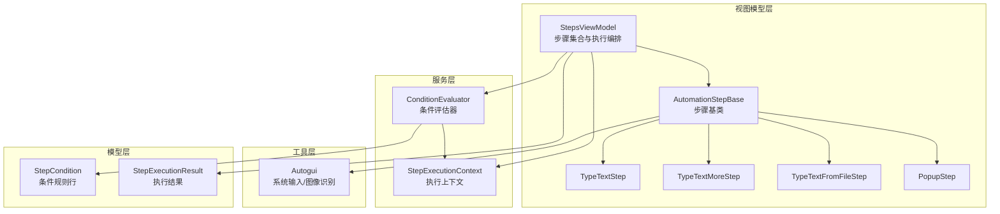
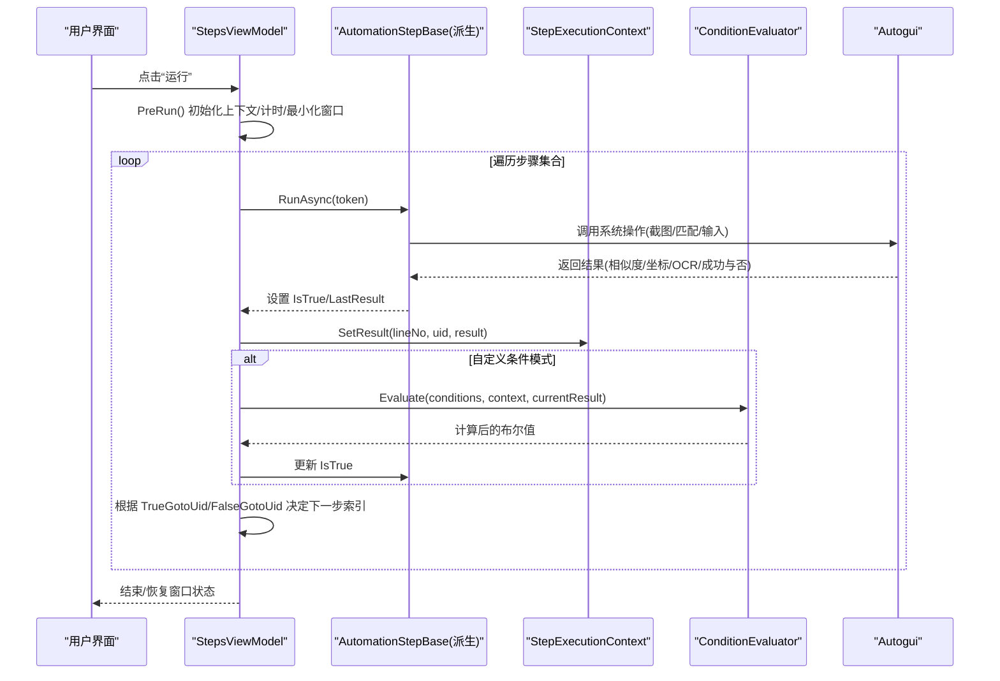
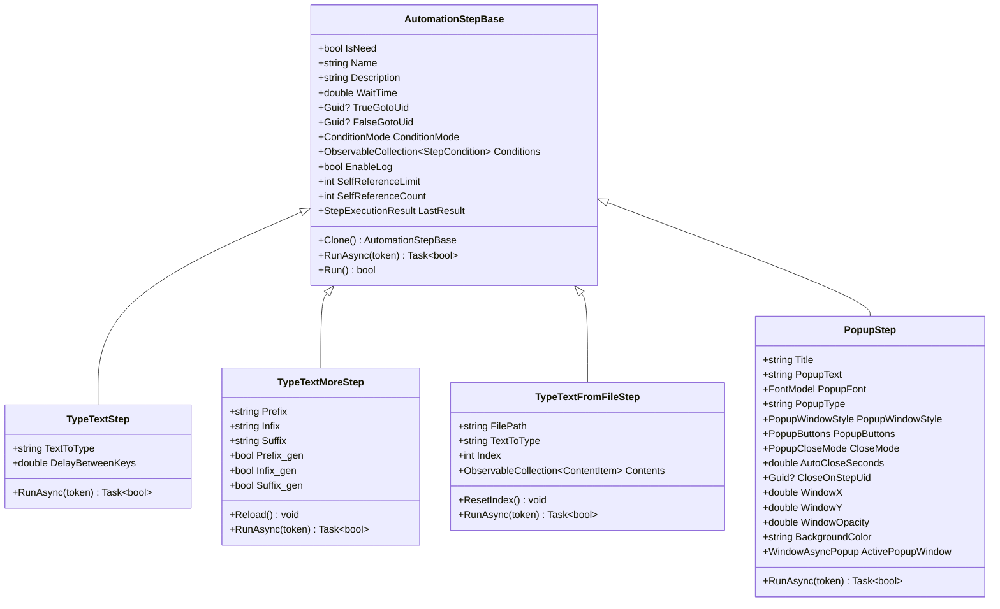
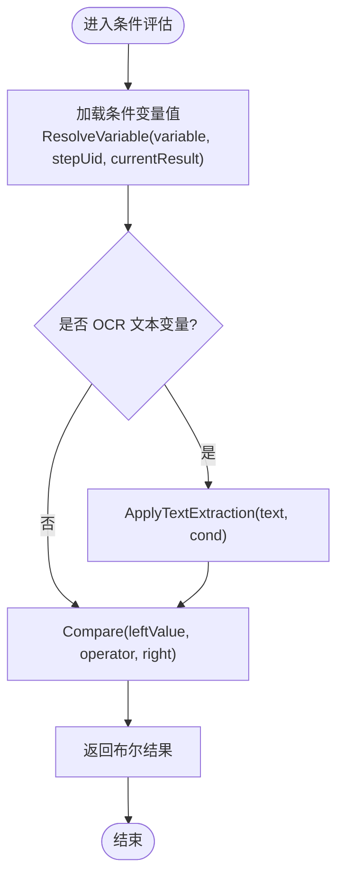
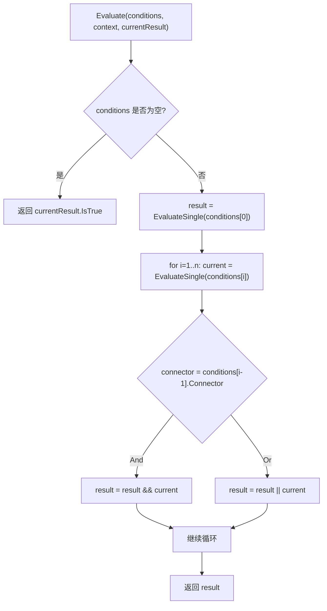
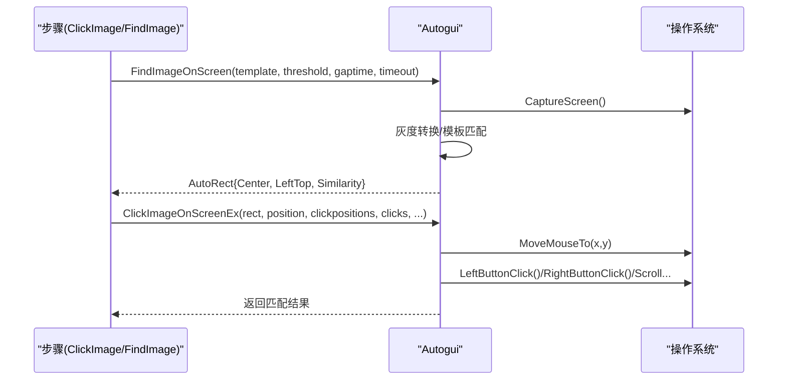
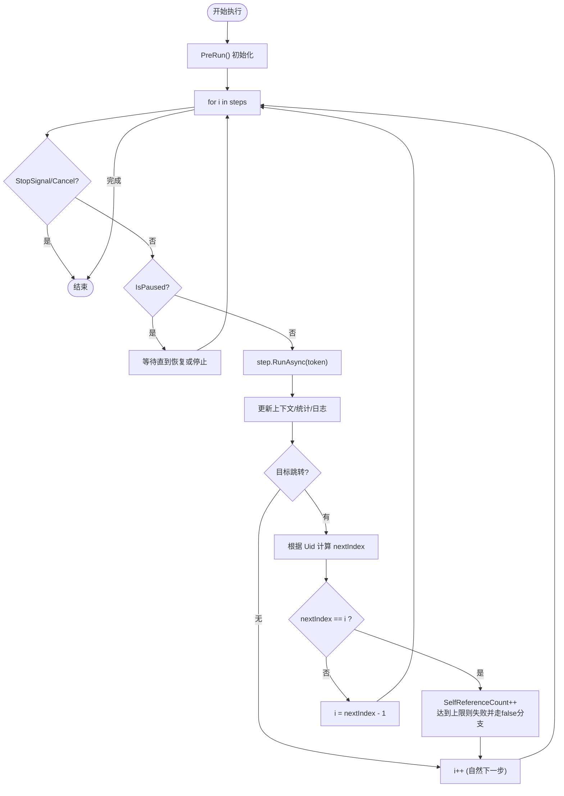
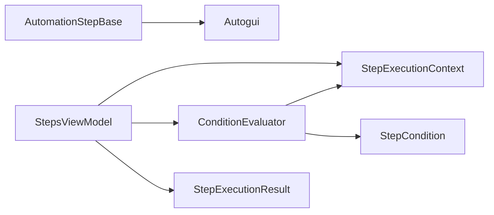

# 核心组件架构

<cite>
**本文引用的文件**
- [Readme.md](file://Readme.md)
- [AutomationStep.cs](file://ShaoLu/Viewmodels/AutomationStep.cs)
- [StepsViewModel.cs](file://ShaoLu/Viewmodels/StepsViewModel.cs)
- [ConditionEvaluator.cs](file://ShaoLu/Services/ConditionEvaluator.cs)
- [StepExecutionContext.cs](file://ShaoLu/Services/StepExecutionContext.cs)
- [Autogui.cs](file://ShaoLu/Utils/Autogui.cs)
- [StepCondition.cs](file://ShaoLu/Models/StepCondition.cs)
- [StepExecutionResult.cs](file://ShaoLu/Models/StepExecutionResult.cs)
</cite>

## 目录
1. [引言](#引言)
2. [项目结构](#项目结构)
3. [核心组件](#核心组件)
4. [架构总览](#架构总览)
5. [详细组件分析](#详细组件分析)
6. [依赖关系分析](#依赖关系分析)
7. [性能考量](#性能考量)
8. [故障排查指南](#故障排查指南)
9. [结论](#结论)
10. [附录](#附录)

## 引言
本文件面向 ShaoLu 应用的核心组件架构，聚焦自动化步骤引擎的设计与实现。内容涵盖：
- AutomationStepBase 基类设计、步骤执行生命周期管理、上下文环境维护
- 条件评估器的工作原理、表达式解析机制、复杂条件的组合方式
- Autogui 工具类的系统级操作封装、屏幕截图与图像匹配集成
- 组件间通信机制、事件处理模式、扩展新步骤类型的方法
- 异步执行模型、错误处理策略与性能优化方案

## 项目结构
ShaoLu 采用 WPF + MVVM 架构，核心模块按职责划分：
- Viewmodels：步骤定义与执行编排（AutomationStep 系列、StepsViewModel）
- Services：执行上下文与条件评估（StepExecutionContext、ConditionEvaluator）
- Utils：系统级交互与图像识别（Autogui）
- Models：数据模型（StepCondition、StepExecutionResult）

图表来源
- [StepsViewModel.cs:130-747](file://ShaoLu/Viewmodels/StepsViewModel.cs#L130-L747)
- [AutomationStep.cs:25-296](file://ShaoLu/Viewmodels/AutomationStep.cs#L25-L296)
- [ConditionEvaluator.cs:1-294](file://ShaoLu/Services/ConditionEvaluator.cs#L1-L294)
- [StepExecutionContext.cs:1-163](file://ShaoLu/Services/StepExecutionContext.cs#L1-L163)
- [Autogui.cs:1-656](file://ShaoLu/Utils/Autogui.cs#L1-L656)
- [StepCondition.cs:1-405](file://ShaoLu/Models/StepCondition.cs#L1-L405)
- [StepExecutionResult.cs:1-51](file://ShaoLu/Models/StepExecutionResult.cs#L1-L51)

章节来源
- [Readme.md:1-283](file://Readme.md#L1-L283)

## 核心组件
- 步骤基类与具体步骤：统一抽象 RunAsync 生命周期，提供通用属性（名称、描述、等待时间、跳转 Uid、条件模式等），并维护执行结果 LastResult。
- 执行上下文：集中存储步骤执行结果、统计信息、当前运行步骤标识，并提供变量解析能力供条件评估使用。
- 条件评估器：支持多行条件 AND/OR 组合、文本提取预处理、正则匹配、数值/字符串/布尔比较。
- Autogui：封装屏幕截图、模板匹配、鼠标/键盘模拟、剪贴板粘贴、字符串递增等系统级操作。
- 执行编排：StepsViewModel 负责步骤集合管理、顺序执行、暂停/停止、异常处理、跳转控制、自引用限制、弹窗关闭时机等。

章节来源
- [AutomationStep.cs:25-296](file://ShaoLu/Viewmodels/AutomationStep.cs#L25-L296)
- [StepExecutionContext.cs:1-163](file://ShaoLu/Services/StepExecutionContext.cs#L1-L163)
- [ConditionEvaluator.cs:1-294](file://ShaoLu/Services/ConditionEvaluator.cs#L1-L294)
- [Autogui.cs:1-656](file://ShaoLu/Utils/Autogui.cs#L1-L656)
- [StepsViewModel.cs:442-694](file://ShaoLu/Viewmodels/StepsViewModel.cs#L442-L694)

## 架构总览
下图展示从 UI 触发到步骤执行、条件判断、系统交互的完整流程。

图表来源
- [StepsViewModel.cs:493-694](file://ShaoLu/Viewmodels/StepsViewModel.cs#L493-L694)
- [AutomationStep.cs:290-296](file://ShaoLu/Viewmodels/AutomationStep.cs#L290-L296)
- [ConditionEvaluator.cs:23-51](file://ShaoLu/Services/ConditionEvaluator.cs#L23-L51)
- [StepExecutionContext.cs:39-82](file://ShaoLu/Services/StepExecutionContext.cs#L39-L82)
- [Autogui.cs:59-122](file://ShaoLu/Utils/Autogui.cs#L59-L122)

## 详细组件分析

### 步骤基类与执行生命周期
- 基类职责：
  - 统一属性：IsNeed、Name、Description、WaitTime、TrueGotoUid、FalseGotoUid、ConditionMode、Conditions、EnableLog、SelfReferenceLimit、SelfReferenceCount、LastResult 等
  - 生命周期：RunAsync 由派生类实现具体逻辑；Run() 为同步包装
  - 克隆：Clone() 用于复制步骤配置
- 派生步骤示例：
  - TypeTextStep：按键间隔小于阈值时使用安全粘贴模式，否则逐键输入
  - TypeTextMoreStep：前缀/中间/后缀三段拼接，支持自动递增
  - TypeTextFromFileStep：从 txt/csv/xlsx 读取列表，逐行输入并维护 Index
  - PopupStep：弹出窗口，支持多种关闭模式（按钮点击/超时/到达指定步骤）

图表来源
- [AutomationStep.cs:25-296](file://ShaoLu/Viewmodels/AutomationStep.cs#L25-L296)
- [AutomationStep.cs:300-365](file://ShaoLu/Viewmodels/AutomationStep.cs#L300-L365)
- [AutomationStep.cs:367-516](file://ShaoLu/Viewmodels/AutomationStep.cs#L367-L516)
- [AutomationStep.cs:518-680](file://ShaoLu/Viewmodels/AutomationStep.cs#L518-L680)
- [AutomationStep.cs:684-800](file://ShaoLu/Viewmodels/AutomationStep.cs#L684-L800)

章节来源
- [AutomationStep.cs:25-296](file://ShaoLu/Viewmodels/AutomationStep.cs#L25-L296)
- [AutomationStep.cs:300-365](file://ShaoLu/Viewmodels/AutomationStep.cs#L300-L365)
- [AutomationStep.cs:367-516](file://ShaoLu/Viewmodels/AutomationStep.cs#L367-L516)
- [AutomationStep.cs:518-680](file://ShaoLu/Viewmodels/AutomationStep.cs#L518-L680)
- [AutomationStep.cs:684-800](file://ShaoLu/Viewmodels/AutomationStep.cs#L684-L800)

### 执行上下文与变量解析
- 上下文职责：
  - 存储每个步骤的执行结果（按行号与 Uid 双索引）
  - 记录当前正在执行的步骤 Uid、最近完成的步骤 Uid
  - 提供 ResolveVariable 将条件变量解析为实际值（常量、自身、其他步骤、Triggered 标记）
- 关键方法：
  - SetResult/SetResultByUid：写入执行结果
  - GetResult/GetResultByUid：读取执行结果
  - Clear：每次运行前清空上下文
  - StartTimer/StopTimer：总耗时统计
  - ResolveVariable：支持 OCRText、PopupResult、ClickPosition、ExecutionTimeMs、Similarity 等字段

图表来源
- [StepExecutionContext.cs:112-160](file://ShaoLu/Services/StepExecutionContext.cs#L112-L160)
- [ConditionEvaluator.cs:56-83](file://ShaoLu/Services/ConditionEvaluator.cs#L56-L83)
- [ConditionEvaluator.cs:177-207](file://ShaoLu/Services/ConditionEvaluator.cs#L177-L207)

章节来源
- [StepExecutionContext.cs:1-163](file://ShaoLu/Services/StepExecutionContext.cs#L1-L163)
- [ConditionEvaluator.cs:1-294](file://ShaoLu/Services/ConditionEvaluator.cs#L1-L294)

### 条件评估器与表达式解析
- 多行条件组合：
  - 第一行作为初始结果，后续行通过 Connector（And/Or）与前一行结果组合
- 变量类型：
  - 常量（ConstantTrue/ConstantFalse）
  - 当前步骤自身（Self_*）
  - 引用其他步骤（Step_*，通过 StepUid 定位）
  - Triggered：仅当该步骤在本次评估前刚刚被执行时为真
- 文本提取：
  - Lines：按行号或区间提取（如 1,3,5-8）
  - FromSubstring：从子串首次出现位置后读取指定长度
  - FromStart/FromEnd：从开头或末尾截取固定长度
- 比较运算符：
  - 数字：Equal/NotEqual/GreaterThan/LessThan/GreaterOrEqual/LessOrEqual
  - 字符串：Equal/NotEqual/Contains/NotContains，以及尝试数字比较
  - 布尔：Equal/NotEqual
  - 空检查：IsEmpty/IsNotEmpty
  - 正则：RegexMatch（右值为正则模式）

图表来源
- [ConditionEvaluator.cs:23-51](file://ShaoLu/Services/ConditionEvaluator.cs#L23-L51)
- [ConditionEvaluator.cs:88-164](file://ShaoLu/Services/ConditionEvaluator.cs#L88-L164)
- [ConditionEvaluator.cs:212-256](file://ShaoLu/Services/ConditionEvaluator.cs#L212-L256)

章节来源
- [ConditionEvaluator.cs:1-294](file://ShaoLu/Services/ConditionEvaluator.cs#L1-L294)
- [StepCondition.cs:1-405](file://ShaoLu/Models/StepCondition.cs#L1-L405)

### Autogui 工具类与系统级操作
- 图像识别：
  - FindImageOnScreen：全屏截图、灰度转换、模板匹配（CCoeffNormed）、最大相似度与位置获取、超时与间隔控制
  - FindImagesOnScreen：多模板顺序查找，支持单次返回或全部匹配
- 鼠标与输入：
  - MoveMouseTo：支持锚点（中心/四角）与偏移量
  - ClickImageOnScreen/ClickImageOnScreenEx：查找并点击，支持多次点击与动作序列
  - ExecuteMouseActions：顺序执行左/右键、双击、滚轮等动作
- 文本输入：
  - TypeText：逐键输入，可配置按键间隔
  - TypeTextSafe：剪贴板粘贴模式，STA 线程安全，支持延迟粘贴
  - IncrementString：智能递增（数字/字母，固定位数回绕）
- 截图：
  - CaptureScreen：高质量全屏截图（抗锯齿、双三次插值）

图表来源
- [Autogui.cs:59-122](file://ShaoLu/Utils/Autogui.cs#L59-L122)
- [Autogui.cs:124-171](file://ShaoLu/Utils/Autogui.cs#L124-L171)
- [Autogui.cs:177-186](file://ShaoLu/Utils/Autogui.cs#L177-L186)
- [Autogui.cs:193-254](file://ShaoLu/Utils/Autogui.cs#L193-L254)
- [Autogui.cs:256-306](file://ShaoLu/Utils/Autogui.cs#L256-L306)
- [Autogui.cs:311-378](file://ShaoLu/Utils/Autogui.cs#L311-L378)
- [Autogui.cs:569-651](file://ShaoLu/Utils/Autogui.cs#L569-L651)

章节来源
- [Autogui.cs:1-656](file://ShaoLu/Utils/Autogui.cs#L1-L656)

### 执行编排与流程控制
- 启动与准备：
  - PreRun：重置 StopSignal/IsPaused、初始化 Autogui、清空上下文、启动计时、最小化窗口、重置各步骤状态
- 执行循环：
  - 每步开始前检查取消/暂停信号
  - 执行 RunAsync，记录耗时与结果，写入上下文
  - 若启用自定义条件，调用 ConditionEvaluator 重新计算 IsTrue
  - 根据 TrueGotoUid/FalseGotoUid 确定下一步索引
  - 自引用检测：达到 SelfReferenceLimit 时强制失败并按 false 分支处理
- 异常处理：
  - OperationCanceledException：用户停止
  - 其他异常：记录日志、设置 ErrorType、可选弹窗提示、按 FalseGotoUid 决定是否继续
- 弹窗关闭：
  - StepReached 模式：到达指定步骤时自动关闭对应弹窗

图表来源
- [StepsViewModel.cs:493-694](file://ShaoLu/Viewmodels/StepsViewModel.cs#L493-L694)
- [StepsViewModel.cs:699-710](file://ShaoLu/Viewmodels/StepsViewModel.cs#L699-L710)
- [StepsViewModel.cs:715-728](file://ShaoLu/Viewmodels/StepsViewModel.cs#L715-L728)

章节来源
- [StepsViewModel.cs:442-694](file://ShaoLu/Viewmodels/StepsViewModel.cs#L442-L694)

### 扩展新步骤类型的方法
- 继承 AutomationStepBase：
  - 实现 Clone()：复制所有必要属性
  - 实现 RunAsync(token)：在后台线程执行耗时操作，设置 IsTrue/ErrorMessage/ErrorType/LastResult
- 注册新步骤：
  - 在 StepsViewModel.AddStep 中增加 case，创建实例并应用默认设置
- 条件变量支持：
  - 若步骤产生 OCRText/PopupResult/Similarity/ClickPosition 等，可在 StepCondition.AvailableVariables 中暴露相应变量
- 注意事项：
  - 确保线程安全（WPF Dispatcher 访问 UI 资源）
  - 合理设置 WaitTime/Timeout/CancellationToken 以支持暂停/停止

章节来源
- [AutomationStep.cs:290-296](file://ShaoLu/Viewmodels/AutomationStep.cs#L290-L296)
- [StepsViewModel.cs:186-250](file://ShaoLu/Viewmodels/StepsViewModel.cs#L186-L250)
- [StepCondition.cs:174-251](file://ShaoLu/Models/StepCondition.cs#L174-L251)

## 依赖关系分析
- 低耦合高内聚：
  - StepsViewModel 依赖 StepExecutionContext 与 ConditionEvaluator，不直接访问 Autogui
  - 步骤基类与派生类通过接口 RunAsync 解耦执行细节
  - Autogui 独立封装系统交互，便于替换或扩展
- 潜在循环依赖：
  - 无直接循环导入；步骤与上下文通过 Uid 间接关联
- 外部依赖：
  - OpenCvSharp（图像匹配）
  - WindowsInput（鼠标/键盘模拟）
  - OfficeOpenXml（xlsx 读取）
  - NLog（日志）

图表来源
- [StepsViewModel.cs:493-694](file://ShaoLu/Viewmodels/StepsViewModel.cs#L493-L694)
- [ConditionEvaluator.cs:23-51](file://ShaoLu/Services/ConditionEvaluator.cs#L23-L51)
- [StepExecutionContext.cs:39-82](file://ShaoLu/Services/StepExecutionContext.cs#L39-L82)
- [Autogui.cs:59-122](file://ShaoLu/Utils/Autogui.cs#L59-L122)

章节来源
- [StepsViewModel.cs:493-694](file://ShaoLu/Viewmodels/StepsViewModel.cs#L493-L694)
- [ConditionEvaluator.cs:1-294](file://ShaoLu/Services/ConditionEvaluator.cs#L1-L294)
- [StepExecutionContext.cs:1-163](file://ShaoLu/Services/StepExecutionContext.cs#L1-L163)
- [Autogui.cs:1-656](file://ShaoLu/Utils/Autogui.cs#L1-L656)

## 性能考量
- 图像匹配优化：
  - 模板 Mat 只转换一次，避免重复开销
  - 灰度图进行模板匹配，降低计算量
  - 合理设置阈值与超时，减少无效重试
- 输入与截图：
  - 截图使用高质量插值，但需权衡性能
  - 批量输入时优先 TypeTextSafe（兼容性好），必要时用 TypeText（更快）
- 执行编排：
  - 后台线程执行耗时任务，避免阻塞 UI
  - 暂停/停止信号及时响应，避免长时间等待
- 内存管理：
  - 使用 using 释放 Bitmap/Mat 对象
  - 清理执行上下文与统计计数

[本节为通用指导，无需特定文件来源]

## 故障排查指南
- 常见问题：
  - 未找到匹配图像：检查模板图片质量、阈值设置、超时时间
  - 输入失败：确认焦点位置、按键间隔、剪贴板权限
  - 条件判断异常：检查变量选择、提取模式、正则表达式合法性
- 错误类型推断：
  - FileNotFound/IndexOutOfRange/ExecutionTimeout/CancelledByUser/Unknown
- 调试建议：
  - 启用步骤日志，查看执行时间与 OCR 结果
  - 使用统计窗口观察条件计数与执行次数
  - 逐步缩小问题范围（单步执行、简化条件）

章节来源
- [StepsViewModel.cs:699-710](file://ShaoLu/Viewmodels/StepsViewModel.cs#L699-L710)
- [ConditionEvaluator.cs:78-83](file://ShaoLu/Services/ConditionEvaluator.cs#L78-L83)
- [Autogui.cs:118-122](file://ShaoLu/Utils/Autogui.cs#L118-L122)

## 结论
ShaoLu 的核心组件架构以 AutomationStepBase 为抽象基础，结合 StepExecutionContext 与 ConditionEvaluator 实现了灵活的条件驱动执行模型。Autogui 提供了强大的系统级操作封装，使图像识别与输入模拟变得简洁可靠。StepsViewModel 作为编排中枢，确保了异步执行、错误处理与流程控制的健壮性。通过清晰的职责划分与可扩展的步骤体系，开发者可以便捷地添加新步骤类型，满足多样化的自动化需求。

[本节为总结，无需特定文件来源]

## 附录
- 快速开始参考：见 Readme 中的步骤类型说明与参数表
- 最佳实践：
  - 合理设置相似度阈值与超时
  - 使用条件组合表达复杂逻辑
  - 利用自引用限制防止死循环
  - 启用日志与统计以便追踪问题

章节来源
- [Readme.md:17-283](file://Readme.md#L17-L283)