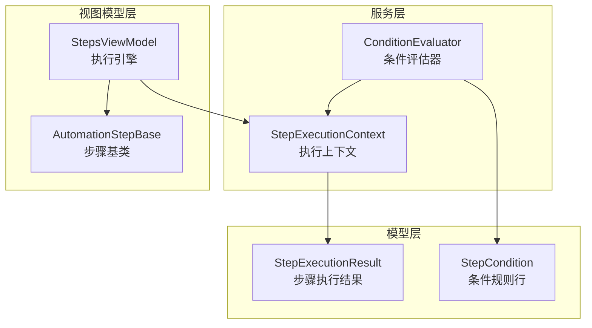
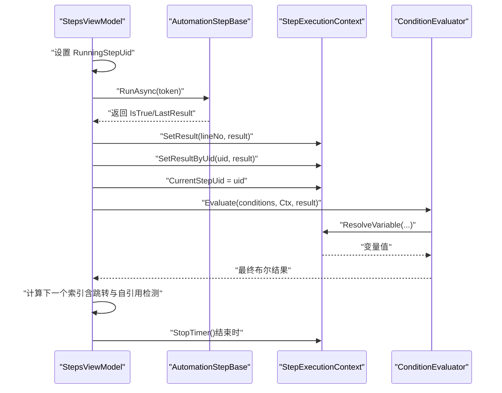
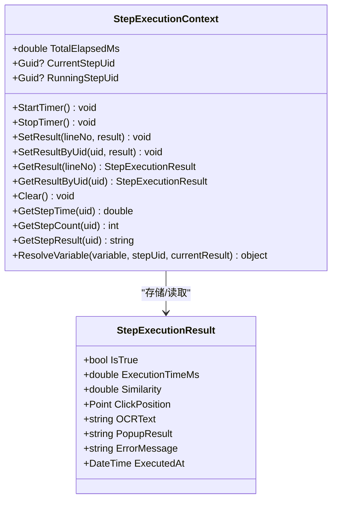
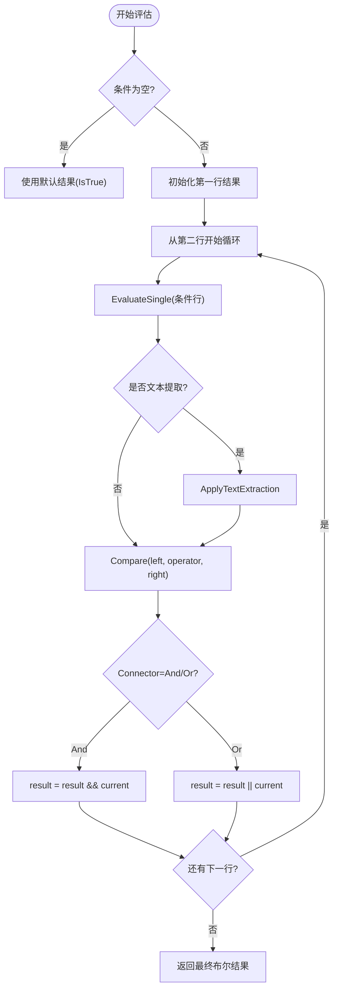
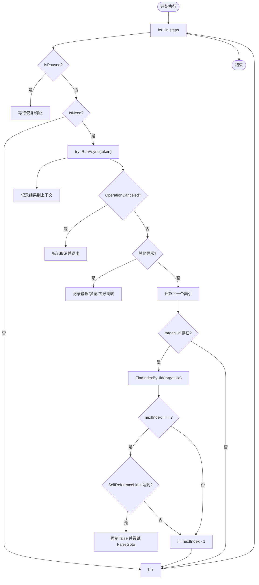
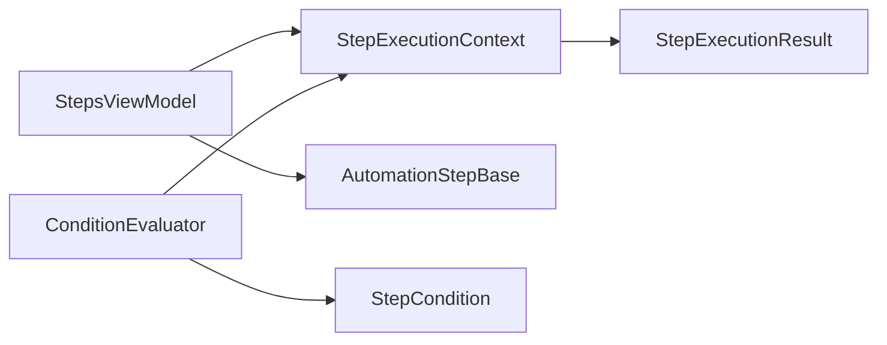

# 步骤执行上下文

<cite>
**本文引用的文件**   
- [StepExecutionContext.cs](file://ShaoLu/Services/StepExecutionContext.cs)
- [StepExecutionResult.cs](file://ShaoLu/Models/StepExecutionResult.cs)
- [ConditionEvaluator.cs](file://ShaoLu/Services/ConditionEvaluator.cs)
- [StepsViewModel.cs](file://ShaoLu/Viewmodels/StepsViewModel.cs)
- [AutomationStep.cs](file://ShaoLu/Viewmodels/AutomationStep.cs)
- [StepCondition.cs](file://ShaoLu/Models/StepCondition.cs)
- [StepExecutionContextTests.cs](file://NUnitTest/StepExecutionContextTests.cs)
</cite>

## 目录
1. [简介](#简介)
2. [项目结构](#项目结构)
3. [核心组件](#核心组件)
4. [架构总览](#架构总览)
5. [详细组件分析](#详细组件分析)
6. [依赖关系分析](#依赖关系分析)
7. [性能考量](#性能考量)
8. [故障排查指南](#故障排查指南)
9. [结论](#结论)
10. [附录](#附录)

## 简介
本文件围绕 ShaoLu 应用的 StepExecutionContext（步骤执行上下文）进行系统化文档化，重点说明其在自动化流程中的职责、设计原理与使用方式。内容涵盖：
- 执行状态管理：当前步骤索引、执行暂停/继续状态、运行中步骤跟踪
- 参数传递机制：条件变量解析、结果引用、触发信号
- 全局变量管理：单例上下文、结果缓存、统计信息
- 与步骤执行引擎的交互：步骤查找算法、跳转逻辑处理、循环检测
- 异步执行支持：CancellationToken 的使用、线程安全考虑
- 异常处理策略：错误分类、弹窗提示、失败跳转
- 生命周期与内存优化：开始/停止计时、清空与回收
- 调试信息收集：日志、统计窗口、执行时间
- 扩展指南与性能优化建议

## 项目结构
StepExecutionContext 位于 Services 层，作为执行期数据共享中心；与 Models 层的 StepExecutionResult 和 StepCondition 协作，被 Viewmodels 层的 StepsViewModel 在运行时读写，并由 ConditionEvaluator 在条件评估时调用。

图表来源
- [StepExecutionContext.cs:1-163](file://ShaoLu/Services/StepExecutionContext.cs#L1-L163)
- [ConditionEvaluator.cs:1-294](file://ShaoLu/Services/ConditionEvaluator.cs#L1-L294)
- [StepExecutionResult.cs:1-51](file://ShaoLu/Models/StepExecutionResult.cs#L1-L51)
- [StepCondition.cs:1-200](file://ShaoLu/Models/StepCondition.cs#L1-L200)
- [StepsViewModel.cs:520-719](file://ShaoLu/Viewmodels/StepsViewModel.cs#L520-L719)
- [AutomationStep.cs:337-901](file://ShaoLu/Viewmodels/AutomationStep.cs#L337-L901)

章节来源
- [StepExecutionContext.cs:1-163](file://ShaoLu/Services/StepExecutionContext.cs#L1-L163)
- [StepsViewModel.cs:520-719](file://ShaoLu/Viewmodels/StepsViewModel.cs#L520-L719)

## 核心组件
- StepExecutionContext：单例执行上下文，维护步骤执行结果、执行次数、最近执行步骤 Uid、运行中步骤 Uid、总耗时等。提供按行号与 Uid 存取结果、变量解析、统计查询等方法。
- StepExecutionResult：步骤执行的结构化结果，包含成功标志、耗时、相似度、点击位置、OCR 文本、弹窗选择、错误信息等。
- ConditionEvaluator：根据 StepCondition 列表评估条件，调用 StepExecutionContext.ResolveVariable 获取变量值并比较。
- StepsViewModel：执行引擎主循环，负责步骤遍历、暂停/继续、异常处理、跳转计算、上下文更新与统计累计。

章节来源
- [StepExecutionContext.cs:1-163](file://ShaoLu/Services/StepExecutionContext.cs#L1-L163)
- [StepExecutionResult.cs:1-51](file://ShaoLu/Models/StepExecutionResult.cs#L1-L51)
- [ConditionEvaluator.cs:1-294](file://ShaoLu/Services/ConditionEvaluator.cs#L1-L294)
- [StepsViewModel.cs:520-719](file://ShaoLu/Viewmodels/StepsViewModel.cs#L520-L719)

## 架构总览
StepExecutionContext 在执行引擎中被频繁读写，承担“执行期状态”与“跨步骤数据共享”的职责。其关键交互如下：
- 执行前：引擎设置 RunningStepUid，启动计时
- 执行中：步骤完成后写入 LastResult，引擎将结果存入上下文（按行号与 Uid），并更新 CurrentStepUid
- 条件评估：ConditionEvaluator 通过 ResolveVariable 读取 Self_* 或 Step_* 变量，必要时读取 CurrentStepUid 判断 Step_Triggered
- 跳转控制：引擎依据 TrueGotoUid/FalseGotoUid 与 FindIndexByUid 确定下一步索引，并进行自引用检测与限制
- 结束清理：StopTimer、关闭统计窗口、恢复 UI 状态

图表来源
- [StepsViewModel.cs:520-719](file://ShaoLu/Viewmodels/StepsViewModel.cs#L520-L719)
- [StepExecutionContext.cs:1-163](file://ShaoLu/Services/StepExecutionContext.cs#L1-L163)
- [ConditionEvaluator.cs:1-294](file://ShaoLu/Services/ConditionEvaluator.cs#L1-L294)

## 详细组件分析

### StepExecutionContext：执行上下文
- 设计要点
  - 单例模式：Instance 属性确保全局唯一上下文，避免多实例导致的状态不一致
  - 双索引存储：_results（按行号）、_resultsByUid（按 Uid），兼顾顺序访问与跨步骤引用
  - 执行计数：_executionCounts 记录每个 Uid 的执行次数，便于统计与阈值判断
  - 计时器：_totalStopwatch 记录总执行时间，StartTimer/StopTimer 由引擎控制
  - 运行状态：RunningStepUid（当前正在执行的步骤）、CurrentStepUid（刚刚执行完成的步骤）
- 关键方法
  - SetResult/SetResultByUid：写入执行结果，同时递增执行计数
  - GetResult/GetResultByUid：读取执行结果，空值保护
  - Clear：每次运行前清空所有状态，保证隔离性
  - GetStepTime/GetStepCount/GetStepResult：统计与展示辅助
  - ResolveVariable：条件变量解析，支持常量、Self_*、Step_*、Step_Triggered
- 线程安全
  - 当前实现未加锁，适用于单线程执行引擎；若未来引入并发执行需增加同步原语（如 ReaderWriterLockSlim）
- 内存优化
  - 字典键为 int/Guid，对象引用轻量；Clear 及时释放引用，避免长期驻留
  - 可考虑按需保留最近 N 条结果（滑动窗口）以降低内存占用

图表来源
- [StepExecutionContext.cs:1-163](file://ShaoLu/Services/StepExecutionContext.cs#L1-L163)
- [StepExecutionResult.cs:1-51](file://ShaoLu/Models/StepExecutionResult.cs#L1-L51)

章节来源
- [StepExecutionContext.cs:1-163](file://ShaoLu/Services/StepExecutionContext.cs#L1-L163)
- [StepExecutionResult.cs:1-51](file://ShaoLu/Models/StepExecutionResult.cs#L1-L51)

### 条件评估与变量解析
- 评估流程
  - Evaluate：按行组合 AND/OR 连接器，首行作为初始值，后续逐行合并
  - EvaluateSingle：解析变量值（调用 ResolveVariable），可选文本预处理（ExtractLines/FromSubstring/FromStart/FromEnd），再执行比较
  - Compare：支持布尔、数字、字符串、正则匹配、IsEmpty/IsNotEmpty
- 变量解析
  - 常量：ConstantTrue/ConstantFalse
  - 当前步骤：Self_IsTrue/Self_Similarity/Self_ExecutionTimeMs/Self_ClickX/Self_ClickY/Self_OCRText/Self_PopupResult
  - 引用步骤：Step_* 系列，通过 StepUid 查找结果
  - Step_Triggered：仅当引用步骤是刚刚执行完成的步骤时为 true（基于 CurrentStepUid）

图表来源
- [ConditionEvaluator.cs:1-294](file://ShaoLu/Services/ConditionEvaluator.cs#L1-L294)
- [StepExecutionContext.cs:105-160](file://ShaoLu/Services/StepExecutionContext.cs#L105-L160)

章节来源
- [ConditionEvaluator.cs:1-294](file://ShaoLu/Services/ConditionEvaluator.cs#L1-L294)
- [StepExecutionContext.cs:105-160](file://ShaoLu/Services/StepExecutionContext.cs#L105-L160)

### 执行引擎与跳转逻辑
- 主循环
  - 遍历步骤集合，跳过非需要步骤（IsNeed=false）
  - 设置 RunningStepUid，计时执行 RunAsync(token)，捕获异常并分类
  - 构建 StepExecutionResult，写入上下文（SetResult/SetResultByUid），更新 CurrentStepUid
  - 统计步骤累计条件计数，自定义条件评估覆盖 IsTrue
  - 根据 TrueGotoUid/FalseGotoUid 计算 nextIndex，处理自引用限制
- 暂停/继续
  - 每步之间检查 IsPaused，等待直到恢复或 StopSignal
- 异常处理
  - OperationCanceledException：用户取消，标记 CancelledByUser 并退出
  - 其他异常：记录错误类型与消息，弹出错误对话框（可配置），若无 FalseGotoUid 则终止
- 跳转与循环检测
  - FindIndexByUid 线性查找目标步骤
  - 自引用检测：nextIndex == i 时计数，达到 SelfReferenceLimit 后强制 false 并尝试 FalseGotoUid 分支

图表来源
- [StepsViewModel.cs:520-719](file://ShaoLu/Viewmodels/StepsViewModel.cs#L520-L719)
- [AutomationStep.cs:337-901](file://ShaoLu/Viewmodels/AutomationStep.cs#L337-L901)

章节来源
- [StepsViewModel.cs:520-719](file://ShaoLu/Viewmodels/StepsViewModel.cs#L520-L719)
- [AutomationStep.cs:337-901](file://ShaoLu/Viewmodels/AutomationStep.cs#L337-L901)

### 异步执行与线程安全
- CancellationToken
  - 引擎在每个步骤间与 Task.Delay 中检查 token.ThrowIfCancellationRequested()
  - 各步骤 RunAsync 接受 token 并在阻塞操作中使用，确保可取消
- 线程安全
  - 当前引擎为单线程顺序执行，StepExecutionContext 无锁
  - 若未来引入多线程步骤执行，需对 _results/_resultsByUid/_executionCounts 加读/写锁，或使用不可变快照
- 异常传播
  - OperationCanceledException 被上层捕获并优雅退出
  - 其他异常被捕获并分类，不影响整体流程崩溃

章节来源
- [StepsViewModel.cs:520-719](file://ShaoLu/Viewmodels/StepsViewModel.cs#L520-L719)
- [AutomationStep.cs:337-901](file://ShaoLu/Viewmodels/AutomationStep.cs#L337-L901)

### 生命周期管理与内存优化
- 生命周期
  - StartTimer：执行开始前启动总计时
  - Clear：每次运行前清空所有结果、计数、计时器与状态字段
  - StopTimer：执行结束后停止计时，关闭统计窗口，恢复 UI
- 内存优化
  - Clear 及时释放字典引用，避免累积
  - 可考虑结果缓存上限（LRU）以减少大脚本下的内存占用
  - 避免在上下文中持有 UI 对象引用，仅保存必要标识与数值

章节来源
- [StepExecutionContext.cs:1-163](file://ShaoLu/Services/StepExecutionContext.cs#L1-L163)
- [StepsViewModel.cs:520-719](file://ShaoLu/Viewmodels/StepsViewModel.cs#L520-L719)

### 调试信息与统计
- 日志记录
  - 启用 EnableLog 时，记录结果、耗时、相似度、OCR 文本等
- 统计窗口
  - StatisticsStep 打开悬浮窗展示总耗时、当前步骤、步骤耗时等
  - UpdateConditionCounts 累计条件命中次数
- 执行上下文统计
  - GetStepTime/GetStepCount/GetStepResult 提供便捷查询

章节来源
- [StepsViewModel.cs:520-719](file://ShaoLu/Viewmodels/StepsViewModel.cs#L520-L719)
- [StepExecutionContext.cs:84-103](file://ShaoLu/Services/StepExecutionContext.cs#L84-L103)

## 依赖关系分析
- 耦合度
  - StepsViewModel 强依赖 StepExecutionContext（读写结果与状态）
  - ConditionEvaluator 依赖 StepExecutionContext 进行变量解析
  - StepExecutionContext 依赖 StepExecutionResult 数据结构
- 外部依赖
  - NLog 用于条件评估与执行引擎的日志记录
  - WPF Dispatcher 用于 UI 线程操作（弹窗、窗口激活）
- 潜在循环依赖
  - 无直接循环依赖；条件面板通过 AllSteps 访问步骤集合，但仅在 UI 层

图表来源
- [StepsViewModel.cs:520-719](file://ShaoLu/Viewmodels/StepsViewModel.cs#L520-L719)
- [StepExecutionContext.cs:1-163](file://ShaoLu/Services/StepExecutionContext.cs#L1-L163)
- [ConditionEvaluator.cs:1-294](file://ShaoLu/Services/ConditionEvaluator.cs#L1-L294)

章节来源
- [StepsViewModel.cs:520-719](file://ShaoLu/Viewmodels/StepsViewModel.cs#L520-L719)
- [StepExecutionContext.cs:1-163](file://ShaoLu/Services/StepExecutionContext.cs#L1-L163)
- [ConditionEvaluator.cs:1-294](file://ShaoLu/Services/ConditionEvaluator.cs#L1-L294)

## 性能考量
- 查找复杂度
  - FindIndexByUid 为 O(n) 线性查找，适合中小规模步骤集；大规模时可引入 Uid→Index 映射表
- 字典操作
  - SetResult/SetResultByUid/GetResult/GetResultByUid 均为 O(1) 平均复杂度
- 条件评估
  - Evaluate 为 O(m) 行数评估，Compare 为常数时间；文本提取可能带来额外开销
- 内存占用
  - 随步骤数量与执行次数增长；建议定期 Clear 或限制缓存大小
- I/O 与 UI
  - 日志与弹窗应避免频繁触发；统计窗口复用同一 UID 实例

[本节为通用指导，不直接分析具体文件]

## 故障排查指南
- 常见问题
  - 步骤执行失败：查看 Step.IsError、ErrorMessage、ErrorType；确认 FalseGotoUid 是否正确
  - 跳转无效：检查 TrueGotoUid/FalseGotoUid 是否存在于步骤集合；FindIndexByUid 返回值是否为 -1
  - 自引用死循环：确认 SelfReferenceLimit 设置合理；达到限制后是否设置了有效的 FalseGotoUid
  - 条件评估异常：检查 Variable、Operator、Value 是否匹配；文本提取模式是否正确
- 定位手段
  - 启用日志：EnableLog=true，查看 ExecutionLogService 输出
  - 统计窗口：StatisticsStep 显示实时统计与条件命中次数
  - 单元测试：参考 StepExecutionContextTests 验证变量解析与结果存取

章节来源
- [StepsViewModel.cs:597-622](file://ShaoLu/Viewmodels/StepsViewModel.cs#L597-L622)
- [StepExecutionContextTests.cs:1-253](file://NUnitTest/StepExecutionContextTests.cs#L1-L253)

## 结论
StepExecutionContext 作为 ShaoLu 自动化流程的核心执行上下文，提供了统一的结果存储、变量解析与统计能力。其与 StepsViewModel 和 ConditionEvaluator 的协作实现了灵活的步骤控制与条件判断。通过合理的生命周期管理、异常处理与性能优化，可在复杂自动化场景中保持稳定与高效。未来可扩展并发支持与结果缓存策略，以进一步提升性能与可靠性。

[本节为总结，不直接分析具体文件]

## 附录

### 自定义执行上下文扩展指南
- 新增变量类型
  - 在 StepExecutionContext.ResolveVariable 中添加新的 Case，并对应 StepCondition.AvailableVariables 暴露给 UI
- 扩展结果字段
  - 在 StepExecutionResult 中新增字段，并在引擎写入结果时填充
- 并发支持
  - 为 _results/_resultsByUid/_executionCounts 添加 ReaderWriterLockSlim，或在异步场景下使用不可变快照
- 结果缓存策略
  - 实现 LRU 缓存，限制最大条目数，降低内存占用

[本节为概念性指导，不直接分析具体文件]

### 性能优化建议
- 步骤查找优化
  - 维护 Uid→Index 映射表，将 FindIndexByUid 降为 O(1)
- 条件评估优化
  - 预编译正则表达式，减少重复创建开销
- 上下文清理
  - 在长流程中分阶段 Clear 或采用滑动窗口缓存
- I/O 优化
  - 批量日志写入，减少磁盘 I/O；弹窗合并提示

[本节为通用指导，不直接分析具体文件]