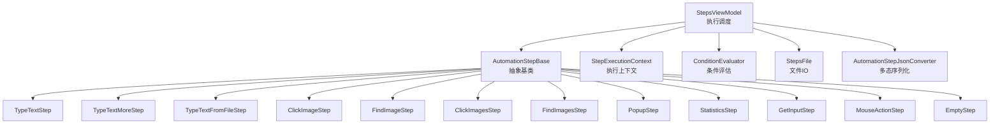
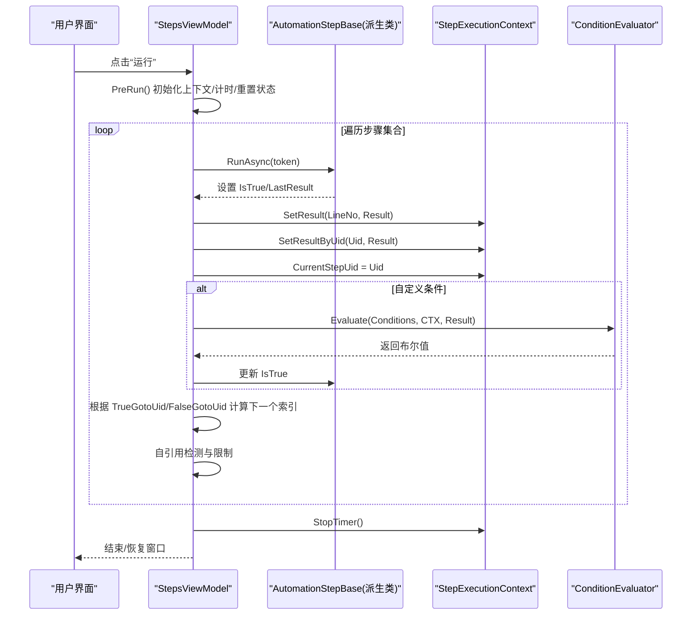
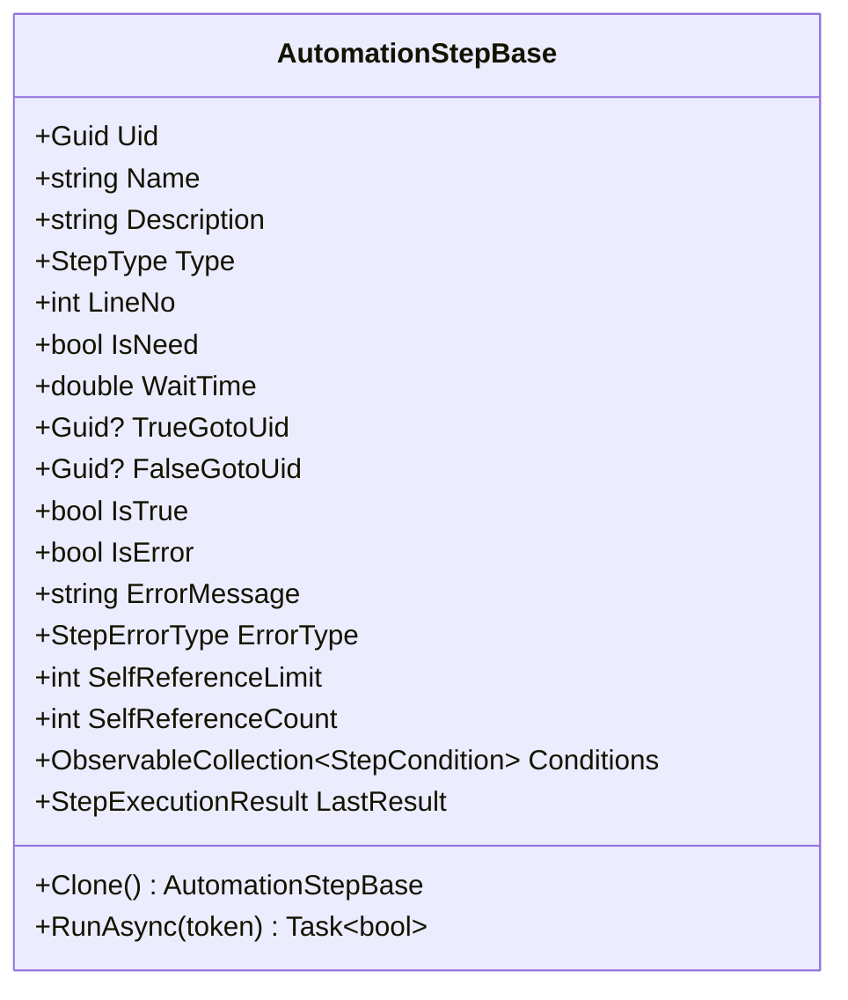
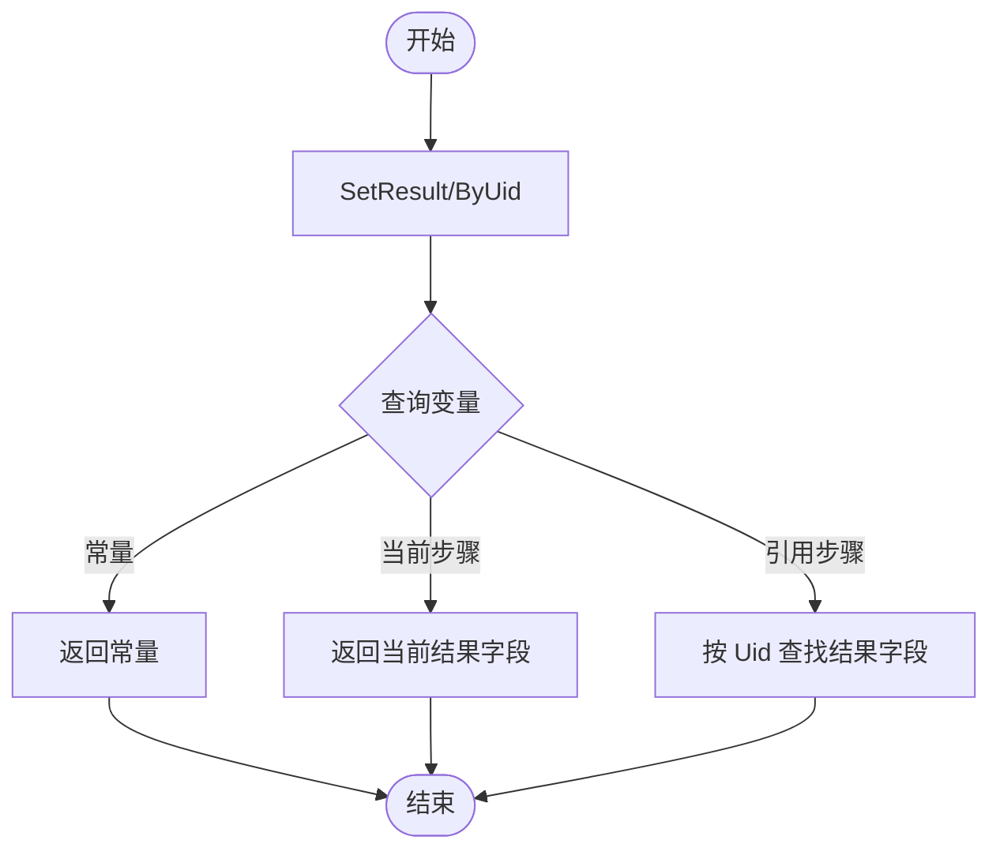
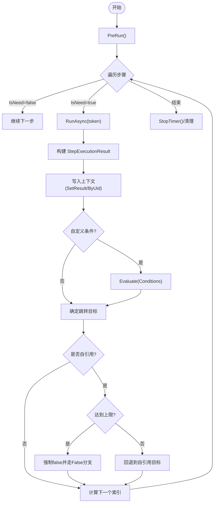
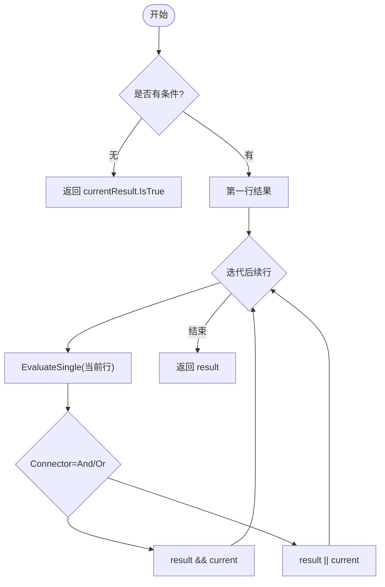
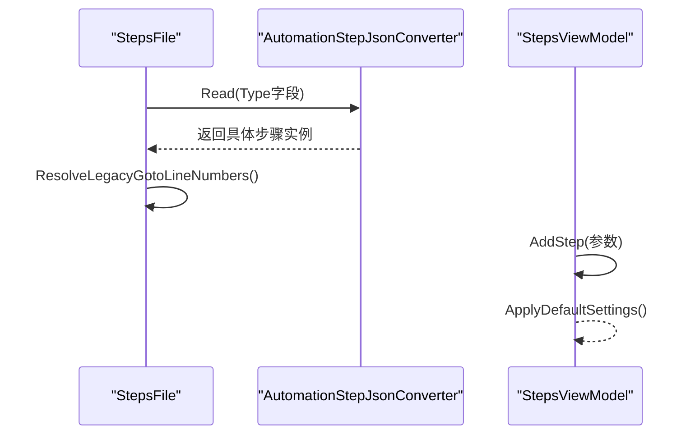
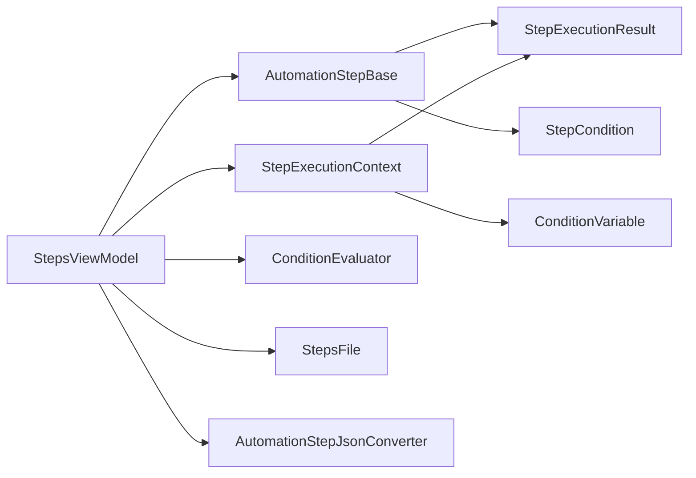

# 步骤执行引擎

<cite>
**本文引用的文件**   
- [AutomationStep.cs](file://ShaoLu/Viewmodels/AutomationStep.cs)
- [StepExecutionContext.cs](file://ShaoLu/Services/StepExecutionContext.cs)
- [StepsViewModel.cs](file://ShaoLu/Viewmodels/StepsViewModel.cs)
- [AutomationStepJsonConverter.cs](file://ShaoLu/Converters/AutomationStepJsonConverter.cs)
- [StepsFile.cs](file://ShaoLu/Utils/StepsFile.cs)
- [StepExecutionResult.cs](file://ShaoLu/Models/StepExecutionResult.cs)
- [StepCondition.cs](file://ShaoLu/Models/StepCondition.cs)
- [ConditionEvaluator.cs](file://ShaoLu/Services/ConditionEvaluator.cs)
- [StepExecutionLog.cs](file://ShaoLu/Models/StepExecutionLog.cs)
</cite>

## 目录
1. [简介](#简介)
2. [项目结构](#项目结构)
3. [核心组件](#核心组件)
4. [架构总览](#架构总览)
5. [详细组件分析](#详细组件分析)
6. [依赖关系分析](#依赖关系分析)
7. [性能考虑](#性能考虑)
8. [故障排查指南](#故障排查指南)
9. [结论](#结论)
10. [附录：扩展新步骤类型指南](#附录扩展新步骤类型指南)

## 简介
本文件为 ShaoLu 应用的“自动化步骤执行引擎”提供系统化、可落地的技术文档。重点覆盖：
- AutomationStepBase 基类的设计原理与抽象契约（RunAsync、Clone、属性管理）
- 步骤执行生命周期（从 StepsViewModel.Run 到 RunAsync 的异步流程与结果处理）
- StepExecutionContext 上下文环境（执行状态、参数传递、错误处理、变量解析）
- 步骤类型系统（StepType 枚举、JSON 多态反序列化、动态创建）
- 克隆机制与自引用检测、循环防止策略
- 扩展新步骤类型的完整指南与最佳实践

## 项目结构
围绕步骤执行引擎的关键代码分布在以下模块：
- Viewmodels/AutomationStep.cs：步骤基类与具体步骤实现（文本输入、图片识别、弹窗、统计等）
- Services/StepExecutionContext.cs：执行上下文，集中保存每次步骤的执行结果与统计信息
- Viewmodels/StepsViewModel.cs：步骤编排与执行调度器，负责运行循环、跳转、暂停/停止、错误处理
- Converters/AutomationStepJsonConverter.cs：支持多态序列化的 JSON 转换器，按 StepType 实例化具体步骤
- Utils/StepsFile.cs：步骤文件的加载/保存（含 .autostep 压缩包），以及旧格式兼容处理
- Models/*：StepExecutionResult、StepCondition、StepExecutionLog 等数据模型
- Services/ConditionEvaluator.cs：条件评估器，基于 StepExecutionContext 解析变量并计算布尔结果

**图表来源** 
- [StepsViewModel.cs](file://ShaoLu/Viewmodels/StepsViewModel.cs)
- [AutomationStep.cs](file://ShaoLu/Viewmodels/AutomationStep.cs)
- [StepExecutionContext.cs](file://ShaoLu/Services/StepExecutionContext.cs)
- [ConditionEvaluator.cs](file://ShaoLu/Services/ConditionEvaluator.cs)
- [StepsFile.cs](file://ShaoLu/Utils/StepsFile.cs)
- [AutomationStepJsonConverter.cs](file://ShaoLu/Converters/AutomationStepJsonConverter.cs)

**章节来源**
- [StepsViewModel.cs](file://ShaoLu/Viewmodels/StepsViewModel.cs)
- [AutomationStep.cs](file://ShaoLu/Viewmodels/AutomationStep.cs)
- [StepExecutionContext.cs](file://ShaoLu/Services/StepExecutionContext.cs)
- [ConditionEvaluator.cs](file://ShaoLu/Services/ConditionEvaluator.cs)
- [StepsFile.cs](file://ShaoLu/Utils/StepsFile.cs)
- [AutomationStepJsonConverter.cs](file://ShaoLu/Converters/AutomationStepJsonConverter.cs)

## 核心组件
- 步骤基类 AutomationStepBase
  - 定义抽象方法 Clone() 与 RunAsync(CancellationToken)，统一步骤的生命周期与克隆契约
  - 提供通用属性：Uid、Name、Description、Type、LineNo、WaitTime、TrueGotoUid、FalseGotoUid、IsNeed、EnableLog、SelfReferenceLimit、SelfReferenceCount、Conditions、LastResult 等
  - 通过 SetProperty 实现 MVVM 属性变更通知，便于 UI 绑定与模板渲染
- 执行上下文 StepExecutionContext
  - 单例模式，维护每个步骤的执行结果（按行号与 Uid）、执行次数、总耗时、当前/正在执行的步骤 Uid
  - 提供 ResolveVariable 以解析条件变量（常量、当前步骤自身、引用其他步骤）
- 执行调度 StepsViewModel
  - 维护步骤集合、选中项、复制粘贴缓冲
  - 负责启动/停止/暂停、执行循环、异常捕获、错误类型推断、日志记录、统计更新、弹窗关闭控制
- JSON 多态转换与文件 IO
  - AutomationStepJsonConverter 根据 Type 字段选择具体步骤类型进行反序列化，兼容旧版 int 行号的跳转字段
  - StepsFile 负责 .autostep 包与 JSON 格式的读写，并在加载后完成旧格式迁移

**章节来源**
- [AutomationStep.cs](file://ShaoLu/Viewmodels/AutomationStep.cs)
- [StepExecutionContext.cs](file://ShaoLu/Services/StepExecutionContext.cs)
- [StepsViewModel.cs](file://ShaoLu/Viewmodels/StepsViewModel.cs)
- [AutomationStepJsonConverter.cs](file://ShaoLu/Converters/AutomationStepJsonConverter.cs)
- [StepsFile.cs](file://ShaoLu/Utils/StepsFile.cs)

## 架构总览
步骤执行引擎采用“调度器 + 抽象步骤 + 上下文 + 条件评估”的分层设计：
- 调度器（StepsViewModel）负责编排步骤顺序、控制流（跳转、暂停/停止）、异常处理与结果持久化
- 抽象步骤（AutomationStepBase）定义统一的执行接口与属性模型，具体步骤实现各自业务逻辑
- 上下文（StepExecutionContext）作为全局运行时状态容器，供条件评估与统计使用
- 条件评估（ConditionEvaluator）基于上下文解析变量，支持多行规则组合（And/Or）

**图表来源** 
- [StepsViewModel.cs](file://ShaoLu/Viewmodels/StepsViewModel.cs)
- [AutomationStep.cs](file://ShaoLu/Viewmodels/AutomationStep.cs)
- [StepExecutionContext.cs](file://ShaoLu/Services/StepExecutionContext.cs)
- [ConditionEvaluator.cs](file://ShaoLu/Services/ConditionEvaluator.cs)

## 详细组件分析

### 步骤基类与生命周期（AutomationStepBase）
- 抽象契约
  - Clone(): 深拷贝步骤实例，用于复制/粘贴与插入操作
  - RunAsync(CancellationToken): 异步执行步骤逻辑，返回是否成功；内部应设置 IsTrue、ErrorType、ErrorMessage、LastResult
- 属性管理机制
  - 所有公共属性均通过 SetProperty 触发 PropertyChanged，确保 UI 同步
  - Uid 在构造时分配唯一标识，JSON 反序列化时可恢复原 Uid
  - LineNo 由集合或 UI 统一维护，避免不一致
- 条件与日志
  - ConditionMode 与 Conditions 列表支持复杂条件判断
  - EnableLog 控制是否记录执行日志（文件名、步骤名、结果、OCR 文本）
- 自引用控制
  - SelfReferenceLimit 与 SelfReferenceCount 配合调度器实现循环防止

**图表来源** 
- [AutomationStep.cs](file://ShaoLu/Viewmodels/AutomationStep.cs)

**章节来源**
- [AutomationStep.cs](file://ShaoLu/Viewmodels/AutomationStep.cs)

### 执行上下文（StepExecutionContext）
- 职责
  - 存储每个步骤的执行结果（按行号与 Uid）
  - 维护执行次数、总耗时、当前/正在执行的步骤 Uid
  - 提供 ResolveVariable 解析条件变量（常量、当前步骤自身、引用其他步骤）
- 关键方法
  - SetResult/SetResultByUid：写入执行结果
  - GetResult/GetResultByUid：读取执行结果
  - Clear：每次运行前清空上下文
  - StartTimer/StopTimer：总计时控制
  - ResolveVariable：将条件变量映射为实际值（包括 Step_Triggered 仅一次生效）

**图表来源** 
- [StepExecutionContext.cs](file://ShaoLu/Services/StepExecutionContext.cs)

**章节来源**
- [StepExecutionContext.cs](file://ShaoLu/Services/StepExecutionContext.cs)

### 执行调度与生命周期（StepsViewModel）
- 启动与准备
  - PreRun：重置停止信号、暂停状态、初始化 Autogui、清空上下文、启动总计时、重置各步骤状态（自引用计数、错误、LastResult、统计计数器、文本重载）
- 执行循环
  - 遍历步骤集合，跳过 IsNeed=false 的步骤
  - 调用 step.RunAsync(token)，计时并构建 StepExecutionResult
  - 写入上下文（SetResult/ByUid、CurrentStepUid）
  - 统计步骤累计条件计数
  - 若为自定义条件模式，调用 ConditionEvaluator.Evaluate 更新 IsTrue
  - 可选记录执行日志
- 跳转与自引用检测
  - 根据 IsTrue 选择 TrueGotoUid 或 FalseGotoUid
  - 若目标索引等于当前索引（自引用），递增 SelfReferenceCount，达到上限则强制 false 并按 false 分支重新解析跳转
- 异常处理
  - OperationCanceledException：标记 CancelledByUser 并退出
  - 其他异常：记录错误类型、错误消息，弹出错误提示（可选），若无 FalseGotoUid 则终止执行
- 结束清理
  - 停止计时、关闭统计窗口、恢复主窗口状态

**图表来源** 
- [StepsViewModel.cs](file://ShaoLu/Viewmodels/StepsViewModel.cs)

**章节来源**
- [StepsViewModel.cs](file://ShaoLu/Viewmodels/StepsViewModel.cs)

### 条件评估（ConditionEvaluator）
- 功能
  - 评估多行条件规则，按 And/Or 组合得到最终布尔值
  - 支持常量、当前步骤自身、引用其他步骤的变量
  - 对 OCR 文本支持多种提取模式（整段、指定行、子串截取、首尾截取）
- 比较逻辑
  - 支持布尔、数字（容差）、字符串（相等/包含/正则匹配）
  - 空值检查（IsEmpty/IsNotEmpty）
- 文本提取
  - Lines：按行号范围提取并拼接
  - FromSubstring：从首次出现位置之后读取指定长度
  - FromStart/FromEnd：从开头/末尾读取指定长度

**图表来源** 
- [ConditionEvaluator.cs](file://ShaoLu/Services/ConditionEvaluator.cs)

**章节来源**
- [ConditionEvaluator.cs](file://ShaoLu/Services/ConditionEvaluator.cs)
- [StepCondition.cs](file://ShaoLu/Models/StepCondition.cs)

### 多态序列化与动态创建（AutomationStepJsonConverter & StepsFile）
- 多态反序列化
  - 读取 JSON 中的 Type 字段（支持字符串与数字枚举）
  - 根据 StepType 映射到具体步骤类型（如 ClickImageStep、TypeTextStep、PopupStep 等）
  - 兼容旧格式：TrueGoto/FalseGoto 为 int 行号时，移除该字段并记录待解析映射，加载完成后统一转换为 Uid
- 动态创建
  - StepsViewModel.AddStep 根据参数创建对应步骤实例，并应用默认设置（相似度阈值、等待时间、超时、点击次数等）

**图表来源** 
- [AutomationStepJsonConverter.cs](file://ShaoLu/Converters/AutomationStepJsonConverter.cs)
- [StepsFile.cs](file://ShaoLu/Utils/StepsFile.cs)
- [StepsViewModel.cs](file://ShaoLu/Viewmodels/StepsViewModel.cs)

**章节来源**
- [AutomationStepJsonConverter.cs](file://ShaoLu/Converters/AutomationStepJsonConverter.cs)
- [StepsFile.cs](file://ShaoLu/Utils/StepsFile.cs)
- [StepsViewModel.cs](file://ShaoLu/Viewmodels/StepsViewModel.cs)

### 执行结果与日志（StepExecutionResult & StepExecutionLog）
- StepExecutionResult
  - 记录 IsTrue、ExecutionTimeMs、Similarity、ClickPosition、OCRText、PopupResult、ErrorMessage、ExecutedAt
- StepExecutionLog
  - 持久化步骤执行日志（StepUid、StepFileName、StepName、InputText、OCRText、ExecutedAt）

**章节来源**
- [StepExecutionResult.cs](file://ShaoLu/Models/StepExecutionResult.cs)
- [StepExecutionLog.cs](file://ShaoLu/Models/StepExecutionLog.cs)

## 依赖关系分析
- StepsViewModel 依赖：
  - AutomationStepBase 及其派生类（执行单元）
  - StepExecutionContext（共享执行状态）
  - ConditionEvaluator（条件评估）
  - StepsFile（文件 IO）
  - AutomationStepJsonConverter（多态序列化）
- AutomationStepBase 依赖：
  - StepExecutionResult（执行结果）
  - StepCondition（条件规则）
  - SingletonLocator（服务定位器，获取步骤集合、文件服务等）
- StepExecutionContext 依赖：
  - StepExecutionResult（结果对象）
  - StepCondition/ConditionVariable（条件变量解析）

**图表来源** 
- [StepsViewModel.cs](file://ShaoLu/Viewmodels/StepsViewModel.cs)
- [AutomationStep.cs](file://ShaoLu/Viewmodels/AutomationStep.cs)
- [StepExecutionContext.cs](file://ShaoLu/Services/StepExecutionContext.cs)
- [ConditionEvaluator.cs](file://ShaoLu/Services/ConditionEvaluator.cs)
- [StepsFile.cs](file://ShaoLu/Utils/StepsFile.cs)
- [AutomationStepJsonConverter.cs](file://ShaoLu/Converters/AutomationStepJsonConverter.cs)

**章节来源**
- [StepsViewModel.cs](file://ShaoLu/Viewmodels/StepsViewModel.cs)
- [AutomationStep.cs](file://ShaoLu/Viewmodels/AutomationStep.cs)
- [StepExecutionContext.cs](file://ShaoLu/Services/StepExecutionContext.cs)
- [ConditionEvaluator.cs](file://ShaoLu/Services/ConditionEvaluator.cs)
- [StepsFile.cs](file://ShaoLu/Utils/StepsFile.cs)
- [AutomationStepJsonConverter.cs](file://ShaoLu/Converters/AutomationStepJsonConverter.cs)

## 性能考虑
- 异步执行：RunAsync 使用 CancellationToken 支持取消，避免阻塞 UI 线程
- 计时与统计：StepsViewModel 使用 Stopwatch 精确测量每步耗时，StepExecutionContext 维护总耗时
- 条件评估优化：Evaluate 短路逻辑（And/Or）减少不必要的计算
- 文本提取：仅在 OCR 文本变量启用提取模式时进行处理，降低开销
- 文件 IO：StepsFile 使用 ZipArchive 压缩存储图片，提升打包效率

[本节为通用指导，不直接分析具体文件]

## 故障排查指南
- 常见错误类型
  - FileNotFound、IndexOutOfRange、ExecutionTimeout、CancelledByUser、Unknown 等
- 错误处理流程
  - 捕获异常后设置 IsError、ErrorMessage、ErrorType
  - 若配置 ShowErrorPopup，弹出错误提示
  - 若无 FalseGotoUid，终止执行；否则按 false 分支继续
- 自引用限制
  - 当 SelfReferenceLimit>=0 且 SelfReferenceCount 达到上限，强制 IsTrue=false 并尝试 False 分支跳转
- 上下文清理
  - 每次运行前调用 Clear，确保历史结果不影响本次执行

**章节来源**
- [StepsViewModel.cs](file://ShaoLu/Viewmodels/StepsViewModel.cs)
- [StepExecutionContext.cs](file://ShaoLu/Services/StepExecutionContext.cs)

## 结论
ShaoLu 的步骤执行引擎通过清晰的抽象基类、统一的执行上下文、强大的条件评估与完善的文件序列化机制，实现了高内聚、低耦合的自动化步骤编排。其生命周期管理健壮，错误处理完善，支持灵活的跳转与自引用控制，便于扩展与维护。

[本节为总结性内容，不直接分析具体文件]

## 附录：扩展新步骤类型指南
- 新增步骤类型
  - 在 StepType 枚举中添加新类型（如 NewStep）
  - 创建继承自 AutomationStepBase 的新类（NewStep），实现：
    - Clone()：深拷贝所有属性（包括集合、图像资源等）
    - RunAsync(CancellationToken)：实现业务逻辑，设置 IsTrue、ErrorType、ErrorMessage、LastResult
  - 在 StepsViewModel.AddStep 的参数映射中注册新类型，以便 UI 创建
  - 在 AutomationStepJsonConverter.Read 的类型映射中添加 StepType -> NewStep 的映射
- 最佳实践
  - 属性变更使用 SetProperty，确保 MVVM 绑定有效
  - 长时间任务使用 Task.Run 或异步 API，支持 CancellationToken 取消
  - 错误处理明确设置 ErrorType，便于日志与调试
  - 如需引用其他步骤结果，使用 StepExecutionContext.ResolveVariable 提供的变量
  - 对于图像识别类步骤，注意 CroppedImg 的克隆与磁盘保存
- 示例路径参考
  - 基类与抽象契约：[AutomationStep.cs](file://ShaoLu/Viewmodels/AutomationStep.cs)
  - 具体步骤实现（TypeTextStep、PopupStep 等）：[AutomationStep.cs](file://ShaoLu/Viewmodels/AutomationStep.cs)
  - JSON 多态映射：[AutomationStepJsonConverter.cs](file://ShaoLu/Converters/AutomationStepJsonConverter.cs)
  - 动态创建与默认设置：[StepsViewModel.cs](file://ShaoLu/Viewmodels/StepsViewModel.cs)

**章节来源**
- [AutomationStep.cs](file://ShaoLu/Viewmodels/AutomationStep.cs)
- [AutomationStepJsonConverter.cs](file://ShaoLu/Converters/AutomationStepJsonConverter.cs)
- [StepsViewModel.cs](file://ShaoLu/Viewmodels/StepsViewModel.cs)