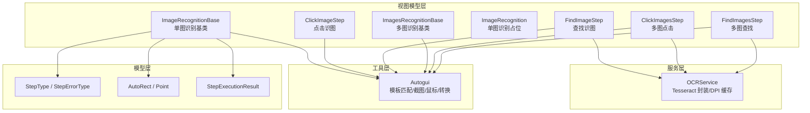
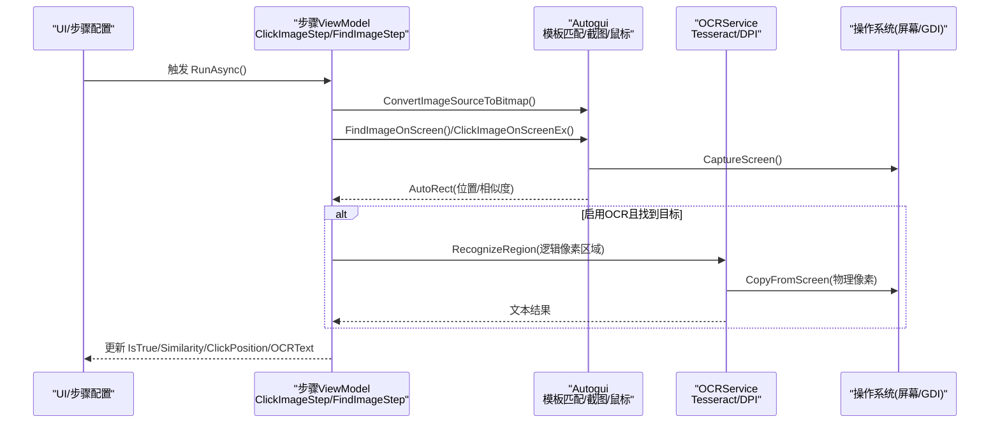
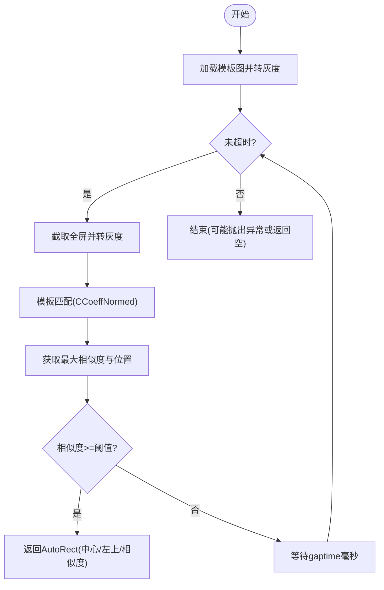
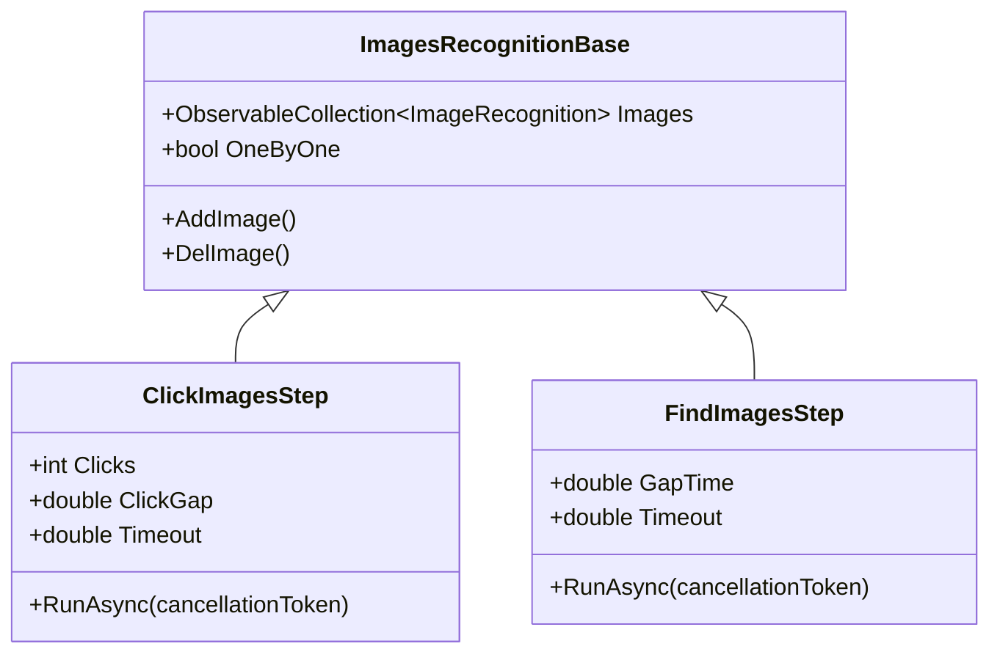
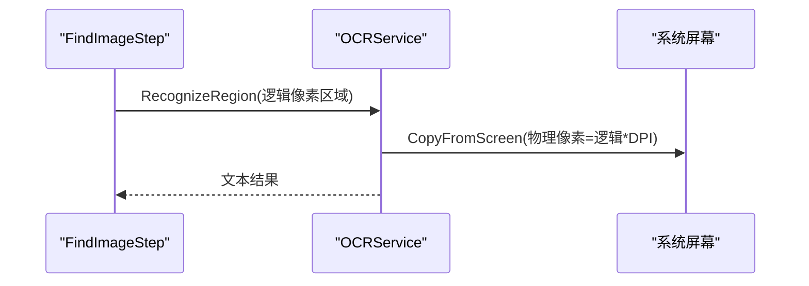
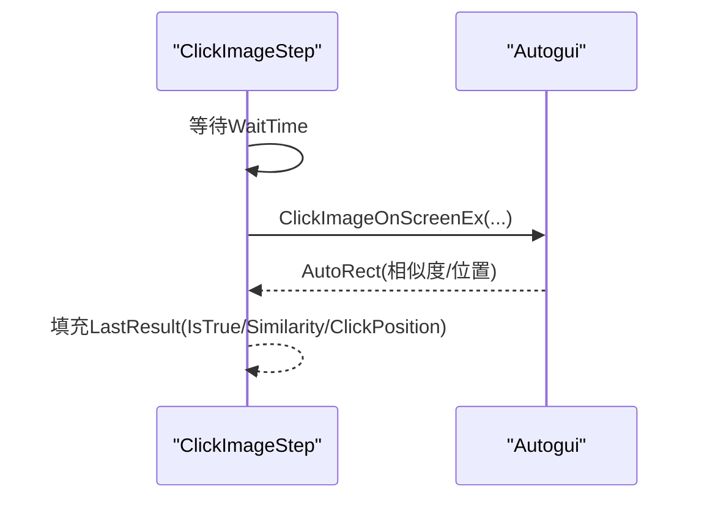
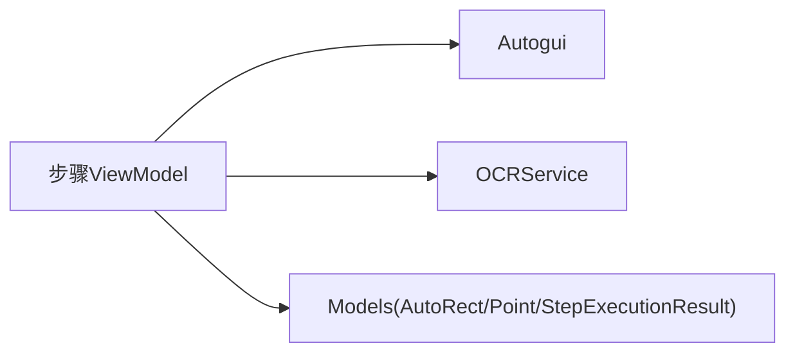

# 图像识别步骤

<cite>
**本文引用的文件**   
- [ImageRecognition.cs](file://ShaoLu/Viewmodels/ImageRecognition.cs)
- [ImagesRecognition.cs](file://ShaoLu/Viewmodels/ImagesRecognition.cs)
- [Autogui.cs](file://ShaoLu/Utils/Autogui.cs)
- [OCRService.cs](file://ShaoLu/Services/OCRService.cs)
- [AutomationStepModel.cs](file://ShaoLu/Models/AutomationStepModel.cs)
- [StepExecutionResult.cs](file://ShaoLu/Models/StepExecutionResult.cs)
- [Readme.md](file://Readme.md)
</cite>

## 目录
1. [简介](#简介)
2. [项目结构](#项目结构)
3. [核心组件](#核心组件)
4. [架构总览](#架构总览)
5. [详细组件分析](#详细组件分析)
6. [依赖关系分析](#依赖关系分析)
7. [性能考量](#性能考量)
8. [故障排查指南](#故障排查指南)
9. [结论](#结论)
10. [附录](#附录)

## 简介
本文件面向 ShaoLu 应用的“图像识别”步骤类型，系统性说明单图识别与多图识别两类步骤的功能、实现与使用要点。内容涵盖模板匹配算法、阈值设置、多分辨率与 DPI 缩放处理、批量并行执行与结果聚合、图像预处理（灰度转换等）、坐标定位与边界检测、OCR 文字识别集成、图像资源管理与缓存策略，以及性能调优建议、错误处理机制与常见问题解决方案。

## 项目结构
围绕图像识别的核心代码主要分布在以下模块：
- Viewmodels：定义图像识别步骤的模型与执行逻辑（单图/多图）
- Utils：封装屏幕截图、模板匹配、鼠标模拟、图像格式转换等底层能力
- Services：OCR 服务封装（Tesseract 引擎、DPI 缓存、区域截图识别）
- Models：通用枚举、数据模型（步骤类型、错误类型、执行结果、坐标矩形）

图表来源 
- [ImageRecognition.cs:1-602](file://ShaoLu/Viewmodels/ImageRecognition.cs#L1-L602)
- [ImagesRecognition.cs:1-245](file://ShaoLu/Viewmodels/ImagesRecognition.cs#L1-L245)
- [Autogui.cs:1-656](file://ShaoLu/Utils/Autogui.cs#L1-L656)
- [OCRService.cs:1-159](file://ShaoLu/Services/OCRService.cs#L1-L159)
- [AutomationStepModel.cs:1-73](file://ShaoLu/Models/AutomationStepModel.cs#L1-L73)
- [StepExecutionResult.cs:1-51](file://ShaoLu/Models/StepExecutionResult.cs#L1-L51)

章节来源
- [Readme.md:1-283](file://Readme.md#L1-L283)

## 核心组件
- ImageRecognitionBase：单图识别的公共基类，负责图片加载、裁剪图保存、相似度阈值、点击点管理、错误状态与日志记录。
- ClickImageStep：基于单图进行屏幕查找并点击，支持多次点击、点击间隔、超时控制、鼠标动作序列。
- FindImageStep：基于单图进行屏幕查找（不点击），可选启用 OCR 对指定区域进行文字识别，支持调试叠加显示。
- ImagesRecognitionBase：多图识别的公共基类，维护图片集合与顺序模式。
- ClickImagesStep：按列表顺序依次查找并点击多张图片。
- FindImagesStep：同时查找多张图片，判断是否全部找到。

章节来源
- [ImageRecognition.cs:1-602](file://ShaoLu/Viewmodels/ImageRecognition.cs#L1-L602)
- [ImagesRecognition.cs:1-245](file://ShaoLu/Viewmodels/ImagesRecognition.cs#L1-L245)

## 架构总览
下图展示从 UI 步骤到图像识别与 OCR 的调用链路与数据流。

图表来源 
- [ImageRecognition.cs:439-600](file://ShaoLu/Viewmodels/ImageRecognition.cs#L439-L600)
- [ImagesRecognition.cs:122-241](file://ShaoLu/Viewmodels/ImagesRecognition.cs#L122-L241)
- [Autogui.cs:59-122](file://ShaoLu/Utils/Autogui.cs#L59-L122)
- [OCRService.cs:114-144](file://ShaoLu/Services/OCRService.cs#L114-L144)

## 详细组件分析

### 单图识别：模板匹配、阈值、多分辨率与 DPI
- 模板匹配算法
  - 使用 OpenCV 的归一化相关系数匹配（CCoeffNormed），将模板与屏幕截图转换为灰度图后计算相似度。
  - 通过 MinMaxLoc 获取最大相似度及其位置，超过阈值即认为匹配成功。
- 阈值设置
  - 默认阈值约 0.8~0.85，值越高匹配越严格；可在步骤中调整 SimilarityThreshold。
- 多分辨率与 DPI 缩放
  - 截图为物理像素，OCR 区域使用 WPF 逻辑像素，OCRService 提供 CachedDpiX/Y 进行换算。
  - 查找结果 LeftTop 为物理像素，显示叠加时需除以 DPI 转为逻辑像素。
- 最佳匹配点与边界
  - AutoRect.Center 由 maxLoc + templateWidth/2 计算得到，LeftTop 为匹配左上角，四角点可对称推导。
- 超时与重试
  - 循环内使用 Stopwatch 计时，gaptime 控制重试间隔，timeout 控制最大等待时间。

图表来源 
- [Autogui.cs:59-122](file://ShaoLu/Utils/Autogui.cs#L59-L122)

章节来源
- [Autogui.cs:59-122](file://ShaoLu/Utils/Autogui.cs#L59-L122)
- [ImageRecognition.cs:439-600](file://ShaoLu/Viewmodels/ImageRecognition.cs#L439-L600)

### 多图识别：批量处理、并行优化与结果聚合
- 批量处理
  - ClickImagesStep 按列表顺序逐一查找并点击，FindImagesStep 同时查找多张，任一未找到则失败。
- 并行执行优化
  - 当前实现以 Task.Run 包裹单次查找/点击，避免阻塞 UI；多图查找采用轮询方式（非并发），可通过扩展改为并发任务池提升吞吐。
- 结果聚合
  - ClickImagesStep 保留最后一次相似度与点击位置；FindImagesStep 聚合所有结果，首项作为整体判定依据。

图表来源 
- [ImagesRecognition.cs:47-241](file://ShaoLu/Viewmodels/ImagesRecognition.cs#L47-L241)

章节来源
- [ImagesRecognition.cs:122-241](file://ShaoLu/Viewmodels/ImagesRecognition.cs#L122-L241)

### 图像预处理：灰度转换、二值化、噪声过滤、特征提取
- 灰度转换
  - 模板与屏幕截图均转换为灰度图用于模板匹配，减少通道复杂度，提高匹配速度。
- 二值化与噪声过滤
  - 当前模板匹配未显式二值化或滤波；如需增强鲁棒性，可在模板生成阶段加入高斯模糊、自适应阈值等预处理。
- 特征提取
  - 当前基于像素级相关性匹配；若场景复杂，可引入 SIFT/ORB 等特征匹配以提升抗遮挡与形变能力。

章节来源
- [Autogui.cs:73-86](file://ShaoLu/Utils/Autogui.cs#L73-L86)

### 坐标定位算法：最佳匹配点、区域搜索优化、边界检测
- 最佳匹配点
  - 通过 CCoeffNormed 的最大响应位置确定匹配区域，Center 由左上角加模板尺寸一半得到。
- 区域搜索优化
  - 当前全图扫描；可结合 ROI（感兴趣区域）缩小搜索范围，降低计算量。
- 边界检测
  - AutoRect 提供四角点属性，便于后续绘制叠加框或限制点击偏移。

章节来源
- [Autogui.cs:86-101](file://ShaoLu/Utils/Autogui.cs#L86-L101)
- [AutoguiModel.cs:89-144](file://ShaoLu/Models/AutoguiModel.cs#L89-L144)

### OCR 文字识别集成：Tesseract 调用、区域定位、置信度评估
- Tesseract 调用
  - OCRService 懒加载初始化 Engine，读取 tessdata 路径，支持 chi_sim+eng 语言包。
- 区域定位
  - FindImageStep 在找到图片后，根据 OCRRect 与 CroppedRect 计算屏幕逻辑像素区域，再调用 OCRService.RecognizeRegion。
- 置信度评估
  - 当前返回纯文本；可扩展为返回结构化结果（含置信度、词级信息）以便条件判断。

图表来源 
- [ImageRecognition.cs:564-587](file://ShaoLu/Viewmodels/ImageRecognition.cs#L564-L587)
- [OCRService.cs:114-144](file://ShaoLu/Services/OCRService.cs#L114-L144)

章节来源
- [OCRService.cs:53-75](file://ShaoLu/Services/OCRService.cs#L53-L75)
- [ImageRecognition.cs:564-587](file://ShaoLu/Viewmodels/ImageRecognition.cs#L564-L587)

### 图像资源管理：缓存策略、内存优化、格式支持
- 缓存策略
  - BitmapImage 使用 OnLoad 缓存并在 Freeze 后跨线程访问；CroppedImg 延迟加载并缓存。
- 内存优化
  - Autogui 中使用 using 释放 Mat/Bitmap；OCRService 内部 MemoryStream 与 Pix/Page 及时释放。
- 格式支持
  - 保存时根据原图扩展名选择编码器（PNG/JPG/BMP/GIF）；加载支持常见图像格式。

章节来源
- [ImageRecognition.cs:199-227](file://ShaoLu/Viewmodels/ImageRecognition.cs#L199-L227)
- [ImageRecognition.cs:234-293](file://ShaoLu/Viewmodels/ImageRecognition.cs#L234-L293)
- [Autogui.cs:383-422](file://ShaoLu/Utils/Autogui.cs#L383-L422)
- [OCRService.cs:82-107](file://ShaoLu/Services/OCRService.cs#L82-L107)

### 执行流程与结果填充
- ClickImageStep
  - 等待 WaitTime → 查找图像 → 移动到点击点 → 执行点击次数与间隔 → 返回 AutoRect → 填充 LastResult。
- FindImageStep
  - 等待 WaitTime → 查找图像 → 可选 OCR → 填充 LastResult（包含 OCRText）。
- ClickImagesStep / FindImagesStep
  - 遍历图片列表，依次查找/点击或同时查找，聚合相似度与位置。

图表来源 
- [ImageRecognition.cs:399-435](file://ShaoLu/Viewmodels/ImageRecognition.cs#L399-L435)
- [ImagesRecognition.cs:122-167](file://ShaoLu/Viewmodels/ImagesRecognition.cs#L122-L167)

章节来源
- [StepExecutionResult.cs:1-51](file://ShaoLu/Models/StepExecutionResult.cs#L1-L51)

## 依赖关系分析
- 视图模型依赖 Autogui 完成截图、模板匹配与鼠标操作。
- FindImageStep 依赖 OCRService 进行区域文字识别。
- 所有步骤共享模型枚举与数据结构（StepType、StepErrorType、AutoRect、Point、StepExecutionResult）。

图表来源 
- [ImageRecognition.cs:1-602](file://ShaoLu/Viewmodels/ImageRecognition.cs#L1-L602)
- [ImagesRecognition.cs:1-245](file://ShaoLu/Viewmodels/ImagesRecognition.cs#L1-L245)
- [Autogui.cs:1-656](file://ShaoLu/Utils/Autogui.cs#L1-L656)
- [OCRService.cs:1-159](file://ShaoLu/Services/OCRService.cs#L1-L159)
- [AutomationStepModel.cs:1-73](file://ShaoLu/Models/AutomationStepModel.cs#L1-L73)
- [StepExecutionResult.cs:1-51](file://ShaoLu/Models/StepExecutionResult.cs#L1-L51)

章节来源
- [AutomationStepModel.cs:1-73](file://ShaoLu/Models/AutomationStepModel.cs#L1-L73)

## 性能考量
- 多线程处理
  - 使用 Task.Run 将耗时操作移至后台线程，避免 UI 卡顿；OCR 区域截图与识别也在后台执行。
- GPU 加速
  - 当前模板匹配基于 CPU（OpenCV 原生）；可考虑使用 OpenCV CUDA 后端或硬件加速库进一步提升匹配速度。
- 缓存策略
  - 冻结 BitmapSource、复用 OCR 引擎实例、缓存 DPI 因子，减少重复开销。
- 搜索优化
  - 引入 ROI 缩小匹配区域、降低分辨率或金字塔匹配、提前终止策略。
- I/O 优化
  - 图片写入使用合适编码器与缓冲，避免频繁磁盘 IO；必要时使用内存映射或对象池。

[本节为通用指导，无需特定文件引用]

## 故障排查指南
- 常见问题
  - 未找到图像：检查阈值是否过高、模板是否过小/过大、屏幕 DPI 是否正确、是否存在遮挡。
  - OCR 结果为空：确认 tessdata 路径正确、区域坐标换算无误、目标区域包含清晰文字。
  - 点击位置偏差：核对 Position 锚点与 ClickPoints 偏移，确保 CroppedRect 与 OCRRect 设置正确。
- 调试工具
  - 启用运行时的叠加显示（找到区域、点击位置、OCR 区域），便于直观验证。
  - 查看 NLog 日志输出，定位异常堆栈与关键信息。
- 错误类型
  - 使用 StepErrorType 区分图像未找到、加载失败、匹配失败、超时、OCR 错误等，便于上层统一处理。

章节来源
- [ImageRecognition.cs:549-587](file://ShaoLu/Viewmodels/ImageRecognition.cs#L549-L587)
- [AutomationStepModel.cs:26-43](file://ShaoLu/Models/AutomationStepModel.cs#L26-L43)
- [NLog.config:1-20](file://ShaoLu/NLog.config#L1-L20)

## 结论
ShaoLu 的图像识别步骤通过清晰的层次结构与稳定的底层能力，实现了可靠的单图/多图识别与点击功能，并结合 OCR 扩展了文字识别能力。通过合理的阈值设置、DPI 处理与资源管理，能够在不同分辨率与环境下稳定工作。未来可在并行化、ROI 搜索与 GPU 加速方面进一步优化性能，以满足更高吞吐与更复杂场景的需求。

[本节为总结性内容，无需特定文件引用]

## 附录
- 步骤类型与错误类型定义见模型文件。
- 使用示例与参数说明参见 Readme。

章节来源
- [AutomationStepModel.cs:1-73](file://ShaoLu/Models/AutomationStepModel.cs#L1-L73)
- [Readme.md:17-103](file://Readme.md#L17-L103)