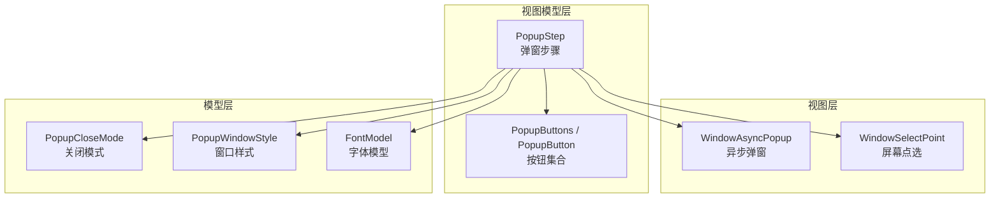
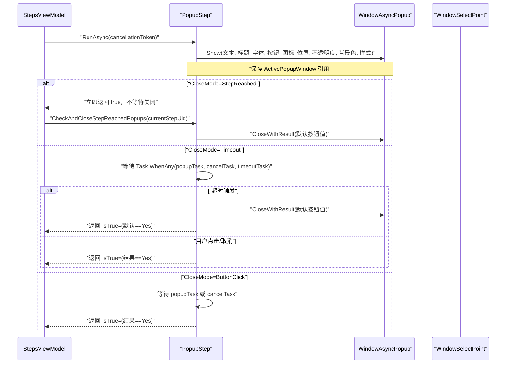
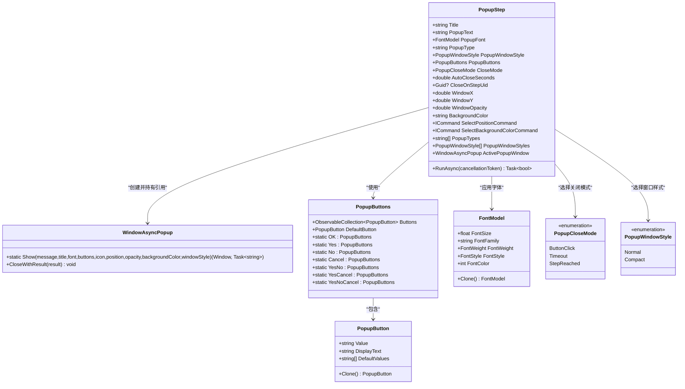
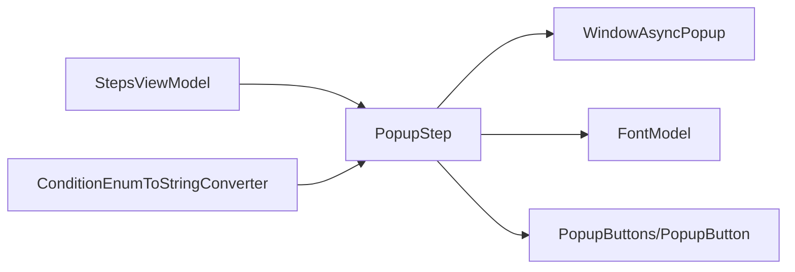
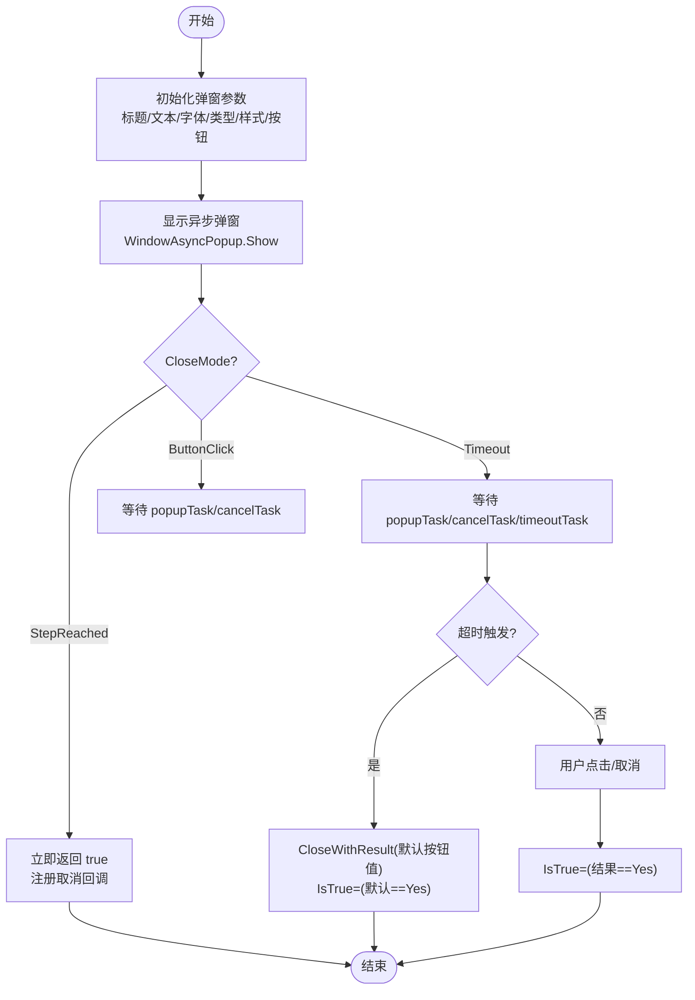

# 弹窗控制步骤

<cite>
**本文引用的文件**   
- [AutomationStep.cs](file://ShaoLu/Viewmodels/AutomationStep.cs)
- [AutomationStepModel.cs](file://ShaoLu/Models/AutomationStepModel.cs)
- [FontModel.cs](file://ShaoLu/Models/FontModel.cs)
- [PopupButton.cs](file://ShaoLu/Viewmodels/PopupButton.cs)
- [WindowAsyncPopup.xaml.cs](file://ShaoLu/Views/WindowAsyncPopup.xaml.cs)
- [WindowSelectPoint.xaml.cs](file://ShaoLu/Views/WindowSelectPoint.xaml.cs)
- [StepsViewModel.cs](file://ShaoLu/Viewmodels/StepsViewModel.cs)
- [ConditionEnumToStringConverter.cs](file://ShaoLu/Converters/ConditionEnumToStringConverter.cs)
- [Strings.resx](file://ShaoLu/Resources/Strings.resx)
- [AutomationStepTests.cs](file://NUnitTest/AutomationStepTests.cs)
</cite>

## 目录
1. [简介](#简介)
2. [项目结构](#项目结构)
3. [核心组件](#核心组件)
4. [架构总览](#架构总览)
5. [详细组件分析](#详细组件分析)
6. [依赖关系分析](#依赖关系分析)
7. [性能考量](#性能考量)
8. [故障排查指南](#故障排查指南)
9. [结论](#结论)
10. [附录](#附录)

## 简介
本文件为 ShaoLu 应用的“弹窗控制步骤”（PopupStep）提供系统化、可操作的文档。内容覆盖：
- 基本配置属性：Title、PopupText、PopupFont（含 FontFamily、FontSize、FontWeight、FontStyle、FontColor）
- 弹窗类型与窗口样式：PopupType、PopupWindowStyle
- 关闭模式 CloseMode：ButtonClick、Timeout、StepReached
- 自动关闭时间 AutoCloseSeconds 与目标步骤 UID CloseOnStepUid
- 窗口外观：WindowX/WindowY、WindowOpacity、BackgroundColor
- 命令集成：SelectPositionCommand、SelectBackgroundColorCommand，以及与 WindowSelectPoint 和颜色选择器的协作
- 生命周期管理：ActivePopupWindow 运行时实例管理、错误处理与用户体验优化建议

## 项目结构
PopupStep 相关代码分布在 Viewmodels、Models、Views 三个层次：
- Viewmodels：定义 PopupStep 及其命令、按钮集合等
- Models：定义枚举（PopupCloseMode、PopupWindowStyle）、字体模型（FontModel）
- Views：异步弹窗窗口（WindowAsyncPopup）、点选窗口（WindowSelectPoint）

图表来源
- [AutomationStep.cs:683-950](file://ShaoLu/Viewmodels/AutomationStep.cs#L683-L950)
- [WindowAsyncPopup.xaml.cs:41-60](file://ShaoLu/Views/WindowAsyncPopup.xaml.cs#L41-L60)
- [WindowSelectPoint.xaml.cs:26-31](file://ShaoLu/Views/WindowSelectPoint.xaml.cs#L26-L31)
- [AutomationStepModel.cs:48-67](file://ShaoLu/Models/AutomationStepModel.cs#L48-L67)
- [FontModel.cs:1-46](file://ShaoLu/Models/FontModel.cs#L1-L46)
- [PopupButton.cs:1-113](file://ShaoLu/Viewmodels/PopupButton.cs#L1-L113)

章节来源
- [AutomationStep.cs:683-950](file://ShaoLu/Viewmodels/AutomationStep.cs#L683-L950)
- [AutomationStepModel.cs:48-67](file://ShaoLu/Models/AutomationStepModel.cs#L48-L67)
- [FontModel.cs:1-46](file://ShaoLu/Models/FontModel.cs#L1-L46)
- [PopupButton.cs:1-113](file://ShaoLu/Viewmodels/PopupButton.cs#L1-L113)
- [WindowAsyncPopup.xaml.cs:41-60](file://ShaoLu/Views/WindowAsyncPopup.xaml.cs#L41-L60)
- [WindowSelectPoint.xaml.cs:26-31](file://ShaoLu/Views/WindowSelectPoint.xaml.cs#L26-L31)

## 核心组件
- PopupStep：弹窗步骤的运行时配置与执行逻辑，包含标题、文本、字体、类型、样式、按钮、关闭模式、位置、不透明度、背景色等属性，以及命令与生命周期管理。
- WindowAsyncPopup：非模态异步弹窗窗口，支持自定义位置、背景色、不透明度、紧凑样式、图标、富文本消息、按钮行为与结果返回。
- PopupButtons/PopupButton：按钮集合与默认按钮，支持本地化显示文本与深拷贝。
- FontModel：字体模型，封装字号、族名、粗细、样式、颜色等，并提供 Clone。
- PopupCloseMode/PopupWindowStyle：关闭模式与窗口样式的枚举定义。

章节来源
- [AutomationStep.cs:683-950](file://ShaoLu/Viewmodels/AutomationStep.cs#L683-L950)
- [WindowAsyncPopup.xaml.cs:41-60](file://ShaoLu/Views/WindowAsyncPopup.xaml.cs#L41-L60)
- [PopupButton.cs:1-113](file://ShaoLu/Viewmodels/PopupButton.cs#L1-L113)
- [FontModel.cs:1-46](file://ShaoLu/Models/FontModel.cs#L1-L46)
- [AutomationStepModel.cs:48-67](file://ShaoLu/Models/AutomationStepModel.cs#L48-L67)

## 架构总览
PopupStep 通过 RunAsync 启动 WindowAsyncPopup，并根据 CloseMode 决定等待策略与关闭时机；在 StepReached 模式下由执行引擎根据当前步骤 Uid 主动关闭弹窗。

图表来源
- [AutomationStep.cs:888-1014](file://ShaoLu/Viewmodels/AutomationStep.cs#L888-L1014)
- [WindowAsyncPopup.xaml.cs:41-60](file://ShaoLu/Views/WindowAsyncPopup.xaml.cs#L41-L60)
- [StepsViewModel.cs:714-728](file://ShaoLu/Viewmodels/StepsViewModel.cs#L714-L728)

## 详细组件分析

### 基本配置属性
- Title：弹窗标题，用于窗口标题栏与内部标题控件显示。
- PopupText：弹窗正文，支持富文本序列化/反序列化。
- PopupFont：字体模型，包含 FontFamily、FontSize、FontWeight、FontStyle、FontColor，默认使用系统消息字体与颜色。
- PopupType：弹窗类型（None、Information、Warning、Error、Question），映射到系统图标。
- PopupWindowStyle：Normal（正常）或 Compact（紧凑，减小边距与控件尺寸）。

章节来源
- [AutomationStep.cs:686-712](file://ShaoLu/Viewmodels/AutomationStep.cs#L686-L712)
- [FontModel.cs:1-46](file://ShaoLu/Models/FontModel.cs#L1-L46)
- [AutomationStepModel.cs:61-67](file://ShaoLu/Models/AutomationStepModel.cs#L61-L67)

### 关闭模式 CloseMode
- ButtonClick：用户点击按钮后关闭，等待弹窗任务完成。
- Timeout：在 AutoCloseSeconds 秒后自动关闭，返回默认按钮值；若未设置默认按钮则返回空字符串。
- StepReached：到达指定步骤时关闭弹窗，不阻塞后续执行；由执行引擎在 CheckAndCloseStepReachedPopups 中根据 CloseOnStepUid 匹配并调用 CloseWithResult。

章节来源
- [AutomationStepModel.cs:48-56](file://ShaoLu/Models/AutomationStepModel.cs#L48-L56)
- [AutomationStep.cs:714-728](file://ShaoLu/Viewmodels/AutomationStep.cs#L714-L728)
- [StepsViewModel.cs:714-728](file://ShaoLu/Viewmodels/StepsViewModel.cs#L714-L728)

### 自动关闭时间与目标步骤 UID
- AutoCloseSeconds：Timeout 模式下的秒数，需大于 0 才生效。
- CloseOnStepUid：StepReached 模式的目标步骤 Uid，执行引擎遍历所有步骤，匹配当前步骤 Uid 并关闭对应弹窗。

章节来源
- [AutomationStep.cs:720-727](file://ShaoLu/Viewmodels/AutomationStep.cs#L720-L727)
- [StepsViewModel.cs:714-728](file://ShaoLu/Viewmodels/StepsViewModel.cs#L714-L728)

### 窗口外观配置
- WindowX/WindowY：窗口位置，负值表示居中显示；有值时将手动设置 Left/Top。
- WindowOpacity：不透明度百分比（1~100），内部转换为 0.01~1.0 的浮点值。
- BackgroundColor：十六进制颜色字符串，解析失败回退到白色。

章节来源
- [AutomationStep.cs:732-751](file://ShaoLu/Viewmodels/AutomationStep.cs#L732-L751)
- [WindowAsyncPopup.xaml.cs:96-107](file://ShaoLu/Views/WindowAsyncPopup.xaml.cs#L96-L107)

### SelectPositionCommand 与 SelectBackgroundColorCommand
- SelectPositionCommand：打开全屏点选窗口 WindowSelectPoint，获取用户选择的坐标并赋值给 WindowX/WindowY。
- SelectBackgroundColorCommand：打开颜色选择器，将选择的颜色以十六进制格式写入 BackgroundColor；异常时回退到默认白色。

章节来源
- [AutomationStep.cs:752-791](file://ShaoLu/Viewmodels/AutomationStep.cs#L752-L791)
- [WindowSelectPoint.xaml.cs:26-31](file://ShaoLu/Views/WindowSelectPoint.xaml.cs#L26-L31)

### 弹窗类型与按钮
- PopupTypes：可用类型列表（None、Information、Warning、Error、Question）。
- PopupButtons：按钮集合与默认按钮，支持工厂方法（OK、Yes、No、Cancel、YesNo、YesCancel、YesNoCancel），DisplayText 基于 Value 进行本地化。

章节来源
- [AutomationStep.cs:804-808](file://ShaoLu/Viewmodels/AutomationStep.cs#L804-L808)
- [PopupButton.cs:1-113](file://ShaoLu/Viewmodels/PopupButton.cs#L1-L113)

### 生命周期管理与 ActivePopupWindow
- RunAsync 启动弹窗后，将 ActivePopupWindow 指向当前 WindowAsyncPopup 实例，供 StepReached 模式使用。
- 在 finally 块中清空 ActivePopupWindow，避免残留引用。
- StepReached 模式注册取消令牌回调，确保运行停止时关闭弹窗。

章节来源
- [AutomationStep.cs:904-924](file://ShaoLu/Viewmodels/AutomationStep.cs#L904-L924)
- [AutomationStep.cs:1010-1014](file://ShaoLu/Viewmodels/AutomationStep.cs#L1010-L1014)

### 执行流程与结果判定
- ButtonClick/StepReached：等待弹窗任务或取消任务，用户点击按钮后根据返回值判断 IsTrue（等于 Yes 时为真）。
- Timeout：当超时任务先完成时，调用 CloseWithResult 返回默认按钮值，IsTrue 取决于默认按钮是否为 Yes。

章节来源
- [AutomationStep.cs:950-1001](file://ShaoLu/Viewmodels/AutomationStep.cs#L950-L1001)

### 类图（代码级）

图表来源
- [AutomationStep.cs:683-950](file://ShaoLu/Viewmodels/AutomationStep.cs#L683-L950)
- [WindowAsyncPopup.xaml.cs:41-60](file://ShaoLu/Views/WindowAsyncPopup.xaml.cs#L41-L60)
- [PopupButton.cs:1-113](file://ShaoLu/Viewmodels/PopupButton.cs#L1-L113)
- [FontModel.cs:1-46](file://ShaoLu/Models/FontModel.cs#L1-L46)
- [AutomationStepModel.cs:48-67](file://ShaoLu/Models/AutomationStepModel.cs#L48-L67)

## 依赖关系分析
- PopupStep 依赖 WindowAsyncPopup 进行 UI 展示与交互。
- PopupStep 依赖 FontModel 进行字体渲染。
- PopupStep 依赖 PopupButtons/PopupButton 定义按钮与默认值。
- StepsViewModel 在执行过程中检查并关闭 StepReached 模式的弹窗。
- ConditionEnumToStringConverter 提供 CloseMode 的本地化转换。

图表来源
- [StepsViewModel.cs:714-728](file://ShaoLu/Viewmodels/StepsViewModel.cs#L714-L728)
- [ConditionEnumToStringConverter.cs:25-26](file://ShaoLu/Converters/ConditionEnumToStringConverter.cs#L25-L26)
- [ConditionEnumToStringConverter.cs:104-108](file://ShaoLu/Converters/ConditionEnumToStringConverter.cs#L104-L108)

章节来源
- [StepsViewModel.cs:714-728](file://ShaoLu/Viewmodels/StepsViewModel.cs#L714-L728)
- [ConditionEnumToStringConverter.cs:25-26](file://ShaoLu/Converters/ConditionEnumToStringConverter.cs#L25-L26)
- [ConditionEnumToStringConverter.cs:104-108](file://ShaoLu/Converters/ConditionEnumToStringConverter.cs#L104-L108)

## 性能考量
- 图标缓存：WindowAsyncPopup 静态构造预加载常用系统图标，减少 GDI+ 到 WPF 的重复转换开销。
- 紧凑模式：Compact 样式降低最小尺寸与边距，减少布局计算与绘制压力。
- 非模态显示：Show 返回 Task，不阻塞主线程，提升响应性。
- 资源清理：Closed 事件中释放 TCS 引用，避免内存泄漏。

章节来源
- [WindowAsyncPopup.xaml.cs:26-34](file://ShaoLu/Views/WindowAsyncPopup.xaml.cs#L26-L34)
- [WindowAsyncPopup.xaml.cs:144-170](file://ShaoLu/Views/WindowAsyncPopup.xaml.cs#L144-L170)
- [WindowAsyncPopup.xaml.cs:198-206](file://ShaoLu/Views/WindowAsyncPopup.xaml.cs#L198-L206)

## 故障排查指南
- 弹窗未关闭：检查 CloseMode 是否正确；StepReached 模式下确认 CloseOnStepUid 是否匹配当前步骤 Uid。
- 超时无效：AutoCloseSeconds 必须大于 0；确保取消令牌未被提前触发。
- 背景色异常：BackgroundColor 应为合法十六进制字符串；解析失败会回退到白色。
- 位置不生效：WindowX/WindowY 需为非负值才会启用手动定位；否则居中显示。
- 结果判定不符合预期：IsTrue 取决于弹窗返回值是否为 Yes；Timeout 模式下取决于默认按钮值。

章节来源
- [AutomationStep.cs:950-1001](file://ShaoLu/Viewmodels/AutomationStep.cs#L950-L1001)
- [WindowAsyncPopup.xaml.cs:96-107](file://ShaoLu/Views/WindowAsyncPopup.xaml.cs#L96-L107)
- [StepsViewModel.cs:714-728](file://ShaoLu/Viewmodels/StepsViewModel.cs#L714-L728)

## 结论
PopupStep 提供了灵活的弹窗控制能力，涵盖丰富的外观与交互配置，并通过三种关闭模式满足不同场景需求。结合 WindowAsyncPopup 的非模态设计与 ActivePopupWindow 的生命周期管理，能够在保证用户体验的同时实现稳定的自动化流程控制。建议在复杂流程中优先使用 StepReached 模式进行跨步骤联动，并结合 Timeout 模式提升容错性与可用性。

## 附录

### 关键流程图（算法级）

图表来源
- [AutomationStep.cs:888-1014](file://ShaoLu/Viewmodels/AutomationStep.cs#L888-L1014)
- [WindowAsyncPopup.xaml.cs:41-60](file://ShaoLu/Views/WindowAsyncPopup.xaml.cs#L41-L60)

### 测试要点（参考）
- 默认构造函数设置 Type=Popup
- 名称构造函数设置 Name 与 Title
- 默认属性包括 PopupType、PopupTypes 列表
- Clone 正确复制所有属性

章节来源
- [AutomationStepTests.cs:244-305](file://NUnitTest/AutomationStepTests.cs#L244-L305)