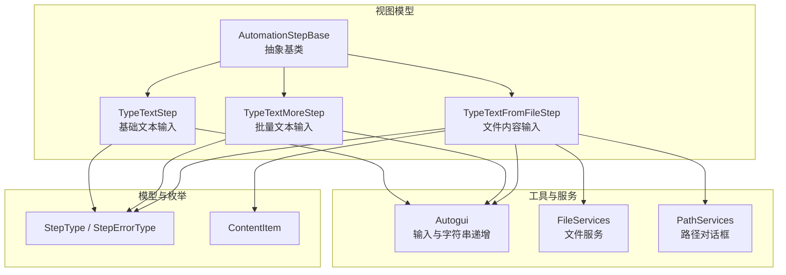
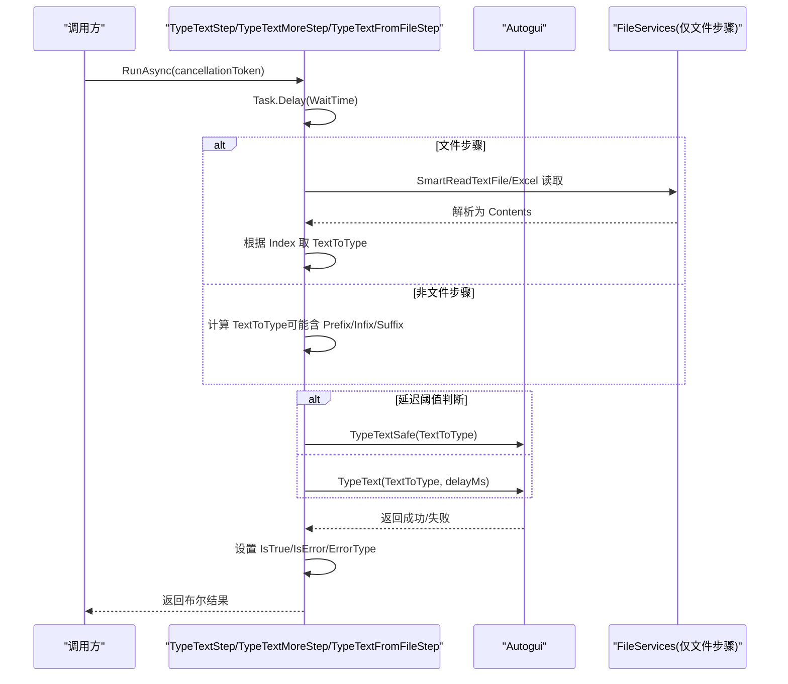
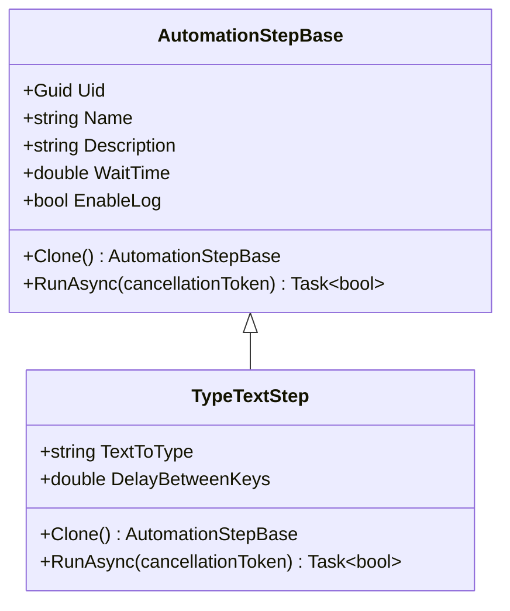
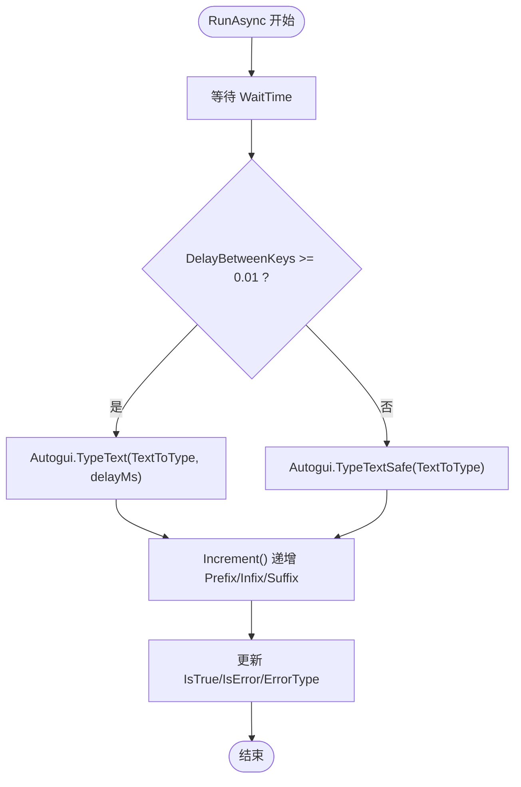
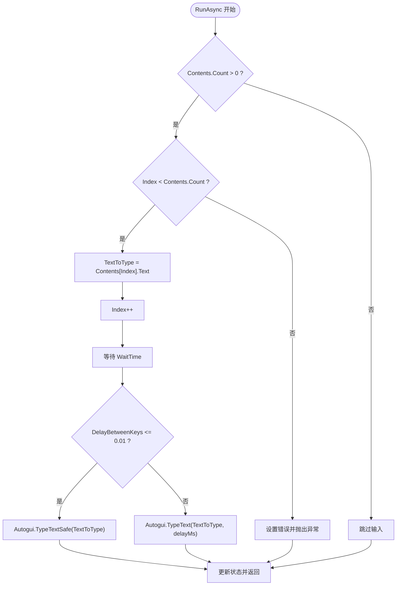
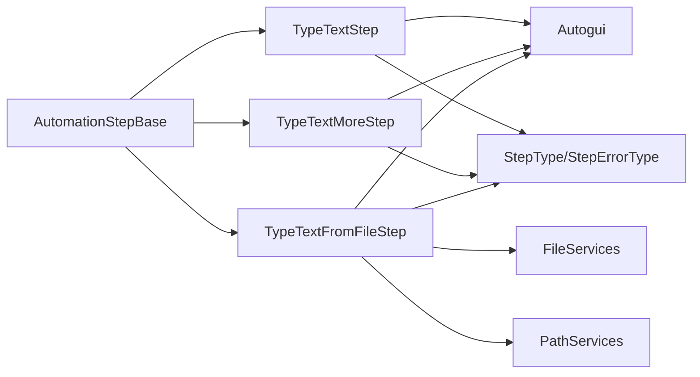

# 文本输入步骤

<cite>
**本文引用的文件**   
- [AutomationStep.cs](file://ShaoLu/Viewmodels/AutomationStep.cs)
- [Autogui.cs](file://ShaoLu/Utils/Autogui.cs)
- [ContentItem.cs](file://ShaoLu/Models/ContentItem.cs)
- [Services.cs](file://ShaoLu/Services/Services.cs)
- [AutomationStepModel.cs](file://ShaoLu/Models/AutomationStepModel.cs)
- [StepTemplateSelector.cs](file://ShaoLu/Converters/StepTemplateSelector.cs)
</cite>

## 目录
1. [简介](#简介)
2. [项目结构](#项目结构)
3. [核心组件](#核心组件)
4. [架构总览](#架构总览)
5. [详细组件分析](#详细组件分析)
6. [依赖关系分析](#依赖关系分析)
7. [性能考虑](#性能考虑)
8. [故障排查指南](#故障排查指南)
9. [结论](#结论)
10. [附录](#附录)

## 简介
本文件为 ShaoLu 应用的“文本输入步骤”提供系统化文档，覆盖以下三种类型：
- TypeTextStep（基础文本输入）
- TypeTextMoreStep（批量文本输入，支持前缀/中缀/后缀组合与递增生成）
- TypeTextFromFileStep（从文件读取内容输入，支持 .txt、.csv、.xlsx）

重点说明：
- TextToType 属性：最终要输入的文本
- DelayBetweenKeys：按键间隔（秒），影响底层输入方式的选择
- Autogui.TypeTextSafe：安全输入方法（通过剪贴板+Ctrl+V），避免直接键盘事件在某些目标窗口失效
- TypeTextMoreStep 的 Prefix/Infix/Suffix 组合与 Prefix_gen/Infix_gen/Suffix_gen 递增生成，以及 Reload 重新加载机制
- TypeTextFromFileStep 的文件读取、Contents 集合管理、Index 索引控制、Delimiter 分隔符配置
- 各步骤类型的 Clone 方法实现、RunAsync 执行流程、错误处理与性能优化建议

## 项目结构
文本输入步骤的实现集中在 Viewmodels/AutomationStep.cs，底层输入能力在 Utils/Autogui.cs，数据模型与枚举定义在 Models 与 Services 层。UI 模板选择器将步骤类型映射到对应模板。

图表来源
- [AutomationStep.cs:25-296](file://ShaoLu/Viewmodels/AutomationStep.cs#L25-L296)
- [AutomationStep.cs:300-365](file://ShaoLu/Viewmodels/AutomationStep.cs#L300-L365)
- [AutomationStep.cs:367-516](file://ShaoLu/Viewmodels/AutomationStep.cs#L367-L516)
- [AutomationStep.cs:518-680](file://ShaoLu/Viewmodels/AutomationStep.cs#L518-L680)
- [Autogui.cs:427-651](file://ShaoLu/Utils/Autogui.cs#L427-L651)
- [Services.cs:83-119](file://ShaoLu/Services/Services.cs#L83-L119)
- [AutomationStepModel.cs:9-43](file://ShaoLu/Models/AutomationStepModel.cs#L9-L43)
- [ContentItem.cs](file://ShaoLu/Models/ContentItem.cs)

章节来源
- [AutomationStep.cs:25-296](file://ShaoLu/Viewmodels/AutomationStep.cs#L25-L296)
- [AutomationStepModel.cs:9-43](file://ShaoLu/Models/AutomationStepModel.cs#L9-L43)
- [StepTemplateSelector.cs:31-45](file://ShaoLu/Converters/StepTemplateSelector.cs#L31-L45)

## 核心组件
- AutomationStepBase：所有步骤的抽象基类，提供通用属性（Uid、Name、Description、WaitTime、EnableLog、条件判断、跳转等）与抽象方法 Clone()、RunAsync()。
- TypeTextStep：基础文本输入，使用 TextToType 与 DelayBetweenKeys 控制输入内容与按键节奏，内部根据延迟阈值选择 Autogui.TypeTextSafe 或 Autogui.TypeText。
- TypeTextMoreStep：批量文本输入，支持 Prefix/Infix/Suffix 拼接与可选递增生成（Prefix_gen/Infix_gen/Suffix_gen），每次 RunAsync 后自动递增并更新 TextToType；Reload 可将当前编辑值同步回运行时副本。
- TypeTextFromFileStep：从文件读取内容，支持 .txt/.csv（按 Delimiter 分割）和 .xlsx（读取首列），通过 Contents 集合与 Index 控制逐条输入；Index 越界时抛出异常并标记错误。

章节来源
- [AutomationStep.cs:25-296](file://ShaoLu/Viewmodels/AutomationStep.cs#L25-L296)
- [AutomationStep.cs:300-365](file://ShaoLu/Viewmodels/AutomationStep.cs#L300-L365)
- [AutomationStep.cs:367-516](file://ShaoLu/Viewmodels/AutomationStep.cs#L367-L516)
- [AutomationStep.cs:518-680](file://ShaoLu/Viewmodels/AutomationStep.cs#L518-L680)

## 架构总览
文本输入步骤的执行流程统一由 RunAsync 驱动，遵循“等待→输入→状态更新”的模式。输入阶段根据参数选择不同策略：
- 小延迟（接近 0）优先使用 Autogui.TypeTextSafe（剪贴板+Ctrl+V），提高兼容性与稳定性
- 较大延迟时使用 Autogui.TypeText（逐键模拟），便于观察打字效果

图表来源
- [AutomationStep.cs:345-364](file://ShaoLu/Viewmodels/AutomationStep.cs#L345-L364)
- [AutomationStep.cs:499-515](file://ShaoLu/Viewmodels/AutomationStep.cs#L499-L515)
- [AutomationStep.cs:651-679](file://ShaoLu/Viewmodels/AutomationStep.cs#L651-L679)
- [Autogui.cs:569-651](file://ShaoLu/Utils/Autogui.cs#L569-L651)
- [Services.cs:83-119](file://ShaoLu/Services/Services.cs#L83-L119)

## 详细组件分析

### TypeTextStep（基础文本输入）
- 关键属性
  - TextToType：要输入的文本
  - DelayBetweenKeys：按键间隔（秒）。当小于 0.01 秒时，采用 Autogui.TypeTextSafe；否则采用 Autogui.TypeText
- 执行流程
  - 等待 WaitTime
  - 后台线程执行输入，依据 DelayBetweenKeys 选择输入方法
  - 更新 IsTrue、IsError、ErrorType
- Clone 实现
  - 复制 Name、Description、TextToType、DelayBetweenKeys、WaitTime、跳转与开关属性等

图表来源
- [AutomationStep.cs:25-296](file://ShaoLu/Viewmodels/AutomationStep.cs#L25-L296)
- [AutomationStep.cs:300-365](file://ShaoLu/Viewmodels/AutomationStep.cs#L300-L365)

章节来源
- [AutomationStep.cs:300-365](file://ShaoLu/Viewmodels/AutomationStep.cs#L300-L365)
- [Autogui.cs:569-651](file://ShaoLu/Utils/Autogui.cs#L569-L651)

### TypeTextMoreStep（批量文本输入）
- 关键属性
  - TextToType：最终输入文本（由 Prefix + Infix + Suffix 动态拼接）
  - Prefix/Infix/Suffix：三段可编辑文本
  - Prefix_gen/Infix_gen/Suffix_gen：是否对相应段启用递增生成
  - DelayBetweenKeys：按键间隔
  - ReloadText：用于触发 Reload 重新加载（将编辑值同步至运行时副本）
- 递增逻辑
  - 每次 RunAsync 结束后调用 Increment()，根据三个 _gen 标志分别对 _prefix_/_infix_/_suffix_ 调用 Autogui.IncrementString，再重组 TextToType
- Reload 机制
  - Reload() 将当前编辑值（_prefix/_infix/_suffix）同步到运行时变量（_prefix_/_infix_/_suffix_），并重建 TextToType
- Clone 实现
  - 复制 Prefix/Infix/Suffix、ReloadText、_gen 标志、TextToType、DelayBetweenKeys、WaitTime、跳转与开关属性等

图表来源
- [AutomationStep.cs:367-516](file://ShaoLu/Viewmodels/AutomationStep.cs#L367-L516)
- [Autogui.cs:427-567](file://ShaoLu/Utils/Autogui.cs#L427-L567)

章节来源
- [AutomationStep.cs:367-516](file://ShaoLu/Viewmodels/AutomationStep.cs#L367-L516)
- [Autogui.cs:427-567](file://ShaoLu/Utils/Autogui.cs#L427-L567)

### TypeTextFromFileStep（文件内容输入）
- 关键属性
  - FilePath：文件路径
  - Contents： ObservableCollection<ContentItem>，存放待输入的内容项
  - Index：当前读取索引，每次输入后自增
  - DelayBetweenKeys：按键间隔
  - Delimiter：分割符数组（默认包含换行、回车、制表符、逗号、分号、竖线）
  - ReloadIndex：重置索引（ResetIndex 命令）
- 文件读取
  - .txt/.csv：通过 FileServices.SmartReadTextFile 读取文本，再用 Delimiter 分割成多行，每行一个 ContentItem
  - .xlsx：使用 EPPlus 读取工作簿第一个工作表的第一列，逐行填充 Contents
- 执行流程
  - 若 Contents 为空则跳过输入
  - 检查 Index 是否越界，越界则设置错误状态并抛出异常
  - 取 Contents[Index].Text 作为 TextToType，随后 Index++
  - 根据 DelayBetweenKeys 选择 TypeTextSafe 或 TypeText
- Clone 实现
  - 深拷贝 Contents（每个 ContentItem 新建实例），复制 FilePath、TextToType、DelayBetweenKeys、Index、ReloadIndex、跳转与开关属性等

图表来源
- [AutomationStep.cs:518-680](file://ShaoLu/Viewmodels/AutomationStep.cs#L518-L680)
- [Services.cs:83-119](file://ShaoLu/Services/Services.cs#L83-L119)

章节来源
- [AutomationStep.cs:518-680](file://ShaoLu/Viewmodels/AutomationStep.cs#L518-L680)
- [Services.cs:83-119](file://ShaoLu/Services/Services.cs#L83-L119)

## 依赖关系分析
- 步骤类型均继承自 AutomationStepBase，复用通用属性与执行框架
- 输入能力依赖 Autogui：
  - TypeText：逐键模拟
  - TypeTextSafe：剪贴板+Ctrl+V，STA 线程安全
  - IncrementString：数字/字母后缀递增算法
- 文件步骤依赖 FileServices 与 PathServices：
  - SmartReadTextFile：智能读取文本文件
  - OpenPathDialog：打开文件对话框
- 枚举 StepType 与 StepErrorType 用于 UI 模板选择与错误分类

图表来源
- [AutomationStep.cs:25-296](file://ShaoLu/Viewmodels/AutomationStep.cs#L25-L296)
- [AutomationStep.cs:300-365](file://ShaoLu/Viewmodels/AutomationStep.cs#L300-L365)
- [AutomationStep.cs:367-516](file://ShaoLu/Viewmodels/AutomationStep.cs#L367-L516)
- [AutomationStep.cs:518-680](file://ShaoLu/Viewmodels/AutomationStep.cs#L518-L680)
- [Autogui.cs:427-651](file://ShaoLu/Utils/Autogui.cs#L427-L651)
- [Services.cs:83-119](file://ShaoLu/Services/Services.cs#L83-L119)
- [AutomationStepModel.cs:9-43](file://ShaoLu/Models/AutomationStepModel.cs#L9-L43)

章节来源
- [AutomationStepModel.cs:9-43](file://ShaoLu/Models/AutomationStepModel.cs#L9-L43)
- [StepTemplateSelector.cs:31-45](file://ShaoLu/Converters/StepTemplateSelector.cs#L31-L45)

## 性能考虑
- 输入方式选择
  - 当 DelayBetweenKeys 较小（≤0.01s）时，优先使用 Autogui.TypeTextSafe，减少逐键开销并提升兼容性
  - 需要可见打字效果时，适当增大 DelayBetweenKeys 以启用 Autogui.TypeText
- 文件读取
  - .xlsx 读取仅遍历第一列，避免全表扫描；大文件建议分批处理或在 UI 层限制行数
  - .txt/.csv 使用 Split(Delimiter) 一次性分割，注意分隔符数量与空项过滤
- 异步与取消
  - RunAsync 使用 CancellationToken 支持取消；弹窗与长耗时操作应响应取消信号
- 内存与对象创建
  - Clone 时对 Contents 进行浅拷贝（新建 ContentItem），避免引用共享导致的状态污染
- 日志与诊断
  - 启用 EnableLog 记录执行日志，结合 LastResult 与 ErrorType 快速定位问题

[本节为通用指导，不直接分析具体文件]

## 故障排查指南
- 输入失败或无响应
  - 检查 TextToType 是否为空（Autogui 会抛异常提示）
  - 确认 DelayBetweenKeys 设置合理；过小可能导致目标窗口无法接收逐键事件
  - 使用 Autogui.TypeTextSafe 提高兼容性（剪贴板+Ctrl+V）
- 文件步骤异常
  - 检查 FilePath 是否存在且扩展名合法（.txt/.csv/.xlsx）
  - 确认 Delimiter 与实际文件格式匹配
  - Index 越界时会抛出异常并设置 ErrorType=IndexOutOfRange，需重置 Index 或调整 Contents
- 批量递增异常
  - 确认 Prefix_gen/Infix_gen/Suffix_gen 与初始值符合预期（如空串会被视为“追加1”）
  - 调用 Reload 确保编辑值与运行时一致
- 错误码参考
  - StepErrorType 包括 None、TextEmpty、FileNotFound、FileReadError、ExecutionTimeout、SelfReferenceLimit、CancelledByUser、PopupError、ConversionError、IndexOutOfRange、OCRError、Unknown

章节来源
- [AutomationStep.cs:345-364](file://ShaoLu/Viewmodels/AutomationStep.cs#L345-L364)
- [AutomationStep.cs:499-515](file://ShaoLu/Viewmodels/AutomationStep.cs#L499-L515)
- [AutomationStep.cs:651-679](file://ShaoLu/Viewmodels/AutomationStep.cs#L651-L679)
- [Autogui.cs:569-651](file://ShaoLu/Utils/Autogui.cs#L569-L651)
- [AutomationStepModel.cs:26-43](file://ShaoLu/Models/AutomationStepModel.cs#L26-L43)

## 结论
ShaoLu 的文本输入步骤通过统一的基类与清晰的职责划分，提供了灵活可靠的输入能力：
- TypeTextStep 适用于简单场景，强调可控的按键节奏
- TypeTextMoreStep 适合批量生成与组合输入，具备递增与重载能力
- TypeTextFromFileStep 面向数据驱动场景，支持多种文件格式与分隔符
配合 Autogui 的安全输入方法与完善的错误处理，可在复杂 UI 环境中稳定运行。建议在大批量输入与大数据集场景下关注性能与内存占用，并结合日志与错误码快速定位问题。

[本节为总结性内容，不直接分析具体文件]

## 附录
- 相关枚举与类型
  - StepType：TypeText、TypeTextMore、TypeTextFromFile 等
  - StepErrorType：None、TextEmpty、FileNotFound、IndexOutOfRange 等
- UI 模板映射
  - StepTemplateSelector 将步骤类型映射到对应 XAML 模板，便于可视化编辑

章节来源
- [AutomationStepModel.cs:9-43](file://ShaoLu/Models/AutomationStepModel.cs#L9-L43)
- [StepTemplateSelector.cs:31-45](file://ShaoLu/Converters/StepTemplateSelector.cs#L31-L45)