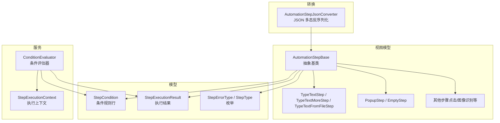
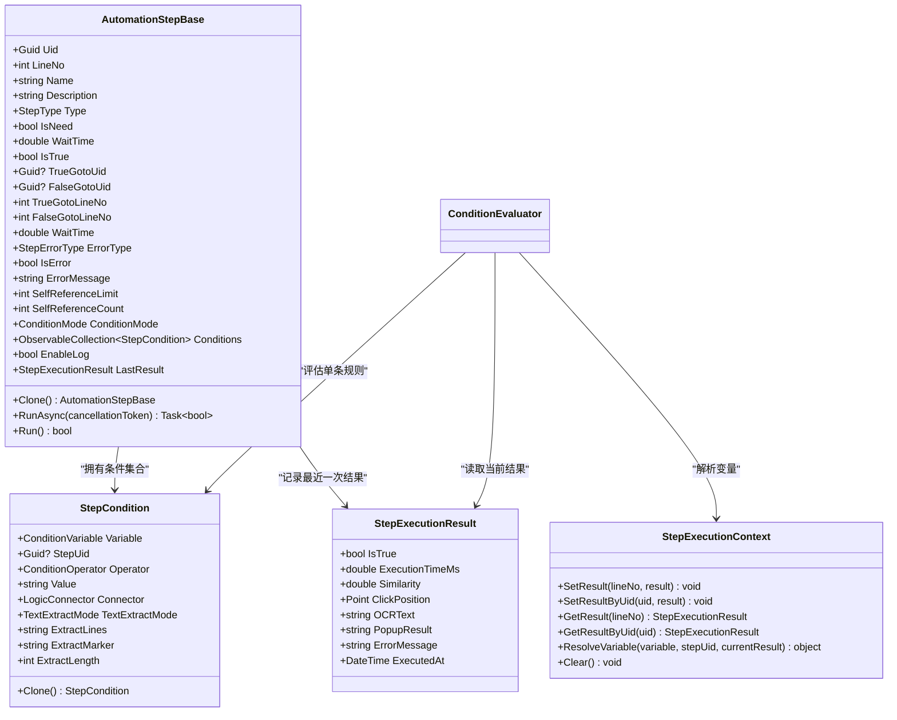
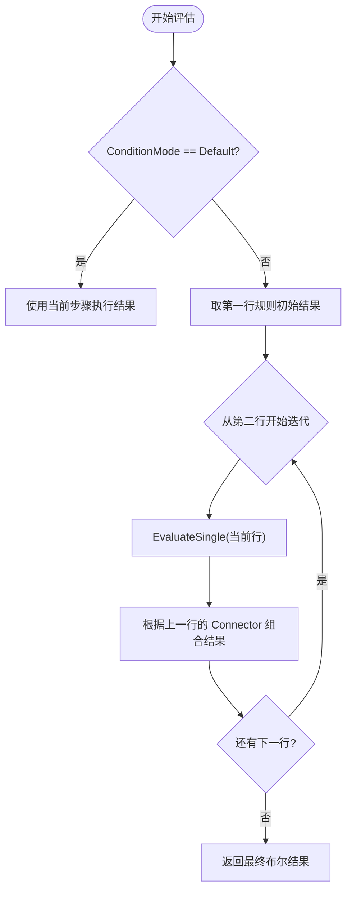
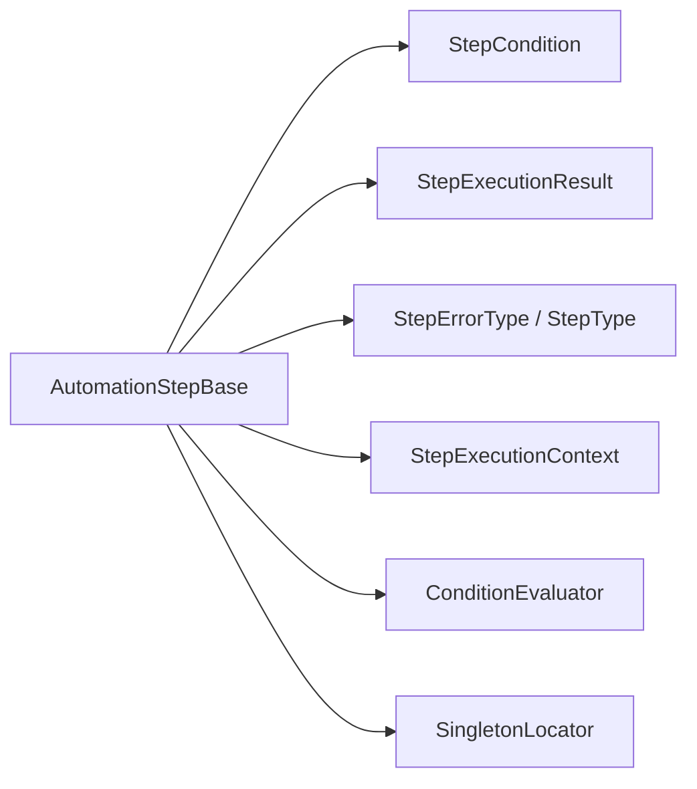

# 步骤基类设计

<cite>
**本文引用的文件**   
- [AutomationStep.cs](file://ShaoLu/Viewmodels/AutomationStep.cs)
- [StepCondition.cs](file://ShaoLu/Models/StepCondition.cs)
- [ConditionEvaluator.cs](file://ShaoLu/Services/ConditionEvaluator.cs)
- [StepExecutionContext.cs](file://ShaoLu/Services/StepExecutionContext.cs)
- [AutomationStepModel.cs](file://ShaoLu/Models/AutomationStepModel.cs)
- [StepExecutionResult.cs](file://ShaoLu/Models/StepExecutionResult.cs)
- [AutomationStepJsonConverter.cs](file://ShaoLu/Converters/AutomationStepJsonConverter.cs)
</cite>

## 目录
1. [简介](#简介)
2. [项目结构](#项目结构)
3. [核心组件](#核心组件)
4. [架构总览](#架构总览)
5. [详细组件分析](#详细组件分析)
6. [依赖关系分析](#依赖关系分析)
7. [性能考量](#性能考量)
8. [故障排查指南](#故障排查指南)
9. [结论](#结论)
10. [附录：继承与扩展最佳实践](#附录继承与扩展最佳实践)

## 简介
本文件围绕 ShaoLu 应用的步骤基类 AutomationStepBase 进行系统化文档化，覆盖其核心属性、条件判断系统、错误处理机制、执行结果管理、跳转控制、自引用限制、构造函数与 Clone/RunAsync 规范，以及基于该基类开发自定义步骤的最佳实践。目标是帮助开发者快速理解并安全扩展自动化流程中的“步骤”抽象。

## 项目结构
- 步骤基类与具体步骤实现位于 Viewmodels/AutomationStep.cs
- 条件模型与枚举定义位于 Models/StepCondition.cs 与 Models/AutomationStepModel.cs
- 条件评估器位于 Services/ConditionEvaluator.cs
- 执行上下文位于 Services/StepExecutionContext.cs
- JSON 多态反序列化支持位于 Converters/AutomationStepJsonConverter.cs
- 执行结果模型位于 Models/StepExecutionResult.cs

图表来源
- [AutomationStep.cs:25-296](file://ShaoLu/Viewmodels/AutomationStep.cs#L25-L296)
- [StepCondition.cs:103-403](file://ShaoLu/Models/StepCondition.cs#L103-L403)
- [ConditionEvaluator.cs:11-294](file://ShaoLu/Services/ConditionEvaluator.cs#L11-L294)
- [StepExecutionContext.cs:11-163](file://ShaoLu/Services/StepExecutionContext.cs#L11-L163)
- [AutomationStepModel.cs:9-43](file://ShaoLu/Models/AutomationStepModel.cs#L9-L43)
- [StepExecutionResult.cs:8-51](file://ShaoLu/Models/StepExecutionResult.cs#L8-L51)
- [AutomationStepJsonConverter.cs:32-139](file://ShaoLu/Converters/AutomationStepJsonConverter.cs#L32-L139)

章节来源
- [AutomationStep.cs:25-296](file://ShaoLu/Viewmodels/AutomationStep.cs#L25-L296)
- [StepCondition.cs:103-403](file://ShaoLu/Models/StepCondition.cs#L103-L403)
- [ConditionEvaluator.cs:11-294](file://ShaoLu/Services/ConditionEvaluator.cs#L11-L294)
- [StepExecutionContext.cs:11-163](file://ShaoLu/Services/StepExecutionContext.cs#L11-L163)
- [AutomationStepModel.cs:9-43](file://ShaoLu/Models/AutomationStepModel.cs#L9-L43)
- [StepExecutionResult.cs:8-51](file://ShaoLu/Models/StepExecutionResult.cs#L8-L51)
- [AutomationStepJsonConverter.cs:32-139](file://ShaoLu/Converters/AutomationStepJsonConverter.cs#L32-L139)

## 核心组件
- 步骤基类 AutomationStepBase：提供所有步骤的通用元数据、执行控制、跳转、条件、日志与结果能力。
- 条件系统：通过 ConditionMode 与 Conditions 列表实现可配置的条件判断，由 ConditionEvaluator 统一评估。
- 执行上下文 StepExecutionContext：维护各步骤的执行结果、统计与变量解析，供条件评估使用。
- 执行结果 StepExecutionResult：结构化记录每次执行的布尔结果、耗时、相似度、OCR 文本、弹窗结果等。
- 错误类型 StepErrorType：标准化错误分类，便于诊断与展示。
- JSON 多态反序列化：根据 StepType 字段动态实例化具体步骤子类。

章节来源
- [AutomationStep.cs:25-296](file://ShaoLu/Viewmodels/AutomationStep.cs#L25-L296)
- [StepCondition.cs:103-403](file://ShaoLu/Models/StepCondition.cs#L103-L403)
- [ConditionEvaluator.cs:11-294](file://ShaoLu/Services/ConditionEvaluator.cs#L11-L294)
- [StepExecutionContext.cs:11-163](file://ShaoLu/Services/StepExecutionContext.cs#L11-L163)
- [StepExecutionResult.cs:8-51](file://ShaoLu/Models/StepExecutionResult.cs#L8-L51)
- [AutomationStepModel.cs:9-43](file://ShaoLu/Models/AutomationStepModel.cs#L9-L43)
- [AutomationStepJsonConverter.cs:32-139](file://ShaoLu/Converters/AutomationStepJsonConverter.cs#L32-L139)

## 架构总览
下图展示了步骤基类与其相关组件之间的交互关系，包括属性、条件、执行上下文与结果模型。

图表来源
- [AutomationStep.cs:25-296](file://ShaoLu/Viewmodels/AutomationStep.cs#L25-L296)
- [StepCondition.cs:103-403](file://ShaoLu/Models/StepCondition.cs#L103-L403)
- [StepExecutionContext.cs:11-163](file://ShaoLu/Services/StepExecutionContext.cs#L11-L163)
- [StepExecutionResult.cs:8-51](file://ShaoLu/Models/StepExecutionResult.cs#L8-L51)
- [ConditionEvaluator.cs:11-294](file://ShaoLu/Services/ConditionEvaluator.cs#L11-L294)

## 详细组件分析

### 基类核心属性与功能
- 唯一标识 Uid：每个步骤的唯一 GUID，用于跳转与条件引用；setter 忽略 Guid.Empty 以保护已有标识。
- 行号 LineNo：由外部集合或 UI 绑定维护，基类保留 SetProperty 以便手动刷新。
- 元数据 Name、Description、Type：步骤名称、描述与类型枚举。
- 执行控制 IsNeed：是否参与执行；WaitTime：等待时间（秒）。
- 跳转控制 TrueGotoUid、FalseGotoUid：真/假分支的目标步骤 Uid；同时提供只读 TrueGotoLineNo、FalseGotoLineNo 用于 UI 显示。
- 错误处理 IsError、ErrorMessage、ErrorType：运行时错误标志、消息与分类。
- 自引用限制 SelfReferenceLimit、SelfReferenceCount：防止循环调用，-1 无限制，0 禁止，>0 限制次数。
- 条件判断 ConditionMode、Conditions：默认模式使用执行结果，自定义模式使用规则行列表。
- 执行结果 LastResult：最近一次执行的结构化结果（不序列化）。
- 日志 EnableLog：是否记录执行日志。

章节来源
- [AutomationStep.cs:25-296](file://ShaoLu/Viewmodels/AutomationStep.cs#L25-L296)

### 条件判断系统（ConditionMode、Conditions）
- 模式选择：
  - Default：直接使用当前步骤执行结果作为条件值。
  - Custom：使用 Conditions 列表的多行规则进行组合评估。
- 规则行 StepCondition：
  - 变量 Variable：支持常量、当前步骤自身变量、引用其他步骤变量（通过 StepUid），以及“刚刚触发”标记 Step_Triggered。
  - 运算符 Operator：等于、不等于、大于、小于、包含、正则匹配等。
  - 连接器 Connector：AND/OR 连接多行规则。
  - 文本提取：针对 OCR 文本变量支持按行、子串、长度等提取模式。
- 评估器 ConditionEvaluator：
  - Evaluate：按顺序评估多行规则，使用前一行的 Connector 组合结果。
  - EvaluateSingle：解析变量值、预处理文本、执行比较。
  - Compare：支持布尔、数字、字符串及正则匹配。
  - ApplyTextExtraction：对 OCR 文本进行提取与截取。
- 上下文 StepExecutionContext：
  - ResolveVariable：将条件变量解析为实际值，支持 Self_* 与 Step_* 变量。
  - 维护执行结果字典、计数与计时，提供 GetResultByUid、GetStepCount 等辅助方法。

图表来源
- [ConditionEvaluator.cs:23-51](file://ShaoLu/Services/ConditionEvaluator.cs#L23-L51)
- [StepCondition.cs:103-403](file://ShaoLu/Models/StepCondition.cs#L103-L403)
- [StepExecutionContext.cs:112-160](file://ShaoLu/Services/StepExecutionContext.cs#L112-L160)

章节来源
- [StepCondition.cs:103-403](file://ShaoLu/Models/StepCondition.cs#L103-L403)
- [ConditionEvaluator.cs:11-294](file://ShaoLu/Services/ConditionEvaluator.cs#L11-L294)
- [StepExecutionContext.cs:11-163](file://ShaoLu/Services/StepExecutionContext.cs#L11-L163)

### 错误处理机制（IsError、ErrorMessage、ErrorType）
- IsError：运行时错误标志，在异常或失败路径设置。
- ErrorMessage：错误详情文本，便于 UI 展示与日志输出。
- ErrorType：标准化错误分类，如图片未找到、文件读取错误、超时、索引越界、OCR 错误等。
- 典型用法：在执行失败时设置 IsError=true、ErrorMessage=异常信息、ErrorType=对应枚举，并在最后恢复为 None。

章节来源
- [AutomationStepModel.cs:26-43](file://ShaoLu/Models/AutomationStepModel.cs#L26-L43)
- [AutomationStep.cs:25-296](file://ShaoLu/Viewmodels/AutomationStep.cs#L25-L296)

### 执行结果管理（LastResult）
- LastResult：记录最近一次执行的结构化结果，包含 IsTrue、ExecutionTimeMs、Similarity、ClickPosition、OCRText、PopupResult、ErrorMessage、ExecutedAt。
- 用途：供条件评估（Self_* 变量）、统计窗口展示与调试。

章节来源
- [StepExecutionResult.cs:8-51](file://ShaoLu/Models/StepExecutionResult.cs#L8-L51)
- [AutomationStep.cs:25-296](file://ShaoLu/Viewmodels/AutomationStep.cs#L25-L296)

### 跳转控制（TrueGotoUid、FalseGotoUid）与自引用限制
- TrueGotoUid、FalseGotoUid：指定真/假分支的目标步骤 Uid；UI 可通过 TrueGotoLineNo、FalseGotoLineNo 显示目标行号。
- AllSteps：提供包含“无跳转”占位项的步骤集合，用于下拉选择。
- SelfReferenceLimit、SelfReferenceCount：防止自引用导致的无限循环；-1 表示无限制，0 表示禁止，>0 限制最大次数。

章节来源
- [AutomationStep.cs:114-192](file://ShaoLu/Viewmodels/AutomationStep.cs#L114-L192)

### 构造函数设计与 Clone/RunAsync 规范
- 构造函数：
  - 默认构造：初始化 LineNo、Name、Description 等默认值。
  - 带参构造：方便测试与初始化，设置 Name 与 Type。
  - 占位构造：内部用于创建“无跳转”占位项（Uid=Guid.Empty）。
- Clone：
  - 必须深拷贝所有可变状态（集合、对象引用），确保克隆后的步骤独立于原实例。
  - 示例：TypeTextStep、PopupStep、EmptyStep 等均实现了 Clone，复制关键属性与集合。
- RunAsync：
  - 异步执行入口，支持取消令牌；同步封装 Run() 调用。
  - 子类需实现业务逻辑，设置 IsTrue、IsError、ErrorType、LastResult 等。

章节来源
- [AutomationStep.cs:272-296](file://ShaoLu/Viewmodels/AutomationStep.cs#L272-L296)
- [AutomationStep.cs:329-342](file://ShaoLu/Viewmodels/AutomationStep.cs#L329-L342)
- [AutomationStep.cs:861-886](file://ShaoLu/Viewmodels/AutomationStep.cs#L861-L886)
- [AutomationStep.cs:1100-1111](file://ShaoLu/Viewmodels/AutomationStep.cs#L1100-L1111)

### JSON 多态反序列化
- AutomationStepJsonConverter：根据 JSON 中 Type 字段决定实例化哪个子类，兼容旧版 TrueGoto/FalseGoto 数字格式，延迟解析待处理的跳转。

章节来源
- [AutomationStepJsonConverter.cs:32-139](file://ShaoLu/Converters/AutomationStepJsonConverter.cs#L32-L139)

## 依赖关系分析
- AutomationStepBase 依赖：
  - StepCondition：条件规则集合。
  - StepExecutionResult：执行结果。
  - StepErrorType/StepType：枚举定义。
  - StepExecutionContext：条件变量解析与执行结果存储。
  - ConditionEvaluator：条件评估逻辑。
  - SingletonLocator：获取全局步骤集合（AllSteps、GotoPlaceholder）。
- 耦合与内聚：
  - 基类高内聚地封装了步骤通用能力，具体步骤子类仅关注业务逻辑。
  - 条件系统与执行上下文解耦，便于扩展新的变量与评估策略。

图表来源
- [AutomationStep.cs:25-296](file://ShaoLu/Viewmodels/AutomationStep.cs#L25-L296)
- [StepCondition.cs:103-403](file://ShaoLu/Models/StepCondition.cs#L103-L403)
- [StepExecutionResult.cs:8-51](file://ShaoLu/Models/StepExecutionResult.cs#L8-L51)
- [AutomationStepModel.cs:9-43](file://ShaoLu/Models/AutomationStepModel.cs#L9-L43)
- [StepExecutionContext.cs:11-163](file://ShaoLu/Services/StepExecutionContext.cs#L11-L163)
- [ConditionEvaluator.cs:11-294](file://ShaoLu/Services/ConditionEvaluator.cs#L11-L294)

章节来源
- [AutomationStep.cs:25-296](file://ShaoLu/Viewmodels/AutomationStep.cs#L25-L296)
- [StepCondition.cs:103-403](file://ShaoLu/Models/StepCondition.cs#L103-L403)
- [StepExecutionResult.cs:8-51](file://ShaoLu/Models/StepExecutionResult.cs#L8-L51)
- [AutomationStepModel.cs:9-43](file://ShaoLu/Models/AutomationStepModel.cs#L9-L43)
- [StepExecutionContext.cs:11-163](file://ShaoLu/Services/StepExecutionContext.cs#L11-L163)
- [ConditionEvaluator.cs:11-294](file://ShaoLu/Services/ConditionEvaluator.cs#L11-L294)

## 性能考量
- 条件评估复杂度：O(n)，n 为条件行数；避免过多复杂规则影响响应。
- 文本提取：正则与字符串操作可能带来开销，建议合理设置 ExtractMode 与长度。
- 异步执行：RunAsync 使用 Task.Delay 与后台任务，避免阻塞 UI；注意取消令牌传播。
- 自引用限制：防止递归调用导致栈溢出，合理设置 SelfReferenceLimit。

[本节为通用指导，无需特定文件来源]

## 故障排查指南
- 常见问题定位：
  - 条件评估失败：检查 ConditionMode、Variables、Operators 与 Values 是否正确；查看 ConditionEvaluator 日志。
  - 跳转无效：确认 TrueGotoUid/FalseGotoUid 指向有效 Uid；AllSteps 集合是否可用。
  - 执行结果缺失：确认 LastResult 是否被正确赋值；StepExecutionContext 是否记录了 SetResultByUid。
  - 错误类型：根据 StepErrorType 分类快速定位问题（如 ImageNotFound、FileReadError 等）。
- 调试建议：
  - 启用 EnableLog，输出关键步骤日志。
  - 使用 LastResult 与 StepExecutionContext 提供的查询方法验证中间状态。

章节来源
- [ConditionEvaluator.cs:78-83](file://ShaoLu/Services/ConditionEvaluator.cs#L78-L83)
- [StepExecutionContext.cs:112-160](file://ShaoLu/Services/StepExecutionContext.cs#L112-L160)
- [AutomationStepModel.cs:26-43](file://ShaoLu/Models/AutomationStepModel.cs#L26-L43)

## 结论
AutomationStepBase 为 ShaoLu 自动化流程提供了统一的步骤抽象，涵盖元数据、执行控制、条件判断、错误处理、跳转与自引用限制等核心能力。通过 ConditionEvaluator 与 StepExecutionContext 的配合，实现了灵活且可扩展的条件系统。遵循 Clone 与 RunAsync 规范，开发者可以安全地扩展自定义步骤，保持系统的一致性与稳定性。

[本节为总结性内容，无需特定文件来源]

## 附录：继承与扩展最佳实践
- 继承基类：
  - 实现 Clone：深拷贝所有可变状态，确保独立性。
  - 实现 RunAsync：处理业务逻辑，设置 IsTrue、IsError、ErrorType、LastResult，并支持取消令牌。
  - 合理使用 WaitTime 与 EnableLog，平衡性能与可观测性。
- 条件扩展：
  - 新增变量：在 StepCondition.Variable 与 StepExecutionContext.ResolveVariable 中添加支持。
  - 新增运算符：在 ConditionEvaluator.Compare 中扩展比较逻辑。
- 跳转与自引用：
  - 确保 TrueGotoUid/FalseGotoUid 指向有效 Uid；必要时校验目标步骤存在。
  - 合理设置 SelfReferenceLimit，防止循环调用。
- 错误处理：
  - 明确设置 ErrorType，便于诊断与展示。
  - 在异常路径设置 IsError 与 ErrorMessage，并在成功路径恢复为 None。

章节来源
- [AutomationStep.cs:272-296](file://ShaoLu/Viewmodels/AutomationStep.cs#L272-L296)
- [StepCondition.cs:103-403](file://ShaoLu/Models/StepCondition.cs#L103-L403)
- [ConditionEvaluator.cs:88-164](file://ShaoLu/Services/ConditionEvaluator.cs#L88-L164)
- [StepExecutionContext.cs:112-160](file://ShaoLu/Services/StepExecutionContext.cs#L112-L160)