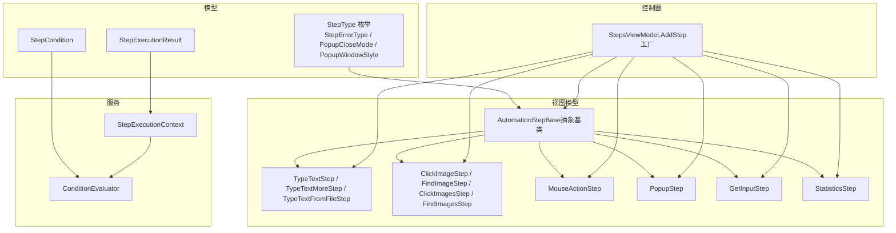
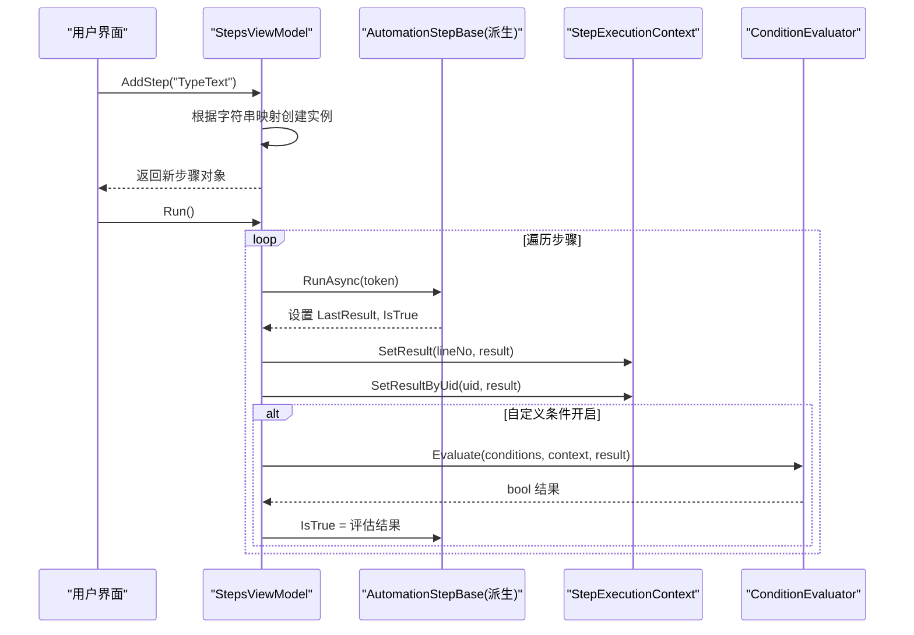
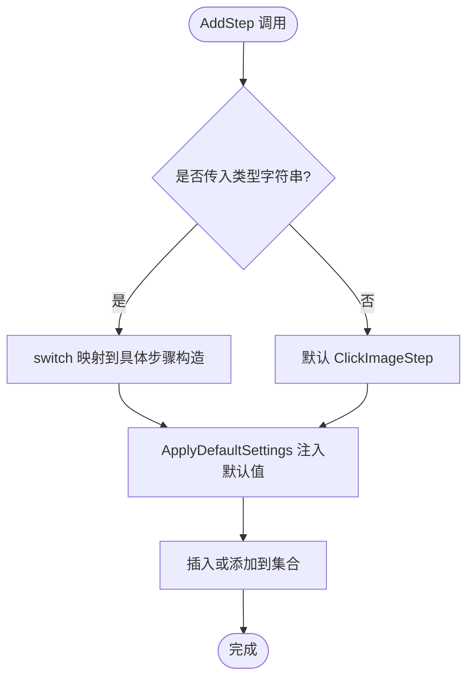
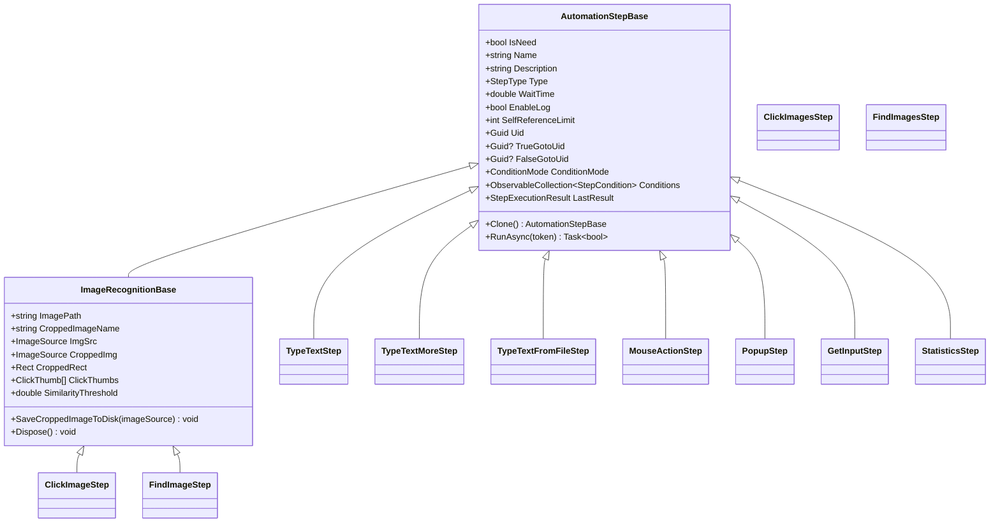
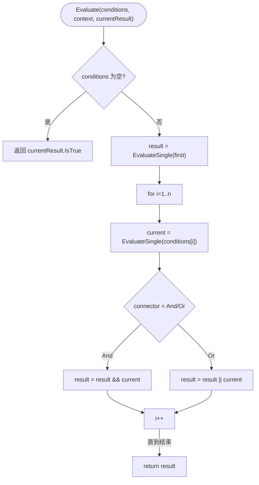
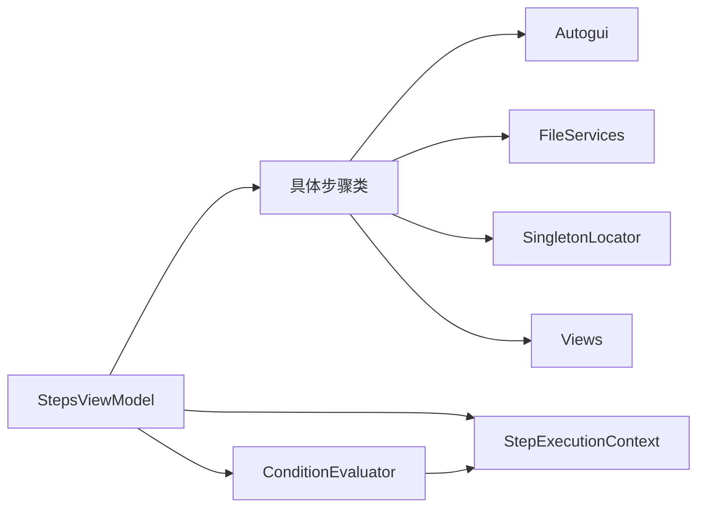

# 步骤类型系统

<cite>
**本文引用的文件**   
- [AutomationStep.cs](file://ShaoLu/Viewmodels/AutomationStep.cs)
- [ImageRecognition.cs](file://ShaoLu/Viewmodels/ImageRecognition.cs)
- [ImagesRecognition.cs](file://ShaoLu/Viewmodels/ImagesRecognition.cs)
- [MouseActionStep.cs](file://ShaoLu/Viewmodels/MouseActionStep.cs)
- [GetInputStep.cs](file://ShaoLu/Viewmodels/GetInputStep.cs)
- [StatisticsStep.cs](file://ShaoLu/Viewmodels/StatisticsStep.cs)
- [StepsViewModel.cs](file://ShaoLu/Viewmodels/StepsViewModel.cs)
- [AutomationStepModel.cs](file://ShaoLu/Models/AutomationStepModel.cs)
- [StepCondition.cs](file://ShaoLu/Models/StepCondition.cs)
- [StepExecutionResult.cs](file://ShaoLu/Models/StepExecutionResult.cs)
- [StepExecutionContext.cs](file://ShaoLu/Services/StepExecutionContext.cs)
- [ConditionEvaluator.cs](file://ShaoLu/Services/ConditionEvaluator.cs)
</cite>

## 目录
1. [简介](#简介)
2. [项目结构](#项目结构)
3. [核心组件](#核心组件)
4. [架构总览](#架构总览)
5. [详细组件分析](#详细组件分析)
6. [依赖关系分析](#依赖关系分析)
7. [性能考量](#性能考量)
8. [故障排查指南](#故障排查指南)
9. [结论](#结论)
10. [附录：扩展与最佳实践](#附录：扩展与最佳实践)

## 简介
本文件系统化梳理 ShaoLu 应用的“步骤类型系统”，涵盖 StepType 枚举设计、步骤工厂模式（动态创建与注册）、反射调用优化策略，以及各类内置步骤类型的实现与使用方式。文档同时给出继承体系、抽象方法规范、属性配置模式、自定义步骤开发指南、测试方法与性能优化建议，帮助开发者快速理解并扩展该自动化流程引擎。

## 项目结构
步骤类型系统主要分布在以下模块：
- 模型层：StepType 枚举、错误类型、弹窗相关枚举与数据模型
- 视图模型层：各具体步骤类（文本输入、图像识别、鼠标操作、弹窗等）
- 服务层：执行上下文、条件评估器
- 控制器层：步骤工厂（基于字符串到类型的映射）

图表来源
- [AutomationStepModel.cs:9-24](file://ShaoLu/Models/AutomationStepModel.cs#L9-L24)
- [StepExecutionResult.cs:1-50](file://ShaoLu/Models/StepExecutionResult.cs#L1-L50)
- [StepCondition.cs:204-230](file://ShaoLu/Models/StepCondition.cs#L204-L230)
- [AutomationStep.cs:25-296](file://ShaoLu/Viewmodels/AutomationStep.cs#L25-L296)
- [ImageRecognition.cs:21-326](file://ShaoLu/Viewmodels/ImageRecognition.cs#L21-L326)
- [ImagesRecognition.cs:15-245](file://ShaoLu/Viewmodels/ImagesRecognition.cs#L15-L245)
- [MouseActionStep.cs:15-162](file://ShaoLu/Viewmodels/MouseActionStep.cs#L15-L162)
- [GetInputStep.cs:126-152](file://ShaoLu/Viewmodels/GetInputStep.cs#L126-L152)
- [StatisticsStep.cs:337-375](file://ShaoLu/Viewmodels/StatisticsStep.cs#L337-L375)
- [StepsViewModel.cs:186-227](file://ShaoLu/Viewmodels/StepsViewModel.cs#L186-L227)
- [StepExecutionContext.cs:1-163](file://ShaoLu/Services/StepExecutionContext.cs#L1-L163)
- [ConditionEvaluator.cs:1-294](file://ShaoLu/Services/ConditionEvaluator.cs#L1-L294)

章节来源
- [AutomationStepModel.cs:9-24](file://ShaoLu/Models/AutomationStepModel.cs#L9-L24)
- [StepsViewModel.cs:186-227](file://ShaoLu/Viewmodels/StepsViewModel.cs#L186-L227)

## 核心组件
- StepType 枚举：定义所有内置步骤类型及其分组区间（如图像类、文本类、输入类、统计类、弹窗类等），便于分类管理与扩展。
- AutomationStepBase：抽象基类，统一生命周期、属性（名称、描述、等待时间、跳转 UID、日志开关、自引用限制等）、克隆接口与异步执行接口。
- 具体步骤类：实现 RunAsync 完成实际动作，并通过 LastResult 输出结构化结果。
- 执行上下文 StepExecutionContext：集中保存每一步的执行结果、运行计时、触发状态，供条件评估与统计展示。
- 条件评估器 ConditionEvaluator：解析变量、提取文本片段、比较运算，支持 AND/OR 多行组合。
- 步骤工厂（StepsViewModel.AddStep）：将用户选择的“步骤名”映射为具体实例，应用默认设置后加入集合。

章节来源
- [AutomationStepModel.cs:9-24](file://ShaoLu/Models/AutomationStepModel.cs#L9-L24)
- [AutomationStep.cs:25-296](file://ShaoLu/Viewmodels/AutomationStep.cs#L25-L296)
- [StepExecutionContext.cs:1-163](file://ShaoLu/Services/StepExecutionContext.cs#L1-L163)
- [ConditionEvaluator.cs:1-294](file://ShaoLu/Services/ConditionEvaluator.cs#L1-L294)
- [StepsViewModel.cs:186-227](file://ShaoLu/Viewmodels/StepsViewModel.cs#L186-L227)

## 架构总览
步骤系统的核心流程如下：
- 用户在 UI 选择步骤类型，StepsViewModel.AddStep 通过 switch 映射创建对应实例（工厂）。
- 每个步骤实现 Clone 与 RunAsync；RunAsync 负责阻塞 IO/OCR/屏幕交互等耗时任务。
- 执行循环在 StepsViewModel.Run 中顺序调用 step.RunAsync，记录 LastResult 并写入 StepExecutionContext。
- 若启用自定义条件，则调用 ConditionEvaluator.Evaluate 计算 IsTrue，影响后续跳转逻辑。

图表来源
- [StepsViewModel.cs:493-584](file://ShaoLu/Viewmodels/StepsViewModel.cs#L493-L584)
- [StepExecutionContext.cs:39-103](file://ShaoLu/Services/StepExecutionContext.cs#L39-L103)
- [ConditionEvaluator.cs:23-51](file://ShaoLu/Services/ConditionEvaluator.cs#L23-L51)

## 详细组件分析

### StepType 枚举设计与分类
- 分组区间：
  - 基础图像类：ClickImage(0)、FindImage(2)
  - 批量图像类：ClickImages(100)、FindImages(101)
  - 文本输入类：TypeText(1)、TypeTextMore(102)、TypeTextFromFile(103)
  - 输入与交互类：GetInput(200)、MouseAction(201)
  - 统计类：Statistics(202)
  - 弹窗控制类：Popup(1000)
- 用途：用于步骤标识、工厂映射、UI 显示与条件变量作用域限定。

章节来源
- [AutomationStepModel.cs:9-24](file://ShaoLu/Models/AutomationStepModel.cs#L9-L24)

### 步骤工厂模式与动态创建
- 工厂位置：StepsViewModel.AddStep 使用 switch 将字符串键映射到具体步骤构造函数。
- 命名策略：按当前集合中同类型数量生成唯一后缀，避免重复。
- 默认参数注入：ApplyDefaultSettings 根据步骤类型注入相似度阈值、点击次数、超时等默认值。
- 可扩展性：新增步骤类型时，仅需在 switch 中添加分支并在 ApplyDefaultSettings 中补充默认值。

图表来源
- [StepsViewModel.cs:186-227](file://ShaoLu/Viewmodels/StepsViewModel.cs#L186-L227)
- [StepsViewModel.cs:232-250](file://ShaoLu/Viewmodels/StepsViewModel.cs#L232-L250)

章节来源
- [StepsViewModel.cs:186-227](file://ShaoLu/Viewmodels/StepsViewModel.cs#L186-L227)
- [StepsViewModel.cs:232-250](file://ShaoLu/Viewmodels/StepsViewModel.cs#L232-L250)

### 继承体系与抽象方法规范
- 基类职责：
  - 公共属性：IsNeed、Name、Description、Type、WaitTime、EnableLog、SelfReferenceLimit、UID、跳转 UID、条件模式与规则等。
  - 抽象方法：Clone()、RunAsync(CancellationToken)。
  - 运行时结果：LastResult（不序列化）。
- 子类实现要求：
  - 构造函数中设置 Type。
  - Clone 需深拷贝所有可变属性与集合。
  - RunAsync 内处理等待、IO、OCR、屏幕交互，并设置 IsTrue、IsError、ErrorType、LastResult。

图表来源
- [AutomationStep.cs:25-296](file://ShaoLu/Viewmodels/AutomationStep.cs#L25-L296)
- [ImageRecognition.cs:21-326](file://ShaoLu/Viewmodels/ImageRecognition.cs#L21-L326)

章节来源
- [AutomationStep.cs:25-296](file://ShaoLu/Viewmodels/AutomationStep.cs#L25-L296)
- [ImageRecognition.cs:21-326](file://ShaoLu/Viewmodels/ImageRecognition.cs#L21-L326)

### 内置步骤类型详解

#### TypeTextStep（文本输入）
- 功能：向目标窗口输入文本，支持按键间隔控制。
- 关键属性：TextToType、DelayBetweenKeys、WaitTime。
- 执行逻辑：等待 WaitTime 后，后台线程调用 Autogui.TypeTextSafe/TypeText 进行输入，更新 IsTrue/ErrorType。

章节来源
- [AutomationStep.cs:300-365](file://ShaoLu/Viewmodels/AutomationStep.cs#L300-L365)

#### TypeTextMoreStep（批量输入）
- 功能：支持前缀/中间/后缀拼接与自动递增，适合批量生成不同文本。
- 关键属性：Prefix、Infix、Suffix、Prefix_gen/Infix_gen/Suffix_gen、ReloadText、TextToType。
- 执行逻辑：每次执行后根据标志位对三段文本进行递增，再重新拼接 TextToType。

章节来源
- [AutomationStep.cs:367-516](file://ShaoLu/Viewmodels/AutomationStep.cs#L367-L516)

#### TypeTextFromFileStep（文件输入）
- 功能：从 .txt/.csv/.xlsx 读取内容列表，逐条输入，支持分隔符配置与索引管理。
- 关键属性：FilePath、Contents、Index、Delimiter、ReloadIndex。
- 执行逻辑：检查 Index 越界，设置 TextToType，执行输入，Index++；支持重置索引。

章节来源
- [AutomationStep.cs:518-680](file://ShaoLu/Viewmodels/AutomationStep.cs#L518-L680)

#### PopupStep（弹窗控制）
- 功能：显示自定义弹窗，支持按钮、样式、关闭模式（按钮点击/超时/到达某步骤）。
- 关键属性：Title、PopupText、PopupFont、PopupType、PopupWindowStyle、PopupButtons、CloseMode、AutoCloseSeconds、CloseOnStepUid、WindowX/Y、WindowOpacity、BackgroundColor。
- 执行逻辑：根据 CloseMode 控制弹窗生命周期，支持 StepReached 模式由执行上下文驱动关闭。

章节来源
- [AutomationStep.cs:684-874](file://ShaoLu/Viewmodels/AutomationStep.cs#L684-L874)
- [AutomationStepModel.cs:48-67](file://ShaoLu/Models/AutomationStepModel.cs#L48-L67)

#### 图像识别类（ClickImageStep / FindImageStep）
- 基类 ImageRecognitionBase：提供图片加载、裁剪图保存、相似阈值、点击点管理等通用能力。
- ClickImageStep：在屏幕上查找图像并点击，支持多次点击与鼠标动作序列。
- FindImageStep：仅查找图像，可选 OCR 区域识别文字，支持调试叠加显示。

章节来源
- [ImageRecognition.cs:329-436](file://ShaoLu/Viewmodels/ImageRecognition.cs#L329-L436)
- [ImageRecognition.cs:439-602](file://ShaoLu/Viewmodels/ImageRecognition.cs#L439-L602)

#### 批量图像类（ClickImagesStep / FindImagesStep）
- ImagesRecognitionBase：维护多个 ImageRecognition 实例，支持逐个匹配。
- ClickImagesStep：依次尝试匹配并点击，记录最后相似度与点击位置。
- FindImagesStep：批量查找，返回首个匹配结果。

章节来源
- [ImagesRecognition.cs:47-168](file://ShaoLu/Viewmodels/ImagesRecognition.cs#L47-L168)
- [ImagesRecognition.cs:170-245](file://ShaoLu/Viewmodels/ImagesRecognition.cs#L170-L245)

#### MouseActionStep（鼠标操作）
- 功能：在指定坐标执行鼠标动作序列，支持绝对坐标与当前位置模式。
- 关键属性：PositionMode、TargetX/Y、MouseActions。
- 执行逻辑：移动到目标位置后执行动作序列，设置 LastResult。

章节来源
- [MouseActionStep.cs:15-162](file://ShaoLu/Viewmodels/MouseActionStep.cs#L15-L162)

#### GetInputStep（输入获取）
- 功能：通过 OCR 或其他方式获取输入文本，支持预览与点选。
- 关键属性：InputMode、命令（TestOCRCommand、SelectTextPointCommand、PreviewResultCommand）。
- 执行逻辑：根据模式执行 OCR 或交互，填充结果。

章节来源
- [GetInputStep.cs:126-152](file://ShaoLu/Viewmodels/GetInputStep.cs#L126-L152)

#### StatisticsStep（统计）
- 功能：收集步骤执行过程中的条件计数与统计项，不参与条件判断。
- 关键属性：WindowTitle、WindowX/Y、AlwaysOnTop、AutoCloseSeconds、CloseOnStop、BackgroundColor、BackgroundOpacity、StatisticsItems、CustomConditions。
- 执行逻辑：在每步执行后更新条件计数，支持克隆与 UI 展示。

章节来源
- [StatisticsStep.cs:337-375](file://ShaoLu/Viewmodels/StatisticsStep.cs#L337-L375)

### 执行上下文与条件评估
- StepExecutionContext：
  - 存储按行号与 UID 的结果字典，跟踪执行次数与总时长。
  - ResolveVariable 解析 Self_* 与 Step_* 变量，支持 Step_Triggered 语义。
- ConditionEvaluator：
  - 多行条件以 AND/OR 连接，支持常量、布尔、数字、字符串、正则表达式比较。
  - 文本提取模式：整段、指定行、子串起始截取、开头/末尾截取。

图表来源
- [ConditionEvaluator.cs:23-51](file://ShaoLu/Services/ConditionEvaluator.cs#L23-L51)
- [StepExecutionContext.cs:112-160](file://ShaoLu/Services/StepExecutionContext.cs#L112-L160)

章节来源
- [StepExecutionContext.cs:1-163](file://ShaoLu/Services/StepExecutionContext.cs#L1-L163)
- [ConditionEvaluator.cs:1-294](file://ShaoLu/Services/ConditionEvaluator.cs#L1-L294)

## 依赖关系分析
- 视图模型依赖：
  - StepsViewModel 依赖具体步骤类型进行实例化与默认参数注入。
  - 各步骤依赖 Autogui、FileServices、SingletonLocator、Views 等工具与服务。
- 服务依赖：
  - StepExecutionContext 被 StepsViewModel 在执行循环中读写。
  - ConditionEvaluator 依赖 StepExecutionContext 提供的变量解析。
- 模型依赖：
  - StepType、StepErrorType、PopupCloseMode、PopupWindowStyle 被多处引用用于类型标识与行为控制。

图表来源
- [StepsViewModel.cs:186-227](file://ShaoLu/Viewmodels/StepsViewModel.cs#L186-L227)
- [StepExecutionContext.cs:1-163](file://ShaoLu/Services/StepExecutionContext.cs#L1-L163)
- [ConditionEvaluator.cs:1-294](file://ShaoLu/Services/ConditionEvaluator.cs#L1-L294)

章节来源
- [StepsViewModel.cs:186-227](file://ShaoLu/Viewmodels/StepsViewModel.cs#L186-L227)
- [StepExecutionContext.cs:1-163](file://ShaoLu/Services/StepExecutionContext.cs#L1-L163)
- [ConditionEvaluator.cs:1-294](file://ShaoLu/Services/ConditionEvaluator.cs#L1-L294)

## 性能考量
- 异步执行：所有 RunAsync 均使用 Task.Delay 与 Task.Run 避免阻塞 UI 线程。
- 资源释放：ImageRecognitionBase 实现 IDisposable，释放 BitmapSource 引用。
- 缓存与冻结：加载图片时使用 CacheOption.OnLoad 与 Freeze 提升跨线程访问性能。
- 条件评估优化：文本提取与正则匹配在异常路径上捕获并降级，避免中断主流程。
- 自引用限制：SelfReferenceLimit 防止无限递归执行导致栈溢出。

[本节为通用指导，无需特定文件引用]

## 故障排查指南
- 常见问题：
  - 图像未找到：检查 ImagePath/CroppedImageFullPath 是否存在，确认 SimilarityThreshold 合理。
  - 文本输入失败：确认 DelayBetweenKeys 与目标窗口兼容性，必要时使用 TypeTextSafe。
  - 文件读取错误：确保 FilePath 有效且格式受支持（txt/csv/xlsx）。
  - 弹窗未关闭：检查 CloseMode 与 AutoCloseSeconds/CloseOnStepUid 配置。
  - 条件评估失败：查看 ConditionEvaluator 的日志警告，确认变量与提取模式正确。
- 定位手段：
  - 启用 EnableLog 输出执行日志。
  - 使用 StepExecutionContext.GetStepResult 获取最近结果描述。
  - 观察 LastResult.Similarity、ClickPosition、OCRText、PopupResult 字段。

章节来源
- [ConditionEvaluator.cs:78-83](file://ShaoLu/Services/ConditionEvaluator.cs#L78-L83)
- [StepExecutionContext.cs:96-103](file://ShaoLu/Services/StepExecutionContext.cs#L96-L103)

## 结论
ShaoLu 的步骤类型系统以清晰的枚举与抽象基类为核心，结合工厂模式与执行上下文，实现了高内聚、低耦合的自动化流程编排。内置步骤覆盖文本输入、图像识别、鼠标操作、弹窗控制与统计等常见场景，并提供完善的条件评估机制。通过遵循继承体系与抽象方法规范，开发者可高效扩展自定义步骤类型，满足复杂自动化需求。

[本节为总结，无需特定文件引用]

## 附录：扩展与最佳实践

### 自定义步骤类型开发指南
- 新建步骤类：
  - 继承 AutomationStepBase 或 ImageRecognitionBase（如需图像处理）。
  - 构造函数中设置 Type 为新的 StepType 值。
  - 实现 Clone 深拷贝所有属性与集合。
  - 实现 RunAsync 完成业务逻辑，设置 IsTrue、IsError、ErrorType、LastResult。
- 注册步骤类型：
  - 在 StepsViewModel.AddStep 的 switch 中添加新分支，映射字符串到构造函数。
  - 在 ApplyDefaultSettings 中为新类型注入默认参数。
- 条件变量支持：
  - 若需要暴露变量给条件评估，参考 StepExecutionContext.ResolveVariable 的模式。
  - 在 StepCondition 的作用域中声明可用变量（如 Popup、GetInput 等）。

章节来源
- [AutomationStep.cs:288-296](file://ShaoLu/Viewmodels/AutomationStep.cs#L288-L296)
- [StepsViewModel.cs:186-227](file://ShaoLu/Viewmodels/StepsViewModel.cs#L186-L227)
- [StepCondition.cs:204-230](file://ShaoLu/Models/StepCondition.cs#L204-L230)

### 测试方法
- 单元测试要点：
  - 验证构造函数设置 Type、Name、Description 是否正确。
  - 验证 Clone 深拷贝属性与集合。
  - 验证 RunAsync 在不同输入下的 IsTrue 与 ErrorType。
  - 验证 StepExecutionContext 的 SetResult/GetResult 行为。
- 示例参考：
  - TypeTextStepTests：构造与默认值验证。
  - StepTypeTests：枚举值断言。
  - StepExecutionContextTests：结果存取与覆盖行为。

章节来源
- [NUnitTest/AutomationStepTests.cs:17-42](file://NUnitTest/AutomationStepTests.cs#L17-L42)
- [NUnitTest/ModelTests.cs:251-267](file://NUnitTest/ModelTests.cs#L251-L267)
- [NUnitTest/StepExecutionContextTests.cs:1-49](file://NUnitTest/StepExecutionContextTests.cs#L1-L49)

### 性能优化建议
- 减少不必要的图像加载：复用 CroppedImg 并冻结 BitmapSource。
- 合理设置 WaitTime 与 DelayBetweenKeys，避免过度等待。
- 批量图像匹配时，优先使用 FindImagesStep 一次性匹配。
- 条件评估中尽量使用精确匹配与短文本提取，降低正则开销。
- 使用 SelfReferenceLimit 防止递归执行导致的性能问题。

[本节为通用指导，无需特定文件引用]

### 常见问题解决方案
- 新增步骤类型后无法创建：检查 StepsViewModel.AddStep 的 switch 分支与字符串键是否一致。
- 条件变量无效：确认 StepCondition.Variable 与 StepExecutionContext.ResolveVariable 的映射。
- 弹窗未按预期关闭：检查 CloseMode 与 AutoCloseSeconds/CloseOnStepUid 配置。
- 图像识别失败：调整 SimilarityThreshold，确认裁剪图与点击点设置正确。

章节来源
- [StepsViewModel.cs:186-227](file://ShaoLu/Viewmodels/StepsViewModel.cs#L186-L227)
- [StepExecutionContext.cs:112-160](file://ShaoLu/Services/StepExecutionContext.cs#L112-L160)
- [ImageRecognition.cs:329-436](file://ShaoLu/Viewmodels/ImageRecognition.cs#L329-L436)