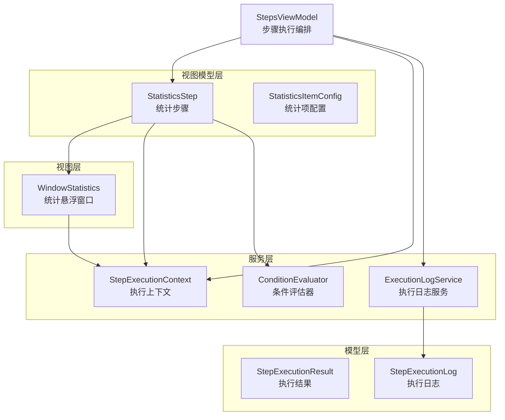
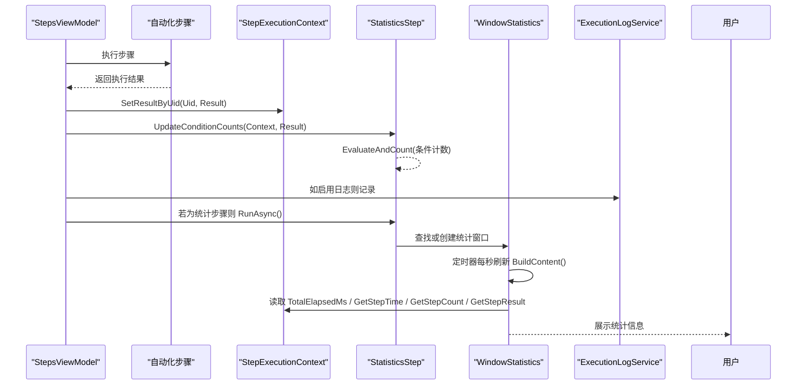
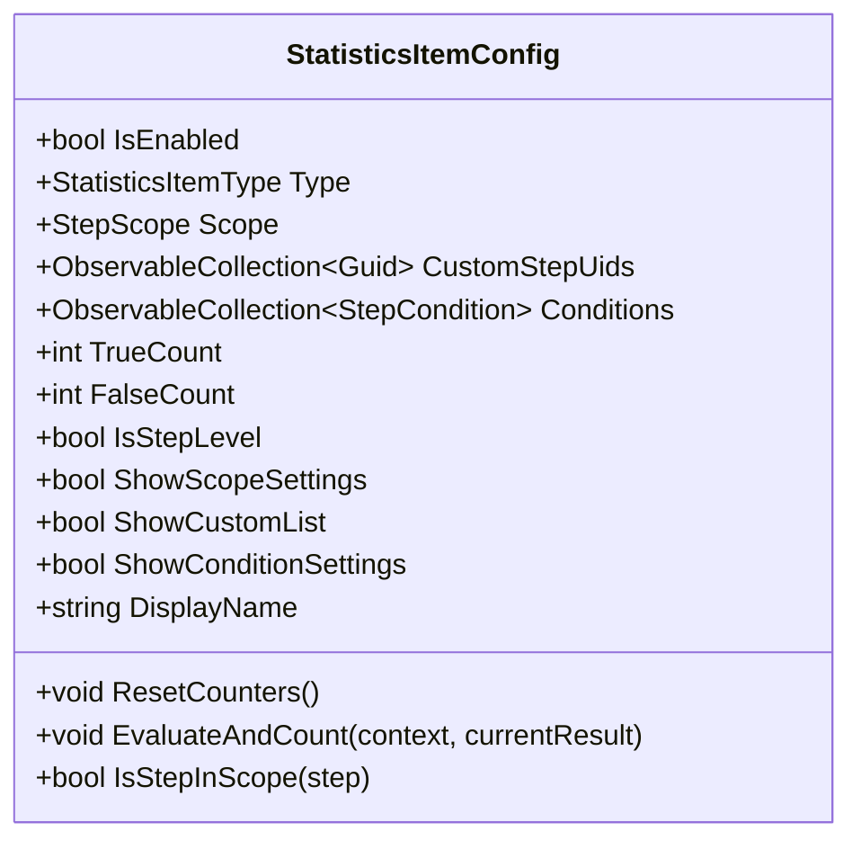
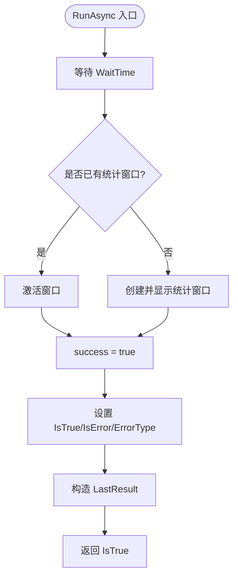
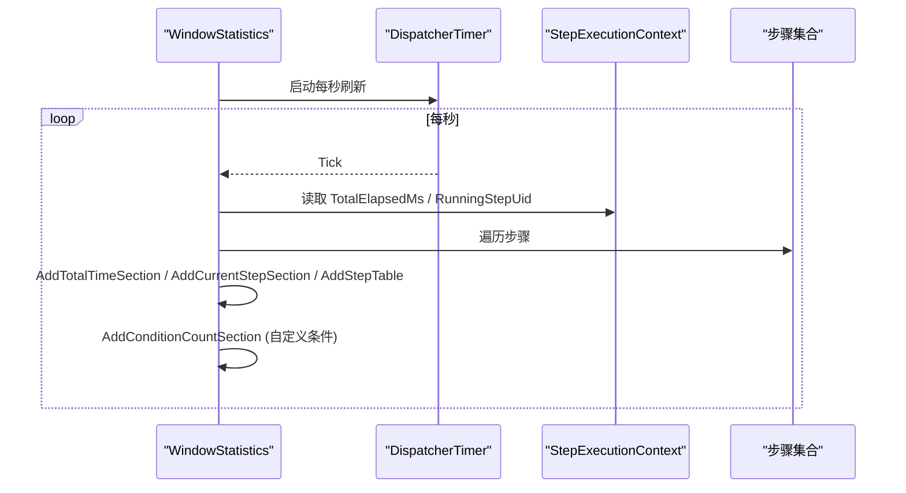
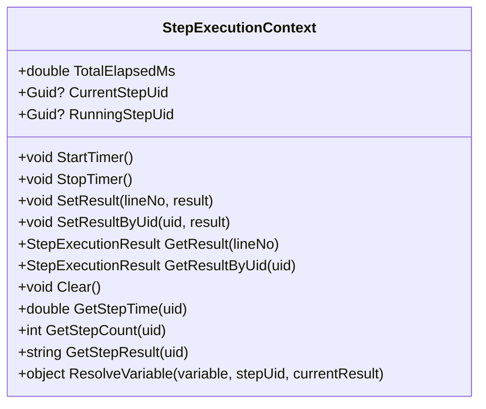
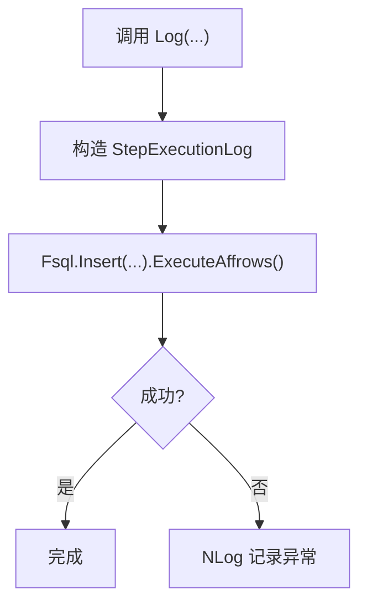
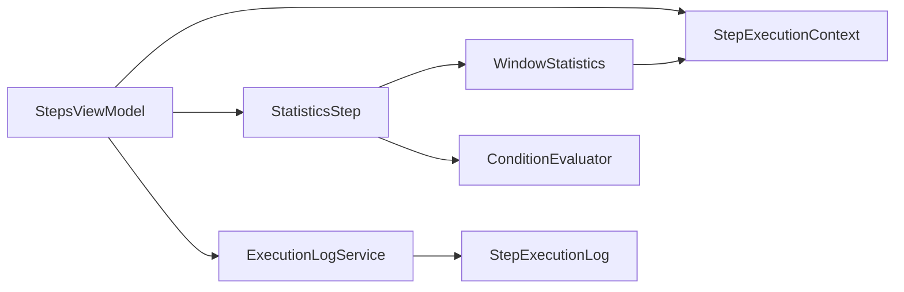

# 统计分析步骤

<cite>
**本文引用的文件**   
- [StatisticsStep.cs](file://ShaoLu/Viewmodels/StatisticsStep.cs)
- [WindowStatistics.xaml.cs](file://ShaoLu/Views/WindowStatistics.xaml.cs)
- [StepExecutionContext.cs](file://ShaoLu/Services/StepExecutionContext.cs)
- [ExecutionLogService.cs](file://ShaoLu/Services/ExecutionLogService.cs)
- [StepExecutionLog.cs](file://ShaoLu/Models/StepExecutionLog.cs)
- [StepExecutionResult.cs](file://ShaoLu/Models/StepExecutionResult.cs)
- [AutomationStep.cs](file://ShaoLu/Viewmodels/AutomationStep.cs)
- [StepsViewModel.cs](file://ShaoLu/Viewmodels/StepsViewModel.cs)
- [ConditionEvaluator.cs](file://ShaoLu/Services/ConditionEvaluator.cs)
</cite>

## 目录
1. [简介](#简介)
2. [项目结构](#项目结构)
3. [核心组件](#核心组件)
4. [架构总览](#架构总览)
5. [详细组件分析](#详细组件分析)
6. [依赖关系分析](#依赖关系分析)
7. [性能考虑](#性能考虑)
8. [故障排查指南](#故障排查指南)
9. [结论](#结论)
10. [附录](#附录)

## 简介
本文件为 ShaoLu 应用的“统计分析步骤”（StatisticsStep）提供完整的技术与使用文档。内容覆盖统计指标实现原理、数据采集与计算机制、可视化展示、与其他步骤的集成方式、配置灵活性，以及数据持久化策略与扩展建议。读者可据此理解并高效使用该功能进行执行次数统计、成功率计算、耗时分析与错误率监控等。

## 项目结构
统计分析功能由以下关键部分组成：
- 统计步骤模型与配置：定义统计项类型、范围、条件计数规则等
- 运行时上下文：集中保存每次执行的步骤结果、耗时、计数等
- 悬浮窗口：实时展示统计信息，支持自动刷新与关闭策略
- 执行日志服务：基于 SQLite 记录历史执行日志，支持查询与清理
- 条件评估器：用于自定义条件计数规则的评估

图表来源
- [StatisticsStep.cs:209-458](file://ShaoLu/Viewmodels/StatisticsStep.cs#L209-L458)
- [WindowStatistics.xaml.cs:16-128](file://ShaoLu/Views/WindowStatistics.xaml.cs#L16-L128)
- [StepExecutionContext.cs:11-103](file://ShaoLu/Services/StepExecutionContext.cs#L11-L103)
- [ExecutionLogService.cs:12-55](file://ShaoLu/Services/ExecutionLogService.cs#L12-L55)
- [StepExecutionResult.cs:8-49](file://ShaoLu/Models/StepExecutionResult.cs#L8-L49)
- [StepExecutionLog.cs:7-45](file://ShaoLu/Models/StepExecutionLog.cs#L7-L45)
- [StepsViewModel.cs:560-584](file://ShaoLu/Viewmodels/StepsViewModel.cs#L560-L584)

章节来源
- [StatisticsStep.cs:16-458](file://ShaoLu/Viewmodels/StatisticsStep.cs#L16-L458)
- [WindowStatistics.xaml.cs:16-128](file://ShaoLu/Views/WindowStatistics.xaml.cs#L16-L128)
- [StepExecutionContext.cs:11-103](file://ShaoLu/Services/StepExecutionContext.cs#L11-L103)
- [ExecutionLogService.cs:12-55](file://ShaoLu/Services/ExecutionLogService.cs#L12-L55)
- [StepExecutionResult.cs:8-49](file://ShaoLu/Models/StepExecutionResult.cs#L8-L49)
- [StepExecutionLog.cs:7-45](file://ShaoLu/Models/StepExecutionLog.cs#L7-L45)
- [StepsViewModel.cs:560-584](file://ShaoLu/Viewmodels/StepsViewModel.cs#L560-L584)

## 核心组件
- StatisticsStep：统计步骤的实现，负责打开/激活统计窗口、设置运行状态与结果
- StatisticsItemConfig：统计项配置，包含类型、范围、条件计数规则及显示名称等
- StepExecutionContext：执行上下文，维护总耗时、各步骤执行结果、执行次数、当前执行步骤等信息
- WindowStatistics：统计悬浮窗口，定时刷新并渲染统计内容
- ExecutionLogService：执行日志服务，基于 FreeSql + SQLite 持久化历史记录
- ConditionEvaluator：条件评估器，用于自定义条件计数规则的计算

章节来源
- [StatisticsStep.cs:16-458](file://ShaoLu/Viewmodels/StatisticsStep.cs#L16-L458)
- [StepExecutionContext.cs:11-103](file://ShaoLu/Services/StepExecutionContext.cs#L11-L103)
- [WindowStatistics.xaml.cs:16-128](file://ShaoLu/Views/WindowStatistics.xaml.cs#L16-L128)
- [ExecutionLogService.cs:12-55](file://ShaoLu/Services/ExecutionLogService.cs#L12-L55)
- [ConditionEvaluator.cs:11-51](file://ShaoLu/Services/ConditionEvaluator.cs#L11-L51)

## 架构总览
统计分析的整体流程如下：
- 步骤执行编排（StepsViewModel）在每一步执行后更新执行上下文（StepExecutionContext），并将结果按行号与 UID 存储
- 若存在 StatisticsStep，则调用其 UpdateConditionCounts 方法累计条件计数
- StatisticsStep 的 RunAsync 负责打开或激活统计悬浮窗口（WindowStatistics）
- WindowStatistics 通过 DispatcherTimer 每秒刷新，读取 StepExecutionContext 的数据并渲染
- 执行日志服务（ExecutionLogService）将启用了日志的步骤写入 SQLite 数据库，便于后续查询与分析

图表来源
- [StepsViewModel.cs:560-584](file://ShaoLu/Viewmodels/StepsViewModel.cs#L560-L584)
- [StepExecutionContext.cs:39-103](file://ShaoLu/Services/StepExecutionContext.cs#L39-L103)
- [StatisticsStep.cs:402-458](file://ShaoLu/Viewmodels/StatisticsStep.cs#L402-L458)
- [WindowStatistics.xaml.cs:86-128](file://ShaoLu/Views/WindowStatistics.xaml.cs#L86-L128)
- [ExecutionLogService.cs:36-55](file://ShaoLu/Services/ExecutionLogService.cs#L36-L55)

## 详细组件分析

### 统计项配置（StatisticsItemConfig）
- 统计项类型（StatisticsItemType）：总执行时间、步骤执行时间、步骤执行次数、步骤执行结果、条件计数、当前执行步骤
- 统计范围（StepScope）：所有步骤、仅勾选了记录执行日志的步骤、自选步骤
- 条件计数：支持多条 StepCondition 规则，运行时累计 True/False 次数
- 显示名称：优先使用自定义名称，否则根据类型从语言资源获取

图表来源
- [StatisticsStep.cs:47-204](file://ShaoLu/Viewmodels/StatisticsStep.cs#L47-L204)

章节来源
- [StatisticsStep.cs:47-204](file://ShaoLu/Viewmodels/StatisticsStep.cs#L47-L204)

### 统计步骤（StatisticsStep）
- 属性：窗口标题、位置、置顶、自动关闭时间、背景颜色与不透明度、统计项集合、自定义条件集合
- 克隆：复制所有配置与集合
- 重置计数器：每次运行前清零条件计数
- 更新条件计数：遍历默认与自定义统计项，调用 EvaluateAndCount
- 执行流程：等待 WaitTime，UI 线程检查/创建统计窗口，设置 IsTrue/IsError/ErrorType，生成 LastResult

图表来源
- [StatisticsStep.cs:414-458](file://ShaoLu/Viewmodels/StatisticsStep.cs#L414-L458)

章节来源
- [StatisticsStep.cs:209-458](file://ShaoLu/Viewmodels/StatisticsStep.cs#L209-L458)

### 统计悬浮窗口（WindowStatistics）
- 生命周期：打开时应用窗口配置（标题、位置、置顶、背景色与不透明度），启动自动关闭计时器（可选），启动每秒刷新定时器
- 内容构建：根据统计项类型分别渲染总执行时间、当前执行步骤、条件计数、步骤级表格（耗时/次数/结果）
- 值单元格：长文本截断显示，点击可预览全文
- 关闭策略：支持运行停止时统一关闭（CloseOnStop）

图表来源
- [WindowStatistics.xaml.cs:49-128](file://ShaoLu/Views/WindowStatistics.xaml.cs#L49-L128)
- [WindowStatistics.xaml.cs:144-210](file://ShaoLu/Views/WindowStatistics.xaml.cs#L144-L210)

章节来源
- [WindowStatistics.xaml.cs:16-128](file://ShaoLu/Views/WindowStatistics.xaml.cs#L16-L128)
- [WindowStatistics.xaml.cs:144-210](file://ShaoLu/Views/WindowStatistics.xaml.cs#L144-L210)

### 执行上下文（StepExecutionContext）
- 总耗时：Stopwatch 维护 TotalElapsedMs
- 步骤结果：按行号与 UID 存储 StepExecutionResult
- 执行次数：按 UID 累计
- 当前执行步骤：RunningStepUid（供统计窗口展示）
- 变量解析：ResolveVariable 支持常量、自身字段、引用步骤字段、Step_Triggered 等

图表来源
- [StepExecutionContext.cs:11-103](file://ShaoLu/Services/StepExecutionContext.cs#L11-L103)

章节来源
- [StepExecutionContext.cs:11-103](file://ShaoLu/Services/StepExecutionContext.cs#L11-L103)

### 执行日志服务（ExecutionLogService）
- 持久化：FreeSql + SQLite，路径位于 ApplicationData/AutoShaoLu/execution_log.db
- 写入：Log(stepUid, stepFileName, stepName, inputText, ocrText)
- 查询：支持关键字、文件名、UID、时间范围、排序、分页
- 清理：CleanupOldLogs(retentionDays)

图表来源
- [ExecutionLogService.cs:36-55](file://ShaoLu/Services/ExecutionLogService.cs#L36-L55)

章节来源
- [ExecutionLogService.cs:12-55](file://ShaoLu/Services/ExecutionLogService.cs#L12-L55)
- [StepExecutionLog.cs:7-45](file://ShaoLu/Models/StepExecutionLog.cs#L7-L45)

### 条件评估器（ConditionEvaluator）
- 多行条件组合：AND/OR 连接器
- 变量解析：支持布尔、数字、字符串、正则匹配、文本提取模式
- 空值处理：IsEmpty/IsNotEmpty 特殊操作符

章节来源
- [ConditionEvaluator.cs:11-51](file://ShaoLu/Services/ConditionEvaluator.cs#L11-L51)
- [ConditionEvaluator.cs:88-164](file://ShaoLu/Services/ConditionEvaluator.cs#L88-L164)
- [ConditionEvaluator.cs:177-207](file://ShaoLu/Services/ConditionEvaluator.cs#L177-L207)

## 依赖关系分析
- StepsViewModel 在执行编排中更新 StepExecutionContext，并触发 StatisticsStep 的条件计数更新
- StatisticsStep 依赖 WindowStatistics 进行可视化展示
- WindowStatistics 依赖 StepExecutionContext 获取实时数据
- ExecutionLogService 依赖 StepExecutionLog 模型进行持久化
- ConditionEvaluator 被 StatisticsItemConfig.EvaluateAndCount 调用以评估自定义条件

图表来源
- [StepsViewModel.cs:560-584](file://ShaoLu/Viewmodels/StepsViewModel.cs#L560-L584)
- [StatisticsStep.cs:402-458](file://ShaoLu/Viewmodels/StatisticsStep.cs#L402-L458)
- [WindowStatistics.xaml.cs:86-128](file://ShaoLu/Views/WindowStatistics.xaml.cs#L86-L128)
- [ExecutionLogService.cs:36-55](file://ShaoLu/Services/ExecutionLogService.cs#L36-L55)

章节来源
- [StepsViewModel.cs:560-584](file://ShaoLu/Viewmodels/StepsViewModel.cs#L560-L584)
- [StatisticsStep.cs:402-458](file://ShaoLu/Viewmodels/StatisticsStep.cs#L402-L458)
- [WindowStatistics.xaml.cs:86-128](file://ShaoLu/Views/WindowStatistics.xaml.cs#L86-L128)
- [ExecutionLogService.cs:36-55](file://ShaoLu/Services/ExecutionLogService.cs#L36-L55)

## 性能考虑
- 统计窗口刷新频率：默认每秒一次，避免频繁 UI 重绘影响性能
- 条件计数评估：仅在步骤执行后触发，且只针对已启用的统计项
- 日志写入：异步 NLog 输出，SQLite 写入失败会记录异常但不阻塞主流程
- 内存占用：StepExecutionContext 使用字典缓存结果与计数，注意运行周期内的增长

[本节为通用指导，无需特定文件引用]

## 故障排查指南
- 统计窗口未显示：检查 StatisticsStep.RunAsync 是否在 UI 线程创建窗口；确认 Uid 唯一性以避免重复创建
- 条件计数不更新：确认 StatisticsItemConfig.IsEnabled 与 Type=ConditionCount；检查 StepCondition 配置是否正确
- 执行日志未写入：检查步骤 EnableLog 是否开启；查看 NLog 日志是否有写入异常
- 查询无结果：确认时间范围、关键字、文件名、UID 筛选条件是否正确

章节来源
- [StatisticsStep.cs:414-458](file://ShaoLu/Viewmodels/StatisticsStep.cs#L414-L458)
- [ExecutionLogService.cs:36-55](file://ShaoLu/Services/ExecutionLogService.cs#L36-L55)

## 结论
StatisticsStep 提供了灵活的统计能力，包括执行次数、成功率、耗时与错误率的实时监控与展示。通过 StepExecutionContext 集中管理执行数据，结合 WindowStatistics 的实时渲染与 ExecutionLogService 的历史持久化，形成完整的统计闭环。条件计数与范围筛选增强了配置的灵活性，满足多样化分析需求。

[本节为总结，无需特定文件引用]

## 附录

### 统计指标与数据来源
- 总执行时间：StepExecutionContext.TotalElapsedMs
- 步骤执行时间：StepExecutionContext.GetStepTime(uid)
- 步骤执行次数：StepExecutionContext.GetStepCount(uid)
- 步骤执行结果：StepExecutionContext.GetStepResult(uid)
- 条件计数：StatisticsItemConfig.TrueCount/FalseCount（由 ConditionEvaluator 评估）

章节来源
- [StepExecutionContext.cs:85-103](file://ShaoLu/Services/StepExecutionContext.cs#L85-L103)
- [StatisticsStep.cs:184-204](file://ShaoLu/Viewmodels/StatisticsStep.cs#L184-L204)

### 数据持久化策略
- 本地存储：SQLite 文件位于 ApplicationData/AutoShaoLu/execution_log.db
- 数据库集成：FreeSql ORM 自动建表与迁移
- 云端同步：当前代码未实现，可在 ExecutionLogService.Query/Cleanup 基础上扩展导出接口

章节来源
- [ExecutionLogService.cs:29-31](file://ShaoLu/Services/ExecutionLogService.cs#L29-L31)
- [ExecutionLogService.cs:161-176](file://ShaoLu/Services/ExecutionLogService.cs#L161-L176)

### 数据分析工具与报表定制指南
- 现有能力：执行日志支持关键字、文件名、UID、时间范围筛选与分页查询
- 扩展建议：
  - Excel 报表：基于 OfficeOpenXml 封装导出接口（参考项目中对 .xlsx 的处理方式）
  - CSV 输出：将 Query 结果序列化为 CSV 格式
  - JSON 序列化：将 StepExecutionResult/StepExecutionLog 对象序列化为 JSON 文件
- 趋势分析：基于时间范围聚合统计数据（如每小时成功率、平均耗时）

[本节为扩展建议，无需特定文件引用]