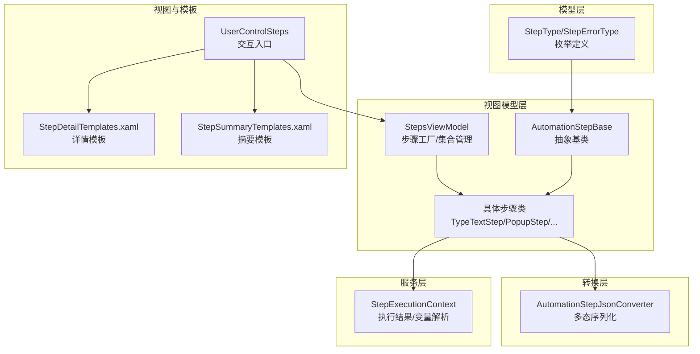
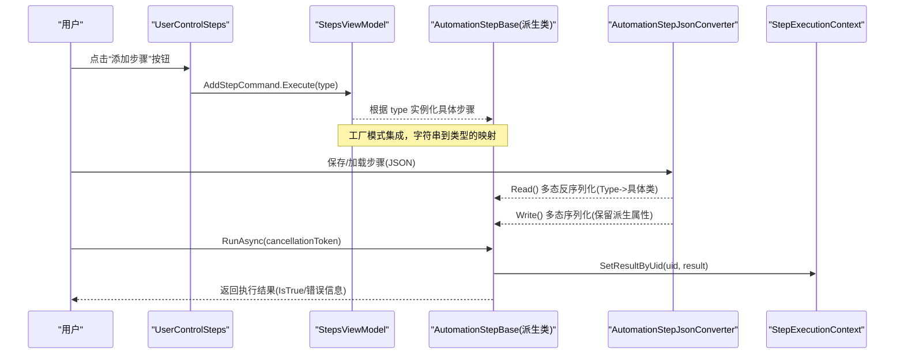
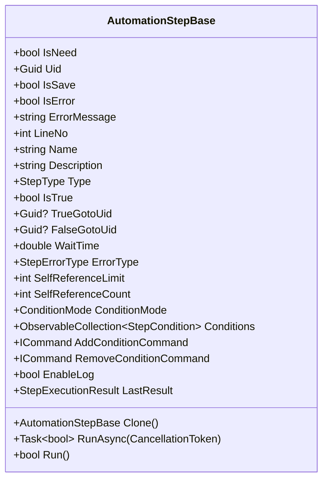
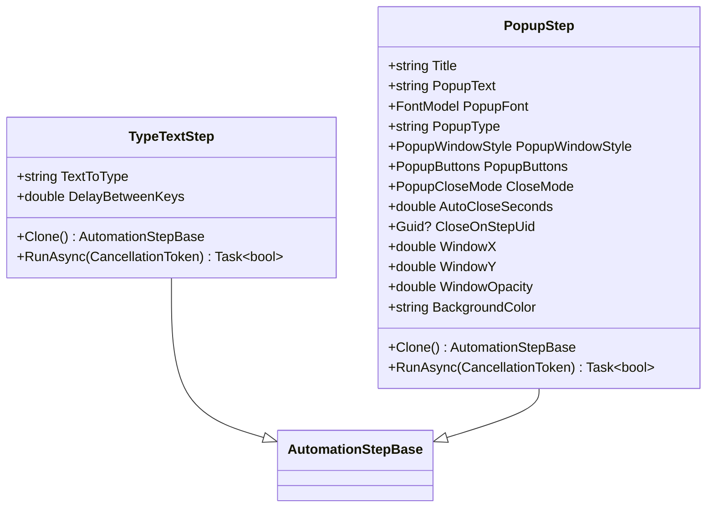
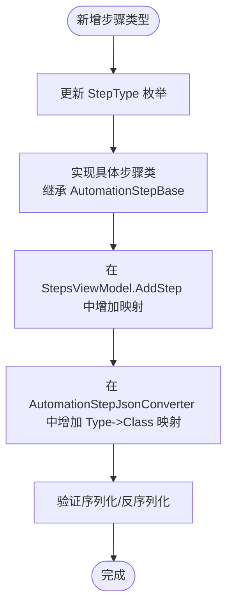
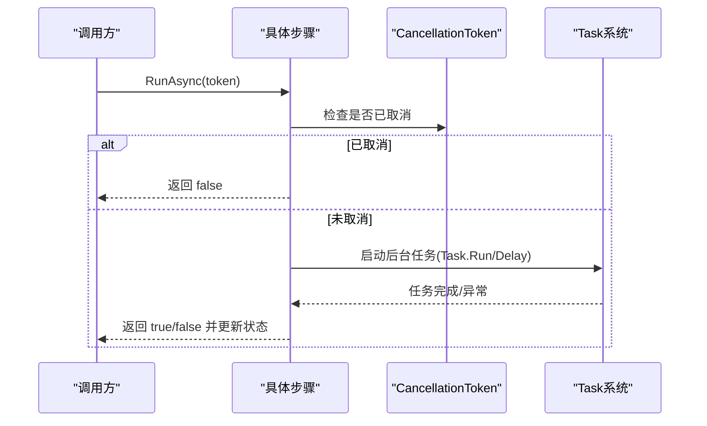
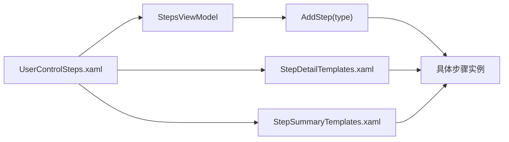
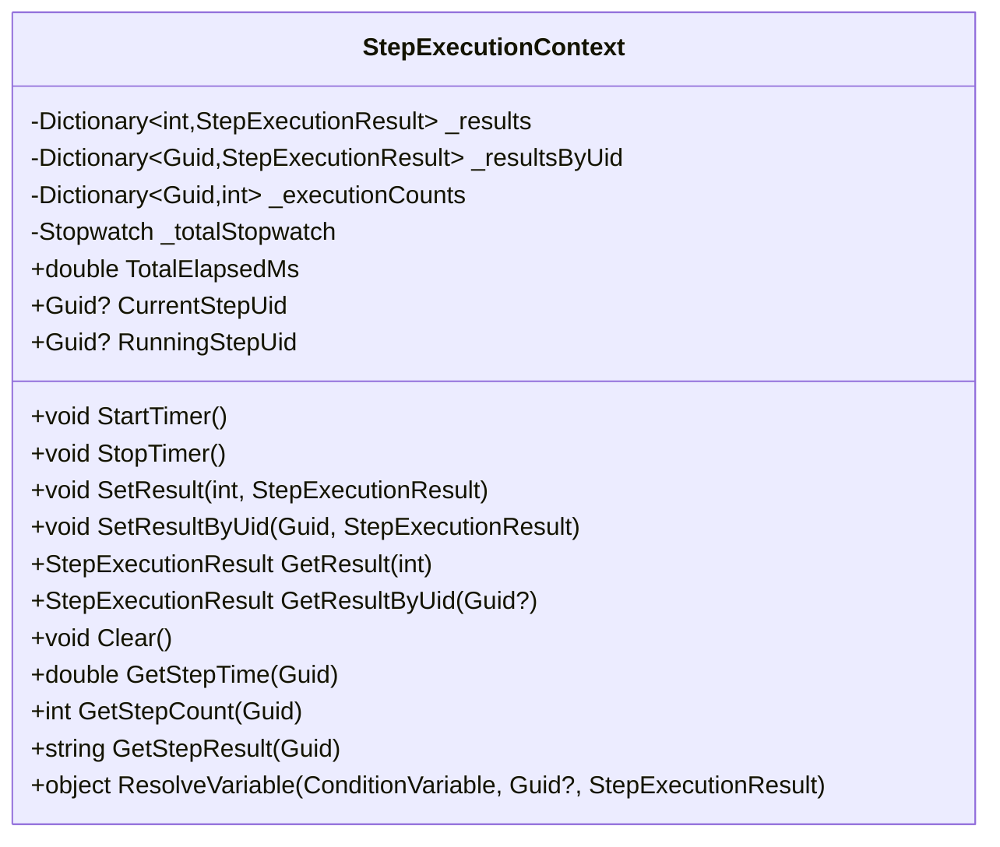
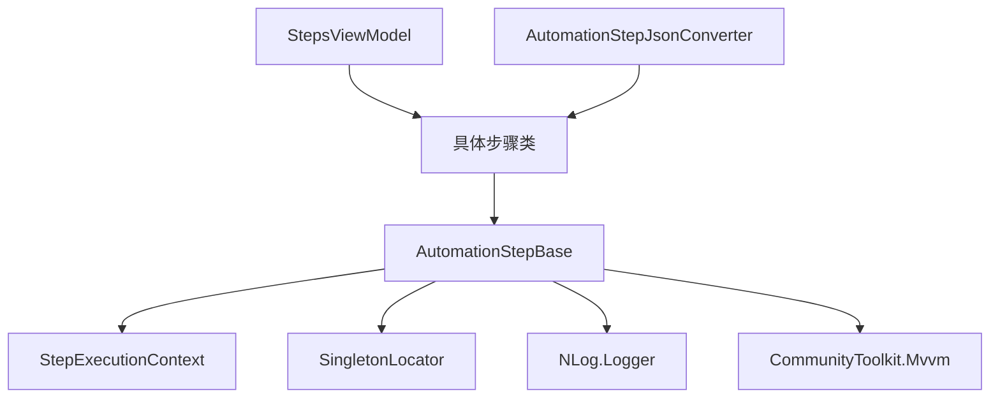

# 自定义步骤开发

<cite>
**本文引用的文件**   
- [AutomationStep.cs](file://ShaoLu/Viewmodels/AutomationStep.cs)
- [AutomationStepModel.cs](file://ShaoLu/Models/AutomationStepModel.cs)
- [AutomationStepJsonConverter.cs](file://ShaoLu/Converters/AutomationStepJsonConverter.cs)
- [StepExecutionContext.cs](file://ShaoLu/Services/StepExecutionContext.cs)
- [StepsViewModel.cs](file://ShaoLu/Viewmodels/StepsViewModel.cs)
- [UserControlSteps.xaml.cs](file://ShaoLu/Views/UserControlSteps.xaml.cs)
- [UserControlSteps.xaml](file://ShaoLu/Views/UserControlSteps.xaml)
- [StepDetailTemplates.xaml](file://ShaoLu/Templates/StepDetailTemplates.xaml)
- [StepSummaryTemplates.xaml](file://ShaoLu/Templates/StepSummaryTemplates.xaml)
</cite>

## 目录
1. [简介](#简介)
2. [项目结构](#项目结构)
3. [核心组件](#核心组件)
4. [架构总览](#架构总览)
5. [详细组件分析](#详细组件分析)
6. [依赖关系分析](#依赖关系分析)
7. [性能考量](#性能考量)
8. [故障排查指南](#故障排查指南)
9. [结论](#结论)
10. [附录：完整示例与最佳实践](#附录完整示例与最佳实践)

## 简介
本指南面向希望在 ShaoLu 应用中扩展“自动化步骤”的开发者。内容覆盖从继承基类、实现属性与执行逻辑，到注册机制、JSON 序列化、UI 模板绑定、异步执行模式、测试策略与性能优化等全流程要点。读者可据此快速创建稳定、可维护、易扩展的自定义步骤类型。

## 项目结构
ShaoLu 采用分层组织：模型（Models）、视图模型（Viewmodels）、服务（Services）、转换器（Converters）、模板（Templates）与视图（Views）。自定义步骤的核心位于 Viewmodels 中的 AutomationStepBase 及其派生类；枚举定义在 Models；JSON 多态序列化由 Converters 提供；执行上下文由 Services 管理；UI 模板与交互由 Templates 和 Views 协作完成。

图表来源
- [AutomationStep.cs:25-296](file://ShaoLu/Viewmodels/AutomationStep.cs#L25-L296)
- [AutomationStepModel.cs:9-24](file://ShaoLu/Models/AutomationStepModel.cs#L9-L24)
- [AutomationStepJsonConverter.cs:14-139](file://ShaoLu/Converters/AutomationStepJsonConverter.cs#L14-L139)
- [StepExecutionContext.cs:11-163](file://ShaoLu/Services/StepExecutionContext.cs#L11-L163)
- [StepsViewModel.cs:186-201](file://ShaoLu/Viewmodels/StepsViewModel.cs#L186-L201)
- [UserControlSteps.xaml.cs:1-44](file://ShaoLu/Views/UserControlSteps.xaml.cs#L1-L44)
- [StepDetailTemplates.xaml:235-255](file://ShaoLu/Templates/StepDetailTemplates.xaml#L235-L255)
- [StepSummaryTemplates.xaml:1-55](file://ShaoLu/Templates/StepSummaryTemplates.xaml#L1-L55)

章节来源
- [AutomationStep.cs:25-296](file://ShaoLu/Viewmodels/AutomationStep.cs#L25-L296)
- [AutomationStepModel.cs:9-24](file://ShaoLu/Models/AutomationStepModel.cs#L9-L24)
- [AutomationStepJsonConverter.cs:14-139](file://ShaoLu/Converters/AutomationStepJsonConverter.cs#L14-L139)
- [StepExecutionContext.cs:11-163](file://ShaoLu/Services/StepExecutionContext.cs#L11-L163)
- [StepsViewModel.cs:186-201](file://ShaoLu/Viewmodels/StepsViewModel.cs#L186-L201)
- [UserControlSteps.xaml.cs:1-44](file://ShaoLu/Views/UserControlSteps.xaml.cs#L1-L44)
- [StepDetailTemplates.xaml:235-255](file://ShaoLu/Templates/StepDetailTemplates.xaml#L235-L255)
- [StepSummaryTemplates.xaml:1-55](file://ShaoLu/Templates/StepSummaryTemplates.xaml#L1-L55)

## 核心组件
- 基类 AutomationStepBase：提供通用属性（Uid、Name、Description、Type、WaitTime、IsNeed、EnableLog、跳转 TrueGotoUid/FalseGotoUid、条件 Conditions、错误状态等）、克隆与执行接口（Clone、RunAsync），以及基于 CommunityToolkit.Mvvm 的属性变更通知。
- 枚举 StepType/StepErrorType：定义步骤类型与错误类型，是 JSON 序列化与 UI 选择的基础。
- JSON 转换器 AutomationStepJsonConverter：支持多态反序列化，兼容旧版行号跳转字段，并负责将 Type 映射到具体步骤类。
- 执行上下文 StepExecutionContext：集中保存各步骤执行结果、统计信息，并提供条件变量解析能力。
- StepsViewModel：步骤工厂与集合管理，通过字符串参数实例化具体步骤类型。
- UI 模板与控件：XAML 模板根据步骤类型显示不同编辑界面，用户交互通过 UserControlSteps 触发新增步骤。

章节来源
- [AutomationStep.cs:25-296](file://ShaoLu/Viewmodels/AutomationStep.cs#L25-L296)
- [AutomationStepModel.cs:9-43](file://ShaoLu/Models/AutomationStepModel.cs#L9-L43)
- [AutomationStepJsonConverter.cs:14-139](file://ShaoLu/Converters/AutomationStepJsonConverter.cs#L14-L139)
- [StepExecutionContext.cs:11-163](file://ShaoLu/Services/StepExecutionContext.cs#L11-L163)
- [StepsViewModel.cs:186-201](file://ShaoLu/Viewmodels/StepsViewModel.cs#L186-L201)
- [UserControlSteps.xaml.cs:1-44](file://ShaoLu/Views/UserControlSteps.xaml.cs#L1-L44)

## 架构总览
下图展示自定义步骤从创建、序列化、执行到 UI 绑定的整体流程。

图表来源
- [UserControlSteps.xaml.cs:26-43](file://ShaoLu/Views/UserControlSteps.xaml.cs#L26-L43)
- [StepsViewModel.cs:186-201](file://ShaoLu/Viewmodels/StepsViewModel.cs#L186-L201)
- [AutomationStepJsonConverter.cs:32-139](file://ShaoLu/Converters/AutomationStepJsonConverter.cs#L32-L139)
- [StepExecutionContext.cs:39-52](file://ShaoLu/Services/StepExecutionContext.cs#L39-L52)
- [AutomationStep.cs:288-296](file://ShaoLu/Viewmodels/AutomationStep.cs#L288-L296)

## 详细组件分析

### 基类与属性体系（AutomationStepBase）
- 构造函数：默认构造初始化基础属性；占位构造用于“无跳转”等特殊场景。
- 属性：使用 SetProperty 实现 PropertyChanged 通知；Uid 在 setter 中忽略 Guid.Empty 以避免覆盖已有标识；跳转属性支持只读行号计算。
- 条件与日志：Conditions 列表与 EnableLog 开关；AddConditionCommand/RemoveConditionCommand 提供 UI 操作。
- 执行接口：抽象 Clone() 与 RunAsync(CancellationToken)，并提供同步 Run() 包装。

图表来源
- [AutomationStep.cs:25-296](file://ShaoLu/Viewmodels/AutomationStep.cs#L25-L296)

章节来源
- [AutomationStep.cs:25-296](file://ShaoLu/Viewmodels/AutomationStep.cs#L25-L296)

### 具体步骤实现示例（以 TypeTextStep 与 PopupStep 为例）
- TypeTextStep：输入文本、按键间隔控制、延迟等待、调用 Autogui 进行安全或带间隔的输入。
- PopupStep：弹窗标题、文本、字体、样式、按钮配置、关闭模式（点击/超时/到达步骤）、位置与背景色设置；RunAsync 中处理取消令牌、超时与 StepReached 模式。

图表来源
- [AutomationStep.cs:300-365](file://ShaoLu/Viewmodels/AutomationStep.cs#L300-L365)
- [AutomationStep.cs:684-1014](file://ShaoLu/Viewmodels/AutomationStep.cs#L684-L1014)

章节来源
- [AutomationStep.cs:300-365](file://ShaoLu/Viewmodels/AutomationStep.cs#L300-L365)
- [AutomationStep.cs:684-1014](file://ShaoLu/Viewmodels/AutomationStep.cs#L684-L1014)

### 步骤注册机制（StepType 枚举扩展与工厂模式）
- 扩展 StepType：在枚举中添加新类型值，确保与具体步骤类的映射一致。
- 工厂模式集成：StepsViewModel.AddStep 根据字符串参数实例化对应步骤类，便于 UI 菜单与命令驱动。
- 反射调用优化：JSON 转换器内部通过 switch 映射 StepType 到具体类型，避免运行时反射开销；如需动态扩展，可在映射表中注册。

图表来源
- [AutomationStepModel.cs:9-24](file://ShaoLu/Models/AutomationStepModel.cs#L9-L24)
- [StepsViewModel.cs:186-201](file://ShaoLu/Viewmodels/StepsViewModel.cs#L186-L201)
- [AutomationStepJsonConverter.cs:87-104](file://ShaoLu/Converters/AutomationStepJsonConverter.cs#L87-L104)

章节来源
- [AutomationStepModel.cs:9-24](file://ShaoLu/Models/AutomationStepModel.cs#L9-L24)
- [StepsViewModel.cs:186-201](file://ShaoLu/Viewmodels/StepsViewModel.cs#L186-L201)
- [AutomationStepJsonConverter.cs:87-104](file://ShaoLu/Converters/AutomationStepJsonConverter.cs#L87-L104)

### 属性绑定与数据验证
- ObservableObject 继承：通过 CommunityToolkit.Mvvm 的 SetProperty 自动触发 PropertyChanged，简化 MVVM 绑定。
- 数据注解：部分属性使用 JsonPropertyName/JsonIgnore 控制序列化行为；复杂集合可使用自定义 JsonConverter。
- 验证建议：对关键属性（如名称、路径、索引）进行空值与范围校验，必要时抛出异常或设置 IsError/ErrorMessage。

章节来源
- [AutomationStep.cs:25-296](file://ShaoLu/Viewmodels/AutomationStep.cs#L25-L296)
- [AutomationStep.cs:518-680](file://ShaoLu/Viewmodels/AutomationStep.cs#L518-L680)

### 异步编程模式（CancellationToken、Task、异常处理）
- CancellationToken：所有 RunAsync 方法应接受并传播取消令牌，确保长时间任务可被中断。
- Task 返回类型：返回 bool 表示执行成功与否；结合 IsTrue/LastResult 记录结果。
- 异常处理：在关键分支捕获异常并设置 IsError/ErrorType，保证 UI 反馈与日志记录。

图表来源
- [AutomationStep.cs:345-365](file://ShaoLu/Viewmodels/AutomationStep.cs#L345-L365)
- [AutomationStep.cs:888-1014](file://ShaoLu/Viewmodels/AutomationStep.cs#L888-L1014)

章节来源
- [AutomationStep.cs:345-365](file://ShaoLu/Viewmodels/AutomationStep.cs#L345-L365)
- [AutomationStep.cs:888-1014](file://ShaoLu/Viewmodels/AutomationStep.cs#L888-L1014)

### UI 集成（XAML 模板、转换器、用户交互）
- XAML 模板：StepDetailTemplates 与 StepSummaryTemplates 为不同步骤类型提供编辑与摘要界面；通过 DataType 绑定具体步骤类。
- 转换器：StepTemplateSelector 等转换器用于类型到模板的选择与可见性控制。
- 用户交互：UserControlSteps 通过 SplitButton/MenuItem 触发 AddStepCommand，传入类型字符串创建步骤。

图表来源
- [UserControlSteps.xaml.cs:26-43](file://ShaoLu/Views/UserControlSteps.xaml.cs#L26-L43)
- [StepDetailTemplates.xaml:235-255](file://ShaoLu/Templates/StepDetailTemplates.xaml#L235-L255)
- [StepSummaryTemplates.xaml:1-55](file://ShaoLu/Templates/StepSummaryTemplates.xaml#L1-L55)

章节来源
- [UserControlSteps.xaml.cs:26-43](file://ShaoLu/Views/UserControlSteps.xaml.cs#L26-L43)
- [StepDetailTemplates.xaml:235-255](file://ShaoLu/Templates/StepDetailTemplates.xaml#L235-L255)
- [StepSummaryTemplates.xaml:1-55](file://ShaoLu/Templates/StepSummaryTemplates.xaml#L1-L55)

### 执行上下文与条件变量
- StepExecutionContext：集中存储每个步骤的执行结果（按行号与 Uid），并提供变量解析（当前步骤自身或其他步骤的结果）。
- 条件判断：步骤可通过 Conditions 列表定义规则，引用变量包括 IsTrue、Similarity、ExecutionTimeMs、OCRText、PopupResult 等。

图表来源
- [StepExecutionContext.cs:11-163](file://ShaoLu/Services/StepExecutionContext.cs#L11-L163)

章节来源
- [StepExecutionContext.cs:11-163](file://ShaoLu/Services/StepExecutionContext.cs#L11-L163)

## 依赖关系分析
- 低耦合高内聚：AutomationStepBase 仅依赖必要的服务与工具；具体步骤类关注自身业务逻辑。
- 外部依赖：Autogui（系统交互）、SingletonLocator（服务定位）、NLog（日志）、CommunityToolkit.Mvvm（MVVM 基础设施）。
- 潜在循环依赖：避免步骤类直接依赖 StepsViewModel；通过 SingletonLocator 获取服务集合。

图表来源
- [AutomationStep.cs:25-296](file://ShaoLu/Viewmodels/AutomationStep.cs#L25-L296)
- [StepExecutionContext.cs:11-163](file://ShaoLu/Services/StepExecutionContext.cs#L11-L163)
- [StepsViewModel.cs:186-201](file://ShaoLu/Viewmodels/StepsViewModel.cs#L186-L201)
- [AutomationStepJsonConverter.cs:14-139](file://ShaoLu/Converters/AutomationStepJsonConverter.cs#L14-L139)

章节来源
- [AutomationStep.cs:25-296](file://ShaoLu/Viewmodels/AutomationStep.cs#L25-L296)
- [StepExecutionContext.cs:11-163](file://ShaoLu/Services/StepExecutionContext.cs#L11-L163)
- [StepsViewModel.cs:186-201](file://ShaoLu/Viewmodels/StepsViewModel.cs#L186-L201)
- [AutomationStepJsonConverter.cs:14-139](file://ShaoLu/Converters/AutomationStepJsonConverter.cs#L14-L139)

## 性能考量
- 内存管理：避免在 RunAsync 中创建大对象；及时释放临时资源（如文件流、图像对象）。
- 线程安全：共享集合（如 AllSteps）访问需考虑并发；使用线程安全的字典或加锁。
- 资源释放：弹窗窗口在 finally 块中清理；取消令牌注册确保 UI 线程正确关闭。
- I/O 优化：批量读取文件时优先使用流式 API；避免频繁磁盘访问。

[本节为通用指导，不直接分析具体文件]

## 故障排查指南
- 常见问题：
  - JSON 反序列化失败：检查 Type 字段是否存在且合法；确认映射表包含新类型。
  - 跳转无效：确认 Uid 唯一且未被覆盖；检查 TrueGotoUid/FalseGotoUid 指向有效步骤。
  - 弹窗未关闭：检查 CloseMode 与取消令牌注册；确保 UI 线程调用 Close。
  - 条件变量为空：确认 StepExecutionContext 已设置结果；检查变量解析逻辑。
- 调试建议：启用 NLog 日志；在 RunAsync 中记录关键状态；使用断点跟踪执行流。

章节来源
- [AutomationStepJsonConverter.cs:32-139](file://ShaoLu/Converters/AutomationStepJsonConverter.cs#L32-L139)
- [AutomationStep.cs:888-1014](file://ShaoLu/Viewmodels/AutomationStep.cs#L888-L1014)
- [StepExecutionContext.cs:112-160](file://ShaoLu/Services/StepExecutionContext.cs#L112-L160)

## 结论
通过遵循本指南，开发者可以高效地扩展 ShaoLu 的步骤类型，确保代码结构清晰、执行可靠、UI 友好、易于测试与维护。关键在于：严格实现基类契约、完善属性与验证、正确使用异步与取消、合理设计 JSON 序列化与 UI 模板、并在测试中覆盖边界情况。

[本节为总结，不直接分析具体文件]

## 附录：完整示例与最佳实践
- 新增步骤类型步骤：
  1. 在 StepType 枚举中添加新值。
  2. 创建派生自 AutomationStepBase 的具体类，实现 Clone 与 RunAsync。
  3. 在 StepsViewModel.AddStep 中增加字符串到类型的映射。
  4. 在 AutomationStepJsonConverter 中增加 Type->Class 映射。
  5. 在 XAML 模板中为新类型添加详情与摘要模板。
  6. 编写单元测试：模拟输入、验证输出、测试取消与异常路径。
- 最佳实践：
  - 属性命名与注释：保持语义清晰，提供必要文档。
  - 错误处理：统一设置 IsError/ErrorType，并记录日志。
  - 异步规范：始终传播 CancellationToken，避免阻塞 UI 线程。
  - 资源管理：使用 using 语句与 finally 块确保资源释放。
  - 测试覆盖：边界条件（空输入、超长文本、非法路径）、并发场景、取消与超时。

章节来源
- [AutomationStepModel.cs:9-24](file://ShaoLu/Models/AutomationStepModel.cs#L9-L24)
- [StepsViewModel.cs:186-201](file://ShaoLu/Viewmodels/StepsViewModel.cs#L186-L201)
- [AutomationStepJsonConverter.cs:87-104](file://ShaoLu/Converters/AutomationStepJsonConverter.cs#L87-L104)
- [StepDetailTemplates.xaml:235-255](file://ShaoLu/Templates/StepDetailTemplates.xaml#L235-L255)
- [StepSummaryTemplates.xaml:1-55](file://ShaoLu/Templates/StepSummaryTemplates.xaml#L1-L55)