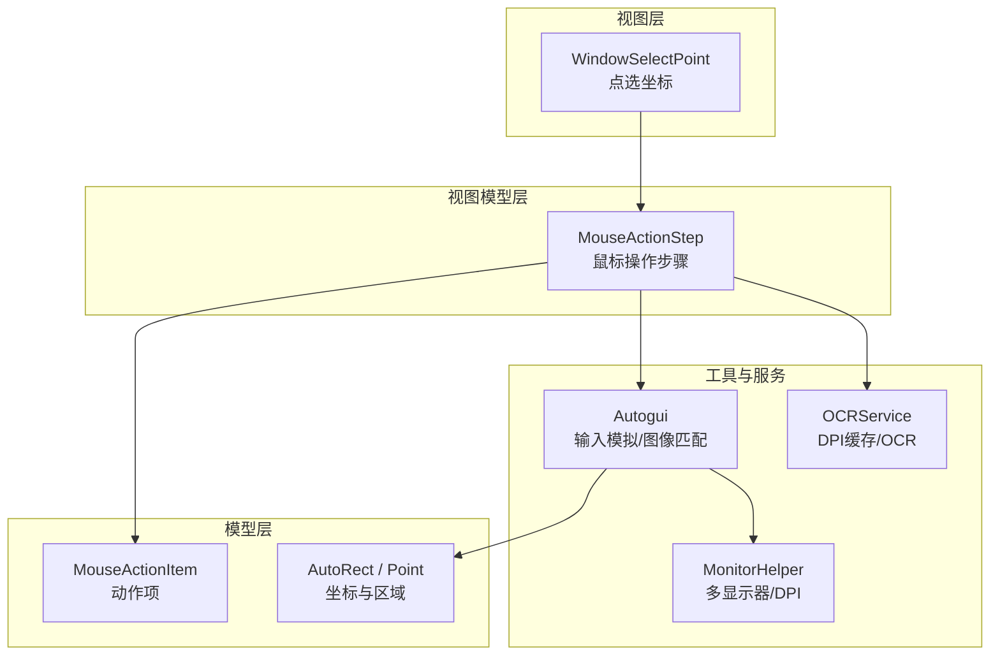
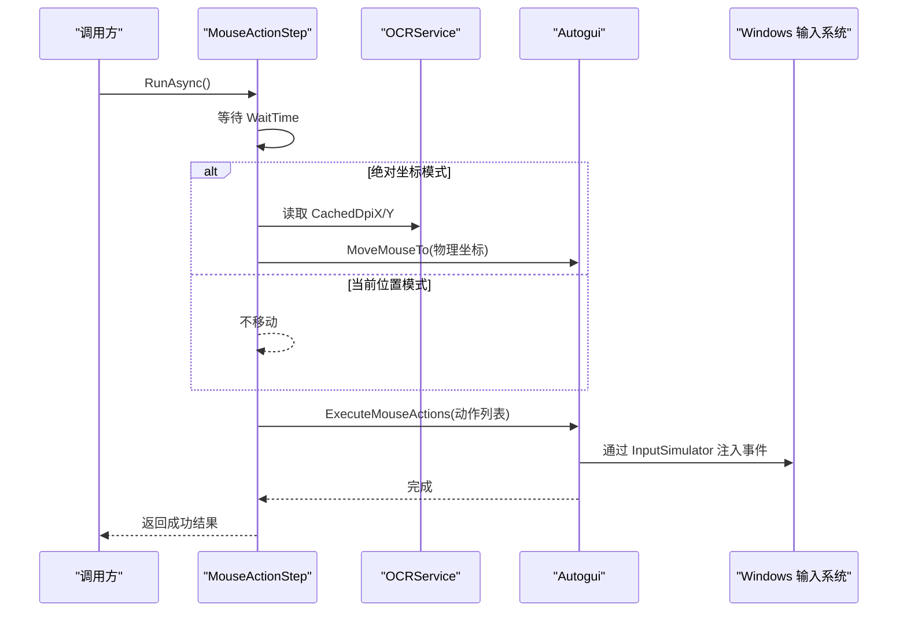
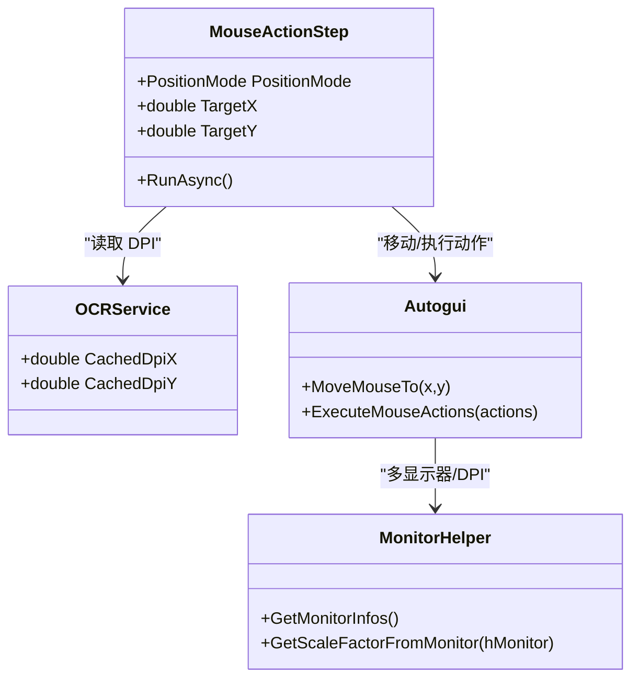
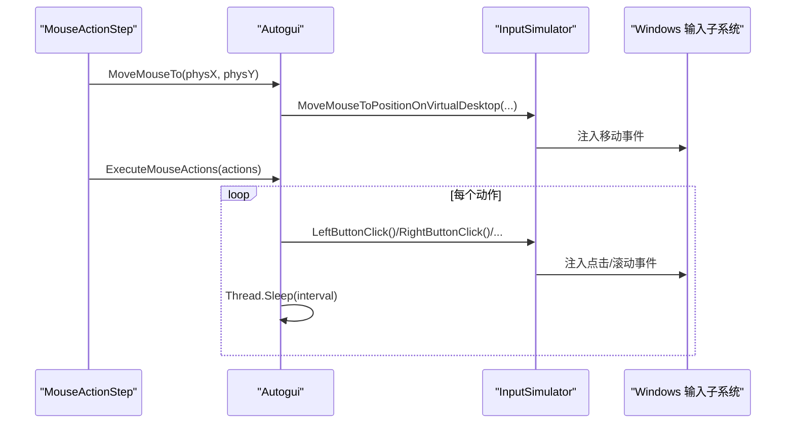
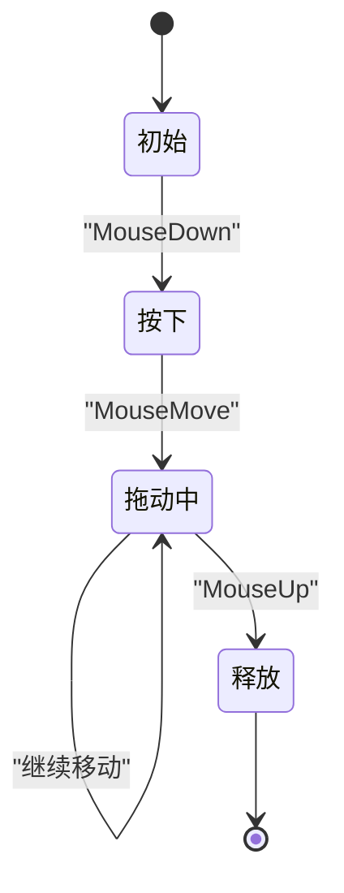
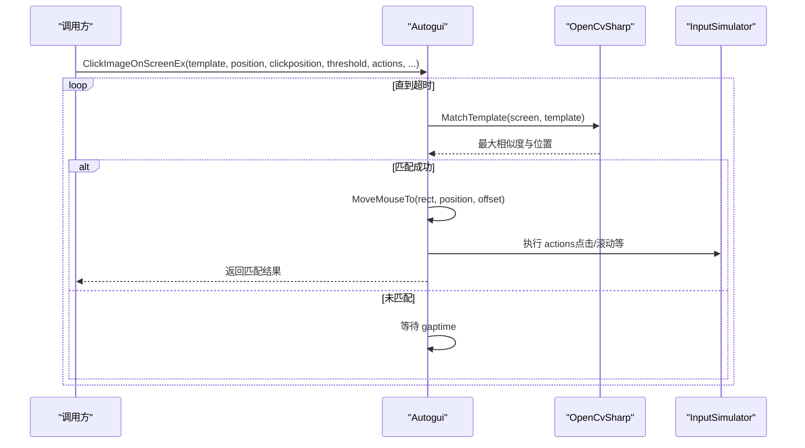
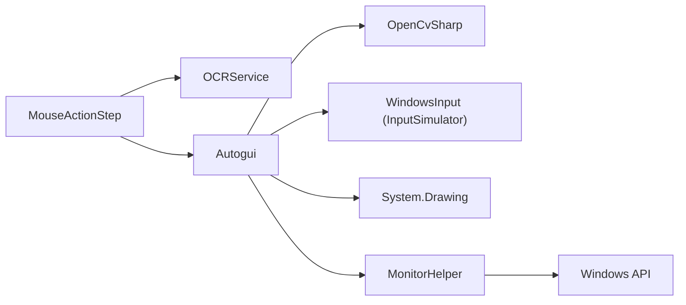

# 鼠标操作步骤

<cite>
**本文引用的文件**   
- [MouseActionStep.cs](file://ShaoLu/Viewmodels/MouseActionStep.cs)
- [MouseActionItem.cs](file://ShaoLu/Models/MouseActionItem.cs)
- [Autogui.cs](file://ShaoLu/Utils/Autogui.cs)
- [OCRService.cs](file://ShaoLu/Services/OCRService.cs)
- [NativeMethods.cs](file://ShaoLu/Utils/NativeMethods.cs)
- [WindowSelectPoint.xaml.cs](file://ShaoLu/Views/WindowSelectPoint.xaml.cs)
- [MonitorHelper.cs](file://ShaoLu/Tools/ImageEdit/Helpers/MonitorHelper.cs)
- [DragState.cs](file://ShaoLu/Tools/ImageEdit/Services/State/DragState.cs)
</cite>

## 目录
1. [简介](#简介)
2. [项目结构](#项目结构)
3. [核心组件](#核心组件)
4. [架构总览](#架构总览)
5. [详细组件分析](#详细组件分析)
6. [依赖关系分析](#依赖关系分析)
7. [性能考虑](#性能考虑)
8. [故障排查指南](#故障排查指南)
9. [结论](#结论)

## 简介
本文件为 ShaoLu 应用的“鼠标操作步骤”（MouseActionStep）提供系统化、可操作的技术文档。内容覆盖：
- 鼠标操作类型分类与执行流程
- 坐标定位机制（绝对坐标、当前鼠标位置、DPI 缩放与多显示器支持）
- 鼠标模拟实现（InputSimulator 调用、Windows API 封装、事件注入）
- 拖拽相关逻辑与边界处理（基于现有 UI 工具中的状态机）
- 延迟与精度控制（动作间隔、等待时间、抖动规避建议）
- 与图像识别的集成方式（模板匹配定位与点击）
- 错误处理与重试策略
- 性能优化与调试技巧

## 项目结构
围绕 MouseActionStep 的关键代码分布在以下模块：
- Viewmodels：步骤定义与执行入口（MouseActionStep）
- Models：动作项与通用数据结构（MouseActionItem、AutoRect、Point）
- Utils：底层自动化能力（Autogui，封装 InputSimulator、屏幕截图、图像匹配等）
- Services：OCR 服务与 DPI 缓存（OCRService）
- Views：点选窗口（WindowSelectPoint）
- Tools/ImageEdit：多显示器与 DPI、拖拽状态机（MonitorHelper、DragState）

图表来源
- [MouseActionStep.cs:1-160](file://ShaoLu/Viewmodels/MouseActionStep.cs#L1-L160)
- [MouseActionItem.cs:1-57](file://ShaoLu/Models/MouseActionItem.cs#L1-L57)
- [Autogui.cs:1-656](file://ShaoLu/Utils/Autogui.cs#L1-L656)
- [OCRService.cs:1-159](file://ShaoLu/Services/OCRService.cs#L1-L159)
- [MonitorHelper.cs:1-71](file://ShaoLu/Tools/ImageEdit/Helpers/MonitorHelper.cs#L1-L71)
- [WindowSelectPoint.xaml.cs:1-90](file://ShaoLu/Views/WindowSelectPoint.xaml.cs#L1-L90)

章节来源
- [MouseActionStep.cs:1-160](file://ShaoLu/Viewmodels/MouseActionStep.cs#L1-L160)
- [MouseActionItem.cs:1-57](file://ShaoLu/Models/MouseActionItem.cs#L1-L57)
- [Autogui.cs:1-656](file://ShaoLu/Utils/Autogui.cs#L1-L656)
- [OCRService.cs:1-159](file://ShaoLu/Services/OCRService.cs#L1-L159)
- [MonitorHelper.cs:1-71](file://ShaoLu/Tools/ImageEdit/Helpers/MonitorHelper.cs#L1-L71)
- [WindowSelectPoint.xaml.cs:1-90](file://ShaoLu/Views/WindowSelectPoint.xaml.cs#L1-L90)

## 核心组件
- MouseActionStep：定义鼠标操作步骤的位置模式、目标坐标与动作序列，负责执行流程与结果设置。
- MouseActionItem：描述单个鼠标动作的类型、次数与间隔。
- Autogui：封装输入模拟（移动、点击、滚动）、图像匹配与屏幕截图、文本输入等。
- OCRService：维护 DPI 缓存，提供 OCR 能力；被用于 DPI 转换。
- WindowSelectPoint：全屏点选窗口，返回逻辑像素坐标。
- MonitorHelper：枚举显示器与获取 DPI，支撑多显示器与高 DPI 场景。

章节来源
- [MouseActionStep.cs:1-160](file://ShaoLu/Viewmodels/MouseActionStep.cs#L1-L160)
- [MouseActionItem.cs:1-57](file://ShaoLu/Models/MouseActionItem.cs#L1-L57)
- [Autogui.cs:1-656](file://ShaoLu/Utils/Autogui.cs#L1-L656)
- [OCRService.cs:1-159](file://ShaoLu/Services/OCRService.cs#L1-L159)
- [WindowSelectPoint.xaml.cs:1-90](file://ShaoLu/Views/WindowSelectPoint.xaml.cs#L1-L90)
- [MonitorHelper.cs:1-71](file://ShaoLu/Tools/ImageEdit/Helpers/MonitorHelper.cs#L1-L71)

## 架构总览
MouseActionStep 作为步骤执行器，协调坐标定位与动作执行；Autogui 作为底层能力提供者，统一封装 Windows 输入模拟与图像识别；OCRService 提供 DPI 缓存以保障跨显示器与高 DPI 下的坐标准确性。

图表来源
- [MouseActionStep.cs:112-144](file://ShaoLu/Viewmodels/MouseActionStep.cs#L112-L144)
- [Autogui.cs:193-254](file://ShaoLu/Utils/Autogui.cs#L193-L254)
- [Autogui.cs:311-339](file://ShaoLu/Utils/Autogui.cs#L311-L339)
- [OCRService.cs:18-48](file://ShaoLu/Services/OCRService.cs#L18-L48)

## 详细组件分析

### 鼠标操作类型与执行流程
- 支持的鼠标动作类型：左键单击、右键单击、双击、向上滚动、向下滚动。
- 动作项包含：类型、执行次数、动作间隔（秒）。
- 执行流程：先根据位置模式移动到目标点（或保持当前位置），再顺序执行动作列表，每次动作后按间隔休眠。

```mermaid
flowchart TD
Start(["开始"]) --> Mode{"位置模式"}
Mode --> |Absolute| ToAbs["计算物理坐标并移动"]
Mode --> |CurrentMouse| KeepPos["保持当前位置"]
ToAbs --> ExecSeq["执行动作序列"]
KeepPos --> ExecSeq
ExecSeq --> ForEach["遍历动作项"]
ForEach --> DoAction{"动作类型"}
DoAction --> |LeftClick| LClick["左键点击"]
DoAction --> |RightClick| RClick["右键点击"]
DoAction --> |DoubleClick| DClick["双击"]
DoAction --> |ScrollUp| ScrollU["向上滚动"]
DoAction --> |ScrollDown| ScrollD["向下滚动"]
LClick --> Sleep["按间隔休眠"]
RClick --> Sleep
DClick --> Sleep
ScrollU --> Sleep
ScrollD --> Sleep
Sleep --> Next{"是否还有动作"}
Next --> |是| ForEach
Next --> |否| End(["结束"])
```

图表来源
- [MouseActionItem.cs:9-44](file://ShaoLu/Models/MouseActionItem.cs#L9-L44)
- [Autogui.cs:311-339](file://ShaoLu/Utils/Autogui.cs#L311-L339)

章节来源
- [MouseActionItem.cs:1-57](file://ShaoLu/Models/MouseActionItem.cs#L1-L57)
- [Autogui.cs:311-339](file://ShaoLu/Utils/Autogui.cs#L311-L339)

### 坐标定位机制
- 绝对坐标模式：将逻辑像素坐标乘以 DPI 缩放因子得到物理像素坐标，再移动鼠标。
- 当前位置模式：不进行移动，直接执行动作。
- DPI 与多显示器：OCRService 缓存 DPI；Autogui.MoveMouseTo 使用虚拟桌面坐标归一化（65535 映射），适配多显示器。

图表来源
- [MouseActionStep.cs:112-144](file://ShaoLu/Viewmodels/MouseActionStep.cs#L112-L144)
- [OCRService.cs:18-48](file://ShaoLu/Services/OCRService.cs#L18-L48)
- [Autogui.cs:193-196](file://ShaoLu/Utils/Autogui.cs#L193-L196)
- [MonitorHelper.cs:16-47](file://ShaoLu/Tools/ImageEdit/Helpers/MonitorHelper.cs#L16-L47)

章节来源
- [MouseActionStep.cs:112-144](file://ShaoLu/Viewmodels/MouseActionStep.cs#L112-L144)
- [Autogui.cs:193-196](file://ShaoLu/Utils/Autogui.cs#L193-L196)
- [OCRService.cs:18-48](file://ShaoLu/Services/OCRService.cs#L18-L48)
- [MonitorHelper.cs:16-47](file://ShaoLu/Tools/ImageEdit/Helpers/MonitorHelper.cs#L16-L47)

### 鼠标模拟实现（InputSimulator、Windows API、事件注入）
- Autogui 内部持有 InputSimulator 实例，提供 MoveMouseTo、LeftButtonClick、RightButtonClick、LeftButtonDoubleClick、VerticalScroll 等方法。
- MoveMouseTo 将逻辑坐标转换为虚拟桌面坐标（范围 0–65535），确保跨显示器一致性。
- 文本输入与剪贴板粘贴通过 Keyboard 接口注入按键事件。

图表来源
- [Autogui.cs:42-46](file://ShaoLu/Utils/Autogui.cs#L42-L46)
- [Autogui.cs:193-196](file://ShaoLu/Utils/Autogui.cs#L193-L196)
- [Autogui.cs:311-339](file://ShaoLu/Utils/Autogui.cs#L311-L339)

章节来源
- [Autogui.cs:42-46](file://ShaoLu/Utils/Autogui.cs#L42-L46)
- [Autogui.cs:193-196](file://ShaoLu/Utils/Autogui.cs#L193-L196)
- [Autogui.cs:311-339](file://ShaoLu/Utils/Autogui.cs#L311-L339)

### 拖拽操作的复杂逻辑
- 当前 MouseActionStep 未直接实现拖拽（Drag）动作类型。
- 在 ImageEdit 工具中，存在 DragState 状态机，用于 UI 层面的拖拽（裁剪框移动），具备起始点记录、移动增量计算、边界限制与释放处理。
- 若需扩展 MouseActionStep 支持拖拽，可参考该状态机的思路：记录起点、累积位移、限制边界、在释放时触发目标动作。

图表来源
- [DragState.cs:19-46](file://ShaoLu/Tools/ImageEdit/Services/State/DragState.cs#L19-L46)

章节来源
- [DragState.cs:19-46](file://ShaoLu/Tools/ImageEdit/Services/State/DragState.cs#L19-L46)

### 操作延迟与精度控制
- 步骤级等待：WaitTime（秒）在执行前延时。
- 动作级间隔：MouseActionItem.Interval（秒）控制每次动作之间的休眠。
- 滚动与点击：Autogui.ExecuteMouseActions 在每个动作后休眠指定毫秒数。
- 抖动消除建议：适当增大 Interval，避免高频快速连续事件导致目标应用无法响应。

章节来源
- [MouseActionStep.cs:112-114](file://ShaoLu/Viewmodels/MouseActionStep.cs#L112-L114)
- [MouseActionItem.cs:23-34](file://ShaoLu/Models/MouseActionItem.cs#L23-L34)
- [Autogui.cs:311-339](file://ShaoLu/Utils/Autogui.cs#L311-L339)

### 与图像识别的集成
- Autogui 提供 FindImageOnScreen、ClickImageOnScreenEx 等方法，基于 OpenCvSharp 模板匹配定位目标区域，支持阈值、超时与间隔配置。
- 可在 ClickImageOnScreenEx 中传入动作列表，实现“找到图像后执行一系列鼠标动作”。

图表来源
- [Autogui.cs:59-122](file://ShaoLu/Utils/Autogui.cs#L59-L122)
- [Autogui.cs:256-306](file://ShaoLu/Utils/Autogui.cs#L256-L306)
- [Autogui.cs:344-378](file://ShaoLu/Utils/Autogui.cs#L344-L378)

章节来源
- [Autogui.cs:59-122](file://ShaoLu/Utils/Autogui.cs#L59-L122)
- [Autogui.cs:256-306](file://ShaoLu/Utils/Autogui.cs#L256-L306)
- [Autogui.cs:344-378](file://ShaoLu/Utils/Autogui.cs#L344-L378)

### 错误处理机制
- 图像未匹配：FindImageOnScreen 在超时时抛出异常（语言本地化消息）。
- 空参数检查：MoveMouseTo(AutoRect) 对无效矩形进行防御性返回。
- 线程安全：TypeTextSafe 确保剪贴板操作在 UI 线程执行。
- 步骤执行结果：MouseActionStep.RunAsync 设置 IsTrue、IsError、ErrorType 与 LastResult。

章节来源
- [Autogui.cs:116-122](file://ShaoLu/Utils/Autogui.cs#L116-L122)
- [Autogui.cs:204-210](file://ShaoLu/Utils/Autogui.cs#L204-L210)
- [Autogui.cs:623-651](file://ShaoLu/Utils/Autogui.cs#L623-L651)
- [MouseActionStep.cs:132-144](file://ShaoLu/Viewmodels/MouseActionStep.cs#L132-L144)

## 依赖关系分析
- MouseActionStep 依赖 OCRService（DPI 缓存）与 Autogui（输入模拟与图像匹配）。
- Autogui 依赖 OpenCvSharp（图像处理）、WindowsInput（InputSimulator）、System.Drawing（截图）。
- MonitorHelper 依赖 Windows API（EnumDisplayMonitors、GetDpiForMonitor）以支持多显示器与 DPI。

图表来源
- [MouseActionStep.cs:112-144](file://ShaoLu/Viewmodels/MouseActionStep.cs#L112-L144)
- [Autogui.cs:1-15](file://ShaoLu/Utils/Autogui.cs#L1-L15)
- [MonitorHelper.cs:16-47](file://ShaoLu/Tools/ImageEdit/Helpers/MonitorHelper.cs#L16-L47)

章节来源
- [MouseActionStep.cs:112-144](file://ShaoLu/Viewmodels/MouseActionStep.cs#L112-L144)
- [Autogui.cs:1-15](file://ShaoLu/Utils/Autogui.cs#L1-L15)
- [MonitorHelper.cs:16-47](file://ShaoLu/Tools/ImageEdit/Helpers/MonitorHelper.cs#L16-L47)

## 性能考虑
- 减少重复截图：FindImageOnScreen 已复用 Mat 对象，避免循环内重复转换。
- 合理设置阈值与超时：提高匹配成功率同时避免过长等待。
- 控制动作频率：Interval 不宜过小，防止目标应用无法及时处理事件。
- DPI 缓存：OCRService 缓存 DPI，避免频繁查询 UI 线程属性。
- 多线程执行：RunAsync 使用 Task.Run 执行输入模拟，避免阻塞 UI。

[本节为通用指导，无需特定文件引用]

## 故障排查指南
- 坐标越界或不准确：确认 DPI 缓存是否正确更新；检查 Absolute 模式下 TargetX/TargetY 是否为逻辑像素。
- 多显示器问题：验证 MoveMouseTo 使用的虚拟桌面坐标映射是否正确；必要时通过 MonitorHelper 校验各显示器 DPI。
- 图像匹配失败：调整阈值、增加超时时间；确保模板图像清晰且与目标一致。
- 动作无响应：增大 Interval；检查目标窗口焦点；必要时先移动鼠标到目标区域再点击。
- 剪贴板输入失败：确保 TypeTextSafe 在 UI 线程执行；检查剪贴板权限与内容格式。

章节来源
- [OCRService.cs:31-48](file://ShaoLu/Services/OCRService.cs#L31-L48)
- [Autogui.cs:193-196](file://ShaoLu/Utils/Autogui.cs#L193-L196)
- [Autogui.cs:623-651](file://ShaoLu/Utils/Autogui.cs#L623-L651)
- [Autogui.cs:59-122](file://ShaoLu/Utils/Autogui.cs#L59-L122)

## 结论
MouseActionStep 提供了灵活的鼠标操作步骤能力，结合 Autogui 的输入模拟与图像识别、OCRService 的 DPI 缓存，能够在多显示器与高 DPI 环境下稳定执行点击、双击、右键与滚动等操作。对于拖拽需求，可参考 ImageEdit 中的 DragState 状态机进行扩展。通过合理的延迟与阈值配置、完善的错误处理与调试手段，可进一步提升自动化脚本的鲁棒性与性能。

[本节为总结性内容，无需特定文件引用]