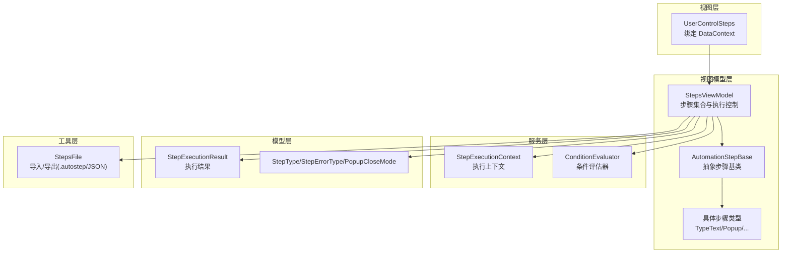
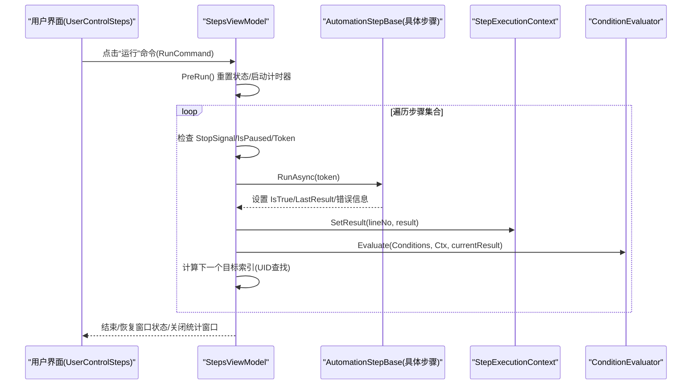
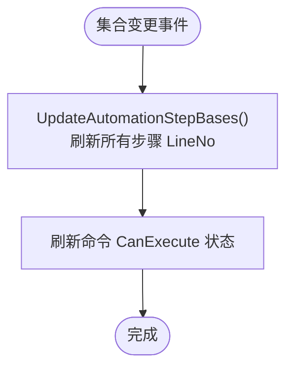
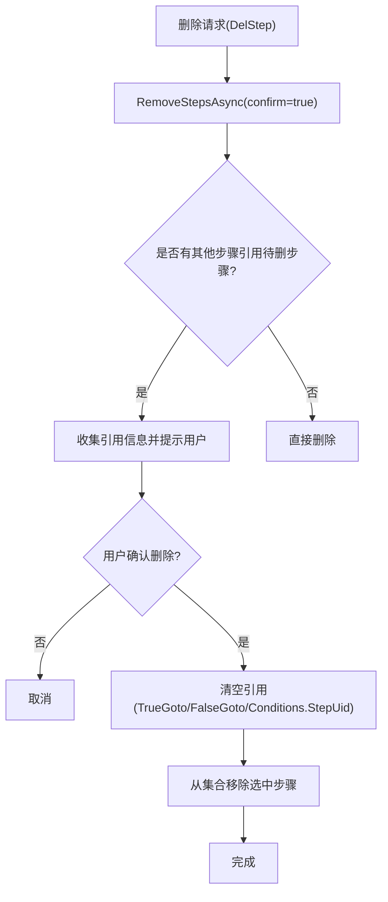
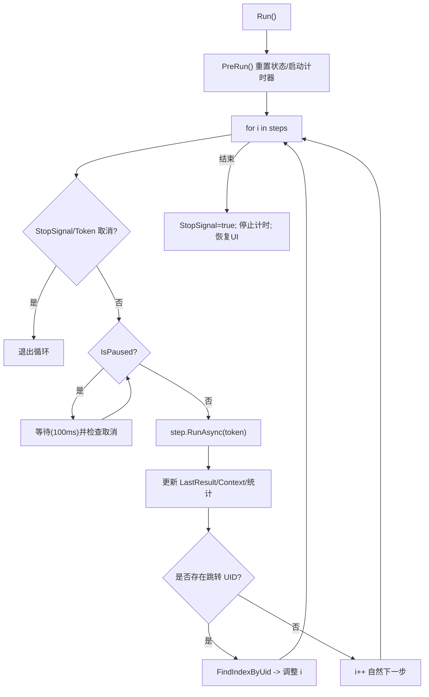
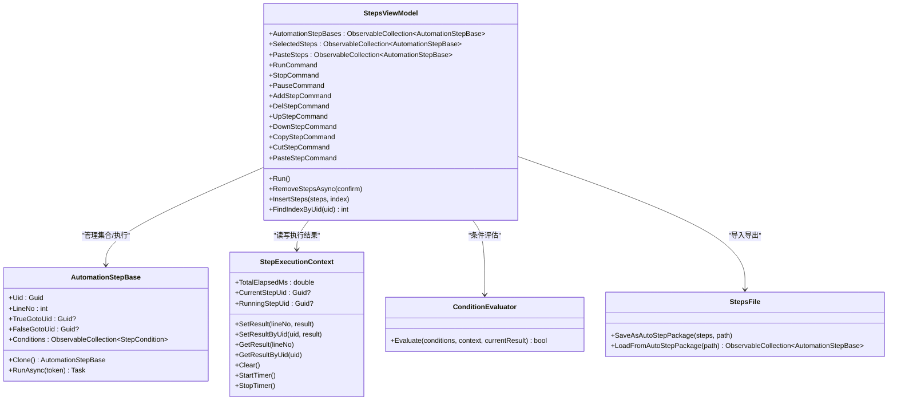

# 步骤视图模型

<cite>
**本文引用的文件**   
- [StepsViewModel.cs](file://ShaoLu/Viewmodels/StepsViewModel.cs)
- [AutomationStep.cs](file://ShaoLu/Viewmodels/AutomationStep.cs)
- [AutomationStepModel.cs](file://ShaoLu/Models/AutomationStepModel.cs)
- [StepExecutionContext.cs](file://ShaoLu/Services/StepExecutionContext.cs)
- [ConditionEvaluator.cs](file://ShaoLu/Services/ConditionEvaluator.cs)
- [StepExecutionResult.cs](file://ShaoLu/Models/StepExecutionResult.cs)
- [StepsFile.cs](file://ShaoLu/Utils/StepsFile.cs)
- [MainViewModel.cs](file://ShaoLu/Viewmodels/MainViewModel.cs)
- [UserControlSteps.xaml.cs](file://ShaoLu/Views/UserControlSteps.xaml.cs)
</cite>

## 目录
1. [简介](#简介)
2. [项目结构](#项目结构)
3. [核心组件](#核心组件)
4. [架构总览](#架构总览)
5. [详细组件分析](#详细组件分析)
6. [依赖关系分析](#依赖关系分析)
7. [性能考量](#性能考量)
8. [故障排查指南](#故障排查指南)
9. [结论](#结论)
10. [附录：使用示例与最佳实践](#附录使用示例与最佳实践)

## 简介
本文件为 ShaoLu 应用的 StepsViewModel 视图模型提供系统化、可操作的技术文档。内容覆盖步骤集合管理（ObservableCollection 的使用、添加/删除/排序）、数据绑定机制、执行控制（RunAsync、暂停/继续/停止、进度跟踪）、验证系统（参数校验、依赖检查、冲突检测）、复制粘贴与批量操作、撤销重做机制（现状说明）、UI 交互模式（命令绑定、事件处理）、模板管理与导入导出等。

## 项目结构
StepsViewModel 位于 Viewmodels 层，负责编排自动化步骤的增删改查、执行流程与上下文状态；步骤基类与具体步骤类型位于 AutomationStep.cs；执行上下文与条件评估器位于 Services；结果模型位于 Models；导入导出逻辑位于 Utils.StepsFile；UI 通过 UserControlSteps 绑定到 StepsViewModel。



**图表来源**
- [StepsViewModel.cs:1-120](file://ShaoLu/Viewmodels/StepsViewModel.cs#L1-L120)
- [AutomationStep.cs:25-296](file://ShaoLu/Viewmodels/AutomationStep.cs#L25-L296)
- [StepExecutionContext.cs:1-80](file://ShaoLu/Services/StepExecutionContext.cs#L1-L80)
- [ConditionEvaluator.cs:1-52](file://ShaoLu/Services/ConditionEvaluator.cs#L1-L52)
- [StepExecutionResult.cs:1-51](file://ShaoLu/Models/StepExecutionResult.cs#L1-L51)
- [StepsFile.cs:1-120](file://ShaoLu/Utils/StepsFile.cs#L1-L120)
- [AutomationStepModel.cs:1-73](file://ShaoLu/Models/AutomationStepModel.cs#L1-L73)

**章节来源**
- [StepsViewModel.cs:1-120](file://ShaoLu/Viewmodels/StepsViewModel.cs#L1-L120)
- [UserControlSteps.xaml.cs:1-44](file://ShaoLu/Views/UserControlSteps.xaml.cs#L1-L44)

## 核心组件
- StepsViewModel：步骤集合与执行编排的核心视图模型，维护 ObservableCollection<AutomationStepBase>，暴露 Run/Pause/Stop/Add/Del/Up/Down/Copy/Cut/Paste 等命令，协调 StepExecutionContext 与 ConditionEvaluator。
- AutomationStepBase 及派生类：定义步骤通用属性（Uid、LineNo、TrueGotoUid/FalseGotoUid、Conditions、EnableLog、SelfReferenceLimit 等）与抽象 RunAsync；具体步骤实现各自业务逻辑。
- StepExecutionContext：保存每次运行中各步骤的执行结果、当前/正在执行的步骤 Uid、总计时器等，供条件变量解析与统计展示。
- ConditionEvaluator：根据 StepCondition 列表与上下文评估最终布尔值，支持 AND/OR 组合、文本提取、正则匹配等。
- StepsFile：将步骤序列化为 .autostep 压缩包或 JSON，并加载时进行兼容处理（旧版行号跳转转 Uid）。

**章节来源**
- [StepsViewModel.cs:120-220](file://ShaoLu/Viewmodels/StepsViewModel.cs#L120-L220)
- [AutomationStep.cs:25-296](file://ShaoLu/Viewmodels/AutomationStep.cs#L25-L296)
- [StepExecutionContext.cs:1-100](file://ShaoLu/Services/StepExecutionContext.cs#L1-L100)
- [ConditionEvaluator.cs:1-120](file://ShaoLu/Services/ConditionEvaluator.cs#L1-L120)
- [StepsFile.cs:1-120](file://ShaoLu/Utils/StepsFile.cs#L1-L120)

## 架构总览
StepsViewModel 作为“控制器”，在 UI 触发后初始化执行环境，按顺序遍历步骤集合，调用每个步骤的 RunAsync，记录结果至 StepExecutionContext，并根据 TrueGotoUid/FalseGotoUid 或自定义条件决定下一步跳转。暂停/继续通过 IsPaused 标志与取消令牌协作；停止通过 StopSignal 与 CancellationTokenSource 中断。



**图表来源**
- [StepsViewModel.cs:490-694](file://ShaoLu/Viewmodels/StepsViewModel.cs#L490-L694)
- [StepExecutionContext.cs:30-82](file://ShaoLu/Services/StepExecutionContext.cs#L30-L82)
- [ConditionEvaluator.cs:23-51](file://ShaoLu/Services/ConditionEvaluator.cs#L23-L51)

## 详细组件分析

### 步骤集合管理与数据绑定
- 集合类型：AutomationStepBases 为 ObservableCollection<AutomationStepBase>，UI 可直接绑定并响应增删改事件。
- 行号维护：UpdateAutomationStepBases 在集合变更时统一刷新 LineNo（从 1 开始），确保 UI 显示正确。
- 选择与批量：SelectedSteps 用于多选操作（如批量删除、复制、剪切、粘贴）。
- 默认设置应用：AddStep 时 ApplyDefaultSettings 根据 Settings 注入默认等待时间、相似度阈值、点击次数等。



**图表来源**
- [StepsViewModel.cs:130-156](file://ShaoLu/Viewmodels/StepsViewModel.cs#L130-L156)

**章节来源**
- [StepsViewModel.cs:130-156](file://ShaoLu/Viewmodels/StepsViewModel.cs#L130-L156)
- [StepsViewModel.cs:186-250](file://ShaoLu/Viewmodels/StepsViewModel.cs#L186-L250)

### 步骤添加/删除/排序
- 添加：AddStep 支持按类型字符串创建不同步骤实例，插入位置优先于 SelectedStep 之后，否则追加末尾。
- 删除：DelStep 调用 RemoveStepsAsync(confirm=true)，会检查被引用情况并提示；删除前清空相关跳转引用，避免悬空指针。
- 排序：UpStep/DownStep 基于 LineNo 移动选中项，边界保护防止越界。
- 选择切换：SelectStep 批量切换 IsNeed 标记，影响执行是否跳过该步骤。



**图表来源**
- [StepsViewModel.cs:253-340](file://ShaoLu/Viewmodels/StepsViewModel.cs#L253-L340)

**章节来源**
- [StepsViewModel.cs:186-250](file://ShaoLu/Viewmodels/StepsViewModel.cs#L186-L250)
- [StepsViewModel.cs:253-340](file://ShaoLu/Viewmodels/StepsViewModel.cs#L253-L340)
- [StepsViewModel.cs:342-370](file://ShaoLu/Viewmodels/StepsViewModel.cs#L342-L370)

### 复制/粘贴与批量操作
- 复制：CopyStep 对 SelectedSteps 逐个 Clone 并放入 PasteSteps。
- 剪切：CutStep 先 Copy 再 RemoveStepsAsync(confirm=false)。
- 粘贴：PasteStep 根据 SelectedStep 位置插入，若无选中则追加末尾；InsertSteps 内部对重复对象进行克隆以避免同一实例多次出现。
- 批量：SelectedSteps 支持多步操作（删除、复制、剪切、粘贴、切换 IsNeed）。

```mermaid
sequenceDiagram
participant UI as "UI"
participant VM as "StepsViewModel"
UI->>VM : CopyStep()
VM->>VM : SelectedSteps.Select(s => s.Clone())
VM->>VM : PasteSteps.Clear(); Add(cloned)
UI->>VM : PasteStep()
alt 有选中步骤
VM->>VM : InsertSteps(PasteSteps, index=SelectedStep.LineNo-1)
else 无选中
VM->>VM : InsertSteps(PasteSteps)
end
```

**图表来源**
- [StepsViewModel.cs:405-438](file://ShaoLu/Viewmodels/StepsViewModel.cs#L405-L438)
- [StepsViewModel.cs:372-403](file://ShaoLu/Viewmodels/StepsViewModel.cs#L372-L403)

**章节来源**
- [StepsViewModel.cs:405-438](file://ShaoLu/Viewmodels/StepsViewModel.cs#L405-L438)
- [StepsViewModel.cs:372-403](file://ShaoLu/Viewmodels/StepsViewModel.cs#L372-L403)

### 执行控制：RunAsync、暂停/继续/停止
- 启动：Run() 前置确认（可选）、PreRun() 重置状态、初始化 Autogui、清空并启动 StepExecutionContext 计时器。
- 循环执行：for 遍历集合，每步前检查取消令牌与 StopSignal；若 IsPaused 进入等待循环直到恢复或停止。
- 执行步骤：调用 step.RunAsync(token)，记录耗时、结果、错误类型；更新 StepExecutionContext；对非 StatisticsStep 执行自定义条件评估。
- 跳转逻辑：根据 IsTrue 选择 TrueGotoUid/FalseGotoUid，通过 FindIndexByUid 定位目标索引；自引用检测 SelfReferenceCount/SelfReferenceLimit 防止死循环。
- 弹窗步骤：PopupStep 支持三种关闭模式（按钮点击、超时自动关闭、到达指定步骤关闭），StepReached 模式下由执行引擎在到达目标步骤时关闭。
- 结束：StopSignal 置位、停止计时、关闭统计窗口、恢复主窗口状态。



**图表来源**
- [StepsViewModel.cs:490-694](file://ShaoLu/Viewmodels/StepsViewModel.cs#L490-L694)
- [AutomationStep.cs:888-1014](file://ShaoLu/Viewmodels/AutomationStep.cs#L888-L1014)

**章节来源**
- [StepsViewModel.cs:490-694](file://ShaoLu/Viewmodels/StepsViewModel.cs#L490-L694)
- [StepExecutionContext.cs:30-82](file://ShaoLu/Services/StepExecutionContext.cs#L30-L82)

### 进度跟踪与执行上下文
- StepExecutionContext 维护：
  - _results: 行号 -> 执行结果映射
  - _resultsByUid: Uid -> 执行结果映射
  - _executionCounts: Uid -> 执行次数
  - TotalElapsedMs: 总耗时
  - CurrentStepUid/RunningStepUid: 当前/正在执行的步骤
- 提供 SetResult/SetResultByUid/GetResult/GetResultByUid/ResolveVariable 等方法，供条件评估与统计展示使用。

**章节来源**
- [StepExecutionContext.cs:1-100](file://ShaoLu/Services/StepExecutionContext.cs#L1-L100)
- [StepExecutionResult.cs:1-51](file://ShaoLu/Models/StepExecutionResult.cs#L1-L51)

### 验证系统：参数验证、依赖检查、冲突检测
- 参数验证：
  - Name 属性 setter 包含防御性检查，防止 Null 导致绑定崩溃。
  - AddStep 时 ApplyDefaultSettings 注入默认参数，减少无效配置。
- 依赖检查：
  - 删除步骤前扫描 TrueGotoUid/FalseGotoUid/Conditions.StepUid 引用，提示用户并清理引用。
- 冲突检测：
  - 自引用限制：SelfReferenceLimit 控制最大自跳次数，达到上限强制将 IsTrue 设为 false 并按 FalseGotoUid 分支处理，避免死循环。
  - 目标不存在：FindIndexByUid 返回 -1 时不跳转，继续下一步。

**章节来源**
- [AutomationStep.cs:90-99](file://ShaoLu/Viewmodels/AutomationStep.cs#L90-L99)
- [StepsViewModel.cs:253-340](file://ShaoLu/Viewmodels/StepsViewModel.cs#L253-L340)
- [StepsViewModel.cs:636-670](file://ShaoLu/Viewmodels/StepsViewModel.cs#L636-L670)

### 步骤模板管理、导入导出
- 模板管理：ApplyDefaultSettings 依据 Settings.Step 注入默认值（等待时间、相似度阈值、点击次数、超时等），保证新建步骤一致性。
- 导入导出：
  - SaveAsAutoStepPackage：序列化步骤为 .autostep 压缩包（含 steps.json 与裁剪图片）。
  - LoadFromAutoStepPackage：解压工作目录、读取 steps.json、反序列化、兼容旧版行号跳转转 Uid、设置工作目录与文件路径。
  - 兼容 JSON：SaveStepsToJson/LoadStepsFromJson（已标记过时，建议使用 .autostep）。

**章节来源**
- [StepsViewModel.cs:232-250](file://ShaoLu/Viewmodels/StepsViewModel.cs#L232-L250)
- [StepsFile.cs:40-119](file://ShaoLu/Utils/StepsFile.cs#L40-L119)
- [StepsFile.cs:174-219](file://ShaoLu/Utils/StepsFile.cs#L174-L219)

### 与 UI 层的交互模式、命令绑定、事件处理
- UI 绑定：UserControlSteps 将 DataContext 设置为 SingletonLocator.Steps（StepsViewModel），SplitButton 与菜单项通过 CommandParameter 触发 AddStepCommand。
- 命令体系：RunCommand/StopCommand/PauseCommand/AddStepCommand/DelStepCommand/UpStepCommand/DownStepCommand/SelectStepCommand/CopyStepCommand/CutStepCommand/PasteStepCommand 均基于 RelayCommand/RelayParameterCommand，CanExecute 受 IsRunning/登录状态控制。
- 事件处理：集合 CollectionChanged 事件用于释放资源与刷新行号；UI 按钮 Click 事件转发到对应命令。

**章节来源**
- [UserControlSteps.xaml.cs:14-44](file://ShaoLu/Views/UserControlSteps.xaml.cs#L14-L44)
- [StepsViewModel.cs:78-128](file://ShaoLu/Viewmodels/StepsViewModel.cs#L78-L128)
- [StepsViewModel.cs:130-146](file://ShaoLu/Viewmodels/StepsViewModel.cs#L130-L146)

### 撤销/重做机制（现状说明）
- 当前代码未实现内置的撤销/重做（Undo/Redo）功能。如需扩展，可在 StepsViewModel 中引入命令历史栈（记录 Add/Del/Move/Copy/Paste 等操作），并在命令执行前后保存快照或使用命令模式记录操作与反向操作。

[本节为概念性说明，不直接分析具体文件]

## 依赖关系分析
- StepsViewModel 依赖：
  - AutomationStepBase 及其派生类：执行步骤逻辑
  - StepExecutionContext：执行结果与上下文
  - ConditionEvaluator：条件评估
  - StepsFile：导入导出
  - MainViewModel：文件路径与工作目录
  - User 服务：登录状态检查（EnsureLoggedIn）



**图表来源**
- [StepsViewModel.cs:20-120](file://ShaoLu/Viewmodels/StepsViewModel.cs#L20-L120)
- [AutomationStep.cs:25-296](file://ShaoLu/Viewmodels/AutomationStep.cs#L25-L296)
- [StepExecutionContext.cs:1-100](file://ShaoLu/Services/StepExecutionContext.cs#L1-L100)
- [ConditionEvaluator.cs:1-52](file://ShaoLu/Services/ConditionEvaluator.cs#L1-L52)
- [StepsFile.cs:1-120](file://ShaoLu/Utils/StepsFile.cs#L1-L120)

**章节来源**
- [StepsViewModel.cs:20-120](file://ShaoLu/Viewmodels/StepsViewModel.cs#L20-L120)
- [AutomationStep.cs:25-296](file://ShaoLu/Viewmodels/AutomationStep.cs#L25-L296)
- [StepExecutionContext.cs:1-100](file://ShaoLu/Services/StepExecutionContext.cs#L1-L100)
- [ConditionEvaluator.cs:1-52](file://ShaoLu/Services/ConditionEvaluator.cs#L1-L52)
- [StepsFile.cs:1-120](file://ShaoLu/Utils/StepsFile.cs#L1-L120)

## 性能考量
- 集合操作：ObservableCollection 的 Move/Insert/Remove 均为 O(n)，大量步骤时应避免频繁重排。
- 执行循环：每步前检查取消令牌与暂停状态，避免阻塞 UI；长耗时任务应在步骤内部异步化。
- 日志与统计：EnableLog 与统计步骤会增加额外开销，生产环境可按需关闭。
- 导入导出：.autostep 压缩写入图片较大，建议批量操作后统一保存。

[本节为一般性指导，不直接分析具体文件]

## 故障排查指南
- 常见问题：
  - 删除步骤后跳转失效：检查删除前是否清除了 TrueGotoUid/FalseGotoUid/Conditions.StepUid。
  - 自引用死循环：确认 SelfReferenceLimit 设置合理，必要时将 IsTrue 强制为 false 走 FalseGotoUid。
  - 弹窗未关闭：StepReached 模式下确保 CloseOnStepUid 指向当前步骤；取消令牌注册确保运行时关闭。
  - 导入失败：确认 .autostep 包包含 steps.json 且格式有效；旧版行号跳转会被自动转换为 Uid。
- 调试建议：
  - 启用 NLog 日志查看执行过程与异常堆栈。
  - 使用 StepExecutionContext 的 GetResult/GetResultByUid 检查中间结果。
  - 在 UI 中观察 IsRunning/IsPaused/StopSignal 状态变化。

**章节来源**
- [StepsViewModel.cs:253-340](file://ShaoLu/Viewmodels/StepsViewModel.cs#L253-L340)
- [StepsViewModel.cs:636-670](file://ShaoLu/Viewmodels/StepsViewModel.cs#L636-L670)
- [AutomationStep.cs:888-1014](file://ShaoLu/Viewmodels/AutomationStep.cs#L888-L1014)
- [StepsFile.cs:76-119](file://ShaoLu/Utils/StepsFile.cs#L76-L119)

## 结论
StepsViewModel 是 ShaoLu 自动化流程的核心编排者，通过清晰的集合管理、稳健的执行控制、完善的验证与上下文机制，实现了高内聚、低耦合的步骤驱动架构。结合 UI 的命令绑定与事件处理，提供了直观的编辑与执行体验。导入导出功能保障了流程的可移植性与复用性。未来可扩展撤销/重做、更丰富的条件表达式与性能优化策略。

[本节为总结性内容，不直接分析具体文件]

## 附录：使用示例与最佳实践
- 添加步骤：
  - 在 SplitButton 或菜单中选择类型，触发 AddStepCommand.Execute("ClickImage") 等。
- 删除步骤：
  - 选中步骤后调用 DelStepCommand，系统将提示引用冲突并清理。
- 执行流程：
  - 点击“运行”按钮，系统会弹出确认（可选），然后按顺序执行步骤，支持暂停/继续/停止。
- 导入导出：
  - 使用 StepsFile.SaveAsAutoStepPackage 保存为 .autostep；使用 LoadFromAutoStepPackage 加载并设置工作目录。
- 最佳实践：
  - 合理设置 SelfReferenceLimit 避免死循环。
  - 使用 Conditions 进行复杂逻辑判断，避免过多跳转。
  - 启用 EnableLog 便于问题追踪，生产环境按需关闭。
  - 批量操作前先备份步骤集合，避免误操作。

**章节来源**
- [UserControlSteps.xaml.cs:26-44](file://ShaoLu/Views/UserControlSteps.xaml.cs#L26-L44)
- [StepsFile.cs:40-119](file://ShaoLu/Utils/StepsFile.cs#L40-L119)
- [StepsViewModel.cs:186-250](file://ShaoLu/Viewmodels/StepsViewModel.cs#L186-L250)