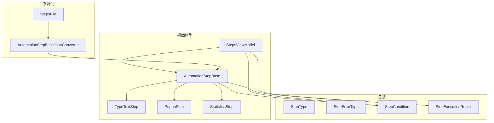
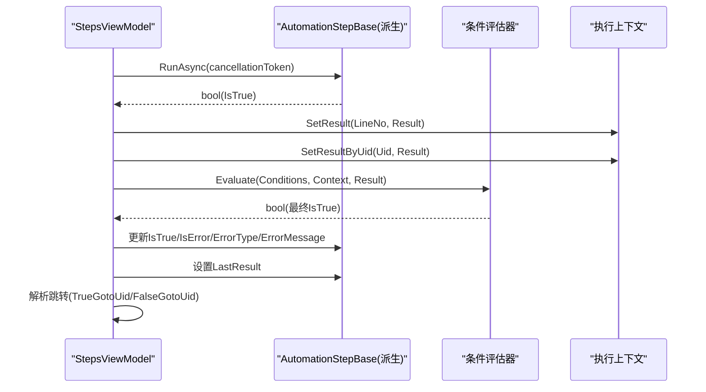
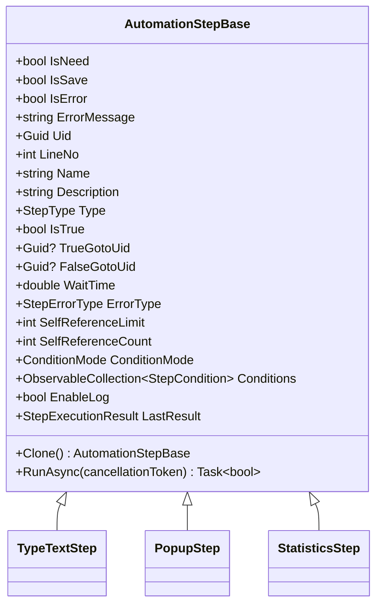

# 自动化步骤基类

<cite>
**本文引用的文件**   
- [AutomationStep.cs](file://ShaoLu/Viewmodels/AutomationStep.cs)
- [AutomationStepModel.cs](file://ShaoLu/Models/AutomationStepModel.cs)
- [StepCondition.cs](file://ShaoLu/Models/StepCondition.cs)
- [StepExecutionResult.cs](file://ShaoLu/Models/StepExecutionResult.cs)
- [StepsViewModel.cs](file://ShaoLu/Viewmodels/StepsViewModel.cs)
- [AutomationStepJsonConverter.cs](file://ShaoLu/Converters/AutomationStepJsonConverter.cs)
- [StepsFile.cs](file://ShaoLu/Utils/StepsFile.cs)
- [AutomationStepTests.cs](file://NUnitTest/AutomationStepTests.cs)
</cite>

## 目录
1. [简介](#简介)
2. [项目结构](#项目结构)
3. [核心组件](#核心组件)
4. [架构总览](#架构总览)
5. [详细组件分析](#详细组件分析)
6. [依赖关系分析](#依赖关系分析)
7. [性能考量](#性能考量)
8. [故障排查指南](#故障排查指南)
9. [结论](#结论)
10. [附录：扩展新步骤类型指南与最佳实践](#附录扩展新步骤类型指南与最佳实践)

## 简介
本文件围绕 ShaoLu 应用的自动化步骤基类 AutomationStepBase 进行系统化文档说明，覆盖设计原理、抽象方法（Clone、RunAsync）、属性管理机制（IsNeed、IsSave、IsError 等状态属性）、生命周期控制、唯一标识 Uid 管理、自引用检测（SelfReferenceLimit/SelfReferenceCount）、条件判断系统（ConditionMode 与 Conditions）、错误处理机制（ErrorType 枚举、ErrorMessage）、执行结果管理（LastResult）、克隆机制实现细节、JSON 序列化配置、MVVM 下的属性变更通知，以及扩展新步骤类型的完整指南与最佳实践。

## 项目结构
- 基类与派生步骤定义位于 Viewmodels/AutomationStep.cs，包含 AutomationStepBase 及多种具体步骤实现（如 TypeTextStep、PopupStep 等）。
- 模型与枚举定义位于 Models 目录，包括 StepType、StepErrorType、StepCondition、StepExecutionResult 等。
- 执行编排与流程控制位于 Viewmodels/StepsViewModel.cs，负责步骤集合维护、执行上下文、跳转解析、自引用检测与日志记录。
- JSON 多态序列化由 Converters/AutomationStepJsonConverter.cs 提供，支持按 StepType 反序列化为具体步骤类型，并兼容旧版数字型跳转字段。
- 文件读写与序列化选项封装在 Utils/StepsFile.cs。
- 单元测试覆盖基类默认值、Clone 行为、条件命令与错误类型等，位于 NUnitTest/AutomationStepTests.cs。

图表来源
- [AutomationStep.cs:25-296](file://ShaoLu/Viewmodels/AutomationStep.cs#L25-L296)
- [StepsViewModel.cs:560-584](file://ShaoLu/Viewmodels/StepsViewModel.cs#L560-L584)
- [AutomationStepJsonConverter.cs:14-139](file://ShaoLu/Converters/AutomationStepJsonConverter.cs#L14-L139)
- [StepsFile.cs:17-32](file://ShaoLu/Utils/StepsFile.cs#L17-L32)

章节来源
- [AutomationStep.cs:25-296](file://ShaoLu/Viewmodels/AutomationStep.cs#L25-L296)
- [StepsViewModel.cs:560-584](file://ShaoLu/Viewmodels/StepsViewModel.cs#L560-L584)
- [AutomationStepJsonConverter.cs:14-139](file://ShaoLu/Converters/AutomationStepJsonConverter.cs#L14-L139)
- [StepsFile.cs:17-32](file://ShaoLu/Utils/StepsFile.cs#L17-L32)

## 核心组件
- AutomationStepBase：所有自动化步骤的抽象基类，提供通用属性、状态、跳转、条件、日志、执行接口与 MVVM 属性变更通知。
- StepType/StepErrorType：步骤类型与错误类型枚举，用于区分不同步骤与错误分类。
- StepCondition：自定义条件规则行，支持变量、运算符、逻辑连接与文本提取模式。
- StepExecutionResult：结构化执行结果，包含成功标志、耗时、相似度、点击位置、OCR 文本、弹窗结果、错误信息与执行时间。
- StepsViewModel：步骤集合管理与执行编排，负责上下文设置、条件评估、自引用检测、跳转解析与日志记录。
- AutomationStepBaseJsonConverter：基于 StepType 的多态 JSON 转换器，支持新旧格式兼容与占位项处理。
- StepsFile：统一序列化选项与 .autostep 压缩包读写入口。

章节来源
- [AutomationStep.cs:25-296](file://ShaoLu/Viewmodels/AutomationStep.cs#L25-L296)
- [AutomationStepModel.cs:9-43](file://ShaoLu/Models/AutomationStepModel.cs#L9-L43)
- [StepCondition.cs:12-103](file://ShaoLu/Models/StepCondition.cs#L12-L103)
- [StepExecutionResult.cs:8-49](file://ShaoLu/Models/StepExecutionResult.cs#L8-L49)
- [StepsViewModel.cs:560-584](file://ShaoLu/Viewmodels/StepsViewModel.cs#L560-L584)
- [AutomationStepJsonConverter.cs:14-139](file://ShaoLu/Converters/AutomationStepJsonConverter.cs#L14-L139)
- [StepsFile.cs:17-32](file://ShaoLu/Utils/StepsFile.cs#L17-L32)

## 架构总览
AutomationStepBase 作为所有步骤的统一抽象，定义了 Clone 与 RunAsync 两个关键抽象方法；派生类通过实现这两个方法完成具体业务逻辑。执行流程由 StepsViewModel 驱动，调用 RunAsync 获取布尔结果，随后根据 ConditionMode 与 Conditions 决定是否覆盖默认结果，并更新 LastResult、错误状态与跳转目标。JSON 序列化通过 AutomationStepBaseJsonConverter 将基类与派生类正确映射到具体类型，保证跨版本兼容。

图表来源
- [StepsViewModel.cs:560-584](file://ShaoLu/Viewmodels/StepsViewModel.cs#L560-L584)
- [AutomationStep.cs:288-294](file://ShaoLu/Viewmodels/AutomationStep.cs#L288-L294)

## 详细组件分析

### 基类设计与抽象方法
- 抽象方法：
  - Clone：返回当前步骤的深拷贝实例，派生类需复制所有可序列化与运行时相关属性。
  - RunAsync：异步执行步骤逻辑，返回布尔结果表示成功或失败；内部应设置 IsTrue、IsError、ErrorType、ErrorMessage，并可设置 LastResult。
- 同步包装：Run() 为 RunAsync 的同步包装，便于非异步场景调用。

章节来源
- [AutomationStep.cs:288-294](file://ShaoLu/Viewmodels/AutomationStep.cs#L288-L294)

### 属性管理机制与 MVVM
- 使用 CommunityToolkit.Mvvm 的 ObservableObject 与 SetProperty，确保属性变更触发 PropertyChanged，UI 自动刷新。
- 关键状态属性：
  - IsNeed：是否参与执行（可由上层过滤）。
  - IsSave：标记是否需要保存（常用于脏标记）。
  - IsError：是否发生错误。
  - ErrorMessage：错误描述信息。
  - Name/Description/Type：元数据。
  - TrueGotoUid/FalseGotoUid：跳转目标 Uid，并提供只读 TrueGotoLineNo/FalseGotoLineNo 用于 UI 显示。
  - WaitTime：等待时间（秒）。
  - EnableLog：是否启用日志。
  - LineNo：行号（由集合维护）。
- 名称保护：Name setter 对 null 进行防御性检查，抛出异常并标记 IsError。

章节来源
- [AutomationStep.cs:45-111](file://ShaoLu/Viewmodels/AutomationStep.cs#L45-L111)
- [AutomationStep.cs:117-155](file://ShaoLu/Viewmodels/AutomationStep.cs#L117-L155)

### 唯一标识符 Uid 管理
- 每个步骤创建时分配 Guid.NewGuid() 作为 Uid。
- Setter 忽略 Guid.Empty 赋值，防止覆盖已有标识（占位项除外，占位项构造函数直接赋空）。
- AllSteps 与 GotoPlaceholder 提供“无跳转”占位项，用于 UI 下拉选择。

章节来源
- [AutomationStep.cs:51-72](file://ShaoLu/Viewmodels/AutomationStep.cs#L51-L72)
- [AutomationStep.cs:160-192](file://ShaoLu/Viewmodels/AutomationStep.cs#L160-L192)

### 自引用检测机制（SelfReferenceLimit 与 SelfReferenceCount）
- SelfReferenceLimit：限制自引用次数（-1 无限制，0 禁止自引用，>0 限制次数）。
- SelfReferenceCount：运行时计数器，不序列化。
- 执行流程中，若 nextIndex == i（指向自身），则计数递增；达到上限时将 IsTrue 强制设为 false，并生成本地化错误消息，重置计数器后按 False 分支重新解析跳转。

章节来源
- [AutomationStep.cs:201-207](file://ShaoLu/Viewmodels/AutomationStep.cs#L201-L207)
- [StepsViewModel.cs:634-655](file://ShaoLu/Viewmodels/StepsViewModel.cs#L634-L655)

### 条件判断系统（ConditionMode 与 Conditions）
- ConditionMode：Default（使用步骤自身执行结果）或 Custom（使用用户配置的规则行）。
- Conditions：ObservableCollection<StepCondition>，支持添加/删除条件行。
- 当 Mode 为 Custom 且存在条件时，执行完成后调用条件评估器覆盖默认 IsTrue。

章节来源
- [AutomationStep.cs:211-244](file://ShaoLu/Viewmodels/AutomationStep.cs#L211-L244)
- [StepCondition.cs:12-23](file://ShaoLu/Models/StepCondition.cs#L12-L23)
- [StepsViewModel.cs:574-579](file://ShaoLu/Viewmodels/StepsViewModel.cs#L574-L579)

### 错误处理机制（ErrorType 与 ErrorMessage）
- ErrorType：枚举定义多种错误类型（None、ImageNotFound、FileNotFound、ExecutionTimeout、SelfReferenceLimit、CancelledByUser、IndexOutOfRange、OCRError 等）。
- ErrorMessage：错误描述，支持本地化字符串。
- 各步骤在执行过程中设置 IsError、ErrorType、ErrorMessage，并在成功时复位。

章节来源
- [AutomationStepModel.cs:26-43](file://ShaoLu/Models/AutomationStepModel.cs#L26-L43)
- [AutomationStep.cs:197-199](file://ShaoLu/Viewmodels/AutomationStep.cs#L197-L199)
- [StepsViewModel.cs:560-584](file://ShaoLu/Viewmodels/StepsViewModel.cs#L560-L584)

### 执行结果管理（LastResult）
- LastResult：StepExecutionResult 实例，记录每次执行的详细信息（成功标志、耗时、相似度、点击位置、OCR 文本、弹窗结果、错误信息、执行时间）。
- 执行完成后由 StepsViewModel 设置并写入上下文，供统计与条件评估使用。

章节来源
- [AutomationStep.cs:258-264](file://ShaoLu/Viewmodels/AutomationStep.cs#L258-L264)
- [StepExecutionResult.cs:8-49](file://ShaoLu/Models/StepExecutionResult.cs#L8-L49)
- [StepsViewModel.cs:560-566](file://ShaoLu/Viewmodels/StepsViewModel.cs#L560-L566)

### 步骤克隆机制实现细节
- 基类要求派生类实现 Clone，复制所有必要属性（包括跳转 Uid、等待时间、开关、日志、自引用限制等）。
- 测试验证 Clone 创建的副本独立于原对象，修改副本不影响原对象。

章节来源
- [AutomationStep.cs:288-294](file://ShaoLu/Viewmodels/AutomationStep.cs#L288-L294)
- [AutomationStepTests.cs:59-100](file://NUnitTest/AutomationStepTests.cs#L59-L100)

### JSON 序列化配置与多态支持
- AutomationStepBaseJsonConverter：根据 JSON 中的 Type 字段解析为具体步骤类型，支持字符串与数字枚举兼容，并处理旧版数字型 TrueGoto/FalseGoto 字段。
- StepsFile：提供统一的 JsonSerializerOptions（缩进、忽略空值、大小写不敏感、跳过注释、允许尾随逗号），注册转换器。

章节来源
- [AutomationStepJsonConverter.cs:14-139](file://ShaoLu/Converters/AutomationStepJsonConverter.cs#L14-L139)
- [StepsFile.cs:17-32](file://ShaoLu/Utils/StepsFile.cs#L17-L32)

### MVVM 属性变更通知
- 基类继承 ObservableObject，使用 SetProperty 更新属性并触发 PropertyChanged。
- 派生类同样使用 SetProperty，确保 UI 绑定实时更新。

章节来源
- [AutomationStep.cs:45-111](file://ShaoLu/Viewmodels/AutomationStep.cs#L45-L111)

## 依赖关系分析
- 基类依赖：
  - CommunityToolkit.Mvvm（ObservableObject、RelayCommand）
  - NLog（日志）
  - OfficeOpenXml（Excel 读取）
  - System.Text.Json（序列化）
  - WPF/WinForms（UI 交互）
- 执行依赖：
  - StepsViewModel 依赖 SingletonLocator 获取步骤集合与上下文。
  - 条件评估依赖 StepCondition 与 ExecutionContext。
- 序列化依赖：
  - AutomationStepBaseJsonConverter 依赖 StepType 映射到具体类。
  - StepsFile 提供序列化选项与 .autostep 打包。

图表来源
- [AutomationStep.cs:25-296](file://ShaoLu/Viewmodels/AutomationStep.cs#L25-L296)

章节来源
- [AutomationStep.cs:25-296](file://ShaoLu/Viewmodels/AutomationStep.cs#L25-L296)
- [StepsViewModel.cs:560-584](file://ShaoLu/Viewmodels/StepsViewModel.cs#L560-L584)
- [AutomationStepJsonConverter.cs:14-139](file://ShaoLu/Converters/AutomationStepJsonConverter.cs#L14-L139)

## 性能考量
- 序列化选项缓存：StepsFile 使用静态 JsonSerializerOptions，避免重复创建开销。
- 条件评估仅在 Custom 模式下执行，减少不必要的计算。
- 自引用检测在循环中即时判断，避免无限递归。
- 大文件读取（如 Excel）建议使用流式处理与分页加载，避免内存峰值过高。

[本节为通用指导，无需特定文件引用]

## 故障排查指南
- 常见问题：
  - Uid 被覆盖：检查 JSON 反序列化是否传入 Guid.Empty；基类 setter 已忽略空值。
  - 自引用超限：确认 SelfReferenceLimit 设置合理，查看 ErrorMessage 提示。
  - 条件未生效：确认 ConditionMode 为 Custom 且 Conditions 非空。
  - 执行结果未记录：检查 StepsViewModel 是否正确设置 LastResult 与上下文。
- 调试建议：
  - 启用 EnableLog，查看执行日志。
  - 使用单元测试验证默认值与 Clone 行为。
  - 检查 JSON 转换器的 StepType 映射是否完整。

章节来源
- [AutomationStepTests.cs:306-372](file://NUnitTest/AutomationStepTests.cs#L306-L372)
- [StepsViewModel.cs:634-655](file://ShaoLu/Viewmodels/StepsViewModel.cs#L634-L655)

## 结论
AutomationStepBase 提供了统一的自动化步骤抽象，涵盖状态管理、唯一标识、自引用检测、条件判断、错误处理与执行结果记录。结合 StepsViewModel 的执行编排与 AutomationStepBaseJsonConverter 的多态序列化，形成了可扩展、可维护、可测试的步骤体系。遵循本文档的扩展指南与最佳实践，可快速新增步骤类型并保持系统一致性。

[本节为总结，无需特定文件引用]

## 附录：扩展新步骤类型指南与最佳实践
- 新建步骤类：
  - 继承 AutomationStepBase，设置 Type 为新的 StepType。
  - 实现 Clone：复制所有属性，确保深拷贝复杂集合。
  - 实现 RunAsync：执行业务逻辑，设置 IsTrue、IsError、ErrorType、ErrorMessage，可选设置 LastResult。
- 注册序列化映射：
  - 在 AutomationStepBaseJsonConverter 的 switch 中添加新 StepType 到具体类的映射。
- 条件与结果：
  - 如需支持条件变量，扩展 StepCondition.AvailableVariables 列表。
  - 在 StepsViewModel 的条件评估中确保新变量的取值逻辑。
- 测试覆盖：
  - 编写单元测试验证默认值、Clone 独立性、RunAsync 行为与错误处理。
- 最佳实践：
  - 使用 SetProperty 更新属性，确保 MVVM 通知。
  - 避免在 RunAsync 中阻塞 UI 线程，使用异步 I/O。
  - 合理设置 SelfReferenceLimit 防止死循环。
  - 使用本地化字符串提升用户体验。

章节来源
- [AutomationStep.cs:288-294](file://ShaoLu/Viewmodels/AutomationStep.cs#L288-L294)
- [AutomationStepJsonConverter.cs:87-104](file://ShaoLu/Converters/AutomationStepJsonConverter.cs#L87-L104)
- [StepCondition.cs:174-251](file://ShaoLu/Models/StepCondition.cs#L174-L251)
- [AutomationStepTests.cs:59-100](file://NUnitTest/AutomationStepTests.cs#L59-L100)