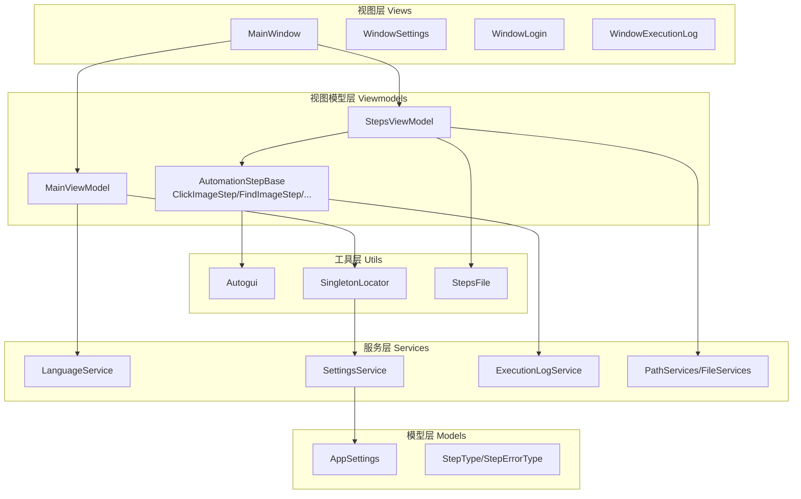
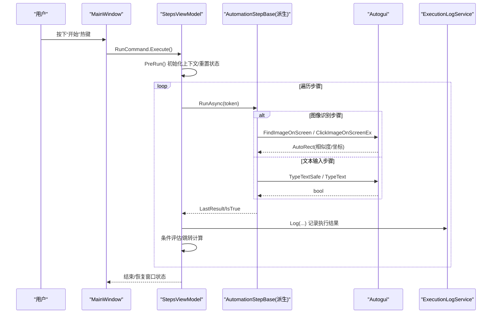
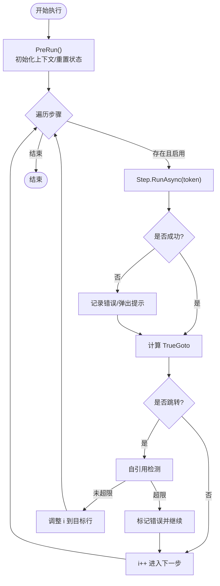
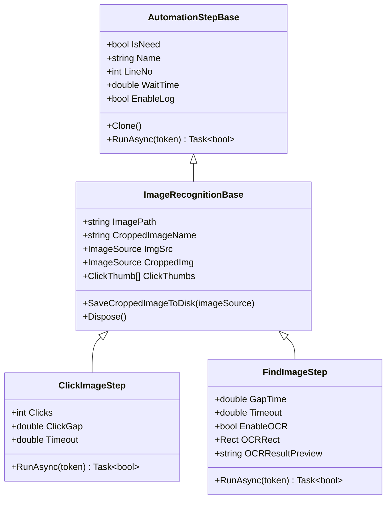
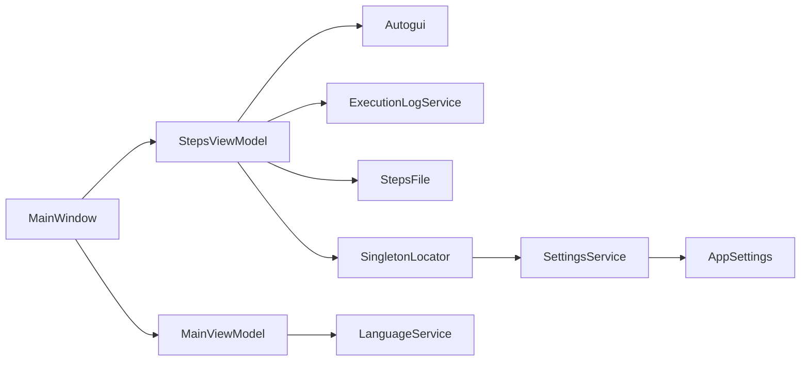

# 模块化设计

<cite>
**本文引用的文件**   
- [Readme.md](file://Readme.md)
- [App.xaml.cs](file://ShaoLu/App.xaml.cs)
- [MainWindow.xaml.cs](file://ShaoLu/MainWindow.xaml.cs)
- [MainViewModel.cs](file://ShaoLu/Viewmodels/MainViewModel.cs)
- [StepsViewModel.cs](file://ShaoLu/Viewmodels/StepsViewModel.cs)
- [AutomationStep.cs](file://ShaoLu/Viewmodels/AutomationStep.cs)
- [ImageRecognition.cs](file://ShaoLu/Viewmodels/ImageRecognition.cs)
- [Settings.cs](file://ShaoLu/Models/Settings.cs)
- [SingletonLocator.cs](file://ShaoLu/Utils/SingletonLocator.cs)
- [StepsFile.cs](file://ShaoLu/Utils/StepsFile.cs)
- [Autogui.cs](file://ShaoLu/Utils/Autogui.cs)
- [Services.cs](file://ShaoLu/Services/Services.cs)
- [LanguageService.cs](file://ShaoLu/Services/LanguageService.cs)
- [ExecutionLogService.cs](file://ShaoLu/Services/ExecutionLogService.cs)
</cite>

## 目录
1. [引言](#引言)
2. [项目结构](#项目结构)
3. [核心组件](#核心组件)
4. [架构总览](#架构总览)
5. [详细组件分析](#详细组件分析)
6. [依赖关系分析](#依赖关系分析)
7. [性能考量](#性能考量)
8. [故障排查指南](#故障排查指南)
9. [结论](#结论)
10. [附录](#附录)

## 引言
本文件面向 ShaoLu 项目的模块化设计，系统阐述 Services、Viewmodels、Models、Views、Utils 等目录的职责分离与协作方式。文档重点包括：
- 模块划分原则与职责边界
- 模块间依赖与解耦机制（接口、DI、单例定位器）
- 模块通信机制（命令、事件、异步任务、上下文传递）
- 具体实现要点（服务封装、业务逻辑组织、工具函数分类）
- 最佳实践（单一职责、接口隔离）与可维护性、可扩展性提升策略

## 项目结构
ShaoLu 采用 WPF + MVVM 的桌面应用架构，结合依赖注入容器进行生命周期管理。目录职责如下：
- Models：数据模型与配置（如 AppSettings、步骤枚举、执行结果等）
- Viewmodels：MVVM 视图模型，承载 UI 状态与业务编排（主界面、步骤列表、登录、设置等）
- Views：WPF 窗口与用户控件，负责展示与交互
- Services：领域服务与横切关注点（语言、日志、设置、路径与文件操作等）
- Utils：底层工具与平台交互（自动化输入输出、图像识别、序列化、单例定位器等）
- Converters/Templates/Themes：UI 层辅助资源（转换器、模板、样式）
- Tools：独立子功能（图片编辑器等）

图表来源
- [App.xaml.cs:18-65](file://ShaoLu/App.xaml.cs#L18-L65)
- [MainWindow.xaml.cs:24-31](file://ShaoLu/MainWindow.xaml.cs#L24-L31)
- [MainViewModel.cs:1-76](file://ShaoLu/Viewmodels/MainViewModel.cs#L1-L76)
- [StepsViewModel.cs:18-50](file://ShaoLu/Viewmodels/StepsViewModel.cs#L18-L50)
- [AutomationStep.cs:25-205](file://ShaoLu/Viewmodels/AutomationStep.cs#L25-L205)
- [ImageRecognition.cs:21-120](file://ShaoLu/Viewmodels/ImageRecognition.cs#L21-L120)
- [Settings.cs:7-76](file://ShaoLu/Models/Settings.cs#L7-L76)
- [SingletonLocator.cs:8-18](file://ShaoLu/Utils/SingletonLocator.cs#L8-L18)
- [StepsFile.cs:15-116](file://ShaoLu/Utils/StepsFile.cs#L15-L116)
- [Autogui.cs:26-122](file://ShaoLu/Utils/Autogui.cs#L26-L122)
- [Services.cs:11-179](file://ShaoLu/Services/Services.cs#L11-L179)
- [LanguageService.cs:7-67](file://ShaoLu/Services/LanguageService.cs#L7-L67)
- [ExecutionLogService.cs:12-55](file://ShaoLu/Services/ExecutionLogService.cs#L12-L55)

章节来源
- [Readme.md:1-283](file://Readme.md#L1-L283)
- [App.xaml.cs:18-65](file://ShaoLu/App.xaml.cs#L18-L65)
- [MainWindow.xaml.cs:24-31](file://ShaoLu/MainWindow.xaml.cs#L24-L31)

## 核心组件
- 应用启动与 DI 装配：在应用启动时初始化语言、注册 ViewModel 与服务、构建 Ioc 容器，并清理过期日志。
- 主窗口与热键：注册全局热键，触发 StepsViewModel 的运行/停止命令；处理登录态与菜单项。
- 步骤执行引擎：StepsViewModel 负责步骤集合管理、运行循环、错误处理、跳转控制、条件评估与日志记录。
- 步骤基类与派生：AutomationStepBase 定义通用属性与执行契约；具体步骤（点击识图、查找识图、文本输入等）实现各自 RunAsync。
- 图像识别与 OCR：ImageRecognitionBase 提供裁剪图加载/保存、点击点管理；FindImageStep 支持可选 OCR 区域识别。
- 持久化与打包：StepsFile 将步骤序列化为 .autostep 压缩包（含 steps.json 与 images），兼容旧 JSON 格式。
- 工具与平台交互：Autogui 封装屏幕截图、模板匹配、鼠标键盘模拟、剪贴板安全输入等。
- 服务与配置：LanguageService 管理多语言；SettingsService 读写 settings.json；ExecutionLogService 使用 SQLite 记录执行历史。

章节来源
- [App.xaml.cs:18-65](file://ShaoLu/App.xaml.cs#L18-L65)
- [MainWindow.xaml.cs:32-74](file://ShaoLu/MainWindow.xaml.cs#L32-L74)
- [StepsViewModel.cs:361-583](file://ShaoLu/Viewmodels/StepsViewModel.cs#L361-L583)
- [AutomationStep.cs:25-205](file://ShaoLu/Viewmodels/AutomationStep.cs#L25-L205)
- [ImageRecognition.cs:21-120](file://ShaoLu/Viewmodels/ImageRecognition.cs#L21-L120)
- [StepsFile.cs:15-116](file://ShaoLu/Utils/StepsFile.cs#L15-L116)
- [Autogui.cs:52-122](file://ShaoLu/Utils/Autogui.cs#L52-L122)
- [LanguageService.cs:15-40](file://ShaoLu/Services/LanguageService.cs#L15-L40)
- [SettingsService.cs:20-38](file://ShaoLu/Services/SettingsService.cs#L20-L38)
- [ExecutionLogService.cs:34-55](file://ShaoLu/Services/ExecutionLogService.cs#L34-L55)

## 架构总览
ShaoLu 以 MVVM 为核心，通过依赖注入与单例定位器实现松耦合。视图仅持有 ViewModel 引用，ViewModel 通过服务与工具完成业务与平台交互。步骤执行流程由 StepsViewModel 统一编排，各步骤遵循统一接口，便于扩展与维护。

图表来源
- [MainWindow.xaml.cs:55-74](file://ShaoLu/MainWindow.xaml.cs#L55-L74)
- [StepsViewModel.cs:407-565](file://ShaoLu/Viewmodels/StepsViewModel.cs#L407-L565)
- [AutomationStep.cs:253-278](file://ShaoLu/Viewmodels/AutomationStep.cs#L253-L278)
- [ImageRecognition.cs:382-416](file://ShaoLu/Viewmodels/ImageRecognition.cs#L382-L416)
- [Autogui.cs:256-306](file://ShaoLu/Utils/Autogui.cs#L256-L306)
- [ExecutionLogService.cs:34-55](file://ShaoLu/Services/ExecutionLogService.cs#L34-L55)

## 详细组件分析

### 模块划分与职责
- Models
  - 作用：定义数据结构与配置（AppSettings、StepType、StepErrorType、执行结果等）。
  - 特点：纯数据模型，无副作用；通过 SettingsService 持久化。
- Viewmodels
  - 作用：承载 UI 状态与业务流程编排（MainViewModel、StepsViewModel、各类步骤 ViewModel）。
  - 特点：基于 ObservableObject，暴露属性与命令；通过 SingletonLocator 获取服务与配置。
- Services
  - 作用：领域能力与横切关注点（语言、设置、日志、路径与文件操作）。
  - 特点：静态或单例服务，避免 UI 耦合；对外暴露清晰 API。
- Utils
  - 作用：底层工具与平台交互（Autogui、StepsFile、SingletonLocator）。
  - 特点：高内聚、低耦合；对第三方库（OpenCvSharp、WindowsInput）进行封装。
- Views
  - 作用：WPF 窗口与控件，绑定 ViewModel，处理用户交互。
  - 特点：尽量薄，不包含业务逻辑；通过命令与事件与 ViewModel 通信。

章节来源
- [Settings.cs:7-76](file://ShaoLu/Models/Settings.cs#L7-L76)
- [MainViewModel.cs:1-76](file://ShaoLu/Viewmodels/MainViewModel.cs#L1-L76)
- [StepsViewModel.cs:18-130](file://ShaoLu/Viewmodels/StepsViewModel.cs#L18-L130)
- [LanguageService.cs:7-67](file://ShaoLu/Services/LanguageService.cs#L7-L67)
- [Services.cs:11-179](file://ShaoLu/Services/Services.cs#L11-L179)
- [Autogui.cs:26-122](file://ShaoLu/Utils/Autogui.cs#L26-L122)
- [StepsFile.cs:15-116](file://ShaoLu/Utils/StepsFile.cs#L15-L116)

### 模块间依赖与解耦
- 依赖注入与单例定位器
  - App.xaml.cs 中注册 MainViewModel、StepsViewModel、FileServices、IUserService 等，并通过 CommunityToolkit.Mvvm.DependencyInjection 构建容器。
  - SingletonLocator 提供便捷访问入口，降低硬编码耦合。
- 接口隔离
  - IUserService 作为接口抽象，UserService 为具体实现，便于替换与测试。
- 服务与工具分层
  - Viewmodels 不直接调用 Win32/OCR 等底层细节，而是通过 Autogui、OCRService 等封装。
  - 文件与路径操作集中在 PathServices/FileServices，避免散落在各处。

章节来源
- [App.xaml.cs:33-47](file://ShaoLu/App.xaml.cs#L33-L47)
- [SingletonLocator.cs:8-18](file://ShaoLu/Utils/SingletonLocator.cs#L8-L18)
- [Services.cs:83-179](file://ShaoLu/Services/Services.cs#L83-L179)

### 步骤执行流程与条件控制
- 执行循环
  - StepsViewModel.Run 按顺序遍历 AutomationStepBases，调用每个步骤的 RunAsync，捕获异常并记录日志。
- 条件与跳转
  - 支持默认真/假跳转与自定义条件（ConditionMode.Custom），通过 ConditionEvaluator 评估。
- 自引用保护
  - 防止无限循环，统计 SelfReferenceCount，超过阈值则报错并继续下一步。
- 上下文与结果
  - StepExecutionContext 存储每步执行结果，供条件评估与日志使用。

图表来源
- [StepsViewModel.cs:407-565](file://ShaoLu/Viewmodels/StepsViewModel.cs#L407-L565)
- [AutomationStep.cs:118-153](file://ShaoLu/Viewmodels/AutomationStep.cs#L118-L153)

章节来源
- [StepsViewModel.cs:361-583](file://ShaoLu/Viewmodels/StepsViewModel.cs#L361-L583)
- [AutomationStep.cs:118-153](file://ShaoLu/Viewmodels/AutomationStep.cs#L118-L153)

### 图像识别与 OCR 集成
- ImageRecognitionBase
  - 管理原图路径、裁剪图名称与工作目录解析；提供裁剪图加载/保存与点击点管理。
- ClickImageStep/FindImageStep
  - ClickImageStep 执行点击动作，返回匹配结果与相似度；FindImageStep 支持可选 OCR 区域识别。
- OCR 流程
  - 找到图片后，根据 OCRRect 计算屏幕绝对坐标，调用 OCRService.RecognizeRegion 获取文本。

图表来源
- [AutomationStep.cs:25-205](file://ShaoLu/Viewmodels/AutomationStep.cs#L25-L205)
- [ImageRecognition.cs:21-120](file://ShaoLu/Viewmodels/ImageRecognition.cs#L21-L120)
- [ImageRecognition.cs:329-416](file://ShaoLu/Viewmodels/ImageRecognition.cs#L329-L416)
- [ImageRecognition.cs:420-566](file://ShaoLu/Viewmodels/ImageRecognition.cs#L420-L566)

章节来源
- [ImageRecognition.cs:21-120](file://ShaoLu/Viewmodels/ImageRecognition.cs#L21-L120)
- [ImageRecognition.cs:329-416](file://ShaoLu/Viewmodels/ImageRecognition.cs#L329-L416)
- [ImageRecognition.cs:420-566](file://ShaoLu/Viewmodels/ImageRecognition.cs#L420-L566)

### 文件与包管理
- StepsFile
  - 将步骤序列化为 .autostep 压缩包（包含 steps.json 与 images 目录），支持从压缩包加载并解压工作目录。
  - 兼容旧版 JSON 格式，提供迁移路径。
- FileServices
  - 提供待删除文件队列与提交删除，智能读取文本文件编码（UTF-8/UTF-16/启发式检测）。

章节来源
- [StepsFile.cs:15-116](file://ShaoLu/Utils/StepsFile.cs#L15-L116)
- [StepsFile.cs:166-217](file://ShaoLu/Utils/StepsFile.cs#L166-L217)
- [Services.cs:83-179](file://ShaoLu/Services/Services.cs#L83-L179)

### 输入与自动化
- Autogui
  - 屏幕截图、模板匹配、鼠标移动与点击、文本输入（安全模式通过剪贴板粘贴）。
  - 字符串递增算法支持数字与字母后缀，满足批量输入场景。

章节来源
- [Autogui.cs:52-122](file://ShaoLu/Utils/Autogui.cs#L52-L122)
- [Autogui.cs:256-306](file://ShaoLu/Utils/Autogui.cs#L256-L306)
- [Autogui.cs:355-495](file://ShaoLu/Utils/Autogui.cs#L355-L495)

### 多语言与本地化
- LanguageService
  - 初始化语言（优先上次保存，否则系统语言），设置并持久化当前文化；提供本地化字符串获取方法。

章节来源
- [LanguageService.cs:15-40](file://ShaoLu/Services/LanguageService.cs#L15-L40)
- [LanguageService.cs:42-67](file://ShaoLu/Services/LanguageService.cs#L42-L67)

### 执行日志与持久化
- ExecutionLogService
  - 使用 FreeSql + SQLite 记录步骤执行历史，支持分页查询、关键字搜索、时间范围筛选与排序。
  - 提供清理过期日志的方法，配合 AppSettings.LogRetentionDays。

章节来源
- [ExecutionLogService.cs:12-55](file://ShaoLu/Services/ExecutionLogService.cs#L12-L55)
- [ExecutionLogService.cs:58-107](file://ShaoLu/Services/ExecutionLogService.cs#L58-L107)
- [ExecutionLogService.cs:159-176](file://ShaoLu/Services/ExecutionLogService.cs#L159-L176)

## 依赖关系分析
- 视图层依赖 ViewModel（MainWindow → MainViewModel、StepsViewModel）
- ViewModel 依赖服务与工具（StepsViewModel → Autogui、ExecutionLogService、StepsFile、SingletonLocator）
- 服务之间低耦合（LanguageService、SettingsService、ExecutionLogService 相互独立）
- 工具层对第三方库封装（Autogui → OpenCvSharp、WindowsInput）

图表来源
- [MainWindow.xaml.cs:24-31](file://ShaoLu/MainWindow.xaml.cs#L24-L31)
- [StepsViewModel.cs:18-50](file://ShaoLu/Viewmodels/StepsViewModel.cs#L18-L50)
- [MainViewModel.cs:1-76](file://ShaoLu/Viewmodels/MainViewModel.cs#L1-L76)
- [SingletonLocator.cs:8-18](file://ShaoLu/Utils/SingletonLocator.cs#L8-L18)
- [SettingsService.cs:20-38](file://ShaoLu/Services/SettingsService.cs#L20-L38)

章节来源
- [App.xaml.cs:33-47](file://ShaoLu/App.xaml.cs#L33-L47)
- [SingletonLocator.cs:8-18](file://ShaoLu/Utils/SingletonLocator.cs#L8-L18)

## 性能考量
- 图像识别优化
  - 模板转换一次复用（FindImageOnScreen 中将模板转为 Mat 并灰度化），减少重复开销。
  - 使用 Stopwatch 精确计时，合理设置超时与间隔，避免频繁截图。
- 文本输入安全模式
  - TypeTextSafe 通过剪贴板粘贴，避免逐字符输入导致的兼容性问题；必要时切换到 UI 线程执行。
- 日志与数据库
  - ExecutionLogService 使用懒加载 FreeSql 实例，避免重复初始化；分页查询减少内存占用。
- 文件操作
  - FileServices 的 SmartReadTextFile 先检查 BOM，再使用启发式检测，提高编码识别准确率。

章节来源
- [Autogui.cs:52-122](file://ShaoLu/Utils/Autogui.cs#L52-L122)
- [Autogui.cs:497-579](file://ShaoLu/Utils/Autogui.cs#L497-L579)
- [ExecutionLogService.cs:14-27](file://ShaoLu/Services/ExecutionLogService.cs#L14-L27)
- [Services.cs:142-175](file://ShaoLu/Services/Services.cs#L142-L175)

## 故障排查指南
- 步骤执行失败
  - 查看 StepsViewModel 中的错误类型推断与弹窗提示；检查 IsError、ErrorMessage、ErrorType。
  - 确认图像路径与裁剪图是否存在，OCR 区域是否有效。
- 热键无效
  - 检查 MainWindow 的热键注册与注销逻辑；确保窗口句柄正确。
- 文件编码问题
  - 使用 FileServices.SmartReadTextFile 读取文本，注意 BOM 与编码检测阈值。
- 日志缺失
  - 确认 ExecutionLogService 的数据库路径与写入权限；检查 LogRetentionDays 清理策略。

章节来源
- [StepsViewModel.cs:487-512](file://ShaoLu/Viewmodels/StepsViewModel.cs#L487-L512)
- [MainWindow.xaml.cs:85-91](file://ShaoLu/MainWindow.xaml.cs#L85-L91)
- [Services.cs:142-175](file://ShaoLu/Services/Services.cs#L142-L175)
- [ExecutionLogService.cs:159-176](file://ShaoLu/Services/ExecutionLogService.cs#L159-L176)

## 结论
ShaoLu 的模块化设计通过清晰的职责分离、接口抽象与依赖注入，实现了高内聚、低耦合的系统架构。步骤执行引擎与工具层的解耦使得新增步骤类型与平台能力变得简单；日志、语言、设置等服务提供了稳定的横切支撑。遵循单一职责与接口隔离原则，代码的可维护性与可扩展性显著提升，便于团队协作与持续演进。

## 附录
- 最佳实践建议
  - 单一职责：每个模块聚焦一个领域（如 Autogui 专注自动化输入输出，StepsFile 专注序列化与打包）。
  - 接口隔离：通过 IUserService 等接口屏蔽实现细节，便于替换与测试。
  - 依赖注入：集中注册与解析，避免硬编码耦合。
  - 异步与取消：RunAsync 接受 CancellationToken，支持优雅停止与资源释放。
  - 错误处理：统一错误类型与日志记录，提升可观测性。
- 扩展指引
  - 新增步骤类型：继承 AutomationStepBase，实现 Clone 与 RunAsync，并在 StepsViewModel.AddStep 中注册。
  - 新增服务：实现接口并注册到 DI 容器，通过 SingletonLocator 或构造函数注入使用。