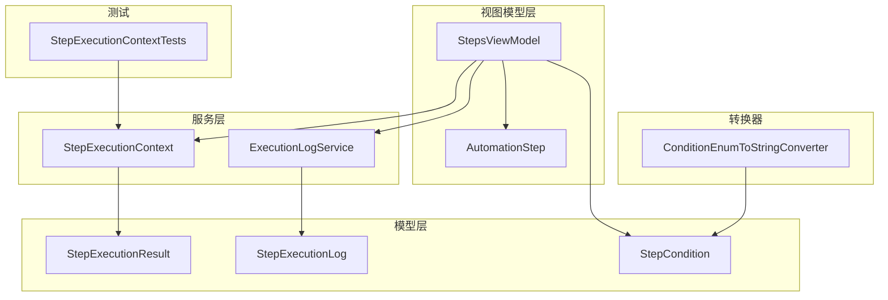
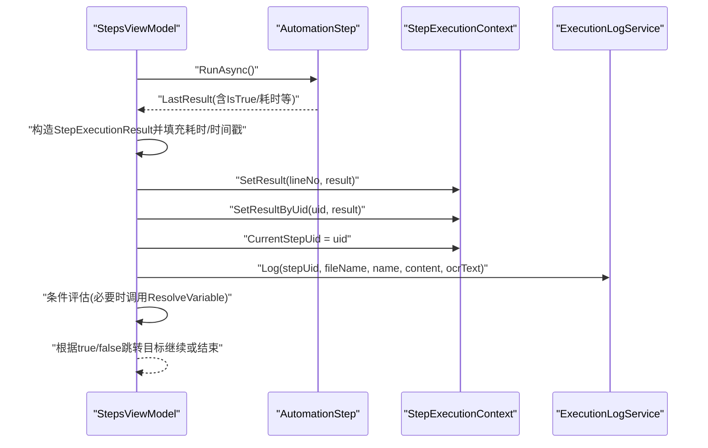
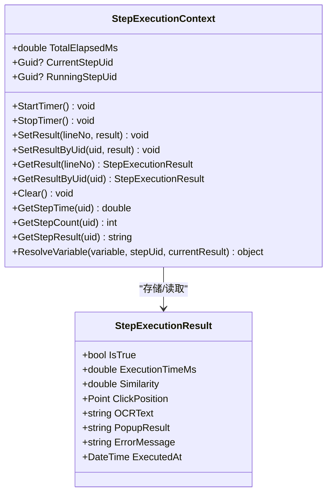
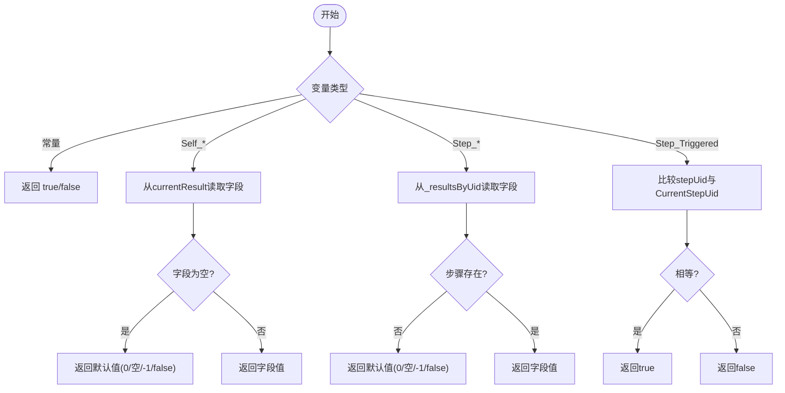
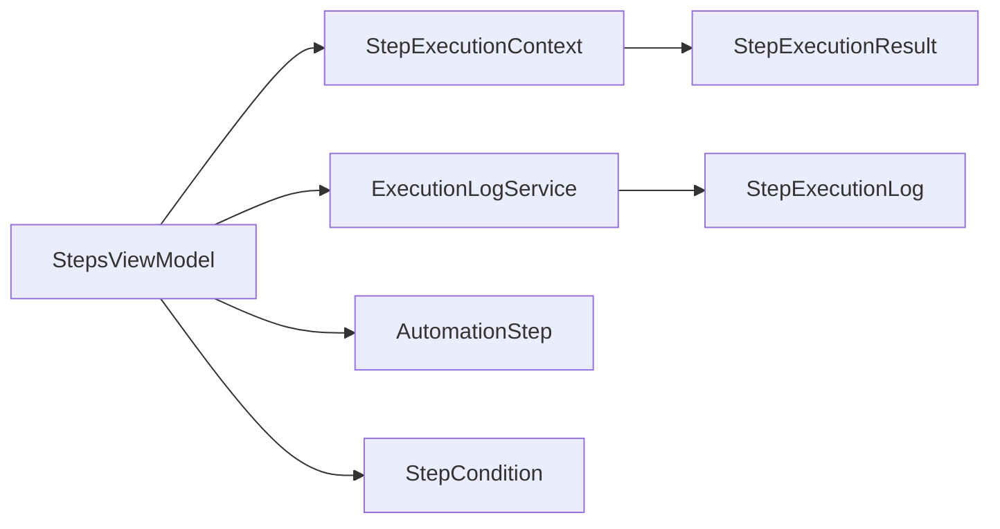

# 执行上下文

<cite>
**本文引用的文件**   
- [StepExecutionContext.cs](file://ShaoLu/Services/StepExecutionContext.cs)
- [StepExecutionResult.cs](file://ShaoLu/Models/StepExecutionResult.cs)
- [StepCondition.cs](file://ShaoLu/Models/StepCondition.cs)
- [ExecutionLogService.cs](file://ShaoLu/Services/ExecutionLogService.cs)
- [StepsViewModel.cs](file://ShaoLu/Viewmodels/StepsViewModel.cs)
- [AutomationStep.cs](file://ShaoLu/Viewmodels/AutomationStep.cs)
- [ConditionEnumToStringConverter.cs](file://ShaoLu/Converters/ConditionEnumToStringConverter.cs)
- [StepExecutionLog.cs](file://ShaoLu/Models/StepExecutionLog.cs)
- [StepExecutionContextTests.cs](file://NUnitTest/StepExecutionContextTests.cs)
</cite>

## 目录
1. [简介](#简介)
2. [项目结构](#项目结构)
3. [核心组件](#核心组件)
4. [架构总览](#架构总览)
5. [详细组件分析](#详细组件分析)
6. [依赖关系分析](#依赖关系分析)
7. [性能考量](#性能考量)
8. [故障排查指南](#故障排查指南)
9. [结论](#结论)
10. [附录：使用示例与最佳实践](#附录使用示例与最佳实践)

## 简介
本技术文档聚焦于 ShaoLu 的执行上下文，系统性阐述 StepExecutionContext 的设计理念、数据模型 StepExecutionResult、跨步骤数据传递机制、线程安全与资源清理策略、异常处理与恢复路径，以及日志记录与调试方法。读者将了解如何在自定义步骤中访问和执行上下文，并基于执行结果进行条件判断与流程控制。

## 项目结构
围绕执行上下文的核心代码分布在 Services、Models、Viewmodels、Converters 与单元测试项目中：
- Services：StepExecutionContext（执行上下文）、ExecutionLogService（执行日志）
- Models：StepExecutionResult（执行结果模型）、StepExecutionLog（持久化日志模型）、StepCondition（条件变量定义与规则）
- Viewmodels：StepsViewModel（步骤执行编排与异常处理）、AutomationStep（步骤基类与 LastResult）
- Converters：条件变量到本地化字符串的转换
- NUnitTest：StepExecutionContext 的行为测试



图表来源
- [StepExecutionContext.cs:1-163](file://ShaoLu/Services/StepExecutionContext.cs#L1-L163)
- [ExecutionLogService.cs:1-179](file://ShaoLu/Services/ExecutionLogService.cs#L1-L179)
- [StepExecutionResult.cs:1-51](file://ShaoLu/Models/StepExecutionResult.cs#L1-L51)
- [StepExecutionLog.cs:1-47](file://ShaoLu/Models/StepExecutionLog.cs#L1-L47)
- [StepCondition.cs:1-200](file://ShaoLu/Models/StepCondition.cs#L1-L200)
- [StepsViewModel.cs:529-747](file://ShaoLu/Viewmodels/StepsViewModel.cs#L529-L747)
- [AutomationStep.cs:253-302](file://ShaoLu/Viewmodels/AutomationStep.cs#L253-L302)
- [ConditionEnumToStringConverter.cs:150-169](file://ShaoLu/Converters/ConditionEnumToStringConverter.cs#L150-L169)
- [StepExecutionContextTests.cs:1-253](file://NUnitTest/StepExecutionContextTests.cs#L1-L253)

章节来源
- [StepExecutionContext.cs:1-163](file://ShaoLu/Services/StepExecutionContext.cs#L1-L163)
- [StepExecutionResult.cs:1-51](file://ShaoLu/Models/StepExecutionResult.cs#L1-L51)
- [StepCondition.cs:1-200](file://ShaoLu/Models/StepCondition.cs#L1-L200)
- [ExecutionLogService.cs:1-179](file://ShaoLu/Services/ExecutionLogService.cs#L1-L179)
- [StepsViewModel.cs:529-747](file://ShaoLu/Viewmodels/StepsViewModel.cs#L529-L747)
- [AutomationStep.cs:253-302](file://ShaoLu/Viewmodels/AutomationStep.cs#L253-L302)
- [ConditionEnumToStringConverter.cs:150-169](file://ShaoLu/Converters/ConditionEnumToStringConverter.cs#L150-L169)
- [StepExecutionLog.cs:1-47](file://ShaoLu/Models/StepExecutionLog.cs#L1-L47)
- [StepExecutionContextTests.cs:1-253](file://NUnitTest/StepExecutionContextTests.cs#L1-L253)

## 核心组件
- StepExecutionContext：单例执行上下文，维护所有步骤的执行结果、按 Uid 索引、执行次数统计、总计时器、当前/运行中步骤标识，并提供条件变量的解析能力。
- StepExecutionResult：结构化执行结果，包含成功标志、耗时、相似度、点击坐标、OCR文本、弹窗选择结果、错误信息与执行时间戳。
- ExecutionLogService：基于 FreeSql + SQLite 的执行日志服务，支持写入、分页查询、筛选、排序与过期清理。
- StepsViewModel：步骤执行编排器，负责计时、构建结果、写入上下文、条件评估、日志记录、异常捕获与恢复跳转。
- AutomationStep：步骤基类，暴露 LastResult 用于运行时结果持有。
- StepCondition：条件变量枚举与规则行，提供变量可用性与文本提取配置。

章节来源
- [StepExecutionContext.cs:1-163](file://ShaoLu/Services/StepExecutionContext.cs#L1-L163)
- [StepExecutionResult.cs:1-51](file://ShaoLu/Models/StepExecutionResult.cs#L1-L51)
- [ExecutionLogService.cs:1-179](file://ShaoLu/Services/ExecutionLogService.cs#L1-L179)
- [StepsViewModel.cs:529-747](file://ShaoLu/Viewmodels/StepsViewModel.cs#L529-L747)
- [AutomationStep.cs:253-302](file://ShaoLu/Viewmodels/AutomationStep.cs#L253-L302)
- [StepCondition.cs:1-200](file://ShaoLu/Models/StepCondition.cs#L1-L200)

## 架构总览
执行上下文在自动化流程中充当“共享状态总线”，步骤执行后将其结果写入上下文，后续步骤或条件评估可读取这些结果以决定分支与动作。



图表来源
- [StepsViewModel.cs:529-747](file://ShaoLu/Viewmodels/StepsViewModel.cs#L529-L747)
- [StepExecutionContext.cs:1-163](file://ShaoLu/Services/StepExecutionContext.cs#L1-L163)
- [ExecutionLogService.cs:1-179](file://ShaoLu/Services/ExecutionLogService.cs#L1-L179)

## 详细组件分析

### StepExecutionContext：设计要点与实现
- 单例模式：通过静态 Instance 提供全局访问，便于跨步骤共享状态。
- 数据结构：
  - _results：按行号映射执行结果，便于 UI 展示与回溯。
  - _resultsByUid：按步骤 Uid 映射执行结果，供条件引用与统计。
  - _executionCounts：按 Uid 统计执行次数，配合 Step_Triggered 变量实现“本次是否刚执行”的判断。
  - _totalStopwatch：总计时器，StartTimer/StopTimer 管理生命周期。
- 关键属性：
  - TotalElapsedMs：总耗时毫秒。
  - CurrentStepUid：刚刚执行完成的步骤 Uid，用于 Step_Triggered。
  - RunningStepUid：当前正在执行的步骤 Uid，供统计窗口展示。
- 关键方法：
  - SetResult/SetResultByUid：写入结果并更新计数。
  - GetResult/GetResultByUid：读取结果。
  - Clear：清空所有状态，适合每次运行前重置。
  - GetStepTime/GetStepCount/GetStepResult：便捷查询接口。
  - ResolveVariable：解析条件变量为实际值，支持常量、Self_*、Step_* 与 Step_Triggered。

线程安全说明
- 内部使用 Dictionary 存储状态，未加锁；适用于单线程执行流。若未来引入多线程并发执行同一实例，需考虑并发读写保护（如 ConcurrentDictionary 或外部同步）。

资源清理机制
- Clear() 会清空字典、重置计时器并清空 CurrentStepUid 与 RunningStepUid，确保多次运行间无残留状态。

章节来源
- [StepExecutionContext.cs:1-163](file://ShaoLu/Services/StepExecutionContext.cs#L1-L163)
- [StepExecutionContextTests.cs:1-253](file://NUnitTest/StepExecutionContextTests.cs#L1-L253)

#### 类图（StepExecutionContext 与 StepExecutionResult）


图表来源
- [StepExecutionContext.cs:1-163](file://ShaoLu/Services/StepExecutionContext.cs#L1-L163)
- [StepExecutionResult.cs:1-51](file://ShaoLu/Models/StepExecutionResult.cs#L1-L51)

### StepExecutionResult：模型结构与语义
- IsTrue：步骤执行是否成功，用于条件判断与跳转。
- ExecutionTimeMs：执行耗时（毫秒），可用于性能监控与阈值判断。
- Similarity：图像识别相似度（-1 表示不适用），常用于图像匹配步骤。
- ClickPosition：点击位置坐标，便于定位与调试。
- OCRText：OCR 识别文本，支持文本内容分析与提取。
- PopupResult：弹出框用户选择的按钮值，用于交互分支。
- ErrorMessage：错误信息，便于诊断与展示。
- ExecutedAt：执行时间戳，便于时序分析与日志关联。

章节来源
- [StepExecutionResult.cs:1-51](file://ShaoLu/Models/StepExecutionResult.cs#L1-L51)

### 执行上下文的数据传递与作用域
- 作用域：StepExecutionContext 是全局单例，贯穿整个自动化流程的生命周期。
- 数据共享：
  - 通过 SetResult/SetResultByUid 写入结果，后续步骤可通过 GetResult/GetResultByUid 读取。
  - 条件评估时，ResolveVariable 将变量解析为具体值，支持 Self_* 与 Step_* 引用。
- 生命周期：
  - StartTimer/StopTimer 包裹整体执行过程。
  - Clear 在每次运行前清空状态，避免污染。
- 特殊变量：
  - Step_Triggered：仅当引用的步骤在本次评估前刚刚被执行时为真，适合统计执行次数。

章节来源
- [StepExecutionContext.cs:1-163](file://ShaoLu/Services/StepExecutionContext.cs#L1-L163)
- [StepCondition.cs:1-200](file://ShaoLu/Models/StepCondition.cs#L1-L200)
- [ConditionEnumToStringConverter.cs:150-169](file://ShaoLu/Converters/ConditionEnumToStringConverter.cs#L150-L169)

### 条件变量与解析流程
- 变量类型：
  - 常量：ConstantTrue、ConstantFalse
  - 当前步骤自身：Self_IsTrue、Self_Similarity、Self_ExecutionTimeMs、Self_ClickX/Y、Self_OCRText、Self_PopupResult
  - 引用其他步骤：Step_IsTrue、Step_Similarity、Step_ExecutionTimeMs、Step_ClickX/Y、Step_OCRText、Step_PopupResult、Step_Triggered
- 解析逻辑：
  - 根据变量类型返回对应值，缺失时返回默认值（如 false、0、空串、-1）。
  - Step_Triggered 依赖 CurrentStepUid 与传入 stepUid 的比较。



图表来源
- [StepExecutionContext.cs:105-160](file://ShaoLu/Services/StepExecutionContext.cs#L105-L160)

章节来源
- [StepExecutionContext.cs:105-160](file://ShaoLu/Services/StepExecutionContext.cs#L105-L160)
- [StepCondition.cs:1-200](file://ShaoLu/Models/StepCondition.cs#L1-L200)

### 执行编排与异常处理
- 编排流程：
  - 设置 RunningStepUid，计时执行步骤 RunAsync。
  - 构建 StepExecutionResult，写入上下文，更新 CurrentStepUid。
  - 可选条件评估，根据 IsTrue 确定下一个目标步骤。
  - 通用日志记录（ExecutionLogService.Log）。
- 异常处理：
  - OperationCanceledException：标记取消并中断。
  - 其他异常：记录警告，设置步骤错误状态与错误类型，可选择弹窗提示；若未配置 FalseGotoUid，则停止执行；否则将 IsTrue 置为 false 并按 false 分支继续。
  - 自引用检测：防止无限循环，达到上限时将 IsTrue 强制为 false 并重新解析跳转目标。

```mermaid
sequenceDiagram
participant VM as "StepsViewModel"
participant STEP as "AutomationStep"
participant CTX as "StepExecutionContext"
participant LOG as "ExecutionLogService"
VM->>STEP : "RunAsync()"
alt "正常完成"
STEP-->>VM : "LastResult"
VM->>VM : "构造result并填充耗时/时间戳"
VM->>CTX : "SetResult/SetResultByUid"
VM->>LOG : "Log(...)"
VM->>VM : "条件评估(可选)"
VM-->>VM : "根据true/false跳转"
else "异常"
STEP-->>VM : "抛出异常"
VM->>VM : "记录错误/设置错误类型"
VM->>VM : "检查FalseGotoUid"
VM-->>VM : "若无则停止; 若有则IsTrue=false并继续"
end
```

图表来源
- [StepsViewModel.cs:529-747](file://ShaoLu/Viewmodels/StepsViewModel.cs#L529-L747)

章节来源
- [StepsViewModel.cs:529-747](file://ShaoLu/Viewmodels/StepsViewModel.cs#L529-L747)

### 日志与调试
- 执行日志：
  - ExecutionLogService.Log 将步骤 UID、文件名、名称、输入内容与 OCR 文本写入 SQLite。
  - 支持分页查询、关键字搜索、按文件/UID/时间范围筛选与排序。
  - 支持清理过期日志（按保留天数）。
- 调试建议：
  - 启用步骤日志（EnableLog）以记录结果、耗时与相似度。
  - 使用 Step_Triggered 变量统计某步骤在本轮中的触发次数。
  - 查看 RunningStepUid 与 CurrentStepUid 辅助定位当前执行位置。

章节来源
- [ExecutionLogService.cs:1-179](file://ShaoLu/Services/ExecutionLogService.cs#L1-L179)
- [StepExecutionLog.cs:1-47](file://ShaoLu/Models/StepExecutionLog.cs#L1-L47)
- [StepsViewModel.cs:580-607](file://ShaoLu/Viewmodels/StepsViewModel.cs#L580-L607)

## 依赖关系分析
- StepsViewModel 依赖 StepExecutionContext 与 ExecutionLogService，协调步骤执行、结果写入与日志记录。
- StepExecutionContext 依赖 StepExecutionResult 作为数据载体，并通过 ConditionVariable 枚举参与条件解析。
- AutomationStep 暴露 LastResult，供 StepsViewModel 构建统一的结果对象。
- StepCondition 定义变量与规则，影响条件评估与 UI 展示。



图表来源
- [StepsViewModel.cs:529-747](file://ShaoLu/Viewmodels/StepsViewModel.cs#L529-L747)
- [StepExecutionContext.cs:1-163](file://ShaoLu/Services/StepExecutionContext.cs#L1-L163)
- [ExecutionLogService.cs:1-179](file://ShaoLu/Services/ExecutionLogService.cs#L1-L179)
- [AutomationStep.cs:253-302](file://ShaoLu/Viewmodels/AutomationStep.cs#L253-L302)
- [StepCondition.cs:1-200](file://ShaoLu/Models/StepCondition.cs#L1-L200)

章节来源
- [StepsViewModel.cs:529-747](file://ShaoLu/Viewmodels/StepsViewModel.cs#L529-L747)
- [StepExecutionContext.cs:1-163](file://ShaoLu/Services/StepExecutionContext.cs#L1-L163)
- [ExecutionLogService.cs:1-179](file://ShaoLu/Services/ExecutionLogService.cs#L1-L179)
- [AutomationStep.cs:253-302](file://ShaoLu/Viewmodels/AutomationStep.cs#L253-L302)
- [StepCondition.cs:1-200](file://ShaoLu/Models/StepCondition.cs#L1-L200)

## 性能考量
- 计时精度：使用 Stopwatch 测量总耗时与单步耗时，避免频繁 GC 与 I/O 阻塞主流程。
- 内存占用：_results 与 _resultsByUid 随步骤数量线性增长，建议在长时间运行任务中定期 Clear 或限制历史结果数量。
- 条件解析：ResolveVariable 为 O(1) 查找，但大量 Step_* 变量引用会增加字典访问开销，应合理复用结果。
- 日志写入：ExecutionLogService 异步写入数据库，避免阻塞执行流；注意磁盘 I/O 对性能的影响。

[本节为一般性指导，不直接分析具体文件]

## 故障排查指南
- 常见问题：
  - 步骤结果为空：检查是否正确调用 SetResult/SetResultByUid，确认 lineNo 与 uid 一致。
  - Step_Triggered 始终为假：确认 CurrentStepUid 是否在步骤完成后被正确设置。
  - 自引用死循环：检查 SelfReferenceLimit 与跳转目标，避免指向自身导致无限循环。
  - 日志未写入：确认 EnableLog 已开启且 ExecutionLogService 初始化成功。
- 异常恢复：
  - OperationCanceledException：用户取消操作，流程终止。
  - 其他异常：记录错误类型与消息，根据 FalseGotoUid 决定是否继续执行。
- 调试技巧：
  - 启用详细日志，观察 Result、Time、Similarity 与 OCRText。
  - 使用 RunningStepUid 与 CurrentStepUid 定位当前执行位置。
  - 通过 GetStepCount 统计特定步骤的执行次数。

章节来源
- [StepsViewModel.cs:580-747](file://ShaoLu/Viewmodels/StepsViewModel.cs#L580-L747)
- [ExecutionLogService.cs:1-179](file://ShaoLu/Services/ExecutionLogService.cs#L1-L179)
- [StepExecutionContext.cs:1-163](file://ShaoLu/Services/StepExecutionContext.cs#L1-L163)

## 结论
StepExecutionContext 作为 ShaoLu 自动化流程的核心状态容器，提供了高效、清晰的数据共享与条件解析能力。结合 StepExecutionResult 的结构化结果与 ExecutionLogService 的持久化日志，系统实现了稳健的执行编排、完善的异常处理与丰富的调试手段。通过合理使用变量作用域与生命周期管理，开发者可以构建复杂而可靠的自动化脚本。

[本节为总结性内容，不直接分析具体文件]

## 附录：使用示例与最佳实践
- 在自定义步骤中访问执行上下文：
  - 获取单例：StepExecutionContext.Instance
  - 写入结果：SetResult(lineNo, result)、SetResultByUid(uid, result)
  - 读取结果：GetResult(lineNo)、GetResultByUid(uid)
  - 统计与计时：StartTimer/StopTimer、GetStepTime/GetStepCount
- 条件判断示例：
  - 使用 Self_IsTrue 判断当前步骤是否成功。
  - 使用 Step_OCRText 引用其他步骤的 OCR 文本进行匹配。
  - 使用 Step_Triggered 统计某步骤在本轮中的触发次数。
- 日志记录示例：
  - 启用 EnableLog，自动记录结果、耗时与相似度。
  - 通过 ExecutionLogService.Query 分页查询与分析历史执行。
- 最佳实践：
  - 每次运行前调用 Clear 清理上下文状态。
  - 合理设置 FalseGotoUid 以实现失败回退与重试。
  - 避免过度依赖长生命周期状态，减少内存占用。
  - 使用 Step_Triggered 与 GetStepCount 进行行为审计与性能分析。

章节来源
- [StepExecutionContext.cs:1-163](file://ShaoLu/Services/StepExecutionContext.cs#L1-L163)
- [StepsViewModel.cs:529-747](file://ShaoLu/Viewmodels/StepsViewModel.cs#L529-L747)
- [ExecutionLogService.cs:1-179](file://ShaoLu/Services/ExecutionLogService.cs#L1-L179)
- [StepExecutionContextTests.cs:1-253](file://NUnitTest/StepExecutionContextTests.cs#L1-L253)