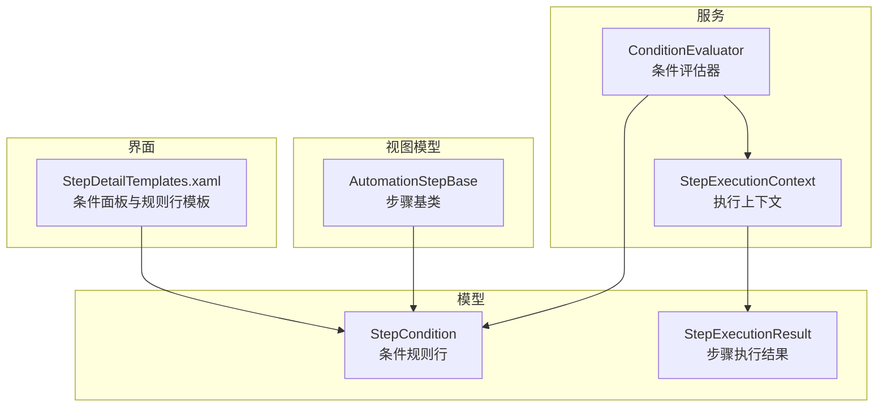
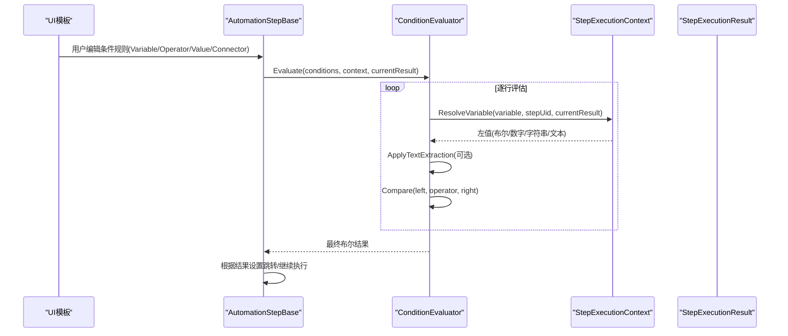
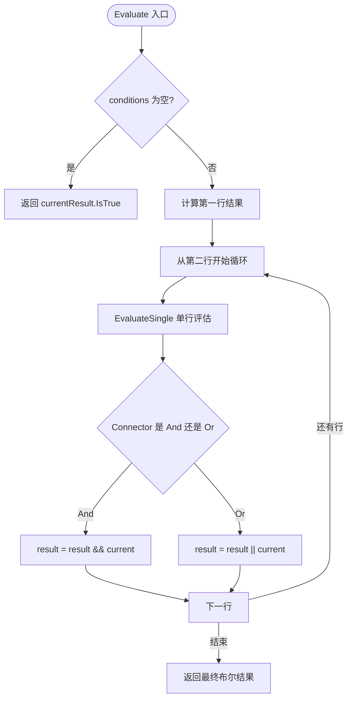
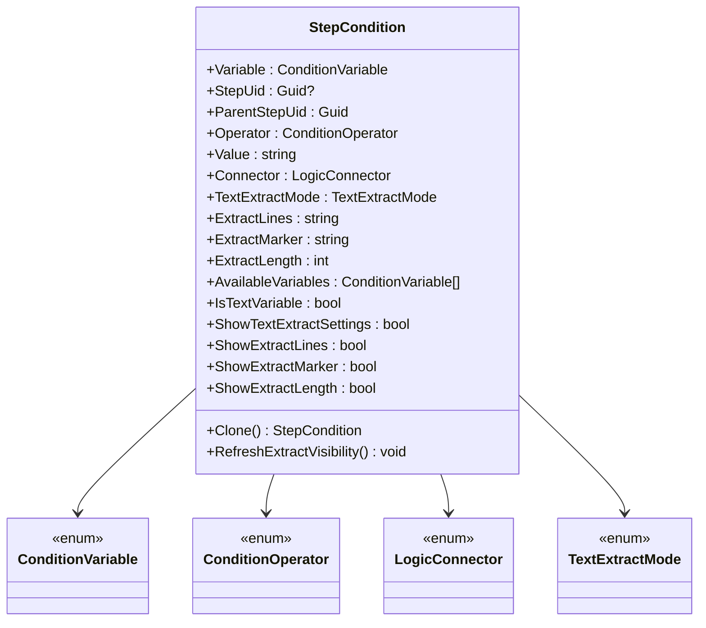
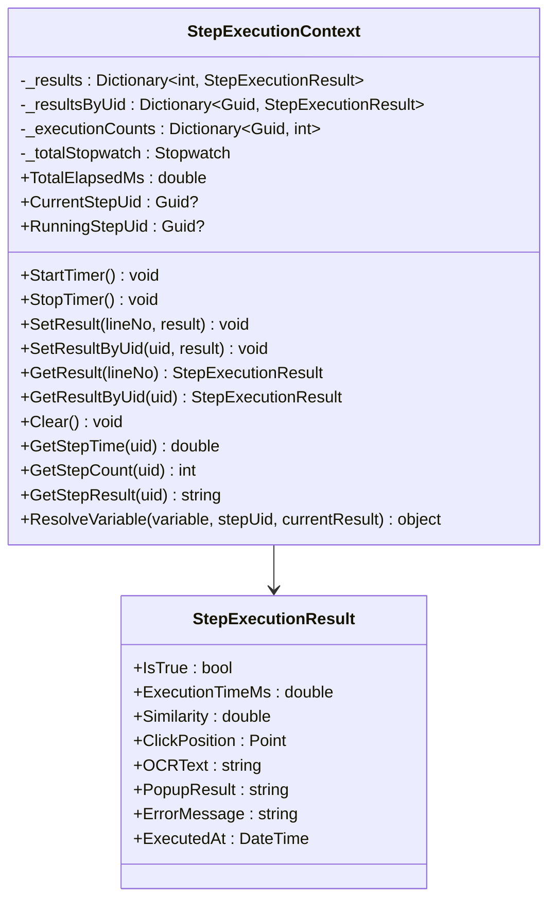
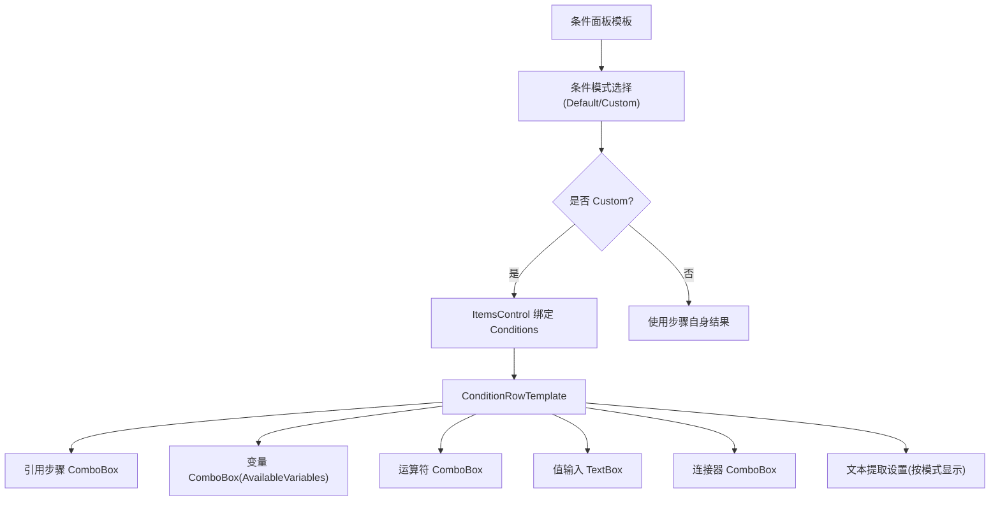
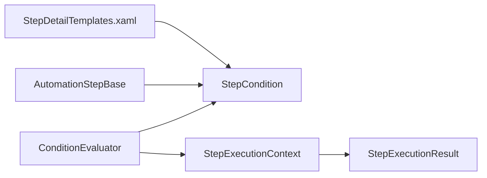

# 条件评估器

<cite>
**本文引用的文件**   
- [ConditionEvaluator.cs](file://ShaoLu/Services/ConditionEvaluator.cs)
- [StepCondition.cs](file://ShaoLu/Models/StepCondition.cs)
- [StepExecutionContext.cs](file://ShaoLu/Services/StepExecutionContext.cs)
- [StepExecutionResult.cs](file://ShaoLu/Models/StepExecutionResult.cs)
- [AutomationStep.cs](file://ShaoLu/Viewmodels/AutomationStep.cs)
- [StepDetailTemplates.xaml](file://ShaoLu/Templates/StepDetailTemplates.xaml)
- [ConditionEvaluatorTests.cs](file://NUnitTest/ConditionEvaluatorTests.cs)
</cite>

## 目录
1. [简介](#简介)
2. [项目结构](#项目结构)
3. [核心组件](#核心组件)
4. [架构总览](#架构总览)
5. [详细组件分析](#详细组件分析)
6. [依赖关系分析](#依赖关系分析)
7. [性能考量](#性能考量)
8. [故障排查指南](#故障排查指南)
9. [结论](#结论)
10. [附录：使用示例与扩展指南](#附录使用示例与扩展指南)

## 简介
本技术文档围绕 ShaoLu 的条件评估器展开，系统阐述 ConditionEvaluator 的工作原理、StepCondition 模型设计、执行上下文集成方式以及 UI 可视化配置。文档面向不同技术背景的读者，既提供高层架构概览，也深入到代码级实现细节，帮助开发者理解并扩展条件表达式解析、评估与执行的完整流程。

## 项目结构
条件评估相关代码主要分布在以下模块：
- 服务层：ConditionEvaluator（评估引擎）、StepExecutionContext（执行上下文）
- 模型层：StepCondition（条件规则行）、StepExecutionResult（步骤执行结果）
- 视图模型层：AutomationStepBase 及其派生类（承载 Conditions 集合与条件模式）
- 界面模板：StepDetailTemplates.xaml（条件面板与规则行模板）
- 测试用例：ConditionEvaluatorTests.cs（覆盖空条件、常量、布尔/数字/字符串比较、正则匹配、文本提取、AND/OR 组合等）

**图表来源** 
- [StepCondition.cs:100-405](file://ShaoLu/Models/StepCondition.cs#L100-L405)
- [StepExecutionResult.cs:1-51](file://ShaoLu/Models/StepExecutionResult.cs#L1-L51)
- [ConditionEvaluator.cs:1-294](file://ShaoLu/Services/ConditionEvaluator.cs#L1-L294)
- [StepExecutionContext.cs:1-163](file://ShaoLu/Services/StepExecutionContext.cs#L1-L163)
- [AutomationStep.cs:209-244](file://ShaoLu/Viewmodels/AutomationStep.cs#L209-L244)
- [StepDetailTemplates.xaml:75-202](file://ShaoLu/Templates/StepDetailTemplates.xaml#L75-L202)

**章节来源**
- [StepCondition.cs:100-405](file://ShaoLu/Models/StepCondition.cs#L100-L405)
- [StepExecutionResult.cs:1-51](file://ShaoLu/Models/StepExecutionResult.cs#L1-L51)
- [ConditionEvaluator.cs:1-294](file://ShaoLu/Services/ConditionEvaluator.cs#L1-L294)
- [StepExecutionContext.cs:1-163](file://ShaoLu/Services/StepExecutionContext.cs#L1-L163)
- [AutomationStep.cs:209-244](file://ShaoLu/Viewmodels/AutomationStep.cs#L209-L244)
- [StepDetailTemplates.xaml:75-202](file://ShaoLu/Templates/StepDetailTemplates.xaml#L75-L202)

## 核心组件
- ConditionEvaluator：静态评估器，负责将多行 StepCondition 按 AND/OR 连接器组合，返回最终布尔结果；支持常量、变量解析、文本预处理、多种运算符与正则匹配。
- StepCondition：描述单条条件规则，包含变量类型、运算符、值、逻辑连接器，以及识别文本的提取模式与参数。
- StepExecutionContext：维护步骤执行结果字典、Uid 索引、执行计数与计时器，并提供 ResolveVariable 以解析变量为实际值。
- StepExecutionResult：记录单次步骤执行的结构化数据（成功标志、相似度、耗时、点击位置、OCR 文本、弹窗结果等）。
- AutomationStepBase：步骤基类，持有 ConditionMode 与 Conditions 集合，提供添加/删除条件的命令，并在运行时通过 LastResult 传递执行结果。

**章节来源**
- [ConditionEvaluator.cs:1-294](file://ShaoLu/Services/ConditionEvaluator.cs#L1-L294)
- [StepCondition.cs:100-405](file://ShaoLu/Models/StepCondition.cs#L100-L405)
- [StepExecutionContext.cs:1-163](file://ShaoLu/Services/StepExecutionContext.cs#L1-L163)
- [StepExecutionResult.cs:1-51](file://ShaoLu/Models/StepExecutionResult.cs#L1-L51)
- [AutomationStep.cs:209-244](file://ShaoLu/Viewmodels/AutomationStep.cs#L209-L244)

## 架构总览
条件评估器的整体流程如下：
- UI 层通过模板渲染条件面板与规则行，用户编辑 Variable、Operator、Value、Connector 及文本提取参数。
- 步骤执行时，AutomationStepBase 将当前步骤的 LastResult 传入 ConditionEvaluator.Evaluate。
- ConditionEvaluator 逐行评估 StepCondition，调用 StepExecutionContext.ResolveVariable 获取左值，必要时进行 OCR 文本预处理，再根据运算符进行比较。
- 多行条件通过 Connector（And/Or）组合，得到最终布尔结果，驱动后续跳转或分支逻辑。

**图表来源** 
- [StepDetailTemplates.xaml:75-202](file://ShaoLu/Templates/StepDetailTemplates.xaml#L75-L202)
- [AutomationStep.cs:209-244](file://ShaoLu/Viewmodels/AutomationStep.cs#L209-L244)
- [ConditionEvaluator.cs:23-51](file://ShaoLu/Services/ConditionEvaluator.cs#L23-L51)
- [StepExecutionContext.cs:112-160](file://ShaoLu/Services/StepExecutionContext.cs#L112-L160)

## 详细组件分析

### 条件评估器（ConditionEvaluator）
- 入口方法 Evaluate：处理空条件回退到 currentResult.IsTrue；首行作为初始结果；从第二行起按 Connector 组合。
- 单行评估 EvaluateSingle：常量直接返回；解析变量值；对 OCR 文本进行提取预处理；调用 Compare。
- 比较逻辑 Compare：支持 IsEmpty/IsNotEmpty、正则匹配、布尔比较、数值比较（含浮点容差）、字符串相等/包含/大小写不敏感比较，以及字符串转数字的比较回退。
- 文本提取 ApplyTextExtraction：支持 Whole/Lines/FromSubstring/FromStart/FromEnd 模式，Lines 支持“1,3,5-8”格式，FromSubstring 支持 marker 与 length。
- 辅助方法：IsNumeric、ParseBool、IsEmptyValue。

**图表来源** 
- [ConditionEvaluator.cs:23-51](file://ShaoLu/Services/ConditionEvaluator.cs#L23-L51)
- [ConditionEvaluator.cs:56-83](file://ShaoLu/Services/ConditionEvaluator.cs#L56-L83)
- [ConditionEvaluator.cs:88-164](file://ShaoLu/Services/ConditionEvaluator.cs#L88-L164)
- [ConditionEvaluator.cs:177-207](file://ShaoLu/Services/ConditionEvaluator.cs#L177-L207)

**章节来源**
- [ConditionEvaluator.cs:23-51](file://ShaoLu/Services/ConditionEvaluator.cs#L23-L51)
- [ConditionEvaluator.cs:56-83](file://ShaoLu/Services/ConditionEvaluator.cs#L56-L83)
- [ConditionEvaluator.cs:88-164](file://ShaoLu/Services/ConditionEvaluator.cs#L88-L164)
- [ConditionEvaluator.cs:177-207](file://ShaoLu/Services/ConditionEvaluator.cs#L177-L207)

### 条件模型（StepCondition）
- 枚举：
  - ConditionMode：Default（默认使用步骤自身结果）、Custom（自定义规则行）
  - ConditionVariable：常量 True/False；Self_*（当前步骤属性）；Step_*（引用其他步骤属性）；Step_Triggered（刚刚被触发）
  - ConditionOperator：Equal、NotEqual、GreaterThan、LessThan、GreaterOrEqual、LessOrEqual、Contains、NotContains、IsEmpty、IsNotEmpty、RegexMatch
  - LogicConnector：And、Or
  - TextExtractMode：Whole、Lines、FromSubstring、FromStart、FromEnd
- 属性：
  - Variable、StepUid、ParentStepUid、Operator、Value、Connector
  - TextExtractMode、ExtractLines、ExtractMarker、ExtractLength
  - 可见性控制：IsTextVariable、ShowTextExtractSettings、ShowExtractLines/Marker/Length
  - AvailableVariables：根据步骤类型动态生成可用变量列表
- 行为：Clone、RefreshExtractVisibility、ResolveStepType（用于 UI 可用变量推导）

**图表来源** 
- [StepCondition.cs:100-405](file://ShaoLu/Models/StepCondition.cs#L100-L405)

**章节来源**
- [StepCondition.cs:100-405](file://ShaoLu/Models/StepCondition.cs#L100-L405)

### 执行上下文（StepExecutionContext）
- 存储：
  - _results：按行号索引的执行结果
  - _resultsByUid：按 Uid 索引的执行结果
  - _executionCounts：步骤执行次数统计
  - _totalStopwatch：总计时器
- 接口：
  - SetResult/SetResultByUid、GetResult/GetResultByUid、Clear
  - GetStepTime/GetStepCount/GetStepResult
  - ResolveVariable：根据变量类型解析为具体值（包括 Self_* 与 Step_* 系列，以及 Step_Triggered）

**图表来源** 
- [StepExecutionContext.cs:1-163](file://ShaoLu/Services/StepExecutionContext.cs#L1-L163)
- [StepExecutionResult.cs:1-51](file://ShaoLu/Models/StepExecutionResult.cs#L1-L51)

**章节来源**
- [StepExecutionContext.cs:1-163](file://ShaoLu/Services/StepExecutionContext.cs#L1-L163)
- [StepExecutionResult.cs:1-51](file://ShaoLu/Models/StepExecutionResult.cs#L1-L51)

### UI 集成（StepDetailTemplates.xaml）
- 条件面板模板：
  - 条件模式选择（Default/Custom）
  - 规则行模板（ConditionRowTemplate）：
    - 引用步骤 ComboBox（AllSteps）
    - 变量 ComboBox（AvailableVariables，经转换器显示）
    - 运算符 ComboBox（ConditionOperator）
    - 值 TextBox（Value）
    - 连接器 ComboBox（LogicConnector）
    - 文本提取设置（按 IsTextVariable 与模式动态显示）
- 各步骤模板均嵌入 ContentControl 引用 ConditionPanelTemplate，统一条件配置体验。

**图表来源** 
- [StepDetailTemplates.xaml:75-202](file://ShaoLu/Templates/StepDetailTemplates.xaml#L75-L202)

**章节来源**
- [StepDetailTemplates.xaml:75-202](file://ShaoLu/Templates/StepDetailTemplates.xaml#L75-L202)

## 依赖关系分析
- ConditionEvaluator 依赖 StepCondition（规则定义）、StepExecutionContext（变量解析）、StepExecutionResult（当前结果）。
- StepCondition 依赖枚举与 UI 集合（AllSteps），并通过 ParentStepUid 关联父步骤类型以推导可用变量。
- AutomationStepBase 持有 Conditions 集合与 ConditionMode，提供 Add/Remove 命令，并将 LastResult 传递给评估器。
- UI 模板通过 DataBinding 将 StepCondition 的属性映射到控件，确保用户配置即时生效。

**图表来源** 
- [ConditionEvaluator.cs:1-294](file://ShaoLu/Services/ConditionEvaluator.cs#L1-L294)
- [StepCondition.cs:100-405](file://ShaoLu/Models/StepCondition.cs#L100-L405)
- [StepExecutionContext.cs:1-163](file://ShaoLu/Services/StepExecutionContext.cs#L1-L163)
- [AutomationStep.cs:209-244](file://ShaoLu/Viewmodels/AutomationStep.cs#L209-L244)
- [StepDetailTemplates.xaml:75-202](file://ShaoLu/Templates/StepDetailTemplates.xaml#L75-L202)

**章节来源**
- [ConditionEvaluator.cs:1-294](file://ShaoLu/Services/ConditionEvaluator.cs#L1-L294)
- [StepCondition.cs:100-405](file://ShaoLu/Models/StepCondition.cs#L100-L405)
- [StepExecutionContext.cs:1-163](file://ShaoLu/Services/StepExecutionContext.cs#L1-L163)
- [AutomationStep.cs:209-244](file://ShaoLu/Viewmodels/AutomationStep.cs#L209-L244)
- [StepDetailTemplates.xaml:75-202](file://ShaoLu/Templates/StepDetailTemplates.xaml#L75-L202)

## 性能考量
- 评估复杂度：O(n)，n 为条件行数；每行解析与比较均为常数时间操作（正则匹配除外）。
- 正则匹配：RegexMatch 可能带来额外开销，建议谨慎使用复杂模式或在 UI 层做预校验。
- 文本提取：Lines/FromSubstring/FromStart/FromEnd 涉及字符串分割与截取，尽量精简 ExtractLines 与 ExtractMarker 配置。
- 数值比较：浮点比较采用容差 1e-9，避免精度问题带来的误判。
- 日志记录：异常路径会记录警告日志，生产环境建议合理配置 NLog 输出级别以减少 I/O 开销。

[本节为通用指导，不直接分析具体文件]

## 故障排查指南
- 空条件或 null 条件：Evaluate 回退到 currentResult.IsTrue；若 currentResult 为 null，则返回 false。
- 变量解析失败：ResolveVariable 对缺失步骤返回默认值（如 false、0、空串），需检查 StepUid 是否正确设置。
- 正则表达式错误：Compare 捕获异常并记录警告，返回 false；请检查右值是否为合法正则模式。
- 文本提取异常：ApplyTextExtraction 捕获异常并返回原文本；检查 ExtractLines、ExtractMarker、ExtractLength 配置。
- 连接器逻辑错误：确认每行的 Connector 指向“与下一行”的关系，避免顺序误解导致逻辑偏差。

**章节来源**
- [ConditionEvaluator.cs:23-51](file://ShaoLu/Services/ConditionEvaluator.cs#L23-L51)
- [ConditionEvaluator.cs:56-83](file://ShaoLu/Services/ConditionEvaluator.cs#L56-L83)
- [ConditionEvaluator.cs:88-164](file://ShaoLu/Services/ConditionEvaluator.cs#L88-L164)
- [ConditionEvaluator.cs:177-207](file://ShaoLu/Services/ConditionEvaluator.cs#L177-L207)
- [StepExecutionContext.cs:112-160](file://ShaoLu/Services/StepExecutionContext.cs#L112-L160)

## 结论
ShaoLu 的条件评估器以简洁清晰的架构实现了灵活的条件表达式评估：通过 StepCondition 表达规则、StepExecutionContext 提供变量解析、ConditionEvaluator 完成比较与组合。其设计具备良好的可扩展性与可测试性，配合 UI 模板可实现直观的可视化配置。建议在新增条件类型或运算符时遵循现有模式，保持评估流程的一致性与稳定性。

[本节为总结，不直接分析具体文件]

## 附录：使用示例与扩展指南

### 使用示例（基于单元测试场景）
- 空条件与默认行为：无条件时返回 currentResult.IsTrue；currentResult 为 null 时返回 false。
- 常量条件：ConstantTrue 恒真，ConstantFalse 恒假。
- 布尔比较：Self_IsTrue 与 Value 的 true/false 或 1/0 比较。
- 数字比较：Self_Similarity、Self_ExecutionTimeMs 与数值比较（大于、小于、等于、不等于、大于等于、小于等于）。
- 字符串比较：Self_OCRText 的相等、包含、不包含、正则匹配。
- 空值判断：IsEmpty/IsNotEmpty。
- 多行组合：And/Or 连接器组合多行条件。
- 引用其他步骤：Step_* 变量通过 StepUid 获取历史结果。
- 文本提取：Lines、FromSubstring、FromStart、FromEnd 模式对 OCR 文本预处理后再比较。

参考测试用例路径：
- [ConditionEvaluatorTests.cs:30-62](file://NUnitTest/ConditionEvaluatorTests.cs#L30-L62)
- [ConditionEvaluatorTests.cs:66-88](file://NUnitTest/ConditionEvaluatorTests.cs#L66-L88)
- [ConditionEvaluatorTests.cs:92-157](file://NUnitTest/ConditionEvaluatorTests.cs#L92-L157)
- [ConditionEvaluatorTests.cs:159-257](file://NUnitTest/ConditionEvaluatorTests.cs#L159-L257)
- [ConditionEvaluatorTests.cs:259-375](file://NUnitTest/ConditionEvaluatorTests.cs#L259-L375)
- [ConditionEvaluatorTests.cs:377-502](file://NUnitTest/ConditionEvaluatorTests.cs#L377-L502)
- [ConditionEvaluatorTests.cs:504-563](file://NUnitTest/ConditionEvaluatorTests.cs#L504-L563)
- [ConditionEvaluatorTests.cs:588-662](file://NUnitTest/ConditionEvaluatorTests.cs#L588-L662)

**章节来源**
- [ConditionEvaluatorTests.cs:30-62](file://NUnitTest/ConditionEvaluatorTests.cs#L30-L62)
- [ConditionEvaluatorTests.cs:66-88](file://NUnitTest/ConditionEvaluatorTests.cs#L66-L88)
- [ConditionEvaluatorTests.cs:92-157](file://NUnitTest/ConditionEvaluatorTests.cs#L92-L157)
- [ConditionEvaluatorTests.cs:159-257](file://NUnitTest/ConditionEvaluatorTests.cs#L159-L257)
- [ConditionEvaluatorTests.cs:259-375](file://NUnitTest/ConditionEvaluatorTests.cs#L259-L375)
- [ConditionEvaluatorTests.cs:377-502](file://NUnitTest/ConditionEvaluatorTests.cs#L377-L502)
- [ConditionEvaluatorTests.cs:504-563](file://NUnitTest/ConditionEvaluatorTests.cs#L504-L563)
- [ConditionEvaluatorTests.cs:588-662](file://NUnitTest/ConditionEvaluatorTests.cs#L588-L662)

### 扩展自定义条件类型
- 在 StepCondition 中新增 ConditionVariable 枚举项（例如自定义业务指标）。
- 在 StepExecutionContext.ResolveVariable 中增加对应分支，返回实际值。
- 在 StepCondition.AvailableVariables 中根据步骤类型暴露新变量。
- 在 ConditionEvaluator.Compare 中扩展运算符或类型处理逻辑（如需）。
- 更新 UI 模板（如有需要）以支持新的提取或显示需求。

参考扩展点路径：
- [StepCondition.cs:174-251](file://ShaoLu/Models/StepCondition.cs#L174-L251)
- [StepExecutionContext.cs:112-160](file://ShaoLu/Services/StepExecutionContext.cs#L112-L160)
- [ConditionEvaluator.cs:88-164](file://ShaoLu/Services/ConditionEvaluator.cs#L88-L164)

**章节来源**
- [StepCondition.cs:174-251](file://ShaoLu/Models/StepCondition.cs#L174-L251)
- [StepExecutionContext.cs:112-160](file://ShaoLu/Services/StepExecutionContext.cs#L112-L160)
- [ConditionEvaluator.cs:88-164](file://ShaoLu/Services/ConditionEvaluator.cs#L88-L164)