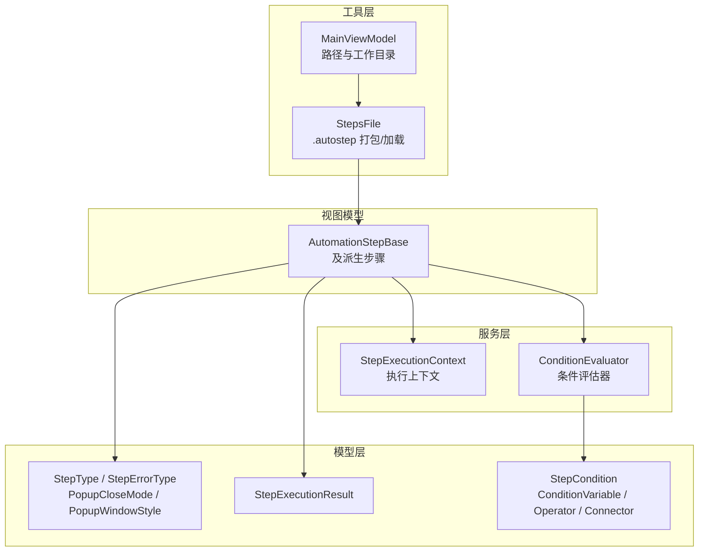
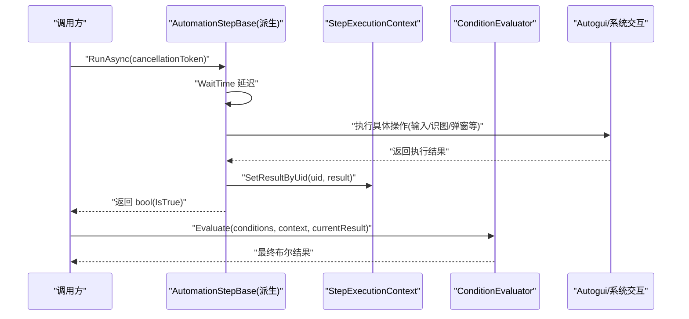
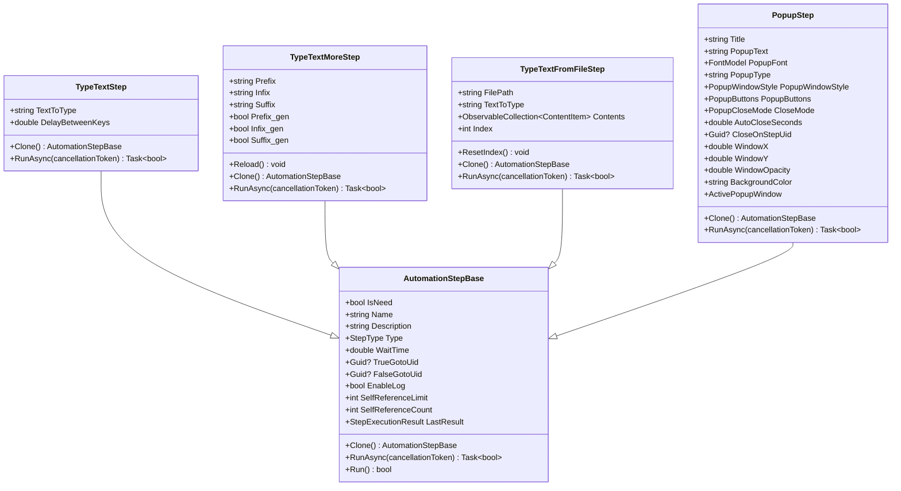
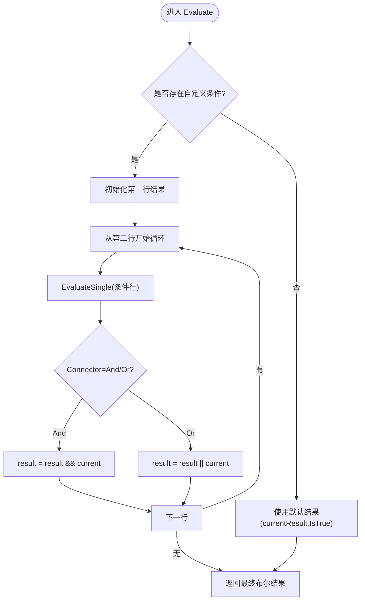
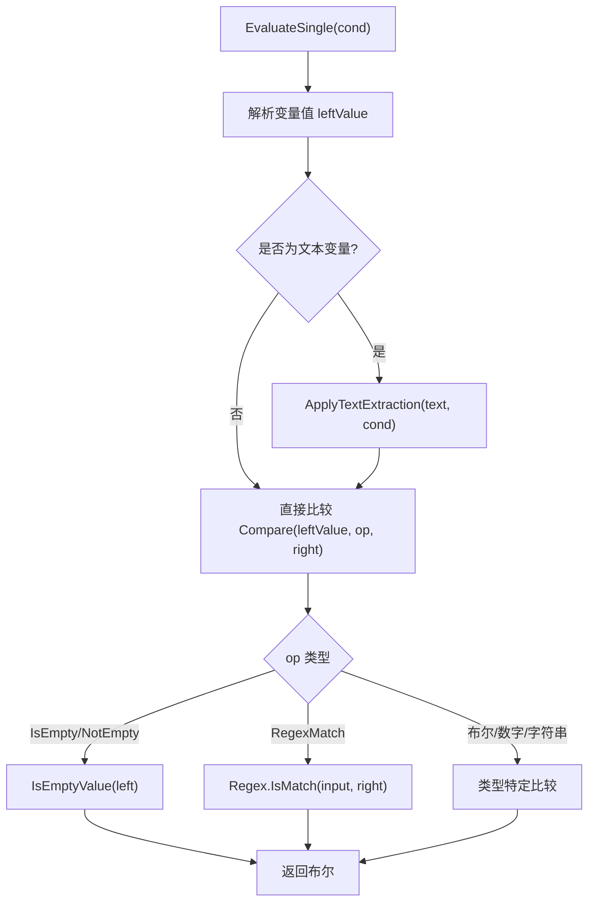
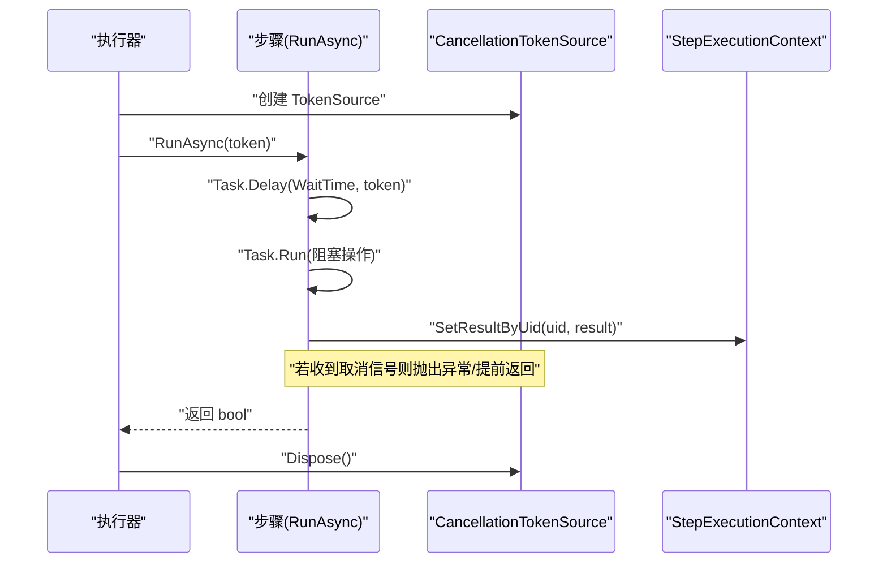
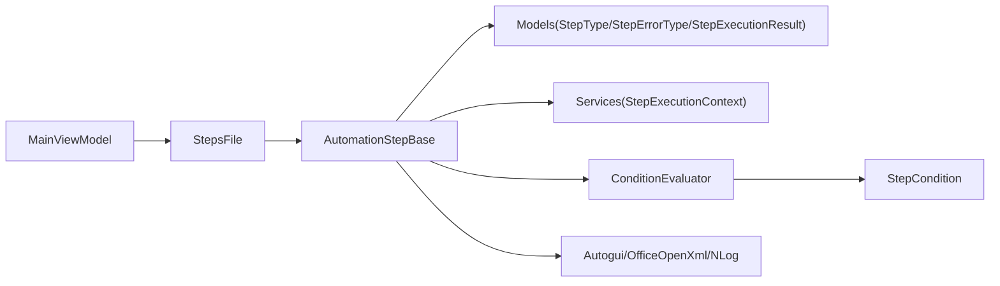

# 核心模块

<cite>
**本文引用的文件**   
- [AutomationStep.cs](file://ShaoLu/Viewmodels/AutomationStep.cs)
- [StepExecutionContext.cs](file://ShaoLu/Services/StepExecutionContext.cs)
- [ConditionEvaluator.cs](file://ShaoLu/Services/ConditionEvaluator.cs)
- [AutomationStepModel.cs](file://ShaoLu/Models/AutomationStepModel.cs)
- [StepExecutionResult.cs](file://ShaoLu/Models/StepExecutionResult.cs)
- [StepCondition.cs](file://ShaoLu/Models/StepCondition.cs)
- [StepsFile.cs](file://ShaoLu/Utils/StepsFile.cs)
- [MainViewModel.cs](file://ShaoLu/Viewmodels/MainViewModel.cs)
</cite>

## 目录
1. [简介](#简介)
2. [项目结构](#项目结构)
3. [核心组件](#核心组件)
4. [架构总览](#架构总览)
5. [详细组件分析](#详细组件分析)
6. [依赖关系分析](#依赖关系分析)
7. [性能考量](#性能考量)
8. [故障排查指南](#故障排查指南)
9. [结论](#结论)
10. [附录](#附录)

## 简介
本技术文档聚焦 ShaoLu 自动化执行引擎的核心模块，围绕步骤执行基类、执行上下文、条件评估器与异步执行机制展开。读者将理解：
- AutomationStepBase 的设计与生命周期管理
- 步骤执行结果与上下文的传递与控制
- 条件评估器的规则解析与文本提取
- 暂停/继续与异步执行的实现要点
- 如何扩展新的步骤类型与自定义执行逻辑

## 项目结构
核心模块分布在 Viewmodels、Services、Models、Utils 四个层次：
- Viewmodels：步骤定义与具体步骤实现（如输入文字、弹出框等）
- Services：执行上下文与条件评估器
- Models：枚举、模型与数据结构（步骤类型、错误类型、条件变量、执行结果）
- Utils：步骤文件的序列化与打包（.autostep）

图表来源
- [AutomationStep.cs:25-296](file://ShaoLu/Viewmodels/AutomationStep.cs#L25-L296)
- [StepExecutionContext.cs:11-163](file://ShaoLu/Services/StepExecutionContext.cs#L11-L163)
- [ConditionEvaluator.cs:11-294](file://ShaoLu/Services/ConditionEvaluator.cs#L11-L294)
- [AutomationStepModel.cs:9-73](file://ShaoLu/Models/AutomationStepModel.cs#L9-L73)
- [StepExecutionResult.cs:8-51](file://ShaoLu/Models/StepExecutionResult.cs#L8-L51)
- [StepCondition.cs:103-405](file://ShaoLu/Models/StepCondition.cs#L103-L405)
- [StepsFile.cs:15-244](file://ShaoLu/Utils/StepsFile.cs#L15-L244)
- [MainViewModel.cs:8-76](file://ShaoLu/Viewmodels/MainViewModel.cs#L8-L76)

章节来源
- [AutomationStep.cs:25-296](file://ShaoLu/Viewmodels/AutomationStep.cs#L25-L296)
- [StepExecutionContext.cs:11-163](file://ShaoLu/Services/StepExecutionContext.cs#L11-L163)
- [ConditionEvaluator.cs:11-294](file://ShaoLu/Services/ConditionEvaluator.cs#L11-L294)
- [AutomationStepModel.cs:9-73](file://ShaoLu/Models/AutomationStepModel.cs#L9-L73)
- [StepExecutionResult.cs:8-51](file://ShaoLu/Models/StepExecutionResult.cs#L8-L51)
- [StepCondition.cs:103-405](file://ShaoLu/Models/StepCondition.cs#L103-L405)
- [StepsFile.cs:15-244](file://ShaoLu/Utils/StepsFile.cs#L15-L244)
- [MainViewModel.cs:8-76](file://ShaoLu/Viewmodels/MainViewModel.cs#L8-L76)

## 核心组件
- 步骤基类与步骤类型
  - AutomationStepBase 提供通用属性（名称、描述、等待时间、跳转 Uid、错误状态、日志开关、自引用限制等）、抽象 RunAsync 与 Clone，以及 JSON 序列化相关特性。
  - 具体步骤（如 TypeTextStep、TypeTextMoreStep、TypeTextFromFileStep、PopupStep）继承基类并实现 RunAsync，封装各自业务逻辑。
- 执行上下文
  - StepExecutionContext 以单例形式维护步骤执行结果（按行号与 Uid 索引）、执行次数、当前/运行中步骤 Uid、总耗时计时器，并提供变量解析 ResolveVariable。
- 条件评估器
  - ConditionEvaluator.Evaluate 对多行条件进行 AND/OR 组合，EvaluateSingle 解析变量值并比较；支持正则匹配、数字/字符串/布尔比较、OCR 文本提取模式。
- 数据模型
  - StepType、StepErrorType、PopupCloseMode、PopupWindowStyle 等枚举用于步骤分类与错误分类。
  - StepExecutionResult 记录 IsTrue、ExecutionTimeMs、Similarity、ClickPosition、OCRText、PopupResult、ErrorMessage、ExecutedAt。
  - StepCondition 定义条件变量、运算符、连接器与 OCR 文本提取设置。
- 持久化与打包
  - StepsFile 负责 .autostep 压缩包（steps.json + images/）的保存与加载，兼容旧版 JSON 格式，并进行旧格式行号到 Uid 的后处理。

章节来源
- [AutomationStep.cs:25-296](file://ShaoLu/Viewmodels/AutomationStep.cs#L25-L296)
- [StepExecutionContext.cs:11-163](file://ShaoLu/Services/StepExecutionContext.cs#L11-L163)
- [ConditionEvaluator.cs:11-294](file://ShaoLu/Services/ConditionEvaluator.cs#L11-L294)
- [AutomationStepModel.cs:9-73](file://ShaoLu/Models/AutomationStepModel.cs#L9-L73)
- [StepExecutionResult.cs:8-51](file://ShaoLu/Models/StepExecutionResult.cs#L8-L51)
- [StepCondition.cs:103-405](file://ShaoLu/Models/StepCondition.cs#L103-L405)
- [StepsFile.cs:15-244](file://ShaoLu/Utils/StepsFile.cs#L15-L244)

## 架构总览
下图展示步骤执行主流程：调度器调用步骤 RunAsync，步骤内部通过 Autogui 完成系统交互，执行结果写入 StepExecutionContext，条件评估器根据上下文与当前结果计算下一步跳转或分支。

图表来源
- [AutomationStep.cs:290-296](file://ShaoLu/Viewmodels/AutomationStep.cs#L290-L296)
- [StepExecutionContext.cs:39-52](file://ShaoLu/Services/StepExecutionContext.cs#L39-L52)
- [ConditionEvaluator.cs:23-51](file://ShaoLu/Services/ConditionEvaluator.cs#L23-L51)

## 详细组件分析

### 步骤基类与生命周期
- 关键职责
  - 统一属性：IsNeed、Name、Description、Type、WaitTime、TrueGotoUid/FalseGotoUid、EnableLog、SelfReferenceLimit、SelfReferenceCount、LastResult 等。
  - 生命周期钩子：RunAsync 为异步执行入口；Run 同步包装；Clone 用于复制步骤实例。
  - 跳转解析：ResolveLineNo 将 Uid 映射为 UI 显示的行号；AllSteps 提供“无跳转”占位项集合。
- 执行流程
  - 等待 WaitTime
  - 执行具体业务（可能涉及 I/O、OCR、UI 交互）
  - 更新 IsTrue、IsError、ErrorType、LastResult
  - 返回结果供上层控制跳转

图表来源
- [AutomationStep.cs:25-296](file://ShaoLu/Viewmodels/AutomationStep.cs#L25-L296)
- [AutomationStep.cs:300-365](file://ShaoLu/Viewmodels/AutomationStep.cs#L300-L365)
- [AutomationStep.cs:367-516](file://ShaoLu/Viewmodels/AutomationStep.cs#L367-L516)
- [AutomationStep.cs:518-680](file://ShaoLu/Viewmodels/AutomationStep.cs#L518-L680)
- [AutomationStep.cs:684-800](file://ShaoLu/Viewmodels/AutomationStep.cs#L684-L800)

章节来源
- [AutomationStep.cs:25-296](file://ShaoLu/Viewmodels/AutomationStep.cs#L25-L296)
- [AutomationStep.cs:300-365](file://ShaoLu/Viewmodels/AutomationStep.cs#L300-L365)
- [AutomationStep.cs:367-516](file://ShaoLu/Viewmodels/AutomationStep.cs#L367-L516)
- [AutomationStep.cs:518-680](file://ShaoLu/Viewmodels/AutomationStep.cs#L518-L680)
- [AutomationStep.cs:684-800](file://ShaoLu/Viewmodels/AutomationStep.cs#L684-L800)

### 执行上下文与变量解析
- 存储结构
  - _results：按行号索引的执行结果
  - _resultsByUid：按 Uid 索引的执行结果
  - _executionCounts：步骤执行次数统计
  - CurrentStepUid：刚刚执行完成的步骤 Uid（供 Step_Triggered 使用）
  - RunningStepUid：当前正在执行的步骤 Uid（供统计展示）
- 变量解析
  - ResolveVariable 支持常量、当前步骤自身字段、引用其他步骤字段、Step_Triggered 一次性触发语义。
- 计时与清理
  - StartTimer/StopTimer 控制总耗时；Clear 在每次运行前清空上下文。

图表来源
- [StepExecutionContext.cs:11-163](file://ShaoLu/Services/StepExecutionContext.cs#L11-L163)
- [ConditionEvaluator.cs:23-51](file://ShaoLu/Services/ConditionEvaluator.cs#L23-L51)

章节来源
- [StepExecutionContext.cs:11-163](file://ShaoLu/Services/StepExecutionContext.cs#L11-L163)
- [ConditionEvaluator.cs:23-51](file://ShaoLu/Services/ConditionEvaluator.cs#L23-L51)

### 条件评估器与文本提取
- 多行条件组合
  - 第一行作为初始值，后续行根据 Connector（And/Or）组合。
- 变量取值
  - 通过 StepExecutionContext.ResolveVariable 获取实际值，支持 OCR 文本预处理。
- 比较逻辑
  - 支持空检查、正则匹配、布尔/数字/字符串比较，字符串比较时尝试数值比较回退。
- 文本提取
  - ApplyTextExtraction 支持整段、指定行、从子串后读取、从头/尾截取长度。

图表来源
- [ConditionEvaluator.cs:56-83](file://ShaoLu/Services/ConditionEvaluator.cs#L56-L83)
- [ConditionEvaluator.cs:88-164](file://ShaoLu/Services/ConditionEvaluator.cs#L88-L164)
- [ConditionEvaluator.cs:177-207](file://ShaoLu/Services/ConditionEvaluator.cs#L177-L207)

章节来源
- [ConditionEvaluator.cs:23-51](file://ShaoLu/Services/ConditionEvaluator.cs#L23-L51)
- [ConditionEvaluator.cs:56-83](file://ShaoLu/Services/ConditionEvaluator.cs#L56-L83)
- [ConditionEvaluator.cs:88-164](file://ShaoLu/Services/ConditionEvaluator.cs#L88-L164)
- [ConditionEvaluator.cs:177-207](file://ShaoLu/Services/ConditionEvaluator.cs#L177-L207)

### 异步执行与暂停/继续
- 异步设计
  - RunAsync 接受 CancellationToken，支持可取消的长时间任务（如等待、I/O）。
  - 具体步骤内部使用 Task.Run 将阻塞操作放入线程池，避免阻塞 UI。
- 暂停/继续
  - 可通过外部传入的 CancellationTokenSource 控制取消；对于需要用户确认的步骤（如 PopupStep），可在窗口关闭模式中结合 Timeout 或 StepReached 实现自动关闭或到达某步关闭。
- 执行结果与上下文
  - 步骤完成后调用 SetResultByUid 写入结果，并更新执行次数；RunningStepUid 用于统计展示。

图表来源
- [AutomationStep.cs:290-296](file://ShaoLu/Viewmodels/AutomationStep.cs#L290-L296)
- [StepExecutionContext.cs:31-34](file://ShaoLu/Services/StepExecutionContext.cs#L31-L34)
- [StepExecutionContext.cs:39-52](file://ShaoLu/Services/StepExecutionContext.cs#L39-L52)

章节来源
- [AutomationStep.cs:290-296](file://ShaoLu/Viewmodels/AutomationStep.cs#L290-L296)
- [StepExecutionContext.cs:31-34](file://ShaoLu/Services/StepExecutionContext.cs#L31-L34)
- [StepExecutionContext.cs:39-52](file://ShaoLu/Services/StepExecutionContext.cs#L39-L52)

### 数据模型与错误处理
- 步骤类型与错误类型
  - StepType 区分 ClickImage、FindImage、TypeText、Popup 等；StepErrorType 涵盖图像未找到、超时、索引越界、弹窗错误等。
- 执行结果
  - StepExecutionResult 包含 IsTrue、ExecutionTimeMs、Similarity、ClickPosition、OCRText、PopupResult、ErrorMessage、ExecutedAt。
- 条件模型
  - StepCondition 支持 Variable、Operator、Connector、TextExtractMode 及提取参数（ExtractLines、ExtractMarker、ExtractLength）。

章节来源
- [AutomationStepModel.cs:9-73](file://ShaoLu/Models/AutomationStepModel.cs#L9-L73)
- [StepExecutionResult.cs:8-51](file://ShaoLu/Models/StepExecutionResult.cs#L8-L51)
- [StepCondition.cs:103-405](file://ShaoLu/Models/StepCondition.cs#L103-L405)

### 步骤文件打包与加载
- .autostep 包
  - SaveAsAutoStepPackage：序列化 steps.json，收集裁剪图片写入 zip。
  - LoadFromAutoStepPackage：解压工作目录、读取 steps.json、反序列化为步骤集合，并进行旧格式行号到 Uid 的后处理。
- 兼容旧版 JSON
  - 保留 SaveStepsToJson/LoadStepsFromJson 方法（标记过时），并通过 ResolveLegacyGotoLineNumbers 迁移跳转目标。

章节来源
- [StepsFile.cs:40-71](file://ShaoLu/Utils/StepsFile.cs#L40-L71)
- [StepsFile.cs:76-119](file://ShaoLu/Utils/StepsFile.cs#L76-L119)
- [StepsFile.cs:175-219](file://ShaoLu/Utils/StepsFile.cs#L175-L219)
- [StepsFile.cs:226-242](file://ShaoLu/Utils/StepsFile.cs#L226-L242)

## 依赖关系分析
- 低耦合高内聚
  - 步骤基类仅依赖模型与服务接口（通过 SingletonLocator 访问），不直接耦合 UI。
  - 条件评估器独立于步骤实现，只依赖 StepCondition 与 StepExecutionResult。
- 外部依赖
  - Autogui：系统级输入模拟与识别能力（由具体步骤调用）。
  - NLog：日志记录。
  - OfficeOpenXml：Excel 文件读取（TypeTextFromFileStep）。
- 潜在循环依赖
  - 通过 SingletonLocator 解耦步骤集合访问，避免直接循环引用。

图表来源
- [AutomationStep.cs:25-296](file://ShaoLu/Viewmodels/AutomationStep.cs#L25-L296)
- [StepExecutionContext.cs:11-163](file://ShaoLu/Services/StepExecutionContext.cs#L11-L163)
- [ConditionEvaluator.cs:11-294](file://ShaoLu/Services/ConditionEvaluator.cs#L11-L294)
- [StepCondition.cs:103-405](file://ShaoLu/Models/StepCondition.cs#L103-L405)
- [StepsFile.cs:15-244](file://ShaoLu/Utils/StepsFile.cs#L15-L244)
- [MainViewModel.cs:8-76](file://ShaoLu/Viewmodels/MainViewModel.cs#L8-L76)

章节来源
- [AutomationStep.cs:25-296](file://ShaoLu/Viewmodels/AutomationStep.cs#L25-L296)
- [StepExecutionContext.cs:11-163](file://ShaoLu/Services/StepExecutionContext.cs#L11-L163)
- [ConditionEvaluator.cs:11-294](file://ShaoLu/Services/ConditionEvaluator.cs#L11-L294)
- [StepCondition.cs:103-405](file://ShaoLu/Models/StepCondition.cs#L103-L405)
- [StepsFile.cs:15-244](file://ShaoLu/Utils/StepsFile.cs#L15-L244)
- [MainViewModel.cs:8-76](file://ShaoLu/Viewmodels/MainViewModel.cs#L8-L76)

## 性能考量
- 异步与线程池
  - 使用 Task.Run 将阻塞操作移出 UI 线程，提高响应性；合理设置 WaitTime 减少不必要的等待。
- 条件评估优化
  - 多行条件短路求值（AND/OR）可减少无效计算；文本提取仅在 OCR 变量启用时执行。
- 序列化与 I/O
  - StepsFile 缓存 JsonSerializerOptions，提升序列化性能；.autostep 压缩传输与本地缓存分离。
- 资源释放
  - ExcelPackage 使用 using 确保释放；CancellationToken 及时取消长耗时任务。

[本节为通用指导，无需代码来源]

## 故障排查指南
- 常见问题定位
  - 步骤失败：检查 IsError、ErrorType、ErrorMessage；查看 StepExecutionResult 中的 ExecutionTimeMs 与 Similarity。
  - 条件不生效：确认 StepCondition.Variable、Operator、Value 配置；验证 OCR 文本提取模式是否正确。
  - 跳转异常：确认 TrueGotoUid/FalseGotoUid 指向有效步骤；检查旧格式行号是否已迁移。
- 调试建议
  - 启用 EnableLog 输出详细日志；利用 StepExecutionContext 的 GetStepResult/GetStepCount 辅助诊断。
  - 使用 CancellationToken 快速中断卡住的任务，观察异常堆栈。

章节来源
- [StepExecutionResult.cs:8-51](file://ShaoLu/Models/StepExecutionResult.cs#L8-L51)
- [StepCondition.cs:103-405](file://ShaoLu/Models/StepCondition.cs#L103-L405)
- [StepsFile.cs:226-242](file://ShaoLu/Utils/StepsFile.cs#L226-L242)

## 结论
ShaoLu 的核心模块通过清晰的层次划分与良好的抽象设计，实现了可扩展的步骤执行引擎。AutomationStepBase 统一了步骤生命周期，StepExecutionContext 提供了强大的执行上下文与变量解析，ConditionEvaluator 支持灵活的条件判断与文本提取。配合异步执行与 .autostep 打包机制，开发者可以高效地扩展新步骤类型与自定义执行逻辑，构建稳定可靠的 GUI 自动化流程。

[本节为总结，无需代码来源]

## 附录
- 扩展新步骤类型的最佳实践
  - 继承 AutomationStepBase，实现 Clone 与 RunAsync；在 RunAsync 中处理 WaitTime、调用 Autogui、更新 IsTrue/IsError/ErrorType/LastResult。
  - 如需弹窗交互，参考 PopupStep 的 CloseMode 与 ActivePopupWindow 管理。
  - 在条件面板中为新步骤暴露合适的 ConditionVariable（参考 StepCondition.AvailableVariables）。
- 使用模式示例（路径指引）
  - 输入文字：[TypeTextStep:300-365](file://ShaoLu/Viewmodels/AutomationStep.cs#L300-L365)
  - 批量递增输入：[TypeTextMoreStep:367-516](file://ShaoLu/Viewmodels/AutomationStep.cs#L367-L516)
  - 从文件逐行输入：[TypeTextFromFileStep:518-680](file://ShaoLu/Viewmodels/AutomationStep.cs#L518-L680)
  - 弹窗交互：[PopupStep:684-800](file://ShaoLu/Viewmodels/AutomationStep.cs#L684-L800)
  - 条件评估：[ConditionEvaluator.Evaluate:23-51](file://ShaoLu/Services/ConditionEvaluator.cs#L23-L51)
  - 执行上下文：[StepExecutionContext:11-163](file://ShaoLu/Services/StepExecutionContext.cs#L11-L163)
  - 步骤打包/加载：[StepsFile:40-119](file://ShaoLu/Utils/StepsFile.cs#L40-L119)

[本节为补充说明，无需代码来源]