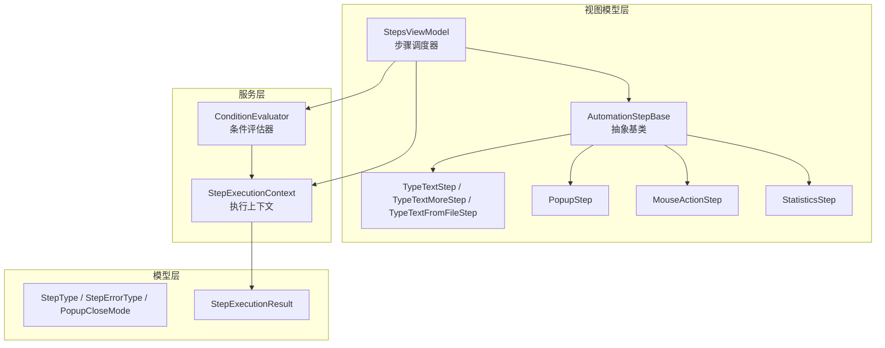
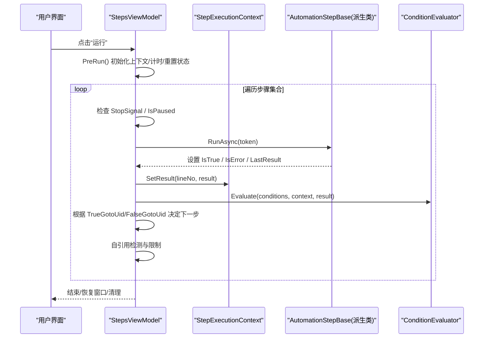
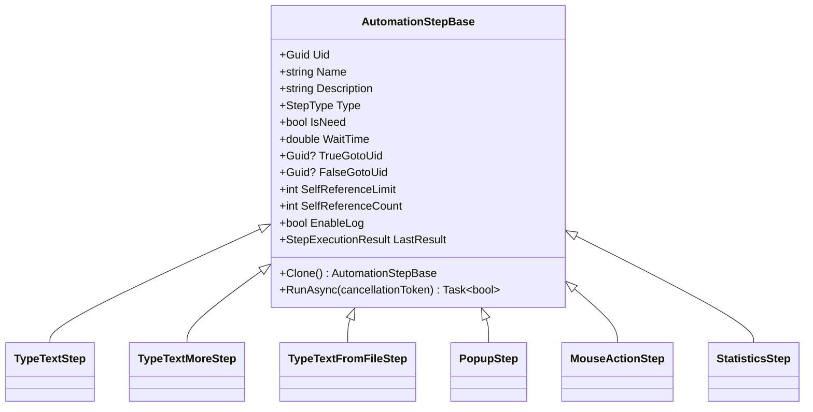
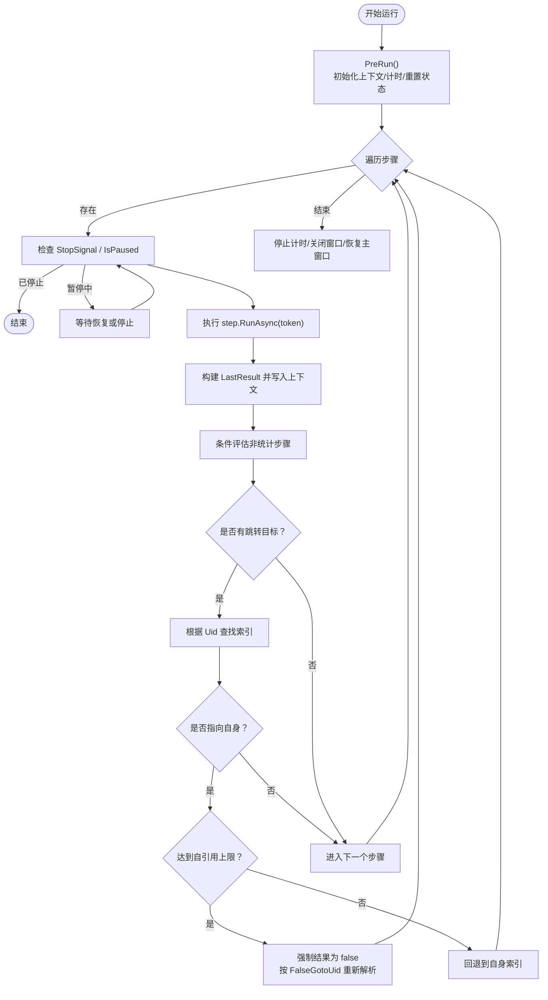
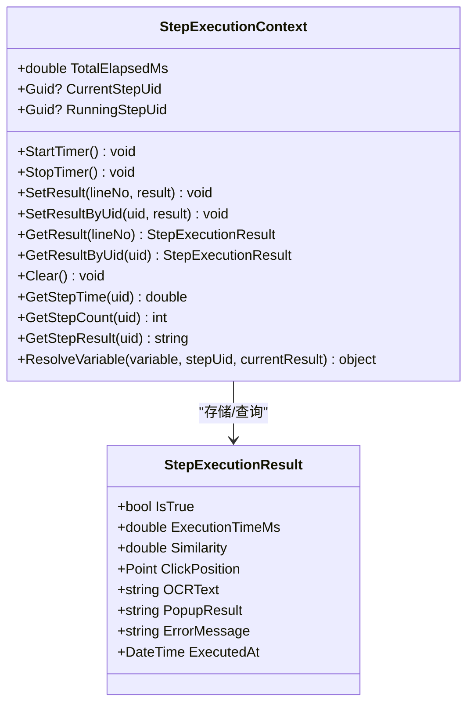
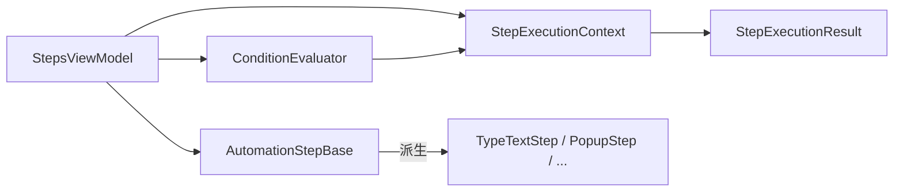

# 步骤执行引擎

<cite>
**本文引用的文件**   
- [AutomationStep.cs](file://ShaoLu/Viewmodels/AutomationStep.cs)
- [StepsViewModel.cs](file://ShaoLu/Viewmodels/StepsViewModel.cs)
- [StepExecutionContext.cs](file://ShaoLu/Services/StepExecutionContext.cs)
- [AutomationStepModel.cs](file://ShaoLu/Models/AutomationStepModel.cs)
- [StepExecutionResult.cs](file://ShaoLu/Models/StepExecutionResult.cs)
- [ConditionEvaluator.cs](file://ShaoLu/Services/ConditionEvaluator.cs)
- [MouseActionStep.cs](file://ShaoLu/Viewmodels/MouseActionStep.cs)
- [StatisticsStep.cs](file://ShaoLu/Viewmodels/StatisticsStep.cs)
- [AutomationStepTests.cs](file://NUnitTest/AutomationStepTests.cs)
- [StepExecutionContextTests.cs](file://NUnitTest/StepExecutionContextTests.cs)
</cite>

## 目录
1. [简介](#简介)
2. [项目结构](#项目结构)
3. [核心组件](#核心组件)
4. [架构总览](#架构总览)
5. [详细组件分析](#详细组件分析)
6. [依赖关系分析](#依赖关系分析)
7. [性能考量](#性能考量)
8. [故障排查指南](#故障排查指南)
9. [结论](#结论)
10. [附录：扩展新步骤类型示例](#附录扩展新步骤类型示例)

## 简介
本技术文档围绕 ShaoLu 的步骤执行引擎展开，重点解析以下方面：
- AutomationStepBase 基类的设计模式与抽象方法（RunAsync、Clone）及生命周期管理
- StepsViewModel 如何协调多步骤执行流程（调度、错误处理、暂停/继续机制）
- StepExecutionContext 在执行过程中的作用（状态管理、上下文传递、异常处理）
- 条件评估与统计模块的集成方式
- 扩展新步骤类型的实践方法与复杂业务逻辑处理建议

## 项目结构
步骤执行引擎的核心代码分布在 Viewmodels、Services、Models 三个层次：
- Viewmodels：步骤定义与执行编排（AutomationStepBase 及其派生类、StepsViewModel）
- Services：执行上下文与条件评估（StepExecutionContext、ConditionEvaluator）
- Models：枚举与结果模型（StepType、StepErrorType、PopupCloseMode、StepExecutionResult）

图表来源
- [AutomationStep.cs:25-296](file://ShaoLu/Viewmodels/AutomationStep.cs#L25-L296)
- [StepsViewModel.cs:20-146](file://ShaoLu/Viewmodels/StepsViewModel.cs#L20-L146)
- [StepExecutionContext.cs:11-82](file://ShaoLu/Services/StepExecutionContext.cs#L11-L82)
- [ConditionEvaluator.cs:11-51](file://ShaoLu/Services/ConditionEvaluator.cs#L11-L51)
- [AutomationStepModel.cs:9-56](file://ShaoLu/Models/AutomationStepModel.cs#L9-L56)
- [StepExecutionResult.cs:8-49](file://ShaoLu/Models/StepExecutionResult.cs#L8-L49)

章节来源
- [AutomationStep.cs:25-296](file://ShaoLu/Viewmodels/AutomationStep.cs#L25-L296)
- [StepsViewModel.cs:20-146](file://ShaoLu/Viewmodels/StepsViewModel.cs#L20-L146)
- [StepExecutionContext.cs:11-82](file://ShaoLu/Services/StepExecutionContext.cs#L11-L82)
- [ConditionEvaluator.cs:11-51](file://ShaoLu/Services/ConditionEvaluator.cs#L11-L51)
- [AutomationStepModel.cs:9-56](file://ShaoLu/Models/AutomationStepModel.cs#L9-L56)
- [StepExecutionResult.cs:8-49](file://ShaoLu/Models/StepExecutionResult.cs#L8-L49)

## 核心组件
- AutomationStepBase：所有步骤的抽象基类，提供通用属性（Uid、Name、Description、Type、IsNeed、WaitTime、TrueGotoUid、FalseGotoUid、Conditions、EnableLog、SelfReferenceLimit、SelfReferenceCount、LastResult 等），并定义两个关键抽象方法：
  - RunAsync(CancellationToken)：异步执行步骤逻辑
  - Clone()：深拷贝步骤实例
- StepsViewModel：步骤集合与执行编排器，负责添加/删除/移动步骤、复制/粘贴、运行/停止/暂停、错误处理、跳转控制、自引用限制、弹窗关闭时机控制、统计更新、日志记录等。
- StepExecutionContext：单例执行上下文，维护每个步骤的执行结果（按行号与 Uid）、执行次数、当前/正在执行的步骤 Uid、总计时器等；并提供变量解析能力供条件评估使用。
- ConditionEvaluator：根据条件规则行列表与执行上下文计算最终布尔值，支持常量、自身/其他步骤变量、文本提取、正则匹配、数值/字符串比较等。
- 具体步骤实现：如 TypeTextStep、TypeTextMoreStep、TypeTextFromFileStep、PopupStep、MouseActionStep、StatisticsStep 等，均继承自 AutomationStepBase 并实现 RunAsync 与 Clone。

章节来源
- [AutomationStep.cs:25-296](file://ShaoLu/Viewmodels/AutomationStep.cs#L25-L296)
- [StepsViewModel.cs:442-694](file://ShaoLu/Viewmodels/StepsViewModel.cs#L442-L694)
- [StepExecutionContext.cs:11-163](file://ShaoLu/Services/StepExecutionContext.cs#L11-L163)
- [ConditionEvaluator.cs:11-294](file://ShaoLu/Services/ConditionEvaluator.cs#L11-L294)
- [MouseActionStep.cs:29-162](file://ShaoLu/Viewmodels/MouseActionStep.cs#L29-L162)
- [StatisticsStep.cs:209-459](file://ShaoLu/Viewmodels/StatisticsStep.cs#L209-L459)

## 架构总览
步骤执行引擎采用“基类抽象 + 具体步骤实现 + 统一调度器”的分层设计：
- 基类封装通用行为与属性，降低重复代码
- 具体步骤专注业务逻辑，通过 RunAsync 暴露异步执行接口
- 调度器集中管理执行流、错误处理、暂停/继续、跳转与统计
- 上下文与服务解耦，便于扩展与测试

图表来源
- [StepsViewModel.cs:493-694](file://ShaoLu/Viewmodels/StepsViewModel.cs#L493-L694)
- [StepExecutionContext.cs:39-82](file://ShaoLu/Services/StepExecutionContext.cs#L39-L82)
- [ConditionEvaluator.cs:23-51](file://ShaoLu/Services/ConditionEvaluator.cs#L23-L51)
- [AutomationStep.cs:288-296](file://ShaoLu/Viewmodels/AutomationStep.cs#L288-L296)

## 详细组件分析

### AutomationStepBase 基类
- 设计要点
  - 基于 ObservableObject 的属性变更通知，便于 UI 绑定
  - 统一的 Uid 管理，确保步骤唯一性，支持 JSON 反序列化恢复
  - 条件判断支持自定义规则行，默认模式与自定义模式分离
  - 自引用限制（SelfReferenceLimit/SelfReferenceCount）防止死循环
  - 日志开关（EnableLog）与最近执行结果（LastResult）
- 抽象方法
  - RunAsync(CancellationToken)：各步骤实现其业务逻辑，返回是否成功
  - Clone()：深拷贝步骤，用于复制/粘贴功能
- 生命周期
  - 构造时分配默认值与 Uid
  - 运行时由 StepsViewModel 调用 RunAsync，并在异常时设置 IsError/ErrorMessage/ErrorType
  - 每次运行前重置 SelfReferenceCount、ErrorType、LastResult 等状态

图表来源
- [AutomationStep.cs:25-296](file://ShaoLu/Viewmodels/AutomationStep.cs#L25-L296)
- [AutomationStep.cs:300-365](file://ShaoLu/Viewmodels/AutomationStep.cs#L300-L365)
- [AutomationStep.cs:367-516](file://ShaoLu/Viewmodels/AutomationStep.cs#L367-L516)
- [AutomationStep.cs:518-680](file://ShaoLu/Viewmodels/AutomationStep.cs#L518-L680)
- [MouseActionStep.cs:29-162](file://ShaoLu/Viewmodels/MouseActionStep.cs#L29-L162)
- [StatisticsStep.cs:209-459](file://ShaoLu/Viewmodels/StatisticsStep.cs#L209-L459)

章节来源
- [AutomationStep.cs:25-296](file://ShaoLu/Viewmodels/AutomationStep.cs#L25-L296)
- [AutomationStep.cs:300-365](file://ShaoLu/Viewmodels/AutomationStep.cs#L300-L365)
- [AutomationStep.cs:367-516](file://ShaoLu/Viewmodels/AutomationStep.cs#L367-L516)
- [AutomationStep.cs:518-680](file://ShaoLu/Viewmodels/AutomationStep.cs#L518-L680)
- [MouseActionStep.cs:29-162](file://ShaoLu/Viewmodels/MouseActionStep.cs#L29-L162)
- [StatisticsStep.cs:209-459](file://ShaoLu/Viewmodels/StatisticsStep.cs#L209-L459)

### StepsViewModel 执行编排
- 职责
  - 维护步骤集合与选中项
  - 提供运行/停止/暂停命令
  - 在运行前初始化上下文、计时器、重置步骤状态
  - 逐条执行步骤，捕获异常并设置错误信息
  - 根据 TrueGotoUid/FalseGotoUid 进行跳转，处理自引用限制
  - 更新统计步骤的条件计数
  - 支持弹窗 StepReached 模式自动关闭
- 暂停/继续机制
  - IsPaused 标志位，在每个步骤开始前轮询等待，直到恢复或停止
- 错误处理
  - 捕获 OperationCanceledException 表示用户取消
  - 其他异常推断 ErrorType，可选择弹出错误提示
  - 若未设置 FalseGotoUid，则终止流程；否则将当前步骤标记为失败并继续

图表来源
- [StepsViewModel.cs:493-694](file://ShaoLu/Viewmodels/StepsViewModel.cs#L493-L694)
- [StepsViewModel.cs:699-710](file://ShaoLu/Viewmodels/StepsViewModel.cs#L699-L710)
- [StepsViewModel.cs:715-728](file://ShaoLu/Viewmodels/StepsViewModel.cs#L715-L728)

章节来源
- [StepsViewModel.cs:442-694](file://ShaoLu/Viewmodels/StepsViewModel.cs#L442-L694)
- [StepsViewModel.cs:699-710](file://ShaoLu/Viewmodels/StepsViewModel.cs#L699-L710)
- [StepsViewModel.cs:715-728](file://ShaoLu/Viewmodels/StepsViewModel.cs#L715-L728)

### StepExecutionContext 执行上下文
- 数据模型
  - 按行号与 Uid 存储 StepExecutionResult
  - 维护执行次数字典
  - 总计时 Stopwatch
  - CurrentStepUid（刚刚执行完成的步骤 Uid）、RunningStepUid（当前正在执行的步骤 Uid）
- 变量解析
  - ResolveVariable 支持常量、自身变量、其他步骤变量、Step_Triggered 特殊变量
- 典型用法
  - StepsViewModel 在每个步骤执行后调用 SetResult/SetResultByUid
  - ConditionEvaluator 通过 context.ResolveVariable 获取变量值

图表来源
- [StepExecutionContext.cs:11-163](file://ShaoLu/Services/StepExecutionContext.cs#L11-L163)
- [StepExecutionResult.cs:8-49](file://ShaoLu/Models/StepExecutionResult.cs#L8-L49)

章节来源
- [StepExecutionContext.cs:11-163](file://ShaoLu/Services/StepExecutionContext.cs#L11-L163)
- [StepExecutionResult.cs:8-49](file://ShaoLu/Models/StepExecutionResult.cs#L8-L49)

### 条件评估器 ConditionEvaluator
- 功能
  - 对条件规则行列表进行 AND/OR 组合评估
  - 支持常量、自身/其他步骤变量、文本提取、正则匹配、数值/字符串比较
- 文本提取
  - 支持整行、从子串开始读取指定长度、从开头/末尾截取
- 健壮性
  - 异常捕获与警告日志，避免条件评估失败影响整体流程

章节来源
- [ConditionEvaluator.cs:11-294](file://ShaoLu/Services/ConditionEvaluator.cs#L11-L294)

### 鼠标操作步骤 MouseActionStep
- 功能
  - 支持绝对坐标与当前位置两种位置模式
  - 执行鼠标动作序列（移动、点击、拖拽等）
- 执行流程
  - 等待 WaitTime
  - 移动到目标位置（绝对坐标需 DPI 转换）
  - 执行动作序列
  - 设置 IsTrue=true，记录 LastResult

章节来源
- [MouseActionStep.cs:29-162](file://ShaoLu/Viewmodels/MouseActionStep.cs#L29-L162)

### 统计步骤 StatisticsStep
- 功能
  - 打开悬浮窗展示运行时统计（总耗时、步骤耗时/次数/结果、条件计数、当前步骤）
  - 支持自定义统计项与范围（全部/仅记录日志/自选步骤）
- 执行流程
  - 等待 WaitTime
  - 在 UI 线程检查/创建统计窗口（同 UID 全局仅一个窗口）
  - 设置 IsTrue=success，IsError=!success

章节来源
- [StatisticsStep.cs:209-459](file://ShaoLu/Viewmodels/StatisticsStep.cs#L209-L459)

## 依赖关系分析
- 低耦合高内聚
  - AutomationStepBase 仅依赖基础库与 NLog，不直接依赖 UI
  - StepsViewModel 依赖 SingletonLocator 获取服务，但通过接口隔离
  - StepExecutionContext 与 ConditionEvaluator 纯服务层，无 UI 依赖
- 外部依赖
  - Autogui：底层自动化操作（输入、鼠标、截图、OCR）
  - WindowAsyncPopup：异步弹窗交互
  - ExcelPackage：Excel 文件读取
- 潜在循环依赖
  - 无直接循环依赖；步骤间通过 Uid 间接引用，避免强耦合

图表来源
- [StepsViewModel.cs:20-146](file://ShaoLu/Viewmodels/StepsViewModel.cs#L20-L146)
- [AutomationStep.cs:25-296](file://ShaoLu/Viewmodels/AutomationStep.cs#L25-L296)
- [StepExecutionContext.cs:11-82](file://ShaoLu/Services/StepExecutionContext.cs#L11-L82)
- [ConditionEvaluator.cs:11-51](file://ShaoLu/Services/ConditionEvaluator.cs#L11-L51)

章节来源
- [StepsViewModel.cs:20-146](file://ShaoLu/Viewmodels/StepsViewModel.cs#L20-L146)
- [AutomationStep.cs:25-296](file://ShaoLu/Viewmodels/AutomationStep.cs#L25-L296)
- [StepExecutionContext.cs:11-82](file://ShaoLu/Services/StepExecutionContext.cs#L11-L82)
- [ConditionEvaluator.cs:11-51](file://ShaoLu/Services/ConditionEvaluator.cs#L11-L51)

## 性能考量
- 异步执行
  - 所有步骤 RunAsync 使用 CancellationToken 支持取消
  - 耗时操作放入 Task.Run，避免阻塞 UI
- 暂停机制
  - 每步开始前轮询 IsPaused，最小化额外开销
- 统计与日志
  - 仅在启用日志时写入，减少 IO 压力
  - 统计窗口按需创建，同 UID 复用
- 自引用限制
  - 防止死循环导致的 CPU 占用飙升

[本节为通用指导，无需特定文件引用]

## 故障排查指南
- 常见问题
  - 步骤执行失败：检查 IsError/ErrorMessage/ErrorType，确认 FalseGotoUid 是否正确设置
  - 自引用限制触发：查看 SelfReferenceLimit/SelfReferenceCount，调整限制或修复跳转逻辑
  - 条件评估失败：检查 ConditionEvaluator 的变量解析与文本提取配置
  - 弹窗未关闭：确认 CloseMode 与 CloseOnStepUid 设置，检查 ActivePopupWindow 是否为空
- 调试建议
  - 启用 EnableLog，查看 ExecutionLogService 输出
  - 使用 StepExecutionContext.GetStepResult/GetStepTime/GetStepCount 辅助定位
  - 单元测试覆盖 Clone 与默认属性，确保对象一致性

章节来源
- [StepsViewModel.cs:597-622](file://ShaoLu/Viewmodels/StepsViewModel.cs#L597-L622)
- [StepsViewModel.cs:699-710](file://ShaoLu/Viewmodels/StepsViewModel.cs#L699-L710)
- [StepExecutionContext.cs:84-103](file://ShaoLu/Services/StepExecutionContext.cs#L84-L103)
- [AutomationStepTests.cs:59-116](file://NUnitTest/AutomationStepTests.cs#L59-L116)
- [StepExecutionContextTests.cs:22-93](file://NUnitTest/StepExecutionContextTests.cs#L22-L93)

## 结论
ShaoLu 的步骤执行引擎通过清晰的基类抽象、统一的调度器与灵活的上下文机制，实现了可扩展、可测试、高性能的自动化流程编排。开发者只需继承 AutomationStepBase 并实现 RunAsync/Clone，即可快速扩展新步骤类型；借助 StepExecutionContext 与 ConditionEvaluator，可实现复杂的条件分支与统计需求。

[本节为总结，无需特定文件引用]

## 附录：扩展新步骤类型示例
- 基本步骤
  - 继承 AutomationStepBase
  - 在构造函数中设置 Type
  - 实现 Clone() 深拷贝所有相关属性
  - 实现 RunAsync(CancellationToken) 执行业务逻辑，设置 IsTrue/IsError/ErrorType/LastResult
- 复杂业务逻辑
  - 使用 Autogui 进行底层操作（输入、鼠标、截图、OCR）
  - 通过 StepExecutionContext 读写共享状态（如点击位置、OCR 文本）
  - 使用 ConditionEvaluator 进行条件判断，结合上下文变量
  - 如需弹窗交互，参考 PopupStep 的实现模式
- 最佳实践
  - 合理设置 WaitTime，避免频繁 UI 操作
  - 正确处理异常，设置明确的 ErrorType
  - 在 Clone 中复制所有可变状态，确保复制独立性
  - 使用单元测试验证默认属性与克隆行为

章节来源
- [AutomationStep.cs:288-296](file://ShaoLu/Viewmodels/AutomationStep.cs#L288-L296)
- [MouseActionStep.cs:112-144](file://ShaoLu/Viewmodels/MouseActionStep.cs#L112-L144)
- [StatisticsStep.cs:414-456](file://ShaoLu/Viewmodels/StatisticsStep.cs#L414-L456)
- [AutomationStepTests.cs:59-116](file://NUnitTest/AutomationStepTests.cs#L59-L116)