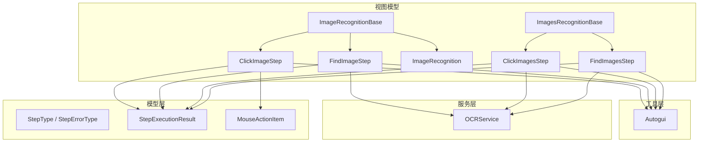
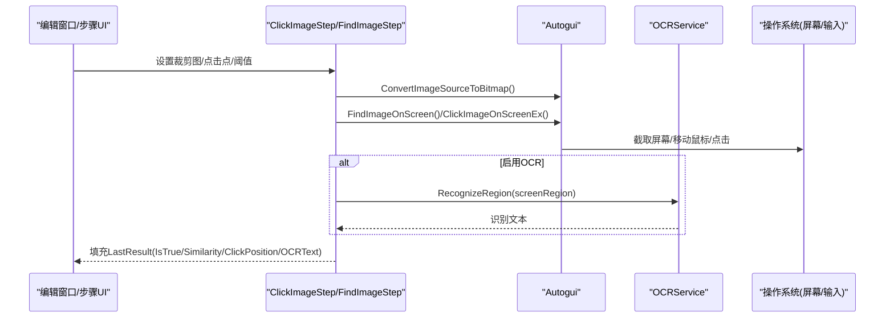
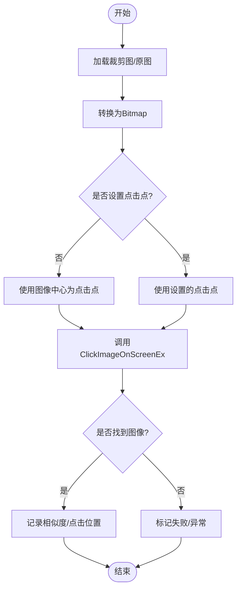
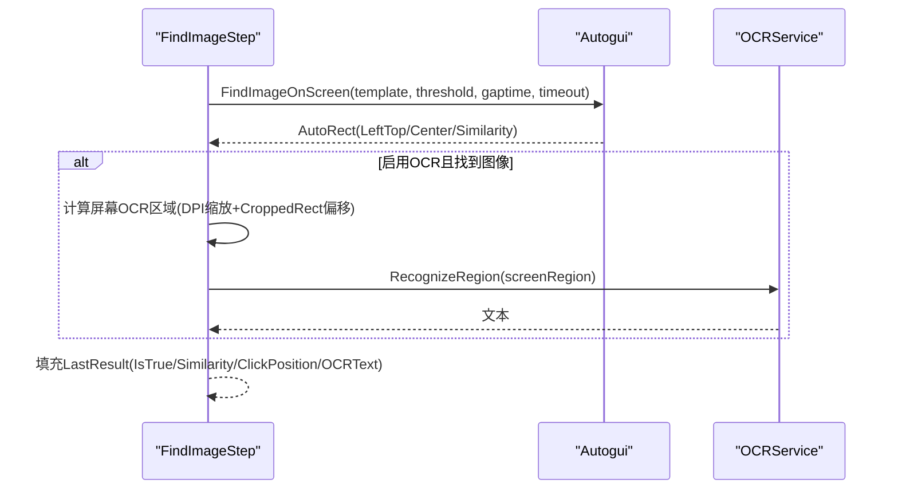
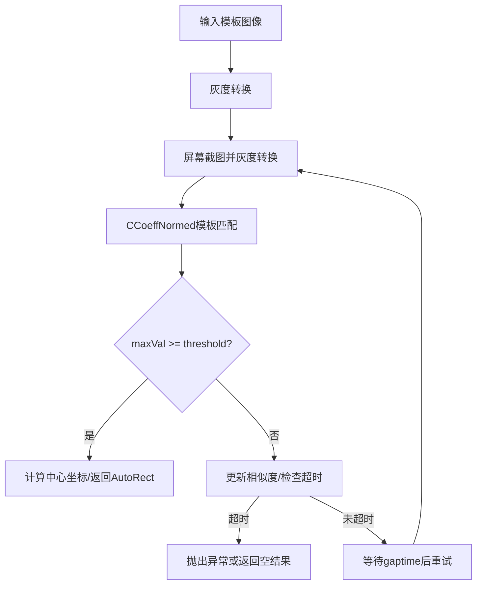
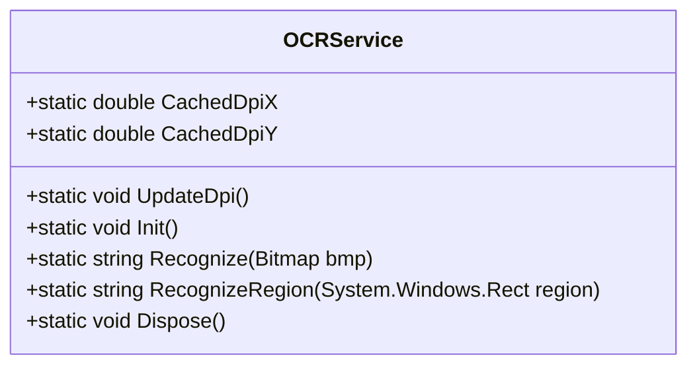
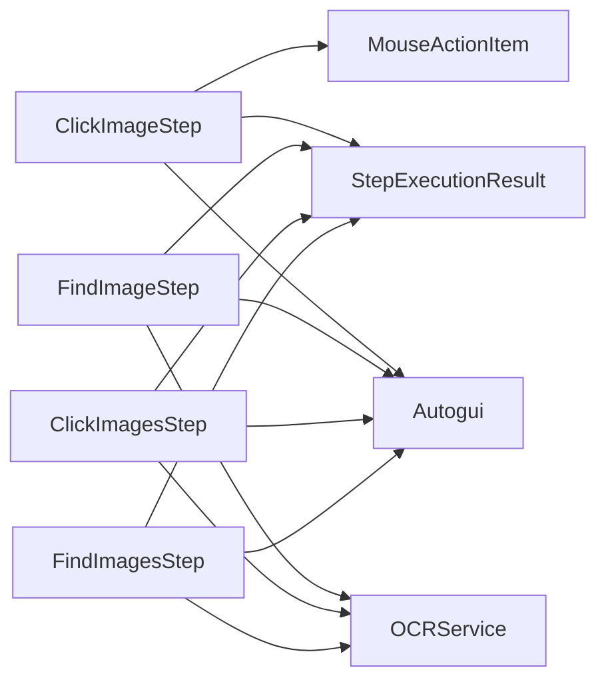

# 图像识别步骤

<cite>
**本文引用的文件**   
- [ImageRecognition.cs](file://ShaoLu/Viewmodels/ImageRecognition.cs)
- [ImagesRecognition.cs](file://ShaoLu/Viewmodels/ImagesRecognition.cs)
- [Autogui.cs](file://ShaoLu/Utils/Autogui.cs)
- [OCRService.cs](file://ShaoLu/Services/OCRService.cs)
- [AutomationStepModel.cs](file://ShaoLu/Models/AutomationStepModel.cs)
- [StepExecutionResult.cs](file://ShaoLu/Models/StepExecutionResult.cs)
- [MouseActionItem.cs](file://ShaoLu/Models/MouseActionItem.cs)
- [EditImageViewModel.cs](file://ShaoLu/Viewmodels/EditImageViewModel.cs)
- [WindowEditImage.xaml](file://ShaoLu/Views/WindowEditImage.xaml)
</cite>

## 目录
1. [简介](#简介)
2. [项目结构](#项目结构)
3. [核心组件](#核心组件)
4. [架构总览](#架构总览)
5. [详细组件分析](#详细组件分析)
6. [依赖关系分析](#依赖关系分析)
7. [性能与优化建议](#性能与优化建议)
8. [故障排查指南](#故障排查指南)
9. [结论](#结论)
10. [附录：参数配置与示例路径](#附录参数配置与示例路径)

## 简介
本技术文档聚焦 ShaoLu 的图像识别步骤类型，系统性说明 ClickImageStep、FindImageStep、ClickImagesStep、FindImagesStep 的功能、参数与执行流程；深入解析模板匹配算法的配置项（相似度阈值、搜索区域、多目标识别等）；并阐述 OCR 文字识别的集成方式（TesseractOCR 初始化、多语言支持、屏幕区域截图与 DPI 缩放）。同时提供可操作的配置要点与优化策略，帮助读者提升识别准确率与运行性能。

## 项目结构
图像识别相关代码主要分布在以下模块：
- Viewmodels：定义各类图像识别步骤及其执行逻辑
- Utils：封装底层自动化与图像处理能力（OpenCV 模板匹配、鼠标键盘模拟、图像转换）
- Services：OCR 服务封装（TesseractOCR 引擎、DPI 缓存、屏幕截图识别）
- Models：步骤类型枚举、错误类型、执行结果模型、鼠标动作项等

图表来源
- [ImageRecognition.cs:21-602](file://ShaoLu/Viewmodels/ImageRecognition.cs#L21-L602)
- [ImagesRecognition.cs:15-245](file://ShaoLu/Viewmodels/ImagesRecognition.cs#L15-L245)
- [Autogui.cs:18-656](file://ShaoLu/Utils/Autogui.cs#L18-L656)
- [OCRService.cs:12-159](file://ShaoLu/Services/OCRService.cs#L12-L159)
- [AutomationStepModel.cs:9-43](file://ShaoLu/Models/AutomationStepModel.cs#L9-L43)
- [StepExecutionResult.cs:8-51](file://ShaoLu/Models/StepExecutionResult.cs#L8-L51)
- [MouseActionItem.cs:1-57](file://ShaoLu/Models/MouseActionItem.cs#L1-L57)

章节来源
- [ImageRecognition.cs:21-602](file://ShaoLu/Viewmodels/ImageRecognition.cs#L21-L602)
- [ImagesRecognition.cs:15-245](file://ShaoLu/Viewmodels/ImagesRecognition.cs#L15-L245)
- [Autogui.cs:18-656](file://ShaoLu/Utils/Autogui.cs#L18-L656)
- [OCRService.cs:12-159](file://ShaoLu/Services/OCRService.cs#L12-L159)
- [AutomationStepModel.cs:9-43](file://ShaoLu/Models/AutomationStepModel.cs#L9-L43)
- [StepExecutionResult.cs:8-51](file://ShaoLu/Models/StepExecutionResult.cs#L8-L51)
- [MouseActionItem.cs:1-57](file://ShaoLu/Models/MouseActionItem.cs#L1-L57)

## 核心组件
- ImageRecognitionBase：图像识别步骤基类，负责图片加载、裁剪图保存、相似度阈值、点击点集合、编辑窗口交互等
- ClickImageStep：单图点击步骤，支持多次点击、点击间隔、点击后动作序列、超时控制
- FindImageStep：单图查找步骤，支持相似度阈值、轮询间隔、超时、可选 OCR 区域识别
- ImagesRecognitionBase：多图识别步骤基类，维护多个 ImageRecognition 实例，支持逐个或批量处理
- ClickImagesStep：多图点击步骤，对每个图像逐一进行模板匹配与点击
- FindImagesStep：多图查找步骤，按顺序循环查找多个模板，返回首个匹配结果

章节来源
- [ImageRecognition.cs:21-602](file://ShaoLu/Viewmodels/ImageRecognition.cs#L21-L602)
- [ImagesRecognition.cs:15-245](file://ShaoLu/Viewmodels/ImagesRecognition.cs#L15-L245)

## 架构总览
下图展示了从 UI 到执行层的调用链：用户在编辑窗口设置裁剪图与点击点，步骤运行时通过 Autogui 进行模板匹配与鼠标操作，FindImageStep 可选择启用 OCR 区域识别，最终将执行结果写入 StepExecutionResult。

图表来源
- [ImageRecognition.cs:399-436](file://ShaoLu/Viewmodels/ImageRecognition.cs#L399-L436)
- [ImageRecognition.cs:535-599](file://ShaoLu/Viewmodels/ImageRecognition.cs#L535-L599)
- [Autogui.cs:256-378](file://ShaoLu/Utils/Autogui.cs#L256-L378)
- [OCRService.cs:114-144](file://ShaoLu/Services/OCRService.cs#L114-L144)

## 详细组件分析

### ClickImageStep（单图点击）
- 功能：在屏幕上找到模板图像，移动到指定点击点并执行点击；支持多次点击、点击间隔、点击后动作序列、等待时间与超时控制
- 关键参数
  - SimilarityThreshold：模板匹配相似度阈值（0~1），默认约 0.85
  - Clicks：点击次数
  - ClickGap：每次点击之间的间隔（秒）
  - NextClickTime：不同点击点之间的间隔（秒）
  - Timeout：查找与点击的总超时时间（秒）
  - MouseActions：点击后顺序执行的鼠标动作列表（左键/右键/双击/滚动等）
- 执行流程
  - 将 WPF ImageSource 转换为 Bitmap
  - 若未设置点击点，则使用图像中心作为默认点击位置
  - 调用 Autogui.ClickImageOnScreenEx 进行查找与点击
  - 记录 LastResult（IsTrue、Similarity、ClickPosition）

图表来源
- [ImageRecognition.cs:399-436](file://ShaoLu/Viewmodels/ImageRecognition.cs#L399-L436)
- [Autogui.cs:256-378](file://ShaoLu/Utils/Autogui.cs#L256-L378)

章节来源
- [ImageRecognition.cs:329-436](file://ShaoLu/Viewmodels/ImageRecognition.cs#L329-L436)
- [Autogui.cs:256-378](file://ShaoLu/Utils/Autogui.cs#L256-L378)
- [MouseActionItem.cs:1-57](file://ShaoLu/Models/MouseActionItem.cs#L1-L57)

### FindImageStep（单图查找+可选OCR）
- 功能：在屏幕上查找模板图像，返回匹配区域与相似度；可选在找到图像后对指定区域进行 OCR 文字识别
- 关键参数
  - SimilarityThreshold：模板匹配相似度阈值
  - GapTime：轮询间隔（秒）
  - Timeout：查找超时（秒）
  - EnableOCR：是否启用 OCR
  - OCRRect：OCR 区域（相对于原图的像素坐标）
- 执行流程
  - 将 WPF ImageSource 转换为 Bitmap
  - 调用 Autogui.FindImageOnScreen 进行模板匹配
  - 若启用 OCR 且找到图像，计算屏幕区域（考虑 DPI 缩放与 CroppedRect 偏移），调用 OCRService.RecognizeRegion
  - 记录 LastResult（IsTrue、Similarity、ClickPosition、OCRText）

图表来源
- [ImageRecognition.cs:535-599](file://ShaoLu/Viewmodels/ImageRecognition.cs#L535-L599)
- [Autogui.cs:59-122](file://ShaoLu/Utils/Autogui.cs#L59-L122)
- [OCRService.cs:114-144](file://ShaoLu/Services/OCRService.cs#L114-L144)

章节来源
- [ImageRecognition.cs:439-600](file://ShaoLu/Viewmodels/ImageRecognition.cs#L439-L600)
- [Autogui.cs:59-122](file://ShaoLu/Utils/Autogui.cs#L59-L122)
- [OCRService.cs:114-144](file://ShaoLu/Services/OCRService.cs#L114-L144)

### ClickImagesStep（多图点击）
- 功能：对多个模板图像逐一进行模板匹配与点击，支持 OneByOne 模式（逐个处理）
- 关键参数
  - Images：图像识别实例集合（每个包含裁剪图、点击点、阈值）
  - Clicks、ClickGap、NextClickTime、Timeout：同 ClickImageStep
- 执行流程
  - 遍历 Images，依次调用 Autogui.ClickImageOnScreenEx
  - 记录最后一次匹配的相似度与点击位置
  - 支持调试覆盖显示点击位置

章节来源
- [ImagesRecognition.cs:71-168](file://ShaoLu/Viewmodels/ImagesRecognition.cs#L71-L168)
- [Autogui.cs:256-378](file://ShaoLu/Utils/Autogui.cs#L256-L378)

### FindImagesStep（多图查找）
- 功能：按顺序循环查找多个模板，直到全部匹配或超时；返回第一个匹配结果用于后续判断
- 关键参数
  - Images：图像识别实例集合（每个包含裁剪图、阈值）
  - GapTime、Timeout：轮询间隔与超时
- 执行流程
  - 构建 AutoguiImage 列表（含 Bitmap、Position、Threshold）
  - 调用 Autogui.FindImagesOnScreen 进行循环查找
  - 记录 IsTrue、Similarity、ClickPosition

章节来源
- [ImagesRecognition.cs:170-242](file://ShaoLu/Viewmodels/ImagesRecognition.cs#L170-L242)
- [Autogui.cs:124-171](file://ShaoLu/Utils/Autogui.cs#L124-L171)

### 模板匹配算法与参数配置
- 算法实现：基于 OpenCV 的 CCoeffNormed 归一化相关系数匹配，获取最大相似度及位置
- 关键参数
  - threshold：相似度阈值，默认约 0.8~0.85；越高越严格，越低越宽松
  - gaptime：未找到时的轮询间隔（秒）
  - timeout：查找超时（秒）
- 多目标识别：FindImagesOnScreen 支持多个模板的顺序查找，内部循环调用 FindImageOnScreen，直至全部匹配或超时

图表来源
- [Autogui.cs:59-122](file://ShaoLu/Utils/Autogui.cs#L59-L122)
- [Autogui.cs:124-171](file://ShaoLu/Utils/Autogui.cs#L124-L171)

章节来源
- [Autogui.cs:59-122](file://ShaoLu/Utils/Autogui.cs#L59-L122)
- [Autogui.cs:124-171](file://ShaoLu/Utils/Autogui.cs#L124-L171)

### OCR 文字识别集成
- 引擎初始化：懒加载 TesseractOCR Engine，数据目录为 tessdata，默认语言包为 chi_sim+eng（简体中文+英文）
- DPI 缓存：应用启动时在主线程更新 DPI 缩放因子，避免后台线程访问 WPF 对象
- 区域识别：根据 WPF Rect（逻辑像素）乘以 DPI 得到物理像素，截取屏幕区域后进行 OCR
- 多语言支持：可通过修改 Init 中的语言包字符串扩展更多语言

图表来源
- [OCRService.cs:12-159](file://ShaoLu/Services/OCRService.cs#L12-L159)

章节来源
- [OCRService.cs:12-159](file://ShaoLu/Services/OCRService.cs#L12-L159)

### 编辑窗口与点击点/OCR区域设置
- 编辑窗口支持裁剪图设置、点击点拖拽、OCR 区域选择
- 点击点以 ClickThumb 形式管理，OCR 区域以 Rect 存储（相对于原图像素坐标）
- 保存时将裁剪图、点击点、OCR 区域回传到步骤模型

章节来源
- [EditImageViewModel.cs:46-140](file://ShaoLu/Viewmodels/EditImageViewModel.cs#L46-L140)
- [WindowEditImage.xaml:24-46](file://ShaoLu/Views/WindowEditImage.xaml#L24-L46)

## 依赖关系分析
- 步骤模型依赖 Autogui 进行图像转换、模板匹配与鼠标操作
- FindImageStep 依赖 OCRService 进行文字识别
- 所有步骤均输出 StepExecutionResult 供上层消费
- 鼠标动作由 MouseActionItem 描述，支持多种动作类型与间隔

图表来源
- [ImageRecognition.cs:329-600](file://ShaoLu/Viewmodels/ImageRecognition.cs#L329-L600)
- [ImagesRecognition.cs:71-242](file://ShaoLu/Viewmodels/ImagesRecognition.cs#L71-L242)
- [Autogui.cs:18-656](file://ShaoLu/Utils/Autogui.cs#L18-L656)
- [OCRService.cs:12-159](file://ShaoLu/Services/OCRService.cs#L12-L159)
- [StepExecutionResult.cs:8-51](file://ShaoLu/Models/StepExecutionResult.cs#L8-L51)
- [MouseActionItem.cs:1-57](file://ShaoLu/Models/MouseActionItem.cs#L1-L57)

章节来源
- [ImageRecognition.cs:329-600](file://ShaoLu/Viewmodels/ImageRecognition.cs#L329-L600)
- [ImagesRecognition.cs:71-242](file://ShaoLu/Viewmodels/ImagesRecognition.cs#L71-L242)
- [Autogui.cs:18-656](file://ShaoLu/Utils/Autogui.cs#L18-L656)
- [OCRService.cs:12-159](file://ShaoLu/Services/OCRService.cs#L12-L159)
- [StepExecutionResult.cs:8-51](file://ShaoLu/Models/StepExecutionResult.cs#L8-L51)
- [MouseActionItem.cs:1-57](file://ShaoLu/Models/MouseActionItem.cs#L1-L57)

## 性能与优化建议
- 模板匹配性能
  - 合理设置 threshold：过高导致频繁失败，过低增加误匹配；建议从 0.85 起调优
  - 降低 gaptime：缩短轮询间隔可提高响应速度，但会增加 CPU 占用；建议在 0.1~0.3 之间平衡
  - 控制 timeout：避免过长等待影响整体流程；根据业务场景设定合理上限
- 图像预处理
  - 确保裁剪图清晰、对比度良好，减少背景干扰
  - 尽量使用 PNG 无损格式保存裁剪图，避免压缩失真
- OCR 性能
  - 仅在必要时启用 OCR，避免不必要的屏幕截图与识别开销
  - 精确设置 OCRRect，缩小识别区域以提升速度与准确率
  - 确保 tessdata 语言包完整，必要时仅加载所需语言以减少内存占用
- 多线程与资源
  - 模板匹配与 OCR 均在后台线程执行，避免阻塞 UI
  - 及时释放 Bitmap 与 OCR 引擎资源，防止内存泄漏

[本节为通用指导，不直接分析具体文件]

## 故障排查指南
- 常见错误类型
  - ImageNotFound：未找到匹配图像
  - ImageLoadFailed：图像加载失败
  - ImageMatchFailed：模板匹配失败
  - OCRError：OCR 识别失败
- 排查要点
  - 检查图像路径与裁剪图是否正确保存
  - 调整相似度阈值与轮询间隔
  - 确认 DPI 缓存已更新，OCR 区域坐标正确
  - 查看日志输出定位异常堆栈

章节来源
- [AutomationStepModel.cs:26-43](file://ShaoLu/Models/AutomationStepModel.cs#L26-L43)
- [StepExecutionResult.cs:8-51](file://ShaoLu/Models/StepExecutionResult.cs#L8-L51)

## 结论
ShaoLu 的图像识别步骤通过清晰的层次结构与模块化设计，实现了灵活的模板匹配与 OCR 集成。ClickImageStep、FindImageStep、ClickImagesStep、FindImagesStep 覆盖了单图与多图场景，支持丰富的参数配置与执行控制。通过合理设置相似度阈值、轮询间隔、超时与 OCR 区域，可在保证准确率的同时提升性能。建议在实际使用中结合业务需求持续调优参数，并充分利用调试覆盖与日志输出进行问题定位。

[本节为总结性内容，不直接分析具体文件]

## 附录：参数配置与示例路径
- ClickImageStep 关键属性与命令
  - SimilarityThreshold、Clicks、ClickGap、NextClickTime、Timeout
  - MouseActions 列表（添加/删除动作）
  - 参考路径：[ImageRecognition.cs:329-436](file://ShaoLu/Viewmodels/ImageRecognition.cs#L329-L436)
- FindImageStep 关键属性
  - SimilarityThreshold、GapTime、Timeout、EnableOCR、OCRRect
  - 参考路径：[ImageRecognition.cs:439-600](file://ShaoLu/Viewmodels/ImageRecognition.cs#L439-L600)
- ClickImagesStep 关键属性
  - Images 集合、Clicks、ClickGap、NextClickTime、Timeout
  - 参考路径：[ImagesRecognition.cs:71-168](file://ShaoLu/Viewmodels/ImagesRecognition.cs#L71-L168)
- FindImagesStep 关键属性
  - Images 集合、GapTime、Timeout
  - 参考路径：[ImagesRecognition.cs:170-242](file://ShaoLu/Viewmodels/ImagesRecognition.cs#L170-L242)
- 模板匹配算法参数
  - threshold、gaptime、timeout
  - 参考路径：[Autogui.cs:59-122](file://ShaoLu/Utils/Autogui.cs#L59-L122)
- OCR 服务配置
  - 语言包路径与语言组合（chi_sim+eng）
  - DPI 缓存更新
  - 参考路径：[OCRService.cs:53-75](file://ShaoLu/Services/OCRService.cs#L53-L75), [OCRService.cs:31-48](file://ShaoLu/Services/OCRService.cs#L31-L48)
- 编辑窗口与点击点/OCR区域设置
  - 点击点拖拽、OCR 区域选择
  - 参考路径：[EditImageViewModel.cs:109-131](file://ShaoLu/Viewmodels/EditImageViewModel.cs#L109-L131), [WindowEditImage.xaml:24-46](file://ShaoLu/Views/WindowEditImage.xaml#L24-L46)

章节来源
- [ImageRecognition.cs:329-600](file://ShaoLu/Viewmodels/ImageRecognition.cs#L329-L600)
- [ImagesRecognition.cs:71-242](file://ShaoLu/Viewmodels/ImagesRecognition.cs#L71-L242)
- [Autogui.cs:59-122](file://ShaoLu/Utils/Autogui.cs#L59-L122)
- [OCRService.cs:31-75](file://ShaoLu/Services/OCRService.cs#L31-L75)
- [EditImageViewModel.cs:109-131](file://ShaoLu/Viewmodels/EditImageViewModel.cs#L109-L131)
- [WindowEditImage.xaml:24-46](file://ShaoLu/Views/WindowEditImage.xaml#L24-L46)