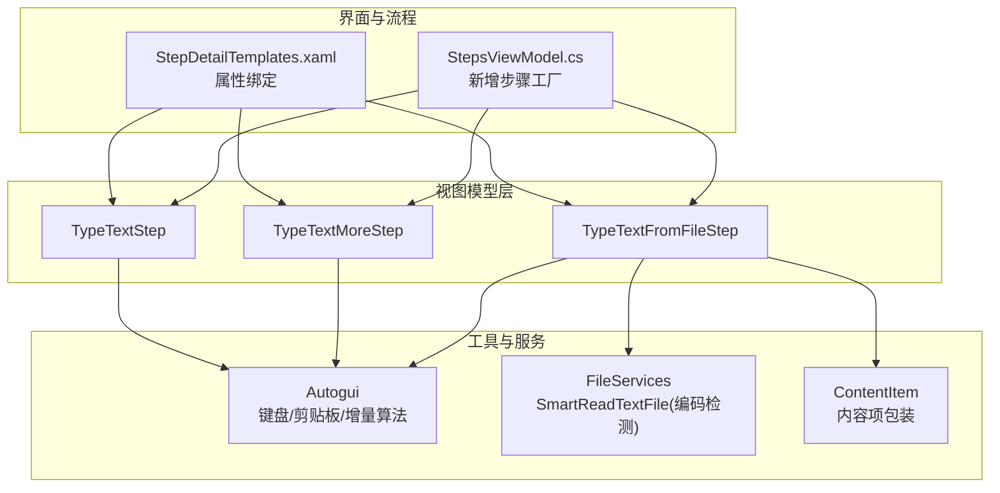
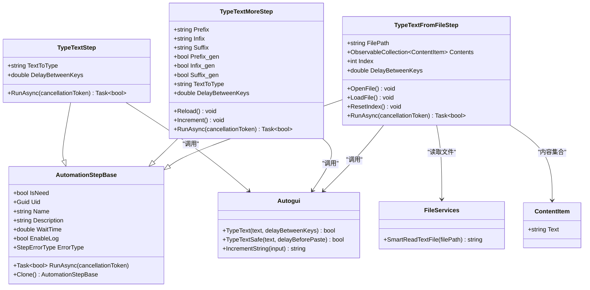
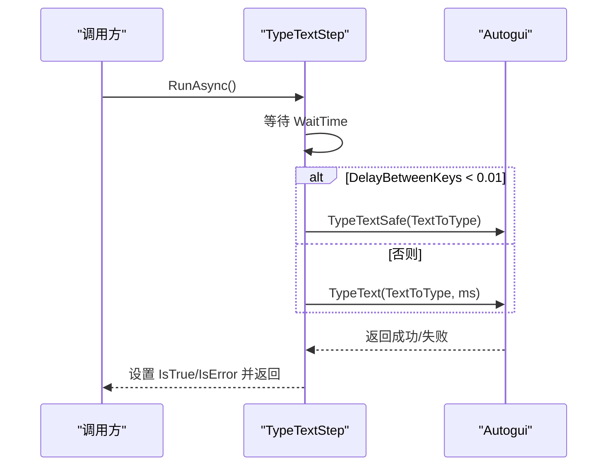
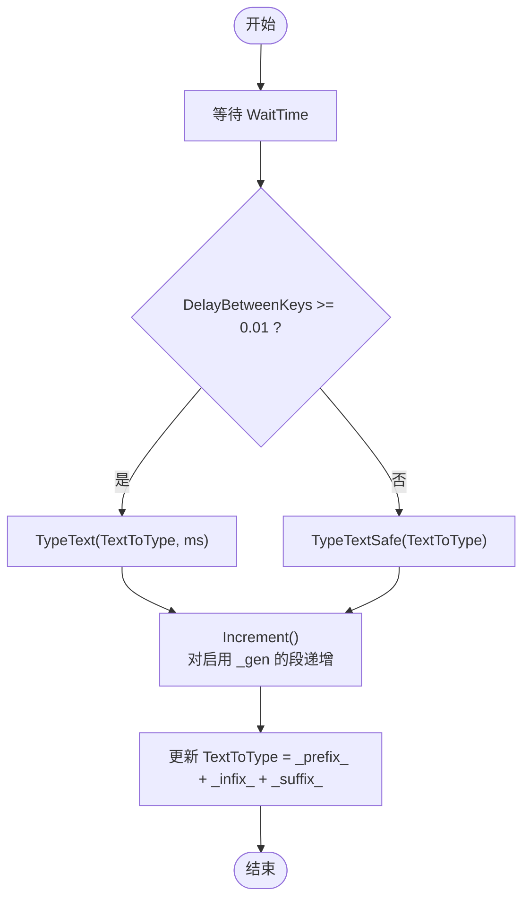
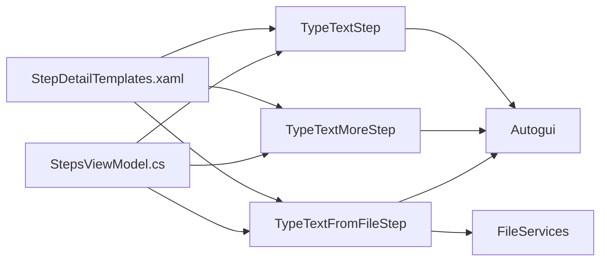

# 文本输入步骤

<cite>
**本文引用的文件**   
- [AutomationStep.cs](file://ShaoLu/Viewmodels/AutomationStep.cs)
- [Autogui.cs](file://ShaoLu/Utils/Autogui.cs)
- [Services.cs](file://ShaoLu/Services/Services.cs)
- [ContentItem.cs](file://ShaoLu/Models/ContentItem.cs)
- [AutomationStepTests.cs](file://NUnitTest/AutomationStepTests.cs)
- [StepDetailTemplates.xaml](file://ShaoLu/Templates/StepDetailTemplates.xaml)
- [StepsViewModel.cs](file://ShaoLu/Viewmodels/StepsViewModel.cs)
</cite>

## 目录
1. [简介](#简介)
2. [项目结构](#项目结构)
3. [核心组件](#核心组件)
4. [架构总览](#架构总览)
5. [详细组件分析](#详细组件分析)
6. [依赖关系分析](#依赖关系分析)
7. [性能考量](#性能考量)
8. [故障排查指南](#故障排查指南)
9. [结论](#结论)
10. [附录：使用示例与最佳实践](#附录使用示例与最佳实践)

## 简介
本技术文档聚焦 ShaoLu 的“文本输入”三类步骤：TypeTextStep、TypeTextMoreStep、TypeTextFromFileStep。文档从系统架构、数据流、处理逻辑、集成点、错误处理与性能等维度进行深度解析，并给出参数配置说明、批量递增逻辑、文件读取机制与数据源管理策略，以及特殊字符与编码问题的处理方法。

## 项目结构
文本输入步骤的核心实现位于 Viewmodels/AutomationStep.cs；底层键盘与剪贴板操作封装在 Utils/Autogui.cs；文件智能读取与编码检测在 Services/Services.cs；内容项模型在 Models/ContentItem.cs；UI 模板绑定在 Templates/StepDetailTemplates.xaml；步骤创建入口在 Viewmodels/StepsViewModel.cs；单元测试覆盖在 NUnitTest/AutomationStepTests.cs。



图表来源 
- [AutomationStep.cs:300-680](file://ShaoLu/Viewmodels/AutomationStep.cs#L300-L680)
- [Autogui.cs:425-656](file://ShaoLu/Utils/Autogui.cs#L425-L656)
- [Services.cs:142-178](file://ShaoLu/Services/Services.cs#L142-L178)
- [ContentItem.cs:1-43](file://ShaoLu/Models/ContentItem.cs#L1-L43)
- [StepDetailTemplates.xaml:303-339](file://ShaoLu/Templates/StepDetailTemplates.xaml#L303-L339)
- [StepsViewModel.cs:201-220](file://ShaoLu/Viewmodels/StepsViewModel.cs#L201-L220)

章节来源
- [AutomationStep.cs:300-680](file://ShaoLu/Viewmodels/AutomationStep.cs#L300-L680)
- [Autogui.cs:425-656](file://ShaoLu/Utils/Autogui.cs#L425-L656)
- [Services.cs:142-178](file://ShaoLu/Services/Services.cs#L142-L178)
- [ContentItem.cs:1-43](file://ShaoLu/Models/ContentItem.cs#L1-L43)
- [StepDetailTemplates.xaml:303-339](file://ShaoLu/Templates/StepDetailTemplates.xaml#L303-L339)
- [StepsViewModel.cs:201-220](file://ShaoLu/Viewmodels/StepsViewModel.cs#L201-L220)

## 核心组件
- TypeTextStep：基础文本输入步骤，直接输入 TextToType，支持按键间隔 DelayBetweenKeys。
- TypeTextMoreStep：增强型文本输入，支持 Prefix/Infix/Suffix 三段拼接，并可对任意段启用自动递增（_gen 开关），每次执行后按规则递增。
- TypeTextFromFileStep：从外部文件批量读取内容，逐条输入，支持 .txt/.csv/.xlsx，内置多分隔符分割与索引递增，异常时重置索引。

章节来源
- [AutomationStep.cs:300-365](file://ShaoLu/Viewmodels/AutomationStep.cs#L300-L365)
- [AutomationStep.cs:367-516](file://ShaoLu/Viewmodels/AutomationStep.cs#L367-L516)
- [AutomationStep.cs:518-680](file://ShaoLu/Viewmodels/AutomationStep.cs#L518-L680)

## 架构总览
三类步骤均继承自 AutomationStepBase，统一提供 WaitTime、条件判断、跳转、日志、错误状态等通用能力。运行时通过 RunAsync 异步执行，内部调用 Autogui 完成实际输入；TypeTextFromFileStep 还依赖 FileServices 进行智能文件读取与编码识别。



图表来源 
- [AutomationStep.cs:25-296](file://ShaoLu/Viewmodels/AutomationStep.cs#L25-L296)
- [AutomationStep.cs:300-680](file://ShaoLu/Viewmodels/AutomationStep.cs#L300-L680)
- [Autogui.cs:425-656](file://ShaoLu/Utils/Autogui.cs#L425-L656)
- [Services.cs:142-178](file://ShaoLu/Services/Services.cs#L142-L178)
- [ContentItem.cs:1-43](file://ShaoLu/Models/ContentItem.cs#L1-L43)

## 详细组件分析

### TypeTextStep（基础文本输入）
- 功能差异：直接输入固定字符串 TextToType，无拼接与递增。
- 关键参数
  - TextToType：待输入文本
  - DelayBetweenKeys：键入间隔（秒），小于阈值时使用安全粘贴模式
- 运行逻辑
  - 等待 WaitTime
  - 根据 DelayBetweenKeys 选择 TypeText（逐键模拟）或 TypeTextSafe（剪贴板+Ctrl+V）
  - 设置 IsTrue/IsError/ErrorType 并返回结果
- 适用场景：单次固定文本输入，如用户名、密码、简单命令等。



图表来源 
- [AutomationStep.cs:345-364](file://ShaoLu/Viewmodels/AutomationStep.cs#L345-L364)
- [Autogui.cs:569-651](file://ShaoLu/Utils/Autogui.cs#L569-L651)

章节来源
- [AutomationStep.cs:300-365](file://ShaoLu/Viewmodels/AutomationStep.cs#L300-L365)
- [Autogui.cs:569-651](file://ShaoLu/Utils/Autogui.cs#L569-L651)

### TypeTextMoreStep（带前缀/中缀/后缀与递增）
- 功能差异：支持三段拼接生成最终输入文本，且可对任一段开启自动递增，每次执行后按规则递增。
- 关键参数
  - Prefix/Infix/Suffix：三段文本
  - Prefix_gen/Infix_gen/Suffix_gen：是否对该段启用自动递增
  - ReloadText：用于 UI 触发重新加载（Reload 方法会重置内部 _prefix_/_infix_/_suffix_）
  - DelayBetweenKeys：键入间隔
- 运行逻辑
  - 等待 WaitTime
  - 执行输入（同 TypeTextStep）
  - 执行 Increment：对启用了 _gen 的段调用 Autogui.IncrementString 进行递增，再拼接为新的 TextToType
- 适用场景：序列号、流水号、订单号等需要递增的文本输入。



图表来源 
- [AutomationStep.cs:499-515](file://ShaoLu/Viewmodels/AutomationStep.cs#L499-L515)
- [AutomationStep.cs:474-489](file://ShaoLu/Viewmodels/AutomationStep.cs#L474-L489)
- [Autogui.cs:427-519](file://ShaoLu/Utils/Autogui.cs#L427-L519)

章节来源
- [AutomationStep.cs:367-516](file://ShaoLu/Viewmodels/AutomationStep.cs#L367-L516)
- [Autogui.cs:427-519](file://ShaoLu/Utils/Autogui.cs#L427-L519)

### TypeTextFromFileStep（从文件批量输入）
- 功能差异：从外部文件读取多条内容，逐条输入，支持多种分隔符与 Excel 工作表第一列读取。
- 关键参数
  - FilePath：文件路径
  - Contents：内容集合（ObservableCollection<ContentItem>）
  - Index：当前读取索引（每次执行后自增）
  - DelayBetweenKeys：键入间隔
  - Delimiter：默认分隔符数组（换行、回车、制表符、逗号、分号、竖线）
- 运行逻辑
  - 若 Contents 非空且 Index 越界：标记错误（IndexOutOfRange）、重置 Index=0 并抛出异常
  - 设置 TextToType = Contents[Index].Text，然后 Index++
  - 等待 WaitTime 后执行输入
  - 支持 OpenFile/AddContent/DelContent/ResetIndex 命令
- 文件读取机制
  - .txt/.csv：使用 FileServices.SmartReadTextFile 智能读取（含编码检测），并按 Delimiter 分割成多个 ContentItem
  - .xlsx：使用 EPPlus 读取第一个工作表的第一列
- 适用场景：批量账号、测试数据、脚本参数等。

```mermaid
sequenceDiagram
participant Caller as "调用方"
participant Step as "TypeTextFromFileStep"
participant FS as "FileServices"
participant AG as "Autogui"
Caller->>Step : RunAsync()
alt Contents 为空
Step-->>Caller : 跳过输入
else Contents 非空
alt Index >= Contents.Count
Step-->>Caller : 设置错误(IndexOutOfRange)、重置 Index=0、抛异常
else
Step->>Step : TextToType = Contents[Index].Text; Index++
end
Step->>Step : 等待 WaitTime
alt DelayBetweenKeys <= 0.01
Step->>AG : TypeTextSafe(TextToType, ms)
else 否则
Step->>AG : TypeText(TextToType, ms)
end
AG-->>Step : 返回成功/失败
Step-->>Caller : 设置 IsTrue/IsError 并返回
end
```

图表来源 
- [AutomationStep.cs:651-679](file://ShaoLu/Viewmodels/AutomationStep.cs#L651-L679)
- [AutomationStep.cs:622-648](file://ShaoLu/Viewmodels/AutomationStep.cs#L622-L648)
- [Services.cs:142-178](file://ShaoLu/Services/Services.cs#L142-L178)

章节来源
- [AutomationStep.cs:518-680](file://ShaoLu/Viewmodels/AutomationStep.cs#L518-L680)
- [Services.cs:142-178](file://ShaoLu/Services/Services.cs#L142-L178)

## 依赖关系分析
- 输入引擎依赖
  - TypeTextStep/TypeTextMoreStep/TypeTextFromFileStep 均依赖 Autogui 完成键盘/剪贴板输入。
  - TypeTextMoreStep 依赖 Autogui.IncrementString 实现递增。
  - TypeTextFromFileStep 依赖 FileServices.SmartReadTextFile 进行智能编码读取。
- UI 绑定
  - StepDetailTemplates.xaml 将 Prefix/Infix/Suffix、AutoGen 复选框、WaitTime、DelayBetweenKeys、预览 TextToType 等属性绑定到对应步骤实例。
- 步骤创建
  - StepsViewModel.cs 根据类型名创建具体步骤实例，并应用默认设置。



图表来源 
- [StepDetailTemplates.xaml:303-339](file://ShaoLu/Templates/StepDetailTemplates.xaml#L303-L339)
- [StepsViewModel.cs:201-220](file://ShaoLu/Viewmodels/StepsViewModel.cs#L201-L220)
- [AutomationStep.cs:300-680](file://ShaoLu/Viewmodels/AutomationStep.cs#L300-L680)
- [Autogui.cs:425-656](file://ShaoLu/Utils/Autogui.cs#L425-L656)
- [Services.cs:142-178](file://ShaoLu/Services/Services.cs#L142-L178)

章节来源
- [StepDetailTemplates.xaml:303-339](file://ShaoLu/Templates/StepDetailTemplates.xaml#L303-L339)
- [StepsViewModel.cs:201-220](file://ShaoLu/Viewmodels/StepsViewModel.cs#L201-L220)
- [AutomationStep.cs:300-680](file://ShaoLu/Viewmodels/AutomationStep.cs#L300-L680)
- [Autogui.cs:425-656](file://ShaoLu/Utils/Autogui.cs#L425-L656)
- [Services.cs:142-178](file://ShaoLu/Services/Services.cs#L142-L178)

## 性能考量
- 输入方式选择
  - 当 DelayBetweenKeys 较小（<0.01s）时，采用 TypeTextSafe（剪贴板+Ctrl+V）减少系统调用开销，提升大批量输入性能。
  - 较大间隔时使用 TypeText（逐键模拟），更贴近真实用户输入节奏。
- 文件读取
  - SmartReadTextFile 先检查 BOM，再使用启发式编码检测，避免多次 IO 与错误解码带来的重试成本。
- 递增算法
  - IncrementString 对数字/字母后缀分别处理，避免不必要的字符串重建；字母固定位数回绕（如 ZZ→AA）减少长度变化带来的额外开销。
- 线程与调度
  - TypeTextSafe 确保在 STA 线程执行剪贴板操作，避免跨线程异常导致的阻塞与重试。

[本节为通用性能讨论，不直接分析具体文件]

## 故障排查指南
- 常见错误
  - 索引越界：TypeTextFromFileStep 在 Index 超出 Contents 范围时设置 ErrorType=IndexOutOfRange 并重置 Index=0，需检查数据来源与循环控制。
  - 编码问题：SmartReadTextFile 在无有效 BOM 且置信度不足时会抛出异常，建议检查文件编码或转换为 UTF-8。
  - 剪贴板异常：TypeTextSafe 捕获异常并记录日志，若失败请确认目标控件支持粘贴（如 TextBox）。
- 调试建议
  - 启用 EnableLog 以记录步骤执行日志。
  - 使用 Preview（TextToType）观察拼接与递增结果是否正确。
  - 对于 .xlsx，确认数据位于第一个工作表的第一列。

章节来源
- [AutomationStep.cs:651-679](file://ShaoLu/Viewmodels/AutomationStep.cs#L651-L679)
- [Services.cs:142-178](file://ShaoLu/Services/Services.cs#L142-L178)
- [Autogui.cs:623-651](file://ShaoLu/Utils/Autogui.cs#L623-L651)

## 结论
TypeTextStep、TypeTextMoreStep、TypeTextFromFileStep 覆盖了从单条固定文本、可递增拼接文本到批量文件驱动的多种输入场景。通过统一的基类与清晰的职责划分，结合 Autogui 与 FileServices 的能力，实现了稳定高效的自动化文本输入。合理配置参数与理解递增/读取机制，可有效应对复杂业务需求与边界情况。

[本节为总结性内容，不直接分析具体文件]

## 附录：使用示例与最佳实践
- 基础文本输入（TypeTextStep）
  - 配置 TextToType 为目标文本，按需设置 DelayBetweenKeys（例如 0.05s）以获得更自然的输入效果。
  - 适用于一次性输入，如登录名、搜索词等。
- 递增文本输入（TypeTextMoreStep）
  - 设置 Prefix/Infix/Suffix，根据需要勾选 Prefix_gen/Infix_gen/Suffix_gen 启用递增。
  - 示例：Prefix="ORD-", Infix="001", Suffix=""，每次执行后 Infix 递增为 002、003…
  - 如需恢复初始值，调用 Reload 或在 UI 上触发 ReloadText。
- 批量文件输入（TypeTextFromFileStep）
  - 选择 .txt/.csv 或 .xlsx 文件，系统将自动读取并分割为 Contents。
  - 注意分隔符：默认包含换行、回车、制表符、逗号、分号、竖线；必要时调整数据格式。
  - 执行完成后 Index 自动递增；若出现 IndexOutOfRange，检查数据总量与循环次数。
- 特殊字符与编码
  - 优先使用 UTF-8 文件（带或不带 BOM 均可被 SmartReadTextFile 正确识别）。
  - 若目标控件不支持粘贴，尝试增大 DelayBetweenKeys 或使用 TypeText 模式。
- 验证与测试
  - 参考单元测试用例验证构造、克隆与属性默认值行为，确保配置一致性。

章节来源
- [AutomationStepTests.cs:17-116](file://NUnitTest/AutomationStepTests.cs#L17-L116)
- [AutomationStepTests.cs:123-194](file://NUnitTest/AutomationStepTests.cs#L123-L194)
- [StepDetailTemplates.xaml:303-339](file://ShaoLu/Templates/StepDetailTemplates.xaml#L303-L339)