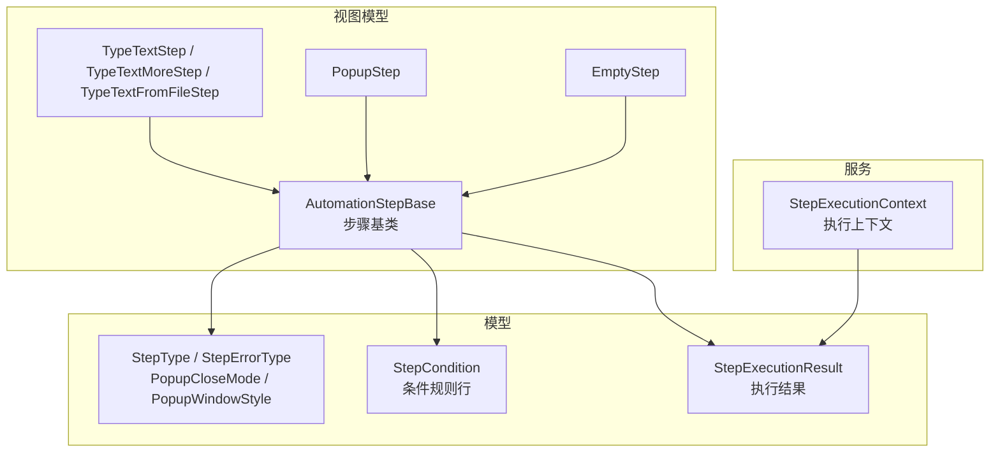
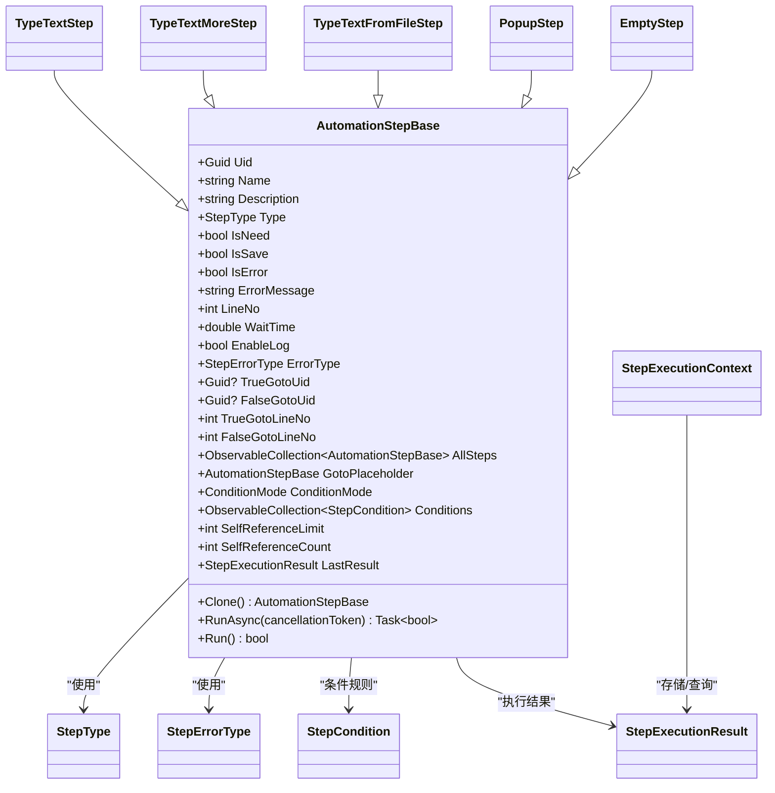
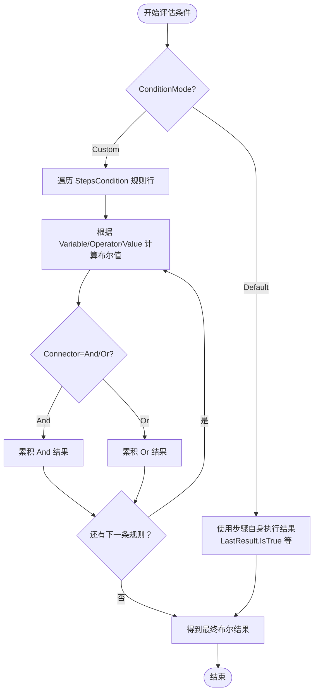
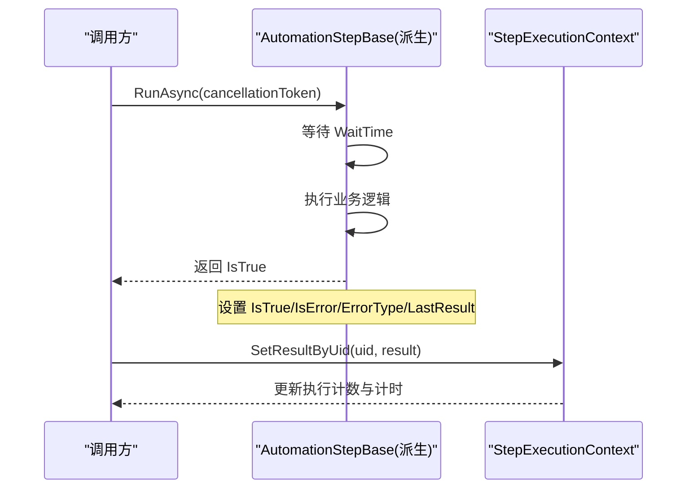
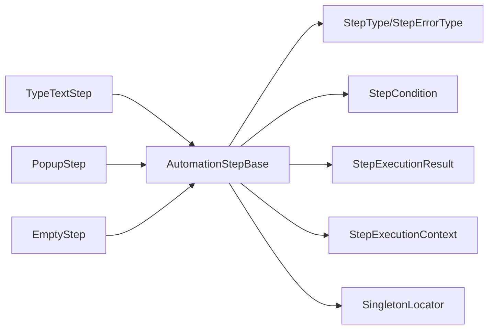

# 步骤基类设计

<cite>
**本文引用的文件**
- [AutomationStep.cs](file://ShaoLu/Viewmodels/AutomationStep.cs)
- [AutomationStepModel.cs](file://ShaoLu/Models/AutomationStepModel.cs)
- [StepCondition.cs](file://ShaoLu/Models/StepCondition.cs)
- [StepExecutionResult.cs](file://ShaoLu/Models/StepExecutionResult.cs)
- [StepExecutionContext.cs](file://ShaoLu/Services/StepExecutionContext.cs)
</cite>

## 目录
1. [简介](#简介)
2. [项目结构](#项目结构)
3. [核心组件](#核心组件)
4. [架构总览](#架构总览)
5. [详细组件分析](#详细组件分析)
6. [依赖关系分析](#依赖关系分析)
7. [性能考量](#性能考量)
8. [故障排查指南](#故障排查指南)
9. [结论](#结论)
10. [附录：自定义步骤实现示例与最佳实践](#附录自定义步骤实现示例与最佳实践)

## 简介
本技术文档聚焦于 ShaoLu 的步骤基类 AutomationStepBase，系统阐述其属性管理、条件判断机制、跳转控制（TrueGotoUid/FalseGotoUid）、错误处理、日志记录、执行结果管理与生命周期。同时解释抽象方法 Clone() 与 RunAsync() 的设计模式，以及继承层次结构、自引用限制机制和运行时状态跟踪。文末提供如何正确继承并实现自定义步骤类型的指导与参考路径。

## 项目结构
围绕步骤基类的关键代码分布在以下模块：
- Viewmodels/AutomationStep.cs：定义自动化步骤基类及多种具体步骤类型（如文本输入、弹窗等）
- Models/AutomationStepModel.cs：步骤类型枚举、错误类型枚举、弹窗相关枚举
- Models/StepCondition.cs：条件判断模型、变量、运算符、连接器与文本提取模式
- Models/StepExecutionResult.cs：步骤执行结果的数据结构
- Services/StepExecutionContext.cs：步骤执行上下文，维护执行结果、计数、计时与变量解析

图表来源
- [AutomationStep.cs:25-296](file://ShaoLu/Viewmodels/AutomationStep.cs#L25-L296)
- [AutomationStepModel.cs:9-67](file://ShaoLu/Models/AutomationStepModel.cs#L9-L67)
- [StepCondition.cs:103-403](file://ShaoLu/Models/StepCondition.cs#L103-L403)
- [StepExecutionResult.cs:8-49](file://ShaoLu/Models/StepExecutionResult.cs#L8-L49)
- [StepExecutionContext.cs:11-161](file://ShaoLu/Services/StepExecutionContext.cs#L11-L161)

章节来源
- [AutomationStep.cs:25-296](file://ShaoLu/Viewmodels/AutomationStep.cs#L25-L296)
- [AutomationStepModel.cs:9-67](file://ShaoLu/Models/AutomationStepModel.cs#L9-L67)
- [StepCondition.cs:103-403](file://ShaoLu/Models/StepCondition.cs#L103-L403)
- [StepExecutionResult.cs:8-49](file://ShaoLu/Models/StepExecutionResult.cs#L8-L49)
- [StepExecutionContext.cs:11-161](file://ShaoLu/Services/StepExecutionContext.cs#L11-L161)

## 核心组件
- 步骤基类 AutomationStepBase
  - 属性管理：Uid、Name、Description、Type、IsNeed、IsSave、IsError、ErrorMessage、LineNo、WaitTime、EnableLog、SelfReferenceLimit、SelfReferenceCount、LastResult、TrueGotoUid、FalseGotoUid、TrueGotoLineNo、FalseGotoLineNo、AllSteps、GotoPlaceholder、ConditionMode、Conditions 等
  - 条件判断：支持默认模式与自定义模式；自定义模式下通过 StepCondition 列表组合多行规则
  - 跳转控制：基于 Uid 的 TrueGotoUid/FalseGotoUid，UI 显示对应行号
  - 错误处理：IsError、ErrorMessage、ErrorType（StepErrorType）
  - 日志记录：EnableLog 开关
  - 执行结果：LastResult（StepExecutionResult），包含 IsTrue、ExecutionTimeMs、Similarity、ClickPosition、OCRText、PopupResult、ErrorMessage、ExecutedAt
  - 自引用限制：SelfReferenceLimit 与 SelfReferenceCount 控制循环调用次数
  - 抽象接口：Clone() 深拷贝、RunAsync(CancellationToken) 异步执行
- 步骤类型与错误类型枚举：StepType、StepErrorType、PopupCloseMode、PopupWindowStyle
- 条件模型：StepCondition（Variable、Operator、Value、Connector、TextExtractMode 等）
- 执行结果：StepExecutionResult
- 执行上下文：StepExecutionContext（保存各步骤执行结果、统计、变量解析）

章节来源
- [AutomationStep.cs:25-296](file://ShaoLu/Viewmodels/AutomationStep.cs#L25-L296)
- [AutomationStepModel.cs:9-67](file://ShaoLu/Models/AutomationStepModel.cs#L9-L67)
- [StepCondition.cs:103-403](file://ShaoLu/Models/StepCondition.cs#L103-L403)
- [StepExecutionResult.cs:8-49](file://ShaoLu/Models/StepExecutionResult.cs#L8-L49)
- [StepExecutionContext.cs:11-161](file://ShaoLu/Services/StepExecutionContext.cs#L11-L161)

## 架构总览
步骤基类作为所有自动化步骤的统一抽象，定义了统一的属性、条件、跳转、错误、日志与执行结果契约。具体步骤类型通过继承基类并实现 Clone() 与 RunAsync() 来完成各自业务逻辑。执行上下文集中管理执行结果与变量解析，为条件判断与统计提供支撑。

图表来源
- [AutomationStep.cs:25-296](file://ShaoLu/Viewmodels/AutomationStep.cs#L25-L296)
- [AutomationStepModel.cs:9-67](file://ShaoLu/Models/AutomationStepModel.cs#L9-L67)
- [StepCondition.cs:103-403](file://ShaoLu/Models/StepCondition.cs#L103-L403)
- [StepExecutionResult.cs:8-49](file://ShaoLu/Models/StepExecutionResult.cs#L8-L49)
- [StepExecutionContext.cs:11-161](file://ShaoLu/Services/StepExecutionContext.cs#L11-L161)

## 详细组件分析

### 属性管理与自引用限制
- Uid：唯一标识，JSON 反序列化时恢复原值，避免覆盖已有标识
- Name/Description/Type：基础元数据
- IsNeed/IsSave/IsError/ErrorMessage：运行状态与错误信息
- LineNo：由集合或 UI 统一维护，基类保留 SetProperty 以支持手动刷新
- WaitTime：步骤执行前等待时间（秒）
- EnableLog：是否记录执行日志
- TrueGotoUid/FalseGotoUid：真/假分支跳转目标 Uid；TrueGotoLineNo/FalseGotoLineNo 用于 UI 显示
- AllSteps/GotoPlaceholder：供跳转下拉框绑定，包含“无跳转”占位项
- ConditionMode/Conditions：条件判断模式与自定义规则行集合
- SelfReferenceLimit/SelfReferenceCount：自引用上限与运行时计数器，防止无限递归
- LastResult：最近一次执行结果（不序列化）

章节来源
- [AutomationStep.cs:25-296](file://ShaoLu/Viewmodels/AutomationStep.cs#L25-L296)

### 条件判断机制
- 模式：Default（使用步骤自身执行结果）与 Custom（使用用户配置的多行规则）
- 规则行：StepCondition，包含 Variable（变量）、Operator（运算符）、Value（比较值）、Connector（逻辑连接）、TextExtractMode（识别文本提取模式）等
- 变量解析：StepExecutionContext.ResolveVariable 支持常量、当前步骤自身字段、其他步骤字段（通过 Uid 引用）、Step_Triggered（仅在上一步刚执行时为真）
- 文本提取：对 OCRText 变量支持按行、子字符串、前后截取等方式提取

图表来源
- [StepCondition.cs:103-403](file://ShaoLu/Models/StepCondition.cs#L103-L403)
- [StepExecutionContext.cs:112-160](file://ShaoLu/Services/StepExecutionContext.cs#L112-L160)

章节来源
- [StepCondition.cs:103-403](file://ShaoLu/Models/StepCondition.cs#L103-L403)
- [StepExecutionContext.cs:112-160](file://ShaoLu/Services/StepExecutionContext.cs#L112-L160)

### 跳转控制（TrueGotoUid/FalseGotoUid）
- 通过 Uid 指定跳转目标，UI 显示对应行号（TrueGotoLineNo/FalseGotoLineNo）
- 行号解析依赖全局步骤集合（SingletonLocator.Steps.AutomationStepBases），找不到返回 0
- “无跳转”占位项（EmptyStep）用于下拉选择

章节来源
- [AutomationStep.cs:117-155](file://ShaoLu/Viewmodels/AutomationStep.cs#L117-L155)
- [AutomationStep.cs:158-192](file://ShaoLu/Viewmodels/AutomationStep.cs#L158-L192)

### 错误处理与日志记录
- IsError/ErrorMessage/ErrorType：标记错误、描述信息与错误类型（StepErrorType）
- EnableLog：控制是否记录执行日志
- 具体步骤在 RunAsync 中设置 IsTrue、IsError、ErrorType 与 LastResult

章节来源
- [AutomationStepModel.cs:26-43](file://ShaoLu/Models/AutomationStepModel.cs#L26-L43)
- [AutomationStep.cs:246-264](file://ShaoLu/Viewmodels/AutomationStep.cs#L246-L264)

### 执行结果管理
- LastResult：每个步骤维护最近一次执行结果（StepExecutionResult）
- StepExecutionResult：包含 IsTrue、ExecutionTimeMs、Similarity、ClickPosition、OCRText、PopupResult、ErrorMessage、ExecutedAt
- StepExecutionContext：集中存储各步骤执行结果、执行次数、计时与变量解析

章节来源
- [StepExecutionResult.cs:8-49](file://ShaoLu/Models/StepExecutionResult.cs#L8-L49)
- [StepExecutionContext.cs:11-103](file://ShaoLu/Services/StepExecutionContext.cs#L11-L103)

### 抽象方法与执行生命周期
- Clone()：深拷贝步骤实例，复制所有必要属性（包括跳转、等待、日志、自引用限制等）
- RunAsync(CancellationToken)：异步执行步骤逻辑，返回成功与否；同步封装 Run() 便于非异步场景调用
- 生命周期要点：
  - 构造：初始化默认值（LineNo、Name、Description）
  - 执行前：可设置 WaitTime 等待
  - 执行中：更新 IsTrue、IsError、ErrorType、LastResult
  - 执行后：条件评估与跳转决策（由上层引擎驱动）

图表来源
- [AutomationStep.cs:288-296](file://ShaoLu/Viewmodels/AutomationStep.cs#L288-L296)
- [StepExecutionContext.cs:39-52](file://ShaoLu/Services/StepExecutionContext.cs#L39-L52)

章节来源
- [AutomationStep.cs:288-296](file://ShaoLu/Viewmodels/AutomationStep.cs#L288-L296)
- [StepExecutionContext.cs:39-52](file://ShaoLu/Services/StepExecutionContext.cs#L39-L52)

### 自引用限制机制
- SelfReferenceLimit：允许的最大自引用次数（-1 表示无限制，0 禁止自引用，>0 限制次数）
- SelfReferenceCount：运行时自引用计数器（不序列化）
- 目的：防止步骤在执行过程中出现无限递归或死循环

章节来源
- [AutomationStep.cs:201-208](file://ShaoLu/Viewmodels/AutomationStep.cs#L201-L208)

### 具体步骤类型示例
- TypeTextStep/TypeTextMoreStep/TypeTextFromFileStep：文本输入相关步骤，演示 Clone() 与 RunAsync() 的实现模式
- PopupStep：弹窗交互步骤，展示复杂交互流程与关闭模式（ButtonClick/Timeout/StepReached）
- EmptyStep：占位步骤，常用于“无跳转”选项

章节来源
- [AutomationStep.cs:300-365](file://ShaoLu/Viewmodels/AutomationStep.cs#L300-L365)
- [AutomationStep.cs:367-516](file://ShaoLu/Viewmodels/AutomationStep.cs#L367-L516)
- [AutomationStep.cs:518-680](file://ShaoLu/Viewmodels/AutomationStep.cs#L518-L680)
- [AutomationStep.cs:684-1069](file://ShaoLu/Viewmodels/AutomationStep.cs#L684-L1069)
- [AutomationStep.cs:1071-1118](file://ShaoLu/Viewmodels/AutomationStep.cs#L1071-L1118)

## 依赖关系分析
- AutomationStepBase 依赖：
  - 模型层：StepType、StepErrorType、StepCondition、StepExecutionResult
  - 服务层：StepExecutionContext（用于条件变量解析与执行结果管理）
  - 工具层：SingletonLocator（获取步骤集合、文件服务等）
- 具体步骤类型依赖基类提供的属性与方法，并在 RunAsync 中实现具体行为

图表来源
- [AutomationStep.cs:25-296](file://ShaoLu/Viewmodels/AutomationStep.cs#L25-L296)
- [StepExecutionContext.cs:11-161](file://ShaoLu/Services/StepExecutionContext.cs#L11-L161)

章节来源
- [AutomationStep.cs:25-296](file://ShaoLu/Viewmodels/AutomationStep.cs#L25-L296)
- [StepExecutionContext.cs:11-161](file://ShaoLu/Services/StepExecutionContext.cs#L11-L161)

## 性能考量
- WaitTime：合理设置等待时间，避免阻塞主线程或影响用户体验
- 异步执行：RunAsync 使用 CancellationToken 支持取消操作，避免长时间阻塞
- 条件评估：自定义模式下规则行数较多时，注意性能开销；必要时缓存或优化变量解析
- 执行结果与上下文：StepExecutionContext 使用字典存储结果，查找复杂度 O(1)，适合频繁访问

[本节为通用性能建议，无需特定文件引用]

## 故障排查指南
- 常见问题定位：
  - 跳转无效：检查 TrueGotoUid/FalseGotoUid 是否正确设置，UID 是否存在于步骤集合
  - 条件不生效：确认 ConditionMode 与 StepCondition 配置是否正确，变量与运算符匹配
  - 自引用超限：检查 SelfReferenceLimit 与 SelfReferenceCount，避免循环调用
  - 错误信息：查看 IsError、ErrorMessage、ErrorType 定位问题
- 调试建议：
  - 启用 EnableLog 输出执行日志
  - 使用 StepExecutionContext 查询各步骤执行结果与耗时
  - 针对弹窗步骤，检查 CloseMode 与 AutoCloseSeconds 配置

章节来源
- [AutomationStep.cs:117-155](file://ShaoLu/Viewmodels/AutomationStep.cs#L117-L155)
- [StepCondition.cs:103-403](file://ShaoLu/Models/StepCondition.cs#L103-L403)
- [StepExecutionContext.cs:84-103](file://ShaoLu/Services/StepExecutionContext.cs#L84-L103)

## 结论
AutomationStepBase 为 ShaoLu 的自动化步骤提供了统一的抽象与能力，涵盖属性管理、条件判断、跳转控制、错误处理、日志记录与执行结果管理。通过 Clone() 与 RunAsync() 的设计模式，具体步骤类型可以灵活扩展。配合 StepExecutionContext 与 StepCondition，系统实现了强大的条件评估与执行追踪能力。遵循本文档的最佳实践，开发者可以快速构建稳定、可维护的自定义步骤类型。

[本节为总结性内容，无需特定文件引用]

## 附录：自定义步骤实现示例与最佳实践
- 继承基类：创建新类继承 AutomationStepBase
- 构造函数：设置 Type、Name、Description 等默认值
- 实现 Clone()：深拷贝所有必要属性（包括跳转、等待、日志、自引用限制等）
- 实现 RunAsync(CancellationToken)：
  - 设置 WaitTime 等待
  - 执行业务逻辑，更新 IsTrue、IsError、ErrorType、LastResult
  - 支持 CancellationToken 取消
- 条件与跳转：根据需要设置 ConditionMode、Conditions、TrueGotoUid/FalseGotoUid
- 错误处理：合理设置 IsError、ErrorMessage、ErrorType
- 日志记录：启用 EnableLog 以便调试

参考路径（不包含具体代码内容）：
- 基类与抽象方法定义：[AutomationStep.cs:288-296](file://ShaoLu/Viewmodels/AutomationStep.cs#L288-L296)
- 文本输入步骤示例：[TypeTextStep:300-365](file://ShaoLu/Viewmodels/AutomationStep.cs#L300-L365)、[TypeTextMoreStep:367-516](file://ShaoLu/Viewmodels/AutomationStep.cs#L367-L516)、[TypeTextFromFileStep:518-680](file://ShaoLu/Viewmodels/AutomationStep.cs#L518-L680)
- 弹窗步骤示例：[PopupStep:684-1069](file://ShaoLu/Viewmodels/AutomationStep.cs#L684-L1069)
- 占位步骤示例：[EmptyStep:1071-1118](file://ShaoLu/Viewmodels/AutomationStep.cs#L1071-L1118)

章节来源
- [AutomationStep.cs:288-296](file://ShaoLu/Viewmodels/AutomationStep.cs#L288-L296)
- [AutomationStep.cs:300-680](file://ShaoLu/Viewmodels/AutomationStep.cs#L300-L680)
- [AutomationStep.cs:684-1069](file://ShaoLu/Viewmodels/AutomationStep.cs#L684-L1069)
- [AutomationStep.cs:1071-1118](file://ShaoLu/Viewmodels/AutomationStep.cs#L1071-L1118)