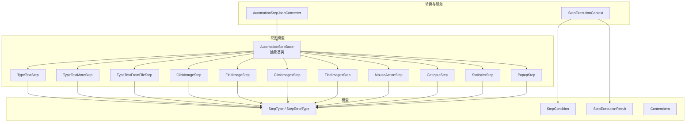
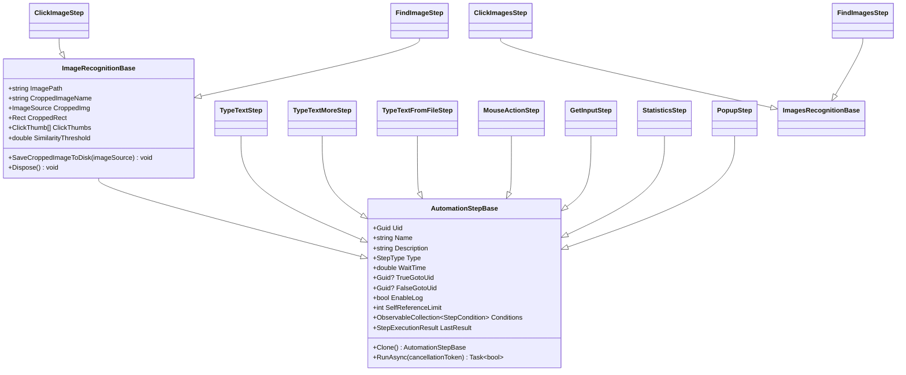
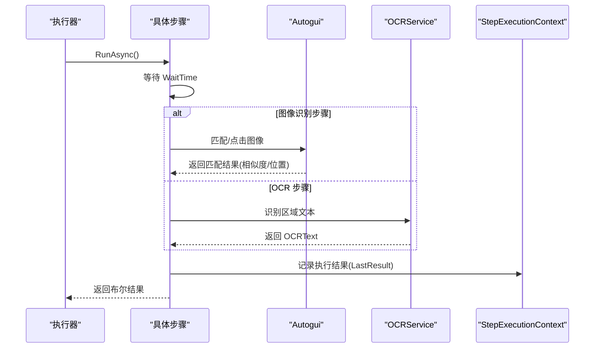

# 步骤类型系统

<cite>
**本文引用的文件**   
- [AutomationStep.cs](file://ShaoLu/Viewmodels/AutomationStep.cs)
- [ImageRecognition.cs](file://ShaoLu/Viewmodels/ImageRecognition.cs)
- [ImagesRecognition.cs](file://ShaoLu/Viewmodels/ImagesRecognition.cs)
- [GetInputStep.cs](file://ShaoLu/Viewmodels/GetInputStep.cs)
- [MouseActionStep.cs](file://ShaoLu/Viewmodels/MouseActionStep.cs)
- [StatisticsStep.cs](file://ShaoLu/Viewmodels/StatisticsStep.cs)
- [AutomationStepModel.cs](file://ShaoLu/Models/AutomationStepModel.cs)
- [StepCondition.cs](file://ShaoLu/Models/StepCondition.cs)
- [ContentItem.cs](file://ShaoLu/Models/ContentItem.cs)
- [StepExecutionResult.cs](file://ShaoLu/Models/StepExecutionResult.cs)
- [AutomationStepJsonConverter.cs](file://ShaoLu/Converters/AutomationStepJsonConverter.cs)
- [StepExecutionContext.cs](file://ShaoLu/Services/StepExecutionContext.cs)
- [Readme.md](file://Readme.md)
</cite>

## 目录
1. [简介](#简介)
2. [项目结构](#项目结构)
3. [核心组件](#核心组件)
4. [架构总览](#架构总览)
5. [详细组件分析](#详细组件分析)
6. [依赖关系分析](#依赖关系分析)
7. [性能考量](#性能考量)
8. [故障排查指南](#故障排查指南)
9. [结论](#结论)
10. [附录](#附录)

## 简介
本技术文档围绕 ShaoLu 的步骤类型系统，系统化阐述自动化步骤的分类体系、继承层次、参数配置、执行逻辑与使用场景。重点覆盖输入类步骤（TypeTextStep、TypeTextMoreStep、TypeTextFromFileStep）、图像识别类步骤（ClickImageStep、FindImageStep、ClickImagesStep、FindImagesStep）、鼠标操作类步骤（MouseActionStep）以及辅助与统计类步骤（PopupStep、GetInputStep、StatisticsStep）。同时说明抽象基类 AutomationStepBase 的抽象方法与通用属性、自定义步骤扩展方式、JSON 序列化机制与兼容性处理，以及运行时上下文与条件评估机制。

## 项目结构
步骤类型系统主要分布在 Viewmodels、Models、Converters、Services 等目录：
- Viewmodels：各类步骤实现（输入、图像识别、鼠标、统计、弹窗、获取输入等）
- Models：枚举、数据模型（步骤类型、错误类型、条件、执行结果、内容项等）
- Converters：多态 JSON 转换器，支持步骤类型的序列化和反序列化兼容
- Services：执行上下文、OCR 服务、日志服务等

图表来源
- [AutomationStep.cs:25-296](file://ShaoLu/Viewmodels/AutomationStep.cs#L25-L296)
- [ImageRecognition.cs:21-326](file://ShaoLu/Viewmodels/ImageRecognition.cs#L21-L326)
- [ImagesRecognition.cs:15-245](file://ShaoLu/Viewmodels/ImagesRecognition.cs#L15-L245)
- [GetInputStep.cs:15-294](file://ShaoLu/Viewmodels/GetInputStep.cs#L15-L294)
- [MouseActionStep.cs:15-162](file://ShaoLu/Viewmodels/MouseActionStep.cs#L15-L162)
- [StatisticsStep.cs:15-459](file://ShaoLu/Viewmodels/StatisticsStep.cs#L15-L459)
- [AutomationStepModel.cs:9-73](file://ShaoLu/Models/AutomationStepModel.cs#L9-L73)
- [StepCondition.cs:100-405](file://ShaoLu/Models/StepCondition.cs#L100-L405)
- [ContentItem.cs:13-94](file://ShaoLu/Models/ContentItem.cs#L13-L94)
- [StepExecutionResult.cs:8-51](file://ShaoLu/Models/StepExecutionResult.cs#L8-L51)
- [AutomationStepJsonConverter.cs:14-185](file://ShaoLu/Converters/AutomationStepJsonConverter.cs#L14-L185)
- [StepExecutionContext.cs:11-163](file://ShaoLu/Services/StepExecutionContext.cs#L11-L163)

章节来源
- [Readme.md:17-283](file://Readme.md#L17-L283)

## 核心组件
- 抽象基类 AutomationStepBase
  - 提供通用属性：Uid、Name、Description、Type、WaitTime、TrueGotoUid、FalseGotoUid、EnableLog、SelfReferenceLimit、Conditions、LastResult 等
  - 抽象方法：Clone()、RunAsync(CancellationToken)
  - 条件判断模式 ConditionMode 与规则行 Conditions
  - 跳转解析与“无跳转”占位项
- 输入类步骤
  - TypeTextStep：基础文本输入，支持按键间隔与安全输入模式
  - TypeTextMoreStep：前缀+中间+后缀组合输入，支持片段递增
  - TypeTextFromFileStep：从 txt/csv/xlsx 读取内容列表，逐行输入并维护索引
- 图像识别类步骤
  - ClickImageStep：查找图片并点击，支持多次点击、动作序列、超时
  - FindImageStep：仅查找图片，可选 OCR 区域识别文字
  - ClickImagesStep：多图依次查找并点击
  - FindImagesStep：多图同时查找，判断是否全部找到
- 鼠标操作类步骤
  - MouseActionStep：在绝对坐标或当前鼠标位置执行鼠标动作序列
- 获取输入类步骤
  - GetInputStep：OCR 区域识别或屏幕指定位置读取可选择文本
- 统计类步骤
  - StatisticsStep：展示运行统计窗口，支持多种统计项与条件计数
- 弹出框步骤
  - PopupStep：自定义弹窗，支持按钮、样式、关闭模式等

章节来源
- [AutomationStep.cs:25-296](file://ShaoLu/Viewmodels/AutomationStep.cs#L25-L296)
- [AutomationStep.cs:300-365](file://ShaoLu/Viewmodels/AutomationStep.cs#L300-L365)
- [AutomationStep.cs:367-516](file://ShaoLu/Viewmodels/AutomationStep.cs#L367-L516)
- [AutomationStep.cs:518-680](file://ShaoLu/Viewmodels/AutomationStep.cs#L518-L680)
- [ImageRecognition.cs:329-436](file://ShaoLu/Viewmodels/ImageRecognition.cs#L329-L436)
- [ImageRecognition.cs:439-601](file://ShaoLu/Viewmodels/ImageRecognition.cs#L439-L601)
- [ImagesRecognition.cs:71-168](file://ShaoLu/Viewmodels/ImagesRecognition.cs#L71-L168)
- [ImagesRecognition.cs:170-245](file://ShaoLu/Viewmodels/ImagesRecognition.cs#L170-L245)
- [MouseActionStep.cs:29-162](file://ShaoLu/Viewmodels/MouseActionStep.cs#L29-L162)
- [GetInputStep.cs:29-294](file://ShaoLu/Viewmodels/GetInputStep.cs#L29-L294)
- [StatisticsStep.cs:209-459](file://ShaoLu/Viewmodels/StatisticsStep.cs#L209-L459)
- [AutomationStep.cs:684-800](file://ShaoLu/Viewmodels/AutomationStep.cs#L684-L800)

## 架构总览
步骤类型系统采用“抽象基类 + 具体实现”的分层设计，所有步骤统一通过 RunAsync 执行，并通过 LastResult 记录结构化执行结果。JSON 多态转换器根据 StepType 字段实例化具体步骤类型，并兼容旧版 TrueGoto/FalseGoto 数字格式。执行上下文集中管理步骤执行结果、计时与变量解析，供条件评估与统计使用。

图表来源
- [AutomationStep.cs:25-296](file://ShaoLu/Viewmodels/AutomationStep.cs#L25-L296)
- [ImageRecognition.cs:21-326](file://ShaoLu/Viewmodels/ImageRecognition.cs#L21-L326)
- [ImagesRecognition.cs:47-69](file://ShaoLu/Viewmodels/ImagesRecognition.cs#L47-L69)

## 详细组件分析

### 抽象基类与通用能力
- 抽象方法
  - Clone：用于复制步骤对象，保留关键属性与集合
  - RunAsync：异步执行步骤逻辑，返回布尔结果
- 通用属性
  - Uid：唯一标识，JSON 反序列化时恢复原值
  - TrueGotoUid/FalseGotoUid：条件跳转目标步骤 Uid
  - WaitTime：执行前等待时间（秒）
  - EnableLog：是否记录执行日志
  - SelfReferenceLimit：自引用次数上限
  - Conditions：自定义条件规则行集合
  - LastResult：最近一次执行结果（不序列化）
- 跳转解析
  - ResolveLineNo：根据 Uid 解析步骤行号，供 UI 显示
  - AllSteps/GotoPlaceholder：为跳转下拉框提供“无跳转”占位项

章节来源
- [AutomationStep.cs:25-296](file://ShaoLu/Viewmodels/AutomationStep.cs#L25-L296)

### 输入类步骤

#### TypeTextStep
- 参数
  - TextToType：待输入文本
  - DelayBetweenKeys：按键间隔（秒），小于阈值时使用安全快速模式
- 执行逻辑
  - 等待 WaitTime
  - 调用 Autogui.TypeTextSafe 或 TypeText 进行输入
  - 设置 IsTrue/IsError/ErrorType，返回执行结果

章节来源
- [AutomationStep.cs:300-365](file://ShaoLu/Viewmodels/AutomationStep.cs#L300-L365)

#### TypeTextMoreStep
- 参数
  - Prefix/Infix/Suffix：三段文本片段
  - Prefix_gen/Infix_gen/Suffix_gen：对应片段是否递增
  - ReloadText：触发重新加载组合文本
- 执行逻辑
  - 等待 WaitTime
  - 组合最终文本并输入
  - 执行后对标记递增的片段自动递增（如字母/数字递增）

章节来源
- [AutomationStep.cs:367-516](file://ShaoLu/Viewmodels/AutomationStep.cs#L367-L516)

#### TypeTextFromFileStep
- 参数
  - FilePath：文件路径（txt/csv/xlsx）
  - Contents：内容集合（支持字符串数组与对象格式兼容）
  - Index：当前输入行索引
  - Delimiter：分隔符集合
- 执行逻辑
  - 若 Contents 为空或索引越界，报错并重置索引
  - 按 Index 选择内容并输入，Index++
  - 支持文件加载与手动增删条目

章节来源
- [AutomationStep.cs:518-680](file://ShaoLu/Viewmodels/AutomationStep.cs#L518-L680)
- [ContentItem.cs:13-94](file://ShaoLu/Models/ContentItem.cs#L13-L94)

### 图像识别类步骤

#### ClickImageStep
- 参数
  - ImagePath/CroppedImg/CroppedRect：原图与裁剪图及区域
  - ClickPoints：点击点列表（默认中心点）
  - Clicks/ClickGap/Timeout/NextClickTime：点击次数、间隔、超时、下次点击时间
  - MouseActions：顺序执行的鼠标动作序列
- 执行逻辑
  - 将 ImageSource 转换为 Bitmap
  - 调用 Autogui.ClickImageOnScreenEx 进行匹配与点击
  - 填充 LastResult（相似度、点击位置）

章节来源
- [ImageRecognition.cs:329-436](file://ShaoLu/Viewmodels/ImageRecognition.cs#L329-L436)

#### FindImageStep
- 参数
  - 同 ClickImageStep
  - EnableOCR/OCRRect：启用 OCR 并在找到图片后对指定区域识别文字
- 执行逻辑
  - 调用 Autogui.FindImageOnScreen 查找图片
  - 可选 OCR 识别，计算屏幕区域并调用 OCRService.RecognizeRegion
  - 填充 LastResult（相似度、点击位置、OCRText）

章节来源
- [ImageRecognition.cs:439-601](file://ShaoLu/Viewmodels/ImageRecognition.cs#L439-L601)

#### ClickImagesStep / FindImagesStep
- ClickImagesStep：依次查找多张图片并点击，支持 OneByOne 模式
- FindImagesStep：同时查找多张图片，判断是否全部找到
- 执行逻辑均基于 Autogui 的多图匹配接口

章节来源
- [ImagesRecognition.cs:71-168](file://ShaoLu/Viewmodels/ImagesRecognition.cs#L71-L168)
- [ImagesRecognition.cs:170-245](file://ShaoLu/Viewmodels/ImagesRecognition.cs#L170-L245)

### 鼠标操作类步骤

#### MouseActionStep
- 参数
  - PositionMode：Absolute（绝对坐标）或 CurrentMouse（当前位置）
  - TargetX/TargetY：目标坐标（Absolute 模式）
  - MouseActions：鼠标动作序列（左键、右键、双击、滚轮等）
- 执行逻辑
  - 移动到目标位置（Absolute 模式）
  - 顺序执行鼠标动作序列

章节来源
- [MouseActionStep.cs:29-162](file://ShaoLu/Viewmodels/MouseActionStep.cs#L29-L162)
- [MouseActionItem.cs:9-57](file://ShaoLu/Models/MouseActionItem.cs#L9-L57)

### 获取输入类步骤

#### GetInputStep
- 参数
  - InputMode：OCR 或 ScreenText
  - OCRRegion：OCR 区域（绝对坐标）
  - TextPoint：屏幕位置（ScreenText 模式）
- 执行逻辑
  - ScreenText：读取指定位置的可选文本
  - OCR：在指定区域进行 OCR 识别，可显示区域叠加
  - 填充 LastResult（OCRText、IsTrue）

章节来源
- [GetInputStep.cs:29-294](file://ShaoLu/Viewmodels/GetInputStep.cs#L29-L294)

### 统计类步骤

#### StatisticsStep
- 参数
  - WindowTitle/WindowX/WindowY/AlwaysOnTop/AutoCloseSeconds/BackgroundColor/BackgroundOpacity
  - StatisticsItems/CustomConditions：统计项配置与自定义条件
- 执行逻辑
  - 打开统计窗口（同 UID 全局唯一）
  - 更新条件计数统计项（true/false 累计）
  - 返回窗口创建成功与否作为执行结果

章节来源
- [StatisticsStep.cs:209-459](file://ShaoLu/Viewmodels/StatisticsStep.cs#L209-L459)

### 弹出框步骤

#### PopupStep
- 参数
  - Title/PopupText/PopupFont/PopupType/PopupButtons
  - CloseMode/AutoCloseSeconds/CloseOnStepUid：关闭模式与触发条件
  - WindowX/WindowY/WindowOpacity/BackgroundColor：窗口外观
- 执行逻辑
  - 显示自定义弹窗，等待用户交互或超时
  - 根据按钮返回值决定步骤结果（true/false）

章节来源
- [AutomationStep.cs:684-800](file://ShaoLu/Viewmodels/AutomationStep.cs#L684-L800)

### 条件评估与执行上下文

#### StepExecutionContext
- 存储步骤执行结果（按行号与 Uid）
- 维护执行次数与总耗时
- 提供变量解析：常量、当前步骤自身、引用其他步骤、Step_Triggered 等

章节来源
- [StepExecutionContext.cs:11-163](file://ShaoLu/Services/StepExecutionContext.cs#L11-L163)

#### StepCondition
- 条件变量：Self_* 与 Step_* 系列，支持 OCRText/PopupResult 等
- 运算符：等于、不等于、大于、小于、包含、正则匹配等
- 文本提取模式：整段、按行、子串截取、前后截取等
- 逻辑连接器：And/Or

章节来源
- [StepCondition.cs:100-405](file://ShaoLu/Models/StepCondition.cs#L100-L405)

### 序列化机制与 JSON 规范

#### 多态转换器
- 根据 JSON 中 Type 字段（字符串或数字）解析 StepType
- 映射到具体步骤类型并反序列化
- 兼容旧版 TrueGoto/FalseGoto 数字格式，移除数字字段后交由 Guid? 反序列化
- 记录待解析的 Goto 映射，由 StepsFile 在反序列化完成后统一处理

章节来源
- [AutomationStepJsonConverter.cs:14-185](file://ShaoLu/Converters/AutomationStepJsonConverter.cs#L14-L185)

#### ContentItem 集合序列化
- ObservableCollection<ContentItem> 序列化为字符串数组
- 反序列化兼容字符串数组与对象格式 {"Text": "..."}

章节来源
- [ContentItem.cs:35-94](file://ShaoLu/Models/ContentItem.cs#L35-L94)

## 依赖关系分析
- 步骤类型依赖
  - 所有步骤继承自 AutomationStepBase
  - 图像识别步骤共享 ImageRecognitionBase 公共能力（图片加载、裁剪保存、点击点管理）
- 外部依赖
  - Autogui：底层输入与图像匹配接口
  - OCRService：OCR 识别服务
  - SingletonLocator：服务定位器（Main、FileServices、Settings 等）
- 数据流
  - 步骤执行产生 StepExecutionResult，写入 StepExecutionContext
  - 条件评估使用 StepExecutionContext 中的变量解析

图表来源
- [ImageRecognition.cs:399-436](file://ShaoLu/Viewmodels/ImageRecognition.cs#L399-L436)
- [ImageRecognition.cs:535-601](file://ShaoLu/Viewmodels/ImageRecognition.cs#L535-L601)
- [GetInputStep.cs:166-222](file://ShaoLu/Viewmodels/GetInputStep.cs#L166-L222)
- [StepExecutionContext.cs:39-103](file://ShaoLu/Services/StepExecutionContext.cs#L39-L103)

## 性能考量
- 图像识别
  - 裁剪区域越小，匹配越快；建议只框选关键特征
  - 相似度阈值建议 0.8~0.95，过高可能导致失败率上升
  - 多图查找时合理设置 GapTime 与 Timeout，避免过长等待
- 输入操作
  - 按键间隔过小可能影响稳定性，中文输入建议 ≥0.05 秒
  - 安全输入模式（TypeTextSafe）兼容性更好但速度较慢
- OCR 识别
  - 区域选择要精确，避免背景干扰
  - 可在运行中显示 OCR 区域叠加以调试
- 执行上下文
  - 大量步骤执行会累积结果，注意内存占用
  - 条件评估频繁时，尽量简化表达式

[本节为通用指导，无需源码引用]

## 故障排查指南
- 常见问题
  - 图像未找到：检查图片路径、裁剪区域、相似度阈值与超时设置
  - OCR 结果为空：确认 OCR 区域有效，DPI 缩放正确，区域叠加显示正常
  - 文件输入越界：Contents 耗尽后步骤报错，需重置索引或增加数据
  - 弹窗无法关闭：检查 CloseMode 与 AutoCloseSeconds 配置
- 错误类型
  - StepErrorType 涵盖图像加载失败、匹配失败、文本为空、文件错误、超时、自引用限制、取消、弹窗错误、转换错误、索引越界、OCR 错误等
- 调试技巧
  - 启用步骤日志（EnableLog）
  - 使用 ShowFoundImageRegionOnRun/ShowClickPositionOnRun/ShowOCRRegionOnRun 叠加显示
  - 查看 StepExecutionContext 的执行结果与计时

章节来源
- [AutomationStepModel.cs:26-43](file://ShaoLu/Models/AutomationStepModel.cs#L26-L43)
- [StepExecutionContext.cs:84-103](file://ShaoLu/Services/StepExecutionContext.cs#L84-L103)

## 结论
ShaoLu 的步骤类型系统以清晰的继承层次与统一的执行接口为核心，结合多态 JSON 序列化与强大的条件评估机制，提供了灵活可扩展的自动化流程构建能力。输入类、图像识别类、鼠标操作类与统计/弹窗类步骤覆盖了常见 GUI 自动化场景，配合执行上下文与错误类型体系，便于调试与维护。通过遵循本文档的配置与最佳实践，用户可以高效地创建、注册与扩展自定义步骤类型。

[本节为总结性内容，无需源码引用]

## 附录

### 自定义步骤类型扩展指南
- 步骤类型定义
  - 在 StepType 枚举中添加新类型
- 步骤实现
  - 继承 AutomationStepBase 或 ImageRecognitionBase
  - 实现 Clone() 与 RunAsync()
  - 设置 Type 与必要属性
- 注册与序列化
  - 在 AutomationStepJsonConverter 的 stepType switch 中添加映射
  - 如需特殊集合序列化，实现 JsonConverter<T>
- 使用示例（概念流程）
  - 创建步骤实例 → 配置参数 → 添加到步骤集合 → 运行执行

章节来源
- [AutomationStepModel.cs:9-24](file://ShaoLu/Models/AutomationStepModel.cs#L9-L24)
- [AutomationStepJsonConverter.cs:87-104](file://ShaoLu/Converters/AutomationStepJsonConverter.cs#L87-L104)
- [AutomationStep.cs:288-296](file://ShaoLu/Viewmodels/AutomationStep.cs#L288-L296)

### JSON 格式规范要点
- 步骤对象必须包含 Type 字段（字符串或数字）
- TrueGoto/FalseGoto 支持 Guid? 与旧版 int 兼容
- Contents 支持字符串数组与对象数组格式
- 运行时属性（如 LastResult、AllSteps）通常被忽略序列化

章节来源
- [AutomationStepJsonConverter.cs:32-139](file://ShaoLu/Converters/AutomationStepJsonConverter.cs#L32-L139)
- [ContentItem.cs:35-94](file://ShaoLu/Models/ContentItem.cs#L35-L94)