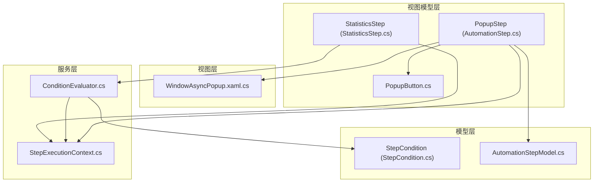
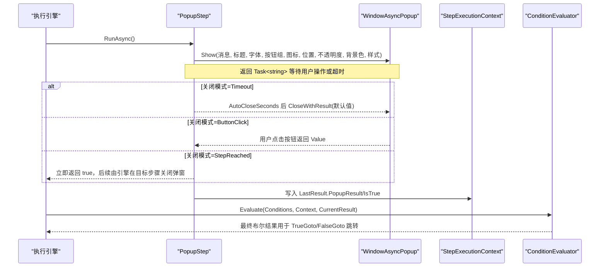
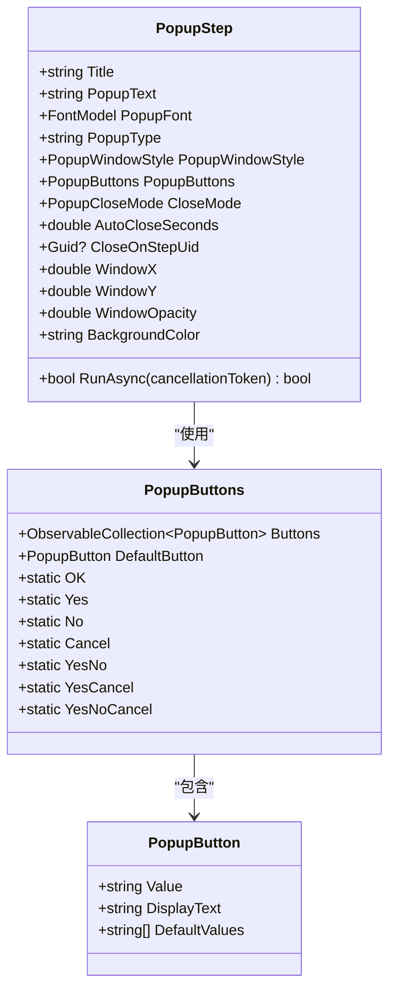
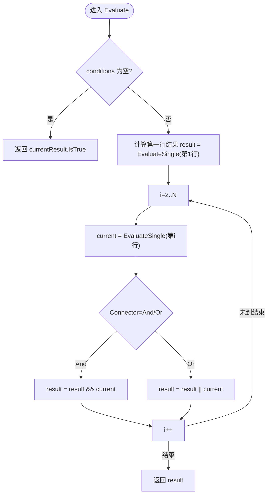
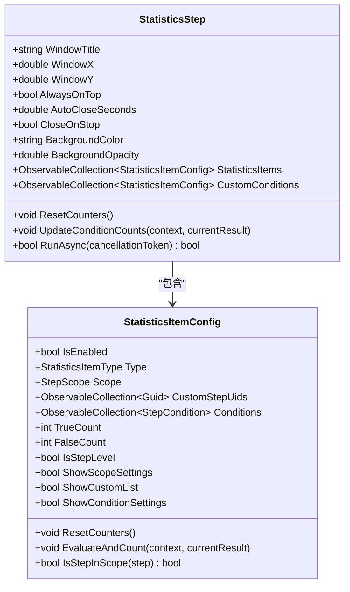
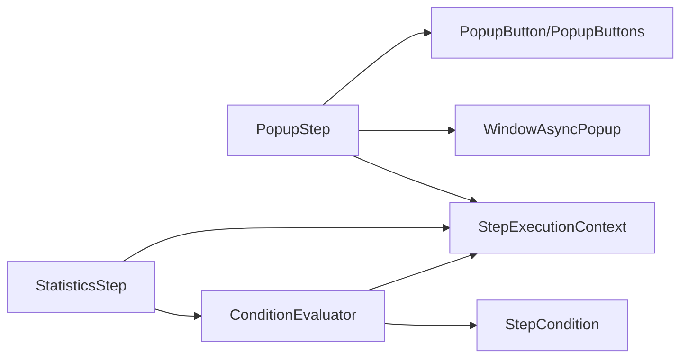

# 流程控制步骤

<cite>
**本文引用的文件**   
- [AutomationStep.cs](file://ShaoLu/Viewmodels/AutomationStep.cs)
- [StepCondition.cs](file://ShaoLu/Models/StepCondition.cs)
- [StatisticsStep.cs](file://ShaoLu/Viewmodels/StatisticsStep.cs)
- [ConditionEvaluator.cs](file://ShaoLu/Services/ConditionEvaluator.cs)
- [StepExecutionContext.cs](file://ShaoLu/Services/StepExecutionContext.cs)
- [PopupButton.cs](file://ShaoLu/Viewmodels/PopupButton.cs)
- [WindowAsyncPopup.xaml.cs](file://ShaoLu/Views/WindowAsyncPopup.xaml.cs)
- [AutomationStepModel.cs](file://ShaoLu/Models/AutomationStepModel.cs)
</cite>

## 目录
1. [简介](#简介)
2. [项目结构](#项目结构)
3. [核心组件](#核心组件)
4. [架构总览](#架构总览)
5. [详细组件分析](#详细组件分析)
6. [依赖关系分析](#依赖关系分析)
7. [性能考量](#性能考量)
8. [故障排查指南](#故障排查指南)
9. [结论](#结论)
10. [附录：使用示例与最佳实践](#附录使用示例与最佳实践)

## 简介
本技术文档聚焦 ShaoLu 的流程控制步骤类型，重点阐述以下能力：
- PopupStep 弹窗步骤的完整配置项：标题、富文本内容、字体样式、图标类型、按钮组、窗口样式（正常/紧凑）、位置与背景不透明度、关闭模式（点击按钮/超时自动关闭/到达指定步骤关闭）等。
- 条件判断机制 StepCondition：变量来源（当前步骤或引用其他步骤）、运算符（相等、包含、正则匹配、空值判断等）、逻辑连接器（AND/OR）、识别文本提取模式（整段、按行、从子串开始、从开头/末尾截取）。
- StatisticsStep 统计分析步骤：运行时统计窗口展示、统计项类型（总执行时间、步骤级时间与次数、结果、条件计数、当前执行步骤）、范围控制（全部/仅记录日志的步骤/自定义步骤集合）、条件计数规则与累计统计。
- 复杂业务流程控制示例：结合弹窗交互、条件分支、统计收集与异常处理，实现健壮的用户引导与自动化流程。

## 项目结构
围绕流程控制的关键代码分布在 Viewmodels、Models、Services、Views 四个层次：
- Viewmodels：步骤模型与 UI 命令（如 PopupStep、StatisticsStep、PopupButton）。
- Models：枚举与数据模型（StepType、StepErrorType、PopupCloseMode、PopupWindowStyle、StepCondition）。
- Services：执行上下文与条件评估器（StepExecutionContext、ConditionEvaluator）。
- Views：异步弹窗窗口（WindowAsyncPopup）。

图表来源
- [AutomationStep.cs:684-1069](file://ShaoLu/Viewmodels/AutomationStep.cs#L684-L1069)
- [StatisticsStep.cs:209-459](file://ShaoLu/Viewmodels/StatisticsStep.cs#L209-L459)
- [StepCondition.cs:103-405](file://ShaoLu/Models/StepCondition.cs#L103-L405)
- [ConditionEvaluator.cs:11-294](file://ShaoLu/Services/ConditionEvaluator.cs#L11-L294)
- [StepExecutionContext.cs:11-163](file://ShaoLu/Services/StepExecutionContext.cs#L11-L163)
- [PopupButton.cs:9-113](file://ShaoLu/Viewmodels/PopupButton.cs#L9-L113)
- [WindowAsyncPopup.xaml.cs:16-328](file://ShaoLu/Views/WindowAsyncPopup.xaml.cs#L16-L328)
- [AutomationStepModel.cs:9-73](file://ShaoLu/Models/AutomationStepModel.cs#L9-L73)

章节来源
- [AutomationStep.cs:684-1069](file://ShaoLu/Viewmodels/AutomationStep.cs#L684-L1069)
- [StatisticsStep.cs:209-459](file://ShaoLu/Viewmodels/StatisticsStep.cs#L209-L459)
- [StepCondition.cs:103-405](file://ShaoLu/Models/StepCondition.cs#L103-L405)
- [ConditionEvaluator.cs:11-294](file://ShaoLu/Services/ConditionEvaluator.cs#L11-L294)
- [StepExecutionContext.cs:11-163](file://ShaoLu/Services/StepExecutionContext.cs#L11-L163)
- [PopupButton.cs:9-113](file://ShaoLu/Viewmodels/PopupButton.cs#L9-L113)
- [WindowAsyncPopup.xaml.cs:16-328](file://ShaoLu/Views/WindowAsyncPopup.xaml.cs#L16-L328)
- [AutomationStepModel.cs:9-73](file://ShaoLu/Models/AutomationStepModel.cs#L9-L73)

## 核心组件
- PopupStep：负责显示非模态异步弹窗，支持多种关闭模式、外观定制、按钮组与结果回传。
- StepCondition：定义单条条件规则，包括变量来源、运算符、比较值、文本提取设置以及与其他行的逻辑连接方式。
- ConditionEvaluator：评估多条 StepCondition 组成的布尔表达式，支持正则匹配与文本预处理。
- StepExecutionContext：维护执行上下文，提供变量解析、步骤执行结果查询、执行次数与计时信息。
- StatisticsStep：在运行期间打开统计悬浮窗，展示总耗时、步骤级统计、结果与条件计数等，并支持自定义统计项。
- PopupButton / PopupButtons：定义按钮的值与显示文本，支持默认按钮与本地化显示。
- WindowAsyncPopup：WPF 异步弹窗窗口，支持富文本、图标、按钮动态生成、紧凑模式与外部触发关闭。

章节来源
- [AutomationStep.cs:684-1069](file://ShaoLu/Viewmodels/AutomationStep.cs#L684-L1069)
- [StepCondition.cs:103-405](file://ShaoLu/Models/StepCondition.cs#L103-L405)
- [ConditionEvaluator.cs:11-294](file://ShaoLu/Services/ConditionEvaluator.cs#L11-L294)
- [StepExecutionContext.cs:11-163](file://ShaoLu/Services/StepExecutionContext.cs#L11-L163)
- [StatisticsStep.cs:209-459](file://ShaoLu/Viewmodels/StatisticsStep.cs#L209-L459)
- [PopupButton.cs:9-113](file://ShaoLu/Viewmodels/PopupButton.cs#L9-L113)
- [WindowAsyncPopup.xaml.cs:16-328](file://ShaoLu/Views/WindowAsyncPopup.xaml.cs#L16-L328)

## 架构总览
PopupStep 与 StatisticsStep 作为流程控制的核心步骤，通过 StepExecutionContext 共享执行状态，并由 ConditionEvaluator 进行条件评估。弹窗由 WindowAsyncPopup 以非模态方式呈现，避免阻塞主线程；StatisticsStep 则通过 Dispatcher 确保 UI 线程安全地创建和激活统计窗口。

图表来源
- [AutomationStep.cs:888-1014](file://ShaoLu/Viewmodels/AutomationStep.cs#L888-L1014)
- [WindowAsyncPopup.xaml.cs:47-215](file://ShaoLu/Views/WindowAsyncPopup.xaml.cs#L47-L215)
- [StepExecutionContext.cs:112-160](file://ShaoLu/Services/StepExecutionContext.cs#L112-L160)
- [ConditionEvaluator.cs:23-51](file://ShaoLu/Services/ConditionEvaluator.cs#L23-L51)

## 详细组件分析

### PopupStep 弹窗步骤
- 标题与内容：Title、PopupText（富文本），支持字体 FontModel（族名、大小、粗细、斜体、颜色）。
- 图标类型：PopupType（None/Information/Warning/Error/Question）。
- 窗口样式：PopupWindowStyle（Normal/Compact），影响尺寸、边距与控件大小。
- 按钮组：PopupButtons（Buttons 列表、DefaultButton），按钮值常量 OK/Yes/No/Cancel，DisplayText 支持本地化。
- 关闭模式：CloseMode（ButtonClick/Timeout/StepReached），Timeout 模式下 AutoCloseSeconds 秒自动关闭；StepReached 模式下不等待关闭，由执行引擎在指定步骤关闭。
- 外观定位：WindowX/WindowY（-1 表示居中）、WindowOpacity（0~100%）、BackgroundColor（十六进制）。
- 执行行为：RunAsync 启动异步弹窗任务，根据关闭模式处理超时与取消令牌，设置 IsTrue（当结果为 Yes 时为真）与 LastResult.PopupResult。

图表来源
- [AutomationStep.cs:684-886](file://ShaoLu/Viewmodels/AutomationStep.cs#L684-L886)
- [PopupButton.cs:9-113](file://ShaoLu/Viewmodels/PopupButton.cs#L9-L113)

章节来源
- [AutomationStep.cs:684-1069](file://ShaoLu/Viewmodels/AutomationStep.cs#L684-L1069)
- [PopupButton.cs:9-113](file://ShaoLu/Viewmodels/PopupButton.cs#L9-L113)
- [WindowAsyncPopup.xaml.cs:47-215](file://ShaoLu/Views/WindowAsyncPopup.xaml.cs#L47-L215)

### 条件判断机制 StepCondition
- 条件模式：ConditionMode（Default/Custom）。Default 使用步骤自身执行结果；Custom 使用用户配置的规则行。
- 变量来源：ConditionVariable（Self_* 与 Step_* 系列，含 IsTrue/Similarity/ExecutionTimeMs/ClickX/ClickY/OCRText/PopupResult/Triggered）。
- 运算符：ConditionOperator（Equal/NotEqual/GreaterThan/LessThan/GreaterOrEqual/LessOrEqual/Contains/NotContains/IsEmpty/IsNotEmpty/RegexMatch）。
- 逻辑连接器：LogicConnector（And/Or），多行条件按前一行 Connector 组合。
- 文本提取：TextExtractMode（Whole/Lines/FromSubstring/FromStart/FromEnd），配合 ExtractLines/ExtractMarker/ExtractLength 对 OCR 文本预处理。
- 评估流程：ConditionEvaluator.Evaluate 依次评估各行，ApplyTextExtraction 预处理文本，Compare 执行比较，异常时记录警告并返回 false。

图表来源
- [ConditionEvaluator.cs:23-51](file://ShaoLu/Services/ConditionEvaluator.cs#L23-L51)
- [StepCondition.cs:103-405](file://ShaoLu/Models/StepCondition.cs#L103-L405)

章节来源
- [StepCondition.cs:103-405](file://ShaoLu/Models/StepCondition.cs#L103-L405)
- [ConditionEvaluator.cs:11-294](file://ShaoLu/Services/ConditionEvaluator.cs#L11-L294)
- [StepExecutionContext.cs:112-160](file://ShaoLu/Services/StepExecutionContext.cs#L112-L160)

### StatisticsStep 统计分析步骤
- 统计项类型：StatisticsItemType（TotalExecutionTime/StepExecutionTime/StepExecutionCount/StepExecutionResult/ConditionCount/CurrentStep）。
- 范围控制：StepScope（All/LoggedOnly/Custom），Custom 需选择步骤 Uid 集合。
- 条件计数：StatisticsItemConfig.Conditions 使用 StepCondition 规则，EvaluateAndCount 调用 ConditionEvaluator 评估并累计 TrueCount/FalseCount。
- 窗口属性：WindowTitle、WindowX/Y、AlwaysOnTop、AutoCloseSeconds、CloseOnStop、BackgroundColor、BackgroundOpacity。
- 执行行为：RunAsync 在 UI 线程查找或创建 WindowStatistics，若已存在则激活；成功为 true，失败为 false，并设置 LastResult。

图表来源
- [StatisticsStep.cs:209-459](file://ShaoLu/Viewmodels/StatisticsStep.cs#L209-L459)

章节来源
- [StatisticsStep.cs:209-459](file://ShaoLu/Viewmodels/StatisticsStep.cs#L209-L459)

### 执行上下文与变量解析
- StepExecutionContext 维护步骤执行结果字典（按行号与 Uid）、执行次数、总计时、当前与正在执行的步骤 Uid。
- ResolveVariable 根据 ConditionVariable 解析实际值，支持 Self_* 与 Step_* 系列变量，Step_Triggered 仅在引用步骤刚刚执行完成时为真。
- SetResult/SetResultByUid 更新结果与执行次数，GetStepTime/GetStepCount/GetStepResult 提供统计查询。

章节来源
- [StepExecutionContext.cs:11-163](file://ShaoLu/Services/StepExecutionContext.cs#L11-L163)

### 弹窗窗口 WindowAsyncPopup
- 非模态显示：Show 方法返回 (Window, Task<string>)，不阻塞调用线程。
- 外观定制：支持背景颜色与不透明度、无边框拖拽移动、图标缓存提升性能。
- 按钮生成：CreateButtons 动态生成按钮，默认按钮响应 Enter 键。
- 外部关闭：CloseWithResult 供超时或 StepReached 模式触发关闭并设置结果。

章节来源
- [WindowAsyncPopup.xaml.cs:16-328](file://ShaoLu/Views/WindowAsyncPopup.xaml.cs#L16-L328)

## 依赖关系分析
- PopupStep 依赖 WindowAsyncPopup 进行 UI 展示，依赖 PopupButtons/PopupButton 定义按钮行为，依赖 StepExecutionContext 写入执行结果。
- StatisticsStep 依赖 StepExecutionContext 获取执行上下文，依赖 ConditionEvaluator 评估条件计数规则。
- ConditionEvaluator 依赖 StepCondition 与 StepExecutionContext 进行变量解析与比较。
- 所有步骤继承自 AutomationStepBase，具备统一的 Name/Description/Type/WaitTime/TrueGotoUid/FalseGotoUid/EnableLog/SelfReferenceLimit 等属性。

图表来源
- [AutomationStep.cs:684-1069](file://ShaoLu/Viewmodels/AutomationStep.cs#L684-L1069)
- [StatisticsStep.cs:209-459](file://ShaoLu/Viewmodels/StatisticsStep.cs#L209-L459)
- [ConditionEvaluator.cs:11-294](file://ShaoLu/Services/ConditionEvaluator.cs#L11-L294)
- [StepExecutionContext.cs:11-163](file://ShaoLu/Services/StepExecutionContext.cs#L11-L163)
- [PopupButton.cs:9-113](file://ShaoLu/Viewmodels/PopupButton.cs#L9-L113)
- [WindowAsyncPopup.xaml.cs:16-328](file://ShaoLu/Views/WindowAsyncPopup.xaml.cs#L16-L328)

章节来源
- [AutomationStep.cs:684-1069](file://ShaoLu/Viewmodels/AutomationStep.cs#L684-L1069)
- [StatisticsStep.cs:209-459](file://ShaoLu/Viewmodels/StatisticsStep.cs#L209-L459)
- [ConditionEvaluator.cs:11-294](file://ShaoLu/Services/ConditionEvaluator.cs#L11-L294)
- [StepExecutionContext.cs:11-163](file://ShaoLu/Services/StepExecutionContext.cs#L11-L163)
- [PopupButton.cs:9-113](file://ShaoLu/Viewmodels/PopupButton.cs#L9-L113)
- [WindowAsyncPopup.xaml.cs:16-328](file://ShaoLu/Views/WindowAsyncPopup.xaml.cs#L16-L328)

## 性能考量
- 弹窗图标缓存：WindowAsyncPopup 静态构造预加载系统图标，减少 GDI+ 到 WPF 转换开销。
- 非模态弹窗：避免阻塞主线程，允许停止按钮等事件响应。
- 条件评估优化：EvaluateSingle 捕获异常并记录警告，避免单次评估失败影响整体流程。
- 统计窗口复用：StatisticsStep 在同一 UID 下仅创建一个窗口，重复执行时直接激活。

[本节为通用指导，无需特定文件来源]

## 故障排查指南
- 弹窗未关闭或卡住：检查 CloseMode 与 AutoCloseSeconds 配置；确认 StepReached 模式下是否设置了 CloseOnStepUid；确保取消令牌正确注册并在需要时关闭窗口。
- 条件评估结果为假：检查 StepCondition.Variable 与 Operator 是否匹配数据类型；对于 OCR 文本变量，确认 TextExtractMode 与提取参数是否正确；查看 ConditionEvaluator 的日志警告。
- 统计窗口未显示：确认 UI 线程调用；检查 WindowStatistics 是否存在且可创建；验证 StatisticsItems 是否启用。
- 执行结果异常：查看 StepExecutionResult.LastResult 与 ErrorType；检查 IsTrue 与 PopupResult 是否符合预期。

章节来源
- [AutomationStep.cs:888-1014](file://ShaoLu/Viewmodels/AutomationStep.cs#L888-L1014)
- [ConditionEvaluator.cs:78-83](file://ShaoLu/Services/ConditionEvaluator.cs#L78-L83)
- [StatisticsStep.cs:414-456](file://ShaoLu/Viewmodels/StatisticsStep.cs#L414-L456)

## 结论
PopupStep 与 StatisticsStep 构成了 ShaoLu 流程控制的核心：前者提供灵活的弹窗交互与关闭策略，后者提供运行时统计与条件计数能力。结合 StepCondition 与 ConditionEvaluator，可实现复杂的条件分支与业务逻辑。通过 StepExecutionContext 共享执行状态，各步骤之间可相互引用与协作，形成健壮的自动化流程。

[本节为总结性内容，无需特定文件来源]

## 附录：使用示例与最佳实践

### 示例一：用户确认流程（PopupStep + 条件分支）
- 配置 PopupStep：
  - Title：提示标题
  - PopupText：富文本说明
  - PopupType：Question
  - PopupButtons：Yes/No，默认 Yes
  - CloseMode：ButtonClick
- 条件判断：
  - 使用 StepCondition：Variable=Self_PopupResult，Operator=Equal，Value=Yes
  - TrueGotoUid：继续下一步骤
  - FalseGotoUid：终止或重试步骤
- 最佳实践：
  - 使用本地化 DisplayText 提升用户体验
  - 合理设置 WaitTime，避免频繁弹窗

章节来源
- [AutomationStep.cs:888-1014](file://ShaoLu/Viewmodels/AutomationStep.cs#L888-L1014)
- [StepCondition.cs:103-405](file://ShaoLu/Models/StepCondition.cs#L103-L405)

### 示例二：超时自动关闭与统计（PopupStep + StatisticsStep）
- 配置 PopupStep：
  - CloseMode：Timeout，AutoCloseSeconds=5
  - PopupButtons：OK/Cancel
- 配置 StatisticsStep：
  - StatisticsItems：启用 TotalExecutionTime、StepExecutionTime、StepExecutionCount
  - Scope：LoggedOnly 或 Custom
- 执行流程：
  - 弹窗 5 秒后自动关闭，默认返回 OK
  - 统计窗口展示执行时间与次数

章节来源
- [AutomationStep.cs:955-977](file://ShaoLu/Viewmodels/AutomationStep.cs#L955-L977)
- [StatisticsStep.cs:220-227](file://ShaoLu/Viewmodels/StatisticsStep.cs#L220-L227)

### 示例三：复杂条件组合（StepCondition + LogicConnector）
- 条件行 1：Variable=Self_IsTrue，Operator=Equal，Value=true，Connector=And
- 条件行 2：Variable=Step_OCRText，Operator=Contains，Value=“错误”，Connector=Or
- 条件行 3：Variable=Step_ExecutionTimeMs，Operator=GreaterThan，Value=1000
- 评估结果：按 And/Or 组合计算最终布尔值

章节来源
- [ConditionEvaluator.cs:23-51](file://ShaoLu/Services/ConditionEvaluator.cs#L23-L51)
- [StepCondition.cs:103-405](file://ShaoLu/Models/StepCondition.cs#L103-L405)

### 示例四：统计条件计数（StatisticsItemConfig + StepCondition）
- 启用 ConditionCount 统计项
- 添加条件行：Variable=Step_Triggered，Operator=Equal，Value=true
- 每次步骤执行后，EvaluateAndCount 评估并累计 TrueCount/FalseCount

章节来源
- [StatisticsStep.cs:184-190](file://ShaoLu/Viewmodels/StatisticsStep.cs#L184-L190)
- [StepExecutionContext.cs:153-156](file://ShaoLu/Services/StepExecutionContext.cs#L153-L156)