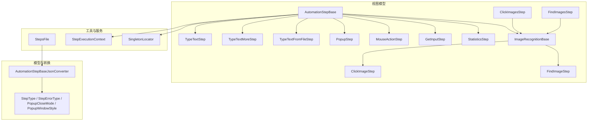
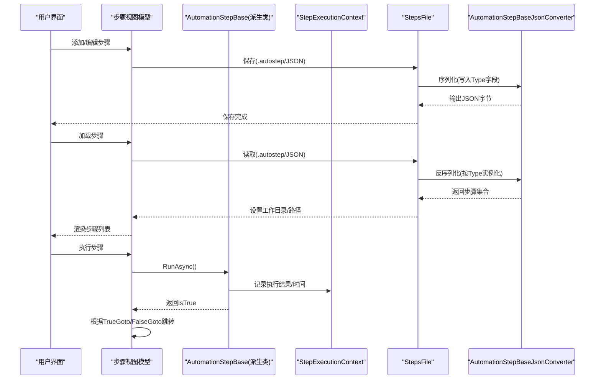
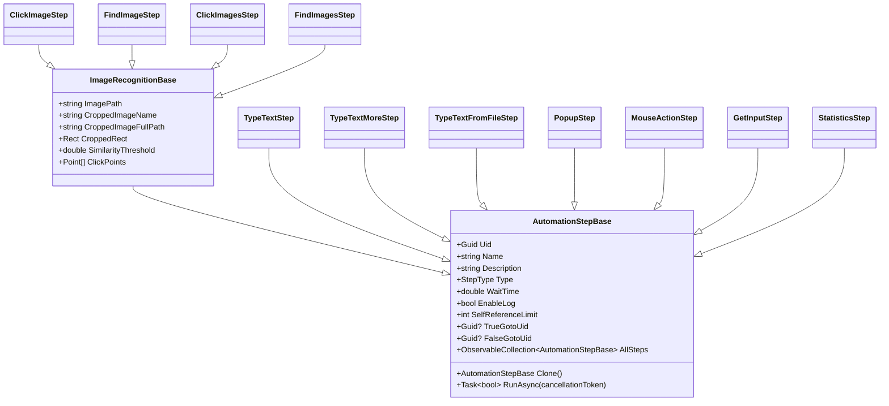
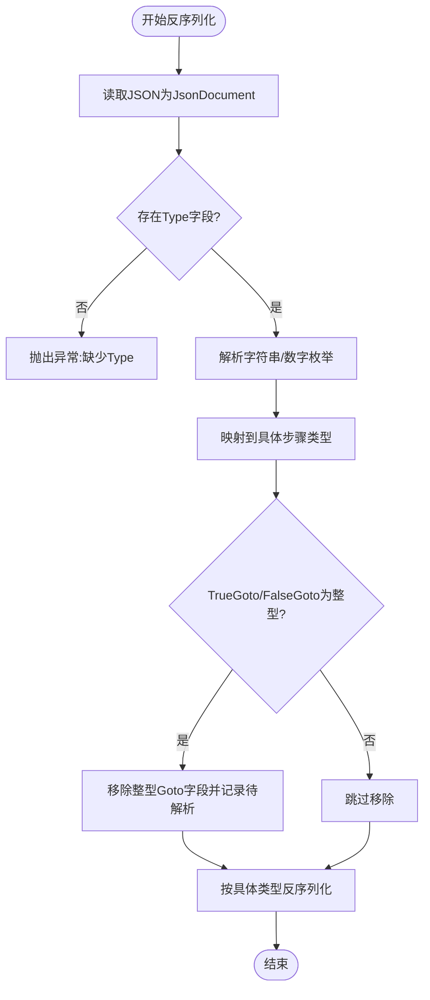
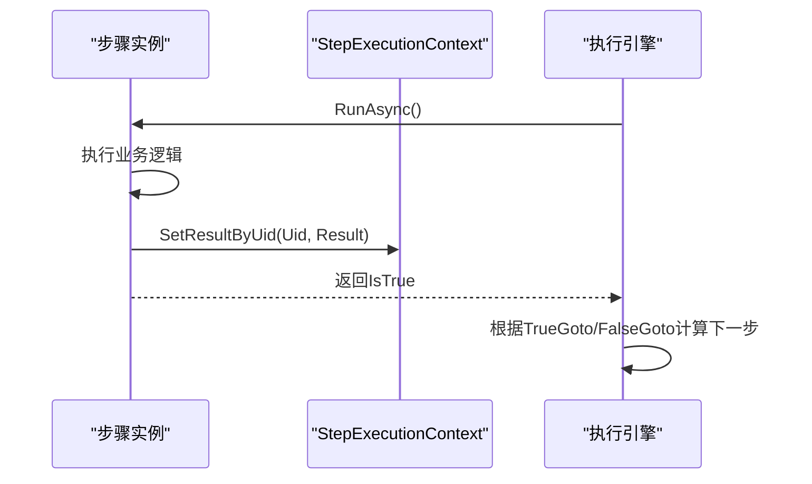
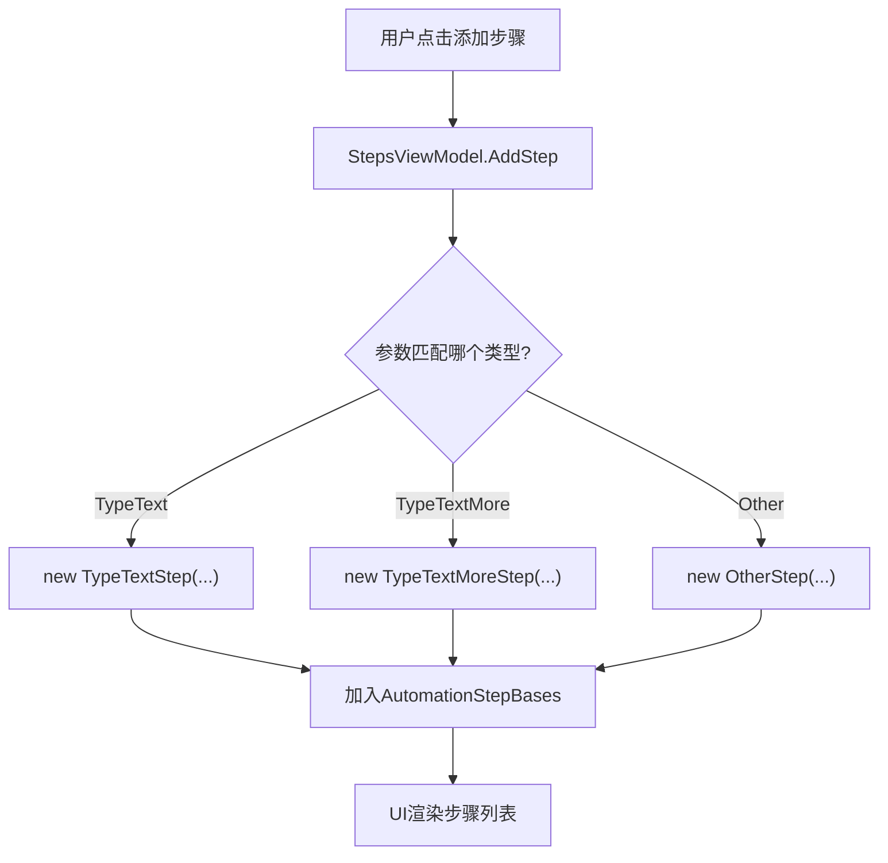
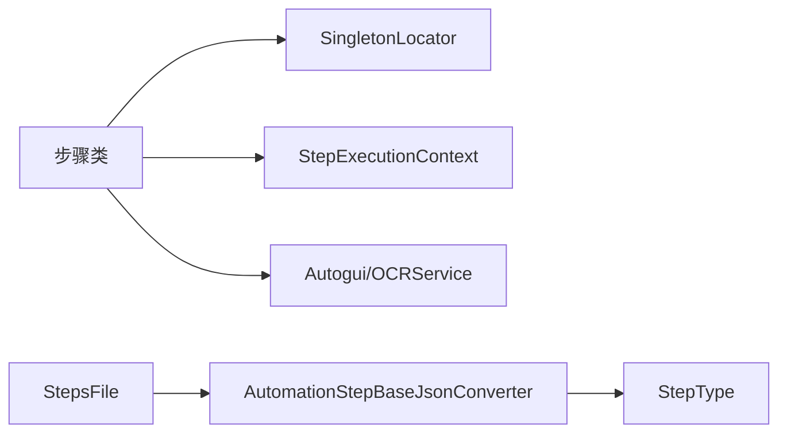

# 自定义步骤开发

<cite>
**本文引用的文件**   
- [AutomationStep.cs](file://ShaoLu/Viewmodels/AutomationStep.cs)
- [AutomationStepModel.cs](file://ShaoLu/Models/AutomationStepModel.cs)
- [AutomationStepJsonConverter.cs](file://ShaoLu/Converters/AutomationStepJsonConverter.cs)
- [StepsFile.cs](file://ShaoLu/Utils/StepsFile.cs)
- [StepExecutionContext.cs](file://ShaoLu/Services/StepExecutionContext.cs)
- [MouseActionStep.cs](file://ShaoLu/Viewmodels/MouseActionStep.cs)
- [GetInputStep.cs](file://ShaoLu/Viewmodels/GetInputStep.cs)
- [StatisticsStep.cs](file://ShaoLu/Viewmodels/StatisticsStep.cs)
- [ImageRecognition.cs](file://ShaoLu/Viewmodels/ImageRecognition.cs)
- [ImagesRecognition.cs](file://ShaoLu/Viewmodels/ImagesRecognition.cs)
- [SingletonLocator.cs](file://ShaoLu/Utils/SingletonLocator.cs)
- [StepDetailTemplates.xaml](file://ShaoLu/Templates/StepDetailTemplates.xaml)
- [AutomationStepTests.cs](file://NUnitTest/AutomationStepTests.cs)
</cite>

## 目录
1. [简介](#简介)
2. [项目结构](#项目结构)
3. [核心组件](#核心组件)
4. [架构总览](#架构总览)
5. [详细组件分析](#详细组件分析)
6. [依赖关系分析](#依赖关系分析)
7. [性能考虑](#性能考虑)
8. [故障排查指南](#故障排查指南)
9. [结论](#结论)
10. [附录：从零创建自定义步骤的完整示例](#附录从零创建自定义步骤的完整示例)

## 简介
本指南面向希望在 ShaoLu 中扩展自动化流程的用户与开发者，系统讲解如何基于 AutomationStepBase 创建自定义步骤类型，包括必需方法、属性定义、JSON 序列化配置、UI 模板绑定以及步骤注册机制。文档同时提供单元测试与调试技巧，帮助快速验证新步骤的正确性与稳定性。

## 项目结构
ShaoLu 将“步骤”抽象为可序列化的对象模型，并通过统一的执行上下文进行运行期数据共享。关键目录与职责如下：
- Viewmodels/AutomationStep.cs：步骤基类与多种内置步骤实现（文本输入、弹窗、统计等）
- Models/AutomationStepModel.cs：步骤类型枚举、错误类型枚举、弹窗相关枚举
- Converters/AutomationStepJsonConverter.cs：多态 JSON 转换器，负责按 StepType 反序列化为具体步骤类
- Utils/StepsFile.cs：步骤集合的保存/加载（支持 .autostep 压缩包与兼容 JSON），并处理旧格式 Goto 行号到 Uid 的迁移
- Services/StepExecutionContext.cs：运行时执行结果缓存、变量解析、计时与计数
- Viewmodels/MouseActionStep.cs、GetInputStep.cs、StatisticsStep.cs：鼠标操作、OCR/屏幕文本获取、统计窗口展示等步骤
- Viewmodels/ImageRecognition.cs、ImagesRecognition.cs：图像识别相关步骤（点击/查找图片）
- Utils/SingletonLocator.cs：全局服务定位器（用于访问 MainViewModel、StepsViewModel 等）
- Templates/StepDetailTemplates.xaml：步骤详情 UI 模板（Goto 跳转、条件规则等）
- NUnitTest/AutomationStepTests.cs：步骤类的单元测试样例

图表来源 
- [AutomationStep.cs:25-296](file://ShaoLu/Viewmodels/AutomationStep.cs#L25-L296)
- [AutomationStepModel.cs:9-73](file://ShaoLu/Models/AutomationStepModel.cs#L9-L73)
- [AutomationStepJsonConverter.cs:14-185](file://ShaoLu/Converters/AutomationStepJsonConverter.cs#L14-L185)
- [StepsFile.cs:15-244](file://ShaoLu/Utils/StepsFile.cs#L15-L244)
- [StepExecutionContext.cs:11-163](file://ShaoLu/Services/StepExecutionContext.cs#L11-L163)
- [ImageRecognition.cs:21-200](file://ShaoLu/Viewmodels/ImageRecognition.cs#L21-L200)
- [ImagesRecognition.cs:47-200](file://ShaoLu/Viewmodels/ImagesRecognition.cs#L47-L200)

章节来源
- [AutomationStep.cs:25-296](file://ShaoLu/Viewmodels/AutomationStep.cs#L25-L296)
- [AutomationStepModel.cs:9-73](file://ShaoLu/Models/AutomationStepModel.cs#L9-L73)
- [AutomationStepJsonConverter.cs:14-185](file://ShaoLu/Converters/AutomationStepJsonConverter.cs#L14-L185)
- [StepsFile.cs:15-244](file://ShaoLu/Utils/StepsFile.cs#L15-L244)
- [StepExecutionContext.cs:11-163](file://ShaoLu/Services/StepExecutionContext.cs#L11-L163)
- [ImageRecognition.cs:21-200](file://ShaoLu/Viewmodels/ImageRecognition.cs#L21-L200)
- [ImagesRecognition.cs:47-200](file://ShaoLu/Viewmodels/ImagesRecognition.cs#L47-L200)

## 核心组件
- 步骤基类 AutomationStepBase
  - 提供通用属性：Uid、Name、Description、Type、WaitTime、TrueGotoUid、FalseGotoUid、EnableLog、Conditions、SelfReferenceLimit、LastResult 等
  - 抽象方法：Clone()、RunAsync(CancellationToken)
  - 辅助能力：AllSteps/GotoPlaceholder（供 UI 下拉选择跳转目标）、条件命令 AddConditionCommand/RemoveConditionCommand
- 步骤类型枚举 StepType
  - 包含 Empty、ClickImage、FindImage、ClickImages、FindImages、TypeText、TypeTextMore、TypeTextFromFile、GetInput、MouseAction、Statistics、Popup 等
- JSON 多态转换器 AutomationStepBaseJsonConverter
  - 根据 JSON 中的 Type 字段映射到具体步骤类型，支持字符串或数字枚举
  - 兼容旧版 TrueGoto/FalseGoto 为整型行号的格式，并在反序列化后统一解析为 Uid
- 步骤持久化 StepsFile
  - SaveAsAutoStepPackage/LoadFromAutoStepPackage：打包 steps.json 与裁剪图片到 .autostep
  - 兼容旧 JSON 格式的 LoadStepsFromJson/SaveStepsToJson（已标记废弃）
- 执行上下文 StepExecutionContext
  - 存储每个步骤的执行结果（按行号与 Uid 索引）、当前步骤 UID、总耗时、次数统计
  - ResolveVariable：解析条件变量（如 Self_*、Step_*、Step_Triggered）

章节来源
- [AutomationStep.cs:25-296](file://ShaoLu/Viewmodels/AutomationStep.cs#L25-L296)
- [AutomationStepModel.cs:9-73](file://ShaoLu/Models/AutomationStepModel.cs#L9-L73)
- [AutomationStepJsonConverter.cs:14-185](file://ShaoLu/Converters/AutomationStepJsonConverter.cs#L14-L185)
- [StepsFile.cs:15-244](file://ShaoLu/Utils/StepsFile.cs#L15-L244)
- [StepExecutionContext.cs:11-163](file://ShaoLu/Services/StepExecutionContext.cs#L11-L163)

## 架构总览
下图展示了从 UI 触发步骤执行到 JSON 序列化/反序列化的整体流程，以及步骤之间的跳转与条件判断。

图表来源 
- [StepsFile.cs:40-119](file://ShaoLu/Utils/StepsFile.cs#L40-L119)
- [AutomationStepJsonConverter.cs:32-139](file://ShaoLu/Converters/AutomationStepJsonConverter.cs#L32-L139)
- [StepExecutionContext.cs:39-103](file://ShaoLu/Services/StepExecutionContext.cs#L39-L103)
- [AutomationStep.cs:288-296](file://ShaoLu/Viewmodels/AutomationStep.cs#L288-L296)

## 详细组件分析

### 步骤基类与继承模式
- 所有步骤均继承自 AutomationStepBase，必须实现 Clone() 与 RunAsync(CancellationToken)
- 常用属性：
  - 标识与元信息：Uid、Name、Description、Type
  - 执行控制：WaitTime、EnableLog、SelfReferenceLimit、SelfReferenceCount
  - 流程控制：TrueGotoUid、FalseGotoUid、AllSteps、GotoPlaceholder
  - 条件与日志：ConditionMode、Conditions、AddConditionCommand、RemoveConditionCommand
  - 运行期状态：IsNeed、IsSave、IsError、ErrorMessage、ErrorType、LastResult
- 图像识别步骤通常继承 ImageRecognitionBase，获得图片路径、裁剪图、相似度阈值、点击点等能力

图表来源 
- [AutomationStep.cs:25-296](file://ShaoLu/Viewmodels/AutomationStep.cs#L25-L296)
- [ImageRecognition.cs:21-200](file://ShaoLu/Viewmodels/ImageRecognition.cs#L21-L200)
- [ImagesRecognition.cs:47-200](file://ShaoLu/Viewmodels/ImagesRecognition.cs#L47-L200)

章节来源
- [AutomationStep.cs:25-296](file://ShaoLu/Viewmodels/AutomationStep.cs#L25-L296)
- [ImageRecognition.cs:21-200](file://ShaoLu/Viewmodels/ImageRecognition.cs#L21-L200)
- [ImagesRecognition.cs:47-200](file://ShaoLu/Viewmodels/ImagesRecognition.cs#L47-L200)

### JSON 序列化与多态转换
- 使用 System.Text.Json 的 JsonConverter<AutomationStepBase> 实现多态序列化
- 读取时：
  - 解析 Type 字段（支持字符串或数字枚举）
  - 根据映射表实例化具体步骤类型
  - 兼容旧格式：若 TrueGoto/FalseGoto 为整型行号，则移除该字段并记录待解析映射，后续由 StepsFile 统一解析为 Uid
- 写入时：
  - 直接序列化具体类型对象，保留派生类属性
- 注意事项：
  - 非序列化属性使用 [JsonIgnore]
  - 某些集合属性可使用自定义转换器（如 ContentItemCollectionConverter）

图表来源 
- [AutomationStepJsonConverter.cs:32-139](file://ShaoLu/Converters/AutomationStepJsonConverter.cs#L32-L139)
- [StepsFile.cs:226-242](file://ShaoLu/Utils/StepsFile.cs#L226-L242)

章节来源
- [AutomationStepJsonConverter.cs:14-185](file://ShaoLu/Converters/AutomationStepJsonConverter.cs#L14-L185)
- [StepsFile.cs:15-244](file://ShaoLu/Utils/StepsFile.cs#L15-L244)

### 步骤执行与上下文
- 每个步骤在 RunAsync 中执行具体逻辑，设置 IsTrue、IsError、ErrorType，并填充 LastResult
- StepExecutionContext 维护：
  - SetResult/SetResultByUid：记录步骤执行结果
  - GetResult/GetResultByUid：查询结果
  - ResolveVariable：解析条件变量（Self_*、Step_*、Step_Triggered）
- 执行完成后，可根据 TrueGotoUid/FalseGotoUid 决定下一步跳转

图表来源 
- [StepExecutionContext.cs:39-103](file://ShaoLu/Services/StepExecutionContext.cs#L39-L103)
- [AutomationStep.cs:288-296](file://ShaoLu/Viewmodels/AutomationStep.cs#L288-L296)

章节来源
- [StepExecutionContext.cs:11-163](file://ShaoLu/Services/StepExecutionContext.cs#L11-L163)
- [AutomationStep.cs:288-296](file://ShaoLu/Viewmodels/AutomationStep.cs#L288-L296)

### UI 模板与步骤注册
- UI 模板 StepDetailTemplates.xaml 提供通用的 Goto 面板与条件规则模板，通过 AllSteps 与 LineNo 显示步骤列表与行号
- 步骤注册：
  - 在 StepsViewModel 中根据参数创建具体步骤实例并加入 AutomationStepBases 集合
  - 新增步骤类型需在 Switch 分支中添加映射，以便 UI 能创建对应实例
  - JSON 转换器需更新 StepType 到具体类型的映射表

图表来源 
- [StepDetailTemplates.xaml:16-73](file://ShaoLu/Templates/StepDetailTemplates.xaml#L16-L73)
- [AutomationStep.cs:160-174](file://ShaoLu/Viewmodels/AutomationStep.cs#L160-L174)

章节来源
- [StepDetailTemplates.xaml:16-73](file://ShaoLu/Templates/StepDetailTemplates.xaml#L16-L73)
- [AutomationStep.cs:160-174](file://ShaoLu/Viewmodels/AutomationStep.cs#L160-L174)

### 典型步骤实现要点
- TypeTextStep/TypeTextMoreStep/TypeTextFromFileStep：文本输入，注意 DelayBetweenKeys、WaitTime、Contents 等属性的序列化与克隆
- PopupStep：弹窗样式、关闭模式、位置与背景色配置，ActivePopupWindow 用于 StepReached 模式
- MouseActionStep：绝对坐标/当前位置模式，动作序列执行
- GetInputStep：OCR 区域或屏幕文本点读取，OCRResultFull 与预览
- StatisticsStep：统计项配置、条件计数、窗口置顶与自动关闭
- ImageRecognitionBase/ClickImageStep/FindImageStep：图像识别、相似度阈值、点击点、OCR 矩形

章节来源
- [AutomationStep.cs:300-680](file://ShaoLu/Viewmodels/AutomationStep.cs#L300-L680)
- [MouseActionStep.cs:29-162](file://ShaoLu/Viewmodels/MouseActionStep.cs#L29-L162)
- [GetInputStep.cs:29-294](file://ShaoLu/Viewmodels/GetInputStep.cs#L29-L294)
- [StatisticsStep.cs:209-459](file://ShaoLu/Viewmodels/StatisticsStep.cs#L209-L459)
- [ImageRecognition.cs:329-477](file://ShaoLu/Viewmodels/ImageRecognition.cs#L329-L477)
- [ImagesRecognition.cs:71-206](file://ShaoLu/Viewmodels/ImagesRecognition.cs#L71-L206)

## 依赖关系分析
- 步骤类依赖：
  - SingletonLocator：访问 MainViewModel、StepsViewModel、Settings 等
  - StepExecutionContext：记录执行结果与变量解析
  - Autogui/OCRService：底层交互与 OCR 能力
- 序列化依赖：
  - StepsFile：使用 JsonSerializerOptions 注册 AutomationStepBaseJsonConverter
  - AutomationStepBaseJsonConverter：依赖 StepType 枚举映射

图表来源 
- [SingletonLocator.cs:8-18](file://ShaoLu/Utils/SingletonLocator.cs#L8-L18)
- [StepsFile.cs:18-32](file://ShaoLu/Utils/StepsFile.cs#L18-L32)
- [AutomationStepJsonConverter.cs:87-104](file://ShaoLu/Converters/AutomationStepJsonConverter.cs#L87-L104)

章节来源
- [SingletonLocator.cs:8-18](file://ShaoLu/Utils/SingletonLocator.cs#L8-L18)
- [StepsFile.cs:18-32](file://ShaoLu/Utils/StepsFile.cs#L18-L32)
- [AutomationStepJsonConverter.cs:87-104](file://ShaoLu/Converters/AutomationStepJsonConverter.cs#L87-L104)

## 性能考虑
- 序列化选项复用：StepsFile 中静态缓存 _writeOptions/_readOptions，避免重复创建开销
- 异步执行：RunAsync 中使用 Task.Delay 与 Task.Run 避免阻塞 UI 线程
- 资源释放：ImageRecognitionBase 实现 IDisposable，避免内存泄漏
- 条件评估与统计：StepExecutionContext 与 StatisticsStep 对计数与结果进行集中管理，减少重复计算

[本节为通用指导，不直接分析具体文件]

## 故障排查指南
- JSON 反序列化失败
  - 检查 Type 字段是否存在且值合法
  - 确认旧格式 TrueGoto/FalseGoto 是否为整型，确保转换器已移除并延迟解析
- 步骤未出现在 UI
  - 确认 StepsViewModel.AddStep 的 switch 分支是否包含新类型
  - 确认 AutomationStepBaseJsonConverter 的类型映射是否包含新 StepType
- 执行结果为空或错误
  - 检查 RunAsync 是否正确设置 IsTrue、IsError、ErrorType 与 LastResult
  - 查看 StepExecutionContext 中 SetResultByUid 是否被调用
- OCR 区域未选择或为空
  - GetInputStep 会返回 OCRError，确保 OCRRegion 有效

章节来源
- [AutomationStepJsonConverter.cs:32-139](file://ShaoLu/Converters/AutomationStepJsonConverter.cs#L32-L139)
- [GetInputStep.cs:184-222](file://ShaoLu/Viewmodels/GetInputStep.cs#L184-L222)
- [StepExecutionContext.cs:39-103](file://ShaoLu/Services/StepExecutionContext.cs#L39-L103)

## 结论
通过继承 AutomationStepBase 并实现 Clone 与 RunAsync，结合 StepType 枚举与 JSON 转换器，即可在 ShaoLu 中无缝扩展新的步骤类型。配合 StepsFile 的打包/加载与 StepExecutionContext 的运行期数据管理，可实现稳定、可维护的自动化流程。建议在新增步骤时同步完善单元测试与 UI 模板绑定，确保功能可用性与用户体验。

[本节为总结性内容，不直接分析具体文件]

## 附录：从零创建自定义步骤的完整示例
以下以“自定义文本拼接步骤”为例，说明从建模到测试的完整流程（仅给出路径引用，不直接展示代码内容）：

- 定义步骤类型
  - 在 StepType 枚举中添加新类型（例如 CustomConcatText）
  - 参考路径：[AutomationStepModel.cs:9-24](file://ShaoLu/Models/AutomationStepModel.cs#L9-L24)

- 创建步骤类
  - 新建类继承 AutomationStepBase，实现 Clone() 与 RunAsync(CancellationToken)
  - 定义必要属性（如 Prefix、Infix、Suffix、DelayBetweenKeys、WaitTime 等）
  - 参考路径：
    - [AutomationStep.cs:300-365](file://ShaoLu/Viewmodels/AutomationStep.cs#L300-L365)
    - [AutomationStep.cs:367-516](file://ShaoLu/Viewmodels/AutomationStep.cs#L367-L516)

- 注册步骤到 UI
  - 在 StepsViewModel.AddStep 的 switch 分支中添加新类型映射
  - 参考路径：[StepsViewModel.cs:186-201](file://ShaoLu/Viewmodels/StepsViewModel.cs#L186-L201)

- 配置 JSON 序列化
  - 在 AutomationStepBaseJsonConverter 的类型映射中添加新 StepType
  - 参考路径：[AutomationStepJsonConverter.cs:87-104](file://ShaoLu/Converters/AutomationStepJsonConverter.cs#L87-L104)

- 编写单元测试
  - 验证构造函数默认值、Clone 独立性、属性组合行为
  - 参考路径：[AutomationStepTests.cs:19-116](file://NUnitTest/AutomationStepTests.cs#L19-L116)

- 调试技巧
  - 在 RunAsync 中设置断点，观察 IsTrue、IsError、ErrorType 与 LastResult
  - 使用 StepExecutionContext 查询执行结果与变量解析
  - 参考路径：[StepExecutionContext.cs:112-160](file://ShaoLu/Services/StepExecutionContext.cs#L112-L160)

章节来源
- [AutomationStepModel.cs:9-24](file://ShaoLu/Models/AutomationStepModel.cs#L9-L24)
- [AutomationStep.cs:300-516](file://ShaoLu/Viewmodels/AutomationStep.cs#L300-L516)
- [StepsViewModel.cs:186-201](file://ShaoLu/Viewmodels/StepsViewModel.cs#L186-L201)
- [AutomationStepJsonConverter.cs:87-104](file://ShaoLu/Converters/AutomationStepJsonConverter.cs#L87-L104)
- [AutomationStepTests.cs:19-116](file://NUnitTest/AutomationStepTests.cs#L19-L116)
- [StepExecutionContext.cs:112-160](file://ShaoLu/Services/StepExecutionContext.cs#L112-L160)