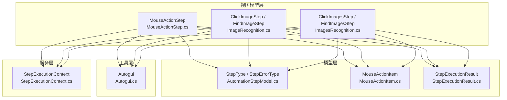
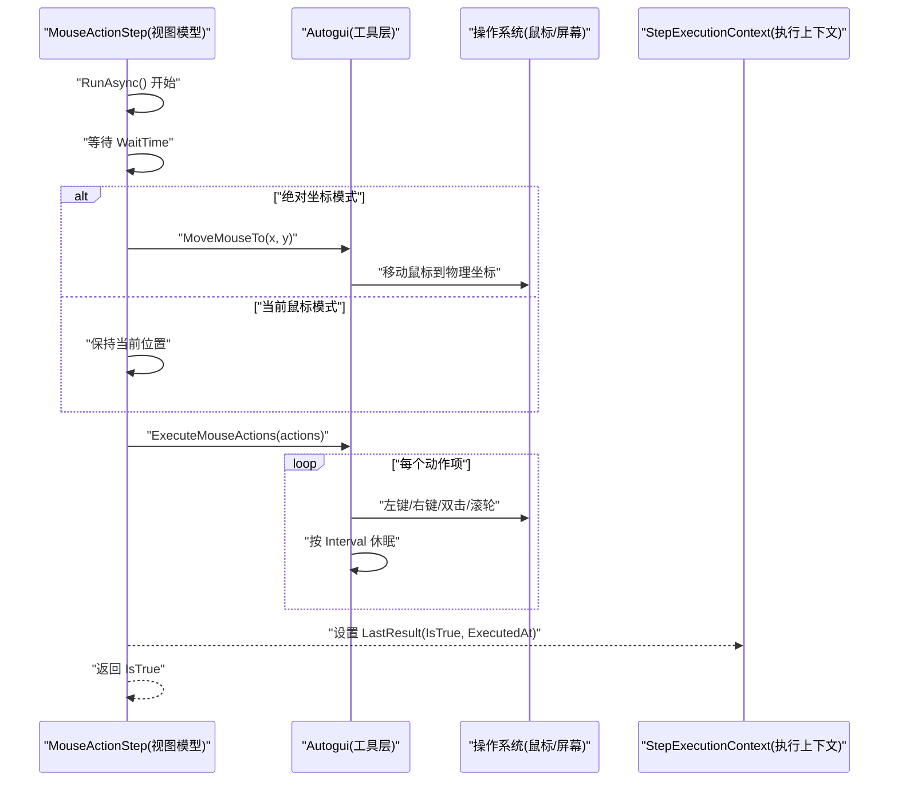
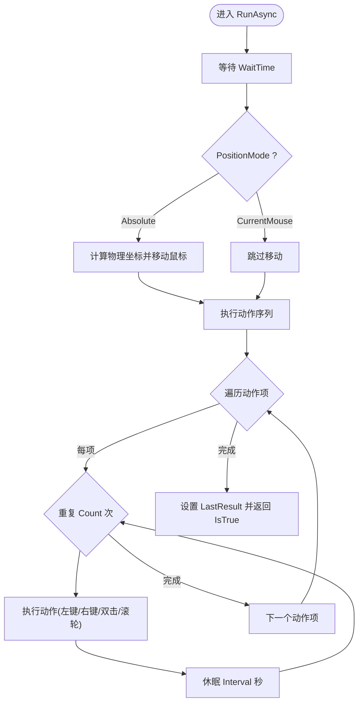
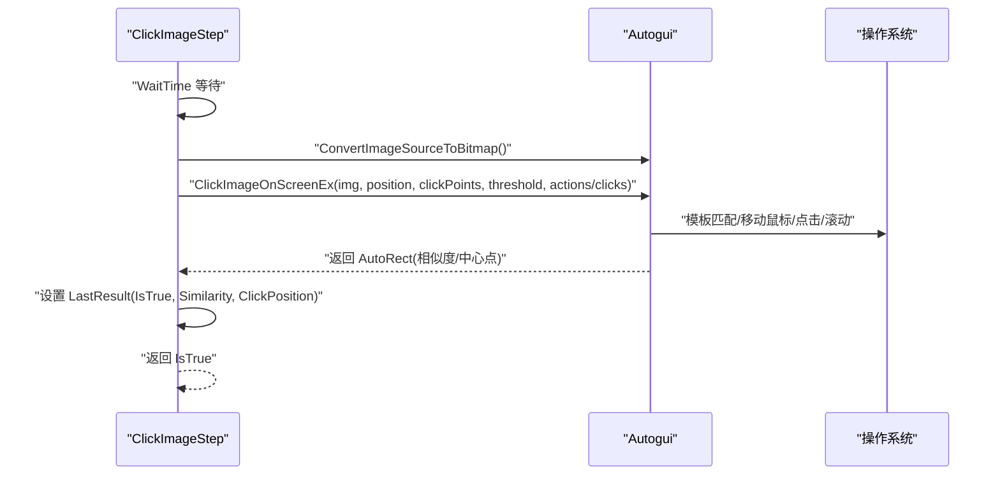
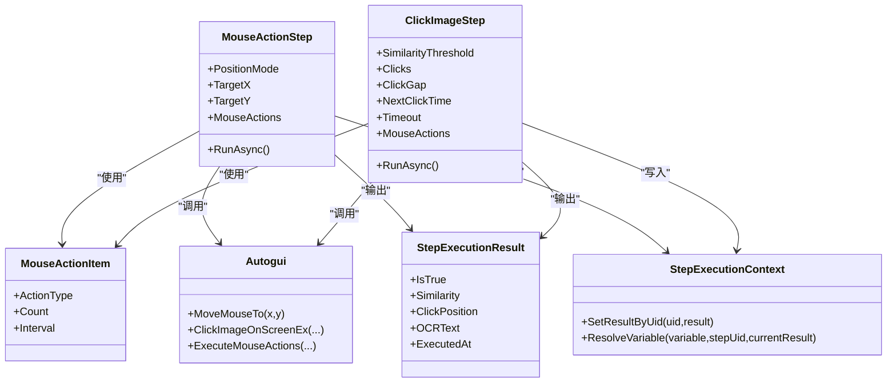

# 鼠标操作步骤

<cite>
**本文引用的文件**   
- [AutomationStepModel.cs](file://ShaoLu/Models/AutomationStepModel.cs)
- [MouseActionItem.cs](file://ShaoLu/Models/MouseActionItem.cs)
- [MouseActionStep.cs](file://ShaoLu/Viewmodels/MouseActionStep.cs)
- [Autogui.cs](file://ShaoLu/Utils/Autogui.cs)
- [ImageRecognition.cs](file://ShaoLu/Viewmodels/ImageRecognition.cs)
- [ImagesRecognition.cs](file://ShaoLu/Viewmodels/ImagesRecognition.cs)
- [StepExecutionResult.cs](file://ShaoLu/Models/StepExecutionResult.cs)
- [StepExecutionContext.cs](file://ShaoLu/Services/StepExecutionContext.cs)
- [StepsViewModel.cs](file://ShaoLu/Viewmodels/StepsViewModel.cs)
</cite>

## 目录
1. [简介](#简介)
2. [项目结构](#项目结构)
3. [核心组件](#核心组件)
4. [架构总览](#架构总览)
5. [详细组件分析](#详细组件分析)
6. [依赖关系分析](#依赖关系分析)
7. [性能考量](#性能考量)
8. [故障排查指南](#故障排查指南)
9. [结论](#结论)
10. [附录：使用示例与最佳实践](#附录使用示例与最佳实践)

## 简介
本技术文档聚焦于 ShaoLu 的“鼠标操作步骤”能力，系统性地解释以下主题：
- 鼠标操作类型：单击、双击、右键、滚轮等动作及其重复执行机制。
- 坐标定位方式：绝对坐标、当前鼠标位置；以及与图像识别结合的相对定位模式。
- 延迟配置与重复执行：步骤级等待时间、动作间隔、点击间隔、超时控制。
- 异常处理与结果记录：错误类型、执行结果、上下文变量引用。
- 复杂交互流程示例：结合图像识别与鼠标动作序列实现稳定可靠的自动化。
- 窗口焦点与屏幕缩放：DPI 感知、虚拟桌面坐标映射、UI 线程安全。

## 项目结构
围绕鼠标操作的代码主要分布在以下模块：
- 模型层：步骤类型枚举、鼠标动作项定义、执行结果结构。
- 视图模型层：鼠标操作步骤（非图像依赖）、图像识别步骤（ClickImage/FindImage 等）。
- 工具层：底层 Autogui 封装，负责屏幕截图、模板匹配、鼠标/键盘模拟、文本输入。
- 服务层：步骤执行上下文，用于保存执行结果、条件变量解析、统计信息。

图表来源 
- [AutomationStepModel.cs:9-43](file://ShaoLu/Models/AutomationStepModel.cs#L9-L43)
- [MouseActionItem.cs:9-44](file://ShaoLu/Models/MouseActionItem.cs#L9-L44)
- [StepExecutionResult.cs:8-49](file://ShaoLu/Models/StepExecutionResult.cs#L8-L49)
- [MouseActionStep.cs:18-50](file://ShaoLu/Viewmodels/MouseActionStep.cs#L18-L50)
- [ImageRecognition.cs:329-436](file://ShaoLu/Viewmodels/ImageRecognition.cs#L329-L436)
- [ImagesRecognition.cs:71-168](file://ShaoLu/Viewmodels/ImagesRecognition.cs#L71-L168)
- [Autogui.cs:193-339](file://ShaoLu/Utils/Autogui.cs#L193-L339)
- [StepExecutionContext.cs:11-161](file://ShaoLu/Services/StepExecutionContext.cs#L11-L161)

章节来源
- [AutomationStepModel.cs:9-43](file://ShaoLu/Models/AutomationStepModel.cs#L9-L43)
- [MouseActionItem.cs:9-44](file://ShaoLu/Models/MouseActionItem.cs#L9-L44)
- [StepExecutionResult.cs:8-49](file://ShaoLu/Models/StepExecutionResult.cs#L8-L49)
- [MouseActionStep.cs:18-50](file://ShaoLu/Viewmodels/MouseActionStep.cs#L18-L50)
- [ImageRecognition.cs:329-436](file://ShaoLu/Viewmodels/ImageRecognition.cs#L329-L436)
- [ImagesRecognition.cs:71-168](file://ShaoLu/Viewmodels/ImagesRecognition.cs#L71-L168)
- [Autogui.cs:193-339](file://ShaoLu/Utils/Autogui.cs#L193-L339)
- [StepExecutionContext.cs:11-161](file://ShaoLu/Services/StepExecutionContext.cs#L11-L161)

## 核心组件
- 鼠标操作步骤（MouseActionStep）：在指定位置执行鼠标动作序列，不依赖图像识别。支持绝对坐标与当前鼠标位置两种定位模式。
- 鼠标动作项（MouseActionItem）：定义具体动作类型（左键单击、右键单击、双击、向上滚动、向下滚动），以及重复次数与动作间隔。
- 图像识别步骤（ClickImageStep/FindImageStep）：基于模板匹配定位目标区域，并可在命中后执行鼠标动作序列或简单点击。
- 多图识别步骤（ClickImagesStep/FindImagesStep）：对多个图像模板进行查找/点击，支持逐一或批量策略。
- 底层 Autogui：封装屏幕截图、模板匹配、鼠标移动与点击、滚轮滚动、文本输入等系统级操作。
- 执行结果与上下文：记录每次步骤的执行结果（是否成功、相似度、点击位置、OCR 文本、弹窗结果等），并提供条件变量解析。

章节来源
- [MouseActionStep.cs:29-144](file://ShaoLu/Viewmodels/MouseActionStep.cs#L29-L144)
- [MouseActionItem.cs:9-55](file://ShaoLu/Models/MouseActionItem.cs#L9-L55)
- [ImageRecognition.cs:329-436](file://ShaoLu/Viewmodels/ImageRecognition.cs#L329-L436)
- [ImagesRecognition.cs:71-168](file://ShaoLu/Viewmodels/ImagesRecognition.cs#L71-L168)
- [Autogui.cs:193-339](file://ShaoLu/Utils/Autogui.cs#L193-L339)
- [StepExecutionResult.cs:8-49](file://ShaoLu/Models/StepExecutionResult.cs#L8-L49)
- [StepExecutionContext.cs:11-161](file://ShaoLu/Services/StepExecutionContext.cs#L11-L161)

## 架构总览
下图展示鼠标操作步骤从 UI 到系统层的调用链路与数据流。

图表来源 
- [MouseActionStep.cs:112-144](file://ShaoLu/Viewmodels/MouseActionStep.cs#L112-L144)
- [Autogui.cs:193-339](file://ShaoLu/Utils/Autogui.cs#L193-L339)
- [StepExecutionResult.cs:8-49](file://ShaoLu/Models/StepExecutionResult.cs#L8-L49)

## 详细组件分析

### 鼠标操作步骤（MouseActionStep）
- 功能概述：在指定位置执行一组鼠标动作（单击、双击、右键、滚轮），支持绝对坐标与当前鼠标位置两种定位模式。
- 关键属性：
  - PositionMode：Absolute（绝对坐标）或 CurrentMouse（当前鼠标位置）。
  - TargetX/TargetY：逻辑像素坐标（Absolute 模式下使用）。
  - MouseActions：动作序列集合，每项包含 ActionType、Count、Interval。
- 执行流程：
  - 先等待 WaitTime。
  - 若为 Absolute 模式，将逻辑坐标转换为物理坐标（考虑 DPI），然后移动鼠标。
  - 顺序执行 MouseActions，每项动作重复 Count 次，每次动作间休眠 Interval 秒。
  - 设置 LastResult 并返回 IsTrue。

图表来源 
- [MouseActionStep.cs:112-144](file://ShaoLu/Viewmodels/MouseActionStep.cs#L112-L144)
- [Autogui.cs:193-339](file://ShaoLu/Utils/Autogui.cs#L193-L339)

章节来源
- [MouseActionStep.cs:29-144](file://ShaoLu/Viewmodels/MouseActionStep.cs#L29-L144)
- [MouseActionItem.cs:9-55](file://ShaoLu/Models/MouseActionItem.cs#L9-L55)

### 鼠标动作项（MouseActionItem）
- 动作类型：
  - LeftClick：左键单击
  - RightClick：右键单击
  - DoubleClick：左键双击
  - ScrollUp：向上滚动
  - ScrollDown：向下滚动
- 参数：
  - Count：动作重复次数（最小为 0）
  - Interval：动作间隔（秒）
- 用途：在 ClickImageStep 或 MouseActionStep 中作为动作序列被顺序执行。

章节来源
- [MouseActionItem.cs:9-55](file://ShaoLu/Models/MouseActionItem.cs#L9-L55)

### 图像识别与鼠标联动（ClickImageStep/FindImageStep）
- 功能概述：通过模板匹配定位屏幕上的目标图像，命中后可执行鼠标动作序列或简单点击。
- 关键属性：
  - SimilarityThreshold：相似度阈值
  - Clicks/ClickGap/NextClickTime：点击次数、点击间隔、下一次点击间隔
  - Timeout：查找超时
  - MouseActions：可选的动作序列（优先于简单点击）
- 执行流程：
  - 等待 WaitTime
  - 将 WPF ImageSource 转换为 Bitmap
  - 调用 Autogui.ClickImageOnScreenEx，传入模板、锚点、点击点列表、阈值、动作序列或点击参数
  - 填充 LastResult（IsTrue、Similarity、ClickPosition）

图表来源 
- [ImageRecognition.cs:399-436](file://ShaoLu/Viewmodels/ImageRecognition.cs#L399-L436)
- [Autogui.cs:256-339](file://ShaoLu/Utils/Autogui.cs#L256-L339)

章节来源
- [ImageRecognition.cs:329-436](file://ShaoLu/Viewmodels/ImageRecognition.cs#L329-L436)
- [Autogui.cs:256-339](file://ShaoLu/Utils/Autogui.cs#L256-L339)

### 多图识别与批量点击（ClickImagesStep/FindImagesStep）
- 功能概述：对多个图像模板进行查找/点击，支持 OneByOne 逐个处理或批量策略。
- 关键属性：
  - Images：图像识别项集合
  - Clicks/ClickGap/NextClickTime/Timeout：点击与超时参数
  - GapTime：查找间隔（FindImagesStep）
- 执行流程：
  - 遍历 Images，依次转换图像并调用 Autogui.ClickImageOnScreenEx 或 FindImagesOnScreen
  - 记录最后一次相似度与点击位置，填充 LastResult

章节来源
- [ImagesRecognition.cs:71-168](file://ShaoLu/Viewmodels/ImagesRecognition.cs#L71-L168)
- [ImagesRecognition.cs:170-242](file://ShaoLu/Viewmodels/ImagesRecognition.cs#L170-L242)
- [Autogui.cs:124-171](file://ShaoLu/Utils/Autogui.cs#L124-L171)

### 坐标定位与 DPI 缩放
- 绝对坐标模式：
  - TargetX/TargetY 为逻辑像素，需乘以 DPI 缩放因子得到物理像素，再调用 MoveMouseTo。
- 当前鼠标模式：
  - 不移动鼠标，直接在当前位置执行动作序列。
- 图像定位模式：
  - 模板匹配返回物理像素坐标，后续移动/点击时可直接使用。
- 虚拟桌面与 DPI：
  - Autogui.MoveMouseTo 使用虚拟桌面坐标映射，确保多显示器与 DPI 缩放下正确移动。

章节来源
- [MouseActionStep.cs:118-131](file://ShaoLu/Viewmodels/MouseActionStep.cs#L118-L131)
- [Autogui.cs:193-254](file://ShaoLu/Utils/Autogui.cs#L193-L254)

### 延迟配置与重复执行机制
- 步骤级等待：WaitTime（秒），在执行前等待。
- 动作间隔：MouseActionItem.Interval（秒），每项动作重复间的休眠。
- 点击间隔：ClickGap（秒），多次点击之间的休眠。
- 下次点击间隔：NextClickTime（秒），一次点击序列后的休眠。
- 超时控制：Timeout（秒），模板匹配或点击查找的超时。

章节来源
- [MouseActionItem.cs:23-34](file://ShaoLu/Models/MouseActionItem.cs#L23-L34)
- [ImageRecognition.cs:331-340](file://ShaoLu/Viewmodels/ImageRecognition.cs#L331-L340)
- [ImagesRecognition.cs:73-82](file://ShaoLu/Viewmodels/ImagesRecognition.cs#L73-L82)
- [Autogui.cs:266-339](file://ShaoLu/Utils/Autogui.cs#L266-L339)

### 异常处理与执行结果
- 错误类型：StepErrorType 定义了多种错误（如图像未找到、文件读取失败、执行超时、索引越界等）。
- 执行结果：StepExecutionResult 记录 IsTrue、ExecutionTimeMs、Similarity、ClickPosition、OCRText、PopupResult、ErrorMessage、ExecutedAt。
- 上下文变量：StepExecutionContext 提供条件变量解析（如 Self_IsTrue、Step_Similarity、Step_ClickX/Y、Step_OCRText 等）。
- 运行期异常推断：StepsViewModel.InferErrorType 根据异常类型映射到 StepErrorType。

章节来源
- [AutomationStepModel.cs:26-43](file://ShaoLu/Models/AutomationStepModel.cs#L26-L43)
- [StepExecutionResult.cs:8-49](file://ShaoLu/Models/StepExecutionResult.cs#L8-L49)
- [StepExecutionContext.cs:112-161](file://ShaoLu/Services/StepExecutionContext.cs#L112-L161)
- [StepsViewModel.cs:699-710](file://ShaoLu/Viewmodels/StepsViewModel.cs#L699-L710)

## 依赖关系分析
- MouseActionStep 依赖 Autogui 进行鼠标移动与动作执行，依赖 MouseActionItem 定义动作项。
- ClickImageStep/FindImageStep 依赖 Autogui 进行模板匹配与点击，依赖 MouseActionItem 支持动作序列。
- ClickImagesStep/FindImagesStep 依赖 Autogui 的多图查找与点击。
- 所有步骤均输出 StepExecutionResult，并通过 StepExecutionContext 提供条件变量解析。

图表来源 
- [MouseActionStep.cs:29-144](file://ShaoLu/Viewmodels/MouseActionStep.cs#L29-L144)
- [MouseActionItem.cs:9-55](file://ShaoLu/Models/MouseActionItem.cs#L9-L55)
- [ImageRecognition.cs:329-436](file://ShaoLu/Viewmodels/ImageRecognition.cs#L329-L436)
- [Autogui.cs:193-339](file://ShaoLu/Utils/Autogui.cs#L193-L339)
- [StepExecutionResult.cs:8-49](file://ShaoLu/Models/StepExecutionResult.cs#L8-L49)
- [StepExecutionContext.cs:11-161](file://ShaoLu/Services/StepExecutionContext.cs#L11-L161)

章节来源
- [MouseActionStep.cs:29-144](file://ShaoLu/Viewmodels/MouseActionStep.cs#L29-L144)
- [MouseActionItem.cs:9-55](file://ShaoLu/Models/MouseActionItem.cs#L9-L55)
- [ImageRecognition.cs:329-436](file://ShaoLu/Viewmodels/ImageRecognition.cs#L329-L436)
- [Autogui.cs:193-339](file://ShaoLu/Utils/Autogui.cs#L193-L339)
- [StepExecutionResult.cs:8-49](file://ShaoLu/Models/StepExecutionResult.cs#L8-L49)
- [StepExecutionContext.cs:11-161](file://ShaoLu/Services/StepExecutionContext.cs#L11-L161)

## 性能考量
- 模板匹配开销：频繁截图与 OpenCV 模板匹配会消耗 CPU，建议合理设置 GapTime/Timeout 避免过度重试。
- DPI 转换：逻辑像素到物理像素的转换应在步骤执行前完成，减少重复计算。
- 动作间隔：过小的 Interval 可能导致系统事件队列拥塞，适当增大可提升稳定性。
- 图像缓存：CroppedImg 使用冻结的 BitmapSource 提高跨线程访问性能。
- 异步执行：RunAsync 使用 Task.Run 将重任务放后台，避免阻塞 UI 线程。

[本节为通用指导，无需特定文件来源]

## 故障排查指南
- 常见问题：
  - 图像未找到：检查模板图片路径、相似度阈值、屏幕内容变化、DPI 设置。
  - 点击无效：确认目标窗口焦点、鼠标位置是否正确、动作序列是否合理。
  - 超时错误：调整 Timeout/GapTime，降低模板匹配频率。
  - OCR 结果为空：确认 OCR 区域设置正确、分辨率与缩放影响。
- 诊断手段：
  - 查看 LastResult 中的 Similarity、ClickPosition、OCRText。
  - 启用调试叠加（显示匹配区域、点击位置、OCR 区域）辅助定位。
  - 检查 StepsViewModel 的错误类型推断日志。

章节来源
- [ImageRecognition.cs:550-587](file://ShaoLu/Viewmodels/ImageRecognition.cs#L550-L587)
- [ImagesRecognition.cs:145-156](file://ShaoLu/Viewmodels/ImagesRecognition.cs#L145-L156)
- [StepsViewModel.cs:699-710](file://ShaoLu/Viewmodels/StepsViewModel.cs#L699-L710)

## 结论
ShaoLu 的鼠标操作步骤提供了灵活且强大的自动化能力，支持多种定位模式、动作序列、延迟与重复执行机制，并结合图像识别与 OCR 实现复杂交互。通过合理的配置与异常处理，可以在不同 DPI 与窗口焦点环境下稳定运行。

[本节为总结性内容，无需特定文件来源]

## 附录：使用示例与最佳实践
- 示例一：绝对坐标点击并执行动作序列
  - 设置 PositionMode=Absolute，TargetX/TargetY 为目标位置。
  - 添加 MouseActionItem：LeftClick 次数 1，Interval 0.1 秒。
  - 设置 WaitTime 0.5 秒，Timeout 3 秒。
- 示例二：图像识别后双击并滚动
  - 选择模板图片，设置 SimilarityThreshold 0.85。
  - 添加 MouseActionItem：DoubleClick 1 次，ScrollDown 3 次，Interval 0.2 秒。
  - 设置 NextClickTime 0.3 秒，Timeout 5 秒。
- 最佳实践：
  - 使用图像识别定位而非硬编码坐标，提高鲁棒性。
  - 合理设置间隔与超时，避免过快导致系统不稳定。
  - 利用 StepExecutionContext 的条件变量实现动态分支与统计。
  - 在多显示器与高 DPI 环境下，务必依赖 Autogui 的虚拟桌面坐标映射。

[本节为概念性内容，无需特定文件来源]