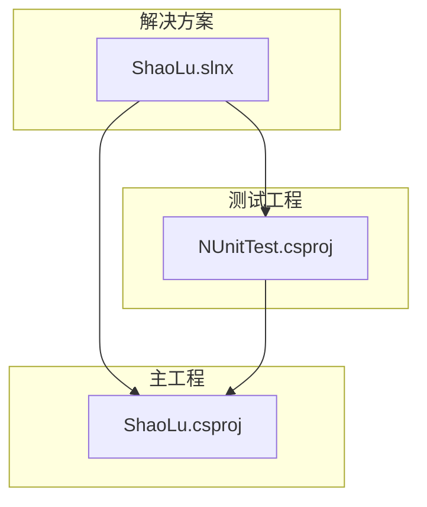
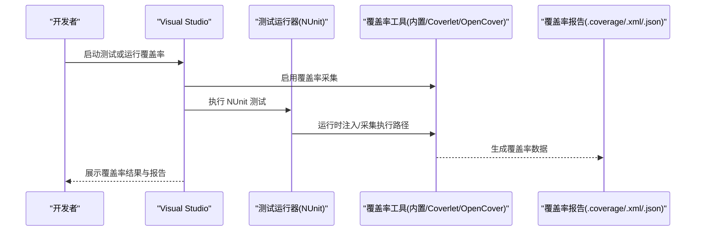
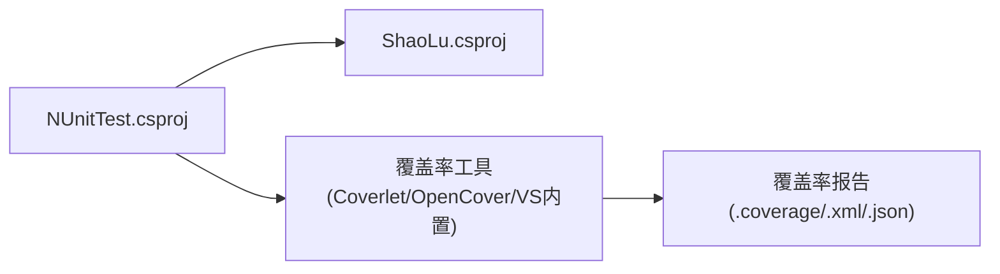

# 代码覆盖率

<cite>
**本文引用的文件**   
- [NUnitTest.csproj](file://NUnitTest/NUnitTest.csproj)
- [ShaoLu.csproj](file://ShaoLu/ShaoLu.csproj)
- [AutomationStepTests.cs](file://NUnitTest/AutomationStepTests.cs)
- [ModelTests.cs](file://NUnitTest/ModelTests.cs)
- [ConditionEvaluatorTests.cs](file://NUnitTest/ConditionEvaluatorTests.cs)
- [StepsFileTests.cs](file://NUnitTest/StepsFileTests.cs)
- [ConverterTests.cs](file://NUnitTest/ConverterTests.cs)
- [StepExecutionContextTests.cs](file://NUnitTest/StepExecutionContextTests.cs)
- [.gitignore](file://.gitignore)
</cite>

## 目录
1. [简介](#简介)
2. [项目结构](#项目结构)
3. [核心组件](#核心组件)
4. [架构总览](#架构总览)
5. [详细组件分析](#详细组件分析)
6. [依赖关系分析](#依赖关系分析)
7. [性能与覆盖率注意事项](#性能与覆盖率注意事项)
8. [故障排查指南](#故障排查指南)
9. [结论](#结论)
10. [附录：覆盖率阈值与CI配置示例](#附录覆盖率阈值与ci配置示例)

## 简介
本文件为 ShaoLu 项目的代码覆盖率配置与使用指南，面向开发者与持续集成（CI）维护者。内容涵盖：
- 如何使用 Visual Studio 内置的代码覆盖率工具
- 如何使用第三方覆盖率工具（Coverlet、OpenCover）
- 覆盖率指标含义（语句覆盖率、分支覆盖率、方法覆盖率）
- 覆盖率阈值设置与 CI 中的质量门禁
- 覆盖率报告解读方法与改进建议

本项目基于 WPF + NUnit 测试框架，测试工程位于 NUnitTest，主工程位于 ShaoLu。

## 项目结构
- 主工程 ShaoLu：WPF 桌面应用，包含业务逻辑、服务、视图模型、工具等。
- 测试工程 NUnitTest：基于 NUnit 的单元测试集合，覆盖模型、转换器、条件评估器、执行上下文、步骤序列化等关键模块。
- 解决方案 ShaoLu.slnx：定义平台与项目引用关系。

图表来源
- [ShaoLu.slnx:1-10](file://ShaoLu.slnx#L1-L10)
- [ShaoLu.csproj:1-40](file://ShaoLu/ShaoLu.csproj#L1-L40)
- [NUnitTest.csproj:1-20](file://NUnitTest/NUnitTest.csproj#L1-L20)

章节来源
- [ShaoLu.slnx:1-10](file://ShaoLu.slnx#L1-L10)
- [ShaoLu.csproj:1-40](file://ShaoLu/ShaoLu.csproj#L1-L40)
- [NUnitTest.csproj:1-20](file://NUnitTest/NUnitTest.csproj#L1-L20)

## 核心组件
- 测试框架：NUnit 4.x 与 NUnit3TestAdapter，用于在 VS 中运行和发现测试。
- 被测代码：ShaoLu 工程中的 Models、Services、Converters、Utils 等可被测试覆盖的核心类。
- 覆盖率收集：可通过 VS 内置 Code Coverage 或 Coverlet/OpenCover 插件生成 .coverage/.coveragexml 或 JSON/XML 报告。

章节来源
- [NUnitTest.csproj:55-64](file://NUnitTest/NUnitTest.csproj#L55-L64)

## 架构总览
下图展示“测试驱动覆盖率”的整体流程：VS 或命令行触发测试运行，覆盖率工具注入并采集执行路径，最终输出报告供分析与门禁检查。

图表来源
- [NUnitTest.csproj:55-64](file://NUnitTest/NUnitTest.csproj#L55-L64)
- [.gitignore:145-152](file://.gitignore#L145-L152)

## 详细组件分析

### 使用 Visual Studio 内置代码覆盖率
- 适用场景：快速查看本地覆盖率，无需额外安装。
- 操作步骤：
  - 打开解决方案，选择“分析 -> 运行带有代码覆盖率的测试”。
  - 在“测试资源管理器”中选择全部或部分测试集运行。
  - 查看“代码覆盖率结果”窗口，按程序集、命名空间、类、方法维度查看覆盖率。
  - 导出报告：右键结果 -> 导出 -> 选择 .coverage 或 XML 格式。
- 注意：
  - 确保测试工程与主工程均为 Debug 构建（便于映射行号）。
  - 若出现“未找到调试符号”，请确认 PDB 已生成且路径正确。

章节来源
- [.gitignore:151-152](file://.gitignore#L151-L152)

### 使用 Coverlet（推荐用于 CI）
- 适用场景：跨平台、易于集成到 CI，支持多种报告格式（JSON、XML、Cobertura）。
- 安装与配置：
  - 在测试工程中通过 NuGet 添加 Coverlet 相关包（如 coverlet.msbuild 或 dotnet tool）。
  - 在测试命令中加入 --collect:"XPlat Code Coverage" 或相应参数以启用覆盖率采集。
- 常用命令（示例思路）：
  - 运行测试并生成覆盖率：dotnet test --collect:"XPlat Code Coverage"
  - 指定输出格式与路径：--results-directory 与 --format 参数
- 报告解读：
  - JSON/XML 报告包含语句、分支、方法、行级覆盖率统计。
  - 可在 CI 中将覆盖率数据转换为 Cobertura 格式以便可视化。

章节来源
- [.gitignore:145-148](file://.gitignore#L145-L148)

### 使用 OpenCover
- 适用场景：对 .NET Framework 项目提供细粒度覆盖率采集，适合传统 MSBuild 工作流。
- 安装与配置：
  - 通过 NuGet 或独立安装包引入 OpenCover。
  - 使用 OpenCover.Console.exe 包装测试运行器（如 NUnit3Console），指定目标程序集与输出文件。
- 常用命令（示例思路）：
  - OpenCover.Console.exe -target:"nunit3-console.exe" -targetargs:"YourTest.dll" -output:"coverage.xml"
- 报告解读：
  - 生成的 XML 可被多种工具（如 ReportGenerator、SonarQube）消费。

章节来源
- [.gitignore:335-336](file://.gitignore#L335-L336)

### 覆盖率指标含义
- 语句覆盖率（Statement Coverage）：被执行的语句占总语句的比例。反映“哪些代码被执行过”。
- 分支覆盖率（Branch Coverage）：每个判断分支（if/else、switch case、短路逻辑等）的执行比例。反映“是否覆盖了所有分支路径”。
- 方法覆盖率（Method Coverage）：被调用的方法占所有方法的比例。反映“哪些方法被测试调用过”。
- 行覆盖率（Line Coverage）：被执行的代码行数占比，通常与语句覆盖率相近但更直观。

说明：
- 高语句覆盖率不等于高质量测试，需结合分支与方法覆盖率综合评估。
- UI 层（WPF 视图）难以直接测试，建议聚焦于 ViewModel、Service、Utils 等可测部分。

[无章节来源：概念性说明]

### 覆盖率阈值与质量门禁
- 建议阈值（可按团队策略调整）：
  - 语句覆盖率 ≥ 80%
  - 分支覆盖率 ≥ 70%
  - 方法覆盖率 ≥ 85%
- 在 CI 中设置门禁：
  - 使用 Coverlet 生成 Cobertura 报告后，借助 SonarQube/GitHub Actions/ADO Pipelines 进行阈值校验。
  - 当覆盖率低于阈值时，标记构建失败并通知团队。

章节来源
- [.gitignore:145-152](file://.gitignore#L145-L152)

### 覆盖率报告解读与改进建议
- 解读要点：
  - 优先关注低覆盖率模块：Models、Services、Converters、Utils。
  - 针对分支覆盖率低的代码，补充边界条件与异常路径测试。
  - 对于不可测的 UI 代码，通过抽取可测逻辑至 Service/ViewModel 提升可测性。
- 改进建议：
  - 为复杂条件（多分支、嵌套 if）编写等价类与边界值用例。
  - 为异步/IO 操作增加 Mock/Stub，提高可测性与稳定性。
  - 定期审查覆盖率趋势，避免“为了覆盖率而写测试”的形式主义。

[无章节来源：通用实践建议]

## 依赖关系分析
- 测试工程依赖主工程：NUnitTest 引用 ShaoLu，从而对被测代码进行断言验证。
- 覆盖率工具与测试运行器协作：VS 内置工具或 Coverlet/OpenCover 在测试执行期间采集执行路径。

图表来源
- [NUnitTest.csproj:65-70](file://NUnitTest/NUnitTest.csproj#L65-L70)
- [.gitignore:145-152](file://.gitignore#L145-L152)

章节来源
- [NUnitTest.csproj:65-70](file://NUnitTest/NUnitTest.csproj#L65-L70)

## 性能与覆盖率注意事项
- 构建配置：
  - 本地开发建议使用 Debug 模式以获得更好的行号映射与调试体验。
  - CI 环境可选择 Release 模式，但需确保生成 PDB 以供覆盖率工具解析。
- 测试隔离：
  - 避免共享状态导致测试间干扰，影响覆盖率统计准确性。
- 外部依赖：
  - OCR、图像识别、系统 API 等应通过接口抽象与 Mock，减少对外部环境的依赖。
- 报告体积：
  - 大型项目可能产生较大覆盖率文件，建议在 CI 中清理中间产物，仅保留必要报告。

[无章节来源：通用指导]

## 故障排查指南
- 常见问题与解决：
  - 覆盖率结果为空或未更新：
    - 确认测试是否实际执行；检查测试适配器是否正确安装。
    - 确认覆盖率工具是否启用；检查输出目录权限。
  - 行号不匹配或无法定位：
    - 确认编译生成了 PDB；确保测试与主工程版本一致。
  - 第三方工具无法读取报告：
    - 检查报告格式是否符合工具要求（如 Cobertura、XML、JSON）。
- 参考忽略规则：
  - .gitignore 中已包含常见覆盖率产物与工具目录，避免提交无关文件。

章节来源
- [.gitignore:145-152](file://.gitignore#L145-L152)
- [.gitignore:335-336](file://.gitignore#L335-L336)

## 结论
通过合理配置与使用 VS 内置覆盖率工具或 Coverlet/OpenCover，并结合 NUnit 测试套件，ShaoLu 项目可以在本地开发与 CI 环境中稳定生成覆盖率报告。建议以语句、分支、方法覆盖率作为多维指标，设定合理的阈值并在 CI 中进行质量门禁，持续提升代码质量与可维护性。

[无章节来源：总结性说明]

## 附录：覆盖率阈值与CI配置示例

### 覆盖率阈值建议
- 语句覆盖率：≥ 80%
- 分支覆盖率：≥ 70%
- 方法覆盖率：≥ 85%

### CI 流水线示例（思路）
- 步骤：
  - 还原依赖（NuGet restore）
  - 构建解决方案（MSBuild/dotnet build）
  - 运行测试并生成覆盖率（dotnet test 或 OpenCover 包装）
  - 转换报告格式（如转为 Cobertura）
  - 上传覆盖率报告并设置门禁（失败则中断构建）

章节来源
- [.gitignore:145-152](file://.gitignore#L145-L152)