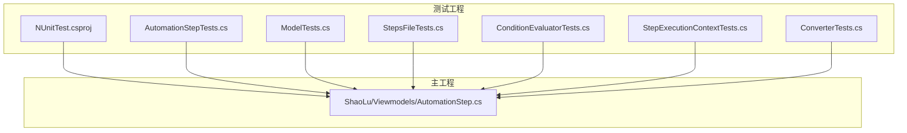
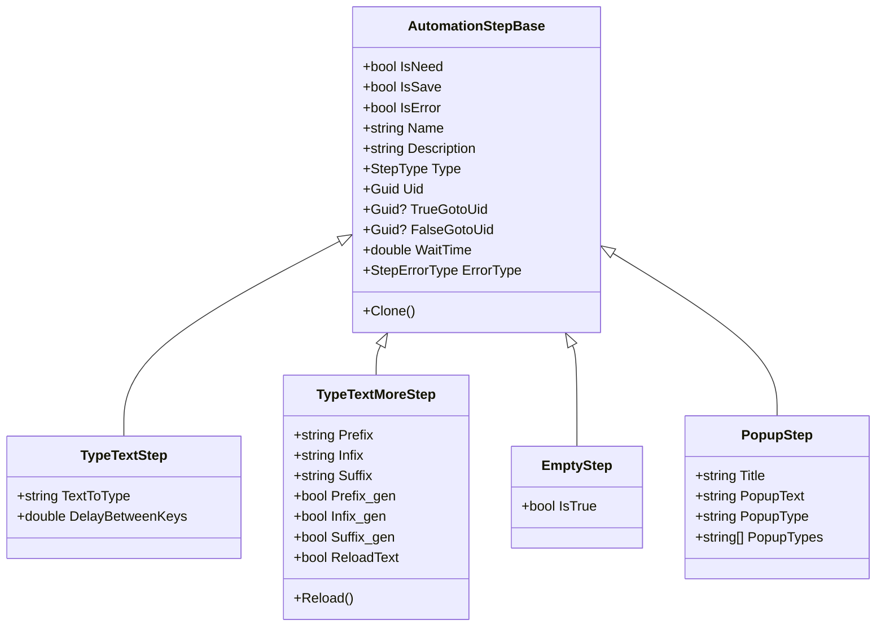
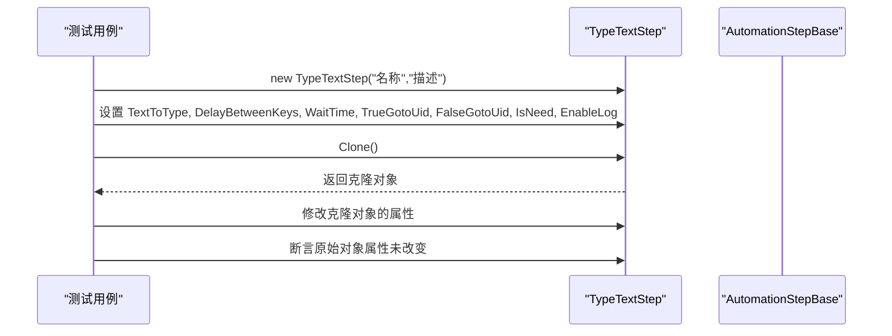
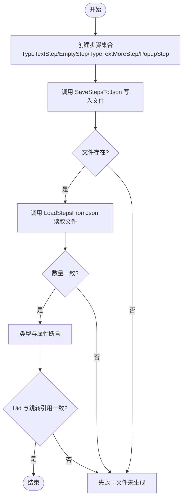
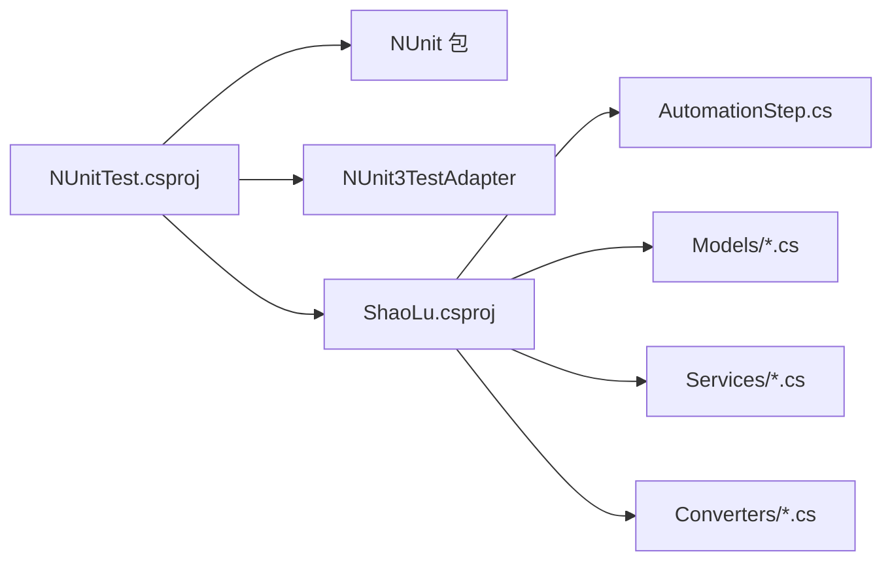

# 单元测试

<cite>
**本文引用的文件**   
- [NUnitTest.csproj](file://NUnitTest/NUnitTest.csproj)
- [AutomationStepTests.cs](file://NUnitTest/AutomationStepTests.cs)
- [ModelTests.cs](file://NUnitTest/ModelTests.cs)
- [StepsFileTests.cs](file://NUnitTest/StepsFileTests.cs)
- [ConditionEvaluatorTests.cs](file://NUnitTest/ConditionEvaluatorTests.cs)
- [StepExecutionContextTests.cs](file://NUnitTest/StepExecutionContextTests.cs)
- [ConverterTests.cs](file://NUnitTest/ConverterTests.cs)
- [AutomationStep.cs](file://ShaoLu/Viewmodels/AutomationStep.cs)
</cite>

## 目录
1. [简介](#简介)
2. [项目结构](#项目结构)
3. [核心组件](#核心组件)
4. [架构总览](#架构总览)
5. [详细组件分析](#详细组件分析)
6. [依赖关系分析](#依赖关系分析)
7. [性能考虑](#性能考虑)
8. [故障排查指南](#故障排查指南)
9. [结论](#结论)
10. [附录](#附录)

## 简介
本文件面向 ShaoLu 项目的单元测试，系统性说明 NUnit 测试框架在项目中的配置与使用方式，涵盖测试类结构、常用属性（[TestFixture]、[Test]、[SetUp]、[TearDown]）及断言技巧。重点围绕自动化步骤类的测试策略展开，包括构造函数行为、属性默认值验证、Clone 方法深拷贝校验以及边界情况处理。文档提供针对 TypeTextStep、TypeTextMoreStep、EmptyStep、PopupStep 等具体步骤类型的测试示例与思路，并总结异常处理的测试方法与最佳实践。

## 项目结构
测试工程位于 NUnitTest 目录，采用 .NET Framework 4.8 的类库工程，引用了 NUnit、NUnit3TestAdapter 以及 FlaUI.UIA3 包，并通过项目引用指向主工程 ShaoLu。测试文件按功能域划分：
- 自动化步骤测试：AutomationStepTests.cs
- 模型与设置测试：ModelTests.cs
- JSON 序列化/反序列化测试：StepsFileTests.cs
- 条件评估器测试：ConditionEvaluatorTests.cs
- 执行上下文测试：StepExecutionContextTests.cs
- WPF 值转换器测试：ConverterTests.cs

图表来源
- [NUnitTest.csproj:1-72](file://NUnitTest/NUnitTest.csproj#L1-L72)
- [AutomationStep.cs:1-200](file://ShaoLu/Viewmodels/AutomationStep.cs#L1-L200)

章节来源
- [NUnitTest.csproj:1-72](file://NUnitTest/NUnitTest.csproj#L1-L72)

## 核心组件
- 测试框架与适配器
  - NUnit 4.x 作为测试框架，NUnit3TestAdapter 用于在 Visual Studio 中运行与报告结果。
  - 目标框架为 .NET Framework 4.8，平台目标 x64。
- 测试组织模式
  - 使用 [TestFixture] 标记测试类，[Test] 标记测试用例。
  - 使用 [SetUp]/[TearDown] 进行用例前后置准备与清理（如临时目录创建与删除）。
- 断言风格
  - 统一使用 Assert.That(...) 配合 Is.* 匹配器，便于表达期望状态。
  - 对异常场景使用 Assert.Throws<T>(...) 捕获预期异常。
- 数据驱动与组合
  - 通过构造不同初始状态的步骤对象，覆盖多分支逻辑与边界条件。
  - 使用集合与循环组织批量断言，提高覆盖率与可读性。

章节来源
- [NUnitTest.csproj:1-72](file://NUnitTest/NUnitTest.csproj#L1-L72)
- [AutomationStepTests.cs:1-373](file://NUnitTest/AutomationStepTests.cs#L1-L373)
- [StepsFileTests.cs:1-312](file://NUnitTest/StepsFileTests.cs#L1-L312)
- [ConditionEvaluatorTests.cs:1-662](file://NUnitTest/ConditionEvaluatorTests.cs#L1-L662)
- [StepExecutionContextTests.cs:1-253](file://NUnitTest/StepExecutionContextTests.cs#L1-L253)
- [ConverterTests.cs:1-318](file://NUnitTest/ConverterTests.cs#L1-L318)

## 架构总览
下图展示了测试工程与主工程之间的依赖关系，以及关键被测组件（自动化步骤基类与派生类）在测试中的角色。

图表来源
- [AutomationStep.cs:1-200](file://ShaoLu/Viewmodels/AutomationStep.cs#L1-L200)

章节来源
- [AutomationStep.cs:1-200](file://ShaoLu/Viewmodels/AutomationStep.cs#L1-L200)

## 详细组件分析

### 自动化步骤类测试策略（TypeTextStep、TypeTextMoreStep、EmptyStep、PopupStep）
- 构造函数测试
  - 验证无参构造是否设置正确的 StepType。
  - 验证带名称/描述的构造是否正确赋值 Name、Description。
- 属性默认值验证
  - 检查 IsNeed、IsSave、IsError、IsTrue、WaitTime、DelayBetweenKeys、SelfReferenceLimit、ConditionMode、EnableLog 等默认值是否符合设计。
- Clone 方法测试
  - 验证克隆后的对象所有属性被正确复制。
  - 修改克隆对象后，确认原始对象不受影响（深拷贝语义）。
- 边界情况处理
  - 空集合操作（如 RemoveConditionCommand 在空集合上不应抛异常）。
  - 唯一性校验（Uid 唯一性）。
  - 参数校验（Name 设为 null 应抛出 ArgumentNullException）。

图表来源
- [AutomationStepTests.cs:1-373](file://NUnitTest/AutomationStepTests.cs#L1-L373)
- [AutomationStep.cs:1-200](file://ShaoLu/Viewmodels/AutomationStep.cs#L1-L200)

章节来源
- [AutomationStepTests.cs:1-373](file://NUnitTest/AutomationStepTests.cs#L1-L373)

### TypeTextStep 测试要点
- 构造函数与类型设置：无参/有参构造均正确设置 Type。
- 默认属性：IsNeed=True；IsSave/IsError/IsTrue=False；WaitTime=0.1；DelayBetweenKeys=0.05；SelfReferenceLimit=10；ConditionMode=Default；EnableLog=False。
- Clone 深拷贝：所有业务属性与跳转 Uid 均被复制，修改克隆不影响原对象。
- 唯一性与异常：Uid 唯一；Name=null 抛出 ArgumentNullException。

章节来源
- [AutomationStepTests.cs:1-118](file://NUnitTest/AutomationStepTests.cs#L1-L118)

### TypeTextMoreStep 测试要点
- 前缀/中缀/后缀拼接：Prefix+Infix+Suffix 生成 TextToType。
- Clone 深拷贝：包含 Prefix_gen、Infix_gen、Suffix_gen、ReloadText、WaitTime、DelayBetweenKeys、跳转 Uid、IsNeed、EnableLog 等。
- Reload 行为：重置到原始值或重新计算拼接结果。

章节来源
- [AutomationStepTests.cs:119-196](file://NUnitTest/AutomationStepTests.cs#L119-L196)

### EmptyStep 测试要点
- 构造函数与类型设置：Type=Empty，且 IsTrue=True。
- Clone 深拷贝：复制基础属性与跳转 Uid，保持 IsTrue=True。

章节来源
- [AutomationStepTests.cs:197-242](file://NUnitTest/AutomationStepTests.cs#L197-L242)

### PopupStep 测试要点
- 构造函数与类型设置：Type=Popup；名称与标题一致。
- 默认属性：PopupType="Information"；PopupTypes 包含 None/Information/Warning/Error/Question，数量为 5。
- Clone 深拷贝：Title、PopupText、PopupType、WaitTime、IsNeed、跳转 Uid 等均被复制。

章节来源
- [AutomationStepTests.cs:243-304](file://NUnitTest/AutomationStepTests.cs#L243-L304)

### 通用基类属性与命令测试（AutomationStepBase）
- Conditions 默认空集合：新增/移除条件命令行为正确，空集合移除不抛异常。
- 错误类型与自引用计数：ErrorType 默认 None；SelfReferenceCount 默认 0。
- LastResult 默认 null。

章节来源
- [AutomationStepTests.cs:305-371](file://NUnitTest/AutomationStepTests.cs#L305-L371)

### 模型与设置测试（ModelTests）
- StepCondition：默认值、Clone 深拷贝、属性变更事件触发。
- StepExecutionResult：默认值与可设置性。
- AppSettings/StepSettings/UserSettings/FontModel：默认值与 Clone 行为。
- StepType 枚举：关键枚举值映射符合预期。
- StepExecutionLog：基本属性设置。

章节来源
- [ModelTests.cs:1-300](file://NUnitTest/ModelTests.cs#L1-L300)

### JSON 序列化/反序列化测试（StepsFileTests）
- SaveAndLoad 往返一致性：TypeTextStep、TypeTextMoreStep、EmptyStep、PopupStep 等多类型混合保存与加载。
- 空列表与条件步骤：Conditions、ConditionMode、TextExtractMode、ExtractMarker、ExtractLength 等字段往返一致。
- Uid 跳转引用：保存/加载后 Uid 保持不变，跳转目标仍指向对应步骤。
- 异常路径：null 步骤、空路径、不存在文件等场景抛出预期异常。
- 工作目录路径计算：GetWorkDirPath 返回正确路径。

图表来源
- [StepsFileTests.cs:1-312](file://NUnitTest/StepsFileTests.cs#L1-L312)

章节来源
- [StepsFileTests.cs:1-312](file://NUnitTest/StepsFileTests.cs#L1-L312)

### 条件评估器测试（ConditionEvaluatorTests）
- 空条件与默认行为：null/空条件返回当前结果；currentResult 为 false 时返回 false。
- 常量条件：ConstantTrue/ConstantFalse。
- 布尔比较：Self_IsTrue 与 Equal/NotEqual 及数字字符串兼容。
- 数值比较：Similarity、ExecutionTimeMs 的 GreaterThan/LessThan/Equal/NotEqual/GreaterOrEqual/LessOrEqual。
- 字符串比较：OCRText 的 Equal/Contains/NotContains/NotEqual/IsEmpty/IsNotEmpty。
- 逻辑组合：AND/OR 多条件组合与优先级。
- 引用其他步骤：Step_IsTrue/Similarity/OCRText/ExecutionTimeMs 基于 Uid 解析。
- Null 值处理：缺失步骤或空文本时的默认行为。
- 识别文本提取：Whole/Lines/FromSubstring/FromStart/FromEnd 的提取与比较。

章节来源
- [ConditionEvaluatorTests.cs:1-662](file://NUnitTest/ConditionEvaluatorTests.cs#L1-L662)

### 执行上下文测试（StepExecutionContextTests）
- SetResult/GetResult：设置与获取结果，覆盖与多行存储。
- Clear：清空所有结果，空上下文不抛异常。
- ResolveVariable：常量、Self_*、Step_* 变量解析与默认值。

章节来源
- [StepExecutionContextTests.cs:1-253](file://NUnitTest/StepExecutionContextTests.cs#L1-L253)

### WPF 值转换器测试（ConverterTests）
- BoolToInverseBoolConverter：正反转换与非法输入处理。
- NullToVisibilityConverter：Null→Collapsed，非 Null→Visible，支持反向模式。
- ConditionModeToVisibilityConverter：Custom→Visible，Default→Collapsed。
- ConditionEnumToStringConverter：枚举转本地化字符串与 Tooltip。

章节来源
- [ConverterTests.cs:1-318](file://NUnitTest/ConverterTests.cs#L1-L318)

## 依赖关系分析
测试工程通过项目引用依赖主工程的自动化步骤与模型服务，确保测试覆盖核心业务逻辑。关键依赖如下：
- NUnit 与适配器：提供测试运行与报告能力。
- ShaoLu 主工程：提供 AutomationStepBase 及其派生类、Models、Services、Converters 等被测对象。
- 文件系统与 IO：StepsFileTests 使用临时目录进行 JSON 读写。

图表来源
- [NUnitTest.csproj:1-72](file://NUnitTest/NUnitTest.csproj#L1-L72)
- [AutomationStep.cs:1-200](file://ShaoLu/Viewmodels/AutomationStep.cs#L1-L200)

章节来源
- [NUnitTest.csproj:1-72](file://NUnitTest/NUnitTest.csproj#L1-L72)

## 性能考虑
- 测试数据构造尽量轻量，避免在测试中引入重型 I/O 或外部依赖。
- StepsFileTests 使用临时目录并在 TearDown 中清理，避免污染系统环境。
- 条件评估与上下文解析均为内存操作，测试用例应避免重复创建大对象。
- 对于需要 UI 或系统交互的功能（如 FlaUI），应在隔离环境中运行，避免阻塞测试套件。

## 故障排查指南
- 常见异常断言
  - ArgumentNullException：当 Name 设置为 null 时抛出，使用 Assert.Throws<ArgumentNullException> 捕获。
  - ArgumentException：路径为空时抛出，使用 Assert.Throws<ArgumentException> 捕获。
  - FileNotFoundException：文件不存在时抛出，使用 Assert.Throws<FileNotFoundException> 捕获。
- 常见问题定位
  - Clone 浅拷贝导致修改克隆影响原对象：检查各属性的复制逻辑是否为深拷贝。
  - Uid 不一致导致跳转失效：确保 JSON 序列化/反序列化保留 Uid。
  - 条件评估结果为意外值：检查变量解析与默认值处理，尤其是 OCRText 为空或缺失的情况。
- 调试建议
  - 使用 [SetUp]/[TearDown] 打印或记录关键状态。
  - 将复杂断言拆分为多个小用例，便于定位失败点。

章节来源
- [AutomationStepTests.cs:1-373](file://NUnitTest/AutomationStepTests.cs#L1-L373)
- [StepsFileTests.cs:1-312](file://NUnitTest/StepsFileTests.cs#L1-L312)
- [ConditionEvaluatorTests.cs:1-662](file://NUnitTest/ConditionEvaluatorTests.cs#L1-L662)

## 结论
本单元测试文档系统化梳理了 ShaoLu 项目中 NUnit 测试的配置与使用，覆盖了自动化步骤类的构造函数、默认属性、Clone 方法与边界情况的测试策略，并通过具体用例展示了 TypeTextStep、TypeTextMoreStep、EmptyStep、PopupStep 的行为验证。同时，对条件评估器、执行上下文、JSON 序列化/反序列化与 WPF 值转换器的测试进行了详细说明，提供了异常处理与断言技巧的最佳实践。遵循本文档的方法，可有效提升代码质量与回归稳定性。

## 附录
- 测试命名约定
  - 测试类以 Tests 结尾，测试方法以行为描述开头，如 DefaultConstructor_SetsTypeCorrectly。
- 断言推荐
  - 使用 Assert.That(..., Is.EqualTo(...)) 进行相等性断言。
  - 使用 Assert.Throws<T>(...) 捕获异常。
  - 使用 Does.Contain(...) 验证集合成员。
- 资源与环境
  - 使用临时目录进行文件 I/O 测试，并在 TearDown 中清理。
  - 避免在测试中依赖外部系统状态（如窗口句柄、全局单例），必要时通过 Mock 或隔离上下文。