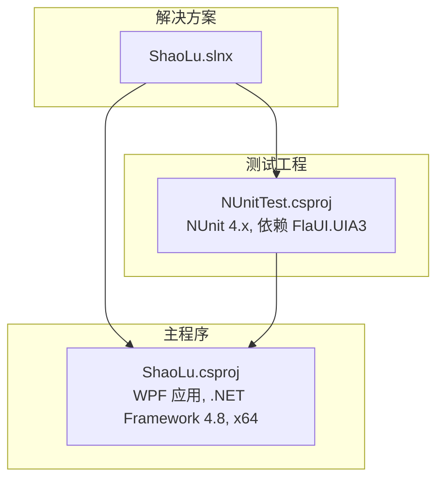
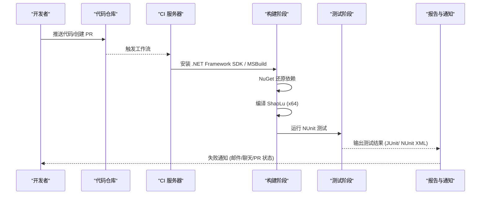
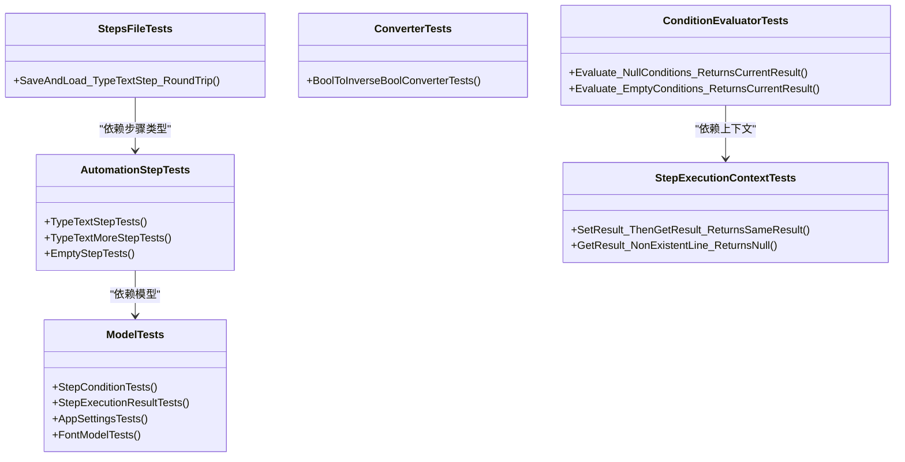
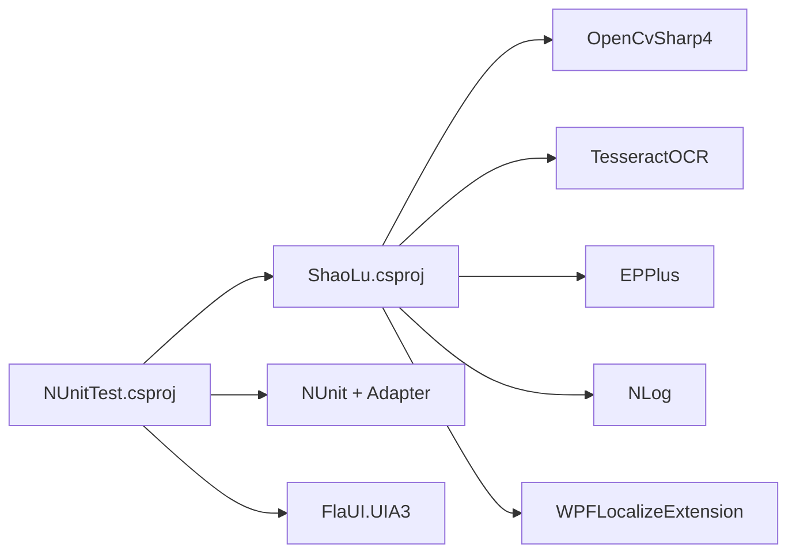

# 持续集成

<cite>
**本文引用的文件**   
- [NUnitTest.csproj](file://NUnitTest/NUnitTest.csproj)
- [ShaoLu.csproj](file://ShaoLu/ShaoLu.csproj)
- [ShaoLu.slnx](file://ShaoLu.slnx)
- [AutomationStepTests.cs](file://NUnitTest/AutomationStepTests.cs)
- [ModelTests.cs](file://NUnitTest/ModelTests.cs)
- [ConditionEvaluatorTests.cs](file://NUnitTest/ConditionEvaluatorTests.cs)
- [ConverterTests.cs](file://NUnitTest/ConverterTests.cs)
- [StepExecutionContextTests.cs](file://NUnitTest/StepExecutionContextTests.cs)
- [StepsFileTests.cs](file://NUnitTest/StepsFileTests.cs)
- [Readme.md](file://Readme.md)
</cite>

## 目录
1. [简介](#简介)
2. [项目结构](#项目结构)
3. [核心组件](#核心组件)
4. [架构总览](#架构总览)
5. [详细组件分析](#详细组件分析)
6. [依赖分析](#依赖分析)
7. [性能考虑](#性能考虑)
8. [故障排查指南](#故障排查指南)
9. [结论](#结论)
10. [附录](#附录)

## 简介
本文件为 ShaoLu 项目的持续集成（CI）配置与最佳实践指南，目标是在 CI 环境中自动构建、运行测试套件、收集测试结果并生成报告，同时提供失败通知机制。文档覆盖 GitHub Actions、Azure DevOps 等主流平台的配置要点，说明测试环境搭建要求、依赖项管理与测试数据准备，并给出性能测试与回归测试的集成方法。

## 项目结构
ShaoLu 是一个基于 WPF 的桌面自动化应用，包含主程序与单元测试工程：
- ShaoLu：WPF 应用程序，使用 .NET Framework 4.8，x64 平台目标，包含 UI、服务、工具、模型、视图模型等模块。
- NUnitTest：NUnit 单元测试工程，引用主程序，用于验证模型、转换器、条件评估器、执行上下文与序列化逻辑。
- 解决方案定义在 slnx 文件中，指定了 x64 平台与两个项目路径。

**图表来源**
- [ShaoLu.slnx:1-11](file://ShaoLu.slnx#L1-L11)
- [ShaoLu.csproj:1-40](file://ShaoLu/ShaoLu.csproj#L1-L40)
- [NUnitTest.csproj:1-35](file://NUnitTest/NUnitTest.csproj#L1-L35)

**章节来源**
- [ShaoLu.slnx:1-11](file://ShaoLu.slnx#L1-L11)
- [ShaoLu.csproj:1-40](file://ShaoLu/ShaoLu.csproj#L1-L40)
- [NUnitTest.csproj:1-35](file://NUnitTest/NUnitTest.csproj#L1-L35)

## 核心组件
- 构建与打包：MSBuild + NuGet 包还原，针对 .NET Framework 4.8 和 x64 平台。
- 测试框架：NUnit 4.x，配合 NUnit3TestAdapter 进行发现与执行；FlaUI.UIA3 用于 UI 自动化相关能力（若测试涉及 UI）。
- 依赖管理：通过 csproj 中的 PackageReference 声明依赖，包括 TesseractOCR、OpenCvSharp4、EPPlus、NLog、CommunityToolkit.Mvvm 等。
- 测试范围：模型默认值与克隆、转换器行为、条件评估器、执行上下文、JSON 序列化/反序列化等。

**章节来源**
- [NUnitTest.csproj:35-72](file://NUnitTest/NUnitTest.csproj#L35-L72)
- [ShaoLu.csproj:402-491](file://ShaoLu/ShaoLu.csproj#L402-L491)
- [AutomationStepTests.cs:1-50](file://NUnitTest/AutomationStepTests.cs#L1-L50)
- [ModelTests.cs:1-50](file://NUnitTest/ModelTests.cs#L1-L50)
- [ConditionEvaluatorTests.cs:1-47](file://NUnitTest/ConditionEvaluatorTests.cs#L1-L47)
- [ConverterTests.cs:1-47](file://NUnitTest/ConverterTests.cs#L1-L47)
- [StepExecutionContextTests.cs:1-49](file://NUnitTest/StepExecutionContextTests.cs#L1-L49)
- [StepsFileTests.cs:1-47](file://NUnitTest/StepsFileTests.cs#L1-L47)

## 架构总览
下图展示了 CI 管道中各阶段与工件的关系，以及测试执行流程。

[此图为概念性流程图，不直接映射具体源码文件]

## 详细组件分析

### 构建与依赖
- 目标框架与平台：.NET Framework 4.8，x64。
- 关键依赖：TesseractOCR、OpenCvSharp4、EPPlus、NLog、System.Drawing.Common、CommunityToolkit.Mvvm、WPFLocalizeExtension 等。
- 资源与训练数据：tessdata 下的多语言训练数据需复制到输出目录。
- 外部库引用：WPFDevelopers.dll 通过 HintPath 引用，需在 CI 环境中确保该文件可用或改为 NuGet 包。

**章节来源**
- [ShaoLu.csproj:28-41](file://ShaoLu/ShaoLu.csproj#L28-L41)
- [ShaoLu.csproj:122-129](file://ShaoLu/ShaoLu.csproj#L122-L129)
- [ShaoLu.csproj:402-491](file://ShaoLu/ShaoLu.csproj#L402-L491)
- [ShaoLu.csproj:465-489](file://ShaoLu/ShaoLu.csproj#L465-L489)

### 测试工程与用例
- 测试框架：NUnit 4.x，NUnit3TestAdapter。
- 测试覆盖：
  - 自动化步骤类（构造函数、Clone、属性默认值、UID 唯一性等）
  - 模型类（默认值、Clone、属性变更事件）
  - 转换器（布尔反转、可见性转换等）
  - 条件评估器（空条件、默认行为、组合逻辑）
  - 执行上下文（结果存取、覆盖行为）
  - StepsFile JSON 序列化/反序列化（保存与加载往返）
- 测试数据：StepsFileTests 使用临时目录进行读写，TearDown 清理。

**图表来源**
- [AutomationStepTests.cs:1-50](file://NUnitTest/AutomationStepTests.cs#L1-L50)
- [ModelTests.cs:1-50](file://NUnitTest/ModelTests.cs#L1-L50)
- [ConditionEvaluatorTests.cs:1-47](file://NUnitTest/ConditionEvaluatorTests.cs#L1-L47)
- [ConverterTests.cs:1-47](file://NUnitTest/ConverterTests.cs#L1-L47)
- [StepExecutionContextTests.cs:1-49](file://NUnitTest/StepExecutionContextTests.cs#L1-L49)
- [StepsFileTests.cs:1-47](file://NUnitTest/StepsFileTests.cs#L1-L47)

**章节来源**
- [NUnitTest.csproj:45-72](file://NUnitTest/NUnitTest.csproj#L45-L72)
- [AutomationStepTests.cs:1-200](file://NUnitTest/AutomationStepTests.cs#L1-L200)
- [ModelTests.cs:1-200](file://NUnitTest/ModelTests.cs#L1-L200)
- [ConditionEvaluatorTests.cs:1-47](file://NUnitTest/ConditionEvaluatorTests.cs#L1-L47)
- [ConverterTests.cs:1-47](file://NUnitTest/ConverterTests.cs#L1-L47)
- [StepExecutionContextTests.cs:1-49](file://NUnitTest/StepExecutionContextTests.cs#L1-L49)
- [StepsFileTests.cs:1-47](file://NUnitTest/StepsFileTests.cs#L1-L47)

### 测试环境与数据准备
- 操作系统：Windows（WPF 与 System.Drawing.Common 需要 Windows 运行时支持）。
- 运行时：.NET Framework 4.8 开发工具链（MSBuild、NuGet）。
- 依赖项：
  - NuGet 包还原（TesseractOCR、OpenCvSharp4、EPPlus、NLog 等）。
  - 本地引用 WPFDevelopers.dll（建议迁移到 NuGet 包以简化 CI 依赖）。
  - tessdata 训练数据复制到输出目录。
- 测试数据：
  - StepsFileTests 使用临时目录，无需持久化数据。
  - 如需 OCR 或图像识别相关测试，应确保 tessdata 存在且可访问。

**章节来源**
- [ShaoLu.csproj:465-489](file://ShaoLu/ShaoLu.csproj#L465-L489)
- [StepsFileTests.cs:17-31](file://NUnitTest/StepsFileTests.cs#L17-L31)

## 依赖分析
- 测试工程对主程序的引用：NUnitTest.csproj 通过 ProjectReference 引用 ShaoLu.csproj。
- 外部依赖：
  - NUnit 与适配器用于测试发现与执行。
  - FlaUI.UIA3 用于 UI 自动化（若测试涉及 UI 控件）。
  - 图像处理与 OCR 依赖（OpenCvSharp4、TesseractOCR）。
  - Excel 处理（EPPlus）。
  - 日志（NLog）。
  - 国际化（WPFLocalizeExtension）。
- 潜在风险：
  - 本地引用 WPFDevelopers.dll 可能导致 CI 环境缺失该文件。
  - System.Drawing.Common 在 Linux 上受限，但本项目为 Windows 桌面应用，影响有限。

**图表来源**
- [NUnitTest.csproj:55-72](file://NUnitTest/NUnitTest.csproj#L55-L72)
- [ShaoLu.csproj:402-491](file://ShaoLu/ShaoLu.csproj#L402-L491)

**章节来源**
- [NUnitTest.csproj:55-72](file://NUnitTest/NUnitTest.csproj#L55-L72)
- [ShaoLu.csproj:402-491](file://ShaoLu/ShaoLu.csproj#L402-L491)

## 性能考虑
- 构建优化：
  - 启用增量构建与并行编译（MSBuild 默认支持）。
  - 缓存 NuGet 包与中间产物以减少重复下载与编译时间。
- 测试优化：
  - 避免启动 UI 线程的测试（WPF 相关测试需谨慎），优先使用无头测试。
  - 将耗时较长的 OCR/图像识别测试归类为“慢测试”，在 CI 中单独执行或限制并发。
- 资源管理：
  - 确保 tessdata 训练数据预置，避免运行时解压或下载。
  - 控制测试数据大小，避免大文件 IO 阻塞。

[本节为通用指导，不直接分析具体文件]

## 故障排查指南
- 常见构建问题：
  - 缺少 .NET Framework 4.8 SDK：在 CI 镜像中安装对应版本。
  - 本地引用缺失（WPFDevelopers.dll）：改用 NuGet 包或在 CI 中提供该文件。
  - tessdata 未复制：确认 csproj 中 Content 配置正确，CI 中保留 CopyToOutputDirectory。
- 常见测试问题：
  - 临时目录权限不足：StepsFileTests 使用系统临时目录，确保写入权限。
  - UI 自动化依赖（FlaUI）：若测试涉及 UI，需确保桌面会话可用（GitHub Actions 的 windows-latest 通常支持）。
  - 图像识别失败：检查 OpenCvSharp4 与 TesseractOCR 依赖是否完整。
- 报告与通知：
  - 输出 NUnit 或 JUnit 格式报告以便可视化。
  - 失败时发送通知（邮件、Slack、Teams 等）。

**章节来源**
- [StepsFileTests.cs:17-31](file://NUnitTest/StepsFileTests.cs#L17-L31)
- [ShaoLu.csproj:465-489](file://ShaoLu/ShaoLu.csproj#L465-L489)
- [NUnitTest.csproj:55-72](file://NUnitTest/NUnitTest.csproj#L55-L72)

## 结论
通过合理的 CI 配置，ShaoLu 可以在每次提交或 PR 时自动完成构建、依赖还原、测试执行与报告生成。重点在于确保 Windows 环境、.NET Framework 4.8、必要的 NuGet 包与 tessdata 训练数据可用，并将本地引用替换为包依赖以提升可移植性。结合性能测试与回归测试策略，可有效保障代码质量与稳定性。

[本节为总结性内容，不直接分析具体文件]

## 附录

### GitHub Actions 示例（概念性）
- 触发：push、pull_request。
- 环境：windows-latest，安装 .NET Framework 4.8 SDK。
- 步骤：
  - 检出代码
  - 还原 NuGet 包
  - 构建 ShaoLu（x64）
  - 运行 NUnit 测试
  - 上传测试结果与报告
  - 失败通知

[此部分为概念性配置说明，不直接映射具体源码文件]

### Azure DevOps 示例（概念性）
- 触发：分支推送、PR 合并。
- 代理：Hosted VS2022（Windows）。
- 任务：
  - NuGet restore
  - MSBuild 构建（Configuration=Release, Platform=x64）
  - 运行 NUnit 测试（使用 VSTest 或 NUnit 任务）
  - 发布测试结果
  - 失败通知

[此部分为概念性配置说明，不直接映射具体源码文件]

### 性能测试与回归测试集成
- 性能测试：
  - 将耗时测试标记为“慢测试”，在 CI 中单独执行或使用超时保护。
  - 记录关键指标（如 OCR 识别时间、图像匹配时间）并生成趋势图。
- 回归测试：
  - 固定测试数据集，确保每次回归对比一致。
  - 使用快照测试或基线对比，检测 UI 或输出变化。

[此部分为概念性指导，不直接分析具体文件]