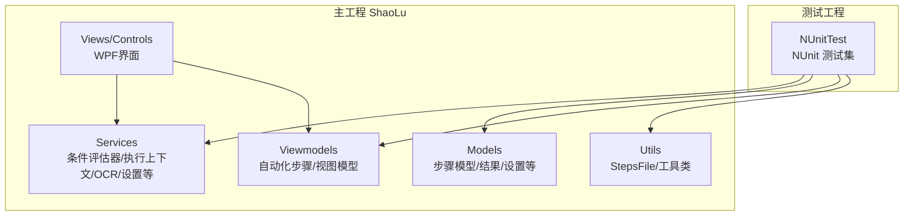
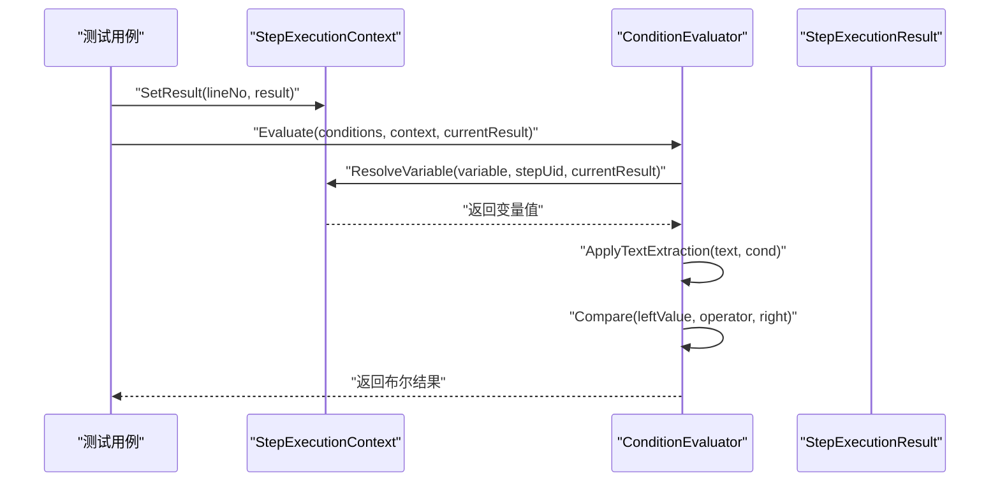
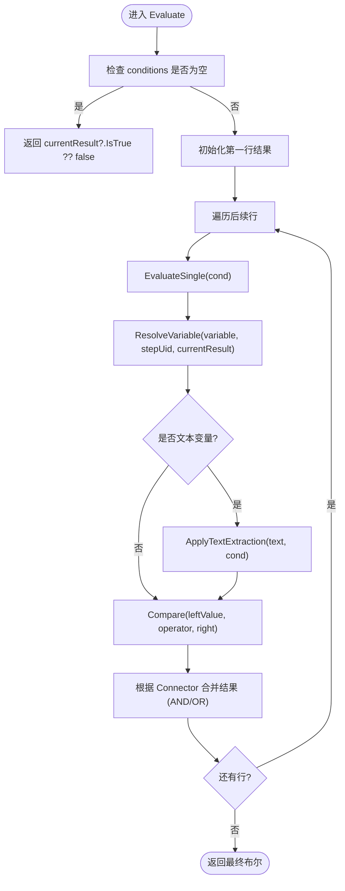
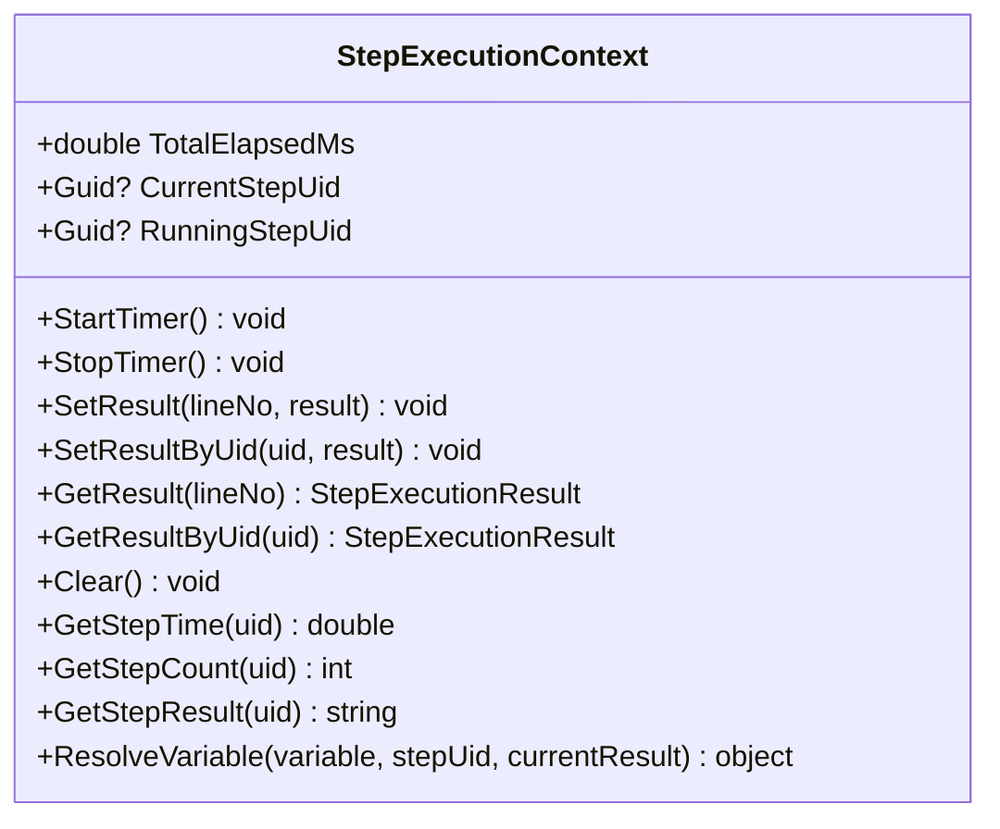
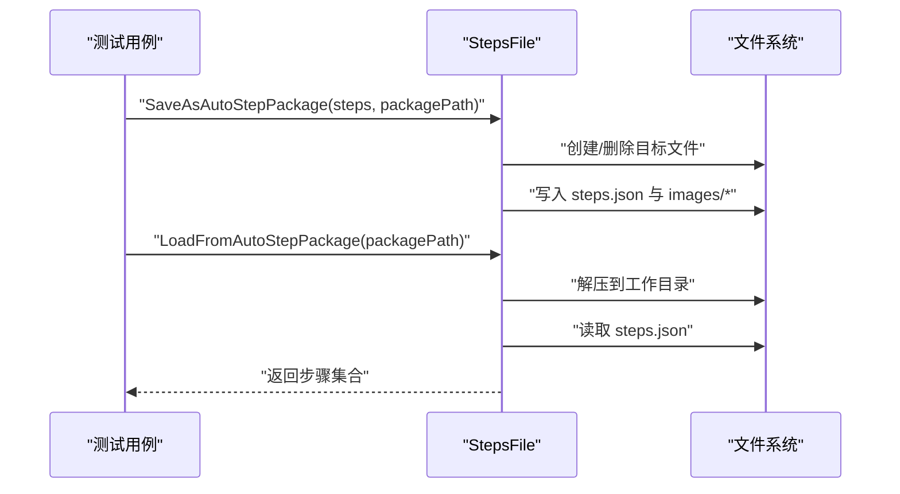
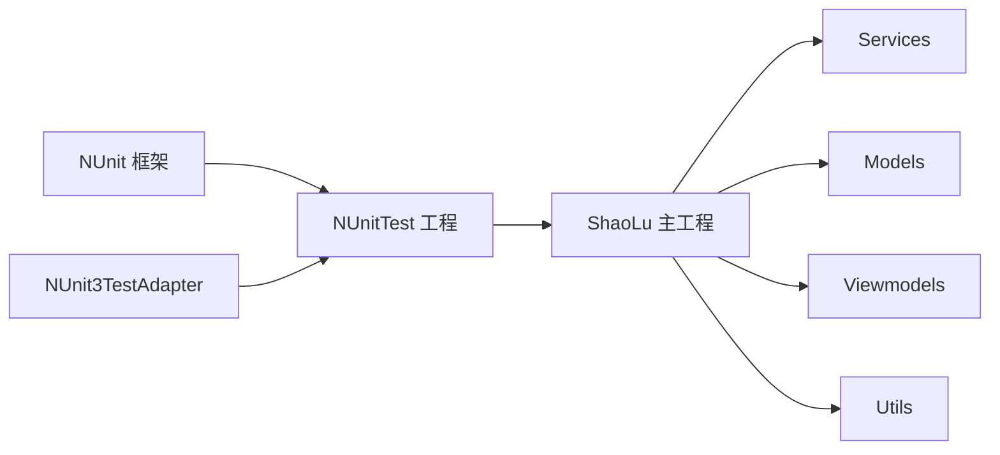

# 测试策略

<cite>
**本文档引用的文件**   
- [NUnitTest.csproj](file://NUnitTest/NUnitTest.csproj)
- [AutomationStepTests.cs](file://NUnitTest/AutomationStepTests.cs)
- [ConditionEvaluatorTests.cs](file://NUnitTest/ConditionEvaluatorTests.cs)
- [ModelTests.cs](file://NUnitTest/ModelTests.cs)
- [ConverterTests.cs](file://NUnitTest/ConverterTests.cs)
- [StepExecutionContextTests.cs](file://NUnitTest/StepExecutionContextTests.cs)
- [StepsFileTests.cs](file://NUnitTest/StepsFileTests.cs)
- [ConditionEvaluator.cs](file://ShaoLu/Services/ConditionEvaluator.cs)
- [StepExecutionContext.cs](file://ShaoLu/Services/StepExecutionContext.cs)
- [StepsFile.cs](file://ShaoLu/Utils/StepsFile.cs)
- [App.config](file://ShaoLu/App.config)
</cite>

## 目录
1. [简介](#简介)
2. [项目结构](#项目结构)
3. [核心组件](#核心组件)
4. [架构总览](#架构总览)
5. [详细组件分析](#详细组件分析)
6. [依赖关系分析](#依赖关系分析)
7. [性能考虑](#性能考虑)
8. [故障排查指南](#故障排查指南)
9. [结论](#结论)
10. [附录](#附录)

## 简介
本测试策略文档面向 ShaoLu 项目的质量保障，围绕 NUnit 测试框架的使用、单元测试编写规范、测试用例设计原则、核心逻辑的覆盖策略、边界与异步测试技巧、集成测试实施、Mock 对象使用、测试数据准备、持续集成配置、测试报告生成与代码覆盖率统计等方面给出系统化指导。文档同时结合现有测试工程与核心服务实现，提供可操作的实践建议与最佳实践。

## 项目结构
ShaoLu 采用 WPF 桌面应用架构，业务逻辑集中在 Services、Models、Viewmodels、Utils 等目录；UI 层位于 Views 与 Controls；测试工程 NUnitTest 独立于主工程，引用主工程并基于 NUnit 框架组织测试类。

**图表来源** 
- [NUnitTest.csproj:1-72](file://NUnitTest/NUnitTest.csproj#L1-L72)
- [App.config:1-6](file://ShaoLu/App.config#L1-L6)

**章节来源**
- [NUnitTest.csproj:1-72](file://NUnitTest/NUnitTest.csproj#L1-L72)
- [App.config:1-6](file://ShaoLu/App.config#L1-L6)

## 核心组件
- 条件评估器（ConditionEvaluator）：负责根据规则行列表与执行上下文计算最终布尔结果，支持常量、自身变量、引用步骤变量、文本提取、正则匹配、数值/字符串比较以及 AND/OR 组合。
- 执行上下文（StepExecutionContext）：维护步骤执行结果（按行号与 Uid）、计时、当前/运行中步骤标识，并提供变量解析能力。
- 步骤文件序列化（StepsFile）：将步骤集合序列化为 JSON 或 .autostep 压缩包，支持图片资源打包与旧格式兼容处理。

这些组件是自动化流程的核心，测试需覆盖其关键路径、边界情况与异常场景。

**章节来源**
- [ConditionEvaluator.cs:1-200](file://ShaoLu/Services/ConditionEvaluator.cs#L1-L200)
- [StepExecutionContext.cs:1-163](file://ShaoLu/Services/StepExecutionContext.cs#L1-L163)
- [StepsFile.cs:1-200](file://ShaoLu/Utils/StepsFile.cs#L1-L200)

## 架构总览
下图展示条件评估与执行上下文的交互流程，体现变量解析、文本提取、比较运算与逻辑组合的关键路径。

**图表来源** 
- [ConditionEvaluator.cs:1-200](file://ShaoLu/Services/ConditionEvaluator.cs#L1-L200)
- [StepExecutionContext.cs:1-163](file://ShaoLu/Services/StepExecutionContext.cs#L1-L163)

## 详细组件分析

### 条件评估器（ConditionEvaluator）
- 功能要点
  - 空条件或无规则时回退到当前结果 IsTrue。
  - 支持常量真/假、自身变量（IsTrue/Similarity/ExecutionTimeMs/ClickX/Y/OCRText/PopupResult）、引用步骤变量（通过 Uid）。
  - 文本提取模式：整段、指定行、从子串开始取长度、从开头/末尾取长度。
  - 比较操作：等于/不等于/包含/不包含/为空/非空/正则匹配，以及数值大小比较。
  - 多行条件通过 Connector（AND/OR）组合。
- 测试覆盖现状
  - 已覆盖空条件、常量、布尔比较、数字比较、字符串比较、IsEmpty/IsNotEmpty、AND/OR 组合、引用步骤变量、文本提取多种模式与边界。
- 建议补充
  - 正则表达式非法模式的容错路径。
  - OCRText 为 null 时的提取行为。
  - 极端数值与浮点精度边界（如 1e-9 容忍度）。
  - 大文本与长行范围的性能回归测试。

**图表来源** 
- [ConditionEvaluator.cs:1-200](file://ShaoLu/Services/ConditionEvaluator.cs#L1-L200)

**章节来源**
- [ConditionEvaluatorTests.cs:1-662](file://NUnitTest/ConditionEvaluatorTests.cs#L1-L662)
- [ConditionEvaluator.cs:1-200](file://ShaoLu/Services/ConditionEvaluator.cs#L1-L200)

### 执行上下文（StepExecutionContext）
- 功能要点
  - 存储步骤执行结果（按行号与 Uid），支持覆盖与查询。
  - 维护总计时、当前/运行中步骤 Uid、执行次数计数。
  - 提供变量解析方法，区分 Self_* 与 Step_* 变量，并处理缺失值的默认行为。
- 测试覆盖现状
  - 已覆盖 SetResult/GetResult、Clear、ResolveVariable 的常量、Self_*、Step_* 各类变量及缺失值默认行为。
- 建议补充
  - 并发写入/读取的安全性验证（若存在多线程场景）。
  - 大量步骤结果的内存占用与清理时机。
  - CurrentStepUid 与 RunningStepUid 的生命周期一致性。

**图表来源** 
- [StepExecutionContext.cs:1-163](file://ShaoLu/Services/StepExecutionContext.cs#L1-L163)

**章节来源**
- [StepExecutionContextTests.cs:1-253](file://NUnitTest/StepExecutionContextTests.cs#L1-L253)
- [StepExecutionContext.cs:1-163](file://ShaoLu/Services/StepExecutionContext.cs#L1-L163)

### 步骤文件序列化（StepsFile）
- 功能要点
  - 保存为 .autostep 压缩包（zip），包含 steps.json 与裁剪图片。
  - 加载压缩包并解压至工作目录，解析旧格式行号为 Uid。
  - 兼容旧版 JSON 保存/加载接口（标记为过时）。
- 测试覆盖现状
  - 已覆盖多种步骤类型的往返序列化、条件与文本提取字段、Uid 跳转一致性、参数校验与异常路径、工作目录路径计算。
- 建议补充
  - 损坏 zip 文件的健壮性处理。
  - 超大图片与多步骤包的压缩/解压性能基准。
  - 跨平台路径分隔符兼容性。

**图表来源** 
- [StepsFile.cs:1-200](file://ShaoLu/Utils/StepsFile.cs#L1-L200)

**章节来源**
- [StepsFileTests.cs:1-312](file://NUnitTest/StepsFileTests.cs#L1-L312)
- [StepsFile.cs:1-200](file://ShaoLu/Utils/StepsFile.cs#L1-L200)

### 模型与转换器（Model & Converter）
- 模型（ModelTests）
  - 覆盖 StepCondition、StepExecutionResult、AppSettings、FontModel、StepType 枚举、StepExecutionLog 的默认值、Clone 独立性、属性变更事件等。
- 转换器（ConverterTests）
  - 覆盖 BoolToInverseBoolConverter、NullToVisibilityConverter、ConditionModeToVisibilityConverter、ConditionEnumToStringConverter 的正向转换、反向转换与异常路径。
- 建议补充
  - 本地化资源未初始化时的回退行为验证。
  - 复杂绑定场景下的转换器性能与稳定性。

**章节来源**
- [ModelTests.cs:1-300](file://NUnitTest/ModelTests.cs#L1-L300)
- [ConverterTests.cs:1-318](file://NUnitTest/ConverterTests.cs#L1-L318)

### 自动化步骤（AutomationStep）
- 覆盖内容
  - TypeTextStep、TypeTextMoreStep、EmptyStep、PopupStep 的构造函数、默认属性、Clone 独立性、命令（Add/Remove Condition）行为、错误类型与自引用计数等。
- 建议补充
  - 各步骤执行逻辑的集成测试（与 OCR/输入模拟等外部依赖交互）。
  - 长时间等待与超时场景的边界测试。

**章节来源**
- [AutomationStepTests.cs:1-373](file://NUnitTest/AutomationStepTests.cs#L1-L373)

## 依赖关系分析
测试工程通过 NUnit 与 NUnit3TestAdapter 引用主工程，确保测试可在任意 CPU 平台下运行，且与 WPF/.NET Framework 4.8 环境兼容。

**图表来源** 
- [NUnitTest.csproj:1-72](file://NUnitTest/NUnitTest.csproj#L1-L72)

**章节来源**
- [NUnitTest.csproj:1-72](file://NUnitTest/NUnitTest.csproj#L1-L72)

## 性能考虑
- 条件评估器在大量条件行与复杂文本提取时应进行性能回归测试，避免正则与字符串操作成为瓶颈。
- StepsFile 的压缩包读写涉及 I/O 与压缩，建议在 CI 中加入基准测试以监控变化。
- StepExecutionContext 的字典访问应保证线程安全（若存在并发），必要时引入锁或不可变数据结构。

[本节为通用指导，不直接分析具体文件]

## 故障排查指南
- 常见断言失败
  - 条件评估结果为预期相反：检查变量解析与文本提取配置是否正确。
  - JSON/包序列化不一致：确认 Uid 与跳转引用是否保持，检查旧格式兼容处理。
  - 转换器返回值不符合预期：核对 ConvertBack 是否抛出或未实现。
- 日志与诊断
  - 条件评估失败会记录警告日志，定位失败的变量与参数。
  - 文件 I/O 异常（路径为空、文件不存在）应有明确异常信息。

**章节来源**
- [ConditionEvaluator.cs:1-200](file://ShaoLu/Services/ConditionEvaluator.cs#L1-L200)
- [StepsFile.cs:1-200](file://ShaoLu/Utils/StepsFile.cs#L1-L200)

## 结论
ShaoLu 的测试工程已对核心逻辑（条件评估、执行上下文、序列化）提供了较为全面的单元测试覆盖，重点验证了默认值、克隆独立性、变量解析、文本提取、比较与逻辑组合、I/O 异常路径等。为进一步增强质量保障，建议补充以下方面：
- 集成测试：覆盖 OCR、屏幕输入、弹窗交互等外部依赖，使用 Mock/Stub 隔离系统调用。
- 异步测试：针对耗时操作（图像识别、文件 I/O）增加超时与取消语义的验证。
- 持续集成：在 CI 中自动运行测试、生成报告与覆盖率统计，纳入质量门禁。
- 性能基准：对关键路径建立基准测试，防止回归。

[本节为总结性内容，不直接分析具体文件]

## 附录

### 测试框架与工程配置
- 框架版本
  - NUnit 4.6.1
  - NUnit3TestAdapter 6.2.0
- 目标框架
  - .NET Framework 4.8（x64）
- 项目引用
  - 测试工程引用主工程 ShaoLu，以便测试业务逻辑与模型。

**章节来源**
- [NUnitTest.csproj:1-72](file://NUnitTest/NUnitTest.csproj#L1-L72)
- [App.config:1-6](file://ShaoLu/App.config#L1-L6)

### 单元测试编写规范
- 命名约定
  - 测试类与方法名清晰表达意图，如“方法名_场景_期望结果”。
- 测试结构
  - 使用 [SetUp]/[TearDown] 管理测试数据生命周期，确保隔离与幂等。
- 断言风格
  - 使用 Assert.That(...) 统一断言风格，便于阅读与维护。
- 边界与异常
  - 覆盖空值、越界、非法输入、异常路径，确保鲁棒性。

[本节为通用指导，不直接分析具体文件]

### 测试用例设计原则
- 等价类划分：按输入域划分等价类，选取代表性用例。
- 边界值分析：关注最小/最大、空串、零值、溢出等边界。
- 状态迁移：对步骤执行状态（如 IsTrue、Similarity、ExecutionTimeMs）进行状态机式验证。
- 组合逻辑：对 AND/OR 组合、多条件行顺序进行充分覆盖。

[本节为通用指导，不直接分析具体文件]

### 核心逻辑的测试覆盖策略
- 条件评估器
  - 空条件、常量、布尔/数值/字符串比较、IsEmpty/IsNotEmpty、正则匹配、文本提取、AND/OR 组合、引用步骤变量。
- 执行上下文
  - SetResult/GetResult、Clear、ResolveVariable 的各类变量与缺失值默认行为。
- 序列化
  - 多步骤类型往返、Uid 跳转一致性、条件与文本提取字段、参数校验与异常路径。

**章节来源**
- [ConditionEvaluatorTests.cs:1-662](file://NUnitTest/ConditionEvaluatorTests.cs#L1-L662)
- [StepExecutionContextTests.cs:1-253](file://NUnitTest/StepExecutionContextTests.cs#L1-L253)
- [StepsFileTests.cs:1-312](file://NUnitTest/StepsFileTests.cs#L1-L312)

### 边界情况的测试方法
- 数值边界：浮点精度（1e-9 容忍）、极大/极小值、除零保护。
- 字符串边界：空串、空白串、超长串、特殊字符、编码问题。
- 文件 I/O：空路径、不存在文件、权限不足、损坏压缩包。

**章节来源**
- [ConditionEvaluator.cs:1-200](file://ShaoLu/Services/ConditionEvaluator.cs#L1-L200)
- [StepsFile.cs:1-200](file://ShaoLu/Utils/StepsFile.cs#L1-L200)

### 异步操作的测试技巧
- 使用 Task 与 async/await 编写异步测试，设置合理超时。
- 对耗时操作（OCR、I/O）使用 Mock 或 Stub 加速测试。
- 验证取消令牌与异常传播的正确性。

[本节为通用指导，不直接分析具体文件]

### 集成测试的实施方法
- 目标：验证端到端流程（步骤加载、OCR 识别、输入模拟、弹窗交互）。
- 隔离外部依赖：使用 Mock 替换屏幕捕获、鼠标键盘注入、文件系统等。
- 数据准备：预置测试图片、JSON/autostep 包、用户配置。

[本节为通用指导，不直接分析具体文件]

### Mock 对象的使用
- 推荐库：Moq（适用于接口 Mock）、FakeItEasy（更简洁语法）。
- 使用场景：OCRService、UserService、IConfigurationService 等外部依赖。
- 注意事项：保持契约一致，避免过度 Mock 导致测试脆弱。

[本节为通用指导，不直接分析具体文件]

### 测试数据的准备
- 静态数据：JSON/autostep 包、图片资源、配置文件。
- 动态数据：随机生成的步骤集合、OCR 文本、点击坐标。
- 清理策略：测试后清理临时目录与文件，确保环境干净。

**章节来源**
- [StepsFileTests.cs:1-312](file://NUnitTest/StepsFileTests.cs#L1-L312)

### 持续集成配置
- 构建阶段：还原 NuGet 包、编译 Debug/Release。
- 测试阶段：运行 NUnit 测试集，输出测试结果。
- 报告与覆盖率：生成 NUnit 报告与覆盖率统计（如 OpenCover/Coverlet）。
- 质量门禁：失败则阻断发布。

[本节为通用指导，不直接分析具体文件]

### 测试报告生成与代码覆盖率统计
- 报告工具：NUnit3TestAdapter 输出 XML，配合 Azure DevOps/GitHub Actions 渲染。
- 覆盖率工具：OpenCover + ReportGenerator 或 Coverlet + dotnet-reportgenerator。
- 阈值设定：设定最低覆盖率阈值，未达标则失败。

[本节为通用指导，不直接分析具体文件]

### 具体的测试示例与最佳实践
- 示例参考
  - 条件评估器：空条件、常量、布尔/数值/字符串比较、AND/OR 组合、文本提取。
  - 执行上下文：SetResult/GetResult、Clear、ResolveVariable 各类变量。
  - 序列化：多步骤类型往返、Uid 跳转一致性、异常路径。
- 最佳实践
  - 单一职责：每个测试只验证一个行为。
  - 可读性：测试名即文档，断言清晰。
  - 稳定性：避免依赖外部环境，使用 Mock/Stub。
  - 可维护性：共享夹具与数据集中管理。

**章节来源**
- [ConditionEvaluatorTests.cs:1-662](file://NUnitTest/ConditionEvaluatorTests.cs#L1-L662)
- [StepExecutionContextTests.cs:1-253](file://NUnitTest/StepExecutionContextTests.cs#L1-L253)
- [StepsFileTests.cs:1-312](file://NUnitTest/StepsFileTests.cs#L1-L312)