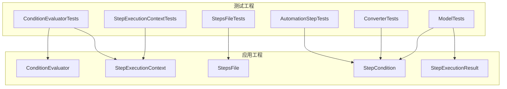
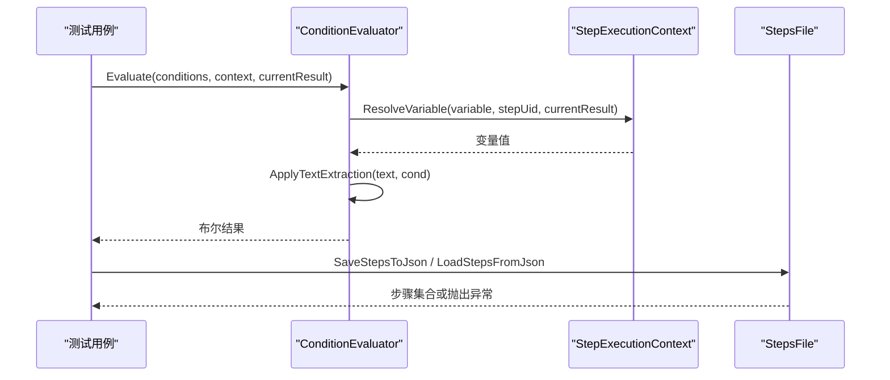
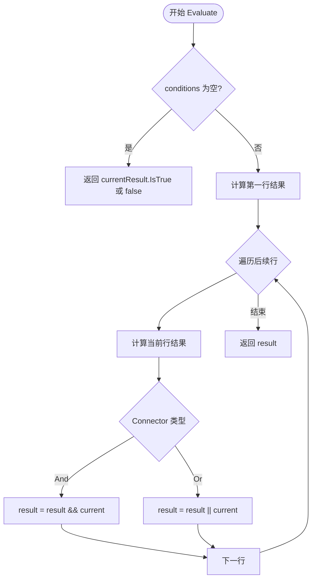
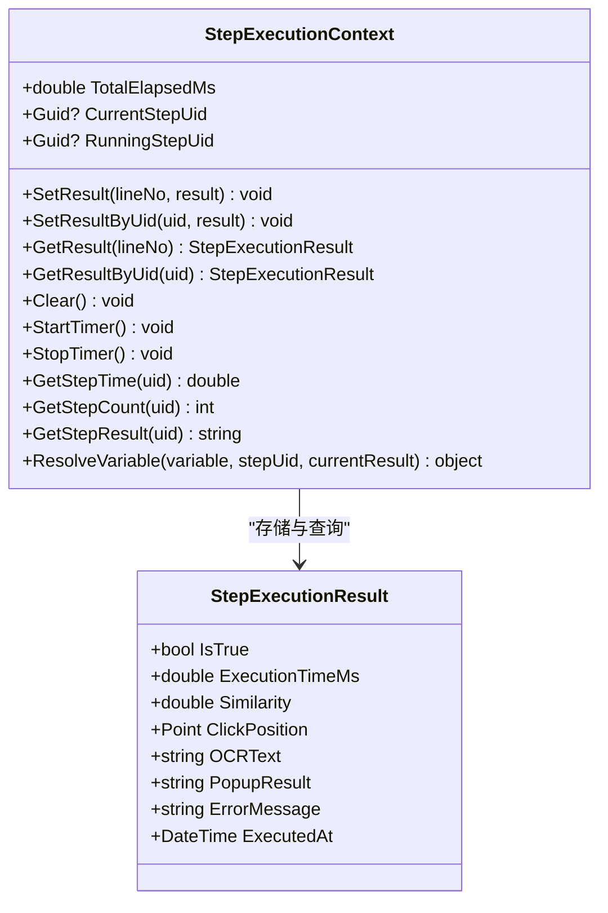
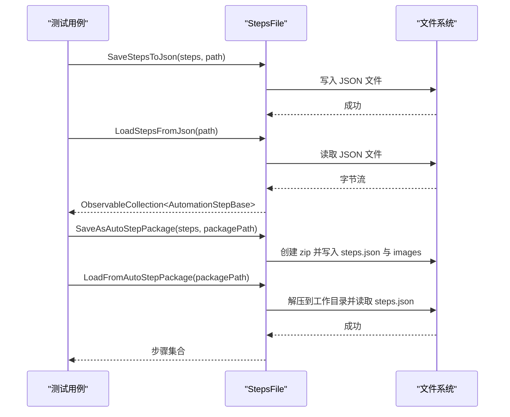
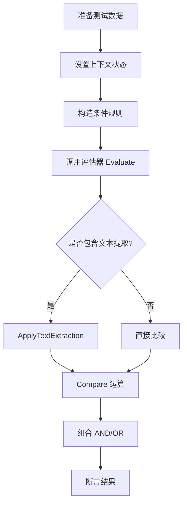
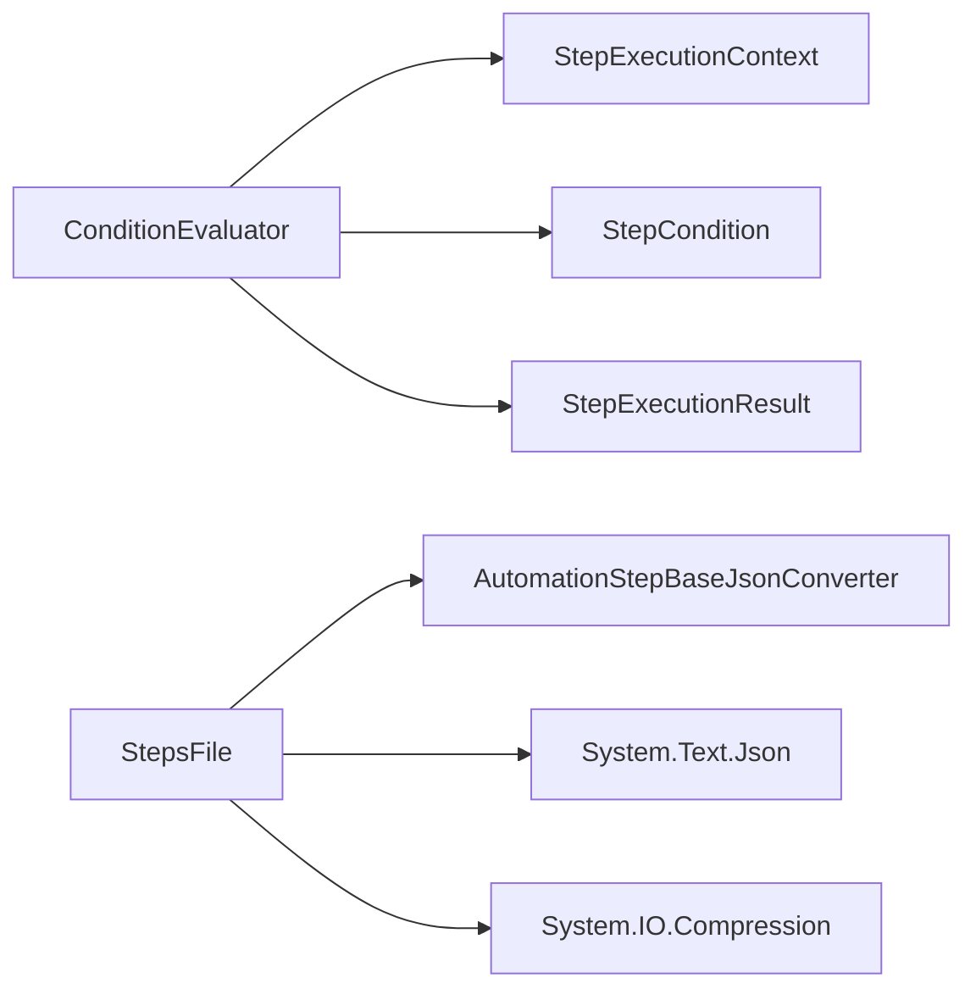

# 集成测试

<cite>
**本文引用的文件**   
- [ConditionEvaluatorTests.cs](file://NUnitTest/ConditionEvaluatorTests.cs)
- [StepExecutionContextTests.cs](file://NUnitTest/StepExecutionContextTests.cs)
- [StepsFileTests.cs](file://NUnitTest/StepsFileTests.cs)
- [AutomationStepTests.cs](file://NUnitTest/AutomationStepTests.cs)
- [ConverterTests.cs](file://NUnitTest/ConverterTests.cs)
- [ModelTests.cs](file://NUnitTest/ModelTests.cs)
- [ConditionEvaluator.cs](file://ShaoLu/Services/ConditionEvaluator.cs)
- [StepExecutionContext.cs](file://ShaoLu/Services/StepExecutionContext.cs)
- [StepsFile.cs](file://ShaoLu/Utils/StepsFile.cs)
- [StepCondition.cs](file://ShaoLu/Models/StepCondition.cs)
- [StepExecutionResult.cs](file://ShaoLu/Models/StepExecutionResult.cs)
</cite>

## 目录
1. [简介](#简介)
2. [项目结构](#项目结构)
3. [核心组件](#核心组件)
4. [架构总览](#架构总览)
5. [详细组件分析](#详细组件分析)
6. [依赖分析](#依赖分析)
7. [性能考虑](#性能考虑)
8. [故障排查指南](#故障排查指南)
9. [结论](#结论)
10. [附录](#附录)

## 简介
本文件面向 ShaoLu 项目的集成测试，聚焦以下目标：
- 条件评估器的测试方法：覆盖常量、布尔、数值、字符串、空值判断、正则匹配、AND/OR 组合、引用其他步骤结果、识别文本提取等场景与边界。
- 步骤执行上下文的测试策略：上下文状态管理（按行号与 Uid 存取）、变量解析、计时器、错误处理与清理。
- 步骤文件操作的集成测试：JSON 序列化/反序列化往返、.autostep 压缩包读写、工作目录管理、异常恢复与兼容性处理。
- Mock 对象与测试数据准备的最佳实践：如何构造稳定的测试数据、隔离外部依赖、保证可重复性与可维护性。

## 项目结构
测试位于 NUnitTest 工程，被测代码位于 ShaoLu 工程。关键路径如下：
- 服务层：ShaoLu/Services 下的 ConditionEvaluator、StepExecutionContext
- 工具层：ShaoLu/Utils 下的 StepsFile
- 模型层：ShaoLu/Models 下的 StepCondition、StepExecutionResult
- 测试用例：NUnitTest 下的 ConditionEvaluatorTests、StepExecutionContextTests、StepsFileTests、AutomationStepTests、ConverterTests、ModelTests

图表来源
- [ConditionEvaluatorTests.cs:1-662](file://NUnitTest/ConditionEvaluatorTests.cs#L1-L662)
- [StepExecutionContextTests.cs:1-253](file://NUnitTest/StepExecutionContextTests.cs#L1-L253)
- [StepsFileTests.cs:1-312](file://NUnitTest/StepsFileTests.cs#L1-L312)
- [ConditionEvaluator.cs:1-294](file://ShaoLu/Services/ConditionEvaluator.cs#L1-L294)
- [StepExecutionContext.cs:1-163](file://ShaoLu/Services/StepExecutionContext.cs#L1-L163)
- [StepsFile.cs:1-244](file://ShaoLu/Utils/StepsFile.cs#L1-L244)
- [StepCondition.cs:1-405](file://ShaoLu/Models/StepCondition.cs#L1-L405)
- [StepExecutionResult.cs:1-51](file://ShaoLu/Models/StepExecutionResult.cs#L1-L51)

章节来源
- [ConditionEvaluatorTests.cs:1-662](file://NUnitTest/ConditionEvaluatorTests.cs#L1-L662)
- [StepExecutionContextTests.cs:1-253](file://NUnitTest/StepExecutionContextTests.cs#L1-L253)
- [StepsFileTests.cs:1-312](file://NUnitTest/StepsFileTests.cs#L1-L312)

## 核心组件
- 条件评估器（ConditionEvaluator）
  - 负责将多条规则行按 AND/OR 连接器组合，返回最终布尔结果。
  - 支持常量、Self_*、Step_* 变量，以及 OCR 文本的多种提取模式。
  - 内置比较逻辑：布尔、数字、字符串、IsEmpty/IsNotEmpty、RegexMatch。
- 步骤执行上下文（StepExecutionContext）
  - 以字典存储按行号与 Uid 的执行结果，提供变量解析 ResolveVariable。
  - 维护总计时器、当前/运行中步骤 Uid、执行次数统计。
- 步骤文件（StepsFile）
  - JSON 与 .autostep 压缩包的序列化和反序列化。
  - 兼容旧版行号跳转，自动解析为 Uid 引用；管理工作目录与图片资源。

章节来源
- [ConditionEvaluator.cs:1-294](file://ShaoLu/Services/ConditionEvaluator.cs#L1-L294)
- [StepExecutionContext.cs:1-163](file://ShaoLu/Services/StepExecutionContext.cs#L1-L163)
- [StepsFile.cs:1-244](file://ShaoLu/Utils/StepsFile.cs#L1-L244)

## 架构总览
下图展示了条件评估流程与上下文交互的关键调用链，以及文件 I/O 的集成点。

图表来源
- [ConditionEvaluator.cs:23-51](file://ShaoLu/Services/ConditionEvaluator.cs#L23-L51)
- [StepExecutionContext.cs:112-160](file://ShaoLu/Services/StepExecutionContext.cs#L112-L160)
- [StepsFile.cs:175-219](file://ShaoLu/Utils/StepsFile.cs#L175-L219)

## 详细组件分析

### 条件评估器测试方法与场景
- 空条件与默认行为
  - 无条件时直接返回当前结果的 IsTrue；当 currentResult 为 null 时返回 false。
- 常量条件
  - ConstantTrue 恒真，ConstantFalse 恒假。
- 布尔比较
  - Self_IsTrue 与 true/false/1/0 的等价性；NotEqual 的正确性。
- 数值比较
  - Similarity、ExecutionTimeMs 的 GreaterThan/LessThan/Equal/NotEqual/GreaterOrEqual/LessOrEqual。
- 字符串比较
  - OCRText 的 Equal/Contains/NotContains/NotEqual，不区分大小写。
- 空值判断
  - IsEmpty/IsNotEmpty 对空字符串与 null 的处理。
- 逻辑组合
  - AND/OR 多行组合，含混合连接器的优先级与短路语义。
- 引用其他步骤
  - Step_* 变量通过 Uid 查找上下文中的结果；不存在时回退到默认值（false、-1、0、空串）。
- 识别文本提取
  - Lines、FromSubstring、FromStart、FromEnd 四种模式及长度、标记、行号范围等参数。
- 异常与容错
  - 正则表达式非法时记录警告并返回 false；文本提取异常回退到原文。

图表来源
- [ConditionEvaluator.cs:23-51](file://ShaoLu/Services/ConditionEvaluator.cs#L23-L51)

章节来源
- [ConditionEvaluatorTests.cs:1-662](file://NUnitTest/ConditionEvaluatorTests.cs#L1-L662)
- [ConditionEvaluator.cs:88-164](file://ShaoLu/Services/ConditionEvaluator.cs#L88-L164)
- [ConditionEvaluator.cs:177-207](file://ShaoLu/Services/ConditionEvaluator.cs#L177-L207)

### 步骤执行上下文测试策略
- 结果存取
  - SetResult/GetResult 按行号存取；SetResultByUid/GetResultByUid 按 Uid 存取；覆盖写入与多行并存。
- 清理与重置
  - Clear 清空所有字典、计数器与计时器，确保每次运行前状态干净。
- 变量解析
  - ResolveVariable 支持常量、Self_*、Step_* 变量；缺失值有明确回退策略（false、-1、0、空串）。
- 计时与统计
  - StartTimer/StopTimer 控制总耗时；GetStepCount 统计执行次数；CurrentStepUid 用于 Step_Triggered。
- 错误处理
  - 获取不存在步骤的结果返回默认值，避免异常传播。

图表来源
- [StepExecutionContext.cs:11-160](file://ShaoLu/Services/StepExecutionContext.cs#L11-L160)
- [StepExecutionResult.cs:8-49](file://ShaoLu/Models/StepExecutionResult.cs#L8-L49)

章节来源
- [StepExecutionContextTests.cs:1-253](file://NUnitTest/StepExecutionContextTests.cs#L1-L253)
- [StepExecutionContext.cs:39-103](file://ShaoLu/Services/StepExecutionContext.cs#L39-L103)

### 步骤文件操作集成测试
- JSON 序列化/反序列化
  - SaveStepsToJson/LoadStepsFromJson 支持多步骤类型、条件配置、UID 跳转保持。
  - 空列表、异常输入（null 步骤、空路径、文件不存在）均触发相应异常。
- .autostep 压缩包
  - SaveAsAutoStepPackage 打包 steps.json 与 images 目录；LoadFromAutoStepPackage 解压并加载。
  - 兼容旧版行号跳转，后处理解析为 Uid；设置工作目录与主界面路径。
- 工作目录管理
  - GetWorkDirPath 根据包路径推导工作目录名称与位置。
- 错误恢复机制
  - 读取失败抛 FileNotFoundException；内容无效抛 InvalidOperationException；路径为空抛 ArgumentException。

图表来源
- [StepsFile.cs:175-219](file://ShaoLu/Utils/StepsFile.cs#L175-L219)
- [StepsFile.cs:40-119](file://ShaoLu/Utils/StepsFile.cs#L40-L119)

章节来源
- [StepsFileTests.cs:1-312](file://NUnitTest/StepsFileTests.cs#L1-L312)
- [StepsFile.cs:175-244](file://ShaoLu/Utils/StepsFile.cs#L175-L244)

### 自动化步骤与模型测试要点
- 自动化步骤类
  - TypeTextStep、TypeTextMoreStep、EmptyStep、PopupStep 的构造函数、默认属性、Clone 独立拷贝、UID 唯一性。
  - 命令 AddConditionCommand/RemoveConditionCommand 的行为与边界（空集合不抛异常）。
- 模型类
  - StepCondition 默认值、Clone 独立性、属性变更事件。
  - StepExecutionResult 默认值与属性赋值。
  - AppSettings、FontModel、StepType 枚举值的正确性。

章节来源
- [AutomationStepTests.cs:1-373](file://NUnitTest/AutomationStepTests.cs#L1-L373)
- [ModelTests.cs:1-300](file://NUnitTest/ModelTests.cs#L1-L300)
- [StepCondition.cs:103-403](file://ShaoLu/Models/StepCondition.cs#L103-L403)
- [StepExecutionResult.cs:8-49](file://ShaoLu/Models/StepExecutionResult.cs#L8-L49)

### 概念总览
- 条件评估流程：解析变量 → 文本预处理（可选）→ 比较运算 → 逻辑组合。
- 上下文生命周期：初始化 → 设置结果 → 变量解析 → 清理重置。
- 文件 I/O：序列化 → 持久化 → 反序列化 → 兼容性处理。

[此图为概念流程图，不映射具体源码文件]

## 依赖分析
- 组件耦合
  - ConditionEvaluator 依赖 StepExecutionContext 进行变量解析，依赖 StepCondition 与 StepExecutionResult 的数据结构。
  - StepsFile 依赖自定义转换器 AutomationStepBaseJsonConverter 与 System.Text.Json。
- 外部依赖
  - NLog 日志记录（条件评估异常）。
  - System.IO.Compression 用于 .autostep 压缩包。
- 循环依赖
  - 未见循环依赖；模型与服务层解耦清晰。

图表来源
- [ConditionEvaluator.cs:1-294](file://ShaoLu/Services/ConditionEvaluator.cs#L1-L294)
- [StepsFile.cs:1-244](file://ShaoLu/Utils/StepsFile.cs#L1-L244)

章节来源
- [ConditionEvaluator.cs:1-294](file://ShaoLu/Services/ConditionEvaluator.cs#L1-L294)
- [StepsFile.cs:1-244](file://ShaoLu/Utils/StepsFile.cs#L1-L244)

## 性能考虑
- 条件评估
  - 单次评估复杂度 O(n)，n 为条件行数；文本提取与正则匹配可能带来额外开销，建议限制输入长度与正则复杂度。
- 上下文存取
  - 字典存取 O(1)；Clear 操作线性于条目数，应在每次运行前调用。
- 文件 I/O
  - JSON 序列化/反序列化使用缓存选项提升性能；.autostep 打包/解压适合批量图片资源传输。

[本节为通用指导，不直接分析具体文件]

## 故障排查指南
- 条件评估失败
  - 检查变量是否存在且类型匹配；确认文本提取参数是否正确；查看正则表达式合法性。
  - 参考日志输出定位问题（NLog 警告）。
- 上下文状态异常
  - 确认 Clear 在运行前被调用；检查 SetResult/SetResultByUid 是否覆盖了预期值。
- 文件 I/O 异常
  - 路径为空或文件不存在会抛出异常；确保工作目录存在且权限正常；检查 .autostep 包内 steps.json 完整性。

章节来源
- [ConditionEvaluator.cs:78-83](file://ShaoLu/Services/ConditionEvaluator.cs#L78-L83)
- [StepsFile.cs:78-119](file://ShaoLu/Utils/StepsFile.cs#L78-L119)

## 结论
ShaoLu 的集成测试围绕条件评估、执行上下文与文件 I/O 三大核心展开，覆盖了丰富的业务场景与边界情况。通过清晰的测试结构与稳健的错误处理机制，确保了系统的可靠性与可维护性。建议在新增功能时遵循现有测试模式，补充相应的单元测试与集成测试用例。

[本节为总结，不直接分析具体文件]

## 附录
- 测试数据准备最佳实践
  - 使用固定 GUID 与确定性数据，避免随机性影响稳定性。
  - 在 SetUp/TearDown 中管理临时目录与资源，确保测试环境隔离。
  - 对复杂对象（如 StepCondition、StepExecutionResult）采用工厂方法或辅助函数构造。
- Mock 对象使用方法
  - 对于外部依赖（如 SingletonLocator），在测试中提供最小实现或替换实例。
  - 对 UI 相关转换器（WPF Converter）进行纯函数式验证，避免 UI 框架依赖。
- 常见边界情况清单
  - 空集合、空字符串、null 值、越界索引、非法正则、缺失文件、无效 JSON。
  - 逻辑组合短路、文本提取长度越界、行号范围无效等。

[本节为通用指导，不直接分析具体文件]