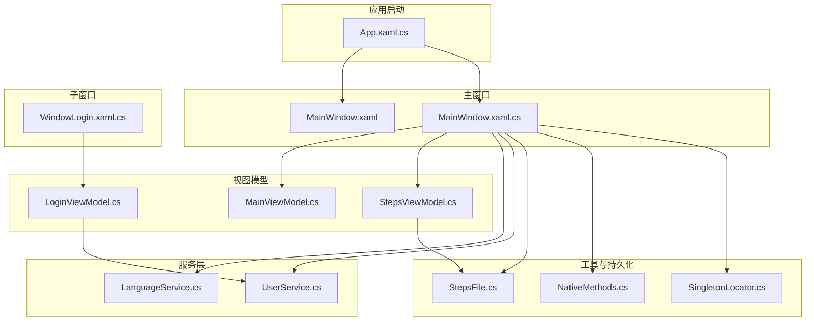
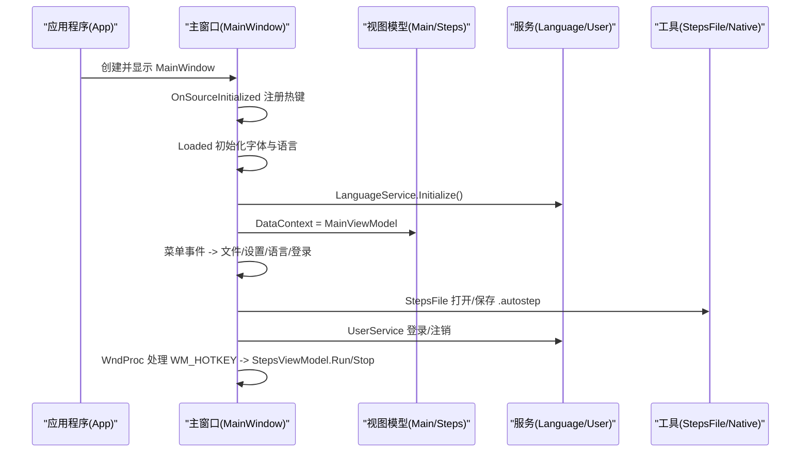
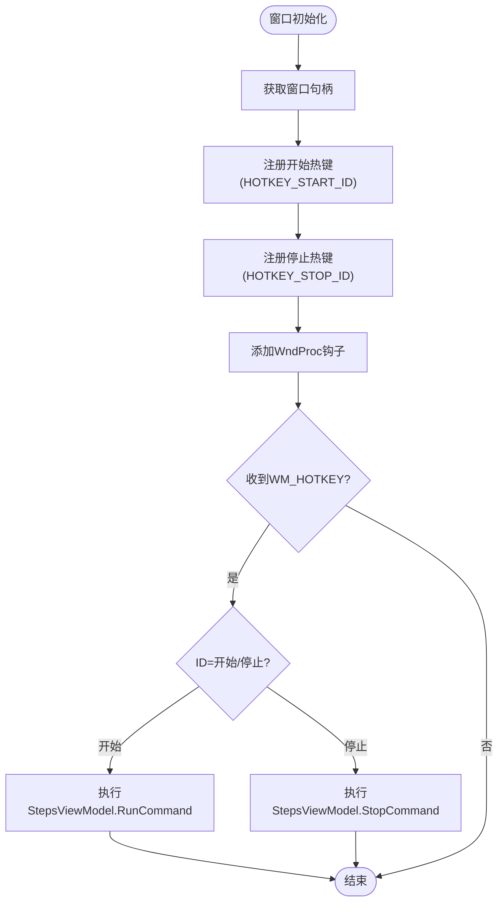
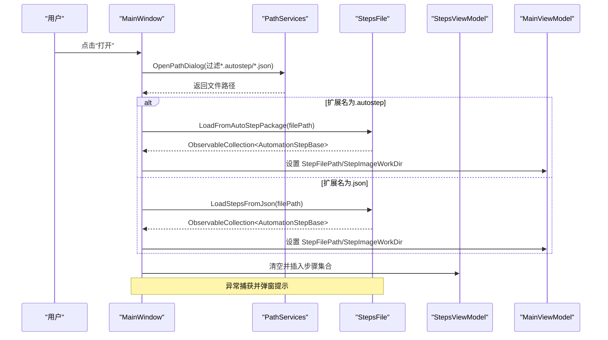
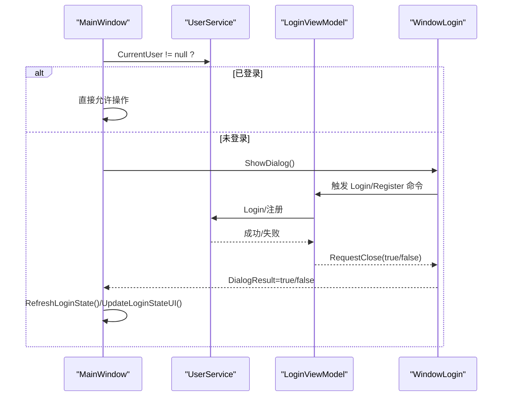
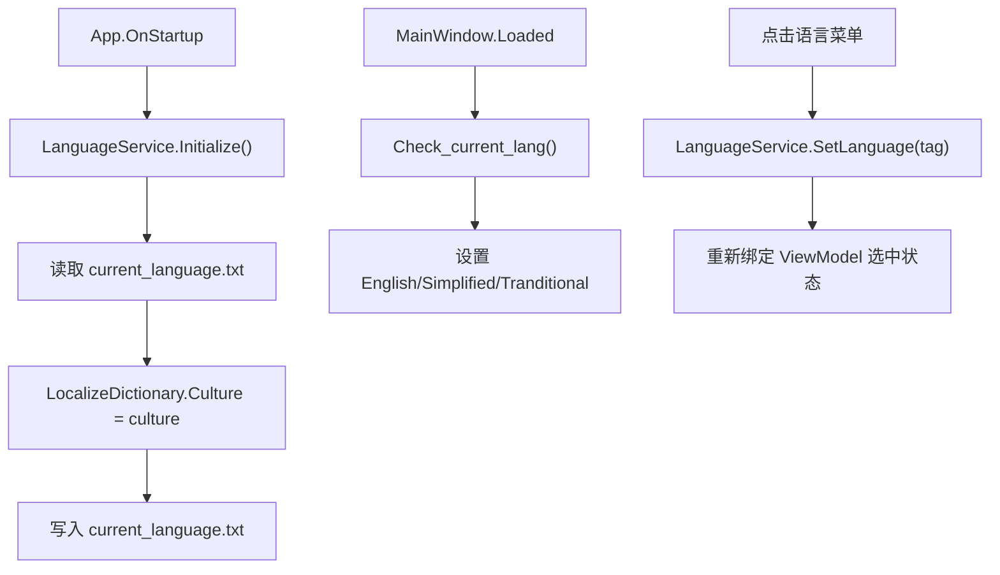
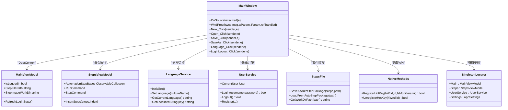

# 主窗口界面

<cite>
**本文引用的文件**   
- [MainWindow.xaml](file://ShaoLu/MainWindow.xaml)
- [MainWindow.xaml.cs](file://ShaoLu/MainWindow.xaml.cs)
- [App.xaml.cs](file://ShaoLu/App.xaml.cs)
- [MainViewModel.cs](file://ShaoLu/Viewmodels/MainViewModel.cs)
- [StepsViewModel.cs](file://ShaoLu/Viewmodels/StepsViewModel.cs)
- [LanguageService.cs](file://ShaoLu/Services/LanguageService.cs)
- [UserService.cs](file://ShaoLu/Services/UserService.cs)
- [SingletonLocator.cs](file://ShaoLu/Utils/SingletonLocator.cs)
- [NativeMethods.cs](file://ShaoLu/Utils/NativeMethods.cs)
- [StepsFile.cs](file://ShaoLu/Utils/StepsFile.cs)
- [WindowLogin.xaml.cs](file://ShaoLu/Views/WindowLogin.xaml.cs)
- [LoginViewModel.cs](file://ShaoLu/Viewmodels/LoginViewModel.cs)
</cite>

## 目录
1. [简介](#简介)
2. [项目结构](#项目结构)
3. [核心组件](#核心组件)
4. [架构总览](#架构总览)
5. [详细组件分析](#详细组件分析)
6. [依赖关系分析](#依赖关系分析)
7. [性能考虑](#性能考虑)
8. [故障排查指南](#故障排查指南)
9. [结论](#结论)
10. [附录](#附录)

## 简介
本文件为 ShaoLu 主窗口的开发文档，围绕以下目标展开：
- 主窗口布局设计与菜单栏功能实现
- 全局热键注册机制与窗口生命周期管理
- 文件操作（新建、打开、保存）的实现逻辑
- 用户登录状态管理与国际化语言切换
- 输入验证、错误处理与用户交互最佳实践
- 与子窗口的通信机制和数据传递方式

## 项目结构
主窗口由 XAML 定义界面布局，代码后置处理事件与业务编排；视图模型负责状态与命令；服务层提供语言、用户、文件等能力；工具类封装系统调用与持久化。

图表来源
- [App.xaml.cs:19-78](file://ShaoLu/App.xaml.cs#L19-L78)
- [MainWindow.xaml:1-50](file://ShaoLu/MainWindow.xaml#L1-L50)
- [MainWindow.xaml.cs:34-100](file://ShaoLu/MainWindow.xaml.cs#L34-L100)
- [MainViewModel.cs:1-76](file://ShaoLu/Viewmodels/MainViewModel.cs#L1-L76)
- [StepsViewModel.cs:1-120](file://ShaoLu/Viewmodels/StepsViewModel.cs#L1-L120)
- [LanguageService.cs:1-67](file://ShaoLu/Services/LanguageService.cs#L1-L67)
- [UserService.cs:1-120](file://ShaoLu/Services/UserService.cs#L1-L120)
- [StepsFile.cs:1-120](file://ShaoLu/Utils/StepsFile.cs#L1-L120)
- [NativeMethods.cs:1-19](file://ShaoLu/Utils/NativeMethods.cs#L1-L19)
- [SingletonLocator.cs:1-19](file://ShaoLu/Utils/SingletonLocator.cs#L1-L19)
- [WindowLogin.xaml.cs:1-87](file://ShaoLu/Views/WindowLogin.xaml.cs#L1-L87)
- [LoginViewModel.cs:1-120](file://ShaoLu/Viewmodels/LoginViewModel.cs#L1-L120)

章节来源
- [App.xaml.cs:19-78](file://ShaoLu/App.xaml.cs#L19-L78)
- [MainWindow.xaml:1-50](file://ShaoLu/MainWindow.xaml#L1-L50)

## 核心组件
- 主窗口（MainWindow）
  - 职责：菜单事件处理、热键注册与消息钩子、文件操作入口、登录态校验、语言初始化与切换、子窗口弹出。
  - 关键流程：OnSourceInitialized 注册热键；Loaded 初始化字体与语言；Closed 注销热键并关闭子窗口。
- 视图模型
  - MainViewModel：维护 IsLoggedIn、StepFilePath、StepImageWorkDir、当前语言选择等 UI 状态。
  - StepsViewModel：步骤集合、执行控制（Run/Stop/Pause）、复制粘贴、删除确认、自引用保护、统计与日志记录。
  - LoginViewModel：登录/注册表单数据、命令与校验、结果回传。
- 服务层
  - LanguageService：读取/设置语言并持久化，提供本地化字符串获取。
  - UserService：基于 SQLite 的用户管理（登录、注销、增删改密码、注册审批）。
- 工具与持久化
  - StepsFile：.autostep 压缩包与 JSON 格式的读写、图片打包与解压、旧格式兼容。
  - NativeMethods：Windows 热键 API 封装。
  - SingletonLocator：统一访问单例服务与配置。

章节来源
- [MainWindow.xaml.cs:34-100](file://ShaoLu/MainWindow.xaml.cs#L34-L100)
- [MainViewModel.cs:1-76](file://ShaoLu/Viewmodels/MainViewModel.cs#L1-L76)
- [StepsViewModel.cs:1-120](file://ShaoLu/Viewmodels/StepsViewModel.cs#L1-L120)
- [LanguageService.cs:1-67](file://ShaoLu/Services/LanguageService.cs#L1-L67)
- [UserService.cs:1-120](file://ShaoLu/Services/UserService.cs#L1-L120)
- [StepsFile.cs:1-120](file://ShaoLu/Utils/StepsFile.cs#L1-L120)
- [NativeMethods.cs:1-19](file://ShaoLu/Utils/NativeMethods.cs#L1-L19)
- [SingletonLocator.cs:1-19](file://ShaoLu/Utils/SingletonLocator.cs#L1-L19)

## 架构总览
主窗口作为 UI 协调者，通过 ViewModel 驱动界面状态，借助 Service 完成跨进程或系统级能力（如热键），并通过 Utils 进行文件与系统交互。

图表来源
- [App.xaml.cs:19-78](file://ShaoLu/App.xaml.cs#L19-L78)
- [MainWindow.xaml.cs:34-100](file://ShaoLu/MainWindow.xaml.cs#L34-L100)
- [LanguageService.cs:15-22](file://ShaoLu/Services/LanguageService.cs#L15-L22)
- [StepsFile.cs:40-119](file://ShaoLu/Utils/StepsFile.cs#L40-L119)
- [NativeMethods.cs:1-19](file://ShaoLu/Utils/NativeMethods.cs#L1-L19)

## 详细组件分析

### 主窗口布局与菜单栏
- 布局采用 Grid 两行：顶部 Menu，下方承载步骤编辑控件 UserControlSteps。
- 菜单项包括：文件（新建、打开、保存、另存为）、编辑（登录/注销、用户管理）、执行日志、语言（en-US/zh-CN/zh-TW）、关于、退出。
- 所有文本通过 lex:Loc 绑定到 Strings 资源字典，支持运行时切换语言。

章节来源
- [MainWindow.xaml:18-49](file://ShaoLu/MainWindow.xaml#L18-L49)

### 热键注册机制
- 在 OnSourceInitialized 中获取 HwndSource 并添加 WndProc 钩子。
- 使用 NativeMethods.RegisterHotKey 注册“开始”和“停止”两个热键，ID 分别为 9001、9002。
- WndProc 收到 WM_HOTKEY 后，根据 ID 调用 StepsViewModel 的 RunCommand/StopCommand。
- OnClosed 中移除 Hook 并注销热键，防止泄漏。

图表来源
- [MainWindow.xaml.cs:34-76](file://ShaoLu/MainWindow.xaml.cs#L34-L76)
- [NativeMethods.cs:1-19](file://ShaoLu/Utils/NativeMethods.cs#L1-L19)

章节来源
- [MainWindow.xaml.cs:34-76](file://ShaoLu/MainWindow.xaml.cs#L34-L76)

### 窗口生命周期管理
- OnSourceInitialized：注册热键与消息钩子。
- Loaded：检查当前语言、设置字体字号、更新登录态 UI。
- OnClosed：移除钩子、注销热键、遍历并关闭所有子窗口，再调用基类关闭。

章节来源
- [MainWindow.xaml.cs:87-100](file://ShaoLu/MainWindow.xaml.cs#L87-L100)

### 文件操作（新建、打开、保存）
- 新建：清空步骤集合与文件路径，要求已登录。
- 打开：弹出选择对话框，按扩展名区分 .autostep 与旧版 JSON；加载步骤集合并设置工作目录；异常时记录日志并弹窗提示。
- 保存：若已有路径则覆盖，否则弹出“另存为”；保存前标记步骤为可保存状态，写入 .autostep 包并更新路径与工作目录；异常弹窗提示。

图表来源
- [MainWindow.xaml.cs:197-235](file://ShaoLu/MainWindow.xaml.cs#L197-L235)
- [StepsFile.cs:76-119](file://ShaoLu/Utils/StepsFile.cs#L76-L119)

章节来源
- [MainWindow.xaml.cs:188-293](file://ShaoLu/MainWindow.xaml.cs#L188-L293)
- [StepsFile.cs:40-119](file://ShaoLu/Utils/StepsFile.cs#L40-L119)

### 用户登录状态管理
- 登录/注销：通过 UserService.CurrentUser 判断；未登录时弹出 WindowLogin 对话框；成功后刷新 MainViewModel 登录状态并更新菜单文案。
- 权限控制：需要编辑的操作（新建、保存、用户管理）均先 EnsureLoggedIn。
- 登录窗口：支持登录与注册模式切换，Enter/Esc 快捷键，PasswordBox 值同步到 ViewModel。

图表来源
- [MainWindow.xaml.cs:323-373](file://ShaoLu/MainWindow.xaml.cs#L323-L373)
- [WindowLogin.xaml.cs:1-87](file://ShaoLu/Views/WindowLogin.xaml.cs#L1-L87)
- [LoginViewModel.cs:1-120](file://ShaoLu/Viewmodels/LoginViewModel.cs#L1-L120)
- [UserService.cs:76-98](file://ShaoLu/Services/UserService.cs#L76-L98)

章节来源
- [MainWindow.xaml.cs:323-373](file://ShaoLu/MainWindow.xaml.cs#L323-L373)
- [WindowLogin.xaml.cs:1-87](file://ShaoLu/Views/WindowLogin.xaml.cs#L1-L87)
- [LoginViewModel.cs:1-120](file://ShaoLu/Viewmodels/LoginViewModel.cs#L1-L120)
- [UserService.cs:76-98](file://ShaoLu/Services/UserService.cs#L76-L98)

### 国际化语言切换
- 初始化：App 启动时调用 LanguageService.Initialize()，优先读取上次保存的语言，否则使用系统语言。
- 切换：菜单语言项 Tag 携带文化代码，点击后调用 SetLanguage 并持久化；MainWindow_Loaded 中根据当前语言设置 ViewModel 的选中状态。
- 本地化：所有菜单与提示文本通过 LanguageService.GetLocalizedString 获取，找不到 key 时回退默认值。

图表来源
- [App.xaml.cs:45-48](file://ShaoLu/App.xaml.cs#L45-L48)
- [LanguageService.cs:15-40](file://ShaoLu/Services/LanguageService.cs#L15-L40)
- [MainWindow.xaml.cs:145-173](file://ShaoLu/MainWindow.xaml.cs#L145-L173)

章节来源
- [LanguageService.cs:15-40](file://ShaoLu/Services/LanguageService.cs#L15-L40)
- [MainWindow.xaml.cs:145-173](file://ShaoLu/MainWindow.xaml.cs#L145-L173)

### 输入验证与错误处理
- 输入验证：TextBox 拦截非数字与非重复小数点字符，粘贴时同样校验。
- 错误处理：文件操作与步骤执行异常均捕获并记录日志，必要时弹窗提示；运行期异常通过 DispatcherUnhandledException 兜底。
- 用户体验：操作前确认（如运行前确认）、暂停/恢复、自引用限制、错误类型推断与友好提示。

章节来源
- [MainWindow.xaml.cs:112-143](file://ShaoLu/MainWindow.xaml.cs#L112-L143)
- [App.xaml.cs:27-43](file://ShaoLu/App.xaml.cs#L27-L43)
- [StepsViewModel.cs:493-694](file://ShaoLu/Viewmodels/StepsViewModel.cs#L493-L694)

### 与子窗口的通信机制与数据传递
- 主窗口与子窗口：通过 Owner 建立父子关系，ShowDialog 返回布尔结果；登录窗口通过 ViewModel 的事件 RequestClose 通知主窗口。
- 数据传递：主窗口将 ViewModel 注入子窗口构造函数；子窗口通过 Ioc 容器获取所需服务（如 IUserService）。
- 步骤编辑：UserControlSteps 承载步骤列表与编辑面板，主窗口通过 StepsViewModel 共享数据。

章节来源
- [MainWindow.xaml.cs:313-321](file://ShaoLu/MainWindow.xaml.cs#L313-L321)
- [WindowLogin.xaml.cs:17-46](file://ShaoLu/Views/WindowLogin.xaml.cs#L17-L46)
- [SingletonLocator.cs:1-19](file://ShaoLu/Utils/SingletonLocator.cs#L1-L19)

## 依赖关系分析
- 主窗口依赖 MainViewModel、StepsViewModel、LanguageService、UserService、StepsFile、NativeMethods、SingletonLocator。
- StepsViewModel 依赖 Autogui、ExecutionLogService、ConditionEvaluator、WindowAsyncPopup。
- UserService 依赖 FreeSql（SQLite）与加密算法。
- 语言服务依赖 WPFLocalizeExtension。

图表来源
- [MainWindow.xaml.cs:1-100](file://ShaoLu/MainWindow.xaml.cs#L1-L100)
- [MainViewModel.cs:1-76](file://ShaoLu/Viewmodels/MainViewModel.cs#L1-L76)
- [StepsViewModel.cs:1-120](file://ShaoLu/Viewmodels/StepsViewModel.cs#L1-L120)
- [LanguageService.cs:1-67](file://ShaoLu/Services/LanguageService.cs#L1-L67)
- [UserService.cs:1-120](file://ShaoLu/Services/UserService.cs#L1-L120)
- [StepsFile.cs:1-120](file://ShaoLu/Utils/StepsFile.cs#L1-L120)
- [NativeMethods.cs:1-19](file://ShaoLu/Utils/NativeMethods.cs#L1-L19)
- [SingletonLocator.cs:1-19](file://ShaoLu/Utils/SingletonLocator.cs#L1-L19)

章节来源
- [SingletonLocator.cs:1-19](file://ShaoLu/Utils/SingletonLocator.cs#L1-L19)

## 性能考虑
- 序列化选项缓存：StepsFile 使用静态 JsonSerializerOptions 避免重复构建，提升读写性能。
- 异步与取消：StepsViewModel.Run 使用 CancellationTokenSource 支持取消与暂停，避免阻塞 UI。
- 资源释放：App.OnExit 中释放图像识别相关资源并提交待删除文件，防止内存与磁盘占用。
- 字体与 DPI：启动时应用全局字体并缓存 DPI 缩放因子，减少 OCR 服务计算开销。

章节来源
- [StepsFile.cs:17-32](file://ShaoLu/Utils/StepsFile.cs#L17-L32)
- [StepsViewModel.cs:493-694](file://ShaoLu/Viewmodels/StepsViewModel.cs#L493-L694)
- [App.xaml.cs:92-109](file://ShaoLu/App.xaml.cs#L92-L109)
- [App.xaml.cs:80-84](file://ShaoLu/App.xaml.cs#L80-L84)

## 故障排查指南
- 热键冲突或未生效：检查 OnSourceInitialized 是否成功注册，确保 UnregisterHotKey 在窗口关闭时被调用；核对 MOD_* 组合键与虚拟键码。
- 打开/保存失败：查看异常日志与弹窗提示；确认 .autostep 包包含 steps.json 且 images 目录存在；JSON 兼容模式下检查旧格式行号解析。
- 登录失败：检查用户名/密码校验逻辑与数据库连接；确认注册是否需要管理员审批。
- 语言不生效：确认 current_language.txt 是否存在且内容合法；检查 LocalizeDictionary.Culture 设置是否抛出 CultureNotFoundException。
- 步骤执行异常：查看单个步骤的错误类型与消息；确认条件跳转目标是否存在；检查自引用限制是否触发。

章节来源
- [MainWindow.xaml.cs:87-100](file://ShaoLu/MainWindow.xaml.cs#L87-L100)
- [StepsFile.cs:76-119](file://ShaoLu/Utils/StepsFile.cs#L76-L119)
- [LanguageService.cs:27-40](file://ShaoLu/Services/LanguageService.cs#L27-L40)
- [StepsViewModel.cs:597-694](file://ShaoLu/Viewmodels/StepsViewModel.cs#L597-L694)

## 结论
主窗口作为 ShaoLu 的核心协调器，整合了界面、命令、服务与工具，实现了完整的文件操作、用户认证、国际化与热键控制。通过清晰的职责划分与健壮的错误处理，保证了良好的用户体验与系统稳定性。建议后续继续完善单元测试与集成测试，覆盖关键路径（文件读写、热键、登录流程），并持续优化性能与可维护性。

## 附录
- 常用路径与服务
  - 语言配置文件：current_language.txt（应用根目录）
  - 用户数据库：users.db（%APPDATA%\AutoShaoLu）
  - 步骤包工作目录：{包名}_images（与包同目录）
- 快捷键约定
  - 开始：HOTKEY_START_ID（9001）
  - 停止：HOTKEY_STOP_ID（9002）