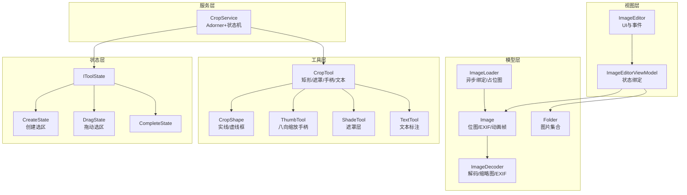
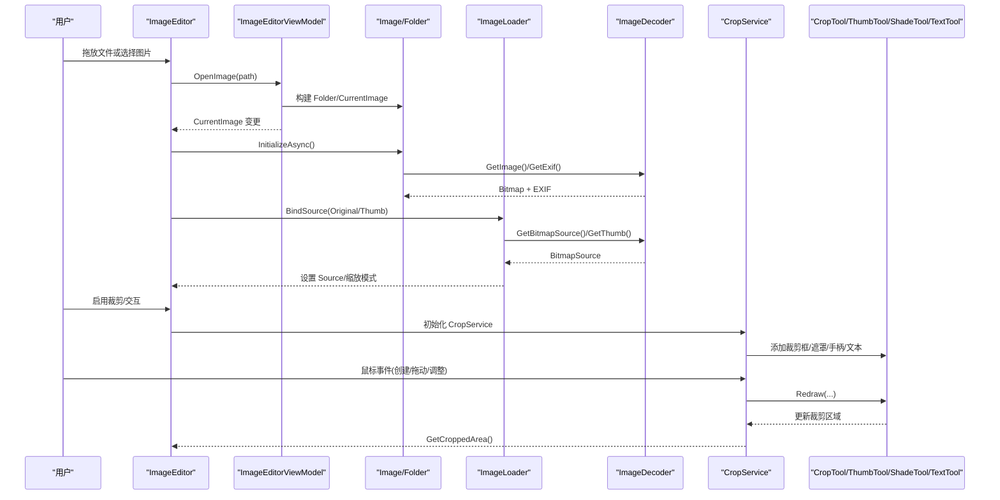
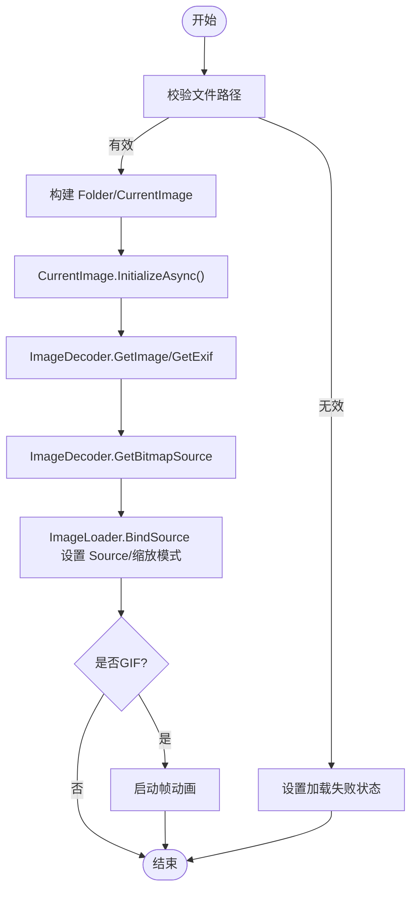
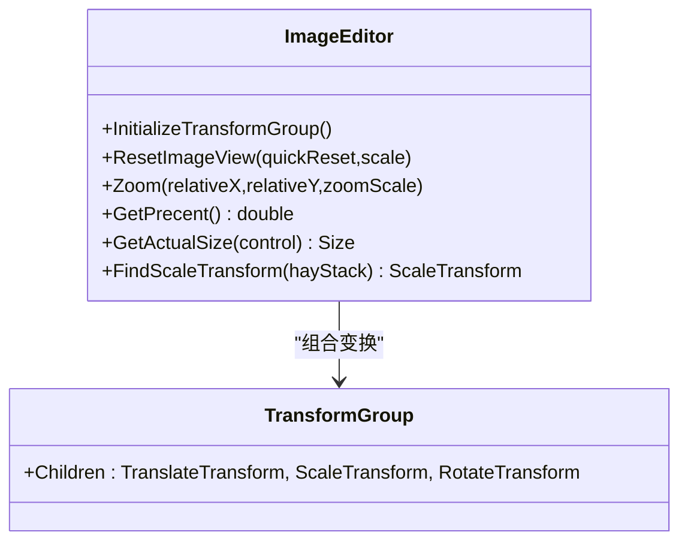
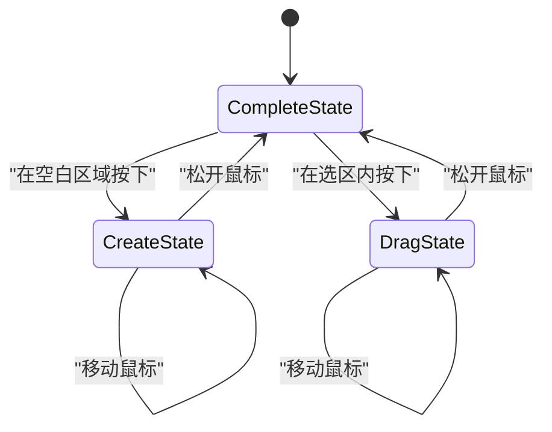
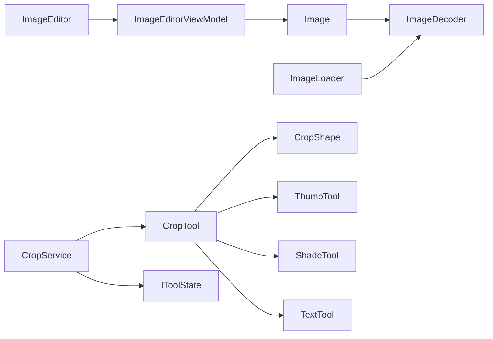

# 图片编辑工具

<cite>
**本文引用的文件**   
- [Readme.md](file://Readme.md)
- [ImageEditor.xaml.cs](file://ShaoLu/Tools/ImageEdit/ImageEditor.xaml.cs)
- [ImageEditorViewModel.cs](file://ShaoLu/Tools/ImageEdit/ImageEditorViewModel.cs)
- [Image.cs](file://ShaoLu/Tools/ImageEdit/Image.cs)
- [ImageLoader.cs](file://ShaoLu/Tools/ImageEdit/ImageLoader.cs)
- [ImageDecoder.cs](file://ShaoLu/Tools/ImageEdit/ImageDecoder.cs)
- [Folder.cs](file://ShaoLu/Tools/ImageEdit/Folder.cs)
- [CropService.cs](file://ShaoLu/Tools/ImageEdit/services/CropService.cs)
- [CropAdorner.cs](file://ShaoLu/Tools/ImageEdit/services/CropAdorner.cs)
- [CropTool.cs](file://ShaoLu/Tools/ImageEdit/services/Tools/CropTool.cs)
- [CropShape.cs](file://ShaoLu/Tools/ImageEdit/services/Tools/CropShape.cs)
- [ThumbTool.cs](file://ShaoLu/Tools/ImageEdit/services/Tools/ThumbTool.cs)
- [IToolState.cs](file://ShaoLu/Tools/ImageEdit/services/State/IToolState.cs)
- [CreateState.cs](file://ShaoLu/Tools/ImageEdit/services/State/CreateState.cs)
- [DragState.cs](file://ShaoLu/Tools/ImageEdit/services/State/DragState.cs)
</cite>

## 目录
1. [简介](#简介)
2. [项目结构](#项目结构)
3. [核心组件](#核心组件)
4. [架构总览](#架构总览)
5. [详细组件分析](#详细组件分析)
6. [依赖关系分析](#依赖关系分析)
7. [性能与内存管理](#性能与内存管理)
8. [故障排查指南](#故障排查指南)
9. [结论](#结论)
10. [附录](#附录)

## 简介
本开发文档面向 ShaoLu 图片编辑工具，聚焦以下能力：
- 图像裁剪功能的实现与交互状态机
- 点击点标记系统（多点击点支持）
- 缩放、平移、旋转显示机制与 DPI/像素密度处理
- 图像处理算法（解码、缩略图、EXIF）、坐标转换与保存流程
- 绘图工具（遮罩、缩略手柄、文本标注）的实现要点
- 撤销/重做与图像格式支持的现状与建议
- 性能优化与内存管理的最佳实践

说明：
- 点击点标记与多图点击在用户手册中有明确描述；代码侧的点击点数据模型与持久化在当前仓库中未直接暴露，本文基于现有裁剪与渲染体系给出扩展建议。
- 撤销/重做功能在当前仓库中未见实现，本文提供可落地的设计建议。

章节来源
- [Readme.md:225-283](file://Readme.md#L225-L283)

## 项目结构
图片编辑子系统位于 Tools/ImageEdit 目录下，采用“视图-视图模型-服务-工具-状态”的分层组织：
- 视图层：ImageEditor 控件负责 UI 事件、变换动画、拖放加载等
- 视图模型层：ImageEditorViewModel 管理当前图像、文件夹列表与加载状态
- 图像模型层：Image、Folder、ImageLoader、ImageDecoder 负责图像资源与解码
- 服务层：CropService 协调裁剪 adorner、工具与状态
- 工具层：CropTool、CropShape、ThumbTool、TextTool、ShadeTool 负责绘制与交互
- 状态层：IToolState、CreateState、DragState、CompleteState 定义裁剪交互状态机

图表来源
- [ImageEditor.xaml.cs:163-210](file://ShaoLu/Tools/ImageEdit/ImageEditor.xaml.cs#L163-L210)
- [ImageEditorViewModel.cs:1-116](file://ShaoLu/Tools/ImageEdit/ImageEditorViewModel.cs#L1-L116)
- [Image.cs:1-171](file://ShaoLu/Tools/ImageEdit/Image.cs#L1-L171)
- [ImageLoader.cs:1-112](file://ShaoLu/Tools/ImageEdit/ImageLoader.cs#L1-L112)
- [ImageDecoder.cs:1-221](file://ShaoLu/Tools/ImageEdit/ImageDecoder.cs#L1-L221)
- [CropService.cs:1-190](file://ShaoLu/Tools/ImageEdit/services/CropService.cs#L1-L190)
- [CropTool.cs:1-74](file://ShaoLu/Tools/ImageEdit/services/Tools/CropTool.cs#L1-L74)
- [CropShape.cs:1-44](file://ShaoLu/Tools/ImageEdit/services/Tools/CropShape.cs#L1-L44)
- [ThumbTool.cs:1-275](file://ShaoLu/Tools/ImageEdit/services/Tools/ThumbTool.cs#L1-L275)
- [IToolState.cs:1-11](file://ShaoLu/Tools/ImageEdit/services/State/IToolState.cs#L1-L11)
- [CreateState.cs:1-75](file://ShaoLu/Tools/ImageEdit/services/State/CreateState.cs#L1-L75)
- [DragState.cs:1-77](file://ShaoLu/Tools/ImageEdit/services/State/DragState.cs#L1-L77)

章节来源
- [ImageEditor.xaml.cs:163-210](file://ShaoLu/Tools/ImageEdit/ImageEditor.xaml.cs#L163-L210)
- [ImageEditorViewModel.cs:1-116](file://ShaoLu/Tools/ImageEdit/ImageEditorViewModel.cs#L1-L116)

## 核心组件
- ImageEditor 控件
  - 负责图像加载、拖放打开、键盘与鼠标事件、缩放/平移/旋转动画、比例计算与显示
  - 通过 ViewModel 驱动 CurrentImage 变化，触发初始化与重置视图
- ImageEditorViewModel
  - 管理 Folder、CurrentImage、IsImageLoading、IsImageLoadFailed 等状态
  - 变更通知驱动 UI 更新
- Image 模型
  - 封装 Bitmap、尺寸、EXIF、GIF 动画帧播放与释放
- ImageLoader
  - 附加属性绑定，后台线程加载缩略图或原图，设置缩放模式与占位图
- ImageDecoder
  - 使用 Magick.NET 解码图像、生成缩略图、提取 EXIF 信息，并转换为 WPF BitmapSource
- CropService
  - 基于 Adorner 叠加 Canvas，协调 CropTool 与状态机，维护裁剪区域与交互
- CropTool / CropShape / ThumbTool / ShadeTool / TextTool
  - 绘制裁剪框、虚线框、遮罩层、八向缩放手柄与文本标注
- 状态机 IToolState
  - CreateState（创建选区）、DragState（拖动选区）、CompleteState（完成态）

章节来源
- [ImageEditor.xaml.cs:163-210](file://ShaoLu/Tools/ImageEdit/ImageEditor.xaml.cs#L163-L210)
- [ImageEditorViewModel.cs:1-116](file://ShaoLu/Tools/ImageEdit/ImageEditorViewModel.cs#L1-L116)
- [Image.cs:1-171](file://ShaoLu/Tools/ImageEdit/Image.cs#L1-L171)
- [ImageLoader.cs:1-112](file://ShaoLu/Tools/ImageEdit/ImageLoader.cs#L1-L112)
- [ImageDecoder.cs:1-221](file://ShaoLu/Tools/ImageEdit/ImageDecoder.cs#L1-L221)
- [CropService.cs:1-190](file://ShaoLu/Tools/ImageEdit/services/CropService.cs#L1-L190)
- [CropTool.cs:1-74](file://ShaoLu/Tools/ImageEdit/services/Tools/CropTool.cs#L1-L74)
- [CropShape.cs:1-44](file://ShaoLu/Tools/ImageEdit/services/Tools/CropShape.cs#L1-L44)
- [ThumbTool.cs:1-275](file://ShaoLu/Tools/ImageEdit/services/Tools/ThumbTool.cs#L1-L275)
- [IToolState.cs:1-11](file://ShaoLu/Tools/ImageEdit/services/State/IToolState.cs#L1-L11)
- [CreateState.cs:1-75](file://ShaoLu/Tools/ImageEdit/services/State/CreateState.cs#L1-L75)
- [DragState.cs:1-77](file://ShaoLu/Tools/ImageEdit/services/State/DragState.cs#L1-L77)

## 架构总览
下图展示从视图到服务再到工具的调用链与数据流：

图表来源
- [ImageEditor.xaml.cs:163-210](file://ShaoLu/Tools/ImageEdit/ImageEditor.xaml.cs#L163-L210)
- [ImageLoader.cs:41-89](file://ShaoLu/Tools/ImageEdit/ImageLoader.cs#L41-L89)
- [ImageDecoder.cs:46-108](file://ShaoLu/Tools/ImageEdit/ImageDecoder.cs#L46-L108)
- [CropService.cs:120-189](file://ShaoLu/Tools/ImageEdit/services/CropService.cs#L120-L189)
- [CropTool.cs:60-74](file://ShaoLu/Tools/ImageEdit/services/Tools/CropTool.cs#L60-L74)

## 详细组件分析

### 图像加载与显示管线
- 加载流程
  - ImageEditor.OpenImage 校验路径与存在性，构造 Folder 或单图项，设置 CurrentImage
  - ViewModel.CurrentImage 变更时，ImageEditor 调用 InitializeAsync，等待解码完成
  - ImageLoader 在后台线程加载缩略图或原图，设置 BitmapScalingMode 与 UseLayoutRounding
- 解码与 EXIF
  - ImageDecoder.GetImage 使用 Magick.NET 读取文件，GIF 特殊处理；GetExif 解析 EXIF 元数据
  - GetBitmapSource 将 System.Drawing.Bitmap 转为 WPF BitmapSource 并 Freeze
- 动画帧
  - Image.IsAnimation 判断 GIF，StartAnimate/StopAnimate 驱动帧更新，SourceAnimate 事件刷新 UI

图表来源
- [ImageEditor.xaml.cs:264-315](file://ShaoLu/Tools/ImageEdit/ImageEditor.xaml.cs#L264-L315)
- [ImageEditor.xaml.cs:219-259](file://ShaoLu/Tools/ImageEdit/ImageEditor.xaml.cs#L219-L259)
- [ImageLoader.cs:41-89](file://ShaoLu/Tools/ImageEdit/ImageLoader.cs#L41-L89)
- [ImageDecoder.cs:46-108](file://ShaoLu/Tools/ImageEdit/ImageDecoder.cs#L46-L108)
- [Image.cs:118-146](file://ShaoLu/Tools/ImageEdit/Image.cs#L118-L146)

章节来源
- [ImageEditor.xaml.cs:264-315](file://ShaoLu/Tools/ImageEdit/ImageEditor.xaml.cs#L264-L315)
- [ImageLoader.cs:41-89](file://ShaoLu/Tools/ImageEdit/ImageLoader.cs#L41-L89)
- [ImageDecoder.cs:46-108](file://ShaoLu/Tools/ImageEdit/ImageDecoder.cs#L46-L108)
- [Image.cs:118-146](file://ShaoLu/Tools/ImageEdit/Image.cs#L118-L146)

### 缩放、平移与旋转机制
- 变换组合
  - TransformGroup 包含 TranslateTransform、ScaleTransform、RotateTransform，中心点为 (0.5, 0.5)
- 缩放
  - ZoomAndTranslateAnimationDurationInMs 控制动画时长，ZoomFactor=1.3，最大/最小缩放限制
  - 双击放大，滚轮缩放，SetScale/ResetImageView 统一复位
- 平移
  - 按住左键拖拽，实时计算位移并应用动画
- 旋转
  - 按钮支持 ±5° 与 ±90° 旋转，角度归一化处理
- 比例计算
  - GetPrecent 根据实际渲染尺寸与原始尺寸计算百分比显示

图表来源
- [ImageEditor.xaml.cs:458-492](file://ShaoLu/Tools/ImageEdit/ImageEditor.xaml.cs#L458-L492)
- [ImageEditor.xaml.cs:525-607](file://ShaoLu/Tools/ImageEdit/ImageEditor.xaml.cs#L525-L607)
- [ImageEditor.xaml.cs:609-674](file://ShaoLu/Tools/ImageEdit/ImageEditor.xaml.cs#L609-L674)
- [ImageEditor.xaml.cs:677-746](file://ShaoLu/Tools/ImageEdit/ImageEditor.xaml.cs#L677-L746)
- [ImageEditor.xaml.cs:751-800](file://ShaoLu/Tools/ImageEdit/ImageEditor.xaml.cs#L751-L800)

章节来源
- [ImageEditor.xaml.cs:458-492](file://ShaoLu/Tools/ImageEdit/ImageEditor.xaml.cs#L458-L492)
- [ImageEditor.xaml.cs:525-607](file://ShaoLu/Tools/ImageEdit/ImageEditor.xaml.cs#L525-L607)
- [ImageEditor.xaml.cs:609-674](file://ShaoLu/Tools/ImageEdit/ImageEditor.xaml.cs#L609-L674)
- [ImageEditor.xaml.cs:677-746](file://ShaoLu/Tools/ImageEdit/ImageEditor.xaml.cs#L677-L746)
- [ImageEditor.xaml.cs:751-800](file://ShaoLu/Tools/ImageEdit/ImageEditor.xaml.cs#L751-L800)

### 图像裁剪与交互状态机
- CropService
  - 通过 Adorner 叠加 Canvas，监听鼠标事件，分发到当前 IToolState
  - 获取裁剪区域 GetCroppedArea，返回原始尺寸与绝对矩形
- 状态机
  - CreateState：在空白区域按下并拖动，计算选区边界，限制在画布范围内
  - DragState：在选区内按下并拖动，计算偏移量，限制边界
  - CompleteState：空闲态
- 工具协作
  - CropTool 管理裁剪框、遮罩、缩略手柄、文本标注
  - ThumbTool 提供八向缩放手柄，响应 DragDelta 事件更新裁剪区域
  - CropShape 同步实线与虚线框位置尺寸

图表来源
- [CropService.cs:138-189](file://ShaoLu/Tools/ImageEdit/services/CropService.cs#L138-L189)
- [CreateState.cs:21-73](file://ShaoLu/Tools/ImageEdit/services/State/CreateState.cs#L21-L73)
- [DragState.cs:19-75](file://ShaoLu/Tools/ImageEdit/services/State/DragState.cs#L19-L75)
- [CropTool.cs:60-74](file://ShaoLu/Tools/ImageEdit/services/Tools/CropTool.cs#L60-L74)
- [ThumbTool.cs:229-272](file://ShaoLu/Tools/ImageEdit/services/Tools/ThumbTool.cs#L229-L272)

章节来源
- [CropService.cs:138-189](file://ShaoLu/Tools/ImageEdit/services/CropService.cs#L138-L189)
- [CreateState.cs:21-73](file://ShaoLu/Tools/ImageEdit/services/State/CreateState.cs#L21-L73)
- [DragState.cs:19-75](file://ShaoLu/Tools/ImageEdit/services/State/DragState.cs#L19-L75)
- [CropTool.cs:60-74](file://ShaoLu/Tools/ImageEdit/services/Tools/CropTool.cs#L60-L74)
- [ThumbTool.cs:229-272](file://ShaoLu/Tools/ImageEdit/services/Tools/ThumbTool.cs#L229-L272)

### 点击点标记系统与多点击点支持
- 功能概述
  - 用户手册描述了添加点击点、移动、删除、显示/隐藏、全部操作等功能
  - 运行时按点击点列表顺序依次点击，适用于同一界面多点点击场景
- 实现建议（基于现有架构）
  - 在 CropTool 或独立图层中添加圆形标记元素（Ellipse），每个标记携带编号与坐标
  - 提供右键菜单与顶部菜单命令，支持增删改查与显隐切换
  - 坐标转换：屏幕坐标 → 图像坐标需考虑缩放与平移，参考 GetPrecent 与变换矩阵
  - 持久化：将点击点序列与裁剪区域一起序列化（JSON/XML），保存为识别配置
- 注意事项
  - 多点击点需保证唯一编号与可见层级
  - 坐标转换需考虑 DPI 与 RenderTransform 的组合

章节来源
- [Readme.md:249-283](file://Readme.md#L249-L283)

### 图像处理算法与坐标转换
- 解码与缩略图
  - ImageDecoder.GetImage 使用 Magick.NET 读取并转 Bitmap；GetThumb 自适应缩放生成缩略图
  - GetBitmapSource 将 GDI+ Bitmap 转为 WPF BitmapSource 并冻结，提升性能
- EXIF 解析
  - GetExif 提取相机型号、拍摄时间、ISO、光圈、焦距等常用字段
- 坐标转换
  - 图像坐标 = (屏幕坐标 - 平移) / 缩放
  - 旋转时需额外进行旋转变换反算
  - 建议在点击点系统中统一封装坐标转换函数，避免重复计算

章节来源
- [ImageDecoder.cs:46-108](file://ShaoLu/Tools/ImageEdit/ImageDecoder.cs#L46-L108)
- [ImageDecoder.cs:110-138](file://ShaoLu/Tools/ImageEdit/ImageDecoder.cs#L110-L138)
- [ImageEditor.xaml.cs:677-746](file://ShaoLu/Tools/ImageEdit/ImageEditor.xaml.cs#L677-L746)

### 绘图工具与标注
- 遮罩层（ShadeTool）
  - 覆盖非选区区域，突出裁剪范围
- 缩略手柄（ThumbTool）
  - 八向手柄支持四角与四边调整，实时更新裁剪区域
- 文本标注（TextTool）
  - 在裁剪框上显示文本块，便于标注说明

章节来源
- [CropTool.cs:22-58](file://ShaoLu/Tools/ImageEdit/services/Tools/CropTool.cs#L22-L58)
- [ThumbTool.cs:71-92](file://ShaoLu/Tools/ImageEdit/services/Tools/ThumbTool.cs#L71-L92)

### 撤销/重做与图像格式支持
- 撤销/重做
  - 当前仓库未实现；建议引入命令模式记录每次操作（创建/拖动/调整/删除点击点），维护历史栈
- 图像格式支持
  - 支持 PNG/JPG/JPEG/GIF（含动画帧），由 SupportedFiles 与 ImageDecoder 共同决定
  - 缩略图与 EXIF 解析依赖 Magick.NET

章节来源
- [Image.cs:40-55](file://ShaoLu/Tools/ImageEdit/Image.cs#L40-L55)
- [ImageDecoder.cs:46-79](file://ShaoLu/Tools/ImageEdit/ImageDecoder.cs#L46-L79)

## 依赖关系分析
- 组件耦合
  - ImageEditor 依赖 ViewModel 与 Image 模型
  - ImageLoader 依赖 ImageDecoder 与 WPF 资源字典
  - CropService 依赖 CropTool 与各工具类，并通过 IToolState 解耦交互逻辑
- 外部依赖
  - Magick.NET 用于图像解码与 EXIF 解析
  - GDI+ 用于 Bitmap 与 HBITMAP 互转
- 潜在循环依赖
  - 当前分层清晰，未见循环引用

图表来源
- [ImageEditor.xaml.cs:163-210](file://ShaoLu/Tools/ImageEdit/ImageEditor.xaml.cs#L163-L210)
- [ImageLoader.cs:1-112](file://ShaoLu/Tools/ImageEdit/ImageLoader.cs#L1-L112)
- [CropService.cs:1-190](file://ShaoLu/Tools/ImageEdit/services/CropService.cs#L1-L190)
- [CropTool.cs:1-74](file://ShaoLu/Tools/ImageEdit/services/Tools/CropTool.cs#L1-L74)

章节来源
- [ImageEditor.xaml.cs:163-210](file://ShaoLu/Tools/ImageEdit/ImageEditor.xaml.cs#L163-L210)
- [ImageLoader.cs:1-112](file://ShaoLu/Tools/ImageEdit/ImageLoader.cs#L1-L112)
- [CropService.cs:1-190](file://ShaoLu/Tools/ImageEdit/services/CropService.cs#L1-L190)
- [CropTool.cs:1-74](file://ShaoLu/Tools/ImageEdit/services/Tools/CropTool.cs#L1-L74)

## 性能与内存管理
- 解码与渲染
  - 使用 Magick.NET 高质量解码，缩略图自适应缩放，减少内存占用
  - BitmapSource.Freeze() 提升跨线程访问性能
- 动画与变换
  - 使用 DoubleAnimation 与 QuarticEase 平滑过渡，避免频繁重绘
  - 缩放/平移/旋转组合变换，减少多次布局计算
- 资源释放
  - Image.Dispose 停止动画、解除事件订阅、释放 Bitmap 并触发 GC
  - ImageLoader 在失败时回退到占位图，避免异常阻塞
- 建议
  - 对大图像使用延迟加载与分块解码
  - 缓存缩略图与 EXIF 结果，避免重复解码
  - 使用对象池管理临时对象（如矩形、画笔）

章节来源
- [ImageDecoder.cs:19-44](file://ShaoLu/Tools/ImageEdit/ImageDecoder.cs#L19-L44)
- [Image.cs:148-168](file://ShaoLu/Tools/ImageEdit/Image.cs#L148-L168)
- [ImageLoader.cs:79-109](file://ShaoLu/Tools/ImageEdit/ImageLoader.cs#L79-L109)
- [ImageEditor.xaml.cs:751-800](file://ShaoLu/Tools/ImageEdit/ImageEditor.xaml.cs#L751-L800)

## 故障排查指南
- 图像加载失败
  - 检查文件路径与权限，确认 SupportedFiles 支持该扩展名
  - 查看 IsImageLoadFailed 状态与日志输出
- 解码异常
  - 捕获 MagickException，确认文件格式与损坏情况
  - GIF 动画帧需确保 CanAnimate 与 UpdateFrames 正常
- 裁剪交互异常
  - 检查 AdornerLayer 是否正确添加，Canvas 尺寸是否与宿主一致
  - 状态机切换是否符合预期（创建/拖动/完成）
- 缩放与比例显示错误
  - 验证 GetPrecent 计算逻辑与 RenderTransform 中心点设置
  - 确认 UseLayoutRounding 与 BitmapScalingMode 设置

章节来源
- [ImageEditor.xaml.cs:353-362](file://ShaoLu/Tools/ImageEdit/ImageEditor.xaml.cs#L353-L362)
- [ImageLoader.cs:101-109](file://ShaoLu/Tools/ImageEdit/ImageLoader.cs#L101-L109)
- [CropService.cs:120-189](file://ShaoLu/Tools/ImageEdit/services/CropService.cs#L120-L189)
- [ImageEditor.xaml.cs:677-746](file://ShaoLu/Tools/ImageEdit/ImageEditor.xaml.cs#L677-L746)

## 结论
ShaoLu 图片编辑工具以清晰的层次结构与状态机实现了高效的图像加载、解码、缩放与裁剪交互。通过 CropService 与工具层的协作，提供了灵活的裁剪体验。点击点标记系统在用户手册中已有完善描述，可在现有架构基础上扩展实现。建议引入撤销/重做与统一的坐标转换模块，进一步提升用户体验与可维护性。性能方面已采用冻结 BitmapSource、异步加载与动画优化，后续可继续引入缓存与对象池策略。

## 附录
- 快捷键与操作
  - Ctrl+Alt+F9 运行；Ctrl+Alt+F10 停止（主程序）
- 图片编辑窗口操作
  - 裁剪、保存、返回；点击点添加/移动/删除/显隐；预览区显示裁剪结果

章节来源
- [Readme.md:1-13](file://Readme.md#L1-L13)
- [Readme.md:225-283](file://Readme.md#L225-L283)