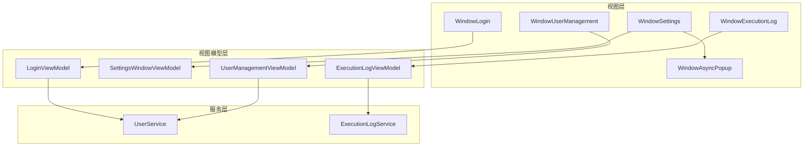
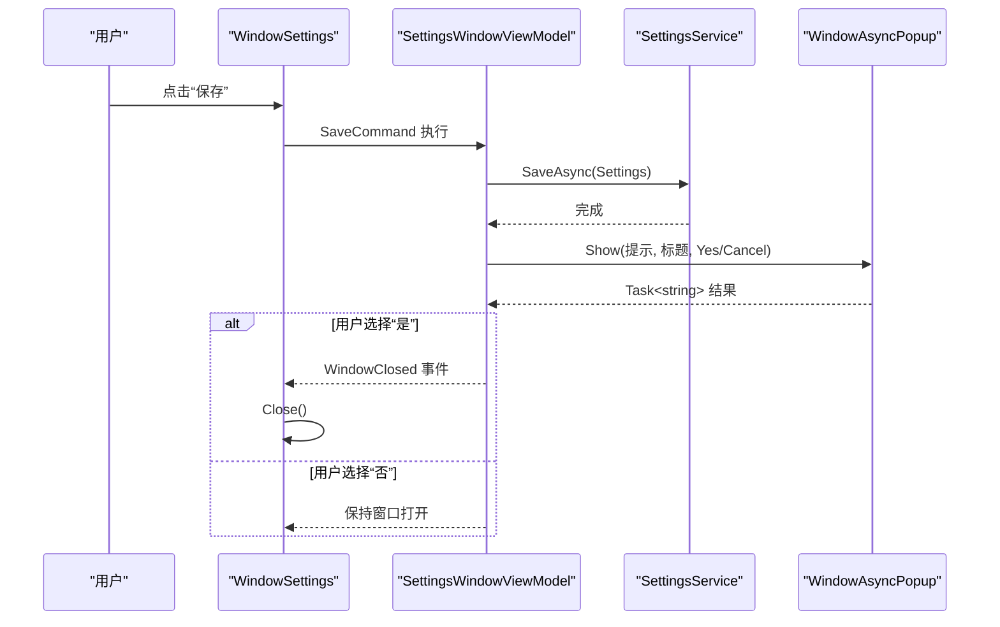
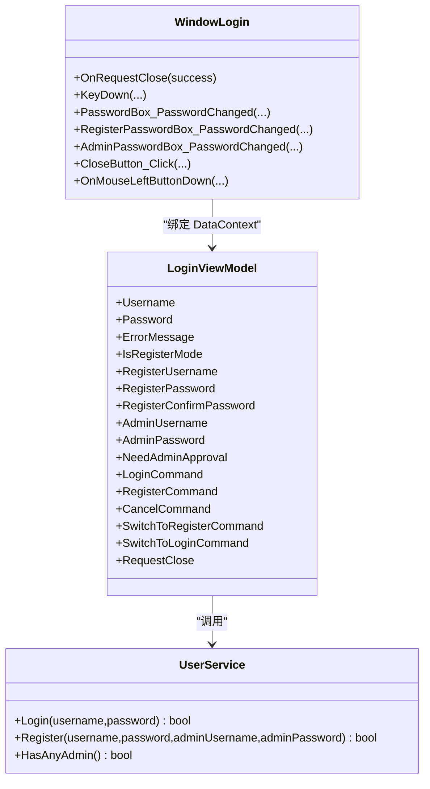
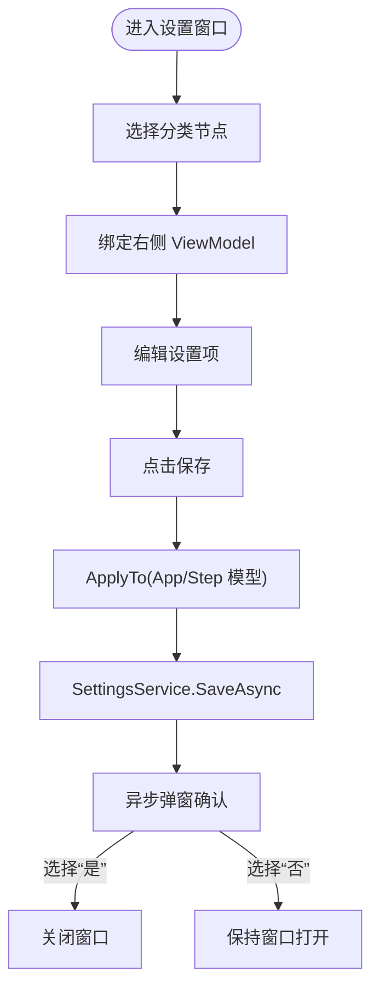
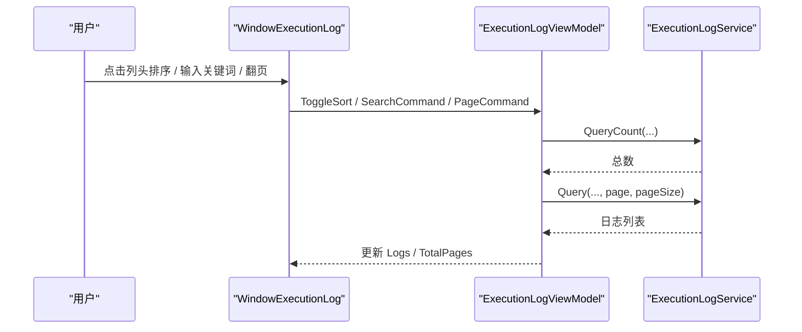
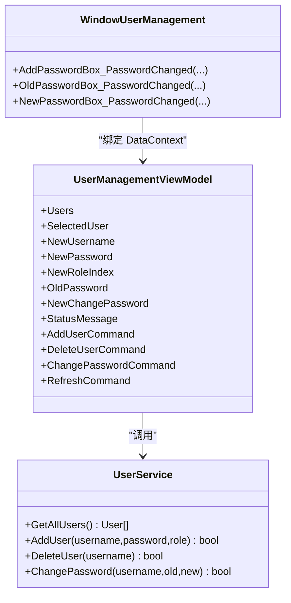
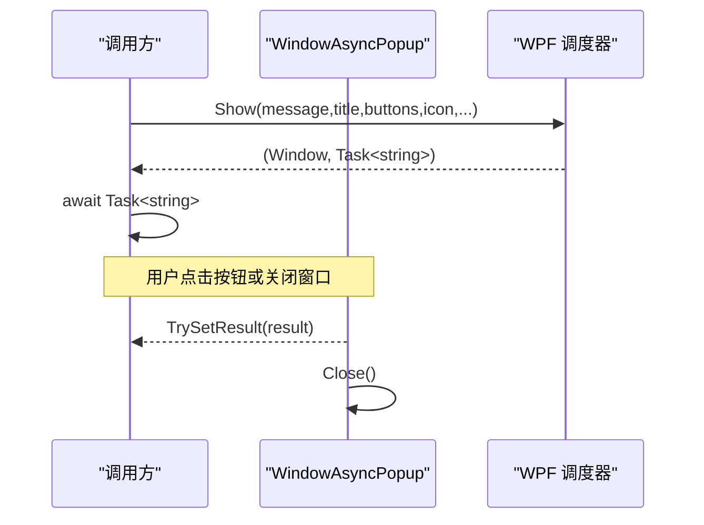
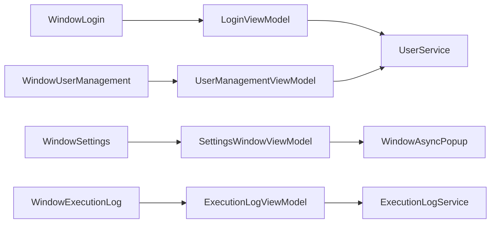

# 对话框窗口

<cite>
**本文引用的文件**   
- [WindowLogin.xaml.cs](file://ShaoLu/Views/WindowLogin.xaml.cs)
- [WindowLogin.xaml](file://ShaoLu/Views/WindowLogin.xaml)
- [LoginViewModel.cs](file://ShaoLu/Viewmodels/LoginViewModel.cs)
- [WindowSettings.xaml.cs](file://ShaoLu/Views/WindowSettings.xaml.cs)
- [WindowSettings.xaml](file://ShaoLu/Views/WindowSettings.xaml)
- [SettingsViewModel.cs](file://ShaoLu/Viewmodels/SettingsViewModel.cs)
- [WindowExecutionLog.xaml.cs](file://ShaoLu/Views/WindowExecutionLog.xaml.cs)
- [WindowExecutionLog.xaml](file://ShaoLu/Views/WindowExecutionLog.xaml)
- [ExecutionLogViewModel.cs](file://ShaoLu/Viewmodels/ExecutionLogViewModel.cs)
- [ExecutionLogService.cs](file://ShaoLu/Services/ExecutionLogService.cs)
- [WindowUserManagement.xaml.cs](file://ShaoLu/Views/WindowUserManagement.xaml.cs)
- [WindowUserManagement.xaml](file://ShaoLu/Views/WindowUserManagement.xaml)
- [UserManagementViewModel.cs](file://ShaoLu/Viewmodels/UserManagementViewModel.cs)
- [UserService.cs](file://ShaoLu/Services/UserService.cs)
- [WindowAsyncPopup.xaml.cs](file://ShaoLu/Views/WindowAsyncPopup.xaml.cs)
</cite>

## 目录
1. [简介](#简介)
2. [项目结构](#项目结构)
3. [核心组件](#核心组件)
4. [架构总览](#架构总览)
5. [详细组件分析](#详细组件分析)
6. [依赖关系分析](#依赖关系分析)
7. [性能考量](#性能考量)
8. [故障排查指南](#故障排查指南)
9. [结论](#结论)
10. [附录](#附录)

## 简介
本文件为 ShaoLu 的对话框窗口开发文档，聚焦登录窗口、设置窗口、执行日志窗口与用户管理窗口的实现细节。内容涵盖：
- 模态与非模态窗口的使用场景与差异
- 窗口间通信机制与数据传递模式（事件、命令、异步任务）
- 异步弹窗系统的实现（非阻塞 UI、结果回传、线程安全）
- 用户交互反馈与错误处理机制
- 窗口生命周期管理与资源清理最佳实践

## 项目结构
各窗口采用 WPF MVVM 模式组织：
- Views：窗口 XAML 与代码后置（UI 行为、事件绑定）
- ViewModels：业务逻辑、命令、状态与数据绑定
- Services：持久化与领域服务（用户、日志等）
- Models：数据模型（用户、字体、步骤执行日志等）

图表来源 
- [WindowLogin.xaml.cs:1-87](file://ShaoLu/Views/WindowLogin.xaml.cs#L1-L87)
- [WindowSettings.xaml.cs:1-85](file://ShaoLu/Views/WindowSettings.xaml.cs#L1-L85)
- [WindowExecutionLog.xaml.cs:1-47](file://ShaoLu/Views/WindowExecutionLog.xaml.cs#L1-L47)
- [WindowUserManagement.xaml.cs:1-33](file://ShaoLu/Views/WindowUserManagement.xaml.cs#L1-L33)
- [WindowAsyncPopup.xaml.cs:1-328](file://ShaoLu/Views/WindowAsyncPopup.xaml.cs#L1-L328)
- [LoginViewModel.cs:1-251](file://ShaoLu/Viewmodels/LoginViewModel.cs#L1-L251)
- [SettingsViewModel.cs:1-260](file://ShaoLu/Viewmodels/SettingsViewModel.cs#L1-L260)
- [ExecutionLogViewModel.cs:1-230](file://ShaoLu/Viewmodels/ExecutionLogViewModel.cs#L1-L230)
- [UserManagementViewModel.cs:1-194](file://ShaoLu/Viewmodels/UserManagementViewModel.cs#L1-L194)
- [UserService.cs:1-239](file://ShaoLu/Services/UserService.cs#L1-L239)
- [ExecutionLogService.cs:1-179](file://ShaoLu/Services/ExecutionLogService.cs#L1-L179)

章节来源
- [WindowLogin.xaml.cs:1-87](file://ShaoLu/Views/WindowLogin.xaml.cs#L1-L87)
- [WindowSettings.xaml.cs:1-85](file://ShaoLu/Views/WindowSettings.xaml.cs#L1-L85)
- [WindowExecutionLog.xaml.cs:1-47](file://ShaoLu/Views/WindowExecutionLog.xaml.cs#L1-L47)
- [WindowUserManagement.xaml.cs:1-33](file://ShaoLu/Views/WindowUserManagement.xaml.cs#L1-L33)
- [WindowAsyncPopup.xaml.cs:1-328](file://ShaoLu/Views/WindowAsyncPopup.xaml.cs#L1-L328)

## 核心组件
- 登录窗口（WindowLogin + LoginViewModel）
  - 支持登录与注册双模式切换；通过事件 RequestClose 将成功/失败结果回传给调用方
  - 密码输入通过 PasswordChanged 事件同步到 ViewModel
  - 键盘快捷键（Enter/Esc）提升交互效率
- 设置窗口（WindowSettings + SettingsWindowViewModel）
  - 树形分类导航，右侧滚动面板展示具体设置项
  - 保存后通过异步弹窗确认是否返回主界面
  - 支持全局字体应用至所有已打开窗口
- 执行日志窗口（WindowExecutionLog + ExecutionLogViewModel）
  - 支持关键字搜索、按文件名与时间范围筛选、列头排序、分页
  - 点击截断文本可预览完整内容（调用 WindowTextPreview）
- 用户管理窗口（WindowUserManagement + UserManagementViewModel）
  - 用户列表、新增用户、删除用户、修改密码
  - 操作反馈通过 StatusMessage 显示
- 异步弹窗系统（WindowAsyncPopup）
  - 非模态显示，不阻塞调用线程，返回 Task<string> 获取按钮结果
  - 支持自定义标题、图标、背景色、透明度、紧凑样式、富文本消息
  - 内部缓存系统图标，避免重复转换开销

章节来源
- [WindowLogin.xaml.cs:1-87](file://ShaoLu/Views/WindowLogin.xaml.cs#L1-L87)
- [LoginViewModel.cs:1-251](file://ShaoLu/Viewmodels/LoginViewModel.cs#L1-L251)
- [WindowSettings.xaml.cs:1-85](file://ShaoLu/Views/WindowSettings.xaml.cs#L1-L85)
- [SettingsViewModel.cs:1-260](file://ShaoLu/Viewmodels/SettingsViewModel.cs#L1-L260)
- [WindowExecutionLog.xaml.cs:1-47](file://ShaoLu/Views/WindowExecutionLog.xaml.cs#L1-L47)
- [ExecutionLogViewModel.cs:1-230](file://ShaoLu/Viewmodels/ExecutionLogViewModel.cs#L1-L230)
- [WindowUserManagement.xaml.cs:1-33](file://ShaoLu/Views/WindowUserManagement.xaml.cs#L1-L33)
- [UserManagementViewModel.cs:1-194](file://ShaoLu/Viewmodels/UserManagementViewModel.cs#L1-L194)
- [WindowAsyncPopup.xaml.cs:1-328](file://ShaoLu/Views/WindowAsyncPopup.xaml.cs#L1-L328)

## 架构总览
下图展示了四个主要窗口与其 ViewModel、服务的交互关系，以及异步弹窗在设置保存流程中的参与。

图表来源 
- [WindowSettings.xaml.cs:1-85](file://ShaoLu/Views/WindowSettings.xaml.cs#L1-L85)
- [SettingsViewModel.cs:1-260](file://ShaoLu/Viewmodels/SettingsViewModel.cs#L1-L260)
- [WindowAsyncPopup.xaml.cs:1-328](file://ShaoLu/Views/WindowAsyncPopup.xaml.cs#L1-L328)

## 详细组件分析

### 登录窗口（WindowLogin + LoginViewModel）
- 功能要点
  - 登录与注册双模式切换，支持管理员审批流程
  - 通过事件 RequestClose(bool) 通知调用方关闭并返回结果
  - 键盘快捷键：Esc 取消，Enter 触发当前模式命令
  - 密码框通过 PasswordChanged 事件同步到 ViewModel
- 数据流
  - View 绑定 ViewModel 属性与命令
  - ViewModel 调用 IUserService.Login/Register 进行认证与注册
  - 成功后通过 RequestClose(true) 关闭；失败时更新 ErrorMessage
- 错误处理
  - 空用户名/密码、密码不一致、长度不足等校验
  - 管理员审批缺失或验证失败时的错误提示

图表来源 
- [WindowLogin.xaml.cs:1-87](file://ShaoLu/Views/WindowLogin.xaml.cs#L1-L87)
- [LoginViewModel.cs:1-251](file://ShaoLu/Viewmodels/LoginViewModel.cs#L1-L251)
- [UserService.cs:1-239](file://ShaoLu/Services/UserService.cs#L1-L239)

章节来源
- [WindowLogin.xaml.cs:1-87](file://ShaoLu/Views/WindowLogin.xaml.cs#L1-L87)
- [WindowLogin.xaml:1-191](file://ShaoLu/Views/WindowLogin.xaml#L1-L191)
- [LoginViewModel.cs:1-251](file://ShaoLu/Viewmodels/LoginViewModel.cs#L1-L251)
- [UserService.cs:1-239](file://ShaoLu/Services/UserService.cs#L1-L239)

### 设置窗口（WindowSettings + SettingsWindowViewModel）
- 功能要点
  - 左侧 TreeView 分类导航，右侧 ScrollViewer 展示设置项
  - 保存后异步写入配置，并通过异步弹窗确认是否返回
  - 支持全局字体应用到所有已打开窗口
- 数据流
  - 选择分类节点 -> 设置 SelectedCategory -> 右侧 ContentControl 渲染对应 ViewModel
  - 保存时将 ViewModel 值回写到 Settings.App/Step 模型，再调用 SettingsService.SaveAsync
- 交互反馈
  - 保存成功后弹出确认弹窗，根据用户选择决定是否关闭窗口

图表来源 
- [WindowSettings.xaml.cs:1-85](file://ShaoLu/Views/WindowSettings.xaml.cs#L1-L85)
- [SettingsViewModel.cs:1-260](file://ShaoLu/Viewmodels/SettingsViewModel.cs#L1-L260)
- [WindowAsyncPopup.xaml.cs:1-328](file://ShaoLu/Views/WindowAsyncPopup.xaml.cs#L1-L328)

章节来源
- [WindowSettings.xaml.cs:1-85](file://ShaoLu/Views/WindowSettings.xaml.cs#L1-L85)
- [WindowSettings.xaml:1-79](file://ShaoLu/Views/WindowSettings.xaml#L1-L79)
- [SettingsViewModel.cs:1-260](file://ShaoLu/Viewmodels/SettingsViewModel.cs#L1-L260)

### 执行日志窗口（WindowExecutionLog + ExecutionLogViewModel）
- 功能要点
  - 支持关键字搜索、按文件名与日期范围筛选、列头排序、分页
  - DataGrid 默认排序被拦截，改用 ViewModel 的服务端排序
  - 点击截断文本可预览完整内容（调用 WindowTextPreview）
- 数据流
  - ViewModel 调用 ExecutionLogService.Query/QueryCount 获取数据
  - 结果填充 Logs 集合，更新 TotalPages 与分页命令可用性
- 错误处理
  - 查询异常记录 NLog 错误日志

图表来源 
- [WindowExecutionLog.xaml.cs:1-47](file://ShaoLu/Views/WindowExecutionLog.xaml.cs#L1-L47)
- [ExecutionLogViewModel.cs:1-230](file://ShaoLu/Viewmodels/ExecutionLogViewModel.cs#L1-L230)
- [ExecutionLogService.cs:1-179](file://ShaoLu/Services/ExecutionLogService.cs#L1-L179)

章节来源
- [WindowExecutionLog.xaml.cs:1-47](file://ShaoLu/Views/WindowExecutionLog.xaml.cs#L1-L47)
- [WindowExecutionLog.xaml:1-129](file://ShaoLu/Views/WindowExecutionLog.xaml#L1-L129)
- [ExecutionLogViewModel.cs:1-230](file://ShaoLu/Viewmodels/ExecutionLogViewModel.cs#L1-L230)
- [ExecutionLogService.cs:1-179](file://ShaoLu/Services/ExecutionLogService.cs#L1-L179)

### 用户管理窗口（WindowUserManagement + UserManagementViewModel）
- 功能要点
  - 用户列表展示、新增用户、删除用户、修改密码
  - 删除前二次确认，防止误删最后一个管理员
  - 操作结果通过 StatusMessage 反馈
- 数据流
  - ViewModel 调用 IUserService 进行 CRUD 操作
  - 成功后刷新用户列表并清空表单字段
- 错误处理
  - 必填校验、旧密码验证失败、删除限制等提示

图表来源 
- [WindowUserManagement.xaml.cs:1-33](file://ShaoLu/Views/WindowUserManagement.xaml.cs#L1-L33)
- [UserManagementViewModel.cs:1-194](file://ShaoLu/Viewmodels/UserManagementViewModel.cs#L1-L194)
- [UserService.cs:1-239](file://ShaoLu/Services/UserService.cs#L1-L239)

章节来源
- [WindowUserManagement.xaml.cs:1-33](file://ShaoLu/Views/WindowUserManagement.xaml.cs#L1-L33)
- [WindowUserManagement.xaml:1-100](file://ShaoLu/Views/WindowUserManagement.xaml#L1-L100)
- [UserManagementViewModel.cs:1-194](file://ShaoLu/Viewmodels/UserManagementViewModel.cs#L1-L194)
- [UserService.cs:1-239](file://ShaoLu/Services/UserService.cs#L1-L239)

### 异步弹窗系统（WindowAsyncPopup）
- 设计目标
  - 非模态显示，不阻塞调用线程，允许主窗口继续响应（如停止按钮）
  - 通过 TaskCompletionSource<string> 返回用户选择的按钮值
  - 支持自定义标题、图标、背景色、透明度、紧凑样式、富文本消息
- 关键实现
  - Show(...) 静态方法统一创建与显示，确保在 UI 线程创建
  - CreateAndShow(...) 负责初始化窗口、应用样式、生成按钮、绑定关闭事件
  - 关闭事件保证未完成任务被完成，避免挂起
  - CloseWithResult(...) 外部触发关闭并设置结果（超时/步骤到达模式）
- 性能优化
  - 系统图标预加载缓存，避免重复 GDI+ 到 WPF 的转换

图表来源 
- [WindowAsyncPopup.xaml.cs:1-328](file://ShaoLu/Views/WindowAsyncPopup.xaml.cs#L1-L328)

章节来源
- [WindowAsyncPopup.xaml.cs:1-328](file://ShaoLu/Views/WindowAsyncPopup.xaml.cs#L1-L328)

## 依赖关系分析
- 视图与视图模型
  - 通过 DataContext 绑定，命令与属性驱动 UI 更新
- 视图模型与服务
  - LoginViewModel/UserManagementViewModel 依赖 IUserService
  - ExecutionLogViewModel 依赖 ExecutionLogService
- 跨窗口通信
  - 登录窗口通过事件 RequestClose 向调用方返回结果
  - 设置窗口通过事件 WindowClosed 通知关闭
  - 异步弹窗通过 Task<string> 返回用户选择

图表来源 
- [WindowLogin.xaml.cs:1-87](file://ShaoLu/Views/WindowLogin.xaml.cs#L1-L87)
- [WindowSettings.xaml.cs:1-85](file://ShaoLu/Views/WindowSettings.xaml.cs#L1-L85)
- [WindowExecutionLog.xaml.cs:1-47](file://ShaoLu/Views/WindowExecutionLog.xaml.cs#L1-L47)
- [WindowUserManagement.xaml.cs:1-33](file://ShaoLu/Views/WindowUserManagement.xaml.cs#L1-L33)
- [LoginViewModel.cs:1-251](file://ShaoLu/Viewmodels/LoginViewModel.cs#L1-L251)
- [SettingsViewModel.cs:1-260](file://ShaoLu/Viewmodels/SettingsViewModel.cs#L1-L260)
- [ExecutionLogViewModel.cs:1-230](file://ShaoLu/Viewmodels/ExecutionLogViewModel.cs#L1-L230)
- [UserManagementViewModel.cs:1-194](file://ShaoLu/Viewmodels/UserManagementViewModel.cs#L1-L194)
- [UserService.cs:1-239](file://ShaoLu/Services/UserService.cs#L1-L239)
- [ExecutionLogService.cs:1-179](file://ShaoLu/Services/ExecutionLogService.cs#L1-L179)
- [WindowAsyncPopup.xaml.cs:1-328](file://ShaoLu/Views/WindowAsyncPopup.xaml.cs#L1-L328)

章节来源
- [WindowLogin.xaml.cs:1-87](file://ShaoLu/Views/WindowLogin.xaml.cs#L1-L87)
- [WindowSettings.xaml.cs:1-85](file://ShaoLu/Views/WindowSettings.xaml.cs#L1-L85)
- [WindowExecutionLog.xaml.cs:1-47](file://ShaoLu/Views/WindowExecutionLog.xaml.cs#L1-L47)
- [WindowUserManagement.xaml.cs:1-33](file://ShaoLu/Views/WindowUserManagement.xaml.cs#L1-L33)
- [LoginViewModel.cs:1-251](file://ShaoLu/Viewmodels/LoginViewModel.cs#L1-L251)
- [SettingsViewModel.cs:1-260](file://ShaoLu/Viewmodels/SettingsViewModel.cs#L1-L260)
- [ExecutionLogViewModel.cs:1-230](file://ShaoLu/Viewmodels/ExecutionLogViewModel.cs#L1-L230)
- [UserManagementViewModel.cs:1-194](file://ShaoLu/Viewmodels/UserManagementViewModel.cs#L1-L194)
- [UserService.cs:1-239](file://ShaoLu/Services/UserService.cs#L1-L239)
- [ExecutionLogService.cs:1-179](file://ShaoLu/Services/ExecutionLogService.cs#L1-L179)
- [WindowAsyncPopup.xaml.cs:1-328](file://ShaoLu/Views/WindowAsyncPopup.xaml.cs#L1-L328)

## 性能考量
- 异步弹窗图标缓存：静态字典缓存系统图标，避免重复转换
- 富文本渲染：FlowDocument 级别应用字体，减少控件级设置开销
- 大数据量日志：服务端分页与排序，降低 UI 内存占用
- 数据库访问：FreeSql Lazy 初始化，避免不必要的连接开销
- 字体全局应用：一次性遍历 Application.Current.Windows 应用字体，避免重复计算

[本节为通用性能建议，无需特定文件引用]

## 故障排查指南
- 登录失败
  - 检查用户名/密码是否为空
  - 检查密码哈希验证逻辑与盐值存储
  - 查看 IUserService.Login 返回值与错误消息
- 注册失败
  - 校验密码一致性、长度、管理员审批信息
  - 若存在管理员账户，需正确提供管理员凭据
- 设置保存无效
  - 确认 ApplyTo 已将 ViewModel 值写回模型
  - 检查 SettingsService.SaveAsync 是否抛出异常
  - 异步弹窗结果是否正确处理
- 日志查询无结果
  - 检查筛选条件（关键字、文件名、时间范围）
  - 确认数据库路径与表结构是否正确初始化
  - 查看 NLog 错误日志
- 用户管理操作失败
  - 删除用户时注意不能删除最后一个管理员
  - 修改密码需验证旧密码正确性

章节来源
- [LoginViewModel.cs:1-251](file://ShaoLu/Viewmodels/LoginViewModel.cs#L1-L251)
- [UserService.cs:1-239](file://ShaoLu/Services/UserService.cs#L1-L239)
- [SettingsViewModel.cs:1-260](file://ShaoLu/Viewmodels/SettingsViewModel.cs#L1-L260)
- [ExecutionLogViewModel.cs:1-230](file://ShaoLu/Viewmodels/ExecutionLogViewModel.cs#L1-L230)
- [ExecutionLogService.cs:1-179](file://ShaoLu/Services/ExecutionLogService.cs#L1-L179)
- [UserManagementViewModel.cs:1-194](file://ShaoLu/Viewmodels/UserManagementViewModel.cs#L1-L194)

## 结论
ShaoLu 的对话框窗口基于 WPF MVVM 模式构建，具备良好的职责分离与可扩展性。登录、设置、日志与用户管理等窗口均通过 ViewModel 与 Service 解耦，结合异步弹窗系统实现了非阻塞的用户交互。通过事件、命令与 Task 的结果回传机制，窗口间通信清晰可靠。遵循本文的最佳实践，可有效提升用户体验与系统稳定性。

[本节为总结性内容，无需特定文件引用]

## 附录
- 模态与非模态窗口使用建议
  - 模态窗口：需要强制用户完成操作后再继续（如登录）
  - 非模态窗口：允许后台运行与并行交互（如执行日志、设置）
- 窗口生命周期与资源清理
  - 订阅事件需在窗口关闭时解除引用，避免内存泄漏
  - 异步弹窗 Closed 事件中完成 TaskCompletionSource，防止挂起
  - 大对象（如图片、文档）在窗口销毁时释放引用
- 数据传递模式
  - 简单参数：构造函数注入 ViewModel
  - 复杂交互：事件（RequestClose、WindowClosed）
  - 异步结果：Task<string> 返回用户选择

[本节为通用指导，无需特定文件引用]